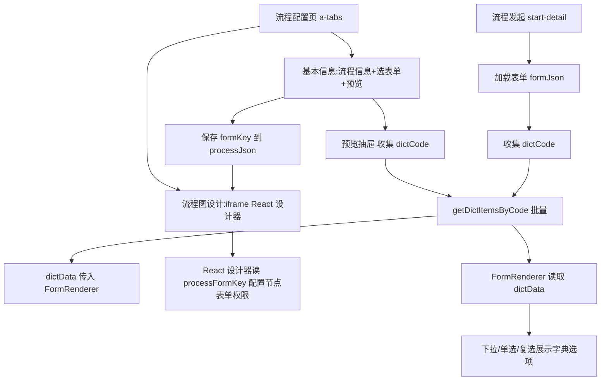

## 产品概述

将「流程配置」页面由单页卡片改造为两个标签页（基本信息、流程图设计），并修复表单下拉/单选/复选引用数据字典时不显示选项的问题。该字典问题同时存在于「流程配置页选择表单后的预览」与「流程发起页」两个入口。

## 核心功能

- 基本信息标签页：展示流程基本信息（标识、名称、类型、分类、描述、状态），并支持配置关联表单（选择表单、预览表单）。
- 流程图设计标签页：嵌入现有独立 React 流程设计器（iframe 形式），支持用户绘制流程图、配置节点属性与节点表单权限。
- 基本信息配置表单后，支持「预览」即时查看表单（含数据字典下拉项），并通过保存将表单 formKey 传递写入流程定义 processJson，供流程图设计标签中的节点表单权限配置使用。
- 流程配置预览抽屉与流程发起页渲染同一表单时，下拉/单选/复选组件均能正确加载并展示数据字典选项。
- 修正表单渲染组件对数据字典返回字段（itemValue/itemText）的映射错误，统一选项取值规范。

## 技术栈

- 前端：Vue 3 + Ant Design Vue + Vite（flow-web）
- 流程设计器：独立 React 应用（flow-designer，DEV 运行于 3001），以 iframe 嵌入流程配置页（保持现有设计，不改动设计器内部）
- 后端：Spring Boot（flow-engine，端口 3000）+ SQLite；字典接口 GET /system/dict/items/code/{dictCode} 返回 List<DictItem>（字段 itemValue/itemText）
- 复用：FormRenderer.vue（统一表单渲染）、api/dict.js 的 getDictItemsByCode、designer.vue 的 iframe 嵌入机制

## 实现方案

### 策略

围绕「字典数据加载与字段映射」闭环修复（根因1、2），并将流程配置页单页卡片重构为 a-tabs 两个标签页（根因3、4）。改动复用现有 dictData prop、getDictItemsByCode 与设计器 iframe 机制，不新增接口/状态机、不改后端、不改设计器内部代码。

### 关键技术决策

1. **FormRenderer 字典字段映射修正**：getFieldOptions 对 dict 分支原先读取 it[field.value]||it.dictValue 与 it[field.text]||it.dictLabel，但后端返回字段为 itemValue/itemText，导致取不到值。统一改为 opts.map(it => ({ value: it.itemValue, text: it.itemText }))，与后端 DictItem 真实结构及 FormRenderer 内部 {value,text} 规范一致；getDisplayValue（约 449 行）同样改为 { value: it.value, text: it.text }。
2. **流程配置页标签化**：用 a-tabs 包裹，标签1「基本信息」放置流程基础信息（a-descriptions）与选表单、预览按钮；标签2「流程图设计」复用现有 designer.vue 的 iframe 容器（DEV 指向 localhost:3001，PROD 指向 /designer），并保留节点表单权限说明。顶部按钮区（返回/保存配置）保留在 tabs 之上。
3. **预览传 dictData**：在 config 预览抽屉打开前，遍历 selectedForm.formJson 字段收集 dictCode，去重后调 getDictItemsByCode 批量组装 {[dictCode]:[{value,text}]}，绑到 FormRenderer 的 :dict-data。引入 getDictItemsByCode（api/dict）。
4. **表单传递（已具备，仅需放宽）**：现有 handleSaveConfig 已将 selectedFormKey 写入 processDef.processJson.formKey；放宽为「无 processJson 时初始化 {formKey, nodes:[], edges:[]}」而非拒绝保存，确保未设计流程图也能持久化表单关联，从而流程图设计标签 iframe 加载该定义即可读取 formKey 配置节点表单权限。
5. **流程发起传 dictData**：start-detail.vue 加载表单后，遍历 formJson 字段中的 dictCode 批量加载并组装 dictData，传入 FormRenderer（需从 api/dict 引入 getDictItemsByCode）。

### 性能与可靠性

- 字典按 dictCode 去重后批量请求，同表单内重复 dictCode 只请求一次，避免 N+1。
- 异常在 try/catch 中吞掉，单字典失败不影响其余字段与表单渲染。
- dictData 仅在表单加载/预览打开时计算，不增加额外渲染开销。

### 避免技术债

- 复用现有 dictData prop 与 getDictItemsByCode，不新建字典加载机制，不改后端、不改设计器内部。
- 不改动表单设计器（form/design/index.vue，上一轮已修复）。

## 实现要点

- FormRenderer.vue（约 398-401、449 行）：字典项映射改为 itemValue→value、itemText→text。
- config/index.vue：外包 a-tabs；预览抽屉计算 dictData 并传 :dict-data；引入 getDictItemsByCode；handleSaveConfig 放宽无 processJson 时初始化。
- start-detail.vue：加载表单后计算 dictData 并传 :dict-data；引入 getDictItemsByCode。

## 架构设计

单组件局部修复 + 共享 FormRenderer，不改跨模块架构：



## 目录结构

```
flow-web/src/
├── components/FormRenderer.vue        # [MODIFY] 修正 getFieldOptions 与 getDisplayValue 中字典项字段映射(itemValue/itemText)。
├── views/process/config/index.vue    # [MODIFY] 重构为 a-tabs(基本信息/流程图设计);预览抽屉组装 dictData 传入 FormRenderer;放宽 handleSaveConfig 初始化 processJson;引入 getDictItemsByCode。
└── views/task/start-detail.vue       # [MODIFY] 加载表单后按字段 dictCode 组装 dictData 并传入 FormRenderer;引入 getDictItemsByCode。
```

## 关键代码结构（仅描述意图，沿用现有签名）

- `function getFieldOptions(field)`：dict 分支返回 props.dictData[field.dictCode]?.map(it => ({ value: it.itemValue, text: it.itemText })) || []

## Agent Extensions

### Skill

- **playwright-cli**
- Purpose: 修复后访问流程配置页与流程发起页，验证表单下拉/字典选项正确展示，并验证标签页切换与表单传递。
- Expected outcome: 生成浏览器验证截图/日志，确认预览与流程发起的下拉均显示 moni_hazardous_category 字典项，且基本信息表单可传递到流程图设计标签用于节点表单权限。