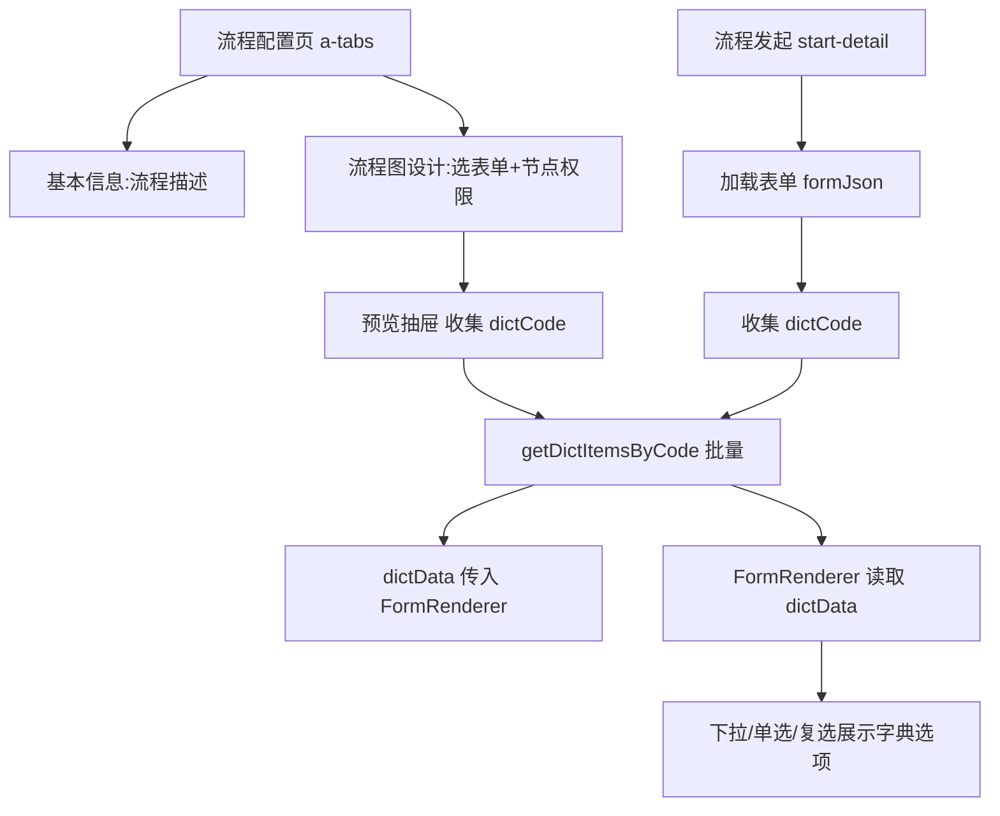

## 用户需求

流程定义-流程配置页面改造与表单字典下拉修复。

## 产品概述

将「流程配置」页面由单页卡片布局改造为两个标签页(基本信息、流程图设计);同时修复表单在下拉/单选/复选场景中引用数据字典时不显示选项的问题。该问题同时存在于「流程配置页选择表单后的预览」与「流程发起页」两个入口。

## 核心功能

- 流程配置页改为两个标签页:「基本信息」展示流程标识、名称、类型、分类、描述等;「流程图设计」承载选表单与节点表单权限等内容。
- 流程配置页选择表单后,点击「预览」,表单中引用数据字典(如类别)的下拉选项正确展示字典值。
- 流程发起页渲染同一表单时,下拉/单选/复选项同样能加载并展示数据字典选项。
- 修正表单渲染组件对数据字典返回字段(itemValue/itemText)的映射错误,统一选项取值规范。

## 技术栈

- 前端:Vue 3 + Ant Design Vue + Vite(flow-web)
- 后端:Spring Boot(flow-engine,端口 3000)+ SQLite,字典接口 GET /system/dict/items/code/{dictCode} 返回 List<DictItem>(字段 itemValue/itemText)
- 复用组件:FormRenderer.vue(统一表单渲染)、api/dict.js 的 getDictItemsByCode

## 实现方案

### 策略

围绕「字典数据加载与映射」闭环修复:先修正 FormRenderer 内部对字典项字段的映射错误(根因1),再在两个入口(流程配置预览、流程发起)按表单字段中的 dictCode 批量拉取字典项并组装为 `dictData` 传入 FormRenderer(根因2)。同时将流程配置页单页卡片重构为 a-tabs 两个标签页。改动均复用现有 dictItemsByCode 与 FormRenderer 的 dictData prop,不新增接口/状态机。

### 关键技术决策

1. **FormRenderer 字典字段映射修正**:`getFieldOptions` 对 dict 分支原先读取 `it[field.value]||it.dictValue` 与 `it[field.text]||it.dictLabel`,但后端返回字段为 `itemValue/itemText`,导致取不到值。统一改为 `opts.map(it => ({ value: it.itemValue, text: it.itemText }))`,与字典项真实结构及 FormRenderer 内部 `{value,text}` 规范一致;只读 `getDisplayValue` 中 449 行同样改为 `{ value: it.value, text: it.text }`。
2. **流程配置预览传 dictData**:在 config/index.vue 预览前,遍历 selectedForm.formJson 字段收集 dictCode,调用 getDictItemsByCode 组装 `{[dictCode]:[{value,text}]}` 绑到 FormRenderer 的 :dict-data。
3. **流程发起传 dictData**:start-detail.vue 加载表单后将 formJson 字段中的 dictCode 批量加载,组装 dictData 传入 FormRenderer;需从 api/dict 引入 getDictItemsByCode。
4. **流程配置页标签化**:用 a-tabs 包裹,标签1「基本信息」放置流程基础信息(a-descriptions),标签2「流程图设计」放置选表单与节点表单权限内容,按钮区(返回/保存/设计流程图)保留在标签页之上。

### 性能与可靠性

- 字典按 dictCode 去重后批量请求,同表单内重复 dictCode 只请求一次,避免 N+1。
- 异常在 try/catch 中吞掉,单字典失败不影响其余字段与表单渲染。
- dictData 仅在表单加载/预览打开时计算,不增加额外渲染开销。

### 避免技术债

- 复用现有 dictData prop 与 getDictItemsByCode,不新建字典加载机制,不改后端。
- 不改动表单设计器 index.vue(上一轮已修复)。

## 实现要点

- FormRenderer.vue(约398-401、449行):字典项映射改为 itemValue→value、itemText→text。
- config/index.vue:外包 a-tabs;预览抽屉计算 dictData 并传 :dict-data;引入 getDictItemsByCode。
- start-detail.vue:加载表单后计算 dictData 并传 :dict-data;引入 getDictItemsByCode。

## 架构设计

单组件局部修复 + 共享 FormRenderer,不改跨模块架构:



## 目录结构

```
flow-web/src/
├── components/FormRenderer.vue        # [MODIFY] 修正 getFieldOptions 与 getDisplayValue 中字典项字段映射(itemValue/itemText)。
├── views/process/config/index.vue    # [MODIFY] 重构为 a-tabs(基本信息/流程图设计);预览抽屉组装 dictData 传入 FormRenderer;引入 getDictItemsByCode。
└── views/task/start-detail.vue       # [MODIFY] 加载表单后按字段 dictCode 组装 dictData 并传入 FormRenderer;引入 getDictItemsByCode。
```

## 关键代码结构

- `function getFieldOptions(field)`:dict 分支返回 `props.dictData[field.dictCode]?.map(it => ({ value: it.itemValue, text: it.itemText })) || []`(仅描述意图,沿用现有签名)。

## Agent Extensions

### Skill

- **playwright-cli**
- Purpose: 修复后访问流程配置页与流程发起页,验证表单下拉/字典选项正确展示。
- Expected outcome: 生成浏览器验证截图/日志,确认预览与流程发起的下拉均显示 moni_hazardous_category 字典项。