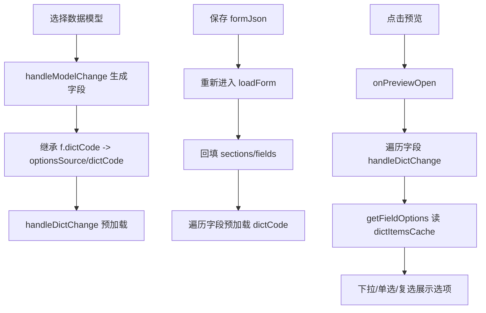

## 用户需求

表单设计器中，选择数据模型后表单组件能绑定模型中定义的属性；保存配置后重新进入设计界面能自动回填数据；预览时下拉选项组件（数据引用数据字典）需正常展示字典选项。

## 产品概述

表单设计器在“绑定数据模型”场景下，需要支持：(1) 绑定模型时自动生成的表单字段继承模型字段上定义的字典引用（optionsSource/dictCode）；(2) 重新进入设计时根据保存的 formJson 完整回填布局与字段配置，并预加载字典缓存；(3) 点击“预览”时下拉/单选/复选等组件能正确展示数据字典选项，不再出现空白。

## 核心功能

- 绑定模型自动生成字段时继承模型字段的 dictCode（字典来源）与 optionsSource
- 保存后重新进入设计界面自动回填表单布局、字段属性及字典引用
- 预览抽屉打开时确保字典项已加载并渲染下拉选项
- 保持手动配置字典与模型继承字典两种路径一致

## 技术栈

- 前端：Vue 3 + Ant Design Vue + Vite（flow-web），脚本 `npm run dev`
- 数据模型/字典后端：Spring Boot（flow-engine，端口 3000），SQLite
- 设计器组件：`flow-web/src/views/form/design/index.vue`
- 字典 API：`getDictItemsByCode(dictCode)` → `GET /system/dict/items/code/{dictCode}`，返回项含 `itemValue`/`itemText`

## 实现方案

### 策略

以修改设计器 `index.vue` 为主，围绕“模型字段字典继承”“回填字典预加载”“预览字典加载”三个环节闭环修复，复用现有 `dictItemsCache`（reactive）+ `handleDictChange` 模式，不引入新状态机或新接口。

### 关键技术决策

1. **模型字段字典继承**：`handleModelChange` 自动生成字段时，由写死 `optionsSource:null, dictCode:null` 改为读取模型字段 `f.dictCode`，存在则设置 `optionsSource:'dict', dictCode:f.dictCode` 并触发 `handleDictChange` 预加载，使画布与属性面板正确显示“字典”标签与字典选择。
2. **回填预加载增强**：`loadForm` 现有对 `f.dictCode` 调 `handleDictChange` 逻辑保留，并补充对 `optionsSource==='dict' && dictCode` 的兼容判断，确保初始化表单（如 hazardous_inbound 的 category 字段）也能命中。
3. **预览字典加载**：`onPreviewOpen` 在 `loadDeptTree()` 基础上，遍历 `sections` 中所有字段，对 `optionsSource==='dict' && dictCode` 调用 `handleDictChange(dictCode)`（async 已存在缓存则跳过），保证预览渲染前缓存就绪，下拉展示选项。
4. **渲染取值不变**：设计器预览的 `getFieldOptions` 已依赖 `dictItemsCache[field.dictCode]`，缓存填充后 374-385 行 select/radio/checkbox 即可正常渲染。

### 性能与可靠性

- `handleDictChange` 已有 `dictItemsCache[code]` 短路，重复字段不会重复请求，避免 N 次网络调用。
- 仅在“绑定模型生成”“回填”“预览打开”三个时机触发加载，不增加额外渲染开销。
- 异常已在 `try/catch` 中吞掉，不影响主流程；可加 `message.error` 轻微提示（可选）。

### 避免技术债

- 复用现有 `dictItemsCache` 与 `handleDictChange`，不新建字典加载机制。
- 不改后端、不改 FormRenderer/TaskFormDrawer（其已正确支持 dictData）。
- 不改动数据库初始化；仅前端在已有数据（hazardous_inbound 表单、moni_hazardous_category 字典）上验证。

## 实现要点

- 修改 `flow-web/src/views/form/design/index.vue`：
- `handleModelChange`（约 746-750 行）：字段映射增加 `optionsSource: f.dictCode ? 'dict' : null, dictCode: f.dictCode || null`，并在生成后对非 null dictCode 调 `handleDictChange(f.dictCode)`。
- `loadForm`（约 801-804 行）：判断条件改为 `if ((f.optionsSource === 'dict' || f.dictCode) && f.dictCode && !dictItemsCache[f.dictCode]) handleDictChange(f.dictCode)`。
- `onPreviewOpen`（约 502 行）：在 `loadDeptTree()` 后，遍历所有 section/row/cell/field，对 `field.optionsSource==='dict' && field.dictCode` 调 `handleDictChange(field.dictCode)`。

## 架构设计

设计器单组件内部闭环，不改动跨模块架构：

- 数据模型列表/字典类型列表（onMounted 已加载）
- 绑定模型 → 生成字段（继承 dictCode）
- 保存 → formJson（含 dictCode）
- 重新进入 → loadForm 回填 + 预加载字典
- 预览 → onPreviewOpen 确保字典缓存 → 下拉渲染



## 目录结构

```
flow-web/src/views/form/design/
└── index.vue   # [MODIFY] 表单设计器主组件。修改点：
                # 1) handleModelChange 自动生成字段继承模型字段 dictCode/optionsSource 并预加载；
                # 2) loadForm 回填时对所有 dict 字段预加载字典缓存；
                # 3) onPreviewOpen 预览打开时遍历字段确保字典项已加载。
                # 复用 dictItemsCache(reactive) 与 handleDictChange，不新增接口/状态。
```

## 关键代码结构（无需新增类型，复用现有函数签名）

- `handleDictChange(code: string): Promise<void>` —— 已存在，按 dictCode 加载并写入 `dictItemsCache[code]`（有缓存则跳过）
- `getFieldOptions(field): Array<{value,text}>` —— 已存在，dict 类型读取 `dictItemsCache[field.dictCode]`

## Agent Extensions

### Skill

- **playwright-cli**
- Purpose: 在修复后启动前端与后端，访问 `/form/design?formKey=hazardous_inbound`，模拟选择数据模型、保存、重新进入、预览，验证下拉选项展示。
- Expected outcome: 生成浏览器验证截图/日志，确认类别下拉在预览中展示 moni_hazardous_category 字典项，且重新进入能回填。