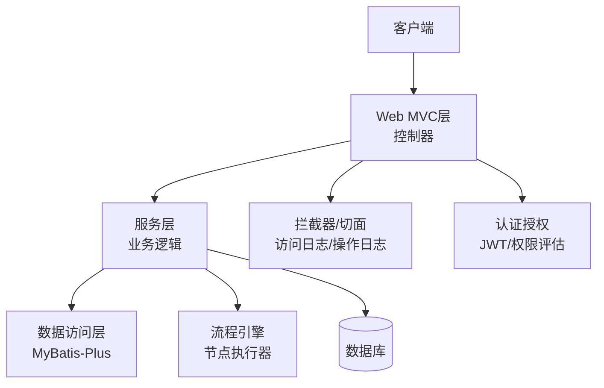
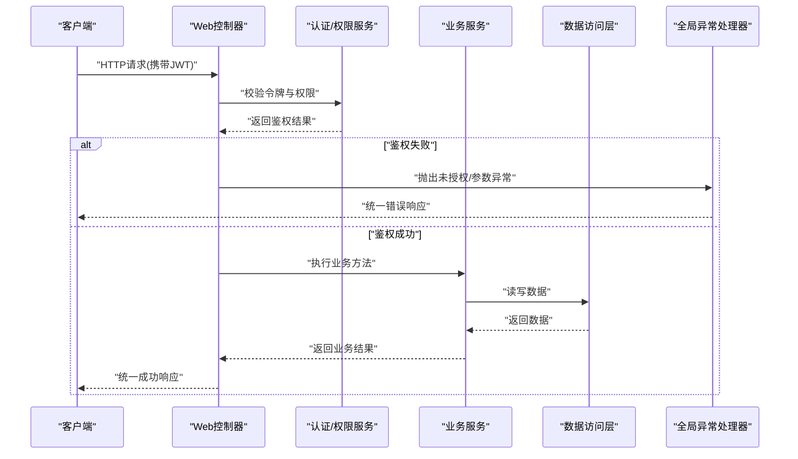
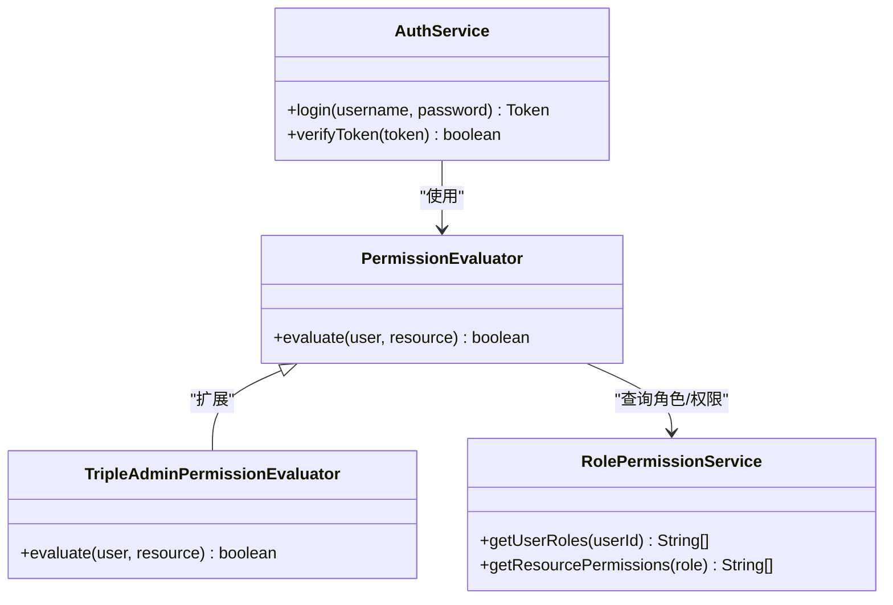
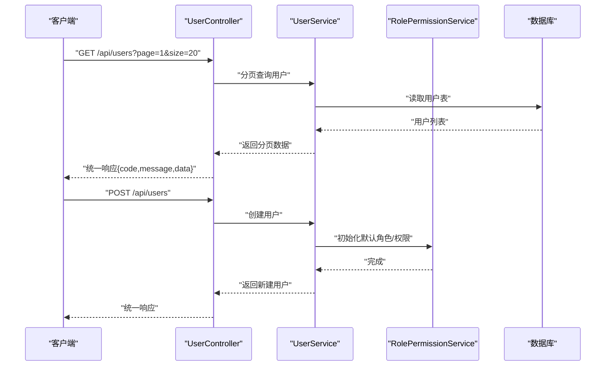
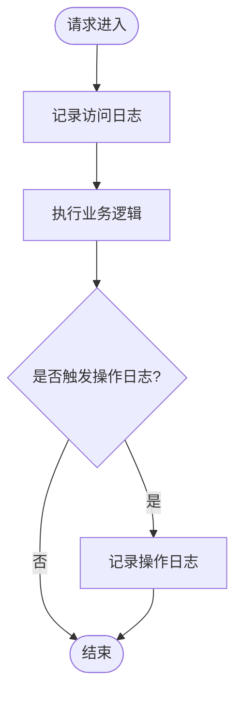
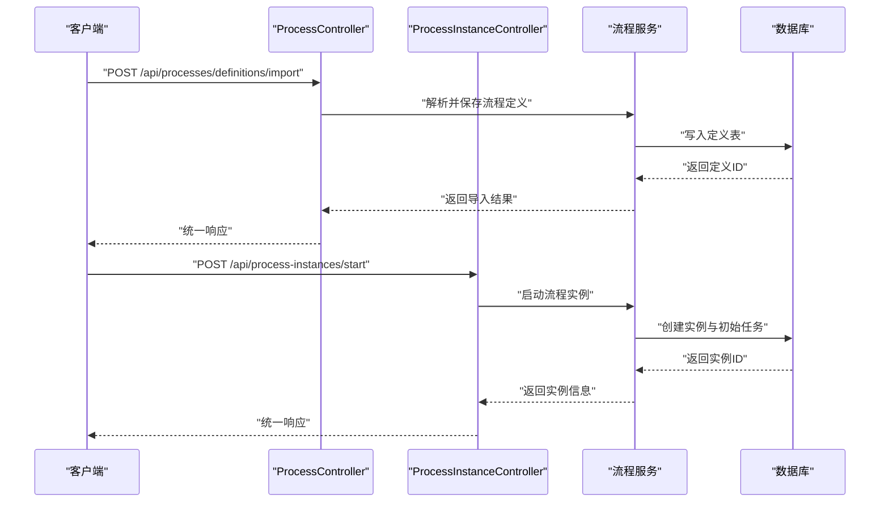
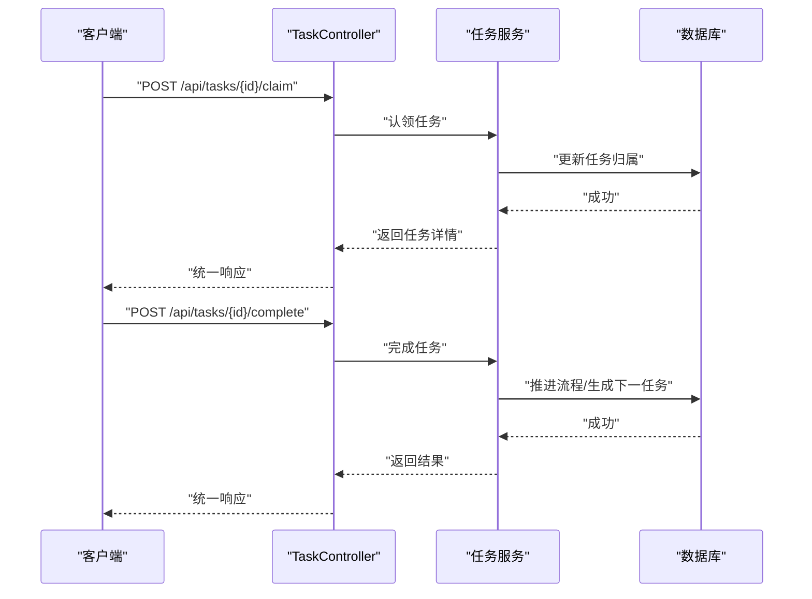
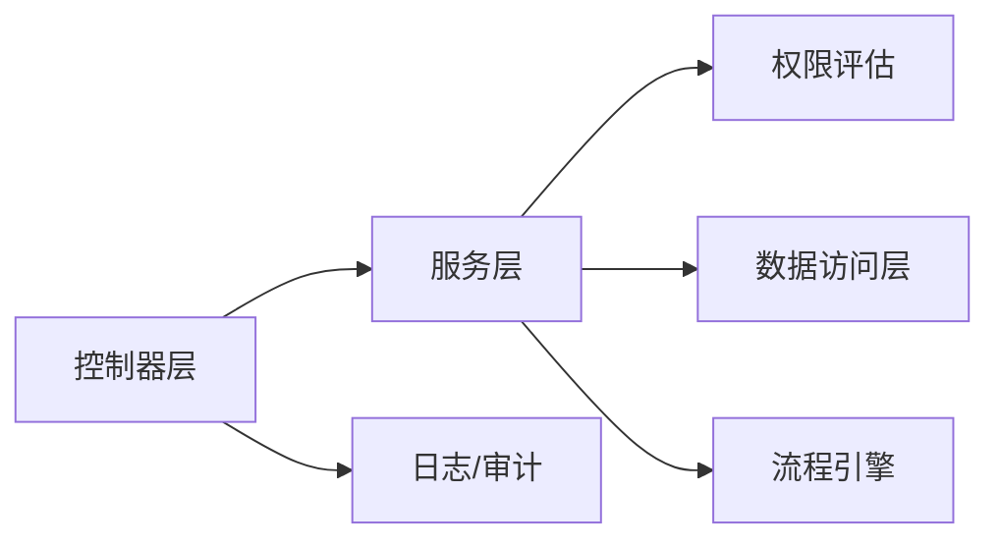

# API接口文档

<cite>
**本文引用的文件**   
- [FlowEngineApplication.java](file://flow-engine/src/main/java/com/flow/engine/FlowEngineApplication.java)
- [WebMvcConfig.java](file://flow-engine/src/main/java/com/flow/engine/config/WebMvcConfig.java)
- [GlobalExceptionHandler.java](file://flow-engine/src/main/java/com/flow/engine/common/GlobalExceptionHandler.java)
- [Result.java](file://flow-engine/src/main/java/com/flow/engine/common/Result.java)
- [ErrorCode.java](file://flow-engine/src/main/java/com/flow/engine/common/ErrorCode.java)
- [IResultCode.java](file://flow-engine/src/main/java/com/flow/engine/common/IResultCode.java)
- [AuthController.java](file://flow-engine/src/main/java/com/flow/engine/controllers/AuthController.java)
- [UserController.java](file://flow-engine/src/main/java/com/flow/engine/controllers/UserController.java)
- [RoleController.java](file://flow-engine/src/main/java/com/flow/engine/controllers/RoleController.java)
- [PermissionController.java](file://flow-engine/src/main/java/com/flow/engine/controllers/PermissionController.java)
- [DeptController.java](file://flow-engine/src/main/java/com/flow/engine/controllers/DeptController.java)
- [DictController.java](file://flow-engine/src/main/java/com/flow/engine/controllers/DictController.java)
- [LogController.java](file://flow-engine/src/main/java/com/flow/engine/controllers/LogController.java)
- [MonitorController.java](file://flow-engine/src/main/java/com/flow/engine/controllers/MonitorController.java)
- [AdminController.java](file://flow-engine/src/main/java/com/flow/engine/controllers/AdminController.java)
- [ProcessController.java](file://flow-engine/src/main/java/com/flow/engine/controller/ProcessController.java)
- [ProcessInstanceController.java](file://flow-engine/src/main/java/com/flow/engine/controller/ProcessInstanceController.java)
- [TaskController.java](file://flow-engine/src/main/java/com/flow/engine/controller/TaskController.java)
- [DataModelController.java](file://flow-engine/src/main/java/com/flow/engine/controller/DataModelController.java)
- [WebhookController.java](file://flow-engine/src/main/java/com/flow/engine/controllers/WebhookController.java)
- [RequestContext.java](file://flow-engine/src/main/java/com/flow/engine/common/RequestContext.java)
- [RequestIdFilter.java](file://flow-engine/src/main/java/com/flow/engine/common/RequestIdFilter.java)
- [AuthService.java](file://flow-engine/src/main/java/com/flow/engine/service/AuthService.java)
- [UserService.java](file://flow-engine/src/main/java/com/flow/engine/service/UserService.java)
- [RolePermissionService.java](file://flow-engine/src/main/java/com/flow/engine/service/RolePermissionService.java)
- [PermissionEvaluator.java](file://flow-engine/src/main/java/com/flow/engine/service/PermissionEvaluator.java)
- [TripleAdminPermissionEvaluator.java](file://flow-engine/src/main/java/com/flow/engine/service/TripleAdminPermissionEvaluator.java)
- [OperationLogAspect.java](file://flow-engine/src/main/java/com/flow/engine/aspect/OperationLogAspect.java)
- [AccessLogInterceptor.java](file://flow-engine/src/main/java/com/flow/engine/interceptor/AccessLogInterceptor.java)
- [schema.sql](file://flow-engine/src/main/resources/db/schema.sql)
</cite>

## 目录
1. [简介](#简介)
2. [项目结构](#项目结构)
3. [核心组件](#核心组件)
4. [架构总览](#架构总览)
5. [详细组件分析](#详细组件分析)
6. [依赖关系分析](#依赖关系分析)
7. [性能考虑](#性能考虑)
8. [故障排查指南](#故障排查指南)
9. [结论](#结论)
10. [附录](#附录)

## 简介
本API文档面向流程引擎后端服务，提供统一的RESTful接口规范说明。内容涵盖：
- 统一响应格式与错误码定义
- 认证授权机制（JWT令牌、权限校验）
- 各业务模块API端点清单与调用示例
- 分页查询、批量操作、文件上传等通用能力约定
- API版本管理与向后兼容策略
- Postman集合与Swagger集成建议
- 客户端SDK使用要点

## 项目结构
后端采用Spring Boot分层架构，控制器层暴露REST接口，服务层实现业务逻辑，数据访问层通过MyBatis-Plus映射数据库实体。公共模块包含统一响应封装、全局异常处理、请求上下文、日志切面与拦截器、权限评估器等。

**图示来源** 
- [FlowEngineApplication.java](file://flow-engine/src/main/java/com/flow/engine/FlowEngineApplication.java)
- [WebMvcConfig.java](file://flow-engine/src/main/java/com/flow/engine/config/WebMvcConfig.java)
- [GlobalExceptionHandler.java](file://flow-engine/src/main/java/com/flow/engine/common/GlobalExceptionHandler.java)
- [OperationLogAspect.java](file://flow-engine/src/main/java/com/flow/engine/aspect/OperationLogAspect.java)
- [AccessLogInterceptor.java](file://flow-engine/src/main/java/com/flow/engine/interceptor/AccessLogInterceptor.java)

**章节来源**
- [FlowEngineApplication.java](file://flow-engine/src/main/java/com/flow/engine/FlowEngineApplication.java)
- [WebMvcConfig.java](file://flow-engine/src/main/java/com/flow/engine/config/WebMvcConfig.java)

## 核心组件
- 统一响应封装：所有接口返回标准结构，包含状态码、消息和数据体。
- 全局异常处理：捕获业务与非业务异常，转换为统一响应。
- 认证授权：基于JWT的无状态鉴权，结合角色/权限模型进行访问控制。
- 请求上下文：在请求链路中传递用户信息、租户标识、追踪ID等。
- 日志与审计：访问日志拦截器与操作日志切面记录关键行为。

**章节来源**
- [Result.java](file://flow-engine/src/main/java/com/flow/engine/common/Result.java)
- [ErrorCode.java](file://flow-engine/src/main/java/com/flow/engine/common/ErrorCode.java)
- [IResultCode.java](file://flow-engine/src/main/java/com/flow/engine/common/IResultCode.java)
- [GlobalExceptionHandler.java](file://flow-engine/src/main/java/com/flow/engine/common/GlobalExceptionHandler.java)
- [RequestContext.java](file://flow-engine/src/main/java/com/flow/engine/common/RequestContext.java)
- [RequestIdFilter.java](file://flow-engine/src/main/java/com/flow/engine/common/RequestIdFilter.java)
- [OperationLogAspect.java](file://flow-engine/src/main/java/com/flow/engine/aspect/OperationLogAspect.java)
- [AccessLogInterceptor.java](file://flow-engine/src/main/java/com/flow/engine/interceptor/AccessLogInterceptor.java)

## 架构总览
下图展示一次典型API请求从进入Web层到返回响应的完整路径，包括认证、权限校验、业务处理与异常转换。

**图示来源**
- [AuthController.java](file://flow-engine/src/main/java/com/flow/engine/controllers/AuthController.java)
- [AuthService.java](file://flow-engine/src/main/java/com/flow/engine/service/AuthService.java)
- [PermissionEvaluator.java](file://flow-engine/src/main/java/com/flow/engine/service/PermissionEvaluator.java)
- [GlobalExceptionHandler.java](file://flow-engine/src/main/java/com/flow/engine/common/GlobalExceptionHandler.java)

## 详细组件分析

### 统一响应与错误码
- 统一响应结构
  - code: 业务状态码（整数）
  - message: 提示信息（字符串）
  - data: 业务数据（对象或数组）
  - requestId: 请求追踪ID（可选）
- 错误码定义
  - 系统级错误码：如参数错误、未授权、内部错误等
  - 业务级错误码：由具体业务模块定义并复用统一结构
- 全局异常处理
  - 将业务异常与框架异常转换为统一响应
  - 记录必要日志以便问题定位

**章节来源**
- [Result.java](file://flow-engine/src/main/java/com/flow/engine/common/Result.java)
- [ErrorCode.java](file://flow-engine/src/main/java/com/flow/engine/common/ErrorCode.java)
- [IResultCode.java](file://flow-engine/src/main/java/com/flow/engine/common/IResultCode.java)
- [GlobalExceptionHandler.java](file://flow-engine/src/main/java/com/flow/engine/common/GlobalExceptionHandler.java)

### 认证与授权
- 认证方式
  - 登录接口返回JWT令牌
  - 后续请求在Header中携带令牌进行身份验证
- 授权模型
  - 基于角色与权限的访问控制
  - 支持三员管理场景下的特殊权限评估
- 权限评估
  - 权限计算服务负责根据用户角色与资源权限判定是否允许访问
  - 三员管理员具备更高权限，可绕过常规限制

**图示来源**
- [AuthController.java](file://flow-engine/src/main/java/com/flow/engine/controllers/AuthController.java)
- [AuthService.java](file://flow-engine/src/main/java/com/flow/engine/service/AuthService.java)
- [PermissionEvaluator.java](file://flow-engine/src/main/java/com/flow/engine/service/PermissionEvaluator.java)
- [TripleAdminPermissionEvaluator.java](file://flow-engine/src/main/java/com/flow/engine/service/TripleAdminPermissionEvaluator.java)
- [RolePermissionService.java](file://flow-engine/src/main/java/com/flow/engine/service/RolePermissionService.java)

**章节来源**
- [AuthController.java](file://flow-engine/src/main/java/com/flow/engine/controllers/AuthController.java)
- [AuthService.java](file://flow-engine/src/main/java/com/flow/engine/service/AuthService.java)
- [PermissionEvaluator.java](file://flow-engine/src/main/java/com/flow/engine/service/PermissionEvaluator.java)
- [TripleAdminPermissionEvaluator.java](file://flow-engine/src/main/java/com/flow/engine/service/TripleAdminPermissionEvaluator.java)
- [RolePermissionService.java](file://flow-engine/src/main/java/com/flow/engine/service/RolePermissionService.java)

### 用户与组织管理API
- 用户管理
  - 列表查询：支持分页、筛选
  - 新增/修改/删除：基础CRUD
  - 重置密码、启用/禁用
- 部门管理
  - 树形结构维护
  - 成员关联与层级变更
- 角色与权限
  - 角色CRUD
  - 权限分配与回收
  - 表单权限评估接口

**图示来源**
- [UserController.java](file://flow-engine/src/main/java/com/flow/engine/controllers/UserController.java)
- [UserService.java](file://flow-engine/src/main/java/com/flow/engine/service/UserService.java)
- [RolePermissionService.java](file://flow-engine/src/main/java/com/flow/engine/service/RolePermissionService.java)

**章节来源**
- [UserController.java](file://flow-engine/src/main/java/com/flow/engine/controllers/UserController.java)
- [DeptController.java](file://flow-engine/src/main/java/com/flow/engine/controllers/DeptController.java)
- [RoleController.java](file://flow-engine/src/main/java/com/flow/engine/controllers/RoleController.java)
- [PermissionController.java](file://flow-engine/src/main/java/com/flow/engine/controllers/PermissionController.java)

### 字典与配置管理API
- 字典类型与项
  - 字典类型CRUD
  - 字典项CRUD，支持排序与启用/禁用
- 系统配置
  - 键值对配置管理
  - 动态刷新缓存（若实现）

**章节来源**
- [DictController.java](file://flow-engine/src/main/java/com/flow/engine/controllers/DictController.java)

### 日志与监控API
- 访问日志
  - 记录请求路径、耗时、状态码、IP等
- 操作日志
  - 记录关键业务操作，支持按用户/时间范围检索
- 监控指标
  - 健康检查、运行状态、队列/线程池概览

**图示来源**
- [AccessLogInterceptor.java](file://flow-engine/src/main/java/com/flow/engine/interceptor/AccessLogInterceptor.java)
- [OperationLogAspect.java](file://flow-engine/src/main/java/com/flow/engine/aspect/OperationLogAspect.java)
- [LogController.java](file://flow-engine/src/main/java/com/flow/engine/controllers/LogController.java)
- [MonitorController.java](file://flow-engine/src/main/java/com/flow/engine/controllers/MonitorController.java)

**章节来源**
- [LogController.java](file://flow-engine/src/main/java/com/flow/engine/controllers/LogController.java)
- [MonitorController.java](file://flow-engine/src/main/java/com/flow/engine/controllers/MonitorController.java)

### 流程定义与实例API
- 流程定义
  - 导入/导出流程定义
  - 版本管理与发布
- 流程实例
  - 启动实例
  - 查询实例列表与详情
  - 终止/挂起/恢复实例

**图示来源**
- [ProcessController.java](file://flow-engine/src/main/java/com/flow/engine/controller/ProcessController.java)
- [ProcessInstanceController.java](file://flow-engine/src/main/java/com/flow/engine/controller/ProcessInstanceController.java)

**章节来源**
- [ProcessController.java](file://flow-engine/src/main/java/com/flow/engine/controller/ProcessController.java)
- [ProcessInstanceController.java](file://flow-engine/src/main/java/com/flow/engine/controller/ProcessInstanceController.java)

### 任务中心API
- 待办任务
  - 认领任务
  - 完成任务（含审批意见、附件等）
- 已办任务
  - 历史任务查询
- 转办/加签/退回
  - 任务流转操作

**图示来源**
- [TaskController.java](file://flow-engine/src/main/java/com/flow/engine/controller/TaskController.java)

**章节来源**
- [TaskController.java](file://flow-engine/src/main/java/com/flow/engine/controller/TaskController.java)

### 数据模型与模型实例API
- 数据模型
  - 模型定义CRUD
  - 字段类型与校验规则
- 模型实例
  - 基于模型定义的实例数据增删改查
  - 与流程变量联动

**章节来源**
- [DataModelController.java](file://flow-engine/src/main/java/com/flow/engine/controller/DataModelController.java)

### Webhook回调API
- 事件订阅
  - 注册/管理Webhook
  - 重试与失败日志
- 回调通知
  - 流程事件触发时向外部系统推送

**章节来源**
- [WebhookController.java](file://flow-engine/src/main/java/com/flow/engine/controllers/WebhookController.java)

### 后台管理API
- 三员管理
  - 系统管理员、安全管理员、审计管理员
  - 职责分离与权限隔离
- 其他管理功能
  - 系统配置、监控、审计

**章节来源**
- [AdminController.java](file://flow-engine/src/main/java/com/flow/engine/controllers/AdminController.java)

## 依赖关系分析
- 控制器与服务层解耦：控制器仅做参数校验与响应封装，业务逻辑下沉至服务层
- 权限评估可扩展：通过接口抽象与实现类替换，支持不同权限策略
- 日志与审计横切：通过拦截器与切面实现非侵入式记录
- 数据访问统一：MyBatis-Plus简化CRUD与分页

**图示来源**
- [WebMvcConfig.java](file://flow-engine/src/main/java/com/flow/engine/config/WebMvcConfig.java)
- [OperationLogAspect.java](file://flow-engine/src/main/java/com/flow/engine/aspect/OperationLogAspect.java)
- [AccessLogInterceptor.java](file://flow-engine/src/main/java/com/flow/engine/interceptor/AccessLogInterceptor.java)

**章节来源**
- [WebMvcConfig.java](file://flow-engine/src/main/java/com/flow/engine/config/WebMvcConfig.java)

## 性能考虑
- 分页查询
  - 服务端分页，避免一次性加载大量数据
  - 合理设置每页大小上限
- 索引优化
  - 为常用查询字段建立索引（参考数据库Schema）
- 缓存策略
  - 字典、权限等热点数据可引入缓存
- 异步处理
  - 长耗时任务（如Webhook发送）采用异步队列

[本节为通用指导，不直接分析具体文件]

## 故障排查指南
- 统一错误响应
  - 关注code与message，快速定位问题类型
- 请求追踪
  - 使用requestId在日志中串联请求链路
- 访问日志
  - 查看请求耗时、状态码、入参摘要
- 操作日志
  - 回溯关键业务操作的执行者与时间
- 常见错误
  - 未授权：检查JWT是否过期或权限不足
  - 参数错误：核对必填字段与格式
  - 内部错误：查看服务器日志堆栈

**章节来源**
- [GlobalExceptionHandler.java](file://flow-engine/src/main/java/com/flow/engine/common/GlobalExceptionHandler.java)
- [RequestIdFilter.java](file://flow-engine/src/main/java/com/flow/engine/common/RequestIdFilter.java)
- [AccessLogInterceptor.java](file://flow-engine/src/main/java/com/flow/engine/interceptor/AccessLogInterceptor.java)
- [OperationLogAspect.java](file://flow-engine/src/main/java/com/flow/engine/aspect/OperationLogAspect.java)

## 结论
本API文档提供了流程引擎后端的统一接口规范、认证授权机制、统一响应与错误码定义，以及主要业务模块的接口说明与调用示例。通过标准化的设计，便于前后端协作与第三方系统集成。建议在项目中持续完善接口文档与测试用例，确保向后兼容与稳定性。

[本节为总结性内容，不直接分析具体文件]

## 附录

### 通用约定
- 基础URL
  - 开发环境：http://localhost:端口/api
  - 生产环境：https://域名/api
- 认证头
  - Authorization: Bearer {JWT令牌}
- 分页参数
  - page: 页码（从1开始）
  - size: 每页条数
- 批量操作
  - 多数接口支持传入数组进行批量提交
- 文件上传
  - 使用multipart/form-data
  - 字段名以实际接口为准
- 版本管理
  - URL前缀包含版本号，如/v1
  - 向后兼容策略：新增字段保持可选，废弃字段保留一段时间并提示迁移

### 接口清单（按模块）
- 认证与用户
  - 登录：POST /api/auth/login
  - 获取当前用户信息：GET /api/user/me
  - 用户CRUD：/api/users
  - 部门CRUD：/api/depts
  - 角色CRUD：/api/roles
  - 权限管理：/api/permissions
- 字典与配置
  - 字典类型：/api/dict/types
  - 字典项：/api/dict/items
- 日志与监控
  - 访问日志：/api/logs/access
  - 操作日志：/api/logs/operation
  - 监控：/api/monitor
- 流程与任务
  - 流程定义：/api/processes/definitions
  - 流程实例：/api/process-instances
  - 任务：/api/tasks
- 数据模型
  - 数据模型：/api/data-models
  - 模型实例：/api/model-instances
- Webhook
  - Webhook管理：/api/webhooks

[本节为概念性清单，不直接分析具体文件]

### 统一响应示例
- 成功响应
  - { "code": 0, "message": "成功", "data": {} }
- 错误响应
  - { "code": 1001, "message": "参数错误", "data": null }

**章节来源**
- [Result.java](file://flow-engine/src/main/java/com/flow/engine/common/Result.java)
- [ErrorCode.java](file://flow-engine/src/main/java/com/flow/engine/common/ErrorCode.java)

### 错误码定义（节选）
- 0: 成功
- 1001: 参数错误
- 1002: 未授权
- 1003: 禁止访问
- 1004: 资源不存在
- 1005: 内部错误

**章节来源**
- [ErrorCode.java](file://flow-engine/src/main/java/com/flow/engine/common/ErrorCode.java)
- [IResultCode.java](file://flow-engine/src/main/java/com/flow/engine/common/IResultCode.java)

### 数据库Schema参考
- 用户、角色、权限、部门、字典、流程定义、流程实例、任务、日志等表结构

**章节来源**
- [schema.sql](file://flow-engine/src/main/resources/db/schema.sql)

### Postman集合与Swagger集成指南
- Postman
  - 新建集合，添加环境变量（base_url、token）
  - 按模块分组接口，补充请求示例与断言
- Swagger
  - 引入注解描述接口
  - 启动后访问文档页面，导出OpenAPI规范

[本节为通用指导，不直接分析具体文件]

### 客户端SDK使用手册
- 初始化
  - 设置基础URL与超时
  - 注入认证拦截器，自动附加JWT
- 调用示例
  - 登录获取令牌
  - 调用业务接口并处理统一响应
- 错误处理
  - 根据code分支处理
  - 记录requestId用于排障

[本节为通用指导，不直接分析具体文件]