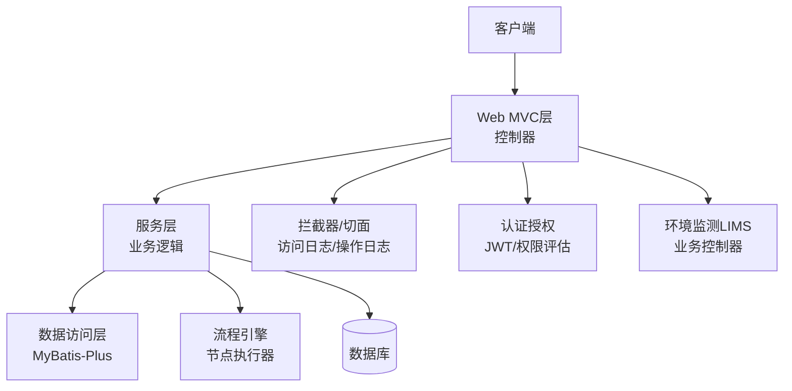
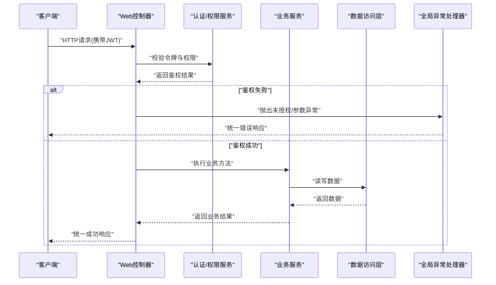
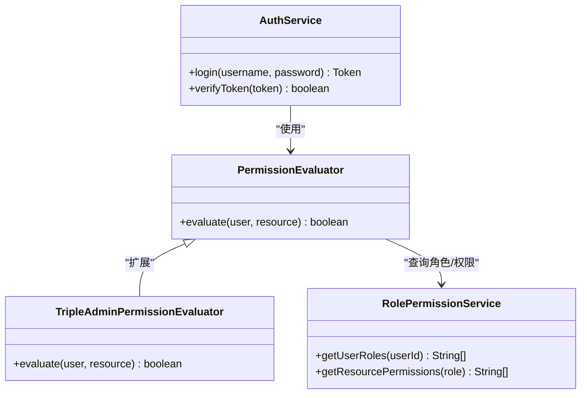
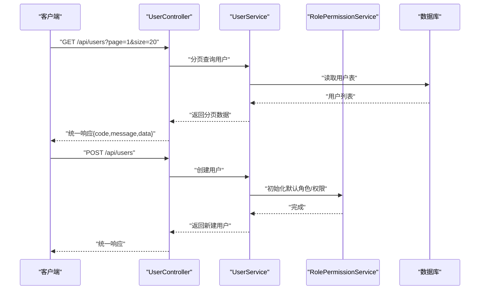
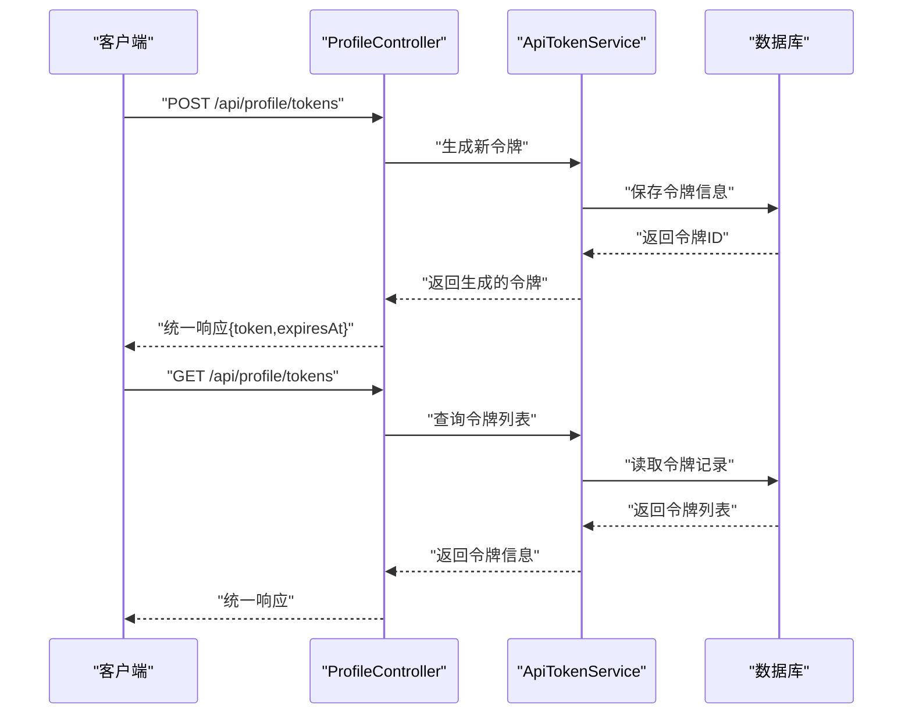
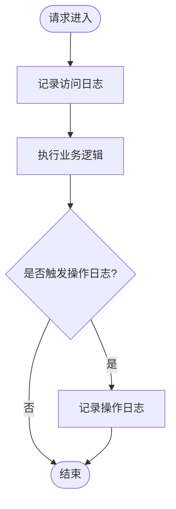
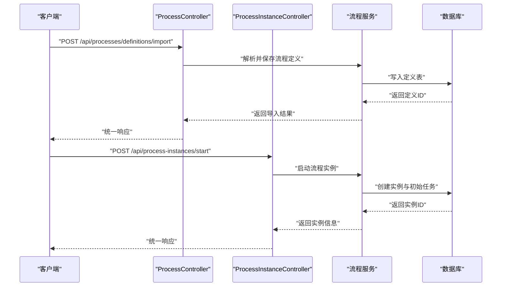
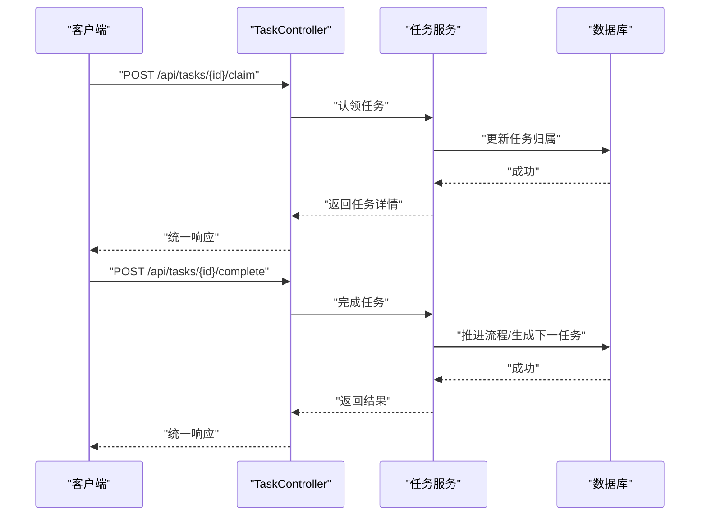
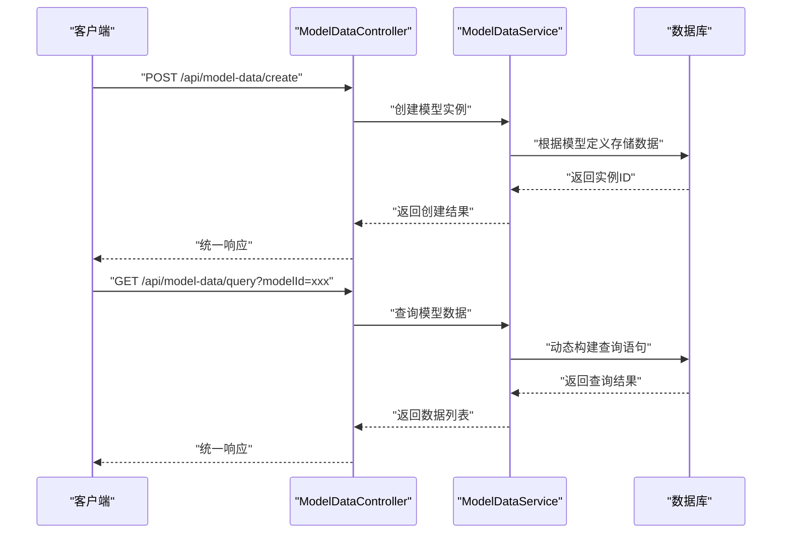
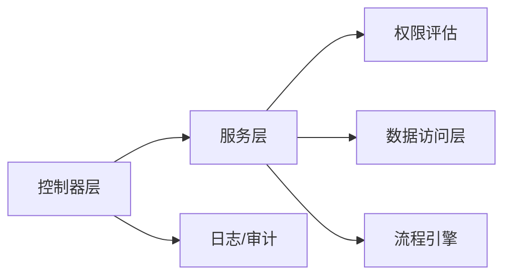

# API接口文档

<cite>
**本文引用的文件**   
- [FlowEngineApplication.java](file://flow-engine/src/main/java/com/flow/engine/FlowEngineApplication.java)
- [WebMvcConfig.java](file://flow-engine/src/main/java/com/flow/engine/config/WebMvcConfig.java)
- [GlobalExceptionHandler.java](file://flow-engine/src/main/java/com/flow/engine/common/GlobalExceptionHandler.java)
- [Result.java](file://flow-engine/src/main/java/com/flow/engine/common/Result.java)
- [ErrorCode.java](file://flow-engine/src/main/java/com/flow/engine/common/ErrorCode.java)
- [IResultCode.java](file://flow-engine/src/main/java/com/flow/engine/common/IResultCode.java)
- [AuthController.java](file://flow-engine/src/main/java/com/flow/engine/controllers/AuthController.java)
- [UserController.java](file://flow-engine/src/main/java/com/flow/engine/controllers/UserController.java)
- [RoleController.java](file://flow-engine/src/main/java/com/flow/engine/controllers/RoleController.java)
- [PermissionController.java](file://flow-engine/src/main/java/com/flow/engine/controllers/PermissionController.java)
- [DeptController.java](file://flow-engine/src/main/java/com/flow/engine/controllers/DeptController.java)
- [DictController.java](file://flow-engine/src/main/java/com/flow/engine/controllers/DictController.java)
- [LogController.java](file://flow-engine/src/main/java/com/flow/engine/controllers/LogController.java)
- [MonitorController.java](file://flow-engine/src/main/java/com/flow/engine/controllers/MonitorController.java)
- [AdminController.java](file://flow-engine/src/main/java/com/flow/engine/controllers/AdminController.java)
- [ProfileController.java](file://flow-engine/src/main/java/com/flow/engine/controllers/ProfileController.java)
- [ProcessController.java](file://flow-engine/src/main/java/com/flow/engine/controller/ProcessController.java)
- [ProcessInstanceController.java](file://flow-engine/src/main/java/com/flow/engine/controller/ProcessInstanceController.java)
- [TaskController.java](file://flow-engine/src/main/java/com/flow/engine/controller/TaskController.java)
- [DataModelController.java](file://flow-engine/src/main/java/com/flow/engine/controller/DataModelController.java)
- [ModelDataController.java](file://flow-engine/src/main/java/com/flow/engine/controller/ModelDataController.java)
- [WebhookController.java](file://flow-engine/src/main/java/com/flow/engine/controllers/WebhookController.java)
- [EmsBaseDataController.java](file://flow-engine/src/main/java/com/flow/engine/controllers/EmsBaseDataController.java)
- [EmsSamplingController.java](file://flow-engine/src/main/java/com/flow/engine/controllers/EmsSamplingController.java)
- [EmsQualityController.java](file://flow-engine/src/main/java/com/flow/engine/controllers/EmsQualityController.java)
- [EmsReportController.java](file://flow-engine/src/main/java/com/flow/engine/controllers/EmsReportController.java)
- [EmsDashboardController.java](file://flow-engine/src/main/java/com/flow/engine/controllers/EmsDashboardController.java)
- [EmsSharedController.java](file://flow-engine/src/main/java/com/flow/engine/controllers/EmsSharedController.java)
- [EmsBaseController.java](file://flow-engine/src/main/java/com/flow/engine/controllers/EmsBaseController.java)
- [ApiTokenService.java](file://flow-engine/src/main/java/com/flow/engine/service/ApiTokenService.java)
- [RequestContext.java](file://flow-engine/src/main/java/com/flow/engine/common/RequestContext.java)
- [RequestIdFilter.java](file://flow-engine/src/main/java/com/flow/engine/common/RequestIdFilter.java)
- [AuthService.java](file://flow-engine/src/main/java/com/flow/engine/service/AuthService.java)
- [UserService.java](file://flow-engine/src/main/java/com/flow/engine/service/UserService.java)
- [RolePermissionService.java](file://flow-engine/src/main/java/com/flow/engine/service/RolePermissionService.java)
- [PermissionEvaluator.java](file://flow-engine/src/main/java/com/flow/engine/service/PermissionEvaluator.java)
- [TripleAdminPermissionEvaluator.java](file://flow-engine/src/main/java/com/flow/engine/service/TripleAdminPermissionEvaluator.java)
- [OperationLogAspect.java](file://flow-engine/src/main/java/com/flow/engine/aspect/OperationLogAspect.java)
- [AccessLogInterceptor.java](file://flow-engine/src/main/java/com/flow/engine/interceptor/AccessLogInterceptor.java)
- [schema.sql](file://flow-engine/src/main/resources/db/schema.sql)
</cite>

## 更新摘要
**所做更改**
- 新增环境监测LIMS基础数据管理API（EmsBaseDataController）详细文档
- 新增采样与样品管理API（EmsSamplingController）完整说明
- 新增质量控制API（EmsQualityController）接口规范
- 新增报告管理API（EmsReportController）端点说明
- 新增驾驶舱统计API（EmsDashboardController）功能描述
- 新增共享实体API（EmsSharedController）使用说明
- 新增基础设施底座API（EmsBaseController）工具接口
- 完善环境监测业务模块的认证授权机制说明

## 目录
1. [简介](#简介)
2. [项目结构](#项目结构)
3. [核心组件](#核心组件)
4. [架构总览](#架构总览)
5. [详细组件分析](#详细组件分析)
6. [依赖关系分析](#依赖关系分析)
7. [性能考虑](#性能考虑)
8. [故障排查指南](#故障排查指南)
9. [结论](#结论)
10. [附录](#附录)

## 简介
本API文档面向流程引擎后端服务，提供统一的RESTful接口规范说明。内容涵盖：
- 统一响应格式与错误码定义
- 认证授权机制（JWT令牌、权限校验）
- 各业务模块API端点清单与调用示例
- **环境监测LIMS系统完整API规范**：基础数据管理、采样操作、委托订单、质量控制、报告管理等
- 分页查询、批量操作、文件上传等通用能力约定
- API版本管理与向后兼容策略
- Postman集合与Swagger集成建议
- 客户端SDK使用要点

## 项目结构
后端采用Spring Boot分层架构，控制器层暴露REST接口，服务层实现业务逻辑，数据访问层通过MyBatis-Plus映射数据库实体。公共模块包含统一响应封装、全局异常处理、请求上下文、日志切面与拦截器、权限评估器等。

```mermaid
graph TB
Client["客户端"] --> Web["Web MVC层<br/>控制器"]
Web --> Service["服务层<br/>业务逻辑"]
Service --> Mapper["数据访问层<br/>MyBatis-Plus"]
Service --> Engine["流程引擎<br/>节点执行器"]
Service --> DB[(数据库)]
Web --> Interceptor["拦截器/切面<br/>访问日志/操作日志"]
Web --> Auth["认证授权<br/>JWT/权限评估"]
Web --> EMS["环境监测LIMS<br/>业务控制器"]
```

**图示来源** 
- [FlowEngineApplication.java](file://flow-engine/src/main/java/com/flow/engine/FlowEngineApplication.java)
- [WebMvcConfig.java](file://flow-engine/src/main/java/com/flow/engine/config/WebMvcConfig.java)
- [GlobalExceptionHandler.java](file://flow-engine/src/main/java/com/flow/engine/common/GlobalExceptionHandler.java)
- [OperationLogAspect.java](file://flow-engine/src/main/java/com/flow/engine/aspect/OperationLogAspect.java)
- [AccessLogInterceptor.java](file://flow-engine/src/main/java/com/flow/engine/interceptor/AccessLogInterceptor.java)

**章节来源**
- [FlowEngineApplication.java](file://flow-engine/src/main/java/com/flow/engine/FlowEngineApplication.java)
- [WebMvcConfig.java](file://flow-engine/src/main/java/com/flow/engine/config/WebMvcConfig.java)

## 核心组件
- 统一响应封装：所有接口返回标准结构，包含状态码、消息和数据体。
- 全局异常处理：捕获业务与非业务异常，转换为统一响应。
- 认证授权：基于JWT的无状态鉴权，结合角色/权限模型进行访问控制。
- 请求上下文：在请求链路中传递用户信息、租户标识、追踪ID等。
- 日志与审计：访问日志拦截器与操作日志切面记录关键行为。

**章节来源**
- [Result.java](file://flow-engine/src/main/java/com/flow/engine/common/Result.java)
- [ErrorCode.java](file://flow-engine/src/main/java/com/flow/engine/common/ErrorCode.java)
- [IResultCode.java](file://flow-engine/src/main/java/com/flow/engine/common/IResultCode.java)
- [GlobalExceptionHandler.java](file://flow-engine/src/main/java/com/flow/engine/common/GlobalExceptionHandler.java)
- [RequestContext.java](file://flow-engine/src/main/java/com/flow/engine/common/RequestContext.java)
- [RequestIdFilter.java](file://flow-engine/src/main/java/com/flow/engine/common/RequestIdFilter.java)
- [OperationLogAspect.java](file://flow-engine/src/main/java/com/flow/engine/aspect/OperationLogAspect.java)
- [AccessLogInterceptor.java](file://flow-engine/src/main/java/com/flow/engine/interceptor/AccessLogInterceptor.java)

## 架构总览
下图展示一次典型API请求从进入Web层到返回响应的完整路径，包括认证、权限校验、业务处理与异常转换。

```mermaid
sequenceDiagram
participant C as "客户端"
participant W as "Web控制器"
participant A as "认证/权限服务"
participant S as "业务服务"
participant M as "数据访问层"
participant E as "全局异常处理器"
C->>W : "HTTP请求(携带JWT)"
W->>A : "校验令牌与权限"
A-->>W : "返回鉴权结果"
alt "鉴权失败"
W->>E : "抛出未授权/参数异常"
E-->>C : "统一错误响应"
else "鉴权成功"
W->>S : "执行业务方法"
S->>M : "读写数据"
M-->>S : "返回数据"
S-->>W : "返回业务结果"
W-->>C : "统一成功响应"
end
```

**图示来源**
- [AuthController.java](file://flow-engine/src/main/java/com/flow/engine/controllers/AuthController.java)
- [AuthService.java](file://flow-engine/src/main/java/com/flow/engine/service/AuthService.java)
- [PermissionEvaluator.java](file://flow-engine/src/main/java/com/flow/engine/service/PermissionEvaluator.java)
- [GlobalExceptionHandler.java](file://flow-engine/src/main/java/com/flow/engine/common/GlobalExceptionHandler.java)

## 详细组件分析

### 统一响应与错误码
- 统一响应结构
  - code: 业务状态码（整数）
  - message: 提示信息（字符串）
  - data: 业务数据（对象或数组）
  - requestId: 请求追踪ID（可选）
- 错误码定义
  - 系统级错误码：如参数错误、未授权、内部错误等
  - 业务级错误码：由具体业务模块定义并复用统一结构
- 全局异常处理
  - 将业务异常与框架异常转换为统一响应
  - 记录必要日志以便问题定位

**章节来源**
- [Result.java](file://flow-engine/src/main/java/com/flow/engine/common/Result.java)
- [ErrorCode.java](file://flow-engine/src/main/java/com/flow/engine/common/ErrorCode.java)
- [IResultCode.java](file://flow-engine/src/main/java/com/flow/engine/common/IResultCode.java)
- [GlobalExceptionHandler.java](file://flow-engine/src/main/java/com/flow/engine/common/GlobalExceptionHandler.java)

### 认证与授权
- 认证方式
  - 登录接口返回JWT令牌
  - 后续请求在Header中携带令牌进行身份验证
- 授权模型
  - 基于角色与权限的访问控制
  - 支持三员管理场景下的特殊权限评估
- 权限评估
  - 权限计算服务负责根据用户角色与资源权限判定是否允许访问
  - 三员管理员具备更高权限，可绕过常规限制

```mermaid
classDiagram
class AuthService {
+login(username, password) Token
+verifyToken(token) boolean
}
class PermissionEvaluator {
+evaluate(user, resource) boolean
}
class TripleAdminPermissionEvaluator {
+evaluate(user, resource) boolean
}
class RolePermissionService {
+getUserRoles(userId) String[]
+getResourcePermissions(role) String[]
}
AuthService --> PermissionEvaluator : "使用"
PermissionEvaluator <|-- TripleAdminPermissionEvaluator : "扩展"
PermissionEvaluator --> RolePermissionService : "查询角色/权限"
```

**图示来源**
- [AuthController.java](file://flow-engine/src/main/java/com/flow/engine/controllers/AuthController.java)
- [AuthService.java](file://flow-engine/src/main/java/com/flow/engine/service/AuthService.java)
- [PermissionEvaluator.java](file://flow-engine/src/main/java/com/flow/engine/service/PermissionEvaluator.java)
- [TripleAdminPermissionEvaluator.java](file://flow-engine/src/main/java/com/flow/engine/service/TripleAdminPermissionEvaluator.java)
- [RolePermissionService.java](file://flow-engine/src/main/java/com/flow/engine/service/RolePermissionService.java)

**章节来源**
- [AuthController.java](file://flow-engine/src/main/java/com/flow/engine/controllers/AuthController.java)
- [AuthService.java](file://flow-engine/src/main/java/com/flow/engine/service/AuthService.java)
- [PermissionEvaluator.java](file://flow-engine/src/main/java/com/flow/engine/service/PermissionEvaluator.java)
- [TripleAdminPermissionEvaluator.java](file://flow-engine/src/main/java/com/flow/engine/service/TripleAdminPermissionEvaluator.java)
- [RolePermissionService.java](file://flow-engine/src/main/java/com/flow/engine/service/RolePermissionService.java)

### 用户与组织管理API
- 用户管理
  - 列表查询：支持分页、筛选
  - 新增/修改/删除：基础CRUD
  - 重置密码、启用/禁用
- 部门管理
  - 树形结构维护
  - 成员关联与层级变更
- 角色与权限
  - 角色CRUD
  - 权限分配与回收
  - 表单权限评估接口

```mermaid
sequenceDiagram
participant C as "客户端"
participant UC as "UserController"
participant US as "UserService"
participant RP as "RolePermissionService"
participant DB as "数据库"
C->>UC : "GET /api/users?page=1&size=20"
UC->>US : "分页查询用户"
US->>DB : "读取用户表"
DB-->>US : "用户列表"
US-->>UC : "返回分页数据"
UC-->>C : "统一响应{code,message,data}"
C->>UC : "POST /api/users"
UC->>US : "创建用户"
US->>RP : "初始化默认角色/权限"
RP-->>US : "完成"
US-->>UC : "返回新建用户"
UC-->>C : "统一响应"
```

**图示来源**
- [UserController.java](file://flow-engine/src/main/java/com/flow/engine/controllers/UserController.java)
- [UserService.java](file://flow-engine/src/main/java/com/flow/engine/service/UserService.java)
- [RolePermissionService.java](file://flow-engine/src/main/java/com/flow/engine/service/RolePermissionService.java)

**章节来源**
- [UserController.java](file://flow-engine/src/main/java/com/flow/engine/controllers/UserController.java)
- [DeptController.java](file://flow-engine/src/main/java/com/flow/engine/controllers/DeptController.java)
- [RoleController.java](file://flow-engine/src/main/java/com/flow/engine/controllers/RoleController.java)
- [PermissionController.java](file://flow-engine/src/main/java/com/flow/engine/controllers/PermissionController.java)

### 用户资料管理API
- 个人资料管理
  - 获取当前用户详细信息
  - 更新个人基本信息（姓名、邮箱、手机号等）
  - 修改头像与个人信息
  - 查看账户设置偏好
- 安全设置
  - 修改密码
  - 绑定第三方账号
  - 查看登录历史

**章节来源**
- [ProfileController.java](file://flow-engine/src/main/java/com/flow/engine/controllers/ProfileController.java)

### API令牌管理API
- API令牌管理
  - 生成新的API访问令牌
  - 查看已创建的令牌列表
  - 撤销/删除指定令牌
  - 设置令牌有效期与权限范围
- 令牌验证
  - 服务端自动验证令牌有效性
  - 支持令牌权限范围控制
  - 令牌使用统计与审计

```mermaid
sequenceDiagram
participant C as "客户端"
participant PC as "ProfileController"
participant ATS as "ApiTokenService"
participant DB as "数据库"
C->>PC : "POST /api/profile/tokens"
PC->>ATS : "生成新令牌"
ATS->>DB : "保存令牌信息"
DB-->>ATS : "返回令牌ID"
ATS-->>PC : "返回生成的令牌"
PC-->>C : "统一响应{token,expiresAt}"
C->>PC : "GET /api/profile/tokens"
PC->>ATS : "查询令牌列表"
ATS->>DB : "读取令牌记录"
DB-->>ATS : "返回令牌列表"
ATS-->>PC : "返回令牌信息"
PC-->>C : "统一响应"
```

**图示来源**
- [ProfileController.java](file://flow-engine/src/main/java/com/flow/engine/controllers/ProfileController.java)
- [ApiTokenService.java](file://flow-engine/src/main/java/com/flow/engine/service/ApiTokenService.java)

**章节来源**
- [ApiTokenService.java](file://flow-engine/src/main/java/com/flow/engine/service/ApiTokenService.java)

### 字典与配置管理API
- 字典类型与项
  - 字典类型CRUD
  - 字典项CRUD，支持排序与启用/禁用
- 系统配置
  - 键值对配置管理
  - 动态刷新缓存（若实现）

**章节来源**
- [DictController.java](file://flow-engine/src/main/java/com/flow/engine/controllers/DictController.java)

### 日志与监控API
- 访问日志
  - 记录请求路径、耗时、状态码、IP等
- 操作日志
  - 记录关键业务操作，支持按用户/时间范围检索
- 监控指标
  - 健康检查、运行状态、队列/线程池概览

```mermaid
flowchart TD
Start(["请求进入"]) --> LogAccess["记录访问日志"]
LogAccess --> Exec["执行业务逻辑"]
Exec --> OpLog{"是否触发操作日志?"}
OpLog --> |是| RecordOp["记录操作日志"]
OpLog --> |否| End(["结束"])
RecordOp --> End
```

**图示来源**
- [AccessLogInterceptor.java](file://flow-engine/src/main/java/com/flow/engine/interceptor/AccessLogInterceptor.java)
- [OperationLogAspect.java](file://flow-engine/src/main/java/com/flow/engine/aspect/OperationLogAspect.java)
- [LogController.java](file://flow-engine/src/main/java/com/flow/engine/controllers/LogController.java)
- [MonitorController.java](file://flow-engine/src/main/java/com/flow/engine/controllers/MonitorController.java)

**章节来源**
- [LogController.java](file://flow-engine/src/main/java/com/flow/engine/controllers/LogController.java)
- [MonitorController.java](file://flow-engine/src/main/java/com/flow/engine/controllers/MonitorController.java)

### 流程定义与实例API
- 流程定义
  - 导入/导出流程定义
  - 版本管理与发布
- 流程实例
  - 启动实例
  - 查询实例列表与详情
  - 终止/挂起/恢复实例

```mermaid
sequenceDiagram
participant C as "客户端"
participant PC as "ProcessController"
participant PIC as "ProcessInstanceController"
participant PS as "流程服务"
participant DB as "数据库"
C->>PC : "POST /api/processes/definitions/import"
PC->>PS : "解析并保存流程定义"
PS->>DB : "写入定义表"
DB-->>PS : "返回定义ID"
PS-->>PC : "返回导入结果"
PC-->>C : "统一响应"
C->>PIC : "POST /api/process-instances/start"
PIC->>PS : "启动流程实例"
PS->>DB : "创建实例与初始任务"
DB-->>PS : "返回实例ID"
PS-->>PIC : "返回实例信息"
PIC-->>C : "统一响应"
```

**图示来源**
- [ProcessController.java](file://flow-engine/src/main/java/com/flow/engine/controller/ProcessController.java)
- [ProcessInstanceController.java](file://flow-engine/src/main/java/com/flow/engine/controller/ProcessInstanceController.java)

**章节来源**
- [ProcessController.java](file://flow-engine/src/main/java/com/flow/engine/controller/ProcessController.java)
- [ProcessInstanceController.java](file://flow-engine/src/main/java/com/flow/engine/controller/ProcessInstanceController.java)

### 任务中心API
- 待办任务
  - 认领任务
  - 完成任务（含审批意见、附件等）
- 已办任务
  - 历史任务查询
- 转办/加签/退回
  - 任务流转操作

```mermaid
sequenceDiagram
participant C as "客户端"
participant TC as "TaskController"
participant TS as "任务服务"
participant DB as "数据库"
C->>TC : "POST /api/tasks/{id}/claim"
TC->>TS : "认领任务"
TS->>DB : "更新任务归属"
DB-->>TS : "成功"
TS-->>TC : "返回任务详情"
TC-->>C : "统一响应"
C->>TC : "POST /api/tasks/{id}/complete"
TC->>TS : "完成任务"
TS->>DB : "推进流程/生成下一任务"
DB-->>TS : "成功"
TS-->>TC : "返回结果"
TC-->>C : "统一响应"
```

**图示来源**
- [TaskController.java](file://flow-engine/src/main/java/com/flow/engine/controller/TaskController.java)

**章节来源**
- [TaskController.java](file://flow-engine/src/main/java/com/flow/engine/controller/TaskController.java)

### 数据模型与模型实例API
- 数据模型
  - 模型定义CRUD
  - 字段类型与校验规则
- 模型实例
  - 基于模型定义的实例数据增删改查
  - 与流程变量联动

**章节来源**
- [DataModelController.java](file://flow-engine/src/main/java/com/flow/engine/controller/DataModelController.java)

### 数据模型操作API
- 数据模型操作
  - 动态数据模型定义与管理
  - 模型字段类型支持（文本、数字、日期、选择等）
  - 模型间关联关系配置
  - 数据验证规则定义
- 模型实例操作
  - 基于动态模型的CRUD操作
  - 复杂查询条件构建
  - 批量数据处理
  - 数据导入导出

```mermaid
sequenceDiagram
participant C as "客户端"
participant MC as "ModelDataController"
participant MS as "ModelDataService"
participant DB as "数据库"
C->>MC : "POST /api/model-data/create"
MC->>MS : "创建模型实例"
MS->>DB : "根据模型定义存储数据"
DB-->>MS : "返回实例ID"
MS-->>MC : "返回创建结果"
MC-->>C : "统一响应"
C->>MC : "GET /api/model-data/query?modelId=xxx"
MC->>MS : "查询模型数据"
MS->>DB : "动态构建查询语句"
DB-->>MS : "返回查询结果"
MS-->>MC : "返回数据列表"
MC-->>C : "统一响应"
```

**图示来源**
- [ModelDataController.java](file://flow-engine/src/main/java/com/flow/engine/controller/ModelDataController.java)

**章节来源**
- [ModelDataController.java](file://flow-engine/src/main/java/com/flow/engine/controller/ModelDataController.java)

### Webhook回调API
- 事件订阅
  - 注册/管理Webhook
  - 重试与失败日志
- 回调通知
  - 流程事件触发时向外部系统推送

**章节来源**
- [WebhookController.java](file://flow-engine/src/main/java/com/flow/engine/controllers/WebhookController.java)

### 后台管理API
- 三员管理
  - 系统管理员、安全管理员、审计管理员
  - 职责分离与权限隔离
- 其他管理功能
  - 系统配置、监控、审计

**章节来源**
- [AdminController.java](file://flow-engine/src/main/java/com/flow/engine/controllers/AdminController.java)

### 环境监测LIMS基础数据管理API
**新增** 环境监测LIMS系统的基础数据管理功能，提供完整的CRUD操作和业务流程支持。

#### 客户管理
- 创建客户：`POST /api/v1/ems/base/customers`
- 查询客户列表：`GET /api/v1/ems/base/customers`
- 更新客户：`PUT /api/v1/ems/base/customers/{id}`
- 禁用客户：`POST /api/v1/ems/base/customers/{id}/disable`
- 获取客户详情：`GET /api/v1/ems/base/customers/{id}/detail`
- 批量删除客户：`POST /api/v1/ems/base/customers/batch-delete`
- 导入客户：`POST /api/v1/ems/base/customers/import`
- 下载模板：`GET /api/v1/ems/base/customers/template`

#### 委托单管理
- 创建委托：`POST /api/v1/ems/base/entrusts`
- 查询委托列表：`GET /api/v1/ems/base/entrusts`
- 获取委托详情：`GET /api/v1/ems/base/entrusts/{id}`
- 提交委托：`POST /api/v1/ems/base/entrusts/{id}/submit`
- 技术确认：`POST /api/v1/ems/base/entrusts/{id}/tech-confirm`
- 驳回委托：`POST /api/v1/ems/base/entrusts/{id}/reject`
- 批量删除：`POST /api/v1/ems/base/entrusts/batch-delete`

#### 车辆管理
- 创建车辆：`POST /api/v1/ems/base/vehicles`
- 更新车辆：`PUT /api/v1/ems/base/vehicles/{id}`
- 删除车辆：`DELETE /api/v1/ems/base/vehicles/{id}`
- 查询车辆列表：`GET /api/v1/ems/base/vehicles`
- 获取车辆详情：`GET /api/v1/ems/base/vehicles/{id}/detail`
- 车辆维修保养：`POST /api/v1/ems/base/vehicles/{id}/maintenances`

#### 仪器设备管理
- 创建设备：`POST /api/v1/ems/base/instruments`
- 更新设备：`PUT /api/v1/ems/base/instruments/{id}`
- 删除设备：`DELETE /api/v1/ems/base/instruments/{id}`
- 查询设备列表：`GET /api/v1/ems/base/instruments`
- 设备校准：`POST /api/v1/ems/base/instruments/{id}/calibrate`
- 获取设备详情：`GET /api/v1/ems/base/instruments/{id}/detail`
- 校准预警：`GET /api/v1/ems/base/instruments/expiring`

#### 采样参数配置
- 查询配置列表：`GET /api/v1/ems/base/sample-param-config`
- 获取配置详情：`GET /api/v1/ems/base/sample-param-config/{id}`
- 保存配置：`POST /api/v1/ems/base/sample-param-config`
- 删除配置：`DELETE /api/v1/ems/base/sample-param-config/{id}`
- 批量删除：`POST /api/v1/ems/base/sample-param-config/batch-delete`

**章节来源**
- [EmsBaseDataController.java](file://flow-engine/src/main/java/com/flow/engine/controllers/EmsBaseDataController.java)

### 采样与样品管理API
**新增** 环境监测采样与样品管理的完整功能，支持采样记录、样品管理、现场照片上传等。

#### 采样记录管理
- 创建采样记录：`POST /api/v1/ems/base/sampling/records`
- 更新采样记录：`PUT /api/v1/ems/base/sampling/records/{id}`
- 完成采样记录：`POST /api/v1/ems/base/sampling/records/{id}/complete`
- 查询采样记录：`GET /api/v1/ems/base/sampling/records`
- 删除采样记录：`DELETE /api/v1/ems/base/sampling/records/{id}`

#### 样品管理
- 创建样品：`POST /api/v1/ems/base/sampling/samples`
- 更新样品：`PUT /api/v1/ems/base/sampling/samples/{id}`
- 手动收集样品：`POST /api/v1/ems/base/sampling/samples/manual-collect`
- 收样工作台采集：`POST /api/v1/ems/base/sampling/samples/collect`
- 样品处置：`POST /api/v1/ems/base/sampling/samples/{id}/dispose`
- 样品接收：`POST /api/v1/ems/base/sampling/samples/{id}/receive`
- 样品派发：`POST /api/v1/ems/base/sampling/samples/{id}/dispatch`
- 查询样品列表：`GET /api/v1/ems/base/sampling/samples`
- 获取样品详情：`GET /api/v1/ems/base/sampling/samples/{id}/detail`
- 删除样品：`DELETE /api/v1/ems/base/sampling/samples/{id}`

#### 现场照片管理
- 上传现场照片：`POST /api/v1/ems/base/sampling/samples/photo-upload`
- 访问现场照片：`GET /api/v1/ems/base/sampling/samples/photo/{dateDir}/{fileName}`
- 添加照片：`POST /api/v1/ems/base/sampling/photos`
- 查询照片列表：`GET /api/v1/ems/base/sampling/photos`

#### 留样库管理
- 留样：`POST /api/v1/ems/base/sampling/samples/{id}/retain`
- 查询留样列表：`GET /api/v1/ems/base/sampling/retains`
- 留样统计：`GET /api/v1/ems/base/sampling/retains/stats`
- 申请处置：`POST /api/v1/ems/base/sampling/retains/{id}/dispose`
- 删除留样：`DELETE /api/v1/ems/base/sampling/retains/{id}`
- 即将到期留样：`GET /api/v1/ems/base/sampling/retains/expiring`

#### 收样工作台
- 工作台数据：`GET /api/v1/ems/base/sampling/workbench`

**章节来源**
- [EmsSamplingController.java](file://flow-engine/src/main/java/com/flow/engine/controllers/EmsSamplingController.java)

### 质量控制API
**新增** 环境监测质量控制功能，包括标准物质、耗材、危化品台账、质控计划等管理。

#### 标准物质管理
- 保存标准物质：`POST /api/v1/ems/quality/materials`
- 查询标准物质：`GET /api/v1/ems/quality/materials`

#### 耗材管理
- 保存耗材：`POST /api/v1/ems/quality/consumables`
- 查询耗材：`GET /api/v1/ems/quality/consumables`

#### 危化品台账
- 保存危化品：`POST /api/v1/ems/quality/hazardous`
- 查询危化品：`GET /api/v1/ems/quality/hazardous`
- 申请使用：`POST /api/v1/ems/quality/hazardous/{id}/apply`
- 审批使用：`POST /api/v1/ems/quality/hazardous/{id}/approve`

#### 质控计划
- 保存计划：`POST /api/v1/ems/quality/plans`
- 查询计划：`GET /api/v1/ems/quality/plans`
- 获取计划详情：`GET /api/v1/ems/quality/plans/{id}`
- 提交计划：`POST /api/v1/ems/quality/plans/{id}/submit`
- 审批计划：`POST /api/v1/ems/quality/plans/{id}/approve`
- 完成计划：`POST /api/v1/ems/quality/plans/{id}/complete`

#### 监控活动
- 保存活动：`POST /api/v1/ems/quality/activities`
- 查询活动：`GET /api/v1/ems/quality/activities`

#### 能力验证
- 保存能力验证：`POST /api/v1/ems/quality/proficiency`
- 查询能力验证：`GET /api/v1/ems/quality/proficiency`

#### 实验室间比对
- 保存比对：`POST /api/v1/ems/quality/interlab`
- 查询比对：`GET /api/v1/ems/quality/interlab`

#### 重复性试验
- 保存试验：`POST /api/v1/ems/quality/repeat`
- 查询试验：`GET /api/v1/ems/quality/repeat`

#### 闸门校验
- 材料闸门：`GET /api/v1/ems/quality/gate/material`
- 仪器闸门：`GET /api/v1/ems/quality/gate/instrument`

**章节来源**
- [EmsQualityController.java](file://flow-engine/src/main/java/com/flow/engine/controllers/EmsQualityController.java)

### 报告管理API
**新增** 环境监测报告生成与审核功能，支持模板管理、报告生成、审核流程。

#### 模板管理
- 查询模板列表：`GET /api/v1/ems/report/templates`
- 创建模板：`POST /api/v1/ems/report/template`

#### 报告生成
- 查询待处理任务：`GET /api/v1/ems/report/pending-tasks`
- 生成报告：`POST /api/v1/ems/report/generate`

#### 报告管理
- 查询报告列表：`GET /api/v1/ems/report/list`
- 获取报告详情：`GET /api/v1/ems/report/{id}`

#### 报告审核
- 批准报告：`POST /api/v1/ems/report/{id}/approve`
- 驳回报告：`POST /api/v1/ems/report/{id}/reject`

**章节来源**
- [EmsReportController.java](file://flow-engine/src/main/java/com/flow/engine/controllers/EmsReportController.java)

### 驾驶舱统计API
**新增** 环境监测数据驾驶舱与统计分析功能，提供概览统计和看板卡片。

#### 概览统计
- 获取概览数据：`GET /api/v1/ems/dashboard/overview`

#### 委托看板
- 获取委托卡片：`GET /api/v1/ems/dashboard/entrust-cards`

**章节来源**
- [EmsDashboardController.java](file://flow-engine/src/main/java/com/flow/engine/controllers/EmsDashboardController.java)

### 共享实体API
**新增** 环境监测系统共享实体管理，包括文件元信息、预警、站内信等跨模块功能。

#### 文件管理
- 归档文件：`POST /api/v1/ems/shared/files`
- 查询文件：`GET /api/v1/ems/shared/files`

#### 预警管理
- 推送预警：`POST /api/v1/ems/shared/alerts`
- 查询预警：`GET /api/v1/ems/shared/alerts`

#### 站内信
- 发送站内信：`POST /api/v1/ems/shared/messages`
- 查询站内信：`GET /api/v1/ems/shared/messages`

**章节来源**
- [EmsSharedController.java](file://flow-engine/src/main/java/com/flow/engine/controllers/EmsSharedController.java)

### 基础设施底座API
**新增** 环境监测基础设施底座功能，包括状态机、编号引擎、公式计算等基础能力。

#### 状态机
- 驱动状态迁移：`POST /api/v1/statemachine/fire`
- 查询可用迁移：`GET /api/v1/statemachine/transitions`

#### 编号引擎
- 生成业务单号：`GET /api/v1/seq/next`

#### 公式计算
- 公式计算：`POST /api/v1/calc`

**章节来源**
- [EmsBaseController.java](file://flow-engine/src/main/java/com/flow/engine/controllers/EmsBaseController.java)

### 依赖关系分析
- 控制器与服务层解耦：控制器仅做参数校验与响应封装，业务逻辑下沉至服务层
- 权限评估可扩展：通过接口抽象与实现类替换，支持不同权限策略
- 日志与审计横切：通过拦截器与切面实现非侵入式记录
- 数据访问统一：MyBatis-Plus简化CRUD与分页

```mermaid
graph LR
Controllers["控制器层"] --> Services["服务层"]
Services --> Perms["权限评估"]
Services --> Data["数据访问层"]
Services --> Engine["流程引擎"]
Controllers --> Logs["日志/审计"]
```

**图示来源**
- [WebMvcConfig.java](file://flow-engine/src/main/java/com/flow/engine/config/WebMvcConfig.java)
- [OperationLogAspect.java](file://flow-engine/src/main/java/com/flow/engine/aspect/OperationLogAspect.java)
- [AccessLogInterceptor.java](file://flow-engine/src/main/java/com/flow/engine/interceptor/AccessLogInterceptor.java)

**章节来源**
- [WebMvcConfig.java](file://flow-engine/src/main/java/com/flow/engine/config/WebMvcConfig.java)

## 性能考虑
- 分页查询
  - 服务端分页，避免一次性加载大量数据
  - 合理设置每页大小上限
- 索引优化
  - 为常用查询字段建立索引（参考数据库Schema）
- 缓存策略
  - 字典、权限等热点数据可引入缓存
- 异步处理
  - 长耗时任务（如Webhook发送）采用异步队列

[本节为通用指导，不直接分析具体文件]

## 故障排查指南
- 统一错误响应
  - 关注code与message，快速定位问题类型
- 请求追踪
  - 使用requestId在日志中串联请求链路
- 访问日志
  - 查看请求耗时、状态码、入参摘要
- 操作日志
  - 回溯关键业务操作的执行者与时间
- 常见错误
  - 未授权：检查JWT是否过期或权限不足
  - 参数错误：核对必填字段与格式
  - 内部错误：查看服务器日志堆栈

**章节来源**
- [GlobalExceptionHandler.java](file://flow-engine/src/main/java/com/flow/engine/common/GlobalExceptionHandler.java)
- [RequestIdFilter.java](file://flow-engine/src/main/java/com/flow/engine/common/RequestIdFilter.java)
- [AccessLogInterceptor.java](file://flow-engine/src/main/java/com/flow/engine/interceptor/AccessLogInterceptor.java)
- [OperationLogAspect.java](file://flow-engine/src/main/java/com/flow/engine/aspect/OperationLogAspect.java)

## 结论
本API文档提供了流程引擎后端的统一接口规范、认证授权机制、统一响应与错误码定义，以及主要业务模块的接口说明与调用示例。**特别新增了环境监测LIMS系统的完整API规范**，包括基础数据管理、采样操作、委托订单、质量控制、报告管理等核心功能模块。通过标准化的设计，便于前后端协作与第三方系统集成。建议在项目中持续完善接口文档与测试用例，确保向后兼容与稳定性。

[本节为总结性内容，不直接分析具体文件]

## 附录

### 通用约定
- 基础URL
  - 开发环境：http://localhost:端口/api
  - 生产环境：https://域名/api
- 认证头
  - Authorization: Bearer {JWT令牌}
- 分页参数
  - page: 页码（从1开始）
  - size: 每页条数
- 批量操作
  - 多数接口支持传入数组进行批量提交
- 文件上传
  - 使用multipart/form-data
  - 字段名以实际接口为准
- 版本管理
  - URL前缀包含版本号，如/v1
  - 向后兼容策略：新增字段保持可选，废弃字段保留一段时间并提示迁移

### 接口清单（按模块）
- 认证与用户
  - 登录：POST /api/auth/login
  - 获取当前用户信息：GET /api/user/me
  - 用户CRUD：/api/users
  - 部门CRUD：/api/depts
  - 角色CRUD：/api/roles
  - 权限管理：/api/permissions
- 用户资料管理
  - 获取个人资料：GET /api/profile
  - 更新个人资料：PUT /api/profile
  - 修改密码：POST /api/profile/password
  - API令牌管理：/api/profile/tokens
- 字典与配置
  - 字典类型：/api/dict/types
  - 字典项：/api/dict/items
- 日志与监控
  - 访问日志：/api/logs/access
  - 操作日志：/api/logs/operation
  - 监控：/api/monitor
- 流程与任务
  - 流程定义：/api/processes/definitions
  - 流程实例：/api/process-instances
  - 任务：/api/tasks
- 数据模型
  - 数据模型：/api/data-models
  - 模型实例：/api/model-instances
  - 数据模型操作：/api/model-data
- Webhook
  - Webhook管理：/api/webhooks
- **环境监测LIMS**
  - 基础数据：/api/v1/ems/base/*
  - 采样管理：/api/v1/ems/base/sampling/*
  - 质量控制：/api/v1/ems/quality/*
  - 报告管理：/api/v1/ems/report/*
  - 驾驶舱统计：/api/v1/ems/dashboard/*
  - 共享实体：/api/v1/ems/shared/*
  - 基础设施：/api/v1/*

### 统一响应示例
- 成功响应
  - { "code": 0, "message": "成功", "data": {} }
- 错误响应
  - { "code": 1001, "message": "参数错误", "data": null }

**章节来源**
- [Result.java](file://flow-engine/src/main/java/com/flow/engine/common/Result.java)
- [ErrorCode.java](file://flow-engine/src/main/java/com/flow/engine/common/ErrorCode.java)

### 错误码定义（节选）
- 0: 成功
- 1001: 参数错误
- 1002: 未授权
- 1003: 禁止访问
- 1004: 资源不存在
- 1005: 内部错误

**章节来源**
- [ErrorCode.java](file://flow-engine/src/main/java/com/flow/engine/common/ErrorCode.java)
- [IResultCode.java](file://flow-engine/src/main/java/com/flow/engine/common/IResultCode.java)

### 数据库Schema参考
- 用户、角色、权限、部门、字典、流程定义、流程实例、任务、日志等表结构

**章节来源**
- [schema.sql](file://flow-engine/src/main/resources/db/schema.sql)

### Postman集合与Swagger集成指南
- Postman
  - 新建集合，添加环境变量（base_url、token）
  - 按模块分组接口，补充请求示例与断言
- Swagger
  - 引入注解描述接口
  - 启动后访问文档页面，导出OpenAPI规范

[本节为通用指导，不直接分析具体文件]

### 客户端SDK使用手册
- 初始化
  - 设置基础URL与超时
  - 注入认证拦截器，自动附加JWT
- 调用示例
  - 登录获取令牌
  - 调用业务接口并处理统一响应
- 错误处理
  - 根据code分支处理
  - 记录requestId用于排障

[本节为通用指导，不直接分析具体文件]

### 前端API模块集成
- API模块结构
  - auth.js：认证相关接口
  - user.js：用户管理接口
  - profile.js：用户资料管理接口
  - model.js：数据模型管理接口
  - modelData.js：数据模型操作接口
  - ems.js：环境监测LIMS接口
  - request.js：HTTP请求封装
- 使用示例
  - 导入对应模块
  - 调用API方法
  - 处理统一响应格式

**章节来源**
- [auth.js](file://flow-web/src/api/auth.js)
- [profile.js](file://flow-web/src/api/profile.js)
- [model.js](file://flow-web/src/api/model.js)
- [modelData.js](file://flow-web/src/api/modelData.js)
- [ems.js](file://flow-web/src/api/ems.js)
- [request.js](file://flow-web/src/api/request.js)