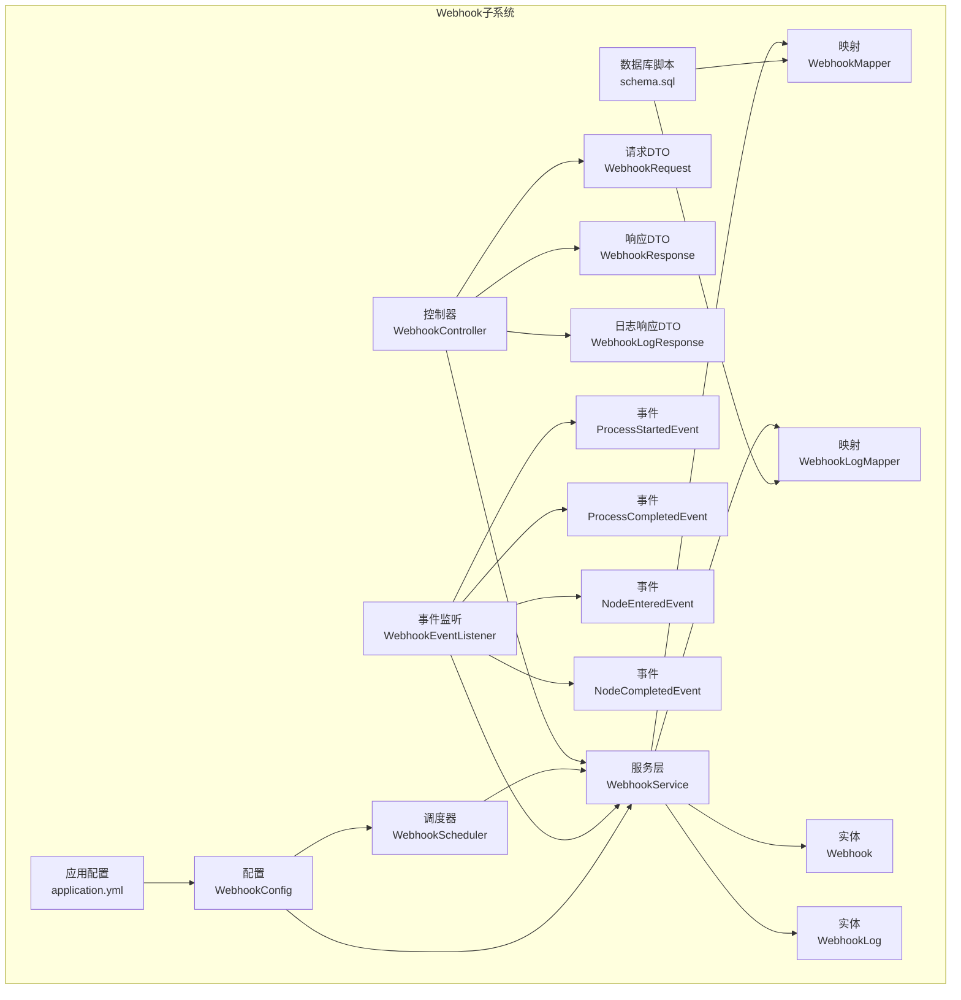
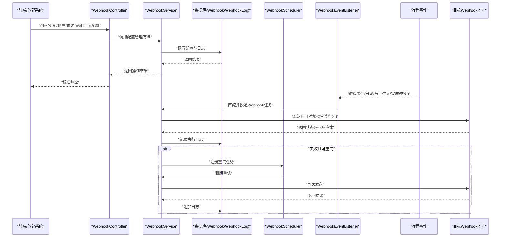
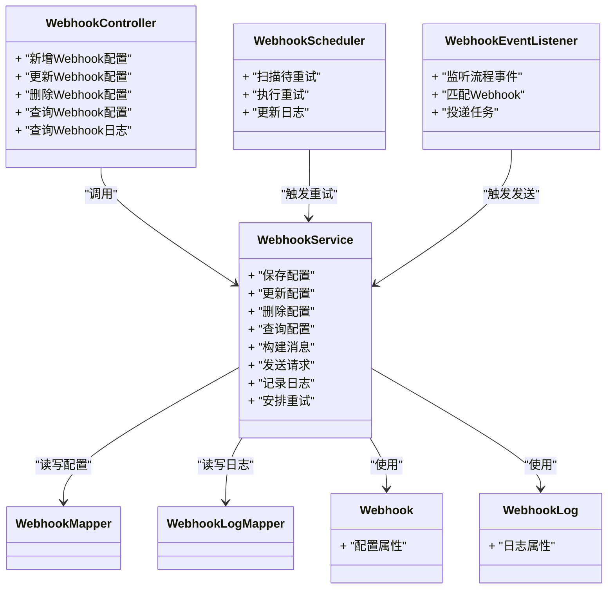
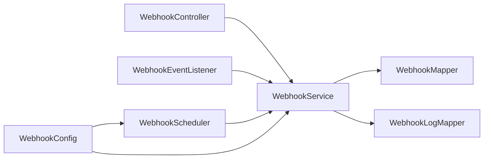

# Webhook集成API

<cite>
**本文引用的文件**   
- [WebhookController.java](file://flow-engine/src/main/java/com/flow/engine/controllers/WebhookController.java)
- [WebhookService.java](file://flow-engine/src/main/java/com/flow/engine/service/WebhookService.java)
- [WebhookScheduler.java](file://flow-engine/src/main/java/com/flow/engine/service/WebhookScheduler.java)
- [WebhookEventListener.java](file://flow-engine/src/main/java/com/flow/engine/listener/WebhookEventListener.java)
- [WebhookConfig.java](file://flow-engine/src/main/java/com/flow/engine/config/WebhookConfig.java)
- [Webhook.java](file://flow-engine/src/main/java/com/flow/engine/entity/Webhook.java)
- [WebhookLog.java](file://flow-engine/src/main/java/com/flow/engine/entity/WebhookLog.java)
- [WebhookMapper.java](file://flow-engine/src/main/java/com/flow/engine/mapper/WebhookMapper.java)
- [WebhookLogMapper.java](file://flow-engine/src/main/java/com/flow/engine/mapper/WebhookLogMapper.java)
- [WebhookRequest.java](file://flow-engine/src/main/java/com/flow/engine/dto/WebhookRequest.java)
- [WebhookResponse.java](file://flow-engine/src/main/java/com/flow/engine/dto/WebhookResponse.java)
- [WebhookLogResponse.java](file://flow-engine/src/main/java/com/flow/engine/dto/WebhookLogResponse.java)
- [ProcessStartedEvent.java](file://flow-engine/src/main/java/com/flow/engine/event/ProcessStartedEvent.java)
- [ProcessCompletedEvent.java](file://flow-engine/src/main/java/com/flow/engine/event/ProcessCompletedEvent.java)
- [NodeEnteredEvent.java](file://flow-engine/src/main/java/com/flow/engine/event/NodeEnteredEvent.java)
- [NodeCompletedEvent.java](file://flow-engine/src/main/java/com/flow/engine/event/NodeCompletedEvent.java)
- [application.yml](file://flow-engine/src/main/resources/application.yml)
- [schema.sql](file://flow-engine/src/main/resources/db/schema.sql)
- [WebhookApiTest.java](file://flow-engine/src/test/java/com/flow/engine/controllers/WebhookApiTest.java)
</cite>

## 目录
1. [简介](#简介)
2. [项目结构](#项目结构)
3. [核心组件](#核心组件)
4. [架构总览](#架构总览)
5. [详细组件分析](#详细组件分析)
6. [依赖关系分析](#依赖关系分析)
7. [性能与并发](#性能与并发)
8. [故障排查指南](#故障排查指南)
9. [结论](#结论)
10. [附录：接口定义与示例](#附录接口定义与示例)

## 简介
本文件面向外部系统集成者，提供Webhook集成API的完整说明。内容涵盖RESTful接口设计、事件触发时机与类型、配置管理（CRUD）、消息格式与签名校验、执行日志与失败重试策略、异步处理与并发安全、监控告警配置，以及常见平台（钉钉、企业微信、Slack）的对接示例。

## 项目结构
Webhook相关能力位于后端模块 flow-engine 中，主要涉及控制器、服务、调度器、事件监听、实体与映射、DTO及配置等。

图表来源
- [WebhookController.java](file://flow-engine/src/main/java/com/flow/engine/controllers/WebhookController.java)
- [WebhookService.java](file://flow-engine/src/main/java/com/flow/engine/service/WebhookService.java)
- [WebhookScheduler.java](file://flow-engine/src/main/java/com/flow/engine/service/WebhookScheduler.java)
- [WebhookEventListener.java](file://flow-engine/src/main/java/com/flow/engine/listener/WebhookEventListener.java)
- [WebhookConfig.java](file://flow-engine/src/main/java/com/flow/engine/config/WebhookConfig.java)
- [Webhook.java](file://flow-engine/src/main/java/com/flow/engine/entity/Webhook.java)
- [WebhookLog.java](file://flow-engine/src/main/java/com/flow/engine/entity/WebhookLog.java)
- [WebhookMapper.java](file://flow-engine/src/main/java/com/flow/engine/mapper/WebhookMapper.java)
- [WebhookLogMapper.java](file://flow-engine/src/main/java/com/flow/engine/mapper/WebhookLogMapper.java)
- [ProcessStartedEvent.java](file://flow-engine/src/main/java/com/flow/engine/event/ProcessStartedEvent.java)
- [ProcessCompletedEvent.java](file://flow-engine/src/main/java/com/flow/engine/event/ProcessCompletedEvent.java)
- [NodeEnteredEvent.java](file://flow-engine/src/main/java/com/flow/engine/event/NodeEnteredEvent.java)
- [NodeCompletedEvent.java](file://flow-engine/src/main/java/com/flow/engine/event/NodeCompletedEvent.java)
- [application.yml](file://flow-engine/src/main/resources/application.yml)
- [schema.sql](file://flow-engine/src/main/resources/db/schema.sql)

章节来源
- [WebhookController.java](file://flow-engine/src/main/java/com/flow/engine/controllers/WebhookController.java)
- [WebhookService.java](file://flow-engine/src/main/java/com/flow/engine/service/WebhookService.java)
- [WebhookScheduler.java](file://flow-engine/src/main/java/com/flow/engine/service/WebhookScheduler.java)
- [WebhookEventListener.java](file://flow-engine/src/main/java/com/flow/engine/listener/WebhookEventListener.java)
- [WebhookConfig.java](file://flow-engine/src/main/java/com/flow/engine/config/WebhookConfig.java)
- [Webhook.java](file://flow-engine/src/main/java/com/flow/engine/entity/Webhook.java)
- [WebhookLog.java](file://flow-engine/src/main/java/com/flow/engine/entity/WebhookLog.java)
- [WebhookMapper.java](file://flow-engine/src/main/java/com/flow/engine/mapper/WebhookMapper.java)
- [WebhookLogMapper.java](file://flow-engine/src/main/java/com/flow/engine/mapper/WebhookLogMapper.java)
- [ProcessStartedEvent.java](file://flow-engine/src/main/java/com/flow/engine/event/ProcessStartedEvent.java)
- [ProcessCompletedEvent.java](file://flow-engine/src/main/java/com/flow/engine/event/ProcessCompletedEvent.java)
- [NodeEnteredEvent.java](file://flow-engine/src/main/java/com/flow/engine/event/NodeEnteredEvent.java)
- [NodeCompletedEvent.java](file://flow-engine/src/main/java/com/flow/engine/event/NodeCompletedEvent.java)
- [application.yml](file://flow-engine/src/main/resources/application.yml)
- [schema.sql](file://flow-engine/src/main/resources/db/schema.sql)

## 核心组件
- 控制器层：对外暴露Webhook配置的CRUD与日志查询接口，接收并转发事件到服务层。
- 服务层：封装Webhook配置的增删改查、匹配规则、消息组装、HTTP发送、签名计算与验证、重试编排等。
- 调度器：负责失败重试任务的定时扫描与派发。
- 事件监听：订阅流程引擎事件，将匹配到的Webhook任务入队或立即投递。
- 配置中心：集中管理Webhook开关、超时、并发、重试等参数。
- 数据模型：Webhook配置表与执行日志表，持久化配置与调用结果。
- DTO：统一请求/响应结构，便于前后端交互与测试用例使用。

章节来源
- [WebhookController.java](file://flow-engine/src/main/java/com/flow/engine/controllers/WebhookController.java)
- [WebhookService.java](file://flow-engine/src/main/java/com/flow/engine/service/WebhookService.java)
- [WebhookScheduler.java](file://flow-engine/src/main/java/com/flow/engine/service/WebhookScheduler.java)
- [WebhookEventListener.java](file://flow-engine/src/main/java/com/flow/engine/listener/WebhookEventListener.java)
- [WebhookConfig.java](file://flow-engine/src/main/java/com/flow/engine/config/WebhookConfig.java)
- [Webhook.java](file://flow-engine/src/main/java/com/flow/engine/entity/Webhook.java)
- [WebhookLog.java](file://flow-engine/src/main/java/com/flow/engine/entity/WebhookLog.java)
- [WebhookRequest.java](file://flow-engine/src/main/java/com/flow/engine/dto/WebhookRequest.java)
- [WebhookResponse.java](file://flow-engine/src/main/java/com/flow/engine/dto/WebhookResponse.java)
- [WebhookLogResponse.java](file://flow-engine/src/main/java/com/flow/engine/dto/WebhookLogResponse.java)

## 架构总览
Webhook整体采用“事件驱动 + 异步投递 + 可重试”的架构模式。流程引擎产生事件后，由监听器筛选匹配的Webhook配置，服务层完成消息构建与发送；失败时交由调度器进行指数退避重试，所有执行结果落库以便审计与监控。

图表来源
- [WebhookController.java](file://flow-engine/src/main/java/com/flow/engine/controllers/WebhookController.java)
- [WebhookService.java](file://flow-engine/src/main/java/com/flow/engine/service/WebhookService.java)
- [WebhookScheduler.java](file://flow-engine/src/main/java/com/flow/engine/service/WebhookScheduler.java)
- [WebhookEventListener.java](file://flow-engine/src/main/java/com/flow/engine/listener/WebhookEventListener.java)
- [Webhook.java](file://flow-engine/src/main/java/com/flow/engine/entity/Webhook.java)
- [WebhookLog.java](file://flow-engine/src/main/java/com/flow/engine/entity/WebhookLog.java)
- [ProcessStartedEvent.java](file://flow-engine/src/main/java/com/flow/engine/event/ProcessStartedEvent.java)
- [ProcessCompletedEvent.java](file://flow-engine/src/main/java/com/flow/engine/event/ProcessCompletedEvent.java)
- [NodeEnteredEvent.java](file://flow-engine/src/main/java/com/flow/engine/event/NodeEnteredEvent.java)
- [NodeCompletedEvent.java](file://flow-engine/src/main/java/com/flow/engine/event/NodeCompletedEvent.java)

## 详细组件分析

### 控制器层：WebhookController
- 职责
  - 提供Webhook配置的CRUD接口：新增、修改、删除、分页查询、按条件检索。
  - 提供Webhook执行日志查询接口：支持按时间范围、状态、关联ID过滤。
  - 提供手动触发测试接口（可选）：用于调试配置与签名。
- 输入输出
  - 请求体使用统一的WebhookRequest结构，包含URL、请求头、事件匹配规则、重试策略等。
  - 响应体使用统一的WebhookResponse结构，包含操作结果、错误码与提示。
- 安全与鉴权
  - 建议结合全局鉴权拦截器对管理接口进行权限控制。
- 典型流程
  - 新增/更新：校验参数 -> 保存配置 -> 返回成功。
  - 删除：逻辑删除或物理删除 -> 返回成功。
  - 查询：分页+条件 -> 返回列表与总数。
  - 日志查询：按条件过滤 -> 返回列表。

章节来源
- [WebhookController.java](file://flow-engine/src/main/java/com/flow/engine/controllers/WebhookController.java)
- [WebhookRequest.java](file://flow-engine/src/main/java/com/flow/engine/dto/WebhookRequest.java)
- [WebhookResponse.java](file://flow-engine/src/main/java/com/flow/engine/dto/WebhookResponse.java)
- [WebhookLogResponse.java](file://flow-engine/src/main/java/com/flow/engine/dto/WebhookLogResponse.java)

### 服务层：WebhookService
- 职责
  - 配置管理：增删改查、启用/禁用、批量导入导出（可选）。
  - 事件匹配：根据事件类型、流程实例ID、节点标识等规则筛选有效Webhook。
  - 消息构建：将事件上下文序列化为JSON负载，附加元数据（如traceId、时间戳）。
  - 签名机制：基于共享密钥与请求体生成签名，放入自定义请求头供接收方校验。
  - HTTP发送：带超时、重试、熔断降级（可选）的HTTP客户端调用。
  - 日志记录：每次发送前/后写入WebhookLog，包含请求摘要、响应状态、耗时、错误信息。
  - 重试编排：失败时根据策略延迟重试，直至达到最大次数或成功。
- 关键数据结构
  - Webhook：存储目标URL、请求头、事件匹配规则、签名密钥、重试策略、是否启用等。
  - WebhookLog：记录每次调用的详细信息，包括请求ID、状态码、响应体摘要、异常堆栈等。
- 并发与一致性
  - 使用线程池异步发送，避免阻塞主流程。
  - 幂等性：通过唯一请求ID保证接收方可去重。
  - 事务边界：配置变更与日志写入在各自事务内完成，避免跨域事务。

章节来源
- [WebhookService.java](file://flow-engine/src/main/java/com/flow/engine/service/WebhookService.java)
- [Webhook.java](file://flow-engine/src/main/java/com/flow/engine/entity/Webhook.java)
- [WebhookLog.java](file://flow-engine/src/main/java/com/flow/engine/entity/WebhookLog.java)
- [WebhookMapper.java](file://flow-engine/src/main/java/com/flow/engine/mapper/WebhookMapper.java)
- [WebhookLogMapper.java](file://flow-engine/src/main/java/com/flow/engine/mapper/WebhookLogMapper.java)

### 调度器：WebhookScheduler
- 职责
  - 定时扫描待重试的Webhook日志条目。
  - 依据重试策略（固定间隔/指数退避）重新投递。
  - 超过最大重试次数则标记为最终失败，并触发告警（可选）。
- 可配置项
  - 扫描周期、批大小、并发度、退避算法参数、最大重试次数等。

章节来源
- [WebhookScheduler.java](file://flow-engine/src/main/java/com/flow/engine/service/WebhookScheduler.java)
- [WebhookConfig.java](file://flow-engine/src/main/java/com/flow/engine/config/WebhookConfig.java)
- [application.yml](file://flow-engine/src/main/resources/application.yml)

### 事件监听：WebhookEventListener
- 职责
  - 订阅流程引擎事件：流程启动、节点进入、节点完成、流程完成等。
  - 将事件转换为内部事件对象，交由服务层进行匹配与投递。
- 事件类型
  - 流程启动事件
  - 节点进入事件
  - 节点完成事件
  - 流程完成事件

章节来源
- [WebhookEventListener.java](file://flow-engine/src/main/java/com/flow/engine/listener/WebhookEventListener.java)
- [ProcessStartedEvent.java](file://flow-engine/src/main/java/com/flow/engine/event/ProcessStartedEvent.java)
- [ProcessCompletedEvent.java](file://flow-engine/src/main/java/com/flow/engine/event/ProcessCompletedEvent.java)
- [NodeEnteredEvent.java](file://flow-engine/src/main/java/com/flow/engine/event/NodeEnteredEvent.java)
- [NodeCompletedEvent.java](file://flow-engine/src/main/java/com/flow/engine/event/NodeCompletedEvent.java)

### 配置与数据模型
- Webhook配置字段（示例）
  - 名称、描述、目标URL、请求头键值对、事件匹配规则、签名密钥、重试策略、是否启用、创建/更新时间等。
- 执行日志字段（示例）
  - 关联配置ID、请求ID、事件类型、请求摘要、响应状态码、响应体摘要、耗时、错误信息、重试次数、创建/更新时间等。
- 数据库脚本
  - schema.sql中包含Webhook与WebhookLog表的建表语句与索引建议。

章节来源
- [Webhook.java](file://flow-engine/src/main/java/com/flow/engine/entity/Webhook.java)
- [WebhookLog.java](file://flow-engine/src/main/java/com/flow/engine/entity/WebhookLog.java)
- [schema.sql](file://flow-engine/src/main/resources/db/schema.sql)

### 类图（代码级）

图表来源
- [WebhookController.java](file://flow-engine/src/main/java/com/flow/engine/controllers/WebhookController.java)
- [WebhookService.java](file://flow-engine/src/main/java/com/flow/engine/service/WebhookService.java)
- [WebhookScheduler.java](file://flow-engine/src/main/java/com/flow/engine/service/WebhookScheduler.java)
- [WebhookEventListener.java](file://flow-engine/src/main/java/com/flow/engine/listener/WebhookEventListener.java)
- [Webhook.java](file://flow-engine/src/main/java/com/flow/engine/entity/Webhook.java)
- [WebhookLog.java](file://flow-engine/src/main/java/com/flow/engine/entity/WebhookLog.java)
- [WebhookMapper.java](file://flow-engine/src/main/java/com/flow/engine/mapper/WebhookMapper.java)
- [WebhookLogMapper.java](file://flow-engine/src/main/java/com/flow/engine/mapper/WebhookLogMapper.java)

## 依赖关系分析
- 控制器依赖服务层，服务层依赖映射器访问数据库。
- 事件监听器在服务层之上，作为事件入口。
- 调度器与服务层协作，实现失败重试。
- 配置类集中管理Webhook相关运行时参数。

图表来源
- [WebhookController.java](file://flow-engine/src/main/java/com/flow/engine/controllers/WebhookController.java)
- [WebhookService.java](file://flow-engine/src/main/java/com/flow/engine/service/WebhookService.java)
- [WebhookScheduler.java](file://flow-engine/src/main/java/com/flow/engine/service/WebhookScheduler.java)
- [WebhookEventListener.java](file://flow-engine/src/main/java/com/flow/engine/listener/WebhookEventListener.java)
- [WebhookConfig.java](file://flow-engine/src/main/java/com/flow/engine/config/WebhookConfig.java)
- [WebhookMapper.java](file://flow-engine/src/main/java/com/flow/engine/mapper/WebhookMapper.java)
- [WebhookLogMapper.java](file://flow-engine/src/main/java/com/flow/engine/mapper/WebhookLogMapper.java)

章节来源
- [WebhookController.java](file://flow-engine/src/main/java/com/flow/engine/controllers/WebhookController.java)
- [WebhookService.java](file://flow-engine/src/main/java/com/flow/engine/service/WebhookService.java)
- [WebhookScheduler.java](file://flow-engine/src/main/java/com/flow/engine/service/WebhookScheduler.java)
- [WebhookEventListener.java](file://flow-engine/src/main/java/com/flow/engine/listener/WebhookEventListener.java)
- [WebhookConfig.java](file://flow-engine/src/main/java/com/flow/engine/config/WebhookConfig.java)
- [WebhookMapper.java](file://flow-engine/src/main/java/com/flow/engine/mapper/WebhookMapper.java)
- [WebhookLogMapper.java](file://flow-engine/src/main/java/com/flow/engine/mapper/WebhookLogMapper.java)

## 性能与并发
- 异步发送
  - 使用线程池异步执行HTTP请求，避免阻塞主流程。
  - 合理设置线程池大小与队列容量，防止OOM。
- 重试策略
  - 指数退避：首次延迟较短，后续逐步增加，降低瞬时压力。
  - 最大重试次数限制，避免无限重试。
- 超时与熔断
  - 设置合理的连接与读取超时，避免资源占用过久。
  - 对下游不稳定场景可引入熔断与快速失败。
- 幂等与去重
  - 请求携带唯一ID，接收方可据此去重。
- 日志与追踪
  - 全链路traceId贯穿请求，便于定位问题。
  - 日志分级与采样，避免磁盘写满。

[本节为通用指导，不直接分析具体文件]

## 故障排查指南
- 常见问题
  - 配置未生效：检查是否启用、事件匹配规则是否正确。
  - 签名失败：核对共享密钥、签名算法与请求头命名。
  - 网络超时：检查目标地址可达性与防火墙策略。
  - 重试风暴：调整退避参数与最大重试次数。
- 定位手段
  - 查看Webhook执行日志，关注状态码、错误信息与耗时。
  - 使用测试接口模拟触发，验证配置与签名。
  - 开启更详细的日志级别，观察发送与重试过程。

章节来源
- [WebhookLog.java](file://flow-engine/src/main/java/com/flow/engine/entity/WebhookLog.java)
- [WebhookLogMapper.java](file://flow-engine/src/main/java/com/flow/engine/mapper/WebhookLogMapper.java)
- [WebhookApiTest.java](file://flow-engine/src/test/java/com/flow/engine/controllers/WebhookApiTest.java)

## 结论
本Webhook子系统以事件驱动为核心，提供高可用、可观测、可扩展的外部通知能力。通过灵活的配置、可靠的签名校验与健壮的重试机制，能够稳定对接多种第三方平台。配合完善的日志与监控，可有效保障集成质量与运维效率。

[本节为总结性内容，不直接分析具体文件]

## 附录：接口定义与示例

### RESTful接口清单
- Webhook配置管理
  - 新增Webhook配置
    - 方法：POST
    - 路径：/api/webhooks
    - 请求体：WebhookRequest
    - 响应：WebhookResponse
  - 更新Webhook配置
    - 方法：PUT
    - 路径：/api/webhooks/{id}
    - 请求体：WebhookRequest
    - 响应：WebhookResponse
  - 删除Webhook配置
    - 方法：DELETE
    - 路径：/api/webhooks/{id}
    - 响应：WebhookResponse
  - 查询Webhook配置
    - 方法：GET
    - 路径：/api/webhooks
    - 查询参数：分页与过滤条件
    - 响应：分页列表
- Webhook执行日志
  - 查询Webhook日志
    - 方法：GET
    - 路径：/api/webhooks/logs
    - 查询参数：时间范围、状态、关联ID等
    - 响应：WebhookLogResponse分页列表
- 测试触发（可选）
  - 方法：POST
  - 路径：/api/webhooks/test
  - 请求体：WebhookRequest
  - 响应：WebhookResponse

章节来源
- [WebhookController.java](file://flow-engine/src/main/java/com/flow/engine/controllers/WebhookController.java)
- [WebhookRequest.java](file://flow-engine/src/main/java/com/flow/engine/dto/WebhookRequest.java)
- [WebhookResponse.java](file://flow-engine/src/main/java/com/flow/engine/dto/WebhookResponse.java)
- [WebhookLogResponse.java](file://flow-engine/src/main/java/com/flow/engine/dto/WebhookLogResponse.java)

### 事件类型与触发时机
- 流程启动事件：当流程实例被创建并开始执行时触发。
- 节点进入事件：当流程到达某个节点时触发。
- 节点完成事件：当某个节点处理完成时触发。
- 流程完成事件：当整个流程结束时触发。

章节来源
- [ProcessStartedEvent.java](file://flow-engine/src/main/java/com/flow/engine/event/ProcessStartedEvent.java)
- [NodeEnteredEvent.java](file://flow-engine/src/main/java/com/flow/engine/event/NodeEnteredEvent.java)
- [NodeCompletedEvent.java](file://flow-engine/src/main/java/com/flow/engine/event/NodeCompletedEvent.java)
- [ProcessCompletedEvent.java](file://flow-engine/src/main/java/com/flow/engine/event/ProcessCompletedEvent.java)

### 消息格式规范
- 负载格式：JSON
- 必备字段
  - 事件类型、流程实例ID、节点标识（如有）、时间戳、唯一请求ID、业务数据等。
- 扩展字段
  - 可根据业务需要添加自定义字段，保持向后兼容。

章节来源
- [WebhookService.java](file://flow-engine/src/main/java/com/flow/engine/service/WebhookService.java)

### 签名验证机制
- 生成方式
  - 使用共享密钥与请求体（或特定字段）计算签名，放入自定义请求头。
- 校验步骤
  - 接收方使用相同算法与密钥计算签名，并与请求头中的签名比对。
- 安全建议
  - 使用HTTPS传输。
  - 定期轮换密钥。
  - 记录签名校验结果到日志。

章节来源
- [WebhookService.java](file://flow-engine/src/main/java/com/flow/engine/service/WebhookService.java)
- [Webhook.java](file://flow-engine/src/main/java/com/flow/engine/entity/Webhook.java)

### 重试策略与失败处理
- 策略
  - 固定间隔重试或指数退避。
  - 最大重试次数限制。
- 失败处理
  - 记录详细错误信息。
  - 达到上限后标记最终失败并触发告警（可选）。

章节来源
- [WebhookScheduler.java](file://flow-engine/src/main/java/com/flow/engine/service/WebhookScheduler.java)
- [WebhookConfig.java](file://flow-engine/src/main/java/com/flow/engine/config/WebhookConfig.java)
- [application.yml](file://flow-engine/src/main/resources/application.yml)

### 常见平台对接示例
- 钉钉
  - 使用钉钉机器人Webhook URL。
  - 在请求头中添加签名（若启用），并按钉钉消息格式构造JSON负载。
- 企业微信
  - 使用企业微信群机器人Webhook URL。
  - 按企业微信消息格式构造JSON负载，必要时添加签名。
- Slack
  - 使用Incoming Webhook URL。
  - 按Slack消息格式构造JSON负载，无需额外签名。

[本节为概念性示例，不直接分析具体文件]

### 监控与告警配置
- 指标采集
  - 发送成功率、失败率、平均耗时、重试次数分布。
- 告警规则
  - 失败率阈值、连续失败次数、超时比例等。
- 可视化
  - 通过日志与监控面板展示趋势与热点。

章节来源
- [WebhookLog.java](file://flow-engine/src/main/java/com/flow/engine/entity/WebhookLog.java)
- [WebhookLogMapper.java](file://flow-engine/src/main/java/com/flow/engine/mapper/WebhookLogMapper.java)
- [WebhookConfig.java](file://flow-engine/src/main/java/com/flow/engine/config/WebhookConfig.java)
- [application.yml](file://flow-engine/src/main/resources/application.yml)