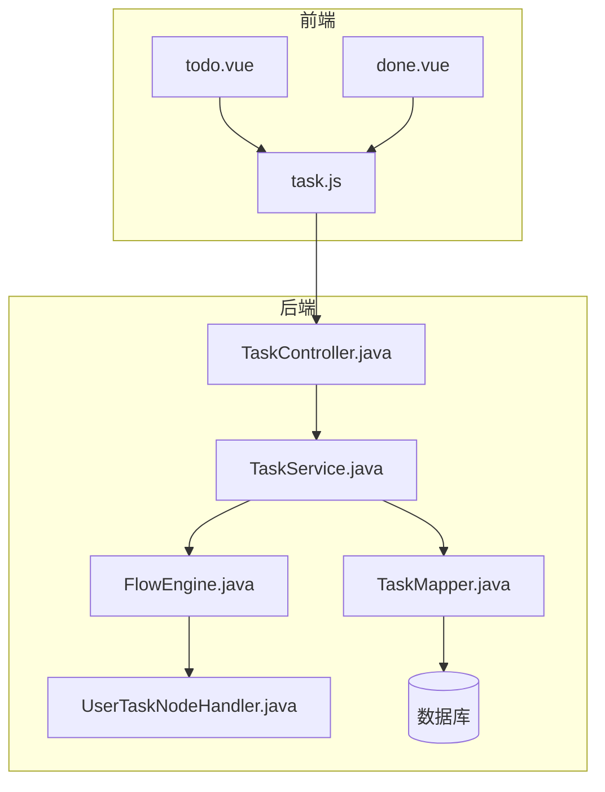
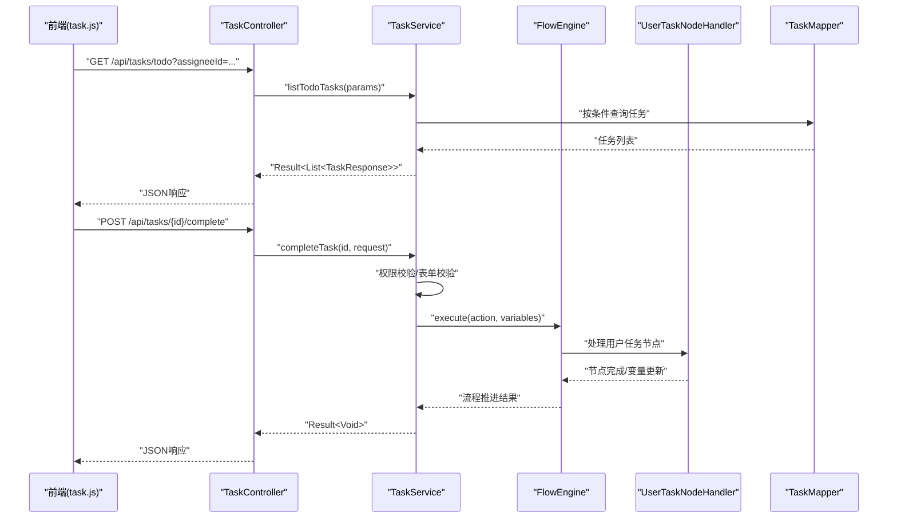
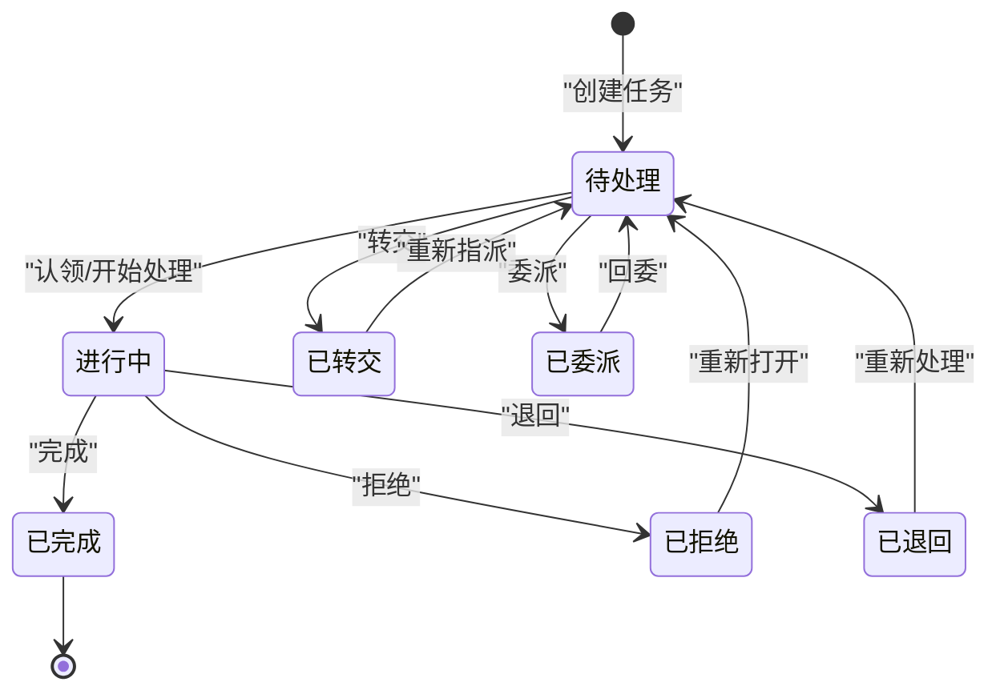
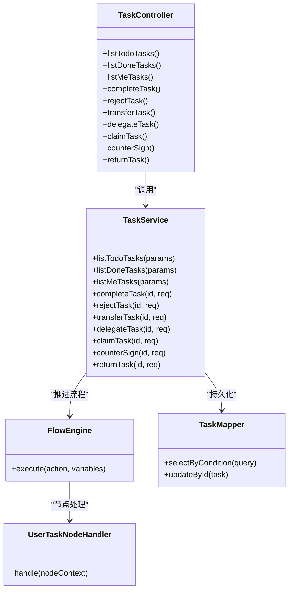

# 任务管理API

<cite>
**本文引用的文件**   
- [TaskController.java](file://flow-engine/src/main/java/com/flow/engine/controller/TaskController.java)
- [TaskService.java](file://flow-engine/src/main/java/com/flow/engine/service/TaskService.java)
- [Task.java](file://flow-engine/src/main/java/com/flow/engine/entity/Task.java)
- [TaskMapper.java](file://flow-engine/src/main/java/com/flow/engine/mapper/TaskMapper.java)
- [TaskStatus.java](file://flow-engine/src/main/java/com/flow/engine/common/enums/TaskStatus.java)
- [TaskAction.java](file://flow-engine/src/main/java/com/flow/engine/common/enums/TaskAction.java)
- [CompleteTaskRequest.java](file://flow-engine/src/main/java/com/flow/engine/dto/CompleteTaskRequest.java)
- [RejectTaskRequest.java](file://flow-engine/src/main/java/com/flow/engine/dto/RejectTaskRequest.java)
- [TransferTaskRequest.java](file://flow-engine/src/main/java/com/flow/engine/dto/TransferTaskRequest.java)
- [DelegateTaskRequest.java](file://flow-engine/src/main/java/com/flow/engine/dto/DelegateTaskRequest.java)
- [ClaimTaskRequest.java](file://flow-engine/src/main/java/com/flow/engine/dto/ClaimTaskRequest.java)
- [TaskResponse.java](file://flow-engine/src/main/java/com/flow/engine/dto/TaskResponse.java)
- [Result.java](file://flow-engine/src/main/java/com/flow/engine/common/Result.java)
- [ErrorCode.java](file://flow-engine/src/main/java/com/flow/engine/common/ErrorCode.java)
- [GlobalExceptionHandler.java](file://flow-engine/src/main/java/com/flow/engine/common/GlobalExceptionHandler.java)
- [ProcessInstanceService.java](file://flow-engine/src/main/java/com/flow/engine/service/ProcessInstanceService.java)
- [FlowEngine.java](file://flow-engine/src/main/java/com/flow/engine/engine/FlowEngine.java)
- [UserTaskNodeHandler.java](file://flow-engine/src/main/java/com/flow/engine/node/impl/UserTaskNodeHandler.java)
- [WebMvcConfig.java](file://flow-engine/src/main/java/com/flow/engine/config/WebMvcConfig.java)
- [application.yml](file://flow-engine/src/main/resources/application.yml)
- [task.js](file://flow-web/src/api/task.js)
- [todo.vue](file://flow-web/src/views/task/todo.vue)
- [done.vue](file://flow-web/src/views/task/done.vue)
</cite>

## 目录
1. [简介](#简介)
2. [项目结构](#项目结构)
3. [核心组件](#核心组件)
4. [架构总览](#架构总览)
5. [详细组件分析](#详细组件分析)
6. [依赖分析](#依赖分析)
7. [性能考虑](#性能考虑)
8. [故障排查指南](#故障排查指南)
9. [结论](#结论)
10. [附录](#附录)

## 简介
本文件面向“任务管理API”的开发者与集成方，系统化说明任务处理的RESTful接口，包括：
- 待办任务查询、已办任务查询、个人任务列表获取
- 任务操作：完成、拒绝、转交、加签、委派、退回
- 每个接口的HTTP方法、URL路径、请求参数、响应格式与业务规则
- 任务分配策略与权限验证机制
- 任务状态流转与生命周期管理
- 表单数据提交与附件上传能力
- 高级搜索与过滤查询
- 完整请求与响应示例（以字段说明为主）

## 项目结构
后端采用Spring Boot分层架构：控制器层暴露REST接口，服务层封装业务逻辑，引擎层驱动流程执行，持久层通过MyBatis-Plus访问数据库。前端Vue工程通过api/task.js调用后端任务接口，并在待办/已办页面展示结果。

图表来源
- [TaskController.java](file://flow-engine/src/main/java/com/flow/engine/controller/TaskController.java)
- [TaskService.java](file://flow-engine/src/main/java/com/flow/engine/service/TaskService.java)
- [FlowEngine.java](file://flow-engine/src/main/java/com/flow/engine/engine/FlowEngine.java)
- [UserTaskNodeHandler.java](file://flow-engine/src/main/java/com/flow/engine/node/impl/UserTaskNodeHandler.java)
- [TaskMapper.java](file://flow-engine/src/main/java/com/flow/engine/mapper/TaskMapper.java)
- [task.js](file://flow-web/src/api/task.js)
- [todo.vue](file://flow-web/src/views/task/todo.vue)
- [done.vue](file://flow-web/src/views/task/done.vue)

章节来源
- [TaskController.java](file://flow-engine/src/main/java/com/flow/engine/controller/TaskController.java)
- [TaskService.java](file://flow-engine/src/main/java/com/flow/engine/service/TaskService.java)
- [FlowEngine.java](file://flow-engine/src/main/java/com/flow/engine/engine/FlowEngine.java)
- [UserTaskNodeHandler.java](file://flow-engine/src/main/java/com/flow/engine/node/impl/UserTaskNodeHandler.java)
- [TaskMapper.java](file://flow-engine/src/main/java/com/flow/engine/mapper/TaskMapper.java)
- [task.js](file://flow-web/src/api/task.js)
- [todo.vue](file://flow-web/src/views/task/todo.vue)
- [done.vue](file://flow-web/src/views/task/done.vue)

## 核心组件
- 控制器层：TaskController负责接收并校验请求，返回统一Result包装体
- 服务层：TaskService实现任务查询、操作编排、权限校验、与流程引擎交互
- 引擎层：FlowEngine协调节点处理器，UserTaskNodeHandler处理用户任务相关动作
- 持久层：TaskMapper提供任务实体CRUD与条件查询
- 枚举与DTO：TaskStatus、TaskAction定义状态与动作；各Request/Response DTO承载入参与出参

章节来源
- [TaskController.java](file://flow-engine/src/main/java/com/flow/engine/controller/TaskController.java)
- [TaskService.java](file://flow-engine/src/main/java/com/flow/engine/service/TaskService.java)
- [FlowEngine.java](file://flow-engine/src/main/java/com/flow/engine/engine/FlowEngine.java)
- [UserTaskNodeHandler.java](file://flow-engine/src/main/java/com/flow/engine/node/impl/UserTaskNodeHandler.java)
- [TaskMapper.java](file://flow-engine/src/main/java/com/flow/engine/mapper/TaskMapper.java)
- [TaskStatus.java](file://flow-engine/src/main/java/com/flow/engine/common/enums/TaskStatus.java)
- [TaskAction.java](file://flow-engine/src/main/java/com/flow/engine/common/enums/TaskAction.java)
- [CompleteTaskRequest.java](file://flow-engine/src/main/java/com/flow/engine/dto/CompleteTaskRequest.java)
- [RejectTaskRequest.java](file://flow-engine/src/main/java/com/flow/engine/dto/RejectTaskRequest.java)
- [TransferTaskRequest.java](file://flow-engine/src/main/java/com/flow/engine/dto/TransferTaskRequest.java)
- [DelegateTaskRequest.java](file://flow-engine/src/main/java/com/flow/engine/dto/DelegateTaskRequest.java)
- [ClaimTaskRequest.java](file://flow-engine/src/main/java/com/flow/engine/dto/ClaimTaskRequest.java)
- [TaskResponse.java](file://flow-engine/src/main/java/com/flow/engine/dto/TaskResponse.java)
- [Result.java](file://flow-engine/src/main/java/com/flow/engine/common/Result.java)

## 架构总览
任务API整体调用链：前端通过task.js发起HTTP请求至TaskController，控制器委托TaskService进行权限校验与业务编排，必要时调用FlowEngine与UserTaskNodeHandler推进流程，最终通过TaskMapper读写数据库。

图表来源
- [TaskController.java](file://flow-engine/src/main/java/com/flow/engine/controller/TaskController.java)
- [TaskService.java](file://flow-engine/src/main/java/com/flow/engine/service/TaskService.java)
- [FlowEngine.java](file://flow-engine/src/main/java/com/flow/engine/engine/FlowEngine.java)
- [UserTaskNodeHandler.java](file://flow-engine/src/main/java/com/flow/engine/node/impl/UserTaskNodeHandler.java)
- [TaskMapper.java](file://flow-engine/src/main/java/com/flow/engine/mapper/TaskMapper.java)
- [task.js](file://flow-web/src/api/task.js)

## 详细组件分析

### 通用约定
- 基础路径：/api/tasks
- 统一响应：Result<T>，包含code、message、data等字段
- 认证鉴权：通过全局拦截器/配置注入当前用户上下文，服务层基于用户角色/部门/数据权限校验
- 错误码：ErrorCode定义标准错误码，GlobalExceptionHandler统一异常转换

章节来源
- [Result.java](file://flow-engine/src/main/java/com/flow/engine/common/Result.java)
- [ErrorCode.java](file://flow-engine/src/main/java/com/flow/engine/common/ErrorCode.java)
- [GlobalExceptionHandler.java](file://flow-engine/src/main/java/com/flow/engine/common/GlobalExceptionHandler.java)
- [WebMvcConfig.java](file://flow-engine/src/main/java/com/flow/engine/config/WebMvcConfig.java)
- [application.yml](file://flow-engine/src/main/resources/application.yml)

### 任务查询接口

#### 待办任务列表
- 方法：GET
- 路径：/api/tasks/todo
- 查询参数：
  - assigneeId：经办人ID（可选）
  - processInstanceId：流程实例ID（可选）
  - keyword：关键词（可选，模糊匹配任务名/表单字段）
  - status：任务状态（可选，默认待处理）
  - page：页码（可选，默认1）
  - size：每页条数（可选，默认20）
- 响应：Result<List<TaskResponse>>
- 业务规则：
  - 仅返回当前用户有权限查看的任务
  - 支持按部门/角色扩展的数据权限过滤
- 示例请求：
  - GET /api/tasks/todo?assigneeId=U001&keyword=采购&page=1&size=10
- 示例响应：
  - { "code": 0, "message": "成功", "data": [ { "taskId": "T001", "processInstanceId": "P001", "name": "采购审批", "status": "TODO", ... } ] }

章节来源
- [TaskController.java](file://flow-engine/src/main/java/com/flow/engine/controller/TaskController.java)
- [TaskService.java](file://flow-engine/src/main/java/com/flow/engine/service/TaskService.java)
- [TaskMapper.java](file://flow-engine/src/main/java/com/flow/engine/mapper/TaskMapper.java)
- [TaskResponse.java](file://flow-engine/src/main/java/com/flow/engine/dto/TaskResponse.java)
- [task.js](file://flow-web/src/api/task.js)
- [todo.vue](file://flow-web/src/views/task/todo.vue)

#### 已办任务列表
- 方法：GET
- 路径：/api/tasks/done
- 查询参数：
  - assigneeId：原经办人ID（可选）
  - processInstanceId：流程实例ID（可选）
  - keyword：关键词（可选）
  - startTime/endTime：时间范围（可选）
  - page、size：分页（可选）
- 响应：Result<List<TaskResponse>>
- 业务规则：
  - 仅返回当前用户已完成或历史经办的任务
  - 支持按流程状态过滤
- 示例请求：
  - GET /api/tasks/done?assigneeId=U001&startTime=2025-01-01&endTime=2025-12-31&page=1&size=20
- 示例响应：
  - { "code": 0, "message": "成功", "data": [ { "taskId": "T002", "processInstanceId": "P002", "name": "报销审批", "status": "DONE", ... } ] }

章节来源
- [TaskController.java](file://flow-engine/src/main/java/com/flow/engine/controller/TaskController.java)
- [TaskService.java](file://flow-engine/src/main/java/com/flow/engine/service/TaskService.java)
- [TaskMapper.java](file://flow-engine/src/main/java/com/flow/engine/mapper/TaskMapper.java)
- [TaskResponse.java](file://flow-engine/src/main/java/com/flow/engine/dto/TaskResponse.java)
- [task.js](file://flow-web/src/api/task.js)
- [done.vue](file://flow-web/src/views/task/done.vue)

#### 个人任务列表（聚合）
- 方法：GET
- 路径：/api/tasks/me
- 查询参数：
  - type：类型 todo|done|all（可选，默认all）
  - keyword：关键词（可选）
  - page、size：分页（可选）
- 响应：Result<List<TaskResponse>>
- 业务规则：
  - 根据type组合查询待办/已办
  - 自动附加当前用户上下文进行权限过滤
- 示例请求：
  - GET /api/tasks/me?type=todo&keyword=合同&page=1&size=10
- 示例响应：
  - { "code": 0, "message": "成功", "data": [ { "taskId": "T003", "processInstanceId": "P003", "name": "合同审批", "status": "TODO", ... } ] }

章节来源
- [TaskController.java](file://flow-engine/src/main/java/com/flow/engine/controller/TaskController.java)
- [TaskService.java](file://flow-engine/src/main/java/com/flow/engine/service/TaskService.java)
- [TaskMapper.java](file://flow-engine/src/main/java/com/flow/engine/mapper/TaskMapper.java)
- [TaskResponse.java](file://flow-engine/src/main/java/com/flow/engine/dto/TaskResponse.java)
- [task.js](file://flow-web/src/api/task.js)

### 任务操作接口

#### 完成任务
- 方法：POST
- 路径：/api/tasks/{taskId}/complete
- 请求体：CompleteTaskRequest
  - fields：表单字段键值对（可选）
  - comment：审批意见（可选）
  - variables：流程变量（可选）
- 响应：Result<Void>
- 业务规则：
  - 校验任务归属与状态（必须为可完成状态）
  - 校验表单必填字段
  - 写入操作日志
  - 推进流程到下一节点
- 示例请求：
  - POST /api/tasks/T001/complete
  - Body: { "fields": {"amount": 1000}, "comment": "同意", "variables": {"nextApprover": "U002"} }
- 示例响应：
  - { "code": 0, "message": "成功", "data": null }

章节来源
- [TaskController.java](file://flow-engine/src/main/java/com/flow/engine/controller/TaskController.java)
- [TaskService.java](file://flow-engine/src/main/java/com/flow/engine/service/TaskService.java)
- [CompleteTaskRequest.java](file://flow-engine/src/main/java/com/flow/engine/dto/CompleteTaskRequest.java)
- [FlowEngine.java](file://flow-engine/src/main/java/com/flow/engine/engine/FlowEngine.java)
- [UserTaskNodeHandler.java](file://flow-engine/src/main/java/com/flow/engine/node/impl/UserTaskNodeHandler.java)
- [TaskStatus.java](file://flow-engine/src/main/java/com/flow/engine/common/enums/TaskStatus.java)
- [TaskAction.java](file://flow-engine/src/main/java/com/flow/engine/common/enums/TaskAction.java)

#### 拒绝任务
- 方法：POST
- 路径：/api/tasks/{taskId}/reject
- 请求体：RejectTaskRequest
  - comment：拒绝原因（必填）
  - targetNodeId：目标节点ID（可选，用于退回指定节点）
  - variables：流程变量（可选）
- 响应：Result<Void>
- 业务规则：
  - 校验任务是否允许拒绝
  - 若指定targetNodeId则退回该节点，否则退回上一节点或终止
  - 记录拒绝原因与审计日志
- 示例请求：
  - POST /api/tasks/T002/reject
  - Body: { "comment": "材料不全", "targetNodeId": "node_3" }
- 示例响应：
  - { "code": 0, "message": "成功", "data": null }

章节来源
- [TaskController.java](file://flow-engine/src/main/java/com/flow/engine/controller/TaskController.java)
- [TaskService.java](file://flow-engine/src/main/java/com/flow/engine/service/TaskService.java)
- [RejectTaskRequest.java](file://flow-engine/src/main/java/com/flow/engine/dto/RejectTaskRequest.java)
- [FlowEngine.java](file://flow-engine/src/main/java/com/flow/engine/engine/FlowEngine.java)
- [UserTaskNodeHandler.java](file://flow-engine/src/main/java/com/flow/engine/node/impl/UserTaskNodeHandler.java)
- [TaskAction.java](file://flow-engine/src/main/java/com/flow/engine/common/enums/TaskAction.java)

#### 转交任务
- 方法：POST
- 路径：/api/tasks/{taskId}/transfer
- 请求体：TransferTaskRequest
  - newAssigneeId：新经办人ID（必填）
  - comment：备注（可选）
- 响应：Result<Void>
- 业务规则：
  - 校验新经办人存在且具备相应权限
  - 任务归属变更，状态保持待处理
- 示例请求：
  - POST /api/tasks/T003/transfer
  - Body: { "newAssigneeId": "U005", "comment": "由同事代审" }
- 示例响应：
  - { "code": 0, "message": "成功", "data": null }

章节来源
- [TaskController.java](file://flow-engine/src/main/java/com/flow/engine/controller/TaskController.java)
- [TaskService.java](file://flow-engine/src/main/java/com/flow/engine/service/TaskService.java)
- [TransferTaskRequest.java](file://flow-engine/src/main/java/com/flow/engine/dto/TransferTaskRequest.java)
- [TaskStatus.java](file://flow-engine/src/main/java/com/flow/engine/common/enums/TaskStatus.java)

#### 委派任务
- 方法：POST
- 路径：/api/tasks/{taskId}/delegate
- 请求体：DelegateTaskRequest
  - delegateToId：被委派者ID（必填）
  - comment：备注（可选）
- 响应：Result<Void>
- 业务规则：
  - 委派后任务仍归属原经办人，但可由被委派者处理
  - 支持回委与原经办人重新接管
- 示例请求：
  - POST /api/tasks/T004/delegate
  - Body: { "delegateToId": "U006", "comment": "技术评审" }
- 示例响应：
  - { "code": 0, "message": "成功", "data": null }

章节来源
- [TaskController.java](file://flow-engine/src/main/java/com/flow/engine/controller/TaskController.java)
- [TaskService.java](file://flow-engine/src/main/java/com/flow/engine/service/TaskService.java)
- [DelegateTaskRequest.java](file://flow-engine/src/main/java/com/flow/engine/dto/DelegateTaskRequest.java)

#### 认领任务
- 方法：POST
- 路径：/api/tasks/{taskId}/claim
- 请求体：ClaimTaskRequest
  - assigneeId：认领人ID（可选，默认当前用户）
  - comment：备注（可选）
- 响应：Result<Void>
- 业务规则：
  - 仅当任务处于“未认领/池化”状态时可认领
  - 认领后任务归属变更为认领人
- 示例请求：
  - POST /api/tasks/T005/claim
  - Body: { "assigneeId": "U007", "comment": "我来处理" }
- 示例响应：
  - { "code": 0, "message": "成功", "data": null }

章节来源
- [TaskController.java](file://flow-engine/src/main/java/com/flow/engine/controller/TaskController.java)
- [TaskService.java](file://flow-engine/src/main/java/com/flow/engine/service/TaskService.java)
- [ClaimTaskRequest.java](file://flow-engine/src/main/java/com/flow/engine/dto/ClaimTaskRequest.java)
- [TaskStatus.java](file://flow-engine/src/main/java/com/flow/engine/common/enums/TaskStatus.java)

#### 加签（并行/串行）
- 方法：POST
- 路径：/api/tasks/{taskId}/counterSign
- 请求体：
  - signType：signType=parallel|serial（并行/串行）
  - addAssignees：新增会签人列表（必填）
  - comment：备注（可选）
- 响应：Result<Void>
- 业务规则：
  - 并行加签：所有会签人均需完成
  - 串行加签：按顺序依次处理
  - 加签不影响原任务主流程，完成后合并结果
- 示例请求：
  - POST /api/tasks/T006/counterSign
  - Body: { "signType": "parallel", "addAssignees": ["U008","U009"], "comment": "财务与技术双审" }
- 示例响应：
  - { "code": 0, "message": "成功", "data": null }

章节来源
- [TaskController.java](file://flow-engine/src/main/java/com/flow/engine/controller/TaskController.java)
- [TaskService.java](file://flow-engine/src/main/java/com/flow/engine/service/TaskService.java)
- [FlowEngine.java](file://flow-engine/src/main/java/com/flow/engine/engine/FlowEngine.java)
- [UserTaskNodeHandler.java](file://flow-engine/src/main/java/com/flow/engine/node/impl/UserTaskNodeHandler.java)
- [TaskAction.java](file://flow-engine/src/main/java/com/flow/engine/common/enums/TaskAction.java)

#### 退回任务
- 方法：POST
- 路径：/api/tasks/{taskId}/return
- 请求体：ReturnTaskRequest（如不存在，可使用RejectTaskRequest并指定targetNodeId）
  - targetNodeId：退回目标节点ID（必填）
  - comment：退回原因（必填）
- 响应：Result<Void>
- 业务规则：
  - 仅允许退回到上游节点或指定节点
  - 保留历史审批轨迹
- 示例请求：
  - POST /api/tasks/T007/return
  - Body: { "targetNodeId": "node_2", "comment": "请补充预算明细" }
- 示例响应：
  - { "code": 0, "message": "成功", "data": null }

章节来源
- [TaskController.java](file://flow-engine/src/main/java/com/flow/engine/controller/TaskController.java)
- [TaskService.java](file://flow-engine/src/main/java/com/flow/engine/service/TaskService.java)
- [RejectTaskRequest.java](file://flow-engine/src/main/java/com/flow/engine/dto/RejectTaskRequest.java)
- [FlowEngine.java](file://flow-engine/src/main/java/com/flow/engine/engine/FlowEngine.java)
- [UserTaskNodeHandler.java](file://flow-engine/src/main/java/com/flow/engine/node/impl/UserTaskNodeHandler.java)
- [TaskAction.java](file://flow-engine/src/main/java/com/flow/engine/common/enums/TaskAction.java)

### 任务状态流转与生命周期

图表来源
- [TaskStatus.java](file://flow-engine/src/main/java/com/flow/engine/common/enums/TaskStatus.java)
- [TaskAction.java](file://flow-engine/src/main/java/com/flow/engine/common/enums/TaskAction.java)
- [UserTaskNodeHandler.java](file://flow-engine/src/main/java/com/flow/engine/node/impl/UserTaskNodeHandler.java)

### 任务分配策略与权限验证
- 分配策略：
  - 固定人员：流程定义中指定具体用户
  - 角色/岗位：根据用户角色或岗位动态计算
  - 部门主管：自动选择部门负责人
  - 表达式：使用表达式计算最终经办人
- 权限验证：
  - 身份认证：通过全局配置注入当前用户上下文
  - 数据权限：基于部门/角色/自定义规则过滤任务可见性
  - 操作权限：针对任务操作（完成/拒绝/转交等）进行细粒度校验

章节来源
- [WebMvcConfig.java](file://flow-engine/src/main/java/com/flow/engine/config/WebMvcConfig.java)
- [application.yml](file://flow-engine/src/main/resources/application.yml)
- [TaskService.java](file://flow-engine/src/main/java/com/flow/engine/service/TaskService.java)
- [ProcessInstanceService.java](file://flow-engine/src/main/java/com/flow/engine/service/ProcessInstanceService.java)

### 表单数据提交与附件上传
- 表单数据：
  - 在完成任务时通过fields提交表单字段，服务端校验必填项与数据类型
  - 支持流程变量variables传递额外上下文
- 附件上传：
  - 建议通过独立附件接口上传，返回附件ID
  - 在任务表单中引用附件ID，或在完成时附带附件ID列表
- 安全与大小限制：
  - 通过配置文件设置最大文件大小与MIME类型白名单
  - 存储路径与访问控制遵循系统统一策略

章节来源
- [CompleteTaskRequest.java](file://flow-engine/src/main/java/com/flow/engine/dto/CompleteTaskRequest.java)
- [application.yml](file://flow-engine/src/main/resources/application.yml)

### 高级搜索与过滤
- 多条件组合：
  - 关键词keyword支持任务名称、表单字段模糊匹配
  - 时间范围startTime/endTime支持已办任务筛选
  - 状态status支持精确过滤
- 分页排序：
  - page、size支持分页
  - 可按创建时间、更新时间排序（可通过查询参数扩展）
- 性能优化：
  - 索引建议：assigneeId、processInstanceId、status、createTime
  - 大数据量场景建议引入缓存或搜索引擎

章节来源
- [TaskController.java](file://flow-engine/src/main/java/com/flow/engine/controller/TaskController.java)
- [TaskService.java](file://flow-engine/src/main/java/com/flow/engine/service/TaskService.java)
- [TaskMapper.java](file://flow-engine/src/main/java/com/flow/engine/mapper/TaskMapper.java)

## 依赖分析

图表来源
- [TaskController.java](file://flow-engine/src/main/java/com/flow/engine/controller/TaskController.java)
- [TaskService.java](file://flow-engine/src/main/java/com/flow/engine/service/TaskService.java)
- [FlowEngine.java](file://flow-engine/src/main/java/com/flow/engine/engine/FlowEngine.java)
- [UserTaskNodeHandler.java](file://flow-engine/src/main/java/com/flow/engine/node/impl/UserTaskNodeHandler.java)
- [TaskMapper.java](file://flow-engine/src/main/java/com/flow/engine/mapper/TaskMapper.java)

章节来源
- [TaskController.java](file://flow-engine/src/main/java/com/flow/engine/controller/TaskController.java)
- [TaskService.java](file://flow-engine/src/main/java/com/flow/engine/service/TaskService.java)
- [FlowEngine.java](file://flow-engine/src/main/java/com/flow/engine/engine/FlowEngine.java)
- [UserTaskNodeHandler.java](file://flow-engine/src/main/java/com/flow/engine/node/impl/UserTaskNodeHandler.java)
- [TaskMapper.java](file://flow-engine/src/main/java/com/flow/engine/mapper/TaskMapper.java)

## 性能考虑
- 查询优化：
  - 合理使用索引，避免全表扫描
  - 分页查询限制page size上限
- 并发控制：
  - 任务操作使用乐观锁或分布式锁防止重复提交
- 缓存策略：
  - 热点任务元数据可短期缓存
- 异步处理：
  - 耗时操作（如通知、审计）异步化

## 故障排查指南
- 常见错误：
  - 权限不足：检查用户角色/部门权限配置
  - 任务状态非法：确认任务当前状态是否允许该操作
  - 表单校验失败：检查必填字段与数据类型
- 日志定位：
  - 查看操作日志与流程审计日志
  - 关注GlobalExceptionHandler捕获的异常堆栈
- 调试建议：
  - 开启调试日志级别
  - 使用RequestIdFilter追踪请求链路

章节来源
- [GlobalExceptionHandler.java](file://flow-engine/src/main/java/com/flow/engine/common/GlobalExceptionHandler.java)
- [ErrorCode.java](file://flow-engine/src/main/java/com/flow/engine/common/ErrorCode.java)
- [Result.java](file://flow-engine/src/main/java/com/flow/engine/common/Result.java)

## 结论
本任务管理API提供了完整的任务查询与操作能力，覆盖待办/已办/个人任务列表以及完成、拒绝、转交、委派、认领、加签、退回等关键操作。通过统一的Result响应与标准化错误码，结合灵活的权限与分配策略，满足复杂业务流程需求。建议在集成时严格遵循权限校验与表单校验规则，并结合索引与缓存优化查询性能。

## 附录

### 接口清单速查
- 待办任务列表：GET /api/tasks/todo
- 已办任务列表：GET /api/tasks/done
- 个人任务列表：GET /api/tasks/me
- 完成任务：POST /api/tasks/{taskId}/complete
- 拒绝任务：POST /api/tasks/{taskId}/reject
- 转交任务：POST /api/tasks/{taskId}/transfer
- 委派任务：POST /api/tasks/{taskId}/delegate
- 认领任务：POST /api/tasks/{taskId}/claim
- 加签任务：POST /api/tasks/{taskId}/counterSign
- 退回任务：POST /api/tasks/{taskId}/return

章节来源
- [TaskController.java](file://flow-engine/src/main/java/com/flow/engine/controller/TaskController.java)
- [TaskService.java](file://flow-engine/src/main/java/com/flow/engine/service/TaskService.java)
- [task.js](file://flow-web/src/api/task.js)