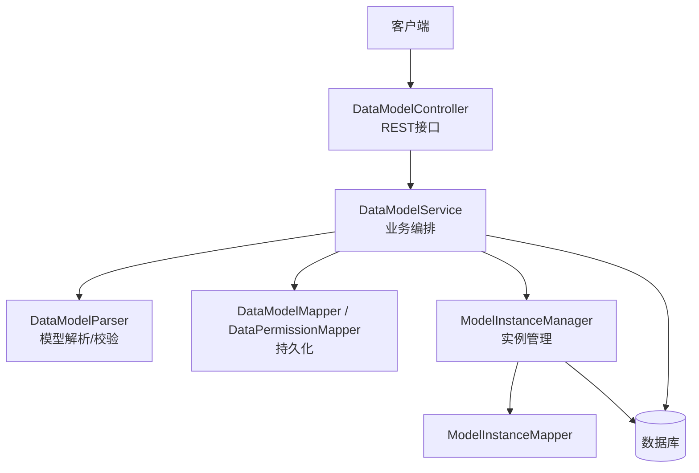
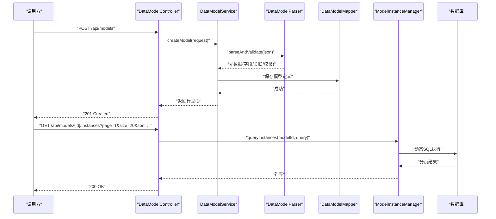
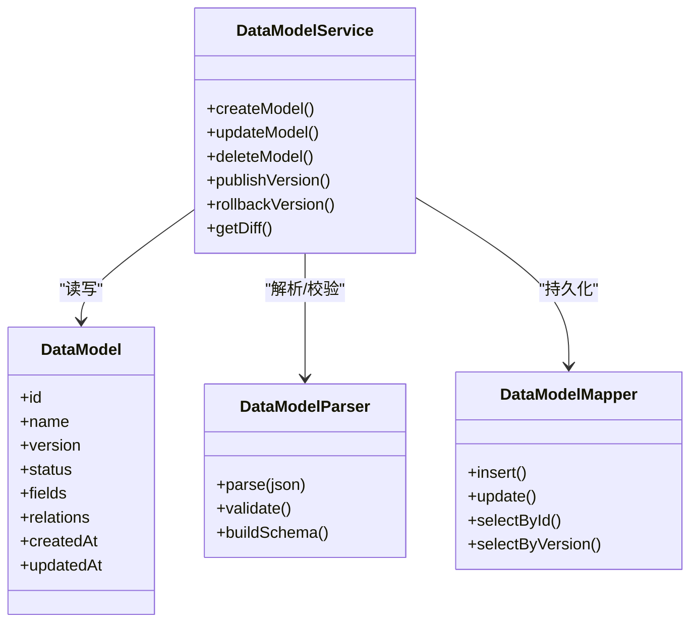
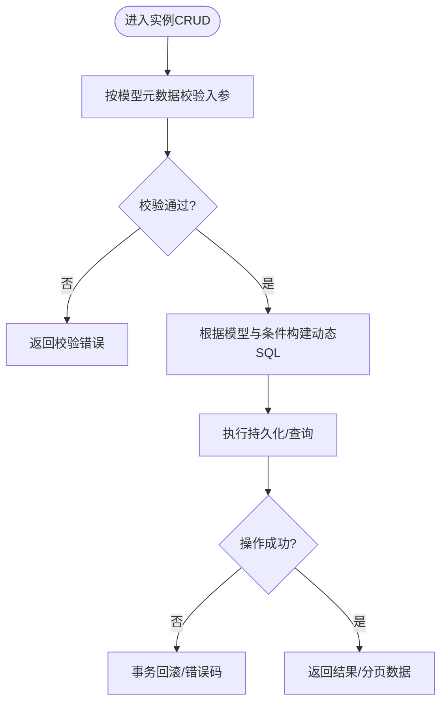
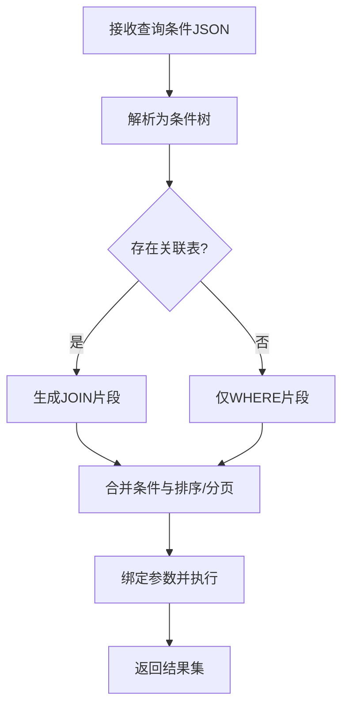
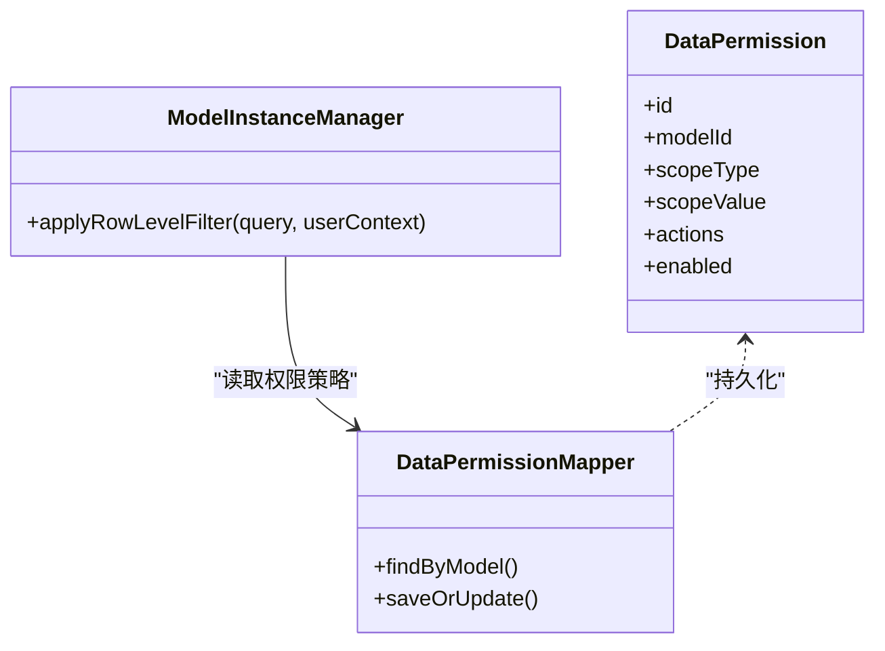
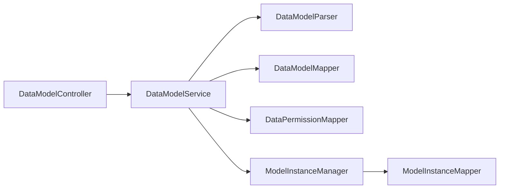

# 数据模型API

<cite>
**本文引用的文件**   
- [DataModelController.java](file://flow-engine/src/main/java/com/flow/engine/controller/DataModelController.java)
- [DataModelService.java](file://flow-engine/src/main/java/com/flow/engine/service/DataModelService.java)
- [DataModelParser.java](file://flow-engine/src/main/java/com/flow/engine/parser/DataModelParser.java)
- [DataModel.java](file://flow-engine/src/main/java/com/flow/engine/entity/DataModel.java)
- [DataModelMapper.java](file://flow-engine/src/main/java/com/flow/engine/mapper/DataModelMapper.java)
- [DataPermission.java](file://flow-engine/src/main/java/com/flow/engine/entity/DataPermission.java)
- [DataPermissionMapper.java](file://flow-engine/src/main/java/com/flow/engine/mapper/DataPermissionMapper.java)
- [ModelInstanceManager.java](file://flow-engine/src/main/java/com/flow/engine/service/ModelInstanceManager.java)
- [ModelInstance.java](file://flow-engine/src/main/java/com/flow/engine/entity/ModelInstance.java)
- [ModelInstanceMapper.java](file://flow-engine/src/main/java/com/flow/engine/mapper/ModelInstanceMapper.java)
- [MybatisPlusConfig.java](file://flow-engine/src/main/java/com/flow/engine/config/MybatisPlusConfig.java)
- [CacheConfig.java](file://flow-engine/src/main/java/com/flow/engine/config/CacheConfig.java)
- [schema.sql](file://flow-engine/src/main/resources/db/schema.sql)
</cite>

## 目录
1. [简介](#简介)
2. [项目结构](#项目结构)
3. [核心组件](#核心组件)
4. [架构总览](#架构总览)
5. [详细组件分析](#详细组件分析)
6. [依赖关系分析](#依赖关系分析)
7. [性能考虑](#性能考虑)
8. [故障排查指南](#故障排查指南)
9. [结论](#结论)
10. [附录](#附录)

## 简介
本文件面向“动态数据模型”的RESTful API，覆盖以下能力：
- 数据模型的创建与定义（字段、关联关系）
- 模型实例的CRUD与批量操作
- 模型版本管理与迁移接口支持
- 复杂查询条件构建与动态SQL生成机制
- 数据校验规则与约束配置
- 数据导出与导入接口
- 数据权限控制与行级安全策略
- 性能优化与缓存策略

## 项目结构
后端采用分层架构：控制器层暴露REST接口，服务层封装业务逻辑，解析器负责将JSON模型描述转换为内部元数据，持久层通过MyBatis-Plus访问数据库。

图表来源
- [DataModelController.java](file://flow-engine/src/main/java/com/flow/engine/controller/DataModelController.java)
- [DataModelService.java](file://flow-engine/src/main/java/com/flow/engine/service/DataModelService.java)
- [DataModelParser.java](file://flow-engine/src/main/java/com/flow/engine/parser/DataModelParser.java)
- [DataModelMapper.java](file://flow-engine/src/main/java/com/flow/engine/mapper/DataModelMapper.java)
- [DataPermissionMapper.java](file://flow-engine/src/main/java/com/flow/engine/mapper/DataPermissionMapper.java)
- [ModelInstanceManager.java](file://flow-engine/src/main/java/com/flow/engine/service/ModelInstanceManager.java)
- [ModelInstanceMapper.java](file://flow-engine/src/main/java/com/flow/engine/mapper/ModelInstanceMapper.java)

章节来源
- [DataModelController.java](file://flow-engine/src/main/java/com/flow/engine/controller/DataModelController.java)
- [DataModelService.java](file://flow-engine/src/main/java/com/flow/engine/service/DataModelService.java)
- [DataModelParser.java](file://flow-engine/src/main/java/com/flow/engine/parser/DataModelParser.java)
- [DataModelMapper.java](file://flow-engine/src/main/java/com/flow/engine/mapper/DataModelMapper.java)
- [DataPermissionMapper.java](file://flow-engine/src/main/java/com/flow/engine/mapper/DataPermissionMapper.java)
- [ModelInstanceManager.java](file://flow-engine/src/main/java/com/flow/engine/service/ModelInstanceManager.java)
- [ModelInstanceMapper.java](file://flow-engine/src/main/java/com/flow/engine/mapper/ModelInstanceMapper.java)

## 核心组件
- 控制器层
  - 提供数据模型与模型实例的REST端点，包括创建、更新、删除、查询、批量操作、导入导出等。
- 服务层
  - 编排模型定义生命周期、解析与校验、实例CRUD、权限过滤、分页与排序、事务边界。
- 解析器
  - 将JSON模型描述解析为内部元数据，校验字段类型、必填、唯一性、长度、正则、默认值、计算字段、关联关系等。
- 持久层
  - 使用MyBatis-Plus进行数据访问；数据模型元数据与权限策略分别落库。
- 实例管理器
  - 统一处理模型实例的增删改查、批量写入、动态查询、导出导入、版本与迁移辅助。

章节来源
- [DataModelController.java](file://flow-engine/src/main/java/com/flow/engine/controller/DataModelController.java)
- [DataModelService.java](file://flow-engine/src/main/java/com/flow/engine/service/DataModelService.java)
- [DataModelParser.java](file://flow-engine/src/main/java/com/flow/engine/parser/DataModelParser.java)
- [ModelInstanceManager.java](file://flow-engine/src/main/java/com/flow/engine/service/ModelInstanceManager.java)

## 架构总览
下图展示从请求到响应的主要路径，以及模型解析、权限过滤、动态SQL生成的参与点。

图表来源
- [DataModelController.java](file://flow-engine/src/main/java/com/flow/engine/controller/DataModelController.java)
- [DataModelService.java](file://flow-engine/src/main/java/com/flow/engine/service/DataModelService.java)
- [DataModelParser.java](file://flow-engine/src/main/java/com/flow/engine/parser/DataModelParser.java)
- [DataModelMapper.java](file://flow-engine/src/main/java/com/flow/engine/mapper/DataModelMapper.java)
- [ModelInstanceManager.java](file://flow-engine/src/main/java/com/flow/engine/service/ModelInstanceManager.java)

## 详细组件分析

### 数据模型定义与版本管理
- 功能要点
  - 创建/更新/删除数据模型，支持字段定义（名称、类型、是否必填、默认值、长度、正则、枚举、索引）、关联关系（一对一、一对多、多对多）。
  - 版本管理：每次发布新版本时保留历史版本，支持回滚与差异对比。
  - 迁移：基于版本变更自动生成迁移脚本或执行增量DDL。
- 关键流程
  - 接收JSON模型定义 -> 解析并校验 -> 持久化模型元数据 -> 记录版本信息 -> 触发迁移任务（可选异步）。
- 数据结构概览
  - 模型实体包含基础属性、版本、状态、创建/更新时间等。
  - 字段集合、关联关系集合、校验规则集合作为子结构存储。

图表来源
- [DataModel.java](file://flow-engine/src/main/java/com/flow/engine/entity/DataModel.java)
- [DataModelService.java](file://flow-engine/src/main/java/com/flow/engine/service/DataModelService.java)
- [DataModelParser.java](file://flow-engine/src/main/java/com/flow/engine/parser/DataModelParser.java)
- [DataModelMapper.java](file://flow-engine/src/main/java/com/flow/engine/mapper/DataModelMapper.java)

章节来源
- [DataModelController.java](file://flow-engine/src/main/java/com/flow/engine/controller/DataModelController.java)
- [DataModelService.java](file://flow-engine/src/main/java/com/flow/engine/service/DataModelService.java)
- [DataModelParser.java](file://flow-engine/src/main/java/com/flow/engine/parser/DataModelParser.java)
- [DataModel.java](file://flow-engine/src/main/java/com/flow/engine/entity/DataModel.java)
- [DataModelMapper.java](file://flow-engine/src/main/java/com/flow/engine/mapper/DataModelMapper.java)

### 模型实例CRUD与批量操作
- 功能要点
  - 单条/批量新增、更新、删除、按主键获取、分页查询、排序、过滤。
  - 批量操作支持事务一致性、失败回滚、部分成功统计。
- 关键流程
  - 接收请求体 -> 根据模型元数据校验 -> 组装SQL -> 执行持久化 -> 返回结果。
- 动态查询
  - 支持多条件组合、范围查询、模糊匹配、IN/NOT IN、空值判断、时间区间等。
  - 查询条件由前端以结构化对象传递，服务端解析为动态SQL片段。

图表来源
- [ModelInstanceManager.java](file://flow-engine/src/main/java/com/flow/engine/service/ModelInstanceManager.java)
- [ModelInstanceMapper.java](file://flow-engine/src/main/java/com/flow/engine/mapper/ModelInstanceMapper.java)

章节来源
- [ModelInstanceManager.java](file://flow-engine/src/main/java/com/flow/engine/service/ModelInstanceManager.java)
- [ModelInstance.java](file://flow-engine/src/main/java/com/flow/engine/entity/ModelInstance.java)
- [ModelInstanceMapper.java](file://flow-engine/src/main/java/com/flow/engine/mapper/ModelInstanceMapper.java)

### 复杂查询与动态SQL生成
- 输入规范
  - 查询条件以结构化对象表示，包含字段名、操作符、值、逻辑连接词（AND/OR）、嵌套条件等。
- 生成策略
  - 将结构化条件映射为SQL WHERE片段，自动拼接参数占位符，防止注入。
  - 支持分页、排序、字段投影、聚合（如计数、求和）扩展。
- 性能建议
  - 避免全表扫描，强制分页；对高频过滤字段建立索引；限制单次查询最大行数。

图表来源
- [ModelInstanceManager.java](file://flow-engine/src/main/java/com/flow/engine/service/ModelInstanceManager.java)
- [MybatisPlusConfig.java](file://flow-engine/src/main/java/com/flow/engine/config/MybatisPlusConfig.java)

章节来源
- [ModelInstanceManager.java](file://flow-engine/src/main/java/com/flow/engine/service/ModelInstanceManager.java)
- [MybatisPlusConfig.java](file://flow-engine/src/main/java/com/flow/engine/config/MybatisPlusConfig.java)

### 数据校验与约束配置
- 支持的约束
  - 必填、唯一、长度、数值范围、正则表达式、枚举、默认值、计算字段、外键关联有效性。
- 校验时机
  - 模型定义阶段：校验字段与约束语法正确性。
  - 实例写入阶段：按模型约束校验入参，不合法则拒绝并返回具体字段错误。
- 错误反馈
  - 返回字段级错误消息，便于前端定位与提示。

章节来源
- [DataModelParser.java](file://flow-engine/src/main/java/com/flow/engine/parser/DataModelParser.java)
- [DataModelService.java](file://flow-engine/src/main/java/com/flow/engine/service/DataModelService.java)

### 数据导入与导出
- 导入
  - 支持CSV/Excel/JSON格式，逐行解析并按模型元数据校验，批量入库，失败行记录日志并可重试。
- 导出
  - 支持按查询条件导出数据，流式输出，避免内存溢出；可指定列与格式化选项。
- 并发与限流
  - 大文件导入需限流与断点续传；导出支持分页拉取与压缩打包。

章节来源
- [ModelInstanceManager.java](file://flow-engine/src/main/java/com/flow/engine/service/ModelInstanceManager.java)

### 数据权限与行级安全
- 策略模型
  - 数据权限实体用于描述角色/用户/部门对某模型的可见范围与操作范围。
- 行级过滤
  - 在查询前注入行级过滤条件（如dept_id、owner_id），确保只返回授权数据。
- 表单级权限
  - 结合表单权限服务，控制字段级可见与可编辑。

图表来源
- [DataPermission.java](file://flow-engine/src/main/java/com/flow/engine/entity/DataPermission.java)
- [DataPermissionMapper.java](file://flow-engine/src/main/java/com/flow/engine/mapper/DataPermissionMapper.java)
- [ModelInstanceManager.java](file://flow-engine/src/main/java/com/flow/engine/service/ModelInstanceManager.java)

章节来源
- [DataPermission.java](file://flow-engine/src/main/java/com/flow/engine/entity/DataPermission.java)
- [DataPermissionMapper.java](file://flow-engine/src/main/java/com/flow/engine/mapper/DataPermissionMapper.java)
- [ModelInstanceManager.java](file://flow-engine/src/main/java/com/flow/engine/service/ModelInstanceManager.java)

### 版本管理与迁移接口
- 版本管理
  - 发布新版本、查看历史版本、回滚至指定版本、对比差异。
- 迁移
  - 基于模型差异生成DDL或执行迁移脚本；支持幂等与回滚。
- 兼容性
  - 旧版本实例在新模型下仍可读写，必要时进行数据兼容转换。

章节来源
- [DataModelService.java](file://flow-engine/src/main/java/com/flow/engine/service/DataModelService.java)
- [DataModelParser.java](file://flow-engine/src/main/java/com/flow/engine/parser/DataModelParser.java)

## 依赖关系分析
- 组件耦合
  - 控制器与服务松耦合，服务依赖解析器与持久层；实例管理器独立于模型定义，但依赖权限策略。
- 外部依赖
  - MyBatis-Plus提供通用CRUD与分页；数据库驱动与连接池由应用配置管理。
- 潜在风险
  - 动态SQL需严格参数绑定，避免注入；大数据量导入导出需流式处理与背压控制。

图表来源
- [DataModelController.java](file://flow-engine/src/main/java/com/flow/engine/controller/DataModelController.java)
- [DataModelService.java](file://flow-engine/src/main/java/com/flow/engine/service/DataModelService.java)
- [DataModelParser.java](file://flow-engine/src/main/java/com/flow/engine/parser/DataModelParser.java)
- [DataModelMapper.java](file://flow-engine/src/main/java/com/flow/engine/mapper/DataModelMapper.java)
- [DataPermissionMapper.java](file://flow-engine/src/main/java/com/flow/engine/mapper/DataPermissionMapper.java)
- [ModelInstanceManager.java](file://flow-engine/src/main/java/com/flow/engine/service/ModelInstanceManager.java)
- [ModelInstanceMapper.java](file://flow-engine/src/main/java/com/flow/engine/mapper/ModelInstanceMapper.java)

章节来源
- [DataModelController.java](file://flow-engine/src/main/java/com/flow/engine/controller/DataModelController.java)
- [DataModelService.java](file://flow-engine/src/main/java/com/flow/engine/service/DataModelService.java)
- [DataModelParser.java](file://flow-engine/src/main/java/com/flow/engine/parser/DataModelParser.java)
- [DataModelMapper.java](file://flow-engine/src/main/java/com/flow/engine/mapper/DataModelMapper.java)
- [DataPermissionMapper.java](file://flow-engine/src/main/java/com/flow/engine/mapper/DataPermissionMapper.java)
- [ModelInstanceManager.java](file://flow-engine/src/main/java/com/flow/engine/service/ModelInstanceManager.java)
- [ModelInstanceMapper.java](file://flow-engine/src/main/java/com/flow/engine/mapper/ModelInstanceMapper.java)

## 性能考虑
- 查询优化
  - 强制分页与排序；对常用过滤字段建索引；避免SELECT *，按需投影字段。
- 批量操作
  - 使用批量插入/更新；控制批次大小；失败重试与幂等设计。
- 缓存策略
  - 模型元数据与权限策略适合短期缓存，减少频繁读库；注意失效与一致性。
- 导入导出
  - 流式读写；分片处理；压缩传输；限速与熔断保护。

章节来源
- [MybatisPlusConfig.java](file://flow-engine/src/main/java/com/flow/engine/config/MybatisPlusConfig.java)
- [CacheConfig.java](file://flow-engine/src/main/java/com/flow/engine/config/CacheConfig.java)
- [ModelInstanceManager.java](file://flow-engine/src/main/java/com/flow/engine/service/ModelInstanceManager.java)

## 故障排查指南
- 常见问题
  - 模型定义校验失败：检查字段类型、必填、唯一、正则、长度等约束。
  - 动态查询无结果：确认条件结构与字段名一致，检查行级权限过滤是否过严。
  - 导入失败：查看失败行日志，核对数据类型与约束；分批重试。
  - 导出超时：缩小查询范围、增加分页、启用压缩。
- 定位手段
  - 开启慢查询日志；监控SQL执行计划；检查索引命中情况；观察缓存命中率。

章节来源
- [DataModelParser.java](file://flow-engine/src/main/java/com/flow/engine/parser/DataModelParser.java)
- [ModelInstanceManager.java](file://flow-engine/src/main/java/com/flow/engine/service/ModelInstanceManager.java)

## 结论
本API围绕“动态数据模型”提供了完整的生命周期管理能力，涵盖模型定义、实例CRUD、复杂查询、权限控制、导入导出、版本迁移与性能优化。通过解析器与服务层的解耦设计，系统具备良好的可扩展性与可维护性。建议在上线前完善索引策略、缓存策略与监控告警，保障高可用与高性能。

## 附录
- 数据库初始化
  - 参考schema.sql中的表结构与初始数据，确保模型元数据与权限策略表就绪。

章节来源
- [schema.sql](file://flow-engine/src/main/resources/db/schema.sql)