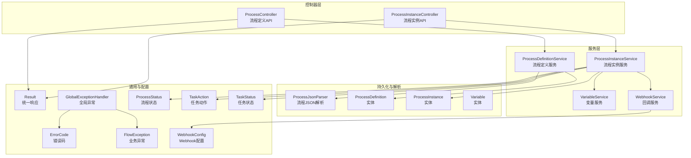
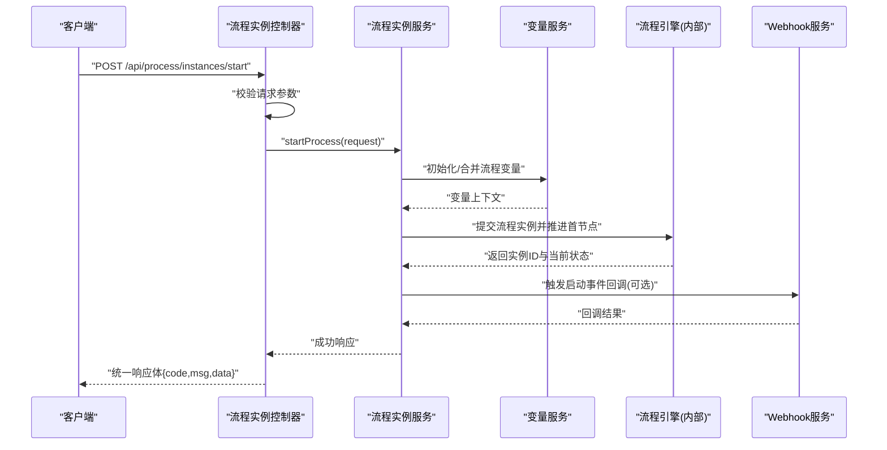
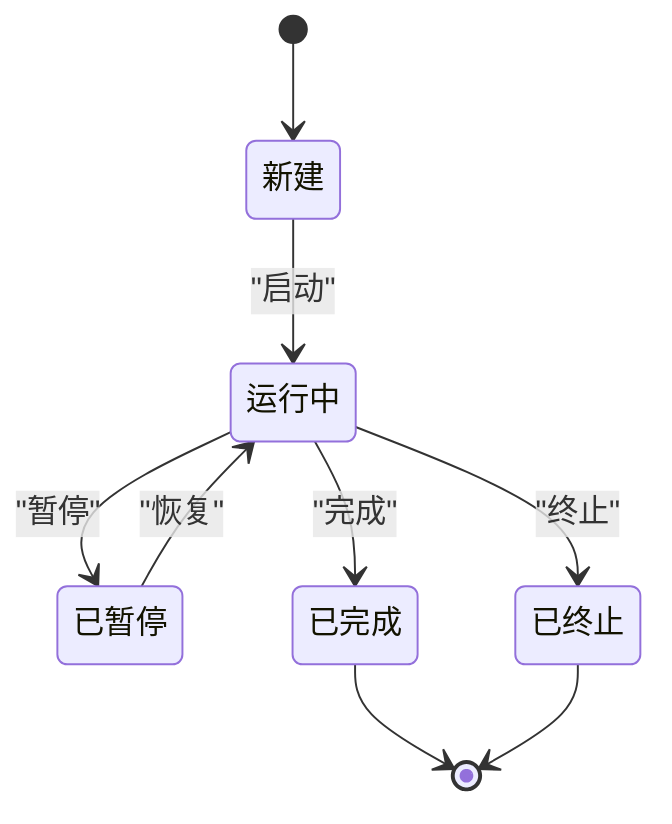
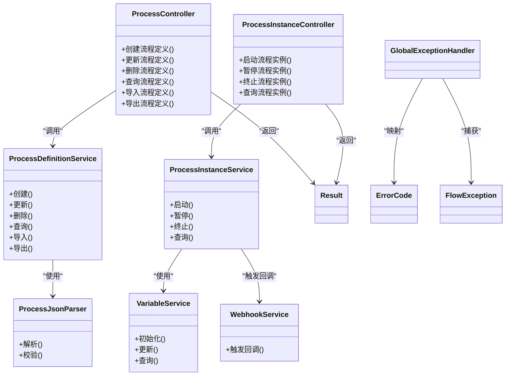

# 流程管理API

<cite>
**本文引用的文件**   
- [ProcessController.java](file://flow-engine/src/main/java/com/flow/engine/controller/ProcessController.java)
- [ProcessInstanceController.java](file://flow-engine/src/main/java/com/flow/engine/controller/ProcessInstanceController.java)
- [ProcessDefinitionService.java](file://flow-engine/src/main/java/com/flow/engine/service/ProcessDefinitionService.java)
- [ProcessInstanceService.java](file://flow-engine/src/main/java/com/flow/engine/service/ProcessInstanceService.java)
- [VariableService.java](file://flow-engine/src/main/java/com/flow/engine/service/VariableService.java)
- [ProcessDefinitionCreateRequest.java](file://flow-engine/src/main/java/com/flow/engine/dto/ProcessDefinitionCreateRequest.java)
- [ProcessDefinitionUpdateRequest.java](file://flow-engine/src/main/java/com/flow/engine/dto/ProcessDefinitionUpdateRequest.java)
- [ProcessDefinitionImportRequest.java](file://flow-engine/src/main/java/com/flow/engine/dto/ProcessDefinitionImportRequest.java)
- [ProcessDefinitionResponse.java](file://flow-engine/src/main/java/com/flow/engine/dto/ProcessDefinitionResponse.java)
- [StartProcessRequest.java](file://flow-engine/src/main/java/com/flow/engine/dto/StartProcessRequest.java)
- [ProcessInstanceResponse.java](file://flow-engine/src/main/java/com/flow/engine/dto/ProcessInstanceResponse.java)
- [Result.java](file://flow-engine/src/main/java/com/flow/engine/common/Result.java)
- [ErrorCode.java](file://flow-engine/src/main/java/com/flow/engine/common/ErrorCode.java)
- [GlobalExceptionHandler.java](file://flow-engine/src/main/java/com/flow/engine/common/GlobalExceptionHandler.java)
- [FlowException.java](file://flow-engine/src/main/java/com/flow/engine/common/exception/FlowException.java)
- [ProcessStatus.java](file://flow-engine/src/main/java/com/flow/engine/common/enums/ProcessStatus.java)
- [TaskAction.java](file://flow-engine/src/main/java/com/flow/engine/common/enums/TaskAction.java)
- [TaskStatus.java](file://flow-engine/src/main/java/com/flow/engine/common/enums/TaskStatus.java)
- [ProcessDefinition.java](file://flow-engine/src/main/java/com/flow/engine/entity/ProcessDefinition.java)
- [ProcessInstance.java](file://flow-engine/src/main/java/com/flow/engine/entity/ProcessInstance.java)
- [Variable.java](file://flow-engine/src/main/java/com/flow/engine/entity/Variable.java)
- [ProcessJsonParser.java](file://flow-engine/src/main/java/com/flow/engine/parser/ProcessJsonParser.java)
- [WebhookConfig.java](file://flow-engine/src/main/java/com/flow/engine/config/WebhookConfig.java)
- [WebhookService.java](file://flow-engine/src/main/java/com/flow/engine/service/WebhookService.java)
</cite>

## 目录
1. [简介](#简介)
2. [项目结构](#项目结构)
3. [核心组件](#核心组件)
4. [架构总览](#架构总览)
5. [详细组件分析](#详细组件分析)
6. [依赖关系分析](#依赖关系分析)
7. [性能考虑](#性能考虑)
8. [故障排查指南](#故障排查指南)
9. [结论](#结论)
10. [附录](#附录)

## 简介
本文件为“流程管理API”的权威技术文档，聚焦于：
- 流程定义管理：创建、更新、删除、查询与版本控制
- 流程实例管理：启动、暂停、终止与查询
- 导入导出：流程定义的JSON文件上传与解析
- 状态变更：流程与任务的状态机规则及接口调用方式
- 变量传递与数据绑定：流程变量的生命周期与作用域
- 批量操作与分页查询：统一返回结构与分页参数约定
- 错误码与异常处理：全局异常处理器与业务异常规范

## 项目结构
后端采用Spring Boot分层架构，控制器层暴露REST API，服务层封装业务流程，实体与DTO承载数据模型，枚举与通用结果对象提供统一契约。

图表来源
- [ProcessController.java](file://flow-engine/src/main/java/com/flow/engine/controller/ProcessController.java)
- [ProcessInstanceController.java](file://flow-engine/src/main/java/com/flow/engine/controller/ProcessInstanceController.java)
- [ProcessDefinitionService.java](file://flow-engine/src/main/java/com/flow/engine/service/ProcessDefinitionService.java)
- [ProcessInstanceService.java](file://flow-engine/src/main/java/com/flow/engine/service/ProcessInstanceService.java)
- [VariableService.java](file://flow-engine/src/main/java/com/flow/engine/service/VariableService.java)
- [WebhookService.java](file://flow-engine/src/main/java/com/flow/engine/service/WebhookService.java)
- [ProcessJsonParser.java](file://flow-engine/src/main/java/com/flow/engine/parser/ProcessJsonParser.java)
- [ProcessDefinition.java](file://flow-engine/src/main/java/com/flow/engine/entity/ProcessDefinition.java)
- [ProcessInstance.java](file://flow-engine/src/main/java/com/flow/engine/entity/ProcessInstance.java)
- [Variable.java](file://flow-engine/src/main/java/com/flow/engine/entity/Variable.java)
- [Result.java](file://flow-engine/src/main/java/com/flow/engine/common/Result.java)
- [ErrorCode.java](file://flow-engine/src/main/java/com/flow/engine/common/ErrorCode.java)
- [GlobalExceptionHandler.java](file://flow-engine/src/main/java/com/flow/engine/common/GlobalExceptionHandler.java)
- [FlowException.java](file://flow-engine/src/main/java/com/flow/engine/common/exception/FlowException.java)
- [ProcessStatus.java](file://flow-engine/src/main/java/com/flow/engine/common/enums/ProcessStatus.java)
- [TaskAction.java](file://flow-engine/src/main/java/com/flow/engine/common/enums/TaskAction.java)
- [TaskStatus.java](file://flow-engine/src/main/java/com/flow/engine/common/enums/TaskStatus.java)
- [WebhookConfig.java](file://flow-engine/src/main/java/com/flow/engine/config/WebhookConfig.java)

章节来源
- [ProcessController.java](file://flow-engine/src/main/java/com/flow/engine/controller/ProcessController.java)
- [ProcessInstanceController.java](file://flow-engine/src/main/java/com/flow/engine/controller/ProcessInstanceController.java)
- [ProcessDefinitionService.java](file://flow-engine/src/main/java/com/flow/engine/service/ProcessDefinitionService.java)
- [ProcessInstanceService.java](file://flow-engine/src/main/java/com/flow/engine/service/ProcessInstanceService.java)
- [VariableService.java](file://flow-engine/src/main/java/com/flow/engine/service/VariableService.java)
- [WebhookService.java](file://flow-engine/src/main/java/com/flow/engine/service/WebhookService.java)
- [ProcessJsonParser.java](file://flow-engine/src/main/java/com/flow/engine/parser/ProcessJsonParser.java)
- [ProcessDefinition.java](file://flow-engine/src/main/java/com/flow/engine/entity/ProcessDefinition.java)
- [ProcessInstance.java](file://flow-engine/src/main/java/com/flow/engine/entity/ProcessInstance.java)
- [Variable.java](file://flow-engine/src/main/java/com/flow/engine/entity/Variable.java)
- [Result.java](file://flow-engine/src/main/java/com/flow/engine/common/Result.java)
- [ErrorCode.java](file://flow-engine/src/main/java/com/flow/engine/common/ErrorCode.java)
- [GlobalExceptionHandler.java](file://flow-engine/src/main/java/com/flow/engine/common/GlobalExceptionHandler.java)
- [FlowException.java](file://flow-engine/src/main/java/com/flow/engine/common/exception/FlowException.java)
- [ProcessStatus.java](file://flow-engine/src/main/java/com/flow/engine/common/enums/ProcessStatus.java)
- [TaskAction.java](file://flow-engine/src/main/java/com/flow/engine/common/enums/TaskAction.java)
- [TaskStatus.java](file://flow-engine/src/main/java/com/flow/engine/common/enums/TaskStatus.java)
- [WebhookConfig.java](file://flow-engine/src/main/java/com/flow/engine/config/WebhookConfig.java)

## 核心组件
- 控制器
  - 流程定义控制器：负责流程定义的CRUD、版本管理与导入导出
  - 流程实例控制器：负责流程实例的启动、暂停、终止与查询
- 服务层
  - 流程定义服务：封装流程定义的业务逻辑（含版本策略）
  - 流程实例服务：封装流程实例的生命周期与状态机
  - 变量服务：维护流程变量作用域与持久化
  - Webhook服务：在关键节点触发外部回调
- 解析器
  - 流程JSON解析器：校验并转换前端设计器输出的JSON到引擎内部模型
- 通用与配置
  - 统一响应体Result与错误码ErrorCode
  - 全局异常处理器GlobalExceptionHandler与业务异常FlowException
  - 状态与动作枚举：ProcessStatus、TaskAction、TaskStatus
  - Webhook配置WebhookConfig

章节来源
- [ProcessController.java](file://flow-engine/src/main/java/com/flow/engine/controller/ProcessController.java)
- [ProcessInstanceController.java](file://flow-engine/src/main/java/com/flow/engine/controller/ProcessInstanceController.java)
- [ProcessDefinitionService.java](file://flow-engine/src/main/java/com/flow/engine/service/ProcessDefinitionService.java)
- [ProcessInstanceService.java](file://flow-engine/src/main/java/com/flow/engine/service/ProcessInstanceService.java)
- [VariableService.java](file://flow-engine/src/main/java/com/flow/engine/service/VariableService.java)
- [WebhookService.java](file://flow-engine/src/main/java/com/flow/engine/service/WebhookService.java)
- [ProcessJsonParser.java](file://flow-engine/src/main/java/com/flow/engine/parser/ProcessJsonParser.java)
- [Result.java](file://flow-engine/src/main/java/com/flow/engine/common/Result.java)
- [ErrorCode.java](file://flow-engine/src/main/java/com/flow/engine/common/ErrorCode.java)
- [GlobalExceptionHandler.java](file://flow-engine/src/main/java/com/flow/engine/common/GlobalExceptionHandler.java)
- [FlowException.java](file://flow-engine/src/main/java/com/flow/engine/common/exception/FlowException.java)
- [ProcessStatus.java](file://flow-engine/src/main/java/com/flow/engine/common/enums/ProcessStatus.java)
- [TaskAction.java](file://flow-engine/src/main/java/com/flow/engine/common/enums/TaskAction.java)
- [TaskStatus.java](file://flow-engine/src/main/java/com/flow/engine/common/enums/TaskStatus.java)
- [WebhookConfig.java](file://flow-engine/src/main/java/com/flow/engine/config/WebhookConfig.java)

## 架构总览
以下序列图展示“启动流程实例”的典型调用链，包括请求进入、参数校验、变量注入、引擎执行与回调通知。

图表来源
- [ProcessInstanceController.java](file://flow-engine/src/main/java/com/flow/engine/controller/ProcessInstanceController.java)
- [ProcessInstanceService.java](file://flow-engine/src/main/java/com/flow/engine/service/ProcessInstanceService.java)
- [VariableService.java](file://flow-engine/src/main/java/com/flow/engine/service/VariableService.java)
- [WebhookService.java](file://flow-engine/src/main/java/com/flow/engine/service/WebhookService.java)
- [WebhookConfig.java](file://flow-engine/src/main/java/com/flow/engine/config/WebhookConfig.java)

## 详细组件分析

### 流程定义管理API
- 功能范围
  - 创建流程定义（支持版本控制）
  - 更新流程定义（增量或全量覆盖，按版本策略）
  - 删除流程定义（软删除或物理删除，受运行中实例约束）
  - 查询流程定义（按关键字、分类、版本等过滤）
  - 导入流程定义（JSON文件上传与解析）
  - 导出流程定义（下载JSON）
- 典型接口说明（以路径与方法为准）
  - 创建：POST /api/process/definitions
    - 请求体：使用流程定义创建请求对象
    - 响应：统一响应体，包含新版本的定义信息
  - 更新：PUT /api/process/definitions/{id}
    - 请求体：使用流程定义更新请求对象
    - 响应：统一响应体，包含新版本信息
  - 删除：DELETE /api/process/definitions/{id}
    - 路径参数：定义ID
    - 响应：统一响应体
  - 查询：GET /api/process/definitions
    - 查询参数：关键字、分类、版本号、分页参数
    - 响应：统一响应体，包含分页列表
  - 导入：POST /api/process/definitions/import
    - 内容类型：multipart/form-data
    - 表单字段：file(JSON)，可选version、deploy等
    - 响应：统一响应体，包含导入后的定义ID与版本
  - 导出：GET /api/process/definitions/{id}/export
    - 路径参数：定义ID
    - 响应：application/json，返回流程定义JSON
- 版本控制规则
  - 每次更新生成新版本；默认保留历史版本
  - 激活版本用于启动实例；可指定特定版本启动
  - 删除时若存在运行中实例，需遵循安全策略（拒绝或仅软删除）
- 导入导出规范
  - 导入格式：遵循流程JSON结构，由解析器校验
  - 导出格式：与导入一致，便于迁移与备份
- 示例（成功）
  - 请求：POST /api/process/definitions
    - 请求体：流程定义创建请求对象
  - 响应：统一响应体，data包含新定义ID与版本
- 示例（失败）
  - 请求：POST /api/process/definitions
    - 请求体：缺少必填字段
  - 响应：统一响应体，code为非零，msg描述错误原因

章节来源
- [ProcessController.java](file://flow-engine/src/main/java/com/flow/engine/controller/ProcessController.java)
- [ProcessDefinitionService.java](file://flow-engine/src/main/java/com/flow/engine/service/ProcessDefinitionService.java)
- [ProcessDefinitionCreateRequest.java](file://flow-engine/src/main/java/com/flow/engine/dto/ProcessDefinitionCreateRequest.java)
- [ProcessDefinitionUpdateRequest.java](file://flow-engine/src/main/java/com/flow/engine/dto/ProcessDefinitionUpdateRequest.java)
- [ProcessDefinitionImportRequest.java](file://flow-engine/src/main/java/com/flow/engine/dto/ProcessDefinitionImportRequest.java)
- [ProcessDefinitionResponse.java](file://flow-engine/src/main/java/com/flow/engine/dto/ProcessDefinitionResponse.java)
- [ProcessJsonParser.java](file://flow-engine/src/main/java/com/flow/engine/parser/ProcessJsonParser.java)
- [Result.java](file://flow-engine/src/main/java/com/flow/engine/common/Result.java)
- [ErrorCode.java](file://flow-engine/src/main/java/com/flow/engine/common/ErrorCode.java)
- [GlobalExceptionHandler.java](file://flow-engine/src/main/java/com/flow/engine/common/GlobalExceptionHandler.java)
- [FlowException.java](file://flow-engine/src/main/java/com/flow/engine/common/exception/FlowException.java)

### 流程实例管理API
- 功能范围
  - 启动流程实例
  - 暂停流程实例
  - 终止流程实例
  - 查询流程实例（按关键字、状态、时间范围、分页）
- 典型接口说明（以路径与方法为准）
  - 启动：POST /api/process/instances/start
    - 请求体：使用启动请求对象，包含流程定义标识、初始变量等
    - 响应：统一响应体，包含实例ID与当前状态
  - 暂停：PUT /api/process/instances/{id}/suspend
    - 路径参数：实例ID
    - 响应：统一响应体
  - 终止：PUT /api/process/instances/{id}/terminate
    - 路径参数：实例ID
    - 响应：统一响应体
  - 查询：GET /api/process/instances
    - 查询参数：关键字、状态、开始/结束时间、分页参数
    - 响应：统一响应体，包含分页列表
- 示例（成功）
  - 请求：POST /api/process/instances/start
    - 请求体：启动请求对象
  - 响应：统一响应体，data包含实例ID与状态
- 示例（失败）
  - 请求：POST /api/process/instances/start
    - 请求体：无效的流程定义标识
  - 响应：统一响应体，code为非零，msg描述错误原因

章节来源
- [ProcessInstanceController.java](file://flow-engine/src/main/java/com/flow/engine/controller/ProcessInstanceController.java)
- [ProcessInstanceService.java](file://flow-engine/src/main/java/com/flow/engine/service/ProcessInstanceService.java)
- [StartProcessRequest.java](file://flow-engine/src/main/java/com/flow/engine/dto/StartProcessRequest.java)
- [ProcessInstanceResponse.java](file://flow-engine/src/main/java/com/flow/engine/dto/ProcessInstanceResponse.java)
- [Result.java](file://flow-engine/src/main/java/com/flow/engine/common/Result.java)
- [ErrorCode.java](file://flow-engine/src/main/java/com/flow/engine/common/ErrorCode.java)
- [GlobalExceptionHandler.java](file://flow-engine/src/main/java/com/flow/engine/common/GlobalExceptionHandler.java)
- [FlowException.java](file://flow-engine/src/main/java/com/flow/engine/common/exception/FlowException.java)

### 流程状态与任务动作
- 流程状态
  - 常见状态：新建、运行中、已暂停、已完成、已终止、已回滚等
  - 状态转换受业务规则与权限控制
- 任务动作
  - 常见动作：完成、退回、加签、转办、委派等
  - 动作驱动任务状态流转，影响后续节点执行
- 状态机示意（概念）

章节来源
- [ProcessStatus.java](file://flow-engine/src/main/java/com/flow/engine/common/enums/ProcessStatus.java)
- [TaskAction.java](file://flow-engine/src/main/java/com/flow/engine/common/enums/TaskAction.java)
- [TaskStatus.java](file://flow-engine/src/main/java/com/flow/engine/common/enums/TaskStatus.java)

### 流程变量与数据绑定
- 变量作用域
  - 流程级变量：贯穿整个实例生命周期
  - 节点级变量：仅在节点执行期间有效
- 变量传递机制
  - 启动时通过请求体注入初始变量
  - 节点执行时可读取/更新变量
  - 变量持久化存储，支持表达式计算
- 数据绑定
  - 表单字段映射至流程变量
  - 表达式支持简单运算与函数调用
- 变量服务职责
  - 变量创建、更新、查询与清理
  - 与流程实例和节点执行上下文集成

章节来源
- [VariableService.java](file://flow-engine/src/main/java/com/flow/engine/service/VariableService.java)
- [Variable.java](file://flow-engine/src/main/java/com/flow/engine/entity/Variable.java)
- [StartProcessRequest.java](file://flow-engine/src/main/java/com/flow/engine/dto/StartProcessRequest.java)

### 导入导出与文件上传
- 导入流程定义
  - 接口：POST /api/process/definitions/import
  - 内容类型：multipart/form-data
  - 表单字段：file(JSON)、可选version、deploy
  - 解析：由流程JSON解析器校验并转换为内部模型
  - 响应：统一响应体，包含导入后的定义ID与版本
- 导出流程定义
  - 接口：GET /api/process/definitions/{id}/export
  - 响应：application/json，返回流程定义JSON
- 示例（成功）
  - 请求：POST /api/process/definitions/import
    - 表单：file=xxx.json
  - 响应：统一响应体，data包含导入结果
- 示例（失败）
  - 请求：POST /api/process/definitions/import
    - 表单：file格式不合法
  - 响应：统一响应体，code为非零，msg描述错误原因

章节来源
- [ProcessController.java](file://flow-engine/src/main/java/com/flow/engine/controller/ProcessController.java)
- [ProcessDefinitionImportRequest.java](file://flow-engine/src/main/java/com/flow/engine/dto/ProcessDefinitionImportRequest.java)
- [ProcessJsonParser.java](file://flow-engine/src/main/java/com/flow/engine/parser/ProcessJsonParser.java)
- [Result.java](file://flow-engine/src/main/java/com/flow/engine/common/Result.java)
- [ErrorCode.java](file://flow-engine/src/main/java/com/flow/engine/common/ErrorCode.java)
- [GlobalExceptionHandler.java](file://flow-engine/src/main/java/com/flow/engine/common/GlobalExceptionHandler.java)
- [FlowException.java](file://flow-engine/src/main/java/com/flow/engine/common/exception/FlowException.java)

### 批量操作与分页查询
- 批量操作
  - 批量删除流程定义：POST /api/process/definitions/batch-delete
    - 请求体：ID列表
    - 响应：统一响应体，包含成功与失败明细
  - 批量暂停/恢复流程实例：POST /api/process/instances/batch-suspend 或 batch-resume
    - 请求体：ID列表
    - 响应：统一响应体，包含成功与失败明细
- 分页查询
  - 通用分页参数：page、size、sort、order
  - 查询接口：GET /api/process/definitions 与 GET /api/process/instances
  - 响应：统一响应体，data包含分页信息与列表

章节来源
- [ProcessController.java](file://flow-engine/src/main/java/com/flow/engine/controller/ProcessController.java)
- [ProcessInstanceController.java](file://flow-engine/src/main/java/com/flow/engine/controller/ProcessInstanceController.java)
- [Result.java](file://flow-engine/src/main/java/com/flow/engine/common/Result.java)

## 依赖关系分析
- 控制器与服务耦合
  - 流程定义控制器依赖流程定义服务
  - 流程实例控制器依赖流程实例服务
- 服务与解析器/实体
  - 流程定义服务依赖流程JSON解析器与流程定义实体
  - 流程实例服务依赖流程实例实体、变量服务与Webhook服务
- 通用模块
  - 统一响应体与错误码被所有控制器使用
  - 全局异常处理器捕获业务异常并转换为统一响应

图表来源
- [ProcessController.java](file://flow-engine/src/main/java/com/flow/engine/controller/ProcessController.java)
- [ProcessInstanceController.java](file://flow-engine/src/main/java/com/flow/engine/controller/ProcessInstanceController.java)
- [ProcessDefinitionService.java](file://flow-engine/src/main/java/com/flow/engine/service/ProcessDefinitionService.java)
- [ProcessInstanceService.java](file://flow-engine/src/main/java/com/flow/engine/service/ProcessInstanceService.java)
- [VariableService.java](file://flow-engine/src/main/java/com/flow/engine/service/VariableService.java)
- [WebhookService.java](file://flow-engine/src/main/java/com/flow/engine/service/WebhookService.java)
- [ProcessJsonParser.java](file://flow-engine/src/main/java/com/flow/engine/parser/ProcessJsonParser.java)
- [Result.java](file://flow-engine/src/main/java/com/flow/engine/common/Result.java)
- [ErrorCode.java](file://flow-engine/src/main/java/com/flow/engine/common/ErrorCode.java)
- [GlobalExceptionHandler.java](file://flow-engine/src/main/java/com/flow/engine/common/GlobalExceptionHandler.java)
- [FlowException.java](file://flow-engine/src/main/java/com/flow/engine/common/exception/FlowException.java)

## 性能考虑
- 导入导出
  - 大文件导入建议分片上传与异步处理
  - 导出时按需压缩与流式输出
- 查询优化
  - 合理使用索引与分页参数
  - 避免复杂条件组合导致全表扫描
- 并发控制
  - 对同一流程定义的更新进行乐观锁或分布式锁保护
  - 流程实例状态变更使用幂等键防止重复提交
- 缓存策略
  - 流程定义元数据可缓存，减少频繁读取
  - 热点流程实例状态可短期缓存

[本节为通用指导，无需具体文件引用]

## 故障排查指南
- 统一响应体
  - code为零表示成功，非零表示失败
  - msg提供人类可读的错误描述
  - data承载业务数据或空对象
- 全局异常处理
  - 捕获业务异常FlowException并转换为统一响应
  - 未知异常记录日志并返回通用错误码
- 常见错误场景
  - 参数缺失或非法：返回对应错误码与提示
  - 流程定义不存在或版本冲突：返回相应错误码
  - 流程实例状态不允许的操作：返回状态机错误码
- 调试建议
  - 开启请求日志与链路追踪
  - 检查Webhook回调是否可达与超时设置

章节来源
- [Result.java](file://flow-engine/src/main/java/com/flow/engine/common/Result.java)
- [ErrorCode.java](file://flow-engine/src/main/java/com/flow/engine/common/ErrorCode.java)
- [GlobalExceptionHandler.java](file://flow-engine/src/main/java/com/flow/engine/common/GlobalExceptionHandler.java)
- [FlowException.java](file://flow-engine/src/main/java/com/flow/engine/common/exception/FlowException.java)

## 结论
本API围绕流程定义与流程实例两大核心领域，提供完整的CRUD、版本控制、导入导出、状态变更与变量管理机制。通过统一响应体与全局异常处理，确保接口的一致性与可观测性。建议在大规模部署中结合缓存、索引与幂等设计提升性能与稳定性。

[本节为总结，无需具体文件引用]

## 附录
- 统一响应体结构
  - code：整数，零表示成功
  - msg：字符串，错误描述
  - data：任意类型，业务数据
- 分页参数约定
  - page：页码，从1开始
  - size：每页条数
  - sort：排序字段
  - order：排序方向（asc/desc）
- 文件上传约定
  - 内容类型：multipart/form-data
  - 字段名：file
  - 文件格式：JSON
  - 可选字段：version、deploy

章节来源
- [Result.java](file://flow-engine/src/main/java/com/flow/engine/common/Result.java)
- [ProcessDefinitionImportRequest.java](file://flow-engine/src/main/java/com/flow/engine/dto/ProcessDefinitionImportRequest.java)