# 用户认证API

<cite>
**本文引用的文件**   
- [AuthController.java](file://flow-engine/src/main/java/com/flow/engine/controllers/AuthController.java)
- [AuthService.java](file://flow-engine/src/main/java/com/flow/engine/service/AuthService.java)
- [UserController.java](file://flow-engine/src/main/java/com/flow/engine/controllers/UserController.java)
- [UserService.java](file://flow-engine/src/main/java/com/flow/engine/service/UserService.java)
- [User.java](file://flow-engine/src/main/java/com/flow/engine/entity/User.java)
- [Role.java](file://flow-engine/src/main/java/com/flow/engine/entity/Role.java)
- [Permission.java](file://flow-engine/src/main/java/com/flow/engine/entity/Permission.java)
- [UserRole.java](file://flow-engine/src/main/java/com/flow/engine/entity/UserRole.java)
- [RolePermission.java](file://flow-engine/src/main/java/com/flow/engine/entity/RolePermission.java)
- [WebMvcConfig.java](file://flow-engine/src/main/java/com/flow/engine/config/WebMvcConfig.java)
- [Result.java](file://flow-engine/src/main/java/com/flow/engine/common/Result.java)
- [ErrorCode.java](file://flow-engine/src/main/java/com/flow/engine/common/ErrorCode.java)
- [GlobalExceptionHandler.java](file://flow-engine/src/main/java/com/flow/engine/common/GlobalExceptionHandler.java)
- [RequestContext.java](file://flow-engine/src/main/java/com/flow/engine/common/RequestContext.java)
- [application.yml](file://flow-engine/src/main/resources/application.yml)
</cite>

## 目录
1. [简介](#简介)
2. [项目结构](#项目结构)
3. [核心组件](#核心组件)
4. [架构总览](#架构总览)
5. [详细组件分析](#详细组件分析)
6. [依赖关系分析](#依赖关系分析)
7. [性能考虑](#性能考虑)
8. [故障排查指南](#故障排查指南)
9. [结论](#结论)
10. [附录](#附录)

## 简介
本文件面向后端与前端开发者，系统化说明用户认证相关的RESTful接口与实现机制，覆盖登录、登出、令牌管理（生成、验证、刷新）、注册、密码修改、用户信息管理、第三方认证集成与单点登录接入方式、权限中间件与自定义注解使用、完整认证流程示例与错误处理方案、会话管理与安全最佳实践，以及多租户认证与权限隔离的实现思路。

## 项目结构
认证相关能力主要分布在以下模块：
- 控制器层：提供HTTP接口（登录、登出、令牌刷新、用户信息管理等）
- 服务层：封装认证与用户业务逻辑（JWT签发、校验、刷新、用户CRUD等）
- 实体与数据访问：用户、角色、权限及其关联模型
- Web配置：拦截器、跨域、路径白名单等
- 通用返回与异常：统一响应体、错误码、全局异常处理器
- 上下文：请求级上下文（如当前用户、租户标识）

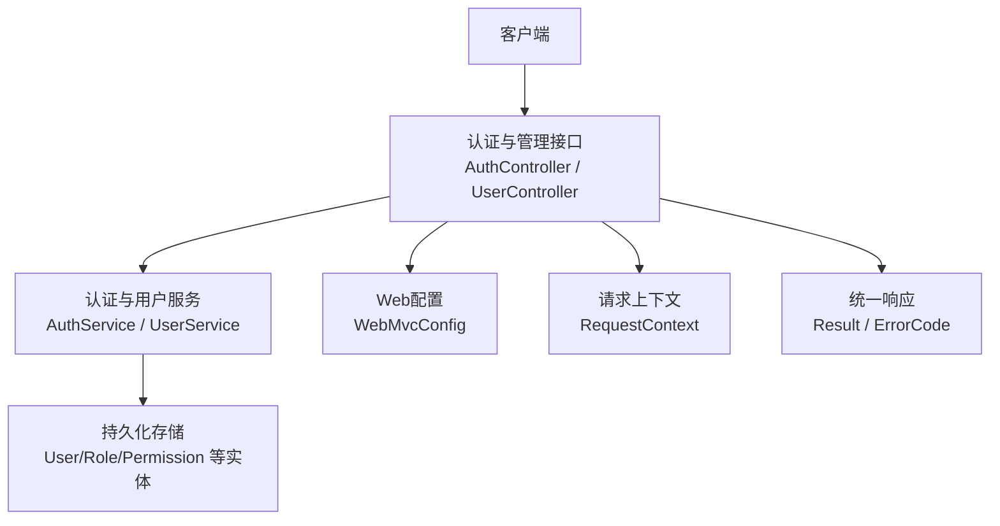

图表来源
- [AuthController.java](file://flow-engine/src/main/java/com/flow/engine/controllers/AuthController.java)
- [AuthService.java](file://flow-engine/src/main/java/com/flow/engine/service/AuthService.java)
- [UserController.java](file://flow-engine/src/main/java/com/flow/engine/controllers/UserController.java)
- [UserService.java](file://flow-engine/src/main/java/com/flow/engine/service/UserService.java)
- [WebMvcConfig.java](file://flow-engine/src/main/java/com/flow/engine/config/WebMvcConfig.java)
- [Result.java](file://flow-engine/src/main/java/com/flow/engine/common/Result.java)
- [ErrorCode.java](file://flow-engine/src/main/java/com/flow/engine/common/ErrorCode.java)
- [RequestContext.java](file://flow-engine/src/main/java/com/flow/engine/common/RequestContext.java)

章节来源
- [AuthController.java](file://flow-engine/src/main/java/com/flow/engine/controllers/AuthController.java)
- [AuthService.java](file://flow-engine/src/main/java/com/flow/engine/service/AuthService.java)
- [UserController.java](file://flow-engine/src/main/java/com/flow/engine/controllers/UserController.java)
- [UserService.java](file://flow-engine/src/main/java/com/flow/engine/service/UserService.java)
- [WebMvcConfig.java](file://flow-engine/src/main/java/com/flow/engine/config/WebMvcConfig.java)
- [Result.java](file://flow-engine/src/main/java/com/flow/engine/common/Result.java)
- [ErrorCode.java](file://flow-engine/src/main/java/com/flow/engine/common/ErrorCode.java)
- [RequestContext.java](file://flow-engine/src/main/java/com/flow/engine/common/RequestContext.java)

## 核心组件
- 认证控制器：暴露登录、登出、令牌刷新、第三方回调等接口
- 认证服务：负责凭证校验、JWT签发与刷新、黑名单/撤销（可选）、上下文注入
- 用户控制器与服务：用户注册、密码修改、个人信息查询与更新
- 权限模型：用户-角色-权限的RBAC模型，支撑细粒度鉴权
- Web配置：注册拦截器、放行路径、跨域策略
- 统一响应与异常：标准化返回结构与错误码，集中式异常处理
- 请求上下文：在请求生命周期内持有当前用户、租户等信息

章节来源
- [AuthController.java](file://flow-engine/src/main/java/com/flow/engine/controllers/AuthController.java)
- [AuthService.java](file://flow-engine/src/main/java/com/flow/engine/service/AuthService.java)
- [UserController.java](file://flow-engine/src/main/java/com/flow/engine/controllers/UserController.java)
- [UserService.java](file://flow-engine/src/main/java/com/flow/engine/service/UserService.java)
- [User.java](file://flow-engine/src/main/java/com/flow/engine/entity/User.java)
- [Role.java](file://flow-engine/src/main/java/com/flow/engine/entity/Role.java)
- [Permission.java](file://flow-engine/src/main/java/com/flow/engine/entity/Permission.java)
- [UserRole.java](file://flow-engine/src/main/java/com/flow/engine/entity/UserRole.java)
- [RolePermission.java](file://flow-engine/src/main/java/com/flow/engine/entity/RolePermission.java)
- [WebMvcConfig.java](file://flow-engine/src/main/java/com/flow/engine/config/WebMvcConfig.java)
- [Result.java](file://flow-engine/src/main/java/com/flow/engine/common/Result.java)
- [ErrorCode.java](file://flow-engine/src/main/java/com/flow/engine/common/ErrorCode.java)
- [RequestContext.java](file://flow-engine/src/main/java/com/flow/engine/common/RequestContext.java)

## 架构总览
认证与授权的整体调用链如下：客户端通过HTTP发起请求，由控制器接收并交由服务层完成认证与权限判断；JWT作为无状态令牌贯穿后续请求；必要时结合拦截器或AOP进行鉴权控制。

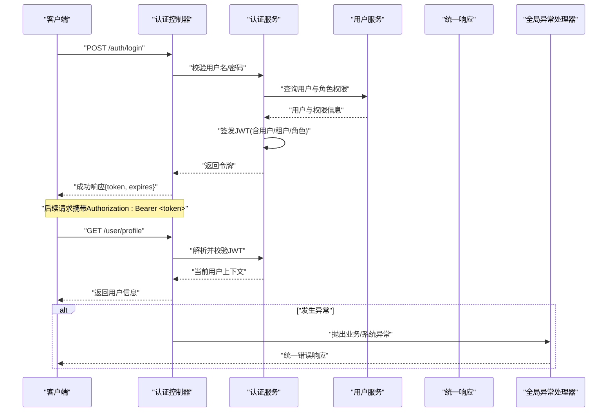

图表来源
- [AuthController.java](file://flow-engine/src/main/java/com/flow/engine/controllers/AuthController.java)
- [AuthService.java](file://flow-engine/src/main/java/com/flow/engine/service/AuthService.java)
- [UserController.java](file://flow-engine/src/main/java/com/flow/engine/controllers/UserController.java)
- [UserService.java](file://flow-engine/src/main/java/com/flow/engine/service/UserService.java)
- [Result.java](file://flow-engine/src/main/java/com/flow/engine/common/Result.java)
- [GlobalExceptionHandler.java](file://flow-engine/src/main/java/com/flow/engine/common/GlobalExceptionHandler.java)

## 详细组件分析

### 认证控制器（登录、登出、令牌刷新、第三方回调）
- 登录：校验凭证后签发JWT，返回令牌与过期时间
- 登出：支持本地注销（如加入黑名单/清除缓存），或无状态登出（仅客户端丢弃）
- 令牌刷新：基于旧令牌签发新令牌，可限制刷新次数或窗口期
- 第三方回调：对接OAuth2/OIDC提供商，完成授权码交换与用户映射

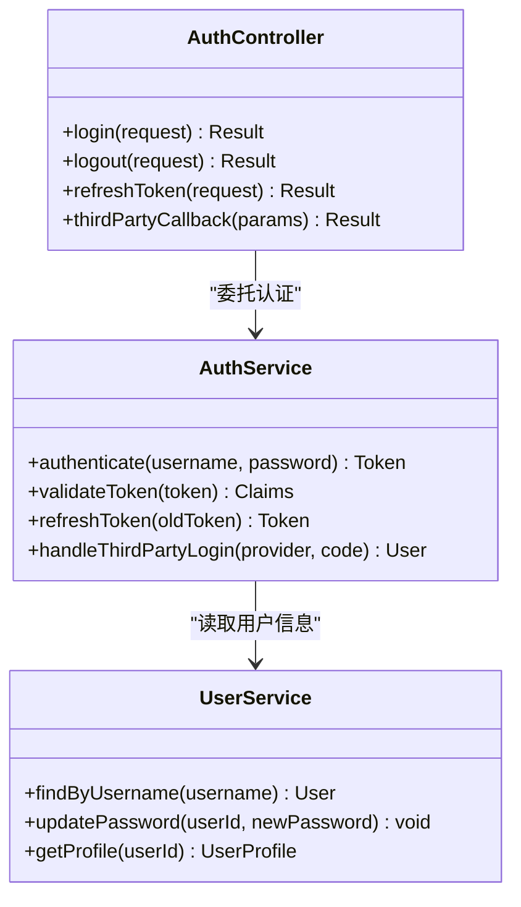

图表来源
- [AuthController.java](file://flow-engine/src/main/java/com/flow/engine/controllers/AuthController.java)
- [AuthService.java](file://flow-engine/src/main/java/com/flow/engine/service/AuthService.java)
- [UserService.java](file://flow-engine/src/main/java/com/flow/engine/service/UserService.java)

章节来源
- [AuthController.java](file://flow-engine/src/main/java/com/flow/engine/controllers/AuthController.java)
- [AuthService.java](file://flow-engine/src/main/java/com/flow/engine/service/AuthService.java)

### 用户控制器与服务（注册、密码修改、信息管理）
- 用户注册：创建用户、分配默认角色、初始化密码
- 密码修改：校验旧密码后更新为新密码
- 用户信息管理：查询/更新个人资料、头像、联系方式等

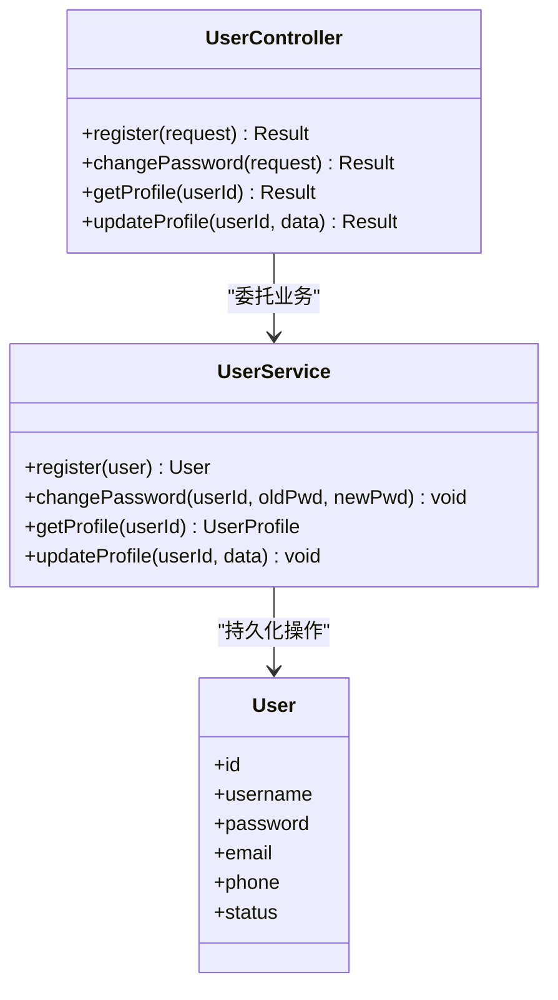

图表来源
- [UserController.java](file://flow-engine/src/main/java/com/flow/engine/controllers/UserController.java)
- [UserService.java](file://flow-engine/src/main/java/com/flow/engine/service/UserService.java)
- [User.java](file://flow-engine/src/main/java/com/flow/engine/entity/User.java)

章节来源
- [UserController.java](file://flow-engine/src/main/java/com/flow/engine/controllers/UserController.java)
- [UserService.java](file://flow-engine/src/main/java/com/flow/engine/service/UserService.java)
- [User.java](file://flow-engine/src/main/java/com/flow/engine/entity/User.java)

### 权限模型（RBAC）
- 用户-角色-权限三元关系，支持角色继承与资源级权限
- 用于接口与方法级鉴权，结合拦截器或注解实现

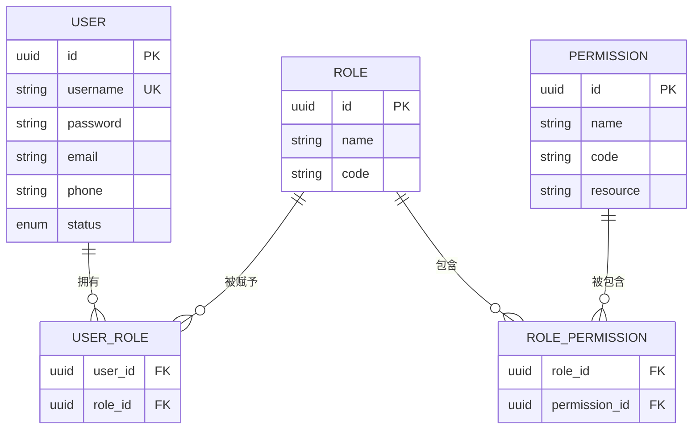

图表来源
- [User.java](file://flow-engine/src/main/java/com/flow/engine/entity/User.java)
- [Role.java](file://flow-engine/src/main/java/com/flow/engine/entity/Role.java)
- [Permission.java](file://flow-engine/src/main/java/com/flow/engine/entity/Permission.java)
- [UserRole.java](file://flow-engine/src/main/java/com/flow/engine/entity/UserRole.java)
- [RolePermission.java](file://flow-engine/src/main/java/com/flow/engine/entity/RolePermission.java)

章节来源
- [User.java](file://flow-engine/src/main/java/com/flow/engine/entity/User.java)
- [Role.java](file://flow-engine/src/main/java/com/flow/engine/entity/Role.java)
- [Permission.java](file://flow-engine/src/main/java/com/flow/engine/entity/Permission.java)
- [UserRole.java](file://flow-engine/src/main/java/com/flow/engine/entity/UserRole.java)
- [RolePermission.java](file://flow-engine/src/main/java/com/flow/engine/entity/RolePermission.java)

### 令牌管理（JWT生成、验证、刷新）
- 生成：登录成功后根据用户与租户信息签发JWT，设置过期时间
- 验证：拦截器或服务层解析并校验签名、有效期、黑名单（可选）
- 刷新：基于旧令牌签发新令牌，支持滑动过期或固定窗口

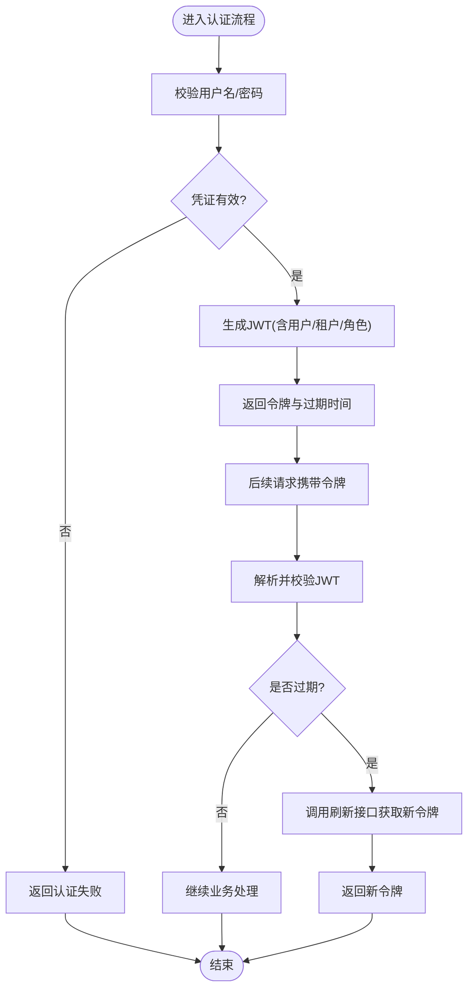

图表来源
- [AuthService.java](file://flow-engine/src/main/java/com/flow/engine/service/AuthService.java)
- [AuthController.java](file://flow-engine/src/main/java/com/flow/engine/controllers/AuthController.java)

章节来源
- [AuthService.java](file://flow-engine/src/main/java/com/flow/engine/service/AuthService.java)
- [AuthController.java](file://flow-engine/src/main/java/com/flow/engine/controllers/AuthController.java)

### 权限验证中间件与自定义注解
- 中间件/拦截器：在请求进入控制器前解析JWT、加载用户上下文、执行角色/权限校验
- 自定义注解：在方法或类上标注所需权限，由AOP或拦截器统一处理
- 白名单：静态资源、健康检查、登录等路径放行

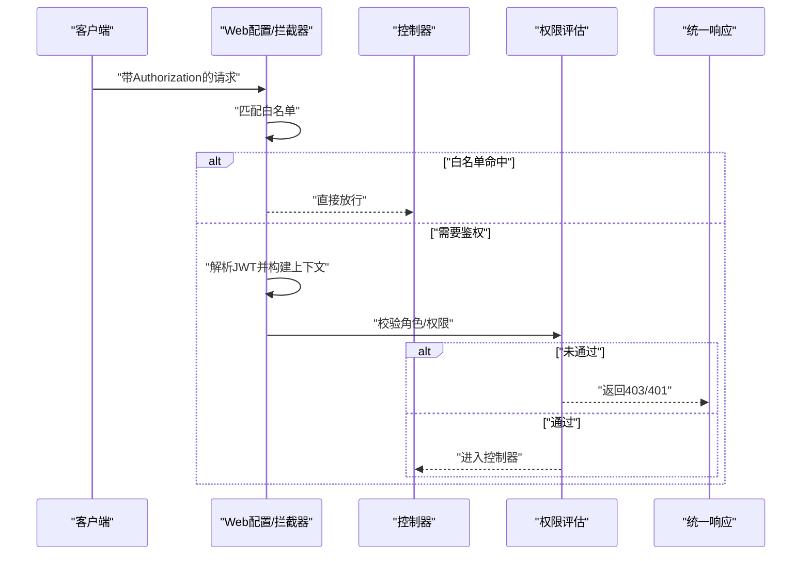

图表来源
- [WebMvcConfig.java](file://flow-engine/src/main/java/com/flow/engine/config/WebMvcConfig.java)
- [Result.java](file://flow-engine/src/main/java/com/flow/engine/common/Result.java)

章节来源
- [WebMvcConfig.java](file://flow-engine/src/main/java/com/flow/engine/config/WebMvcConfig.java)

### 第三方认证集成与单点登录（SSO）
- OAuth2/OIDC授权码模式：前端跳转至提供商，服务端回调换取令牌并建立本地会话
- SSO：通过中央身份源颁发令牌，各子系统共享信任根，实现一次登录多处访问
- 用户映射：将第三方用户与本地用户表关联，同步角色与权限

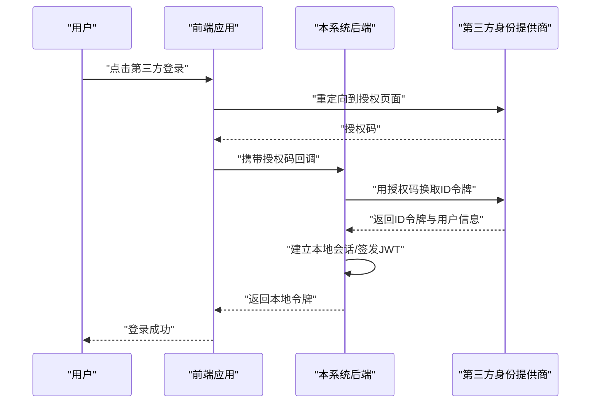

图表来源
- [AuthController.java](file://flow-engine/src/main/java/com/flow/engine/controllers/AuthController.java)
- [AuthService.java](file://flow-engine/src/main/java/com/flow/engine/service/AuthService.java)

章节来源
- [AuthController.java](file://flow-engine/src/main/java/com/flow/engine/controllers/AuthController.java)
- [AuthService.java](file://flow-engine/src/main/java/com/flow/engine/service/AuthService.java)

### 完整认证流程示例
- 登录：提交用户名/密码 -> 校验 -> 签发JWT -> 返回令牌
- 访问受保护资源：携带Authorization头 -> 中间件校验 -> 执行业务
- 刷新令牌：旧令牌失效前调用刷新接口 -> 获得新令牌
- 登出：服务端加入黑名单/清除缓存（可选）-> 客户端删除本地令牌

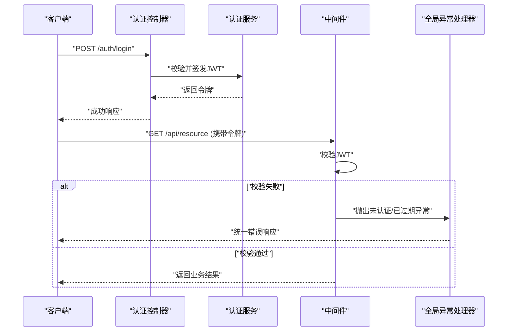

图表来源
- [AuthController.java](file://flow-engine/src/main/java/com/flow/engine/controllers/AuthController.java)
- [AuthService.java](file://flow-engine/src/main/java/com/flow/engine/service/AuthService.java)
- [WebMvcConfig.java](file://flow-engine/src/main/java/com/flow/engine/config/WebMvcConfig.java)
- [GlobalExceptionHandler.java](file://flow-engine/src/main/java/com/flow/engine/common/GlobalExceptionHandler.java)

章节来源
- [AuthController.java](file://flow-engine/src/main/java/com/flow/engine/controllers/AuthController.java)
- [AuthService.java](file://flow-engine/src/main/java/com/flow/engine/service/AuthService.java)
- [WebMvcConfig.java](file://flow-engine/src/main/java/com/flow/engine/config/WebMvcConfig.java)
- [GlobalExceptionHandler.java](file://flow-engine/src/main/java/com/flow/engine/common/GlobalExceptionHandler.java)

### 错误处理方案
- 统一响应体：所有接口返回标准结构，便于前端一致化处理
- 错误码：定义认证失败、参数错误、权限不足等分类码
- 全局异常处理器：捕获业务与系统异常，转换为统一响应

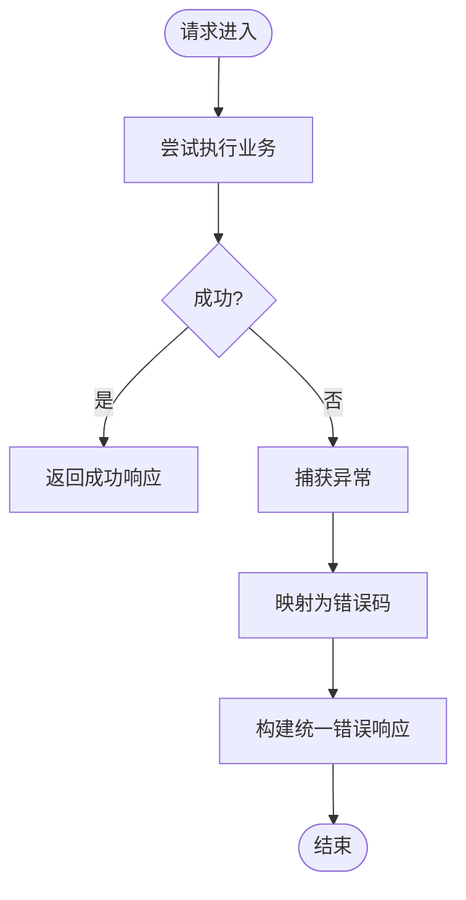

图表来源
- [Result.java](file://flow-engine/src/main/java/com/flow/engine/common/Result.java)
- [ErrorCode.java](file://flow-engine/src/main/java/com/flow/engine/common/ErrorCode.java)
- [GlobalExceptionHandler.java](file://flow-engine/src/main/java/com/flow/engine/common/GlobalExceptionHandler.java)

章节来源
- [Result.java](file://flow-engine/src/main/java/com/flow/engine/common/Result.java)
- [ErrorCode.java](file://flow-engine/src/main/java/com/flow/engine/common/ErrorCode.java)
- [GlobalExceptionHandler.java](file://flow-engine/src/main/java/com/flow/engine/common/GlobalExceptionHandler.java)

### 会话管理与安全最佳实践
- 无状态会话：以JWT为核心，避免服务端保存会话状态，提升水平扩展性
- 令牌安全：短过期+刷新机制、签名密钥轮换、防重放（可选）
- 传输安全：强制HTTPS、启用CORS白名单、设置Cookie安全属性（若使用Cookie）
- 输入校验：严格校验请求参数，防止注入与越权
- 审计日志：记录登录、登出、敏感操作，便于追溯

章节来源
- [application.yml](file://flow-engine/src/main/resources/application.yml)
- [WebMvcConfig.java](file://flow-engine/src/main/java/com/flow/engine/config/WebMvcConfig.java)

### 多租户认证与权限隔离
- 租户识别：从JWT载荷或请求头提取租户标识
- 数据隔离：在SQL层或ORM层附加租户条件，确保数据不可越界
- 权限隔离：按租户维度计算角色与权限，避免跨租户访问
- 配置隔离：不同租户可独立配置认证策略与白名单

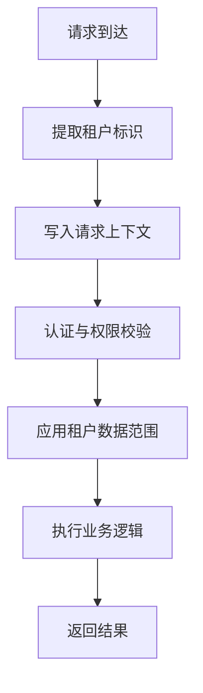

图表来源
- [RequestContext.java](file://flow-engine/src/main/java/com/flow/engine/common/RequestContext.java)
- [AuthService.java](file://flow-engine/src/main/java/com/flow/engine/service/AuthService.java)

章节来源
- [RequestContext.java](file://flow-engine/src/main/java/com/flow/engine/common/RequestContext.java)
- [AuthService.java](file://flow-engine/src/main/java/com/flow/engine/service/AuthService.java)

## 依赖关系分析
- 控制器依赖服务：认证与用户控制器分别委托对应服务完成业务
- 服务依赖实体与Mapper：读写用户、角色、权限等数据
- 中间件依赖配置：根据白名单与策略决定是否放行
- 统一响应与异常贯穿全链路

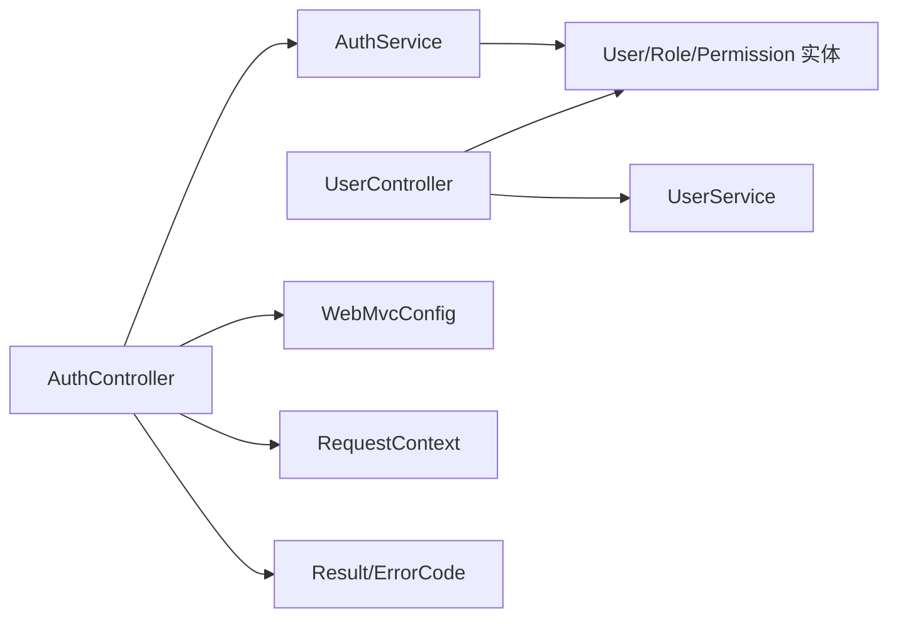

图表来源
- [AuthController.java](file://flow-engine/src/main/java/com/flow/engine/controllers/AuthController.java)
- [AuthService.java](file://flow-engine/src/main/java/com/flow/engine/service/AuthService.java)
- [UserController.java](file://flow-engine/src/main/java/com/flow/engine/controllers/UserController.java)
- [UserService.java](file://flow-engine/src/main/java/com/flow/engine/service/UserService.java)
- [WebMvcConfig.java](file://flow-engine/src/main/java/com/flow/engine/config/WebMvcConfig.java)
- [Result.java](file://flow-engine/src/main/java/com/flow/engine/common/Result.java)
- [ErrorCode.java](file://flow-engine/src/main/java/com/flow/engine/common/ErrorCode.java)
- [RequestContext.java](file://flow-engine/src/main/java/com/flow/engine/common/RequestContext.java)

章节来源
- [AuthController.java](file://flow-engine/src/main/java/com/flow/engine/controllers/AuthController.java)
- [AuthService.java](file://flow-engine/src/main/java/com/flow/engine/service/AuthService.java)
- [UserController.java](file://flow-engine/src/main/java/com/flow/engine/controllers/UserController.java)
- [UserService.java](file://flow-engine/src/main/java/com/flow/engine/service/UserService.java)
- [WebMvcConfig.java](file://flow-engine/src/main/java/com/flow/engine/config/WebMvcConfig.java)
- [Result.java](file://flow-engine/src/main/java/com/flow/engine/common/Result.java)
- [ErrorCode.java](file://flow-engine/src/main/java/com/flow/engine/common/ErrorCode.java)
- [RequestContext.java](file://flow-engine/src/main/java/com/flow/engine/common/RequestContext.java)

## 性能考虑
- JWT无状态校验开销低，适合高并发场景
- 刷新令牌建议采用滑动窗口策略，减少频繁重新登录
- 对高频鉴权路径引入缓存（如用户角色/权限）以降低数据库压力
- 合理设置令牌过期时间与刷新窗口，平衡安全与体验
- 使用连接池与索引优化用户与权限查询

[本节为通用指导，不直接分析具体文件]

## 故障排查指南
- 登录失败：检查用户名/密码是否正确、账号状态、锁定策略
- 401未认证：确认Authorization头格式、令牌是否过期或被吊销
- 403权限不足：核对用户角色与资源权限绑定、租户隔离条件
- 跨域问题：检查CORS配置与前端域名白名单
- 统一错误码：对照错误码定位具体原因

章节来源
- [ErrorCode.java](file://flow-engine/src/main/java/com/flow/engine/common/ErrorCode.java)
- [GlobalExceptionHandler.java](file://flow-engine/src/main/java/com/flow/engine/common/GlobalExceptionHandler.java)
- [WebMvcConfig.java](file://flow-engine/src/main/java/com/flow/engine/config/WebMvcConfig.java)

## 结论
本认证体系以JWT为核心，结合RBAC权限模型与统一的响应/异常处理，提供了可扩展、易维护的用户认证与授权能力。通过中间件与自定义注解，可实现灵活的鉴权策略；通过多租户上下文与数据范围控制，满足企业级隔离需求。建议在部署中强化HTTPS、密钥管理与审计日志，持续提升安全性与可观测性。

[本节为总结性内容，不直接分析具体文件]

## 附录
- 关键接口清单（示例）
  - POST /auth/login：用户登录
  - POST /auth/logout：用户登出
  - POST /auth/refresh：刷新令牌
  - GET /user/profile：获取当前用户信息
  - PUT /user/password：修改密码
  - POST /user/register：用户注册
- 安全建议
  - 强制HTTPS
  - 短过期+刷新
  - 最小权限原则
  - 输入校验与输出编码
  - 审计与告警

[本节为补充信息，不直接分析具体文件]