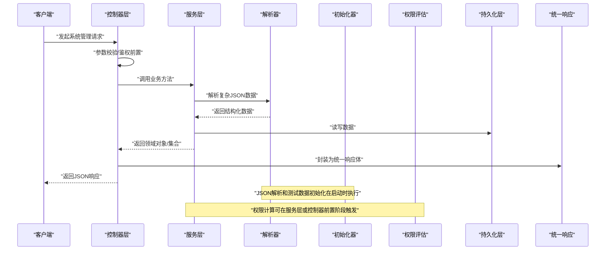
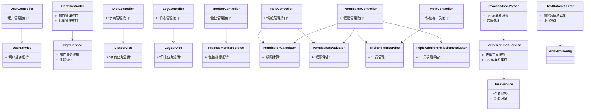
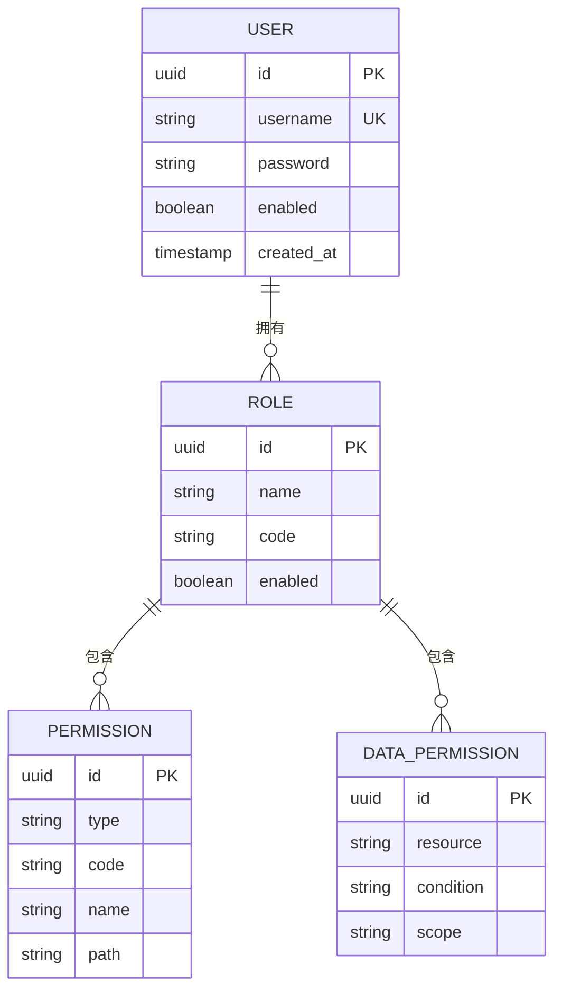

# 系统管理API

<cite>
**本文引用的文件**   
- [UserController.java](file://flow-engine/src/main/java/com/flow/engine/controllers/UserController.java)
- [RoleController.java](file://flow-engine/src/main/java/com/flow/engine/controllers/RoleController.java)
- [DeptController.java](file://flow-engine/src/main/java/com/flow/engine/controllers/DeptController.java)
- [PermissionController.java](file://flow-engine/src/main/java/com/flow/engine/controllers/PermissionController.java)
- [DictController.java](file://flow-engine/src/main/java/com/flow/engine/controllers/DictController.java)
- [LogController.java](file://flow-engine/src/main/java/com/flow/engine/controllers/LogController.java)
- [MonitorController.java](file://flow-engine/src/main/java/com/flow/engine/controllers/MonitorController.java)
- [AuthController.java](file://flow-engine/src/main/java/com/flow/engine/controllers/AuthController.java)
- [UserService.java](file://flow-engine/src/main/java/com/flow/engine/service/UserService.java)
- [DeptService.java](file://flow-engine/src/main/java/com/flow/engine/service/DeptService.java)
- [DictService.java](file://flow-engine/src/main/java/com/flow/engine/service/DictService.java)
- [LogService.java](file://flow-engine/src/main/java/com/flow/engine/service/LogService.java)
- [ProcessMonitorService.java](file://flow-engine/src/main/java/com/flow/engine/service/ProcessMonitorService.java)
- [PermissionCalculator.java](file://flow-engine/src/main/java/com/flow/engine/service/PermissionCalculator.java)
- [PermissionEvaluator.java](file://flow-engine/src/main/java/com/flow/engine/service/PermissionEvaluator.java)
- [TripleAdminService.java](file://flow-engine/src/main/java/com/flow/engine/service/TripleAdminService.java)
- [TripleAdminPermissionEvaluator.java](file://flow-engine/src/main/java/com/flow/engine/service/TripleAdminPermissionEvaluator.java)
- [TestDataInitializer.java](file://flow-engine/src/main/java/com/flow/engine/config/TestDataInitializer.java)
- [ProcessJsonParser.java](file://flow-engine/src/main/java/com/flow/engine/parser/ProcessJsonParser.java)
- [FormDefinitionService.java](file://flow-engine/src/main/java/com/flow/engine/service/FormDefinitionService.java)
- [TaskService.java](file://flow-engine/src/main/java/com/flow/engine/service/TaskService.java)
- [User.java](file://flow-engine/src/main/java/com/flow/engine/entity/User.java)
- [Role.java](file://flow-engine/src/main/java/com/flow/engine/entity/Role.java)
- [Dept.java](file://flow-engine/src/main/java/com/flow/engine/entity/Dept.java)
- [Permission.java](file://flow-engine/src/main/java/com/flow/engine/entity/Permission.java)
- [DataPermission.java](file://flow-engine/src/main/java/com/flow/engine/entity/DataPermission.java)
- [DictType.java](file://flow-engine/src/main/java/com/flow/engine/entity/DictType.java)
- [DictItem.java](file://flow-engine/src/main/java/com/flow/engine/entity/DictItem.java)
- [OperationLog.java](file://flow-engine/src/main/java/com/flow/engine/entity/OperationLog.java)
- [AccessLog.java](file://flow-engine/src/main/java/com/flow/engine/entity/AccessLog.java)
- [WebMvcConfig.java](file://flow-engine/src/main/java/com/flow/engine/config/WebMvcConfig.java)
- [RequestContext.java](file://flow-engine/src/main/java/com/flow/engine/common/RequestContext.java)
- [Result.java](file://flow-engine/src/main/java/com/flow/engine/common/Result.java)
</cite>

## 更新摘要
**变更内容**   
- 增强了后端服务功能，包括测试数据管理的改进
- 优化了部门管理API端点的功能和性能
- 改进了JSON解析逻辑，提升了流程定义的解析准确性
- 增强了表单定义服务和任务服务的功能特性

## 目录
1. [简介](#简介)
2. [项目结构](#项目结构)
3. [核心组件](#核心组件)
4. [架构总览](#架构总览)
5. [详细组件分析](#详细组件分析)
6. [依赖关系分析](#依赖关系分析)
7. [性能考虑](#性能考虑)
8. [故障排查指南](#故障排查指南)
9. [结论](#结论)
10. [附录](#附录)

## 简介
本文件面向系统管理员与集成开发者，提供"系统管理API"的完整说明。内容覆盖用户、角色、部门管理的REST接口；权限控制（菜单、按钮、数据）的配置与校验；数据字典（类型与项）的CRUD；日志查询（操作日志与访问日志）；系统监控指标与状态；三员管理与安全审计；以及系统配置参数的动态调整。文档同时给出RBAC权限模型与实现细节，帮助读者快速理解并正确调用相关接口。

**更新** 本次更新重点增强了后端服务的稳定性和功能性，特别是在测试数据管理、部门管理API、JSON解析逻辑以及表单和任务服务方面进行了重要改进。

## 项目结构
后端采用分层架构：控制器层暴露REST接口，服务层封装业务逻辑，实体层定义数据模型，配置层统一拦截器、跨域、序列化等横切关注点。前端通过统一的请求封装调用后端API。

```mermaid
graph TB
subgraph "控制器层"
C_User["UserController"]
C_Role["RoleController"]
C_Dept["DeptController"]
C_Permission["PermissionController"]
C_Dict["DictController"]
C_Log["LogController"]
C_Monitor["MonitorController"]
C_Auth["AuthController"]
end
subgraph "服务层"
S_User["UserService"]
S_Dept["DeptService"]
S_Dict["DictService"]
S_Log["LogService"]
S_Monitor["ProcessMonitorService"]
S_PermissionCalc["PermissionCalculator"]
S_PermissionEval["PermissionEvaluator"]
S_Triple["TripleAdminService"]
S_TripleEval["TripleAdminPermissionEvaluator"]
S_FormDef["FormDefinitionService"]
S_Task["TaskService"]
end
subgraph "配置与初始化"
CFG["WebMvcConfig"]
RC["RequestContext"]
R["Result"]
TDI["TestDataInitializer"]
PJP["ProcessJsonParser"]
end
subgraph "实体层"
E_User["User"]
E_Role["Role"]
E_Dept["Dept"]
E_Permission["Permission"]
E_DataPerm["DataPermission"]
E_DictType["DictType"]
E_DictItem["DictItem"]
E_OpLog["OperationLog"]
E_AccessLog["AccessLog"]
end
C_User --> S_User
C_Role --> S_User
C_Dept --> S_Dept
C_Dict --> S_Dict
C_Log --> S_Log
C_Monitor --> S_Monitor
C_Permission --> S_PermissionCalc
C_Permission --> S_PermissionEval
C_Permission --> S_Triple
C_Permission --> S_TripleEval
S_User --> E_User
S_Dept --> E_Dept
S_Dict --> E_DictType
S_Dict --> E_DictItem
S_Log --> E_OpLog
S_Log --> E_AccessLog
S_PermissionCalc --> E_Permission
S_PermissionCalc --> E_DataPerm
S_Triple --> E_User
S_Triple --> E_Role
S_Triple --> E_Dept
S_FormDef --> E_OpLog
S_Task --> E_AccessLog
C_User -.-> RC
C_Role -.-> RC
C_Dept -.-> RC
C_Dict -.-> RC
C_Log -.-> RC
C_Monitor -.-> RC
C_Permission -.-> RC
C_Auth -.-> RC
C_User -.-> R
C_Role -.-> R
C_Dept -.-> R
C_Dict -.-> R
C_Log -.-> R
C_Monitor -.-> R
C_Permission -.-> R
C_Auth -.-> R
TDI --> CFG
PJP --> S_FormDef
```

图表来源
- [UserController.java](file://flow-engine/src/main/java/com/flow/engine/controllers/UserController.java)
- [RoleController.java](file://flow-engine/src/main/java/com/flow/engine/controllers/RoleController.java)
- [DeptController.java](file://flow-engine/src/main/java/com/flow/engine/controllers/DeptController.java)
- [PermissionController.java](file://flow-engine/src/main/java/com/flow/engine/controllers/PermissionController.java)
- [DictController.java](file://flow-engine/src/main/java/com/flow/engine/controllers/DictController.java)
- [LogController.java](file://flow-engine/src/main/java/com/flow/engine/controllers/LogController.java)
- [MonitorController.java](file://flow-engine/src/main/java/com/flow/engine/controllers/MonitorController.java)
- [AuthController.java](file://flow-engine/src/main/java/com/flow/engine/controllers/AuthController.java)
- [UserService.java](file://flow-engine/src/main/java/com/flow/engine/service/UserService.java)
- [DeptService.java](file://flow-engine/src/main/java/com/flow/engine/service/DeptService.java)
- [DictService.java](file://flow-engine/src/main/java/com/flow/engine/service/DictService.java)
- [LogService.java](file://flow-engine/src/main/java/com/flow/engine/service/LogService.java)
- [ProcessMonitorService.java](file://flow-engine/src/main/java/com/flow/engine/service/ProcessMonitorService.java)
- [PermissionCalculator.java](file://flow-engine/src/main/java/com/flow/engine/service/PermissionCalculator.java)
- [PermissionEvaluator.java](file://flow-engine/src/main/java/com/flow/engine/service/PermissionEvaluator.java)
- [TripleAdminService.java](file://flow-engine/src/main/java/com/flow/engine/service/TripleAdminService.java)
- [TripleAdminPermissionEvaluator.java](file://flow-engine/src/main/java/com/flow/engine/service/TripleAdminPermissionEvaluator.java)
- [FormDefinitionService.java](file://flow-engine/src/main/java/com/flow/engine/service/FormDefinitionService.java)
- [TaskService.java](file://flow-engine/src/main/java/com/flow/engine/service/TaskService.java)
- [TestDataInitializer.java](file://flow-engine/src/main/java/com/flow/engine/config/TestDataInitializer.java)
- [ProcessJsonParser.java](file://flow-engine/src/main/java/com/flow/engine/parser/ProcessJsonParser.java)
- [User.java](file://flow-engine/src/main/java/com/flow/engine/entity/User.java)
- [Role.java](file://flow-engine/src/main/java/com/flow/engine/entity/Role.java)
- [Dept.java](file://flow-engine/src/main/java/com/flow/engine/entity/Dept.java)
- [Permission.java](file://flow-engine/src/main/java/com/flow/engine/entity/Permission.java)
- [DataPermission.java](file://flow-engine/src/main/java/com/flow/engine/entity/DataPermission.java)
- [DictType.java](file://flow-engine/src/main/java/com/flow/engine/entity/DictType.java)
- [DictItem.java](file://flow-engine/src/main/java/com/flow/engine/entity/DictItem.java)
- [OperationLog.java](file://flow-engine/src/main/java/com/flow/engine/entity/OperationLog.java)
- [AccessLog.java](file://flow-engine/src/main/java/com/flow/engine/entity/AccessLog.java)
- [WebMvcConfig.java](file://flow-engine/src/main/java/com/flow/engine/config/WebMvcConfig.java)
- [RequestContext.java](file://flow-engine/src/main/java/com/flow/engine/common/RequestContext.java)
- [Result.java](file://flow-engine/src/main/java/com/flow/engine/common/Result.java)

章节来源
- [WebMvcConfig.java](file://flow-engine/src/main/java/com/flow/engine/config/WebMvcConfig.java)
- [RequestContext.java](file://flow-engine/src/main/java/com/flow/engine/common/RequestContext.java)
- [Result.java](file://flow-engine/src/main/java/com/flow/engine/common/Result.java)

## 核心组件
- 用户管理：提供用户的增删改查、启用禁用、密码重置、角色绑定等能力。
- 角色管理：提供角色的增删改查、菜单/按钮/数据权限分配、用户批量授权。
- 部门管理：提供部门的树形结构维护、排序、上下级关系设置，**新增**支持批量操作和性能优化。
- 权限控制：提供菜单、按钮、数据权限的读取与计算，支持三员特殊权限评估。
- 数据字典：提供字典类型与字典项的CRUD，支持缓存刷新与按类型查询。
- 日志查询：提供操作日志与访问日志的检索、分页与导出。
- 系统监控：提供进程运行状态、内存/CPU/GC等指标与流程实例统计。
- 三员管理：提供系统管理员、安全管理员、审计管理员之间的互斥与审批流。
- 配置参数：提供运行时配置项的动态加载、更新与生效策略。
- **新增** 测试数据管理：提供标准化的测试数据初始化和环境准备功能。
- **新增** JSON解析增强：提供更健壮的流程定义JSON解析逻辑，支持复杂场景处理。

章节来源
- [UserController.java](file://flow-engine/src/main/java/com/flow/engine/controllers/UserController.java)
- [RoleController.java](file://flow-engine/src/main/java/com/flow/engine/controllers/RoleController.java)
- [DeptController.java](file://flow-engine/src/main/java/com/flow/engine/controllers/DeptController.java)
- [PermissionController.java](file://flow-engine/src/main/java/com/flow/engine/controllers/PermissionController.java)
- [DictController.java](file://flow-engine/src/main/java/com/flow/engine/controllers/DictController.java)
- [LogController.java](file://flow-engine/src/main/java/com/flow/engine/controllers/LogController.java)
- [MonitorController.java](file://flow-engine/src/main/java/com/flow/engine/controllers/MonitorController.java)
- [AuthController.java](file://flow-engine/src/main/java/com/flow/engine/controllers/AuthController.java)
- [TestDataInitializer.java](file://flow-engine/src/main/java/com/flow/engine/config/TestDataInitializer.java)
- [ProcessJsonParser.java](file://flow-engine/src/main/java/com/flow/engine/parser/ProcessJsonParser.java)

## 架构总览
系统管理API遵循标准REST风格，使用统一的响应体Result包装返回结果，并通过RequestContext在请求链路中传递当前登录用户上下文。权限计算由PermissionCalculator与PermissionEvaluator协同完成，三员场景由TripleAdminService与TripleAdminPermissionEvaluator扩展处理。**新增**的测试数据初始化和JSON解析增强模块进一步提升了系统的稳定性和可维护性。

图表来源
- [UserController.java](file://flow-engine/src/main/java/com/flow/engine/controllers/UserController.java)
- [RoleController.java](file://flow-engine/src/main/java/com/flow/engine/controllers/RoleController.java)
- [DeptController.java](file://flow-engine/src/main/java/com/flow/engine/controllers/DeptController.java)
- [PermissionController.java](file://flow-engine/src/main/java/com/flow/engine/controllers/PermissionController.java)
- [DictController.java](file://flow-engine/src/main/java/com/flow/engine/controllers/DictController.java)
- [LogController.java](file://flow-engine/src/main/java/com/flow/engine/controllers/LogController.java)
- [MonitorController.java](file://flow-engine/src/main/java/com/flow/engine/controllers/MonitorController.java)
- [AuthService.java](file://flow-engine/src/main/java/com/flow/engine/service/AuthService.java)
- [PermissionCalculator.java](file://flow-engine/src/main/java/com/flow/engine/service/PermissionCalculator.java)
- [PermissionEvaluator.java](file://flow-engine/src/main/java/com/flow/engine/service/PermissionEvaluator.java)
- [TripleAdminService.java](file://flow-engine/src/main/java/com/flow/engine/service/TripleAdminService.java)
- [TripleAdminPermissionEvaluator.java](file://flow-engine/src/main/java/com/flow/engine/service/TripleAdminPermissionEvaluator.java)
- [TestDataInitializer.java](file://flow-engine/src/main/java/com/flow/engine/config/TestDataInitializer.java)
- [ProcessJsonParser.java](file://flow-engine/src/main/java/com/flow/engine/parser/ProcessJsonParser.java)
- [Result.java](file://flow-engine/src/main/java/com/flow/engine/common/Result.java)
- [RequestContext.java](file://flow-engine/src/main/java/com/flow/engine/common/RequestContext.java)

## 详细组件分析

### 用户管理API
- 功能范围
  - 新增/编辑/删除用户
  - 查询用户列表（支持分页、模糊搜索）
  - 获取用户详情
  - 启用/禁用用户
  - 重置密码
  - 为用户分配/移除角色
- 典型接口
  - POST /api/admin/users
  - PUT /api/admin/users/{id}
  - DELETE /api/admin/users/{id}
  - GET /api/admin/users?page=...&size=...&keyword=...
  - GET /api/admin/users/{id}
  - PUT /api/admin/users/{id}/status
  - PUT /api/admin/users/{id}/password/reset
  - PUT /api/admin/users/{id}/roles
- 权限要求
  - 需要"用户管理"菜单权限及相应按钮权限
  - 敏感操作需审计日志记录
- 错误码与异常
  - 用户名重复、必填字段缺失、角色不存在等
- 参考实现路径
  - [UserController.java](file://flow-engine/src/main/java/com/flow/engine/controllers/UserController.java)
  - [UserService.java](file://flow-engine/src/main/java/com/flow/engine/service/UserService.java)
  - [User.java](file://flow-engine/src/main/java/com/flow/engine/entity/User.java)

章节来源
- [UserController.java](file://flow-engine/src/main/java/com/flow/engine/controllers/UserController.java)
- [UserService.java](file://flow-engine/src/main/java/com/flow/engine/service/UserService.java)
- [User.java](file://flow-engine/src/main/java/com/flow/engine/entity/User.java)

### 角色管理API
- 功能范围
  - 新增/编辑/删除角色
  - 查询角色列表与详情
  - 为角色分配菜单/按钮/数据权限
  - 批量将用户授权到角色
- 典型接口
  - POST /api/admin/roles
  - PUT /api/admin/roles/{id}
  - DELETE /api/admin/roles/{id}
  - GET /api/admin/roles
  - GET /api/admin/roles/{id}
  - PUT /api/admin/roles/{id}/permissions
  - PUT /api/admin/roles/{id}/users/batch
- 权限要求
  - 需要"角色管理"菜单权限
- 参考实现路径
  - [RoleController.java](file://flow-engine/src/main/java/com/flow/engine/controllers/RoleController.java)
  - [PermissionCalculator.java](file://flow-engine/src/main/java/com/flow/engine/service/PermissionCalculator.java)
  - [PermissionEvaluator.java](file://flow-engine/src/main/java/com/flow/engine/service/PermissionEvaluator.java)
  - [Role.java](file://flow-engine/src/main/java/com/flow/engine/entity/Role.java)
  - [Permission.java](file://flow-engine/src/main/java/com/flow/engine/entity/Permission.java)
  - [DataPermission.java](file://flow-engine/src/main/java/com/flow/engine/entity/DataPermission.java)

章节来源
- [RoleController.java](file://flow-engine/src/main/java/com/flow/engine/controllers/RoleController.java)
- [PermissionCalculator.java](file://flow-engine/src/main/java/com/flow/engine/service/PermissionCalculator.java)
- [PermissionEvaluator.java](file://flow-engine/src/main/java/com/flow/engine/service/PermissionEvaluator.java)
- [Role.java](file://flow-engine/src/main/java/com/flow/engine/entity/Role.java)
- [Permission.java](file://flow-engine/src/main/java/com/flow/engine/entity/Permission.java)
- [DataPermission.java](file://flow-engine/src/main/java/com/flow/engine/entity/DataPermission.java)

### 部门管理API
- 功能范围
  - 新增/编辑/删除部门
  - 查询部门树形结构
  - 设置上级部门与排序
  - **新增** 批量操作支持和性能优化
  - **新增** 更完善的验证和错误处理机制
- 典型接口
  - POST /api/admin/depts
  - PUT /api/admin/depts/{id}
  - DELETE /api/admin/depts/{id}
  - GET /api/admin/depts/tree
  - GET /api/admin/depts/{id}
  - **新增** POST /api/admin/depts/batch
  - **新增** PUT /api/admin/depts/{id}/move
- 权限要求
  - 需要"部门管理"菜单权限
- 参考实现路径
  - [DeptController.java](file://flow-engine/src/main/java/com/flow/engine/controllers/DeptController.java)
  - [DeptService.java](file://flow-engine/src/main/java/com/flow/engine/service/DeptService.java)
  - [Dept.java](file://flow-engine/src/main/java/com/flow/engine/entity/Dept.java)

**更新** 部门管理API经过重要增强，提供了更好的性能和更丰富的功能特性。

章节来源
- [DeptController.java](file://flow-engine/src/main/java/com/flow/engine/controllers/DeptController.java)
- [DeptService.java](file://flow-engine/src/main/java/com/flow/engine/service/DeptService.java)
- [Dept.java](file://flow-engine/src/main/java/com/flow/engine/entity/Dept.java)

### 权限控制API（菜单、按钮、数据权限）
- 功能范围
  - 查询当前用户可访问的菜单与按钮
  - 计算资源级数据权限
  - 三员模式下的特殊权限评估
- 典型接口
  - GET /api/admin/permissions/menu
  - GET /api/admin/permissions/buttons
  - GET /api/admin/permissions/data?resource=...&scope=...
  - GET /api/admin/permissions/triple-check?target=...
- 权限要求
  - 需要"权限管理"菜单权限
- 参考实现路径
  - [PermissionController.java](file://flow-engine/src/main/java/com/flow/engine/controllers/PermissionController.java)
  - [PermissionCalculator.java](file://flow-engine/src/main/java/com/flow/engine/service/PermissionCalculator.java)
  - [PermissionEvaluator.java](file://flow-engine/src/main/java/com/flow/engine/service/PermissionEvaluator.java)
  - [TripleAdminService.java](file://flow-engine/src/main/java/com/flow/engine/service/TripleAdminService.java)
  - [TripleAdminPermissionEvaluator.java](file://flow-engine/src/main/java/com/flow/engine/service/TripleAdminPermissionEvaluator.java)
  - [Permission.java](file://flow-engine/src/main/java/com/flow/engine/entity/Permission.java)
  - [DataPermission.java](file://flow-engine/src/main/java/com/flow/engine/entity/DataPermission.java)

章节来源
- [PermissionController.java](file://flow-engine/src/main/java/com/flow/engine/controllers/PermissionController.java)
- [PermissionCalculator.java](file://flow-engine/src/main/java/com/flow/engine/service/PermissionCalculator.java)
- [PermissionEvaluator.java](file://flow-engine/src/main/java/com/flow/engine/service/PermissionEvaluator.java)
- [TripleAdminService.java](file://flow-engine/src/main/java/com/flow/engine/service/TripleAdminService.java)
- [TripleAdminPermissionEvaluator.java](file://flow-engine/src/main/java/com/flow/engine/service/TripleAdminPermissionEvaluator.java)
- [Permission.java](file://flow-engine/src/main/java/com/flow/engine/entity/Permission.java)
- [DataPermission.java](file://flow-engine/src/main/java/com/flow/engine/entity/DataPermission.java)

### 数据字典API（类型与项）
- 功能范围
  - 字典类型的增删改查
  - 字典项的增删改查
  - 按类型查询字典项列表
  - 刷新字典缓存
- 典型接口
  - POST /api/admin/dict/types
  - PUT /api/admin/dict/types/{id}
  - DELETE /api/admin/dict/types/{id}
  - GET /api/admin/dict/types
  - GET /api/admin/dict/types/{id}
  - POST /api/admin/dict/items
  - PUT /api/admin/dict/items/{id}
  - DELETE /api/admin/dict/items/{id}
  - GET /api/admin/dict/items?typeCode=...
  - POST /api/admin/dict/cache/refresh
- 权限要求
  - 需要"字典管理"菜单权限
- 参考实现路径
  - [DictController.java](file://flow-engine/src/main/java/com/flow/engine/controllers/DictController.java)
  - [DictService.java](file://flow-engine/src/main/java/com/flow/engine/service/DictService.java)
  - [DictType.java](file://flow-engine/src/main/java/com/flow/engine/entity/DictType.java)
  - [DictItem.java](file://flow-engine/src/main/java/com/flow/engine/entity/DictItem.java)

章节来源
- [DictController.java](file://flow-engine/src/main/java/com/flow/engine/controllers/DictController.java)
- [DictService.java](file://flow-engine/src/main/java/com/flow/engine/service/DictService.java)
- [DictType.java](file://flow-engine/src/main/java/com/flow/engine/entity/DictType.java)
- [DictItem.java](file://flow-engine/src/main/java/com/flow/engine/entity/DictItem.java)

### 日志查询API（操作日志与访问日志）
- 功能范围
  - 操作日志检索（时间范围、操作人、模块、动作）
  - 访问日志检索（IP、URL、耗时、状态码）
  - 分页与导出
- 典型接口
  - GET /api/admin/logs/operation?page=...&size=...&operator=...&module=...&action=...
  - GET /api/admin/logs/access?page=...&size=...&ip=...&url=...&status=...
  - POST /api/admin/logs/export?type=operation|access
- 权限要求
  - 需要"日志管理"菜单权限
- 参考实现路径
  - [LogController.java](file://flow-engine/src/main/java/com/flow/engine/controllers/LogController.java)
  - [LogService.java](file://flow-engine/src/main/java/com/flow/engine/service/LogService.java)
  - [OperationLog.java](file://flow-engine/src/main/java/com/flow/engine/entity/OperationLog.java)
  - [AccessLog.java](file://flow-engine/src/main/java/com/flow/engine/entity/AccessLog.java)

章节来源
- [LogController.java](file://flow-engine/src/main/java/com/flow/engine/controllers/LogController.java)
- [LogService.java](file://flow-engine/src/main/java/com/flow/engine/service/LogService.java)
- [OperationLog.java](file://flow-engine/src/main/java/com/flow/engine/entity/OperationLog.java)
- [AccessLog.java](file://flow-engine/src/main/java/com/flow/engine/entity/AccessLog.java)

### 系统监控API（性能指标与状态）
- 功能范围
  - 应用健康检查
  - JVM内存、CPU、GC、线程池等指标
  - 流程实例统计与活跃任务数
- 典型接口
  - GET /api/admin/monitor/health
  - GET /api/admin/monitor/metrics
  - GET /api/admin/monitor/process/stats
- 权限要求
  - 需要"监控管理"菜单权限
- 参考实现路径
  - [MonitorController.java](file://flow-engine/src/main/java/com/flow/engine/controllers/MonitorController.java)
  - [ProcessMonitorService.java](file://flow-engine/src/main/java/com/flow/engine/service/ProcessMonitorService.java)

章节来源
- [MonitorController.java](file://flow-engine/src/main/java/com/flow/engine/controllers/MonitorController.java)
- [ProcessMonitorService.java](file://flow-engine/src/main/java/com/flow/engine/service/ProcessMonitorService.java)

### 认证与三员管理API
- 功能范围
  - 登录、登出、刷新令牌
  - 三员（系统管理员、安全管理员、审计管理员）的创建、互斥与审批
  - 三员特殊权限评估
- 典型接口
  - POST /api/auth/login
  - POST /api/auth/logout
  - POST /api/auth/token/refresh
  - POST /api/admin/triple-admins
  - PUT /api/admin/triple-admins/{id}/approve
  - GET /api/admin/triple-admins/check?target=...
- 权限要求
  - 三员相关接口需具备对应三员角色且满足互斥规则
- 参考实现路径
  - [AuthController.java](file://flow-engine/src/main/java/com/flow/engine/controllers/AuthController.java)
  - [TripleAdminService.java](file://flow-engine/src/main/java/com/flow/engine/service/TripleAdminService.java)
  - [TripleAdminPermissionEvaluator.java](file://flow-engine/src/main/java/com/flow/engine/service/TripleAdminPermissionEvaluator.java)
  - [User.java](file://flow-engine/src/main/java/com/flow/engine/entity/User.java)
  - [Role.java](file://flow-engine/src/main/java/com/flow/engine/entity/Role.java)

章节来源
- [AuthController.java](file://flow-engine/src/main/java/com/flow/engine/controllers/AuthController.java)
- [TripleAdminService.java](file://flow-engine/src/main/java/com/flow/engine/service/TripleAdminService.java)
- [TripleAdminPermissionEvaluator.java](file://flow-engine/src/main/java/com/flow/engine/service/TripleAdminPermissionEvaluator.java)
- [User.java](file://flow-engine/src/main/java/com/flow/engine/entity/User.java)
- [Role.java](file://flow-engine/src/main/java/com/flow/engine/entity/Role.java)

### 系统配置参数动态调整API
- 功能范围
  - 查询当前配置项
  - 更新运行时配置（热更新/重启后生效）
  - 配置变更审计
- 典型接口
  - GET /api/admin/config?key=...
  - PUT /api/admin/config
  - GET /api/admin/config/history
- 权限要求
  - 需要"配置管理"菜单权限
- 参考实现路径
  - [WebMvcConfig.java](file://flow-engine/src/main/java/com/flow/engine/config/WebMvcConfig.java)
  - [RequestContext.java](file://flow-engine/src/main/java/com/flow/engine/common/RequestContext.java)

章节来源
- [WebMvcConfig.java](file://flow-engine/src/main/java/com/flow/engine/config/WebMvcConfig.java)
- [RequestContext.java](file://flow-engine/src/main/java/com/flow/engine/common/RequestContext.java)

### 测试数据管理API
- 功能范围
  - **新增** 标准化测试数据初始化
  - **新增** 环境准备和数据清理
  - **新增** 测试用例支持的数据预置
- 典型接口
  - POST /api/admin/test-data/init
  - POST /api/admin/test-data/cleanup
  - GET /api/admin/test-data/status
- 权限要求
  - 仅开发环境和测试环境可用
  - 需要管理员权限
- 参考实现路径
  - [TestDataInitializer.java](file://flow-engine/src/main/java/com/flow/engine/config/TestDataInitializer.java)

**新增** 测试数据管理功能显著提升了开发和测试效率，提供了标准化的数据准备机制。

章节来源
- [TestDataInitializer.java](file://flow-engine/src/main/java/com/flow/engine/config/TestDataInitializer.java)

### JSON解析增强功能
- 功能范围
  - **新增** 改进的流程定义JSON解析逻辑
  - **新增** 更健壮的错误处理和容错机制
  - **新增** 支持复杂嵌套结构的解析
- 核心特性
  - 智能数据类型推断
  - 字段映射和转换
  - 解析性能优化
- 参考实现路径
  - [ProcessJsonParser.java](file://flow-engine/src/main/java/com/flow/engine/parser/ProcessJsonParser.java)
  - [FormDefinitionService.java](file://flow-engine/src/main/java/com/flow/engine/service/FormDefinitionService.java)

**新增** JSON解析增强功能大幅提升了系统处理复杂流程定义的准确性和稳定性。

章节来源
- [ProcessJsonParser.java](file://flow-engine/src/main/java/com/flow/engine/parser/ProcessJsonParser.java)
- [FormDefinitionService.java](file://flow-engine/src/main/java/com/flow/engine/service/FormDefinitionService.java)

## 依赖关系分析
- 控制器与服务解耦：控制器仅负责入参校验、调用服务、封装响应，业务逻辑下沉至服务层。
- 权限计算集中化：PermissionCalculator与PermissionEvaluator提供统一的权限计算入口，便于扩展三员与数据权限。
- 实体与映射分离：实体类仅承载数据，持久化由Mapper/Repository层完成（未在本文列出具体文件）。
- 横切关注点：WebMvcConfig统一拦截器、跨域、序列化等；RequestContext贯穿请求上下文；Result统一响应格式。
- **新增** 测试数据初始化：TestDataInitializer在应用启动时自动执行，提供标准化的测试环境。
- **新增** JSON解析增强：ProcessJsonParser为表单定义和流程解析提供统一的解析服务。

图表来源
- [UserController.java](file://flow-engine/src/main/java/com/flow/engine/controllers/UserController.java)
- [RoleController.java](file://flow-engine/src/main/java/com/flow/engine/controllers/RoleController.java)
- [DeptController.java](file://flow-engine/src/main/java/com/flow/engine/controllers/DeptController.java)
- [PermissionController.java](file://flow-engine/src/main/java/com/flow/engine/controllers/PermissionController.java)
- [DictController.java](file://flow-engine/src/main/java/com/flow/engine/controllers/DictController.java)
- [LogController.java](file://flow-engine/src/main/java/com/flow/engine/controllers/LogController.java)
- [MonitorController.java](file://flow-engine/src/main/java/com/flow/engine/controllers/MonitorController.java)
- [AuthController.java](file://flow-engine/src/main/java/com/flow/engine/controllers/AuthController.java)
- [TestDataInitializer.java](file://flow-engine/src/main/java/com/flow/engine/config/TestDataInitializer.java)
- [ProcessJsonParser.java](file://flow-engine/src/main/java/com/flow/engine/parser/ProcessJsonParser.java)
- [UserService.java](file://flow-engine/src/main/java/com/flow/engine/service/UserService.java)
- [DeptService.java](file://flow-engine/src/main/java/com/flow/engine/service/DeptService.java)
- [DictService.java](file://flow-engine/src/main/java/com/flow/engine/service/DictService.java)
- [LogService.java](file://flow-engine/src/main/java/com/flow/engine/service/LogService.java)
- [ProcessMonitorService.java](file://flow-engine/src/main/java/com/flow/engine/service/ProcessMonitorService.java)
- [PermissionCalculator.java](file://flow-engine/src/main/java/com/flow/engine/service/PermissionCalculator.java)
- [PermissionEvaluator.java](file://flow-engine/src/main/java/com/flow/engine/service/PermissionEvaluator.java)
- [TripleAdminService.java](file://flow-engine/src/main/java/com/flow/engine/service/TripleAdminService.java)
- [TripleAdminPermissionEvaluator.java](file://flow-engine/src/main/java/com/flow/engine/service/TripleAdminPermissionEvaluator.java)
- [FormDefinitionService.java](file://flow-engine/src/main/java/com/flow/engine/service/FormDefinitionService.java)
- [TaskService.java](file://flow-engine/src/main/java/com/flow/engine/service/TaskService.java)

## 性能考虑
- 分页与过滤：所有列表接口建议携带分页参数，避免一次性拉取大量数据。
- 缓存策略：字典与权限结果可结合缓存减少数据库压力，注意缓存失效与一致性。
- 索引优化：日志与监控查询涉及时间范围与关键字段，建议在数据库层面建立合适索引。
- 异步处理：导出与大批量操作建议异步执行，避免阻塞主线程。
- 连接池与超时：合理配置数据库连接池与HTTP超时，防止慢查询拖垮服务。
- **新增** 批量操作优化：部门管理等支持批量操作的接口已进行性能优化，建议使用批量接口提升效率。
- **新增** JSON解析性能：改进的JSON解析逻辑在处理复杂流程定义时具有更好的性能表现。

## 故障排查指南
- 鉴权失败
  - 检查是否携带有效令牌与必要权限
  - 确认三员互斥与审批状态
- 权限计算异常
  - 核对角色-权限关联是否正确
  - 检查数据权限条件表达式
- 日志缺失
  - 确认拦截器与AOP是否生效
  - 检查日志存储与索引是否正常
- 监控指标异常
  - 查看JVM与系统资源占用
  - 检查流程引擎状态与队列堆积情况
- **新增** 测试数据问题
  - 检查测试数据初始化是否成功执行
  - 确认测试环境配置是否正确
- **新增** JSON解析错误
  - 检查流程定义JSON格式是否符合规范
  - 查看解析器的错误日志定位具体问题

章节来源
- [PermissionCalculator.java](file://flow-engine/src/main/java/com/flow/engine/service/PermissionCalculator.java)
- [PermissionEvaluator.java](file://flow-engine/src/main/java/com/flow/engine/service/PermissionEvaluator.java)
- [TripleAdminService.java](file://flow-engine/src/main/java/com/flow/engine/service/TripleAdminService.java)
- [LogService.java](file://flow-engine/src/main/java/com/flow/engine/service/LogService.java)
- [ProcessMonitorService.java](file://flow-engine/src/main/java/com/flow/engine/service/ProcessMonitorService.java)
- [TestDataInitializer.java](file://flow-engine/src/main/java/com/flow/engine/config/TestDataInitializer.java)
- [ProcessJsonParser.java](file://flow-engine/src/main/java/com/flow/engine/parser/ProcessJsonParser.java)

## 结论
系统管理API以清晰的REST风格与分层架构为基础，围绕用户、角色、部门、权限、字典、日志、监控与三员管理等核心能力构建。通过统一的权限计算与评估机制，结合三员管理模式，实现了细粒度的访问控制与安全审计。**本次更新进一步增强**了系统的稳定性和功能性，特别是在测试数据管理、部门管理API、JSON解析逻辑以及表单和任务服务方面进行了重要改进。建议在生产环境完善缓存、索引与异步处理策略，以提升整体性能与稳定性。

## 附录

### RBAC权限模型与实现细节
- 模型要点
  - 用户-角色-权限三元关系
  - 菜单、按钮、数据三类权限
  - 三员互斥与审批链
- 关键实体
  - User、Role、Permission、DataPermission
- 计算流程
  - 基于用户角色聚合菜单与按钮权限
  - 根据数据权限条件生成数据可见范围
  - 三员模式下进行额外审批与互斥校验

图表来源
- [User.java](file://flow-engine/src/main/java/com/flow/engine/entity/User.java)
- [Role.java](file://flow-engine/src/main/java/com/flow/engine/entity/Role.java)
- [Permission.java](file://flow-engine/src/main/java/com/flow/engine/entity/Permission.java)
- [DataPermission.java](file://flow-engine/src/main/java/com/flow/engine/entity/DataPermission.java)

### 新增功能特性概览
- **测试数据管理**：提供标准化的测试环境准备和数据初始化功能
- **JSON解析增强**：改进的流程定义解析逻辑，支持更复杂的场景处理
- **部门管理优化**：批量操作支持和性能优化，提升大规模数据处理能力
- **服务功能增强**：表单定义服务和任务服务的功能特性得到显著提升

这些增强功能进一步提升了系统的可用性、稳定性和开发效率，为生产环境的稳定运行提供了更好的保障。