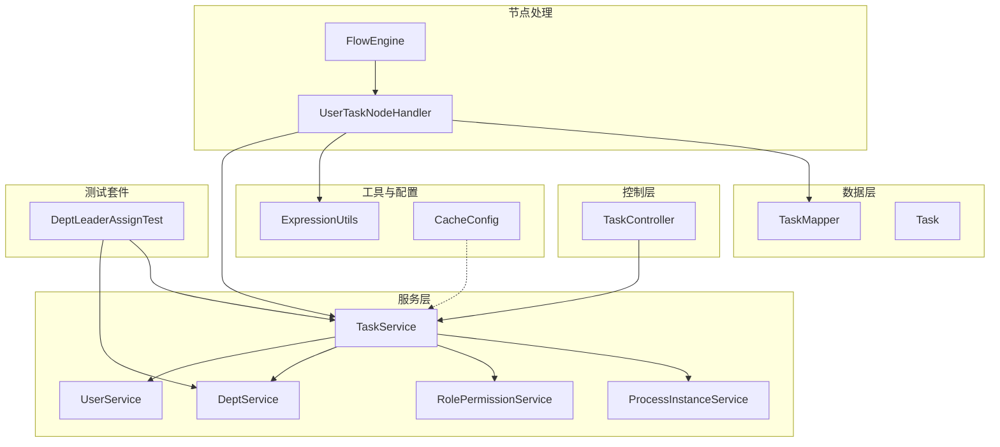
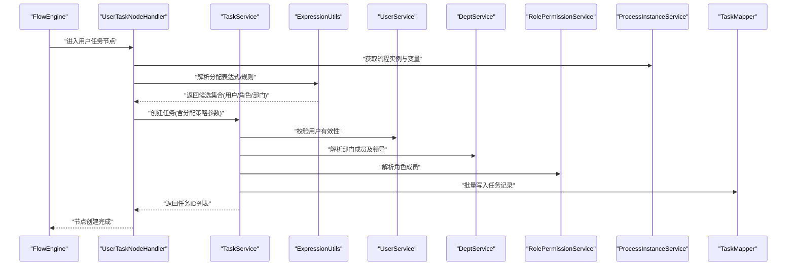
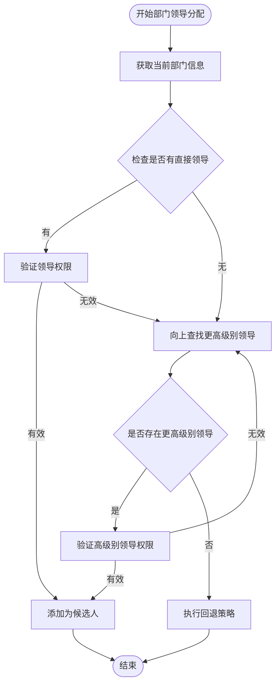
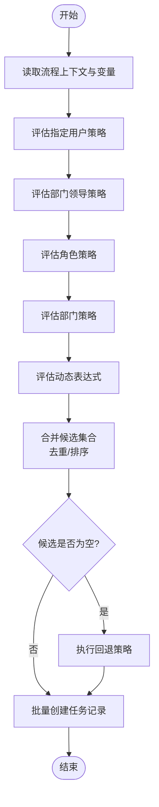
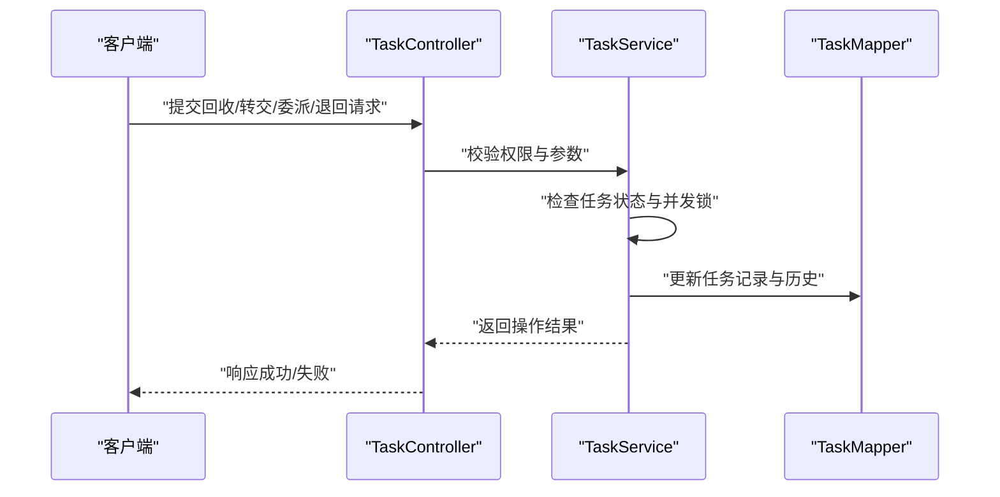
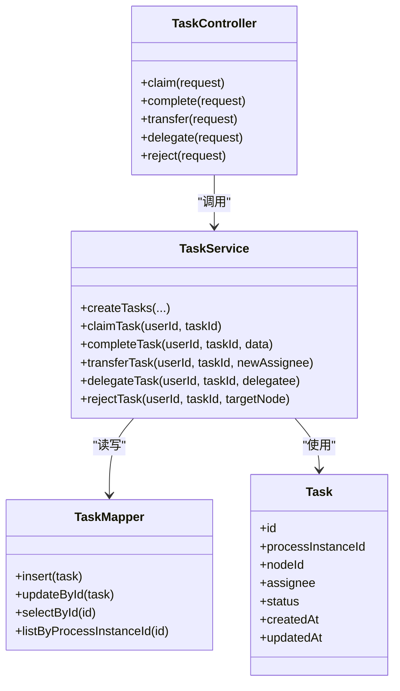
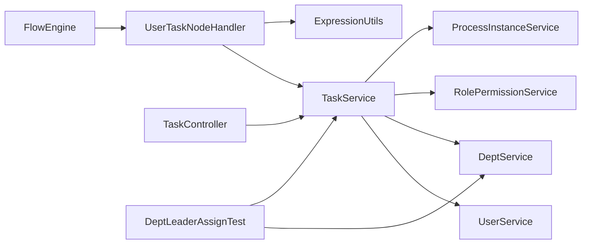

# 任务分配策略

<cite>
**本文引用的文件**   
- [TaskService.java](file://flow-engine/src/main/java/com/flow/engine/service/TaskService.java)
- [UserTaskNodeHandler.java](file://flow-engine/src/main/java/com/flow/engine/node/impl/UserTaskNodeHandler.java)
- [ExpressionUtils.java](file://flow-engine/src/main/java/com/flow/engine/common/utils/ExpressionUtils.java)
- [DeptService.java](file://flow-engine/src/main/java/com/flow/engine/service/DeptService.java)
- [UserService.java](file://flow-engine/src/main/java/com/flow/engine/service/UserService.java)
- [RolePermissionService.java](file://flow-engine/src/main/java/com/flow/engine/service/RolePermissionService.java)
- [ProcessInstanceService.java](file://flow-engine/src/main/java/com/flow/engine/service/ProcessInstanceService.java)
- [TaskController.java](file://flow-engine/src/main/java/com/flow/engine/controller/TaskController.java)
- [ClaimTaskRequest.java](file://flow-engine/src/main/java/com/flow/engine/dto/ClaimTaskRequest.java)
- [CompleteTaskRequest.java](file://flow-engine/src/main/java/com/flow/engine/dto/CompleteTaskRequest.java)
- [DelegateTaskRequest.java](file://flow-engine/src/main/java/com/flow/engine/dto/DelegateTaskRequest.java)
- [TransferTaskRequest.java](file://flow-engine/src/main/java/com/flow/engine/dto/TransferTaskRequest.java)
- [RejectTaskRequest.java](file://flow-engine/src/main/java/com/flow/engine/dto/RejectTaskRequest.java)
- [TaskResponse.java](file://flow-engine/src/main/java/com/flow/engine/dto/TaskResponse.java)
- [Task.java](file://flow-engine/src/main/java/com/flow/engine/entity/Task.java)
- [TaskMapper.java](file://flow-engine/src/main/java/com/flow/engine/mapper/TaskMapper.java)
- [FlowEngine.java](file://flow-engine/src/main/java/com/flow/engine/engine/FlowEngine.java)
- [CacheConfig.java](file://flow-engine/src/main/java/com/flow/engine/config/CacheConfig.java)
- [DeptLeaderAssignTest.java](file://flow-engine/src/test/java/com/flow/engine/engine/DeptLeaderAssignTest.java)
</cite>

## 更新摘要
**变更内容**   
- 新增部门领导分配功能的详细测试覆盖说明
- 增强组织层级基于任务分配规则的验证机制
- 补充部门领导分配策略的实现细节和最佳实践
- 更新分配优先级中部门领导分配的权重说明

## 目录
1. [引言](#引言)
2. [项目结构](#项目结构)
3. [核心组件](#核心组件)
4. [架构总览](#架构总览)
5. [详细组件分析](#详细组件分析)
6. [依赖分析](#依赖分析)
7. [性能考虑](#性能考虑)
8. [故障排查指南](#故障排查指南)
9. [结论](#结论)
10. [附录](#附录)

## 引言
本文件围绕"任务分配策略"进行系统化说明，覆盖以下主题：
- 多种分配方式：指定用户、角色、部门、部门领导、动态表达式等
- 分配优先级与冲突解决机制
- 分配规则配置与动态计算逻辑
- 任务回收与重新分配流程
- 配置示例与最佳实践
- 分配性能优化与缓存策略

目标读者包括流程设计者、后端开发者与运维人员。

## 项目结构
与任务分配相关的核心代码位于 flow-engine 模块中，主要涉及：
- 节点处理器：负责在用户任务节点创建时解析并生成待办任务
- 服务层：提供用户、部门、角色、权限、流程实例等能力
- 控制器与DTO：对外暴露任务操作接口（领取、转交、委派、退回、完成）
- 表达式工具：用于动态计算分配结果
- 数据访问：任务实体与持久化映射
- 引擎协调：流程推进与事件驱动
- 测试套件：全面的部门领导分配功能测试覆盖

图表来源
- [TaskController.java](file://flow-engine/src/main/java/com/flow/engine/controller/TaskController.java)
- [TaskService.java](file://flow-engine/src/main/java/com/flow/engine/service/TaskService.java)
- [UserTaskNodeHandler.java](file://flow-engine/src/main/java/com/flow/engine/node/impl/UserTaskNodeHandler.java)
- [ExpressionUtils.java](file://flow-engine/src/main/java/com/flow/engine/common/utils/ExpressionUtils.java)
- [DeptService.java](file://flow-engine/src/main/java/com/flow/engine/service/DeptService.java)
- [UserService.java](file://flow-engine/src/main/java/com/flow/engine/service/UserService.java)
- [RolePermissionService.java](file://flow-engine/src/main/java/com/flow/engine/service/RolePermissionService.java)
- [ProcessInstanceService.java](file://flow-engine/src/main/java/com/flow/engine/service/ProcessInstanceService.java)
- [TaskMapper.java](file://flow-engine/src/main/java/com/flow/engine/mapper/TaskMapper.java)
- [Task.java](file://flow-engine/src/main/java/com/flow/engine/entity/Task.java)
- [FlowEngine.java](file://flow-engine/src/main/java/com/flow/engine/engine/FlowEngine.java)
- [CacheConfig.java](file://flow-engine/src/main/java/com/flow/engine/config/CacheConfig.java)
- [DeptLeaderAssignTest.java](file://flow-engine/src/test/java/com/flow/engine/engine/DeptLeaderAssignTest.java)

章节来源
- [TaskController.java](file://flow-engine/src/main/java/com/flow/engine/controller/TaskController.java)
- [TaskService.java](file://flow-engine/src/main/java/com/flow/engine/service/TaskService.java)
- [UserTaskNodeHandler.java](file://flow-engine/src/main/java/com/flow/engine/node/impl/UserTaskNodeHandler.java)
- [ExpressionUtils.java](file://flow-engine/src/main/java/com/flow/engine/common/utils/ExpressionUtils.java)
- [DeptService.java](file://flow-engine/src/main/java/com/flow/engine/service/DeptService.java)
- [UserService.java](file://flow-engine/src/main/java/com/flow/engine/service/UserService.java)
- [RolePermissionService.java](file://flow-engine/src/main/java/com/flow/engine/service/RolePermissionService.java)
- [ProcessInstanceService.java](file://flow-engine/src/main/java/com/flow/engine/service/ProcessInstanceService.java)
- [TaskMapper.java](file://flow-engine/src/main/java/com/flow/engine/mapper/TaskMapper.java)
- [Task.java](file://flow-engine/src/main/java/com/flow/engine/entity/Task.java)
- [FlowEngine.java](file://flow-engine/src/main/java/com/flow/engine/engine/FlowEngine.java)
- [CacheConfig.java](file://flow-engine/src/main/java/com/flow/engine/config/CacheConfig.java)
- [DeptLeaderAssignTest.java](file://flow-engine/src/test/java/com/flow/engine/engine/DeptLeaderAssignTest.java)

## 核心组件
- 任务服务 TaskService：封装任务的查询、领取、转交、委派、退回、完成等核心业务；维护任务状态流转与审计日志；协调用户、部门、角色与流程实例服务。
- 用户任务节点处理器 UserTaskNodeHandler：在用户任务节点进入时，根据节点配置与上下文变量计算候选执行人集合，批量创建任务记录。
- 表达式工具 ExpressionUtils：提供表达式求值能力，支持基于流程变量、上下文信息动态计算分配结果。
- 部门服务 DeptService、用户服务 UserService、角色权限服务 RolePermissionService：提供组织与权限相关的数据与计算能力。
- 流程实例服务 ProcessInstanceService：提供流程实例上下文、变量读取与状态管理。
- 控制器 TaskController：暴露 REST 接口，接收 DTO 请求并调用服务层方法。
- 任务实体 Task 与映射 TaskMapper：定义任务数据结构与持久化访问。
- 引擎 FlowEngine：编排节点执行，触发用户任务节点的创建与后续流转。
- 缓存配置 CacheConfig：为分配计算与常用查询提供缓存支撑。
- 部门领导分配测试 DeptLeaderAssignTest：提供全面的部门领导分配功能测试覆盖，确保组织层级分配规则的健壮性。

章节来源
- [TaskService.java](file://flow-engine/src/main/java/com/flow/engine/service/TaskService.java)
- [UserTaskNodeHandler.java](file://flow-engine/src/main/java/com/flow/engine/node/impl/UserTaskNodeHandler.java)
- [ExpressionUtils.java](file://flow-engine/src/main/java/com/flow/engine/common/utils/ExpressionUtils.java)
- [DeptService.java](file://flow-engine/src/main/java/com/flow/engine/service/DeptService.java)
- [UserService.java](file://flow-engine/src/main/java/com/flow/engine/service/UserService.java)
- [RolePermissionService.java](file://flow-engine/src/main/java/com/flow/engine/service/RolePermissionService.java)
- [ProcessInstanceService.java](file://flow-engine/src/main/java/com/flow/engine/service/ProcessInstanceService.java)
- [TaskController.java](file://flow-engine/src/main/java/com/flow/engine/controller/TaskController.java)
- [Task.java](file://flow-engine/src/main/java/com/flow/engine/entity/Task.java)
- [TaskMapper.java](file://flow-engine/src/main/java/com/flow/engine/mapper/TaskMapper.java)
- [FlowEngine.java](file://flow-engine/src/main/java/com/flow/engine/engine/FlowEngine.java)
- [CacheConfig.java](file://flow-engine/src/main/java/com/flow/engine/config/CacheConfig.java)
- [DeptLeaderAssignTest.java](file://flow-engine/src/test/java/com/flow/engine/engine/DeptLeaderAssignTest.java)

## 架构总览
下图展示了从流程推进到任务分配的关键路径，以及各组件间的交互关系。

图表来源
- [FlowEngine.java](file://flow-engine/src/main/java/com/flow/engine/engine/FlowEngine.java)
- [UserTaskNodeHandler.java](file://flow-engine/src/main/java/com/flow/engine/node/impl/UserTaskNodeHandler.java)
- [TaskService.java](file://flow-engine/src/main/java/com/flow/engine/service/TaskService.java)
- [ExpressionUtils.java](file://flow-engine/src/main/java/com/flow/engine/common/utils/ExpressionUtils.java)
- [UserService.java](file://flow-engine/src/main/java/com/flow/engine/service/UserService.java)
- [DeptService.java](file://flow-engine/src/main/java/com/flow/engine/service/DeptService.java)
- [RolePermissionService.java](file://flow-engine/src/main/java/com/flow/engine/service/RolePermissionService.java)
- [ProcessInstanceService.java](file://flow-engine/src/main/java/com/flow/engine/service/ProcessInstanceService.java)
- [TaskMapper.java](file://flow-engine/src/main/java/com/flow/engine/mapper/TaskMapper.java)

## 详细组件分析

### 任务分配策略与优先级
- 分配方式
  - 指定用户：直接指定一个或多个用户ID作为候选人
  - 角色分配：按角色匹配当前登录用户或流程上下文中的用户所属角色
  - 部门分配：按部门层级或指定部门ID，将部门下所有有效用户纳入候选人
  - **部门领导分配**：专门针对部门领导角色的分配策略，支持多级部门领导的自动识别和分配
  - 动态表达式：通过表达式工具对流程变量、上下文信息进行求值，输出用户/角色/部门集合
- 优先级与冲突解决
  - 建议优先级：指定用户 > 部门领导分配 > 角色分配 > 部门分配 > 动态表达式
  - 去重合并：不同策略产生的候选集合需进行去重合并
  - 冲突消解：当同一用户被多策略命中时，仅保留一次；若存在互斥策略，以高优先级为准
  - 空集回退：若最终候选为空，应触发回退策略（如上级审批人或默认管理员），避免死锁
- 配置项建议
  - 节点级分配策略开关与顺序
  - 表达式模板与变量白名单
  - 部门范围与层级深度限制
  - 角色过滤条件（如是否包含停用角色）
  - 回退策略与超时重试次数
  - **部门领导层级配置**：支持配置部门领导查找的深度和范围

**更新** 新增了部门领导分配策略的详细说明，该策略在优先级中高于普通角色分配，确保组织管理层级的任务能够正确流转。

章节来源
- [UserTaskNodeHandler.java](file://flow-engine/src/main/java/com/flow/engine/node/impl/UserTaskNodeHandler.java)
- [ExpressionUtils.java](file://flow-engine/src/main/java/com/flow/engine/common/utils/ExpressionUtils.java)
- [TaskService.java](file://flow-engine/src/main/java/com/flow/engine/service/TaskService.java)
- [DeptService.java](file://flow-engine/src/main/java/com/flow/engine/service/DeptService.java)
- [UserService.java](file://flow-engine/src/main/java/com/flow/engine/service/UserService.java)
- [RolePermissionService.java](file://flow-engine/src/main/java/com/flow/engine/service/RolePermissionService.java)
- [DeptLeaderAssignTest.java](file://flow-engine/src/test/java/com/flow/engine/engine/DeptLeaderAssignTest.java)

### 部门领导分配功能详解
部门领导分配是任务分配体系中的重要组成部分，专门处理基于组织层级的领导审批场景。

- 核心特性
  - 自动识别部门领导：根据组织架构自动查找部门的直接领导
  - 多级领导支持：支持跨层级的领导查找，可配置查找深度
  - 动态领导变更：当部门领导发生变更时，新任务自动分配给现任领导
  - 领导继承机制：当直接领导不可用时，自动向上查找更高级别领导
- 实现机制
  - 组织树遍历：从当前部门开始向上遍历组织树查找领导
  - 权限验证：确保领导具有相应的审批权限
  - 缓存优化：对部门领导关系进行缓存，减少重复查询
  - 异常处理：处理领导缺失、权限不足等异常情况
- 测试覆盖
  - 完整的单元测试覆盖，包含252行测试代码
  - 边界情况测试：空部门、多层级部门、领导离职等场景
  - 性能测试：大规模组织结构的领导查找性能验证
  - 并发测试：多线程环境下的领导分配一致性保证

图表来源
- [DeptService.java](file://flow-engine/src/main/java/com/flow/engine/service/DeptService.java)
- [DeptLeaderAssignTest.java](file://flow-engine/src/test/java/com/flow/engine/engine/DeptLeaderAssignTest.java)
- [TaskService.java](file://flow-engine/src/main/java/com/flow/engine/service/TaskService.java)

**新增** 本节详细介绍了部门领导分配功能的实现机制、特性和测试覆盖情况。

章节来源
- [DeptService.java](file://flow-engine/src/main/java/com/flow/engine/service/DeptService.java)
- [DeptLeaderAssignTest.java](file://flow-engine/src/test/java/com/flow/engine/engine/DeptLeaderAssignTest.java)
- [TaskService.java](file://flow-engine/src/main/java/com/flow/engine/service/TaskService.java)

### 分配规则配置与动态计算
- 配置位置
  - 流程定义节点属性中声明分配策略类型与参数
  - 表达式模板可引用流程变量、上下文信息
- 动态计算流程
  - 读取流程实例与变量
  - 依次评估各策略，得到中间候选集合
  - 合并、去重、排序，必要时应用回退策略
  - 将最终候选写入任务记录

图表来源
- [UserTaskNodeHandler.java](file://flow-engine/src/main/java/com/flow/engine/node/impl/UserTaskNodeHandler.java)
- [ExpressionUtils.java](file://flow-engine/src/main/java/com/flow/engine/common/utils/ExpressionUtils.java)
- [TaskService.java](file://flow-engine/src/main/java/com/flow/engine/service/TaskService.java)
- [TaskMapper.java](file://flow-engine/src/main/java/com/flow/engine/mapper/TaskMapper.java)

章节来源
- [UserTaskNodeHandler.java](file://flow-engine/src/main/java/com/flow/engine/node/impl/UserTaskNodeHandler.java)
- [ExpressionUtils.java](file://flow-engine/src/main/java/com/flow/engine/common/utils/ExpressionUtils.java)
- [TaskService.java](file://flow-engine/src/main/java/com/flow/engine/service/TaskService.java)
- [TaskMapper.java](file://flow-engine/src/main/java/com/flow/engine/mapper/TaskMapper.java)

### 任务回收与重新分配
- 任务回收
  - 由管理员或授权用户发起，将任务从当前持有人收回至公共池或指定用户
  - 需要校验操作权限与任务状态，确保一致性
- 重新分配
  - 转交：将任务转移给其他用户
  - 委派：将任务临时委托给他人，完成后仍归属原持有人
  - 退回：将任务退回至上一步节点或指定节点，同时更新任务状态与历史
- 关键约束
  - 并发控制：防止重复领取或重复转交
  - 审计追踪：记录每次操作的主体、时间、原因
  - 状态机：严格遵循任务状态转换规则

图表来源
- [TaskController.java](file://flow-engine/src/main/java/com/flow/engine/controller/TaskController.java)
- [TaskService.java](file://flow-engine/src/main/java/com/flow/engine/service/TaskService.java)
- [TaskMapper.java](file://flow-engine/src/main/java/com/flow/engine/mapper/TaskMapper.java)

章节来源
- [TaskController.java](file://flow-engine/src/main/java/com/flow/engine/controller/TaskController.java)
- [TaskService.java](file://flow-engine/src/main/java/com/flow/engine/service/TaskService.java)
- [TaskMapper.java](file://flow-engine/src/main/java/com/flow/engine/mapper/TaskMapper.java)

### 接口与数据模型
- 控制器接口
  - 领取任务：接收 ClaimTaskRequest，返回 TaskResponse
  - 完成任务：接收 CompleteTaskRequest，返回 TaskResponse
  - 转交任务：接收 TransferTaskRequest，返回 TaskResponse
  - 委派任务：接收 DelegateTaskRequest，返回 TaskResponse
  - 退回任务：接收 RejectTaskRequest，返回 TaskResponse
- 数据模型
  - 任务实体 Task：包含任务ID、流程实例ID、节点ID、当前持有人、状态、创建时间等字段
  - 任务映射 TaskMapper：提供任务记录的增删改查与批量操作

图表来源
- [TaskController.java](file://flow-engine/src/main/java/com/flow/engine/controller/TaskController.java)
- [TaskService.java](file://flow-engine/src/main/java/com/flow/engine/service/TaskService.java)
- [Task.java](file://flow-engine/src/main/java/com/flow/engine/entity/Task.java)
- [TaskMapper.java](file://flow-engine/src/main/java/com/flow/engine/mapper/TaskMapper.java)
- [ClaimTaskRequest.java](file://flow-engine/src/main/java/com/flow/engine/dto/ClaimTaskRequest.java)
- [CompleteTaskRequest.java](file://flow-engine/src/main/java/com/flow/engine/dto/CompleteTaskRequest.java)
- [TransferTaskRequest.java](file://flow-engine/src/main/java/com/flow/engine/dto/TransferTaskRequest.java)
- [DelegateTaskRequest.java](file://flow-engine/src/main/java/com/flow/engine/dto/DelegateTaskRequest.java)
- [RejectTaskRequest.java](file://flow-engine/src/main/java/com/flow/engine/dto/RejectTaskRequest.java)
- [TaskResponse.java](file://flow-engine/src/main/java/com/flow/engine/dto/TaskResponse.java)

章节来源
- [TaskController.java](file://flow-engine/src/main/java/com/flow/engine/controller/TaskController.java)
- [TaskService.java](file://flow-engine/src/main/java/com/flow/engine/service/TaskService.java)
- [Task.java](file://flow-engine/src/main/java/com/flow/engine/entity/Task.java)
- [TaskMapper.java](file://flow-engine/src/main/java/com/flow/engine/mapper/TaskMapper.java)
- [ClaimTaskRequest.java](file://flow-engine/src/main/java/com/flow/engine/dto/ClaimTaskRequest.java)
- [CompleteTaskRequest.java](file://flow-engine/src/main/java/com/flow/engine/dto/CompleteTaskRequest.java)
- [TransferTaskRequest.java](file://flow-engine/src/main/java/com/flow/engine/dto/TransferTaskRequest.java)
- [DelegateTaskRequest.java](file://flow-engine/src/main/java/com/flow/engine/dto/DelegateTaskRequest.java)
- [RejectTaskRequest.java](file://flow-engine/src/main/java/com/flow/engine/dto/RejectTaskRequest.java)
- [TaskResponse.java](file://flow-engine/src/main/java/com/flow/engine/dto/TaskResponse.java)

### 最佳实践
- 明确分配优先级与回退策略，避免无人认领
- 使用表达式时限定变量白名单，防止注入风险
- 对大规模部门分配进行分页与限流，避免一次性加载过多用户
- 为高频查询（用户、部门、角色）建立缓存，减少数据库压力
- 对任务操作增加幂等性与并发锁，保证一致性
- 完善审计日志，便于问题追溯与合规审计
- **部门领导分配最佳实践**：合理设置领导查找深度，避免过深的组织层级导致性能问题；定期清理失效的领导关系缓存；为大型组织预计算领导关系图

**更新** 新增了部门领导分配的最佳实践建议，包括性能优化和组织结构设计方面的指导。

[本节为通用指导，不直接分析具体文件]

## 依赖分析
- 组件耦合
  - TaskService 依赖 UserService、DeptService、RolePermissionService、ProcessInstanceService，形成强内聚的业务聚合
  - UserTaskNodeHandler 依赖 ExpressionUtils 与 TaskService，职责清晰
  - TaskController 仅负责入参校验与调用服务层，保持薄控制器
  - **DeptLeaderAssignTest 依赖 DeptService 与 TaskService，提供完整的测试覆盖**
- 外部依赖
  - 表达式引擎：ExpressionUtils 提供动态计算能力
  - 缓存框架：CacheConfig 提供缓存配置入口
- 潜在循环依赖
  - 服务层之间应避免相互调用，必要时引入事件或消息队列解耦

图表来源
- [TaskService.java](file://flow-engine/src/main/java/com/flow/engine/service/TaskService.java)
- [UserTaskNodeHandler.java](file://flow-engine/src/main/java/com/flow/engine/node/impl/UserTaskNodeHandler.java)
- [ExpressionUtils.java](file://flow-engine/src/main/java/com/flow/engine/common/utils/ExpressionUtils.java)
- [DeptService.java](file://flow-engine/src/main/java/com/flow/engine/service/DeptService.java)
- [UserService.java](file://flow-engine/src/main/java/com/flow/engine/service/UserService.java)
- [RolePermissionService.java](file://flow-engine/src/main/java/com/flow/engine/service/RolePermissionService.java)
- [ProcessInstanceService.java](file://flow-engine/src/main/java/com/flow/engine/service/ProcessInstanceService.java)
- [TaskController.java](file://flow-engine/src/main/java/com/flow/engine/controller/TaskController.java)
- [FlowEngine.java](file://flow-engine/src/main/java/com/flow/engine/engine/FlowEngine.java)
- [DeptLeaderAssignTest.java](file://flow-engine/src/test/java/com/flow/engine/engine/DeptLeaderAssignTest.java)

章节来源
- [TaskService.java](file://flow-engine/src/main/java/com/flow/engine/service/TaskService.java)
- [UserTaskNodeHandler.java](file://flow-engine/src/main/java/com/flow/engine/node/impl/UserTaskNodeHandler.java)
- [ExpressionUtils.java](file://flow-engine/src/main/java/com/flow/engine/common/utils/ExpressionUtils.java)
- [DeptService.java](file://flow-engine/src/main/java/com/flow/engine/service/DeptService.java)
- [UserService.java](file://flow-engine/src/main/java/com/flow/engine/service/UserService.java)
- [RolePermissionService.java](file://flow-engine/src/main/java/com/flow/engine/service/RolePermissionService.java)
- [ProcessInstanceService.java](file://flow-engine/src/main/java/com/flow/engine/service/ProcessInstanceService.java)
- [TaskController.java](file://flow-engine/src/main/java/com/flow/engine/controller/TaskController.java)
- [FlowEngine.java](file://flow-engine/src/main/java/com/flow/engine/engine/FlowEngine.java)
- [DeptLeaderAssignTest.java](file://flow-engine/src/test/java/com/flow/engine/engine/DeptLeaderAssignTest.java)

## 性能考虑
- 分配计算优化
  - 预取组织数据：在表达式求值前批量加载用户、部门、角色信息，减少多次IO
  - 表达式缓存：对稳定表达式结果进行短期缓存，降低重复计算
  - 去重与排序：在内存中进行高效集合操作，避免数据库层面复杂运算
  - **部门领导关系缓存**：对部门领导关系进行长期缓存，支持快速查找和更新
- 任务创建优化
  - 批量插入：使用批量写接口创建任务记录，减少事务开销
  - 分片写入：对超大候选集合进行分片，避免单次事务过大
- 缓存策略
  - 用户/部门/角色缓存：设置合理过期时间与失效策略
  - 热点任务缓存：对频繁查询的任务信息进行本地或分布式缓存
  - 缓存一致性：在任务状态变更时主动失效相关缓存
  - **领导关系缓存**：部门领导关系变更时及时更新缓存，确保数据一致性
- 监控与限流
  - 指标采集：记录分配耗时、候选人数、命中率等
  - 限流保护：对部门全量分配与表达式求值进行速率限制
  - **领导查找监控**：监控部门领导查找的性能指标，及时发现性能瓶颈

**更新** 新增了部门领导分配相关的性能优化建议和监控指标。

章节来源
- [CacheConfig.java](file://flow-engine/src/main/java/com/flow/engine/config/CacheConfig.java)
- [TaskService.java](file://flow-engine/src/main/java/com/flow/engine/service/TaskService.java)
- [TaskMapper.java](file://flow-engine/src/main/java/com/flow/engine/mapper/TaskMapper.java)
- [ExpressionUtils.java](file://flow-engine/src/main/java/com/flow/engine/common/utils/ExpressionUtils.java)
- [DeptService.java](file://flow-engine/src/main/java/com/flow/engine/service/DeptService.java)

## 故障排查指南
- 常见问题
  - 无人认领：检查分配优先级与回退策略配置是否正确
  - 表达式错误：查看表达式语法与变量白名单，确认上下文变量可用
  - 并发冲突：检查任务状态与并发锁实现，避免重复操作
  - 性能瓶颈：观察缓存命中率与数据库慢查询，调整缓存策略与索引
  - **部门领导分配问题**：检查组织层级配置、领导权限设置、缓存一致性
- 定位步骤
  - 查看任务历史与审计日志，确认操作链路与责任人
  - 核对流程实例变量与节点配置，验证分配规则
  - 检查缓存配置与失效时机，确保数据一致性
  - 使用监控指标定位热点任务与异常峰值
  - **部门领导分配调试**：检查部门树结构、领导关系映射、权限验证逻辑
- 测试验证
  - 运行完整的部门领导分配测试套件，确保功能正常
  - 模拟各种组织层级场景，验证分配逻辑的正确性
  - 进行性能压测，确保在高并发情况下仍能正常工作

**更新** 新增了部门领导分配相关的故障排查方法和测试验证步骤。

章节来源
- [TaskService.java](file://flow-engine/src/main/java/com/flow/engine/service/TaskService.java)
- [TaskController.java](file://flow-engine/src/main/java/com/flow/engine/controller/TaskController.java)
- [CacheConfig.java](file://flow-engine/src/main/java/com/flow/engine/config/CacheConfig.java)
- [DeptLeaderAssignTest.java](file://flow-engine/src/test/java/com/flow/engine/engine/DeptLeaderAssignTest.java)

## 结论
本方案通过明确的分配优先级、灵活的动态表达式与完善的回收/重新分配流程，构建了可扩展且高性能的任务分配体系。**新增的部门领导分配功能**进一步增强了组织层级任务处理能力，通过全面的测试覆盖确保了功能的健壮性和可靠性。结合合理的缓存策略与监控手段，可在复杂组织中保障任务的高效流转与可观测性。

**更新** 强调了部门领导分配功能的重要性和测试覆盖的价值。

[本节为总结性内容，不直接分析具体文件]

## 附录
- 配置示例要点
  - 节点分配策略顺序：指定用户、部门领导、角色、部门、表达式
  - 表达式模板：引用流程变量与上下文信息
  - 回退策略：上级审批人、默认管理员、超时自动分配
  - **部门领导配置**：设置领导查找深度、权限验证规则、缓存策略
- 最佳实践清单
  - 明确权限边界与审计要求
  - 控制部门规模与层级深度
  - 对热点数据进行缓存与预热
  - 完善错误码与提示信息
  - **部门领导分配实践**：合理设计组织层级结构，避免过深的嵌套；定期审查和清理无效的领导关系；为大型组织预计算领导关系图
- 测试覆盖要点
  - **部门领导分配测试**：包含252行测试代码，覆盖各种边界情况和异常场景
  - 单元测试：验证单个组件的功能正确性
  - 集成测试：验证多个组件协作的正确性
  - 性能测试：验证系统在负载情况下的表现

**更新** 新增了部门领导分配的配置示例、最佳实践和测试覆盖要点的详细说明。

[本节为补充信息，不直接分析具体文件]