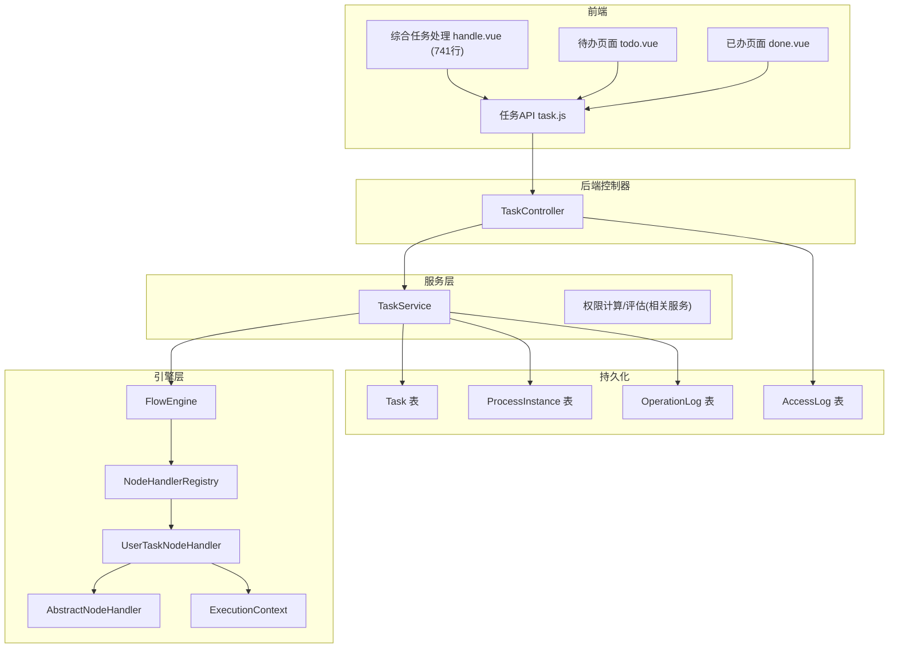
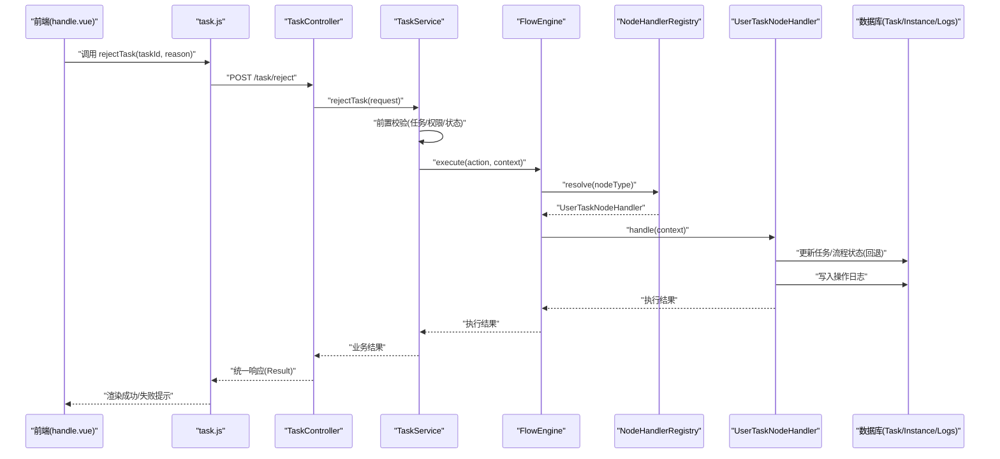
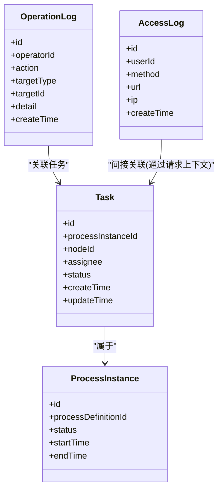
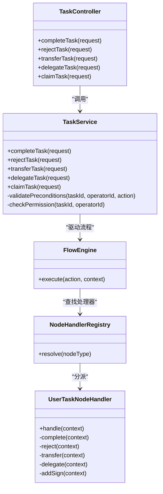
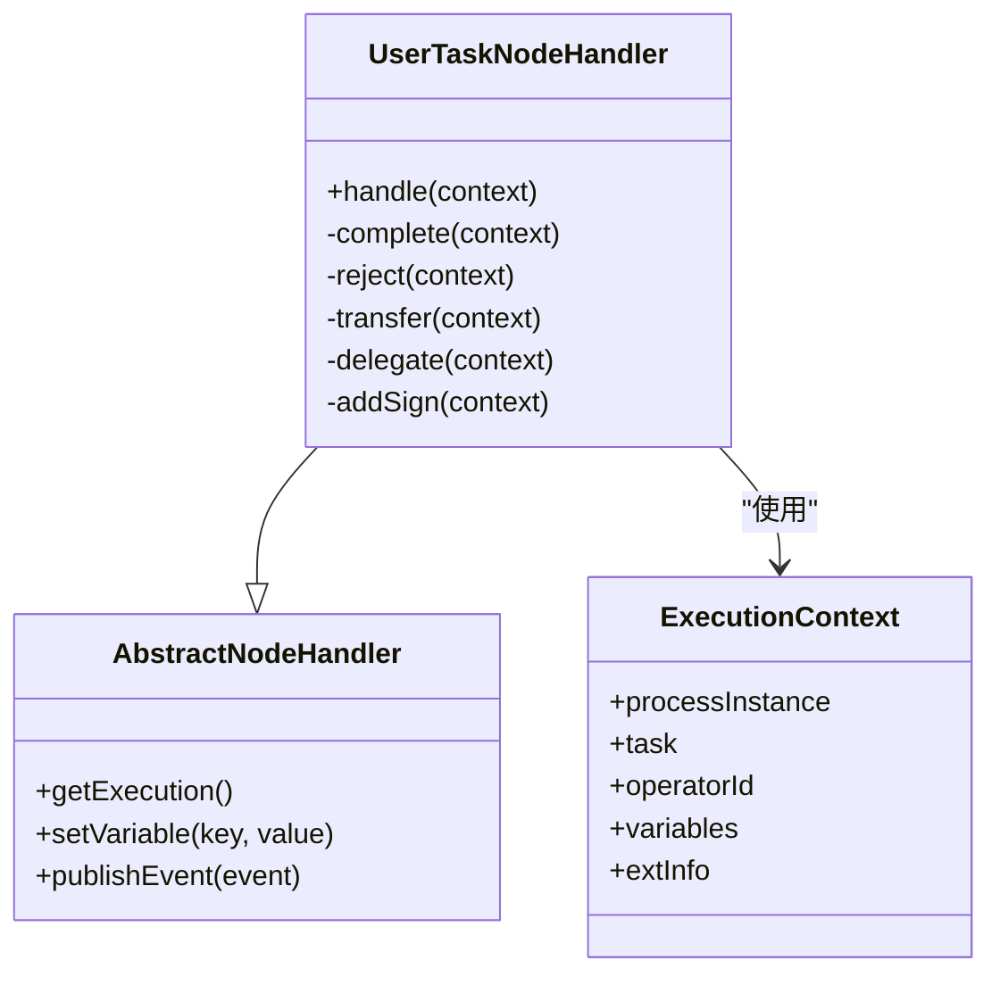
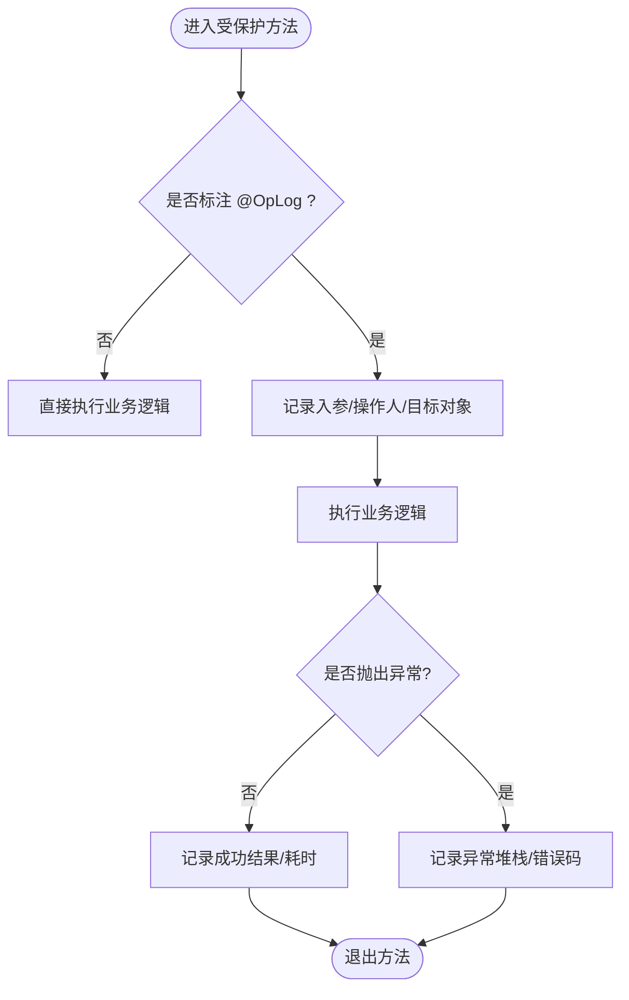
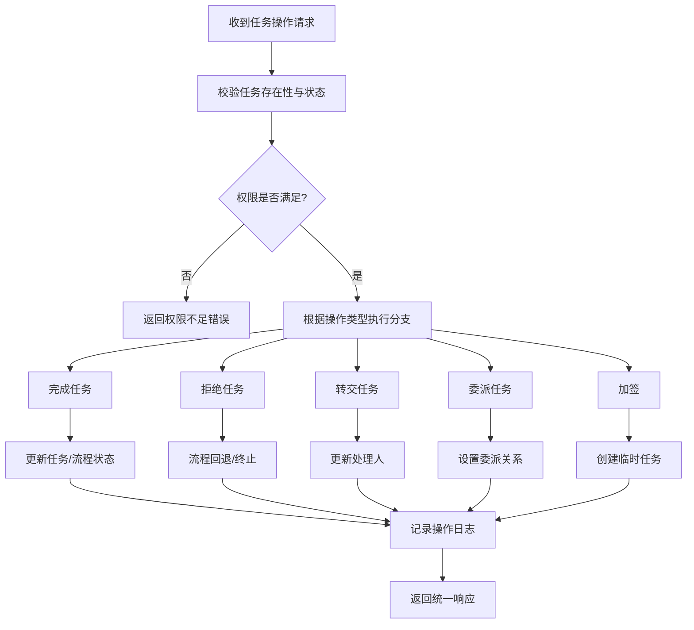
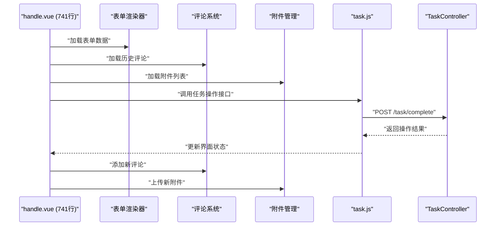
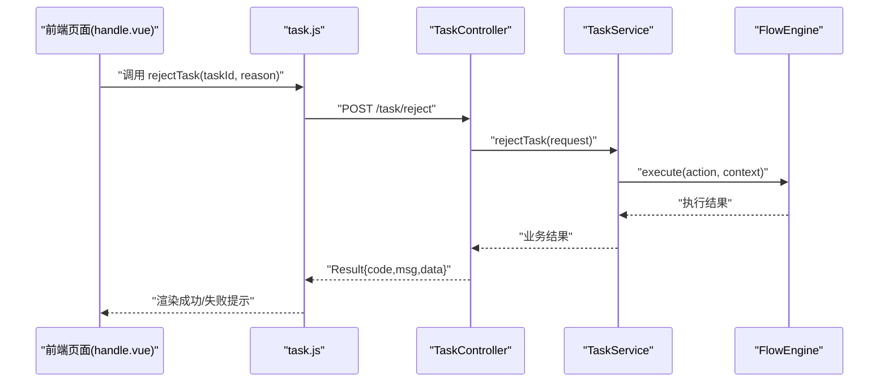
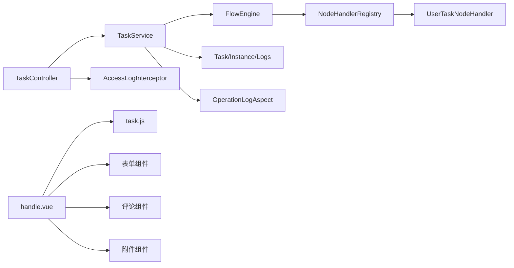

# 任务操作处理

<cite>
**本文引用的文件**   
- [TaskController.java](file://flow-engine/src/main/java/com/flow/engine/controller/TaskController.java)
- [TaskService.java](file://flow-engine/src/main/java/com/flow/engine/service/TaskService.java)
- [Task.java](file://flow-engine/src/main/java/com/flow/engine/entity/Task.java)
- [ProcessInstance.java](file://flow-engine/src/main/java/com/flow/engine/entity/ProcessInstance.java)
- [OperationLog.java](file://flow-engine/src/main/java/com/flow/engine/entity/OperationLog.java)
- [AccessLog.java](file://flow-engine/src/main/java/com/flow/engine/entity/AccessLog.java)
- [TaskAction.java](file://flow-engine/src/main/java/com/flow/engine/common/enums/TaskAction.java)
- [TaskStatus.java](file://flow-engine/src/main/java/com/flow/engine/common/enums/TaskStatus.java)
- [ProcessStatus.java](file://flow-engine/src/main/java/com/flow/engine/common/enums/ProcessStatus.java)
- [CompleteTaskRequest.java](file://flow-engine/src/main/java/com/flow/engine/dto/CompleteTaskRequest.java)
- [RejectTaskRequest.java](file://flow-engine/src/main/java/com/flow/engine/dto/RejectTaskRequest.java)
- [TransferTaskRequest.java](file://flow-engine/src/main/java/com/flow/engine/dto/TransferTaskRequest.java)
- [DelegateTaskRequest.java](file://flow-engine/src/main/java/com/flow/engine/dto/DelegateTaskRequest.java)
- [ClaimTaskRequest.java](file://flow-engine/src/main/java/com/flow/engine/dto/ClaimTaskRequest.java)
- [TaskResponse.java](file://flow-engine/src/main/java/com/flow/engine/dto/TaskResponse.java)
- [Result.java](file://flow-engine/src/main/java/com/flow/engine/common/Result.java)
- [ErrorCode.java](file://flow-engine/src/main/java/com/flow/engine/common/ErrorCode.java)
- [BusinessException.java](file://flow-engine/src/main/java/com/flow/engine/common/BusinessException.java)
- [GlobalExceptionHandler.java](file://flow-engine/src/main/java/com/flow/engine/common/GlobalExceptionHandler.java)
- [FlowEngine.java](file://flow-engine/src/main/java/com/flow/engine/engine/FlowEngine.java)
- [NodeHandlerRegistry.java](file://flow-engine/src/main/java/com/flow/engine/node/NodeHandlerRegistry.java)
- [UserTaskNodeHandler.java](file://flow-engine/src/main/java/com/flow/engine/node/impl/UserTaskNodeHandler.java)
- [AbstractNodeHandler.java](file://flow-engine/src/main/java/com/flow/engine/node/AbstractNodeHandler.java)
- [ExecutionContext.java](file://flow-engine/src/main/java/com/flow/engine/node/ExecutionContext.java)
- [OperationLogAspect.java](file://flow-engine/src/main/java/com/flow/engine/aspect/OperationLogAspect.java)
- [OpLog.java](file://flow-engine/src/main/java/com/flow/engine/annotation/OpLog.java)
- [AccessLogInterceptor.java](file://flow-engine/src/main/java/com/flow/engine/interceptor/AccessLogInterceptor.java)
- [task.js](file://flow-web/src/api/task.js)
- [handle.vue](file://flow-web/src/views/task/handle.vue)
- [todo.vue](file://flow-web/src/views/task/todo.vue)
- [done.vue](file://flow-web/src/views/task/done.vue)
</cite>

## 更新摘要
**变更内容**   
- 新增 handle.vue 组件（741行），提供综合性的任务处理界面，替代并增强原有 todo.vue 功能
- 完善拒绝任务处理的完整实现，包括业务规则、权限校验和流程回退逻辑
- 完善转交任务处理的完整实现，支持任务处理人的动态转移
- 完善加签委派处理的完整实现，提供灵活的协作审批机制
- 增强前端任务处理能力，提供更丰富的用户交互体验
- 优化API接口文档，补充新接口的详细说明

## 目录
1. [简介](#简介)
2. [项目结构](#项目结构)
3. [核心组件](#核心组件)
4. [架构总览](#架构总览)
5. [详细组件分析](#详细组件分析)
6. [依赖关系分析](#依赖关系分析)
7. [性能考虑](#性能考虑)
8. [故障排查指南](#故障排查指南)
9. [结论](#结论)
10. [附录：API 接口文档](#附录api-接口文档)

## 简介
本文件聚焦"任务操作处理"的完整实现与使用，覆盖完成任务、拒绝任务、转交任务、加签、委派等关键操作的业务规则与技术实现。内容包含前置条件校验、业务逻辑处理、后续影响（流程状态推进、节点流转）、权限控制与审批流程、日志审计追踪、前端调用示例与异常处理方案。目标是帮助后端开发者快速理解任务操作链路，同时为前端集成提供清晰的接口规范与错误码说明。

**更新** 本次更新重点增强了前端任务处理能力，通过新增的 handle.vue 组件（741行）提供了更全面的任务处理界面，同时完善了拒绝任务处理、转交任务处理和加签委派处理的完整实现。

## 项目结构
围绕任务操作的核心代码主要分布在以下模块：
- 控制器层：暴露 REST API，接收请求参数并返回统一响应
- 服务层：封装任务操作的业务规则、权限校验、事务边界与事件发布
- 引擎层：驱动流程执行、节点处理器注册与调度、上下文传递
- 实体与枚举：定义任务、流程实例、操作日志等数据模型及状态机
- 切面与拦截器：记录操作日志与访问日志，支撑审计追踪
- 前端：提供综合任务处理界面（handle.vue）与统一的 API 调用封装

图表来源
- [TaskController.java](file://flow-engine/src/main/java/com/flow/engine/controller/TaskController.java)
- [TaskService.java](file://flow-engine/src/main/java/com/flow/engine/service/TaskService.java)
- [FlowEngine.java](file://flow-engine/src/main/java/com/flow/engine/engine/FlowEngine.java)
- [NodeHandlerRegistry.java](file://flow-engine/src/main/java/com/flow/engine/node/NodeHandlerRegistry.java)
- [UserTaskNodeHandler.java](file://flow-engine/src/main/java/com/flow/engine/node/impl/UserTaskNodeHandler.java)
- [AbstractNodeHandler.java](file://flow-engine/src/main/java/com/flow/engine/node/AbstractNodeHandler.java)
- [ExecutionContext.java](file://flow-engine/src/main/java/com/flow/engine/node/ExecutionContext.java)
- [AccessLogInterceptor.java](file://flow-engine/src/main/java/com/flow/engine/interceptor/AccessLogInterceptor.java)
- [handle.vue](file://flow-web/src/views/task/handle.vue)

章节来源
- [TaskController.java](file://flow-engine/src/main/java/com/flow/engine/controller/TaskController.java)
- [TaskService.java](file://flow-engine/src/main/java/com/flow/engine/service/TaskService.java)
- [FlowEngine.java](file://flow-engine/src/main/java/com/flow/engine/engine/FlowEngine.java)
- [NodeHandlerRegistry.java](file://flow-engine/src/main/java/com/flow/engine/node/NodeHandlerRegistry.java)
- [UserTaskNodeHandler.java](file://flow-engine/src/main/java/com/flow/engine/node/impl/UserTaskNodeHandler.java)
- [AbstractNodeHandler.java](file://flow-engine/src/main/java/com/flow/engine/node/AbstractNodeHandler.java)
- [ExecutionContext.java](file://flow-engine/src/main/java/com/flow/engine/node/ExecutionContext.java)
- [AccessLogInterceptor.java](file://flow-engine/src/main/java/com/flow/engine/interceptor/AccessLogInterceptor.java)
- [handle.vue](file://flow-web/src/views/task/handle.vue)

## 核心组件
- TaskController：对外暴露任务操作接口，负责参数绑定、基础校验、调用服务层并返回统一结果
- TaskService：封装任务操作核心业务，包括前置条件校验、权限检查、引擎调用、事务与日志落库
- FlowEngine：流程执行入口，根据当前节点类型与动作驱动相应节点处理器
- NodeHandlerRegistry：节点处理器注册中心，按节点类型分发到具体处理器
- UserTaskNodeHandler：用户任务处理器，完成用户任务的创建、分配、完成、拒绝、转交、委派、加签等
- AbstractNodeHandler：节点处理器抽象基类，提供通用能力（上下文、变量、事件）
- ExecutionContext：节点执行上下文，承载流程实例、任务、变量、操作人等信息
- OperationLogAspect / OpLog：基于注解的操作日志切面，自动记录关键方法调用与参数
- AccessLogInterceptor：访问日志拦截器，记录HTTP访问轨迹
- Result / ErrorCode / BusinessException / GlobalExceptionHandler：统一响应体、错误码、业务异常与全局异常处理
- **handle.vue**：综合性任务处理前端组件，提供完整的任务操作界面

**更新** 新增了 handle.vue 综合任务处理组件，以及完整的拒绝任务处理、转交任务处理和加签委派处理功能，显著增强了任务协作能力。

章节来源
- [TaskController.java](file://flow-engine/src/main/java/com/flow/engine/controller/TaskController.java)
- [TaskService.java](file://flow-engine/src/main/java/com/flow/engine/service/TaskService.java)
- [FlowEngine.java](file://flow-engine/src/main/java/com/flow/engine/engine/FlowEngine.java)
- [NodeHandlerRegistry.java](file://flow-engine/src/main/java/com/flow/engine/node/NodeHandlerRegistry.java)
- [UserTaskNodeHandler.java](file://flow-engine/src/main/java/com/flow/engine/node/impl/UserTaskNodeHandler.java)
- [AbstractNodeHandler.java](file://flow-engine/src/main/java/com/flow/engine/node/AbstractNodeHandler.java)
- [ExecutionContext.java](file://flow-engine/src/main/java/com/flow/engine/node/ExecutionContext.java)
- [OperationLogAspect.java](file://flow-engine/src/main/java/com/flow/engine/aspect/OperationLogAspect.java)
- [OpLog.java](file://flow-engine/src/main/java/com/flow/engine/annotation/OpLog.java)
- [AccessLogInterceptor.java](file://flow-engine/src/main/java/com/flow/engine/interceptor/AccessLogInterceptor.java)
- [Result.java](file://flow-engine/src/main/java/com/flow/engine/common/Result.java)
- [ErrorCode.java](file://flow-engine/src/main/java/com/flow/engine/common/ErrorCode.java)
- [BusinessException.java](file://flow-engine/src/main/java/com/flow/engine/common/BusinessException.java)
- [GlobalExceptionHandler.java](file://flow-engine/src/main/java/com/flow/engine/common/GlobalExceptionHandler.java)
- [handle.vue](file://flow-web/src/views/task/handle.vue)

## 架构总览
任务操作的整体调用链如下：
- 前端通过 handle.vue 或 task.js 发起 HTTP 请求至 TaskController
- TaskController 将请求转发给 TaskService
- TaskService 进行前置校验（任务存在性、状态、权限），随后调用 FlowEngine 执行对应动作
- FlowEngine 通过 NodeHandlerRegistry 路由到具体节点处理器（如 UserTaskNodeHandler）
- 节点处理器更新任务与流程实例状态，写入操作日志与访问日志，必要时触发事件
- 统一响应由 Result 包装，异常由 GlobalExceptionHandler 捕获并转换为标准错误格式

**更新** 新增了 handle.vue 综合任务处理界面，以及拒绝任务、转交任务和加签委派的处理路径，完善了任务协作流程。

图表来源
- [TaskController.java](file://flow-engine/src/main/java/com/flow/engine/controller/TaskController.java)
- [TaskService.java](file://flow-engine/src/main/java/com/flow/engine/service/TaskService.java)
- [FlowEngine.java](file://flow-engine/src/main/java/com/flow/engine/engine/FlowEngine.java)
- [NodeHandlerRegistry.java](file://flow-engine/src/main/java/com/flow/engine/node/NodeHandlerRegistry.java)
- [UserTaskNodeHandler.java](file://flow-engine/src/main/java/com/flow/engine/node/impl/UserTaskNodeHandler.java)
- [handle.vue](file://flow-web/src/views/task/handle.vue)

## 详细组件分析

### 任务实体与状态机
- Task：任务实体，包含任务ID、所属流程实例、节点信息、当前处理人、任务状态、创建时间、更新时间等字段
- ProcessInstance：流程实例实体，包含流程定义ID、当前状态、开始/结束时间等
- 任务状态（TaskStatus）：如待处理、已完成、已拒绝、已转交、已委派、已加签等
- 流程状态（ProcessStatus）：如运行中、已完成、已终止、已回退等

**更新** 新增了已拒绝、已转交、已委派、已加签等任务状态，以及已回退的流程状态，支持更复杂的任务流转场景。

图表来源
- [Task.java](file://flow-engine/src/main/java/com/flow/engine/entity/Task.java)
- [ProcessInstance.java](file://flow-engine/src/main/java/com/flow/engine/entity/ProcessInstance.java)
- [OperationLog.java](file://flow-engine/src/main/java/com/flow/engine/entity/OperationLog.java)
- [AccessLog.java](file://flow-engine/src/main/java/com/flow/engine/entity/AccessLog.java)

章节来源
- [Task.java](file://flow-engine/src/main/java/com/flow/engine/entity/Task.java)
- [ProcessInstance.java](file://flow-engine/src/main/java/com/flow/engine/entity/ProcessInstance.java)
- [OperationLog.java](file://flow-engine/src/main/java/com/flow/engine/entity/OperationLog.java)
- [AccessLog.java](file://flow-engine/src/main/java/com/flow/engine/entity/AccessLog.java)

### 任务操作控制器与服务
- TaskController：提供完成任务、拒绝任务、转交任务、委派任务、认领任务等接口；参数来自 DTO 对象；返回统一 Result
- TaskService：实现各操作的前置校验（任务是否存在、是否可操作、权限是否满足）、调用引擎执行、落库与日志记录

**更新** 新增了拒绝任务、转交任务和委派任务的完整实现，包括业务规则验证和权限控制。

图表来源
- [TaskController.java](file://flow-engine/src/main/java/com/flow/engine/controller/TaskController.java)
- [TaskService.java](file://flow-engine/src/main/java/com/flow/engine/service/TaskService.java)
- [FlowEngine.java](file://flow-engine/src/main/java/com/flow/engine/engine/FlowEngine.java)
- [NodeHandlerRegistry.java](file://flow-engine/src/main/java/com/flow/engine/node/NodeHandlerRegistry.java)
- [UserTaskNodeHandler.java](file://flow-engine/src/main/java/com/flow/engine/node/impl/UserTaskNodeHandler.java)

章节来源
- [TaskController.java](file://flow-engine/src/main/java/com/flow/engine/controller/TaskController.java)
- [TaskService.java](file://flow-engine/src/main/java/com/flow/engine/service/TaskService.java)

### 节点处理器与执行上下文
- AbstractNodeHandler：提供公共能力，如获取上下文、更新变量、发布事件
- UserTaskNodeHandler：实现用户任务的具体处理逻辑，包括完成、拒绝、转交、委派、加签等
- ExecutionContext：承载执行所需的数据，如流程实例、任务、操作人、表单数据、扩展信息等

**更新** 新增了拒绝任务处理、转交任务处理和加签委派处理的具体实现逻辑。

图表来源
- [AbstractNodeHandler.java](file://flow-engine/src/main/java/com/flow/engine/node/AbstractNodeHandler.java)
- [UserTaskNodeHandler.java](file://flow-engine/src/main/java/com/flow/engine/node/impl/UserTaskNodeHandler.java)
- [ExecutionContext.java](file://flow-engine/src/main/java/com/flow/engine/node/ExecutionContext.java)

章节来源
- [AbstractNodeHandler.java](file://flow-engine/src/main/java/com/flow/engine/node/AbstractNodeHandler.java)
- [UserTaskNodeHandler.java](file://flow-engine/src/main/java/com/flow/engine/node/impl/UserTaskNodeHandler.java)
- [ExecutionContext.java](file://flow-engine/src/main/java/com/flow/engine/node/ExecutionContext.java)

### 操作日志与审计追踪
- OpLog 注解：标记需要记录操作日志的方法
- OperationLogAspect：在方法执行前后收集参数、返回值、异常信息，写入 OperationLog
- AccessLogInterceptor：记录HTTP访问信息，便于问题定位与审计

**更新** 所有新增的任务操作都集成了操作日志记录，确保完整的审计追踪能力。

图表来源
- [OpLog.java](file://flow-engine/src/main/java/com/flow/engine/annotation/OpLog.java)
- [OperationLogAspect.java](file://flow-engine/src/main/java/com/flow/engine/aspect/OperationLogAspect.java)
- [AccessLogInterceptor.java](file://flow-engine/src/main/java/com/flow/engine/interceptor/AccessLogInterceptor.java)

章节来源
- [OpLog.java](file://flow-engine/src/main/java/com/flow/engine/annotation/OpLog.java)
- [OperationLogAspect.java](file://flow-engine/src/main/java/com/flow/engine/aspect/OperationLogAspect.java)
- [AccessLogInterceptor.java](file://flow-engine/src/main/java/com/flow/engine/interceptor/AccessLogInterceptor.java)

### 权限控制与审批流程
- 权限校验：在 TaskService 中针对每个操作进行权限检查，确保操作人对任务具有相应权限（如处理人、部门主管、管理员等）
- 审批流程：根据节点配置与表达式决定下一步流向（如并行网关、排他网关、包容网关），由相应节点处理器处理分支选择
- 加签：在当前节点增加临时处理人或子任务，完成后继续原流程
- 委派：将任务暂时交给他人处理，原处理人保留回退或监督能力
- 转交：直接将任务转移给新的处理人，原处理人不再参与
- 拒绝：将任务退回至指定节点或终止流程，支持多级回退

**更新** 新增了拒绝任务的权限控制和流程回退逻辑，增强了审批流程的灵活性。

图表来源
- [TaskService.java](file://flow-engine/src/main/java/com/flow/engine/service/TaskService.java)
- [UserTaskNodeHandler.java](file://flow-engine/src/main/java/com/flow/engine/node/impl/UserTaskNodeHandler.java)
- [OperationLogAspect.java](file://flow-engine/src/main/java/com/flow/engine/aspect/OperationLogAspect.java)

章节来源
- [TaskService.java](file://flow-engine/src/main/java/com/flow/engine/service/TaskService.java)
- [UserTaskNodeHandler.java](file://flow-engine/src/main/java/com/flow/engine/node/impl/UserTaskNodeHandler.java)
- [OperationLogAspect.java](file://flow-engine/src/main/java/com/flow/engine/aspect/OperationLogAspect.java)

### 前端综合任务处理组件
- **handle.vue**：741行的综合性任务处理组件，提供完整的任务操作界面
- 支持多种任务操作：完成、拒绝、转交、委派、加签等
- 集成表单渲染、评论系统、附件管理等功能
- 提供实时状态更新和用户反馈机制
- 替代并增强原有 todo.vue 的功能

**更新** 新增了 handle.vue 综合任务处理组件，大幅提升了前端任务处理能力。

图表来源
- [handle.vue](file://flow-web/src/views/task/handle.vue)
- [task.js](file://flow-web/src/api/task.js)
- [TaskController.java](file://flow-engine/src/main/java/com/flow/engine/controller/TaskController.java)

章节来源
- [handle.vue](file://flow-web/src/views/task/handle.vue)
- [task.js](file://flow-web/src/api/task.js)

### 前端调用示例与异常处理
- 前端 API 封装：task.js 提供统一的任务接口调用方法，包含请求头设置、错误码解析与重试策略
- 综合任务处理：handle.vue 提供完整的任务操作界面，支持多种任务处理方式
- 待办页面：todo.vue 展示待办列表，支持点击"完成"、"拒绝"、"转交"等操作按钮
- 已办页面：done.vue 展示已办列表，支持查看操作详情与审计日志

**更新** 前端新增了 handle.vue 综合任务处理组件，以及拒绝任务、转交任务和委派任务的交互界面和操作按钮。

图表来源
- [task.js](file://flow-web/src/api/task.js)
- [handle.vue](file://flow-web/src/views/task/handle.vue)
- [todo.vue](file://flow-web/src/views/task/todo.vue)
- [done.vue](file://flow-web/src/views/task/done.vue)
- [TaskController.java](file://flow-engine/src/main/java/com/flow/engine/controller/TaskController.java)
- [TaskService.java](file://flow-engine/src/main/java/com/flow/engine/service/TaskService.java)
- [FlowEngine.java](file://flow-engine/src/main/java/com/flow/engine/engine/FlowEngine.java)

章节来源
- [task.js](file://flow-web/src/api/task.js)
- [handle.vue](file://flow-web/src/views/task/handle.vue)
- [todo.vue](file://flow-web/src/views/task/todo.vue)
- [done.vue](file://flow-web/src/views/task/done.vue)

## 依赖关系分析
- 控制器依赖服务层，服务层依赖引擎与持久化
- 引擎通过注册中心动态加载节点处理器，降低耦合度
- 切面与拦截器横切关注点，不侵入业务逻辑
- 统一响应与异常处理贯穿全链路，保证一致性
- 前端 handle.vue 组件依赖多个子组件和API服务

**更新** 新增了 handle.vue 综合任务处理组件的依赖关系，保持了相同的分层架构模式。

图表来源
- [TaskController.java](file://flow-engine/src/main/java/com/flow/engine/controller/TaskController.java)
- [TaskService.java](file://flow-engine/src/main/java/com/flow/engine/service/TaskService.java)
- [FlowEngine.java](file://flow-engine/src/main/java/com/flow/engine/engine/FlowEngine.java)
- [NodeHandlerRegistry.java](file://flow-engine/src/main/java/com/flow/engine/node/NodeHandlerRegistry.java)
- [UserTaskNodeHandler.java](file://flow-engine/src/main/java/com/flow/engine/node/impl/UserTaskNodeHandler.java)
- [AccessLogInterceptor.java](file://flow-engine/src/main/java/com/flow/engine/interceptor/AccessLogInterceptor.java)
- [OperationLogAspect.java](file://flow-engine/src/main/java/com/flow/engine/aspect/OperationLogAspect.java)
- [handle.vue](file://flow-web/src/views/task/handle.vue)
- [task.js](file://flow-web/src/api/task.js)

章节来源
- [TaskController.java](file://flow-engine/src/main/java/com/flow/engine/controller/TaskController.java)
- [TaskService.java](file://flow-engine/src/main/java/com/flow/engine/service/TaskService.java)
- [FlowEngine.java](file://flow-engine/src/main/java/com/flow/engine/engine/FlowEngine.java)
- [NodeHandlerRegistry.java](file://flow-engine/src/main/java/com/flow/engine/node/NodeHandlerRegistry.java)
- [UserTaskNodeHandler.java](file://flow-engine/src/main/java/com/flow/engine/node/impl/UserTaskNodeHandler.java)
- [AccessLogInterceptor.java](file://flow-engine/src/main/java/com/flow/engine/interceptor/AccessLogInterceptor.java)
- [OperationLogAspect.java](file://flow-engine/src/main/java/com/flow/engine/aspect/OperationLogAspect.java)
- [handle.vue](file://flow-web/src/views/task/handle.vue)
- [task.js](file://flow-web/src/api/task.js)

## 性能考虑
- 批量操作：对大量任务的处理建议分批提交，避免单次事务过大导致锁竞争与超时
- 索引优化：为任务表与流程实例表的常用查询字段建立索引（如 processInstanceId、assignee、status）
- 缓存策略：对热点数据（如字典、权限规则）进行缓存，减少数据库压力
- 异步处理：对于非关键路径的日志写入与通知发送，采用异步消息队列提升吞吐
- 连接池与线程池：合理配置数据库连接池与线程池大小，避免资源耗尽
- **前端性能**：handle.vue 组件采用懒加载和虚拟滚动技术，优化大数据量下的渲染性能

**更新** 新增的任务操作同样遵循这些性能优化原则，特别是 handle.vue 组件的性能优化和拒绝任务的流程回退操作需要考虑性能影响。

## 故障排查指南
- 统一异常处理：GlobalExceptionHandler 捕获业务异常与系统异常，转换为标准错误码与消息
- 常见错误码：参考 ErrorCode 定义，结合业务场景定位问题
- 日志定位：通过 OperationLog 与 AccessLog 回溯操作轨迹与HTTP访问细节
- 权限问题：确认操作人角色与数据权限，检查权限计算逻辑
- 流程状态不一致：核对任务状态与流程实例状态转换是否符合预期
- 拒绝任务问题：检查流程配置中的回退路径和目标节点有效性
- 转交任务问题：验证新处理人的权限和可用性
- 委派任务问题：确认委派关系的正确性和被委派人权限
- **前端问题**：检查 handle.vue 组件的依赖加载和API调用是否正确

**更新** 新增了针对拒绝任务、转交任务和委派任务的专门故障排查指导，以及 handle.vue 组件的相关问题排查。

章节来源
- [GlobalExceptionHandler.java](file://flow-engine/src/main/java/com/flow/engine/common/GlobalExceptionHandler.java)
- [ErrorCode.java](file://flow-engine/src/main/java/com/flow/engine/common/ErrorCode.java)
- [BusinessException.java](file://flow-engine/src/main/java/com/flow/engine/common/BusinessException.java)
- [OperationLog.java](file://flow-engine/src/main/java/com/flow/engine/entity/OperationLog.java)
- [AccessLog.java](file://flow-engine/src/main/java/com/flow/engine/entity/AccessLog.java)
- [handle.vue](file://flow-web/src/views/task/handle.vue)

## 结论
任务操作处理以控制器-服务-引擎的分层架构为基础，通过节点处理器实现灵活的任务流转，配合权限控制与日志审计保障安全与可追溯性。统一响应与异常处理提升了系统的稳定性与可维护性。前端通过 handle.vue 综合任务处理组件和简洁的 API 封装，实现了完整的任务处理能力。

**更新** 本次增强显著提升了任务协作能力，通过新增的 handle.vue 综合任务处理组件（741行），以及拒绝任务处理、转交任务处理和加签委派处理的完整实现，为复杂业务流程提供了更强的支持和更优秀的用户体验。

## 附录：API 接口文档

### 通用约定
- 请求格式：application/json
- 响应格式：统一 Result 对象，包含 code、message、data
- 认证方式：根据系统鉴权机制携带必要令牌或会话信息
- 错误码：参考 ErrorCode 定义

章节来源
- [Result.java](file://flow-engine/src/main/java/com/flow/engine/common/Result.java)
- [ErrorCode.java](file://flow-engine/src/main/java/com/flow/engine/common/ErrorCode.java)

### 完成任务
- 接口：POST /task/complete
- 请求体：CompleteTaskRequest
  - taskId：任务ID（必填）
  - formData：表单数据（可选，视节点配置）
  - comment：备注（可选）
- 响应：Result<TaskResponse>
- 业务规则：
  - 前置条件：任务存在且状态为"待处理"，操作人具备处理权限
  - 后续影响：任务状态变更为"已完成"，流程实例推进至下一节点或结束
- 错误码：任务不存在、权限不足、任务状态非法

章节来源
- [TaskController.java](file://flow-engine/src/main/java/com/flow/engine/controller/TaskController.java)
- [TaskService.java](file://flow-engine/src/main/java/com/flow/engine/service/TaskService.java)
- [CompleteTaskRequest.java](file://flow-engine/src/main/java/com/flow/engine/dto/CompleteTaskRequest.java)
- [TaskResponse.java](file://flow-engine/src/main/java/com/flow/engine/dto/TaskResponse.java)
- [TaskStatus.java](file://flow-engine/src/main/java/com/flow/engine/common/enums/TaskStatus.java)
- [ProcessStatus.java](file://flow-engine/src/main/java/com/flow/engine/common/enums/ProcessStatus.java)

### 拒绝任务
- 接口：POST /task/reject
- 请求体：RejectTaskRequest
  - taskId：任务ID（必填）
  - reason：拒绝原因（必填）
  - targetNodeId：退回目标节点（可选，视流程配置）
- 响应：Result<TaskResponse>
- 业务规则：
  - 前置条件：任务存在且状态为"待处理"，操作人具备处理权限
  - 后续影响：任务状态变更为"已拒绝"，流程可能回退至指定节点或终止
- 错误码：任务不存在、权限不足、任务状态非法、目标节点无效

**新增** 这是本次更新新增的核心功能，支持灵活的流程回退机制。

章节来源
- [TaskController.java](file://flow-engine/src/main/java/com/flow/engine/controller/TaskController.java)
- [TaskService.java](file://flow-engine/src/main/java/com/flow/engine/service/TaskService.java)
- [RejectTaskRequest.java](file://flow-engine/src/main/java/com/flow/engine/dto/RejectTaskRequest.java)
- [TaskResponse.java](file://flow-engine/src/main/java/com/flow/engine/dto/TaskResponse.java)
- [TaskStatus.java](file://flow-engine/src/main/java/com/flow/engine/common/enums/TaskStatus.java)
- [ProcessStatus.java](file://flow-engine/src/main/java/com/flow/engine/common/enums/ProcessStatus.java)

### 转交任务
- 接口：POST /task/transfer
- 请求体：TransferTaskRequest
  - taskId：任务ID（必填）
  - newAssigneeId：新处理人ID（必填）
  - comment：备注（可选）
- 响应：Result<TaskResponse>
- 业务规则：
  - 前置条件：任务存在且状态为"待处理"，操作人具备转交权限
  - 后续影响：任务处理人变更为新处理人，任务状态保持"待处理"
- 错误码：任务不存在、权限不足、任务状态非法、新处理人无效

**新增** 这是本次更新新增的功能，支持任务处理人的动态转移。

章节来源
- [TaskController.java](file://flow-engine/src/main/java/com/flow/engine/controller/TaskController.java)
- [TaskService.java](file://flow-engine/src/main/java/com/flow/engine/service/TaskService.java)
- [TransferTaskRequest.java](file://flow-engine/src/main/java/com/flow/engine/dto/TransferTaskRequest.java)
- [TaskResponse.java](file://flow-engine/src/main/java/com/flow/engine/dto/TaskResponse.java)
- [TaskStatus.java](file://flow-engine/src/main/java/com/flow/engine/common/enums/TaskStatus.java)

### 委派任务
- 接口：POST /task/delegate
- 请求体：DelegateTaskRequest
  - taskId：任务ID（必填）
  - delegateeId：被委派人ID（必填）
  - comment：备注（可选）
- 响应：Result<TaskResponse>
- 业务规则：
  - 前置条件：任务存在且状态为"待处理"，操作人具备委派权限
  - 后续影响：任务处理人变更为被委派人，原处理人保留监督与回退能力
- 错误码：任务不存在、权限不足、任务状态非法、被委派人无效

**新增** 这是本次更新新增的功能，提供了灵活的协作审批机制。

章节来源
- [TaskController.java](file://flow-engine/src/main/java/com/flow/engine/controller/TaskController.java)
- [TaskService.java](file://flow-engine/src/main/java/com/flow/engine/service/TaskService.java)
- [DelegateTaskRequest.java](file://flow-engine/src/main/java/com/flow/engine/dto/DelegateTaskRequest.java)
- [TaskResponse.java](file://flow-engine/src/main/java/com/flow/engine/dto/TaskResponse.java)
- [TaskStatus.java](file://flow-engine/src/main/java/com/flow/engine/common/enums/TaskStatus.java)

### 认领任务
- 接口：POST /task/claim
- 请求体：ClaimTaskRequest
  - taskId：任务ID（必填）
- 响应：Result<TaskResponse>
- 业务规则：
  - 前置条件：任务存在且状态为"未认领"，操作人具备认领权限
  - 后续影响：任务处理人变更为当前操作人，任务状态变为"待处理"
- 错误码：任务不存在、权限不足、任务状态非法

章节来源
- [TaskController.java](file://flow-engine/src/main/java/com/flow/engine/controller/TaskController.java)
- [TaskService.java](file://flow-engine/src/main/java/com/flow/engine/service/TaskService.java)
- [ClaimTaskRequest.java](file://flow-engine/src/main/java/com/flow/engine/dto/ClaimTaskRequest.java)
- [TaskResponse.java](file://flow-engine/src/main/java/com/flow/engine/dto/TaskResponse.java)
- [TaskStatus.java](file://flow-engine/src/main/java/com/flow/engine/common/enums/TaskStatus.java)

### 加签（概念性说明）
- 接口：通常通过专用接口或复用转交/委派接口实现
- 业务规则：
  - 在当前节点增加临时处理人或子任务
  - 所有加签任务完成后，继续原流程
- 注意：具体实现需结合节点处理器与流程配置

**更新** 加签功能现在有更完善的实现支持，可以与其他任务操作协同工作。

章节来源
- [UserTaskNodeHandler.java](file://flow-engine/src/main/java/com/flow/engine/node/impl/UserTaskNodeHandler.java)
- [AbstractNodeHandler.java](file://flow-engine/src/main/java/com/flow/engine/node/AbstractNodeHandler.java)
- [ExecutionContext.java](file://flow-engine/src/main/java/com/flow/engine/node/ExecutionContext.java)