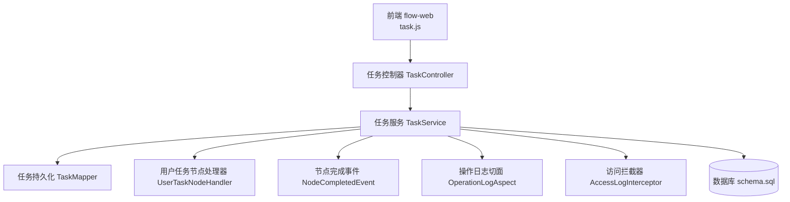
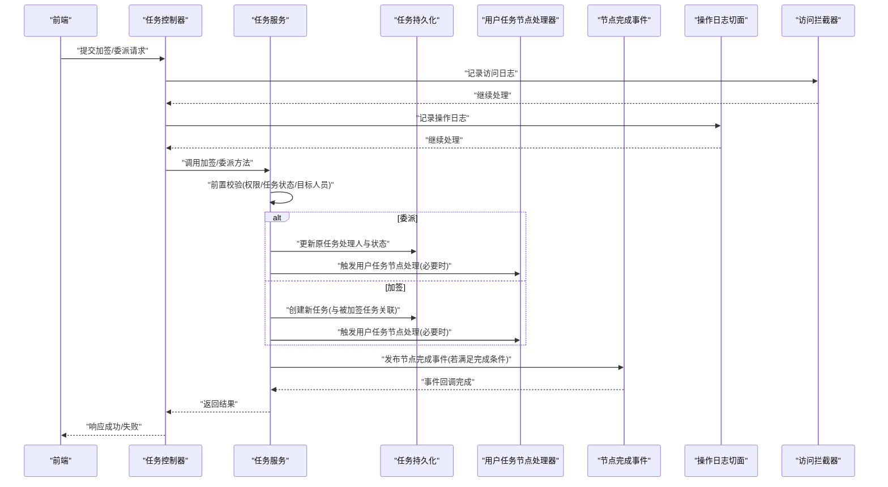
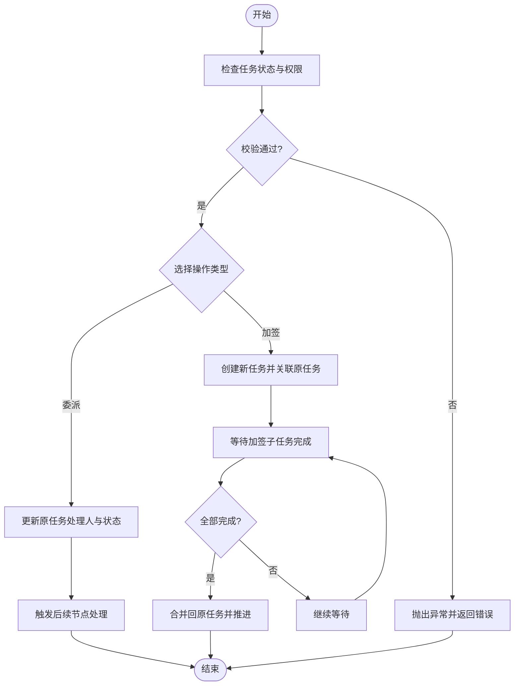
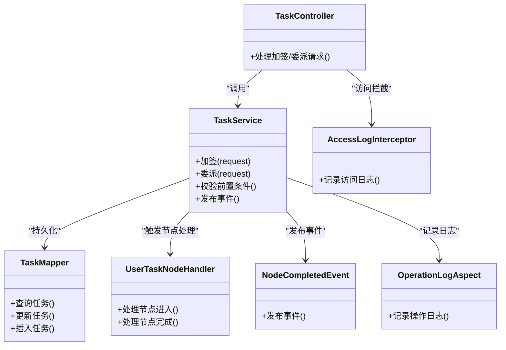

# 加签委派处理

<cite>
**本文引用的文件**   
- [flow-engine/src/main/java/com/flow/engine/common/enums/SignType.java](file://flow-engine/src/main/java/com/flow/engine/common/enums/SignType.java)
- [flow-engine/src/main/java/com/flow/engine/dto/DelegateTaskRequest.java](file://flow-engine/src/main/java/com/flow/engine/dto/DelegateTaskRequest.java)
- [flow-engine/src/main/java/com/flow/engine/entity/Task.java](file://flow-engine/src/main/java/com/flow/engine/entity/Task.java)
- [flow-engine/src/main/java/com/flow/engine/service/TaskService.java](file://flow-engine/src/main/java/com/flow/engine/service/TaskService.java)
- [flow-engine/src/main/java/com/flow/engine/controller/TaskController.java](file://flow-engine/src/main/java/com/flow/engine/controller/TaskController.java)
- [flow-engine/src/main/java/com/flow/engine/mapper/TaskMapper.java](file://flow-engine/src/main/java/com/flow/engine/mapper/TaskMapper.java)
- [flow-engine/src/main/java/com/flow/engine/node/impl/UserTaskNodeHandler.java](file://flow-engine/src/main/java/com/flow/engine/node/impl/UserTaskNodeHandler.java)
- [flow-engine/src/main/java/com/flow/engine/event/NodeCompletedEvent.java](file://flow-engine/src/main/java/com/flow/engine/event/NodeCompletedEvent.java)
- [flow-engine/src/main/java/com/flow/engine/aspect/OperationLogAspect.java](file://flow-engine/src/main/java/com/flow/engine/aspect/OperationLogAspect.java)
- [flow-engine/src/main/java/com/flow/engine/interceptor/AccessLogInterceptor.java](file://flow-engine/src/main/java/com/flow/engine/interceptor/AccessLogInterceptor.java)
- [flow-engine/src/main/java/com/flow/engine/common/exception/FlowException.java](file://flow-engine/src/main/java/com/flow/engine/common/exception/FlowException.java)
- [flow-engine/src/main/java/com/flow/engine/common/GlobalExceptionHandler.java](file://flow-engine/src/main/java/com/flow/engine/common/GlobalExceptionHandler.java)
- [flow-engine/src/main/resources/db/schema.sql](file://flow-engine/src/main/resources/db/schema.sql)
- [flow-web/src/api/task.js](file://flow-web/src/api/task.js)
</cite>

## 目录
1. [简介](#简介)
2. [项目结构](#项目结构)
3. [核心组件](#核心组件)
4. [架构总览](#架构总览)
5. [详细组件分析](#详细组件分析)
6. [依赖关系分析](#依赖关系分析)
7. [性能考虑](#性能考虑)
8. [故障排查指南](#故障排查指南)
9. [结论](#结论)
10. [附录](#附录)

## 简介
本文件围绕“加签”和“委派”两大任务协作能力，给出从业务语义、数据模型、执行流程到前端集成与审计追踪的完整说明。重点覆盖：
- 加签与委派的差异、前置条件验证、执行顺序控制与责任追溯
- DelegateTaskRequest 请求对象结构与 SignType 枚举的使用方式
- 对任务流转的影响：新任务创建、原任务状态管理、完成条件判断
- 多级加签逻辑与循环加签限制
- 前端集成示例与用户体验优化建议
- 权限控制、审计记录与性能优化方案

## 项目结构
本项目采用前后端分离架构：
- 后端（flow-engine）提供流程引擎、任务服务、节点处理器、事件与日志等能力
- 前端（flow-web）提供任务待办/已办页面与流程实例查看界面，并通过 API 调用后端

图表来源
- [flow-engine/src/main/java/com/flow/engine/controller/TaskController.java](file://flow-engine/src/main/java/com/flow/engine/controller/TaskController.java)
- [flow-engine/src/main/java/com/flow/engine/service/TaskService.java](file://flow-engine/src/main/java/com/flow/engine/service/TaskService.java)
- [flow-engine/src/main/java/com/flow/engine/mapper/TaskMapper.java](file://flow-engine/src/main/java/com/flow/engine/mapper/TaskMapper.java)
- [flow-engine/src/main/java/com/flow/engine/node/impl/UserTaskNodeHandler.java](file://flow-engine/src/main/java/com/flow/engine/node/impl/UserTaskNodeHandler.java)
- [flow-engine/src/main/java/com/flow/engine/event/NodeCompletedEvent.java](file://flow-engine/src/main/java/com/flow/engine/event/NodeCompletedEvent.java)
- [flow-engine/src/main/java/com/flow/engine/aspect/OperationLogAspect.java](file://flow-engine/src/main/java/com/flow/engine/aspect/OperationLogAspect.java)
- [flow-engine/src/main/java/com/flow/engine/interceptor/AccessLogInterceptor.java](file://flow-engine/src/main/java/com/flow/engine/interceptor/AccessLogInterceptor.java)
- [flow-engine/src/main/resources/db/schema.sql](file://flow-engine/src/main/resources/db/schema.sql)

章节来源
- [flow-engine/src/main/java/com/flow/engine/controller/TaskController.java](file://flow-engine/src/main/java/com/flow/engine/controller/TaskController.java)
- [flow-engine/src/main/java/com/flow/engine/service/TaskService.java](file://flow-engine/src/main/java/com/flow/engine/service/TaskService.java)
- [flow-engine/src/main/java/com/flow/engine/mapper/TaskMapper.java](file://flow-engine/src/main/java/com/flow/engine/mapper/TaskMapper.java)
- [flow-engine/src/main/java/com/flow/engine/node/impl/UserTaskNodeHandler.java](file://flow-engine/src/main/java/com/flow/engine/node/impl/UserTaskNodeHandler.java)
- [flow-engine/src/main/java/com/flow/engine/event/NodeCompletedEvent.java](file://flow-engine/src/main/java/com/flow/engine/event/NodeCompletedEvent.java)
- [flow-engine/src/main/java/com/flow/engine/aspect/OperationLogAspect.java](file://flow-engine/src/main/java/com/flow/engine/aspect/OperationLogAspect.java)
- [flow-engine/src/main/java/com/flow/engine/interceptor/AccessLogInterceptor.java](file://flow-engine/src/main/java/com/flow/engine/interceptor/AccessLogInterceptor.java)
- [flow-engine/src/main/resources/db/schema.sql](file://flow-engine/src/main/resources/db/schema.sql)

## 核心组件
- 任务实体与持久化
  - 任务实体定义任务关键属性（如任务ID、所属实例、节点、当前处理人、状态、是否被委派/加签等）
  - 任务 Mapper 负责与数据库交互
- 任务服务
  - 封装加签与委派的核心业务逻辑，包括参数校验、事务边界、事件发布与日志落盘
- 节点处理器
  - 用户任务节点处理器负责在节点进入/完成时生成或推进任务
- 事件与日志
  - 节点完成事件用于流程推进与外部通知
  - 操作日志切面与访问拦截器用于审计与可观测性
- 前端 API
  - 通过 task.js 暴露任务相关接口，供待办/已办页面调用

章节来源
- [flow-engine/src/main/java/com/flow/engine/entity/Task.java](file://flow-engine/src/main/java/com/flow/engine/entity/Task.java)
- [flow-engine/src/main/java/com/flow/engine/mapper/TaskMapper.java](file://flow-engine/src/main/java/com/flow/engine/mapper/TaskMapper.java)
- [flow-engine/src/main/java/com/flow/engine/service/TaskService.java](file://flow-engine/src/main/java/com/flow/engine/service/TaskService.java)
- [flow-engine/src/main/java/com/flow/engine/node/impl/UserTaskNodeHandler.java](file://flow-engine/src/main/java/com/flow/engine/node/impl/UserTaskNodeHandler.java)
- [flow-engine/src/main/java/com/flow/engine/event/NodeCompletedEvent.java](file://flow-engine/src/main/java/com/flow/engine/event/NodeCompletedEvent.java)
- [flow-engine/src/main/java/com/flow/engine/aspect/OperationLogAspect.java](file://flow-engine/src/main/java/com/flow/engine/aspect/OperationLogAspect.java)
- [flow-engine/src/main/java/com/flow/engine/interceptor/AccessLogInterceptor.java](file://flow-engine/src/main/java/com/flow/engine/interceptor/AccessLogInterceptor.java)
- [flow-web/src/api/task.js](file://flow-web/src/api/task.js)

## 架构总览
以下序列图展示一次“加签/委派”操作的端到端调用链，涵盖控制器、服务、持久化、事件与审计。

图表来源
- [flow-engine/src/main/java/com/flow/engine/controller/TaskController.java](file://flow-engine/src/main/java/com/flow/engine/controller/TaskController.java)
- [flow-engine/src/main/java/com/flow/engine/service/TaskService.java](file://flow-engine/src/main/java/com/flow/engine/service/TaskService.java)
- [flow-engine/src/main/java/com/flow/engine/mapper/TaskMapper.java](file://flow-engine/src/main/java/com/flow/engine/mapper/TaskMapper.java)
- [flow-engine/src/main/java/com/flow/engine/node/impl/UserTaskNodeHandler.java](file://flow-engine/src/main/java/com/flow/engine/node/impl/UserTaskNodeHandler.java)
- [flow-engine/src/main/java/com/flow/engine/event/NodeCompletedEvent.java](file://flow-engine/src/main/java/com/flow/engine/event/NodeCompletedEvent.java)
- [flow-engine/src/main/java/com/flow/engine/aspect/OperationLogAspect.java](file://flow-engine/src/main/java/com/flow/engine/aspect/OperationLogAspect.java)
- [flow-engine/src/main/java/com/flow/engine/interceptor/AccessLogInterceptor.java](file://flow-engine/src/main/java/com/flow/engine/interceptor/AccessLogInterceptor.java)

## 详细组件分析

### 加签与委派的概念与差异
- 委派
  - 将当前任务的办理责任转移给他人，原任务的处理人变更为目标人员
  - 适用于临时无法处理、需要转交的场景
  - 通常不改变任务数量，仅变更处理人与相关状态
- 加签
  - 在当前任务基础上新增一个或多个并行/串行子任务，由被加签人共同完成后再回到原任务
  - 适用于需要多人会签、补充审批意见的场景
  - 会产生新任务，并与原任务建立关联关系

适用场景对比
- 委派：单人负责、快速转交、避免阻塞
- 加签：多人协同、补充决策、保留原责任人

章节来源
- [flow-engine/src/main/java/com/flow/engine/dto/DelegateTaskRequest.java](file://flow-engine/src/main/java/com/flow/engine/dto/DelegateTaskRequest.java)
- [flow-engine/src/main/java/com/flow/engine/common/enums/SignType.java](file://flow-engine/src/main/java/com/flow/engine/common/enums/SignType.java)
- [flow-engine/src/main/java/com/flow/engine/entity/Task.java](file://flow-engine/src/main/java/com/flow/engine/entity/Task.java)

### 请求对象 DelegateTaskRequest 与 SignType 枚举
- DelegateTaskRequest
  - 包含任务标识、加签类型、目标处理人列表、备注信息等字段
  - 用于统一承载“加签/委派”两类操作的输入
- SignType 枚举
  - 用于区分加签与委派的具体模式（例如：前加签、后加签、直接委派等）
  - 不同模式影响新任务创建时机、与原任务的关系以及完成条件判定

使用建议
- 明确选择 SignType，确保与业务流程一致
- 目标处理人需具备相应权限且存在有效账号
- 备注信息应记录关键原因，便于审计与回溯

章节来源
- [flow-engine/src/main/java/com/flow/engine/dto/DelegateTaskRequest.java](file://flow-engine/src/main/java/com/flow/engine/dto/DelegateTaskRequest.java)
- [flow-engine/src/main/java/com/flow/engine/common/enums/SignType.java](file://flow-engine/src/main/java/com/flow/engine/common/enums/SignType.java)

### 前置条件验证与执行顺序控制
- 前置条件
  - 任务存在且处于可加签/委派的状态
  - 当前操作用户具有对该任务的操作权限
  - 目标处理人存在且未被锁定
  - 加签人数不超过系统配置上限
- 执行顺序
  - 先进行权限与状态校验
  - 再根据 SignType 决定是创建新任务还是更新原任务
  - 最后发布节点完成事件并记录审计日志

章节来源
- [flow-engine/src/main/java/com/flow/engine/service/TaskService.java](file://flow-engine/src/main/java/com/flow/engine/service/TaskService.java)
- [flow-engine/src/main/java/com/flow/engine/aspect/OperationLogAspect.java](file://flow-engine/src/main/java/com/flow/engine/aspect/OperationLogAspect.java)
- [flow-engine/src/main/java/com/flow/engine/interceptor/AccessLogInterceptor.java](file://flow-engine/src/main/java/com/flow/engine/interceptor/AccessLogInterceptor.java)

### 对任务流转的影响：新任务创建、原任务状态与完成条件
- 委派
  - 原任务处理人变更为目标人员，状态可能保持不变或进入新的流转阶段
  - 无需创建新任务，减少额外开销
- 加签
  - 创建新任务，与原任务建立父子或关联关系
  - 原任务等待所有加签子任务完成后才继续推进
  - 完成条件取决于加签模式（并行/串行）与节点配置

图表来源
- [flow-engine/src/main/java/com/flow/engine/service/TaskService.java](file://flow-engine/src/main/java/com/flow/engine/service/TaskService.java)
- [flow-engine/src/main/java/com/flow/engine/node/impl/UserTaskNodeHandler.java](file://flow-engine/src/main/java/com/flow/engine/node/impl/UserTaskNodeHandler.java)
- [flow-engine/src/main/java/com/flow/engine/event/NodeCompletedEvent.java](file://flow-engine/src/main/java/com/flow/engine/event/NodeCompletedEvent.java)

章节来源
- [flow-engine/src/main/java/com/flow/engine/service/TaskService.java](file://flow-engine/src/main/java/com/flow/engine/service/TaskService.java)
- [flow-engine/src/main/java/com/flow/engine/node/impl/UserTaskNodeHandler.java](file://flow-engine/src/main/java/com/flow/engine/node/impl/UserTaskNodeHandler.java)
- [flow-engine/src/main/java/com/flow/engine/event/NodeCompletedEvent.java](file://flow-engine/src/main/java/com/flow/engine/event/NodeCompletedEvent.java)

### 多级加签与循环加签限制
- 多级加签
  - 支持对同一任务进行多次加签，形成层级化的加签链
  - 每级加签产生独立任务，按配置的并行/串行策略执行
- 循环加签限制
  - 防止同一用户在同一任务上无限递归加签
  - 可通过历史加签记录与去重集合检测环路
  - 达到最大深度或检测到环路时拒绝操作并提示

章节来源
- [flow-engine/src/main/java/com/flow/engine/service/TaskService.java](file://flow-engine/src/main/java/com/flow/engine/service/TaskService.java)
- [flow-engine/src/main/java/com/flow/engine/entity/Task.java](file://flow-engine/src/main/java/com/flow/engine/entity/Task.java)

### 权限控制与审计记录
- 权限控制
  - 基于角色/数据权限评估，确保只有授权用户可对任务执行加签/委派
  - 结合表单权限与服务层权限计算，细化到字段级控制
- 审计记录
  - 操作日志切面自动记录关键操作（谁、何时、做了什么）
  - 访问拦截器记录 HTTP 访问轨迹，便于问题定位
  - 事件与节点处理器配合，保证流程变更的可追溯性

章节来源
- [flow-engine/src/main/java/com/flow/engine/aspect/OperationLogAspect.java](file://flow-engine/src/main/java/com/flow/engine/aspect/OperationLogAspect.java)
- [flow-engine/src/main/java/com/flow/engine/interceptor/AccessLogInterceptor.java](file://flow-engine/src/main/java/com/flow/engine/interceptor/AccessLogInterceptor.java)
- [flow-engine/src/main/java/com/flow/engine/event/NodeCompletedEvent.java](file://flow-engine/src/main/java/com/flow/engine/event/NodeCompletedEvent.java)

### 前端集成示例与用户体验优化
- 集成要点
  - 通过 task.js 调用任务接口，传递 DelegateTaskRequest 与 SignType
  - 在待办列表中提供“加签/委派”按钮，弹窗选择目标人员与备注
  - 成功后刷新任务列表，显示最新处理人与状态
- 体验优化
  - 异步加载目标人员列表，支持搜索与部门过滤
  - 操作前二次确认，显示影响范围与风险提示
  - 失败时给出明确错误信息与重试引导

章节来源
- [flow-web/src/api/task.js](file://flow-web/src/api/task.js)
- [flow-engine/src/main/java/com/flow/engine/controller/TaskController.java](file://flow-engine/src/main/java/com/flow/engine/controller/TaskController.java)

## 依赖关系分析
- 组件耦合
  - TaskController 依赖 TaskService 执行业务
  - TaskService 依赖 TaskMapper 持久化、UserTaskNodeHandler 节点处理、事件发布与日志切面
- 外部依赖
  - 数据库通过 schema.sql 初始化表结构
  - 前端通过 REST API 与后端交互

图表来源
- [flow-engine/src/main/java/com/flow/engine/controller/TaskController.java](file://flow-engine/src/main/java/com/flow/engine/controller/TaskController.java)
- [flow-engine/src/main/java/com/flow/engine/service/TaskService.java](file://flow-engine/src/main/java/com/flow/engine/service/TaskService.java)
- [flow-engine/src/main/java/com/flow/engine/mapper/TaskMapper.java](file://flow-engine/src/main/java/com/flow/engine/mapper/TaskMapper.java)
- [flow-engine/src/main/java/com/flow/engine/node/impl/UserTaskNodeHandler.java](file://flow-engine/src/main/java/com/flow/engine/node/impl/UserTaskNodeHandler.java)
- [flow-engine/src/main/java/com/flow/engine/event/NodeCompletedEvent.java](file://flow-engine/src/main/java/com/flow/engine/event/NodeCompletedEvent.java)
- [flow-engine/src/main/java/com/flow/engine/aspect/OperationLogAspect.java](file://flow-engine/src/main/java/com/flow/engine/aspect/OperationLogAspect.java)
- [flow-engine/src/main/java/com/flow/engine/interceptor/AccessLogInterceptor.java](file://flow-engine/src/main/java/com/flow/engine/interceptor/AccessLogInterceptor.java)

章节来源
- [flow-engine/src/main/java/com/flow/engine/controller/TaskController.java](file://flow-engine/src/main/java/com/flow/engine/controller/TaskController.java)
- [flow-engine/src/main/java/com/flow/engine/service/TaskService.java](file://flow-engine/src/main/java/com/flow/engine/service/TaskService.java)
- [flow-engine/src/main/java/com/flow/engine/mapper/TaskMapper.java](file://flow-engine/src/main/java/com/flow/engine/mapper/TaskMapper.java)
- [flow-engine/src/main/java/com/flow/engine/node/impl/UserTaskNodeHandler.java](file://flow-engine/src/main/java/com/flow/engine/node/impl/UserTaskNodeHandler.java)
- [flow-engine/src/main/java/com/flow/engine/event/NodeCompletedEvent.java](file://flow-engine/src/main/java/com/flow/engine/event/NodeCompletedEvent.java)
- [flow-engine/src/main/java/com/flow/engine/aspect/OperationLogAspect.java](file://flow-engine/src/main/java/com/flow/engine/aspect/OperationLogAspect.java)
- [flow-engine/src/main/java/com/flow/engine/interceptor/AccessLogInterceptor.java](file://flow-engine/src/main/java/com/flow/engine/interceptor/AccessLogInterceptor.java)

## 性能考虑
- 批量操作
  - 对大规模加签场景，建议分批创建任务与提交事务，降低单次事务压力
- 缓存与索引
  - 为常用查询字段（任务ID、实例ID、处理人、状态）建立索引
  - 热点数据（如用户信息、字典项）可使用缓存减少数据库访问
- 事件异步化
  - 节点完成事件可采用异步发布，避免同步阻塞主流程
- 限流与熔断
  - 对加签/委派接口设置限流阈值，防止恶意或突发流量冲击

[本节为通用性能建议，不直接分析具体文件]

## 故障排查指南
- 常见异常
  - 任务不存在或状态不可操作：检查任务ID与当前状态
  - 权限不足：确认当前用户角色与数据权限
  - 目标人员无效：校验用户是否存在且可用
  - 循环加签检测失败：检查加签历史与去重集合
- 日志与追踪
  - 操作日志切面记录关键步骤，便于定位问题
  - 访问拦截器记录HTTP请求链路，辅助网络与网关问题排查
  - 全局异常处理器统一返回错误码与消息

章节来源
- [flow-engine/src/main/java/com/flow/engine/common/exception/FlowException.java](file://flow-engine/src/main/java/com/flow/engine/common/exception/FlowException.java)
- [flow-engine/src/main/java/com/flow/engine/common/GlobalExceptionHandler.java](file://flow-engine/src/main/java/com/flow/engine/common/GlobalExceptionHandler.java)
- [flow-engine/src/main/java/com/flow/engine/aspect/OperationLogAspect.java](file://flow-engine/src/main/java/com/flow/engine/aspect/OperationLogAspect.java)
- [flow-engine/src/main/java/com/flow/engine/interceptor/AccessLogInterceptor.java](file://flow-engine/src/main/java/com/flow/engine/interceptor/AccessLogInterceptor.java)

## 结论
加签与委派是提升流程灵活性与协作效率的关键能力。通过明确的请求对象与枚举配置、严格的前置校验与执行顺序控制、完善的审计与事件机制，系统能够在保障安全与可追溯性的同时，实现高效的任务流转。建议在复杂场景中结合多级加签与循环限制，并在前端提供友好的交互与反馈，以提升整体用户体验。

[本节为总结性内容，不直接分析具体文件]

## 附录
- 数据库表结构参考
  - 任务表与相关字段定义可在 schema.sql 中查看，用于理解持久化模型与约束

章节来源
- [flow-engine/src/main/resources/db/schema.sql](file://flow-engine/src/main/resources/db/schema.sql)