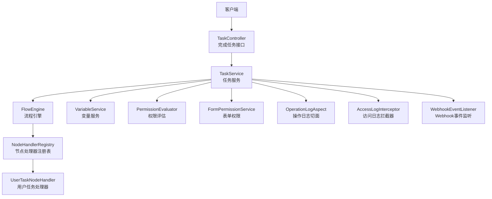
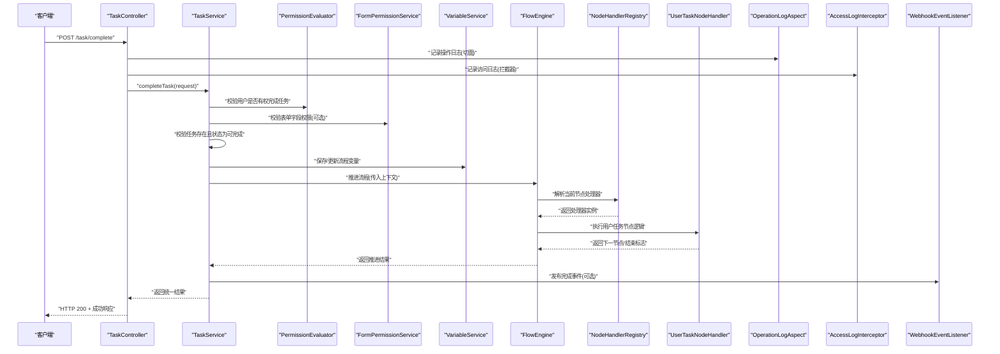
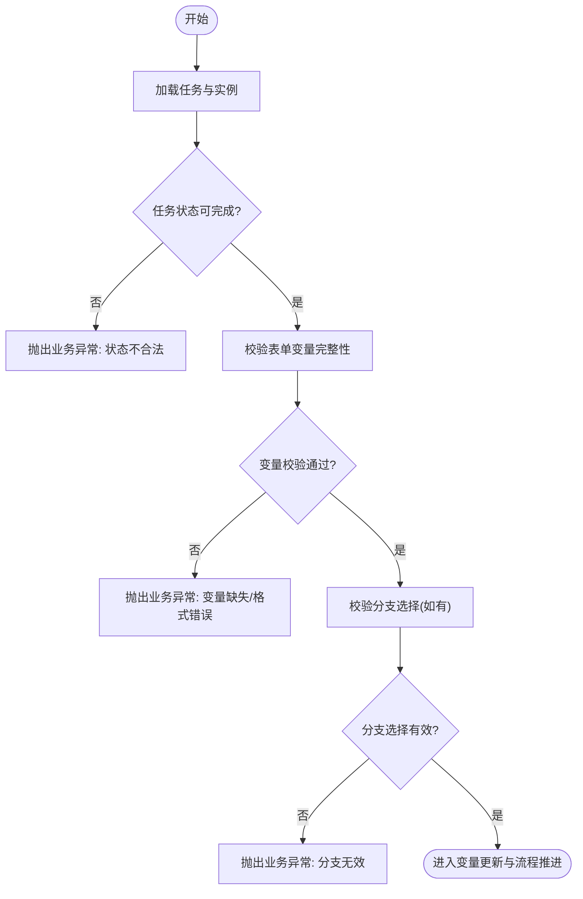
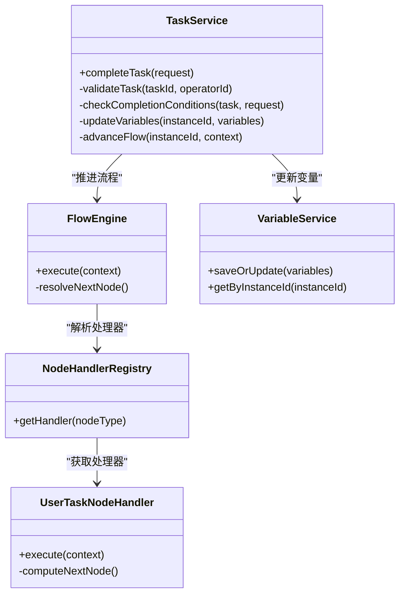
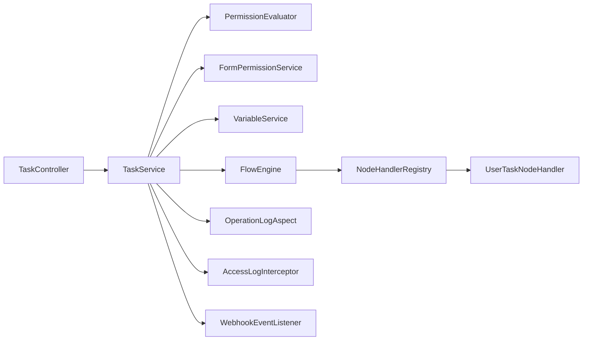

# 完成任务处理

<cite>
**本文引用的文件**   
- [TaskController.java](file://flow-engine/src/main/java/com/flow/engine/controller/TaskController.java)
- [CompleteTaskRequest.java](file://flow-engine/src/main/java/com/flow/engine/dto/CompleteTaskRequest.java)
- [TaskService.java](file://flow-engine/src/main/java/com/flow/engine/service/TaskService.java)
- [ProcessInstanceService.java](file://flow-engine/src/main/java/com/flow/engine/service/ProcessInstanceService.java)
- [VariableService.java](file://flow-engine/src/main/java/com/flow/engine/service/VariableService.java)
- [FlowEngine.java](file://flow-engine/src/main/java/com/flow/engine/engine/FlowEngine.java)
- [NodeHandlerRegistry.java](file://flow-engine/src/main/java/com/flow/engine/node/NodeHandlerRegistry.java)
- [UserTaskNodeHandler.java](file://flow-engine/src/main/java/com/flow/engine/node/impl/UserTaskNodeHandler.java)
- [TaskStatus.java](file://flow-engine/src/main/java/com/flow/engine/common/enums/TaskStatus.java)
- [Task.java](file://flow-engine/src/main/java/com/flow/engine/entity/Task.java)
- [ProcessInstance.java](file://flow-engine/src/main/java/com/flow/engine/entity/ProcessInstance.java)
- [Variable.java](file://flow-engine/src/main/java/com/flow/engine/entity/Variable.java)
- [GlobalExceptionHandler.java](file://flow-engine/src/main/java/com/flow/engine/common/GlobalExceptionHandler.java)
- [Result.java](file://flow-engine/src/main/java/com/flow/engine/common/Result.java)
- [ErrorCode.java](file://flow-engine/src/main/java/com/flow/engine/common/ErrorCode.java)
- [BusinessException.java](file://flow-engine/src/main/java/com/flow/engine/common/BusinessException.java)
- [OperationLogAspect.java](file://flow-engine/src/main/java/com/flow/engine/aspect/OperationLogAspect.java)
- [AccessLogInterceptor.java](file://flow-engine/src/main/java/com/flow/engine/interceptor/AccessLogInterceptor.java)
- [WebhookEventListener.java](file://flow-engine/src/main/java/com/flow/engine/listener/WebhookEventListener.java)
- [PermissionEvaluator.java](file://flow-engine/src/main/java/com/flow/engine/service/PermissionEvaluator.java)
- [FormPermissionService.java](file://flow-engine/src/main/java/com/flow/engine/service/FormPermissionService.java)
</cite>

## 目录
1. [简介](#简介)
2. [项目结构](#项目结构)
3. [核心组件](#核心组件)
4. [架构总览](#架构总览)
5. [详细组件分析](#详细组件分析)
6. [依赖关系分析](#依赖关系分析)
7. [性能考虑](#性能考虑)
8. [故障排查指南](#故障排查指南)
9. [结论](#结论)
10. [附录](#附录)

## 简介
本文件聚焦“完成任务”的业务实现，围绕任务状态校验、完成条件检查、变量更新与流程推进机制进行系统化说明。文档同时覆盖 CompleteTaskRequest 请求对象的结构与使用规则、完成后节点跳转与事件触发、日志记录、权限验证与数据访问控制，并提供 API 调用示例（成功与异常）以及性能优化建议与最佳实践。

## 项目结构
与“完成任务”相关的后端代码主要位于 flow-engine 模块中，采用分层架构：
- 控制器层：接收 HTTP 请求并做基础参数校验
- 服务层：编排业务逻辑，协调引擎、实体与外部能力
- 引擎层：驱动流程执行、节点调度与流转
- 持久化层：通过 Mapper 操作数据库实体
- 横切关注点：全局异常处理、操作审计日志、访问日志拦截器、权限评估等

图表来源
- [TaskController.java](file://flow-engine/src/main/java/com/flow/engine/controller/TaskController.java)
- [TaskService.java](file://flow-engine/src/main/java/com/flow/engine/service/TaskService.java)
- [FlowEngine.java](file://flow-engine/src/main/java/com/flow/engine/engine/FlowEngine.java)
- [NodeHandlerRegistry.java](file://flow-engine/src/main/java/com/flow/engine/node/NodeHandlerRegistry.java)
- [UserTaskNodeHandler.java](file://flow-engine/src/main/java/com/flow/engine/node/impl/UserTaskNodeHandler.java)
- [OperationLogAspect.java](file://flow-engine/src/main/java/com/flow/engine/aspect/OperationLogAspect.java)
- [AccessLogInterceptor.java](file://flow-engine/src/main/java/com/flow/engine/interceptor/AccessLogInterceptor.java)
- [WebhookEventListener.java](file://flow-engine/src/main/java/com/flow/engine/listener/WebhookEventListener.java)

章节来源
- [TaskController.java](file://flow-engine/src/main/java/com/flow/engine/controller/TaskController.java)
- [TaskService.java](file://flow-engine/src/main/java/com/flow/engine/service/TaskService.java)
- [FlowEngine.java](file://flow-engine/src/main/java/com/flow/engine/engine/FlowEngine.java)

## 核心组件
- TaskController：暴露完成任务的 REST 接口，负责入参绑定与基础校验，返回统一结果封装。
- CompleteTaskRequest：完成任务的请求体，包含任务标识、可选的表单变量、分支选择、备注等信息。
- TaskService：完成任务的核心编排，包括权限校验、任务状态校验、完成条件检查、变量更新、引擎推进、事件与日志落盘。
- FlowEngine：流程引擎入口，负责根据当前节点类型与配置推进流程，计算下一节点或结束流程。
- NodeHandlerRegistry / UserTaskNodeHandler：节点处理器注册与用户任务节点的具体执行逻辑。
- VariableService：流程变量的读写与版本管理。
- PermissionEvaluator / FormPermissionService：权限评估与表单字段级权限控制。
- OperationLogAspect / AccessLogInterceptor：操作审计与访问日志记录。
- GlobalExceptionHandler / Result / ErrorCode / BusinessException：统一异常与响应模型。

章节来源
- [CompleteTaskRequest.java](file://flow-engine/src/main/java/com/flow/engine/dto/CompleteTaskRequest.java)
- [TaskService.java](file://flow-engine/src/main/java/com/flow/engine/service/TaskService.java)
- [FlowEngine.java](file://flow-engine/src/main/java/com/flow/engine/engine/FlowEngine.java)
- [NodeHandlerRegistry.java](file://flow-engine/src/main/java/com/flow/engine/node/NodeHandlerRegistry.java)
- [UserTaskNodeHandler.java](file://flow-engine/src/main/java/com/flow/engine/node/impl/UserTaskNodeHandler.java)
- [VariableService.java](file://flow-engine/src/main/java/com/flow/engine/service/VariableService.java)
- [PermissionEvaluator.java](file://flow-engine/src/main/java/com/flow/engine/service/PermissionEvaluator.java)
- [FormPermissionService.java](file://flow-engine/src/main/java/com/flow/engine/service/FormPermissionService.java)
- [OperationLogAspect.java](file://flow-engine/src/main/java/com/flow/engine/aspect/OperationLogAspect.java)
- [AccessLogInterceptor.java](file://flow-engine/src/main/java/com/flow/engine/interceptor/AccessLogInterceptor.java)
- [GlobalExceptionHandler.java](file://flow-engine/src/main/java/com/flow/engine/common/GlobalExceptionHandler.java)
- [Result.java](file://flow-engine/src/main/java/com/flow/engine/common/Result.java)
- [ErrorCode.java](file://flow-engine/src/main/java/com/flow/engine/common/ErrorCode.java)
- [BusinessException.java](file://flow-engine/src/main/java/com/flow/engine/common/BusinessException.java)

## 架构总览
完成任务的整体时序如下：客户端发起完成任务请求，控制器将请求转发至服务层；服务层进行权限与任务状态校验，随后更新变量并调用引擎推进流程；引擎根据节点类型与表达式计算下一节点或结束流程；完成后触发事件与日志记录，最终返回统一响应。

图表来源
- [TaskController.java](file://flow-engine/src/main/java/com/flow/engine/controller/TaskController.java)
- [TaskService.java](file://flow-engine/src/main/java/com/flow/engine/service/TaskService.java)
- [PermissionEvaluator.java](file://flow-engine/src/main/java/com/flow/engine/service/PermissionEvaluator.java)
- [FormPermissionService.java](file://flow-engine/src/main/java/com/flow/engine/service/FormPermissionService.java)
- [VariableService.java](file://flow-engine/src/main/java/com/flow/engine/service/VariableService.java)
- [FlowEngine.java](file://flow-engine/src/main/java/com/flow/engine/engine/FlowEngine.java)
- [NodeHandlerRegistry.java](file://flow-engine/src/main/java/com/flow/engine/node/NodeHandlerRegistry.java)
- [UserTaskNodeHandler.java](file://flow-engine/src/main/java/com/flow/engine/node/impl/UserTaskNodeHandler.java)
- [OperationLogAspect.java](file://flow-engine/src/main/java/com/flow/engine/aspect/OperationLogAspect.java)
- [AccessLogInterceptor.java](file://flow-engine/src/main/java/com/flow/engine/interceptor/AccessLogInterceptor.java)
- [WebhookEventListener.java](file://flow-engine/src/main/java/com/flow/engine/listener/WebhookEventListener.java)

## 详细组件分析

### 请求对象：CompleteTaskRequest
- 作用：承载完成任务所需的全部输入信息。
- 必填参数：
  - 任务标识：用于定位待完成任务。
  - 发起人/操作人标识：用于权限校验与审计。
- 可选参数：
  - 表单变量：键值对形式的流程变量集合，支持字符串、数值、布尔等常见类型。
  - 分支选择：当用户任务后接排他网关时，用于决定后续路径。
  - 备注/意见：用于审计与追溯。
- 业务规则：
  - 任务必须存在且处于可完成状态。
  - 若定义要求提交表单变量，则对应字段需满足非空与格式约束。
  - 分支选择仅在目标节点为网关且需要显式选择时有效。
  - 操作人必须具备该任务的办理权限。

章节来源
- [CompleteTaskRequest.java](file://flow-engine/src/main/java/com/flow/engine/dto/CompleteTaskRequest.java)

### 任务状态验证与完成条件检查
- 任务状态验证：
  - 仅允许从“待办/已分配”等可完成状态进入“已完成”。
  - 防止重复完成与非法状态迁移。
- 完成条件检查：
  - 校验必填表单变量是否齐全。
  - 校验分支选择是否与网关出口匹配。
  - 校验业务前置条件（如金额阈值、审批层级等，由具体节点处理器或表达式决定）。

图表来源
- [TaskService.java](file://flow-engine/src/main/java/com/flow/engine/service/TaskService.java)
- [TaskStatus.java](file://flow-engine/src/main/java/com/flow/engine/common/enums/TaskStatus.java)
- [UserTaskNodeHandler.java](file://flow-engine/src/main/java/com/flow/engine/node/impl/UserTaskNodeHandler.java)

章节来源
- [TaskService.java](file://flow-engine/src/main/java/com/flow/engine/service/TaskService.java)
- [TaskStatus.java](file://flow-engine/src/main/java/com/flow/engine/common/enums/TaskStatus.java)

### 变量更新与流程推进机制
- 变量更新：
  - 将请求中的表单变量合并到流程变量存储，支持覆盖与追加策略。
  - 记录变量变更历史，便于审计与回溯。
- 流程推进：
  - 调用引擎推进，引擎解析当前节点处理器并执行相应逻辑。
  - 对于用户任务节点，处理器会依据分支选择与表达式计算下一节点。
  - 若到达结束节点，则标记流程实例为完成。

图表来源
- [TaskService.java](file://flow-engine/src/main/java/com/flow/engine/service/TaskService.java)
- [FlowEngine.java](file://flow-engine/src/main/java/com/flow/engine/engine/FlowEngine.java)
- [NodeHandlerRegistry.java](file://flow-engine/src/main/java/com/flow/engine/node/NodeHandlerRegistry.java)
- [UserTaskNodeHandler.java](file://flow-engine/src/main/java/com/flow/engine/node/impl/UserTaskNodeHandler.java)
- [VariableService.java](file://flow-engine/src/main/java/com/flow/engine/service/VariableService.java)

章节来源
- [TaskService.java](file://flow-engine/src/main/java/com/flow/engine/service/TaskService.java)
- [FlowEngine.java](file://flow-engine/src/main/java/com/flow/engine/engine/FlowEngine.java)
- [NodeHandlerRegistry.java](file://flow-engine/src/main/java/com/flow/engine/node/NodeHandlerRegistry.java)
- [UserTaskNodeHandler.java](file://flow-engine/src/main/java/com/flow/engine/node/impl/UserTaskNodeHandler.java)
- [VariableService.java](file://flow-engine/src/main/java/com/flow/engine/service/VariableService.java)

### 权限验证机制与数据访问控制
- 权限评估：
  - 基于用户角色、岗位与数据范围判断是否具备完成任务的权限。
  - 支持三员管理与细粒度权限控制。
- 表单权限：
  - 针对表单字段级别的可读/可写权限进行校验，避免越权修改。
- 数据访问控制：
  - 在查询任务与实例时附加数据范围过滤，确保仅能访问授权范围内的数据。

章节来源
- [PermissionEvaluator.java](file://flow-engine/src/main/java/com/flow/engine/service/PermissionEvaluator.java)
- [FormPermissionService.java](file://flow-engine/src/main/java/com/flow/engine/service/FormPermissionService.java)
- [TaskService.java](file://flow-engine/src/main/java/com/flow/engine/service/TaskService.java)

### 后续操作：节点跳转、事件触发、日志记录
- 节点跳转：
  - 引擎根据处理器计算下一节点，创建新的任务或推进到并行/包容网关。
- 事件触发：
  - 完成事件发布，供 Webhook 监听器或其他订阅者消费。
- 日志记录：
  - 操作日志切面记录关键业务动作。
  - 访问日志拦截器记录请求元数据与耗时。

章节来源
- [FlowEngine.java](file://flow-engine/src/main/java/com/flow/engine/engine/FlowEngine.java)
- [UserTaskNodeHandler.java](file://flow-engine/src/main/java/com/flow/engine/node/impl/UserTaskNodeHandler.java)
- [WebhookEventListener.java](file://flow-engine/src/main/java/com/flow/engine/listener/WebhookEventListener.java)
- [OperationLogAspect.java](file://flow-engine/src/main/java/com/flow/engine/aspect/OperationLogAspect.java)
- [AccessLogInterceptor.java](file://flow-engine/src/main/java/com/flow/engine/interceptor/AccessLogInterceptor.java)

### API 调用示例与异常处理
- 成功场景：
  - 请求：POST /task/complete，携带任务标识、操作人标识与表单变量。
  - 响应：统一结果封装，包含状态码、消息与数据（如新任务列表或流程实例状态）。
- 异常情况：
  - 任务不存在或状态不合法：返回业务异常码与提示。
  - 表单变量缺失或格式错误：返回参数校验失败。
  - 分支选择无效：返回业务异常。
  - 权限不足：返回未授权或无权限。
  - 系统异常：由全局异常处理器捕获并返回标准错误响应。

章节来源
- [TaskController.java](file://flow-engine/src/main/java/com/flow/engine/controller/TaskController.java)
- [GlobalExceptionHandler.java](file://flow-engine/src/main/java/com/flow/engine/common/GlobalExceptionHandler.java)
- [Result.java](file://flow-engine/src/main/java/com/flow/engine/common/Result.java)
- [ErrorCode.java](file://flow-engine/src/main/java/com/flow/engine/common/ErrorCode.java)
- [BusinessException.java](file://flow-engine/src/main/java/com/flow/engine/common/BusinessException.java)

## 依赖关系分析
完成任务的关键依赖如下：
- TaskController 依赖 TaskService 进行业务编排。
- TaskService 依赖权限评估、表单权限、变量服务与流程引擎。
- FlowEngine 依赖节点处理器注册表与具体处理器（如用户任务处理器）。
- 横切组件（日志、异常、权限）贯穿整个调用链。

图表来源
- [TaskController.java](file://flow-engine/src/main/java/com/flow/engine/controller/TaskController.java)
- [TaskService.java](file://flow-engine/src/main/java/com/flow/engine/service/TaskService.java)
- [FlowEngine.java](file://flow-engine/src/main/java/com/flow/engine/engine/FlowEngine.java)
- [NodeHandlerRegistry.java](file://flow-engine/src/main/java/com/flow/engine/node/NodeHandlerRegistry.java)
- [UserTaskNodeHandler.java](file://flow-engine/src/main/java/com/flow/engine/node/impl/UserTaskNodeHandler.java)
- [PermissionEvaluator.java](file://flow-engine/src/main/java/com/flow/engine/service/PermissionEvaluator.java)
- [FormPermissionService.java](file://flow-engine/src/main/java/com/flow/engine/service/FormPermissionService.java)
- [VariableService.java](file://flow-engine/src/main/java/com/flow/engine/service/VariableService.java)
- [OperationLogAspect.java](file://flow-engine/src/main/java/com/flow/engine/aspect/OperationLogAspect.java)
- [AccessLogInterceptor.java](file://flow-engine/src/main/java/com/flow/engine/interceptor/AccessLogInterceptor.java)
- [WebhookEventListener.java](file://flow-engine/src/main/java/com/flow/engine/listener/WebhookEventListener.java)

章节来源
- [TaskController.java](file://flow-engine/src/main/java/com/flow/engine/controller/TaskController.java)
- [TaskService.java](file://flow-engine/src/main/java/com/flow/engine/service/TaskService.java)
- [FlowEngine.java](file://flow-engine/src/main/java/com/flow/engine/engine/FlowEngine.java)

## 性能考虑
- 批量变量更新：尽量在一次事务内完成变量写入，减少往返开销。
- 缓存热点数据：对频繁读取的流程定义、节点配置与权限信息进行缓存。
- 异步事件：将 Webhook 通知等非关键路径操作异步化，降低主链路延迟。
- 索引优化：为任务、实例与变量表的常用查询字段建立合适索引。
- 幂等性：对完成任务接口提供幂等保护，避免重复提交导致的状态不一致。
- 限流与熔断：在高并发场景下对完成任务接口实施限流与熔断策略。

[本节为通用性能指导，无需特定文件引用]

## 故障排查指南
- 常见问题定位：
  - 任务状态异常：检查任务当前状态是否为可完成，查看状态枚举与迁移规则。
  - 变量校验失败：核对表单变量是否完整、类型是否正确。
  - 分支选择无效：确认网关出口与选择的分支名称一致。
  - 权限不足：检查用户角色、岗位与数据范围配置。
- 日志与监控：
  - 操作日志：通过操作日志切面记录关键步骤，便于回溯。
  - 访问日志：通过访问日志拦截器记录请求详情与耗时。
  - 全局异常：统一异常处理器输出标准化错误信息。

章节来源
- [TaskStatus.java](file://flow-engine/src/main/java/com/flow/engine/common/enums/TaskStatus.java)
- [OperationLogAspect.java](file://flow-engine/src/main/java/com/flow/engine/aspect/OperationLogAspect.java)
- [AccessLogInterceptor.java](file://flow-engine/src/main/java/com/flow/engine/interceptor/AccessLogInterceptor.java)
- [GlobalExceptionHandler.java](file://flow-engine/src/main/java/com/flow/engine/common/GlobalExceptionHandler.java)

## 结论
完成任务处理涉及多层次的协作：权限校验、任务状态与完成条件检查、变量更新、引擎推进、事件与日志记录。通过清晰的职责划分与统一的异常与响应模型，系统具备良好的可维护性与可扩展性。结合性能优化与最佳实践，可在高并发与复杂流程场景下保持稳定与高效。

[本节为总结性内容，无需特定文件引用]

## 附录
- 相关实体与枚举：
  - 任务实体：用于持久化任务信息与状态。
  - 流程实例实体：用于跟踪流程生命周期。
  - 变量实体：用于存储流程变量及其版本。
  - 任务状态枚举：定义任务各状态及迁移规则。

章节来源
- [Task.java](file://flow-engine/src/main/java/com/flow/engine/entity/Task.java)
- [ProcessInstance.java](file://flow-engine/src/main/java/com/flow/engine/entity/ProcessInstance.java)
- [Variable.java](file://flow-engine/src/main/java/com/flow/engine/entity/Variable.java)
- [TaskStatus.java](file://flow-engine/src/main/java/com/flow/engine/common/enums/TaskStatus.java)