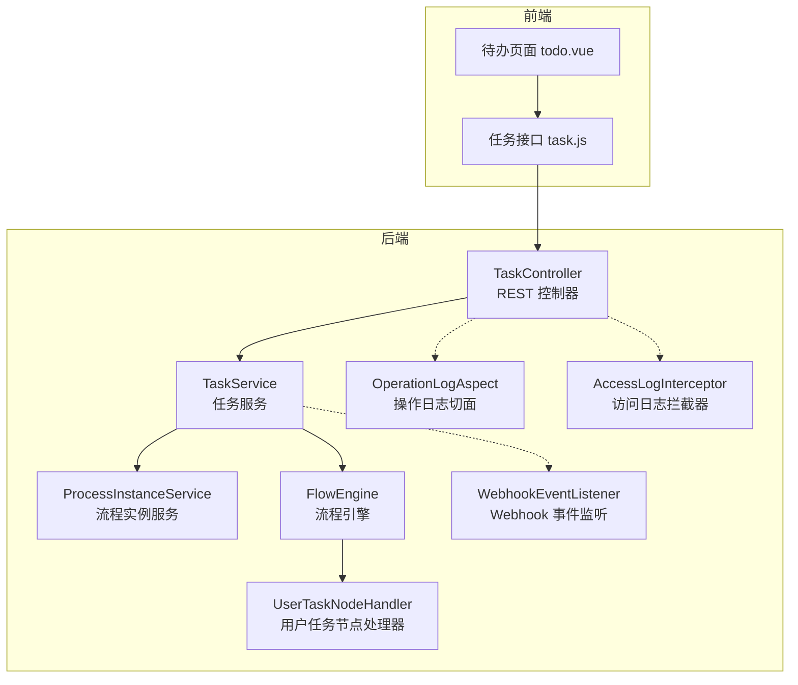
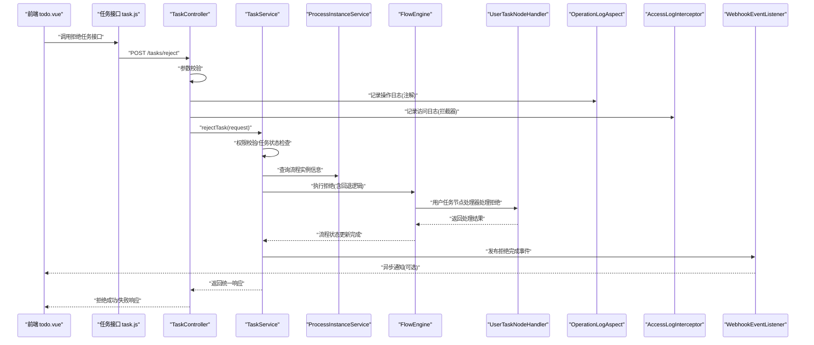
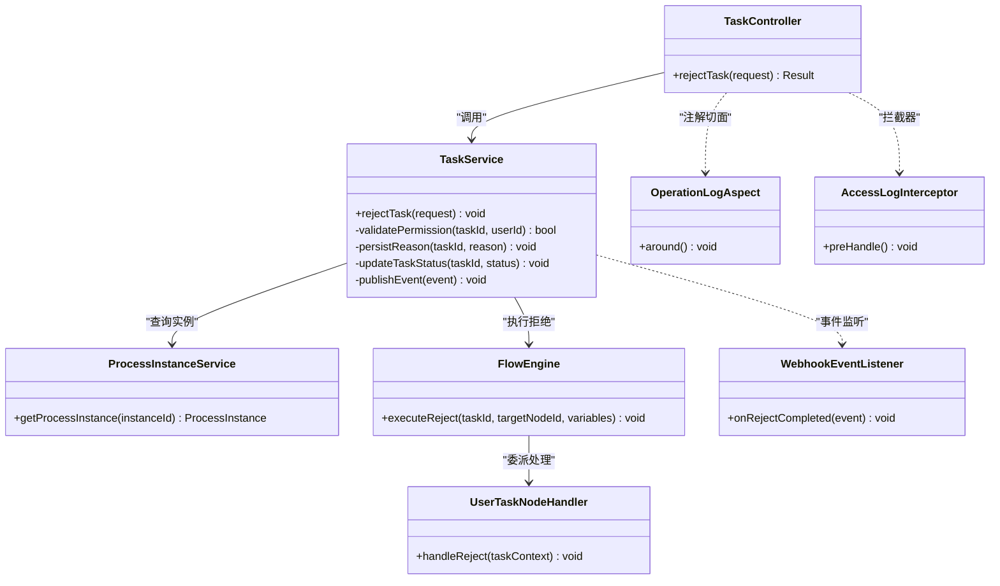

# 拒绝任务处理

<cite>
**本文引用的文件**   
- [RejectTaskRequest.java](file://flow-engine/src/main/java/com/flow/engine/dto/RejectTaskRequest.java)
- [TaskController.java](file://flow-engine/src/main/java/com/flow/engine/controller/TaskController.java)
- [TaskService.java](file://flow-engine/src/main/java/com/flow/engine/service/TaskService.java)
- [ProcessInstanceService.java](file://flow-engine/src/main/java/com/flow/engine/service/ProcessInstanceService.java)
- [FlowEngine.java](file://flow-engine/src/main/java/com/flow/engine/engine/FlowEngine.java)
- [UserTaskNodeHandler.java](file://flow-engine/src/main/java/com/flow/engine/node/impl/UserTaskNodeHandler.java)
- [TaskStatus.java](file://flow-engine/src/main/java/com/flow/engine/common/enums/TaskStatus.java)
- [ProcessStatus.java](file://flow-engine/src/main/java/com/flow/engine/common/enums/ProcessStatus.java)
- [OperationLogAspect.java](file://flow-engine/src/main/java/com/flow/engine/aspect/OperationLogAspect.java)
- [OpLog.java](file://flow-engine/src/main/java/com/flow/engine/annotation/OpLog.java)
- [AccessLogInterceptor.java](file://flow-engine/src/main/java/com/flow/engine/interceptor/AccessLogInterceptor.java)
- [WebhookEventListener.java](file://flow-engine/src/main/java/com/flow/engine/listener/WebhookEventListener.java)
- [schema.sql](file://flow-engine/src/main/resources/db/schema.sql)
- [task.js](file://flow-web/src/api/task.js)
- [todo.vue](file://flow-web/src/views/task/todo.vue)
</cite>

## 目录
1. [简介](#简介)
2. [项目结构](#项目结构)
3. [核心组件](#核心组件)
4. [架构总览](#架构总览)
5. [详细组件分析](#详细组件分析)
6. [依赖关系分析](#依赖关系分析)
7. [性能考虑](#性能考虑)
8. [故障排查指南](#故障排查指南)
9. [结论](#结论)
10. [附录](#附录)

## 简介
本文件围绕“拒绝任务”这一关键业务流程，系统化阐述其业务规则、实现逻辑与前后端集成要点。内容覆盖：
- 拒绝原因记录（格式、校验、存储）
- 流程回退机制（状态变更、历史维护）
- 异常分支处理（幂等、并发、事务一致性）
- 请求对象 RejectTaskRequest 的字段定义与使用场景
- 对流程实例的影响（状态流转、审计追踪、通知）
- 前端集成示例与错误处理策略
- 审批流相关约束与权限控制
- 合规性要求与审计追踪实现

## 项目结构
后端采用分层架构：控制器层暴露 REST API，服务层编排业务逻辑，引擎层驱动流程执行，节点处理器负责用户任务的具体动作；同时通过切面与拦截器完成操作日志与访问日志采集，并通过事件监听器触发外部通知。

图表来源
- [TaskController.java](file://flow-engine/src/main/java/com/flow/engine/controller/TaskController.java)
- [TaskService.java](file://flow-engine/src/main/java/com/flow/engine/service/TaskService.java)
- [ProcessInstanceService.java](file://flow-engine/src/main/java/com/flow/engine/service/ProcessInstanceService.java)
- [FlowEngine.java](file://flow-engine/src/main/java/com/flow/engine/engine/FlowEngine.java)
- [UserTaskNodeHandler.java](file://flow-engine/src/main/java/com/flow/engine/node/impl/UserTaskNodeHandler.java)
- [OperationLogAspect.java](file://flow-engine/src/main/java/com/flow/engine/aspect/OperationLogAspect.java)
- [AccessLogInterceptor.java](file://flow-engine/src/main/java/com/flow/engine/interceptor/AccessLogInterceptor.java)
- [WebhookEventListener.java](file://flow-engine/src/main/java/com/flow/engine/listener/WebhookEventListener.java)

章节来源
- [TaskController.java](file://flow-engine/src/main/java/com/flow/engine/controller/TaskController.java)
- [TaskService.java](file://flow-engine/src/main/java/com/flow/engine/service/TaskService.java)
- [FlowEngine.java](file://flow-engine/src/main/java/com/flow/engine/engine/FlowEngine.java)
- [UserTaskNodeHandler.java](file://flow-engine/src/main/java/com/flow/engine/node/impl/UserTaskNodeHandler.java)
- [OperationLogAspect.java](file://flow-engine/src/main/java/com/flow/engine/aspect/OperationLogAspect.java)
- [AccessLogInterceptor.java](file://flow-engine/src/main/java/com/flow/engine/interceptor/AccessLogInterceptor.java)
- [WebhookEventListener.java](file://flow-engine/src/main/java/com/flow/engine/listener/WebhookEventListener.java)

## 核心组件
- 请求对象：RejectTaskRequest，承载拒绝操作的输入参数，包括任务标识、拒绝原因、可选的回退目标节点或变量等。
- 控制器：TaskController，提供拒绝任务的 REST 接口，进行基础参数校验并委托服务层处理。
- 服务层：TaskService，封装拒绝任务的核心业务逻辑，包括权限校验、任务状态检查、拒绝原因持久化、流程回退与状态更新、审计与通知。
- 引擎层：FlowEngine，驱动流程状态机与节点执行，协调用户任务节点处理器完成回退与后续节点推进。
- 节点处理器：UserTaskNodeHandler，处理用户任务相关的动作（如拒绝），负责将拒绝结果写入任务与流程上下文。
- 枚举类型：TaskStatus、ProcessStatus，用于表示任务与流程的状态值，确保状态机转换的合法性。
- 审计与通知：OperationLogAspect、AccessLogInterceptor、WebhookEventListener，分别负责操作日志、访问日志与外部通知。

章节来源
- [RejectTaskRequest.java](file://flow-engine/src/main/java/com/flow/engine/dto/RejectTaskRequest.java)
- [TaskController.java](file://flow-engine/src/main/java/com/flow/engine/controller/TaskController.java)
- [TaskService.java](file://flow-engine/src/main/java/com/flow/engine/service/TaskService.java)
- [FlowEngine.java](file://flow-engine/src/main/java/com/flow/engine/engine/FlowEngine.java)
- [UserTaskNodeHandler.java](file://flow-engine/src/main/java/com/flow/engine/node/impl/UserTaskNodeHandler.java)
- [TaskStatus.java](file://flow-engine/src/main/java/com/flow/engine/common/enums/TaskStatus.java)
- [ProcessStatus.java](file://flow-engine/src/main/java/com/flow/engine/common/enums/ProcessStatus.java)
- [OperationLogAspect.java](file://flow-engine/src/main/java/com/flow/engine/aspect/OperationLogAspect.java)
- [AccessLogInterceptor.java](file://flow-engine/src/main/java/com/flow/engine/interceptor/AccessLogInterceptor.java)
- [WebhookEventListener.java](file://flow-engine/src/main/java/com/flow/engine/listener/WebhookEventListener.java)

## 架构总览
下图展示了从前端发起拒绝任务到后端处理、引擎执行、状态更新与通知发送的整体时序。

图表来源
- [TaskController.java](file://flow-engine/src/main/java/com/flow/engine/controller/TaskController.java)
- [TaskService.java](file://flow-engine/src/main/java/com/flow/engine/service/TaskService.java)
- [ProcessInstanceService.java](file://flow-engine/src/main/java/com/flow/engine/service/ProcessInstanceService.java)
- [FlowEngine.java](file://flow-engine/src/main/java/com/flow/engine/engine/FlowEngine.java)
- [UserTaskNodeHandler.java](file://flow-engine/src/main/java/com/flow/engine/node/impl/UserTaskNodeHandler.java)
- [OperationLogAspect.java](file://flow-engine/src/main/java/com/flow/engine/aspect/OperationLogAspect.java)
- [AccessLogInterceptor.java](file://flow-engine/src/main/java/com/flow/engine/interceptor/AccessLogInterceptor.java)
- [WebhookEventListener.java](file://flow-engine/src/main/java/com/flow/engine/listener/WebhookEventListener.java)

## 详细组件分析

### 请求对象 RejectTaskRequest 字段定义与使用场景
- 关键字段建议
  - taskId：当前被拒绝的任务标识，必填。
  - reason：拒绝原因，必填；支持文本与结构化数据混合，需进行长度与敏感词过滤。
  - targetNodeId：可选，指定回退的目标节点标识；若为空则按默认回退策略执行。
  - variables：可选，附带流程变量，用于在回退路径上设置新的计算条件或表单数据。
  - comment：可选，附加说明，便于审计与追溯。
- 使用场景
  - 常规拒绝：仅填写 reason，系统按默认回退策略处理。
  - 定向回退：指定 targetNodeId，将流程实例回退至该节点继续流转。
  - 带变量拒绝：在拒绝的同时更新流程变量，影响后续网关分支或条件判断。
- 格式化与存储
  - 原因格式化：服务端对 reason 进行标准化（去除多余空白、转义特殊字符、限制最大长度）。
  - 存储方式：拒绝原因持久化至任务历史与操作日志表，必要时以 JSON 形式存入扩展字段，便于检索与展示。

章节来源
- [RejectTaskRequest.java](file://flow-engine/src/main/java/com/flow/engine/dto/RejectTaskRequest.java)
- [schema.sql](file://flow-engine/src/main/resources/db/schema.sql)

### 控制器 TaskController 的职责与校验
- 职责
  - 接收拒绝任务请求，进行基础参数校验（非空、格式、长度）。
  - 委托 TaskService 执行业务逻辑。
  - 统一响应包装与异常映射。
- 校验与错误处理
  - 对 taskId、reason 进行必填校验。
  - 对 reason 进行长度与非法字符校验。
  - 对 targetNodeId 进行存在性与可达性校验（若提供）。
- 审计与日志
  - 通过 @OpLog 注解与 OperationLogAspect 切面记录操作日志。
  - AccessLogInterceptor 记录访问日志，包含请求 ID、用户、时间戳等。

章节来源
- [TaskController.java](file://flow-engine/src/main/java/com/flow/engine/controller/TaskController.java)
- [OpLog.java](file://flow-engine/src/main/java/com/flow/engine/annotation/OpLog.java)
- [OperationLogAspect.java](file://flow-engine/src/main/java/com/flow/engine/aspect/OperationLogAspect.java)
- [AccessLogInterceptor.java](file://flow-engine/src/main/java/com/flow/engine/interceptor/AccessLogInterceptor.java)

### 服务层 TaskService 的业务编排
- 权限校验
  - 校验当前用户是否拥有拒绝该任务的权限（基于角色/数据权限）。
- 任务状态检查
  - 确认任务处于可拒绝状态（例如“进行中”），防止重复拒绝或越权操作。
- 拒绝原因持久化
  - 将格式化后的拒绝原因写入任务历史与操作日志。
- 流程回退与状态更新
  - 根据 targetNodeId 与 variables 计算回退路径，调用 FlowEngine 执行拒绝动作。
  - 更新任务状态为“已拒绝”，并根据回退结果更新流程实例状态。
- 通知与事件
  - 发布拒绝完成事件，由 WebhookEventListener 触发外部通知（如邮件、消息队列）。
- 异常分支处理
  - 针对无效任务、无权限、回退目标不可达、引擎执行失败等情况，抛出明确错误码并回滚事务。

章节来源
- [TaskService.java](file://flow-engine/src/main/java/com/flow/engine/service/TaskService.java)
- [FlowEngine.java](file://flow-engine/src/main/java/com/flow/engine/engine/FlowEngine.java)
- [WebhookEventListener.java](file://flow-engine/src/main/java/com/flow/engine/listener/WebhookEventListener.java)

### 引擎层 FlowEngine 与用户任务节点处理器
- FlowEngine
  - 负责流程状态机的转换与节点执行调度。
  - 在拒绝场景中，依据回退策略与变量计算决定下一节点。
- UserTaskNodeHandler
  - 处理用户任务的动作（如拒绝），将拒绝结果写入任务上下文与历史。
  - 与 FlowEngine 协作，完成状态更新与后续节点推进。

章节来源
- [FlowEngine.java](file://flow-engine/src/main/java/com/flow/engine/engine/FlowEngine.java)
- [UserTaskNodeHandler.java](file://flow-engine/src/main/java/com/flow/engine/node/impl/UserTaskNodeHandler.java)

### 状态机与枚举
- TaskStatus
  - 定义任务状态（如“待处理”、“进行中”、“已完成”、“已拒绝”等），确保拒绝动作的合法性。
- ProcessStatus
  - 定义流程实例状态（如“运行中”、“已结束”、“已回退”等），反映拒绝后的整体流程状态。

章节来源
- [TaskStatus.java](file://flow-engine/src/main/java/com/flow/engine/common/enums/TaskStatus.java)
- [ProcessStatus.java](file://flow-engine/src/main/java/com/flow/engine/common/enums/ProcessStatus.java)

### 审计追踪与合规性
- 操作日志
  - 通过 @OpLog 与 OperationLogAspect 记录拒绝操作的详细信息（操作人、时间、参数、结果）。
- 访问日志
  - AccessLogInterceptor 记录 HTTP 访问日志，便于问题定位与合规审计。
- 数据存储
  - schema.sql 定义任务、流程实例、操作日志等表结构，确保拒绝原因与审计数据的持久化与可追溯。

章节来源
- [OpLog.java](file://flow-engine/src/main/java/com/flow/engine/annotation/OpLog.java)
- [OperationLogAspect.java](file://flow-engine/src/main/java/com/flow/engine/aspect/OperationLogAspect.java)
- [AccessLogInterceptor.java](file://flow-engine/src/main/java/com/flow/engine/interceptor/AccessLogInterceptor.java)
- [schema.sql](file://flow-engine/src/main/resources/db/schema.sql)

### 前端集成示例与错误处理策略
- 接口调用
  - 在 task.js 中封装拒绝任务接口，提交 RejectTaskRequest 参数。
- 页面交互
  - 在 todo.vue 中提供拒绝按钮与原因输入框，调用接口并展示结果。
- 错误处理
  - 统一错误码映射，提示用户具体失败原因（如“无权限拒绝”、“任务状态不允许拒绝”）。
  - 网络异常重试与友好提示。

章节来源
- [task.js](file://flow-web/src/api/task.js)
- [todo.vue](file://flow-web/src/views/task/todo.vue)

## 依赖关系分析

图表来源
- [TaskController.java](file://flow-engine/src/main/java/com/flow/engine/controller/TaskController.java)
- [TaskService.java](file://flow-engine/src/main/java/com/flow/engine/service/TaskService.java)
- [ProcessInstanceService.java](file://flow-engine/src/main/java/com/flow/engine/service/ProcessInstanceService.java)
- [FlowEngine.java](file://flow-engine/src/main/java/com/flow/engine/engine/FlowEngine.java)
- [UserTaskNodeHandler.java](file://flow-engine/src/main/java/com/flow/engine/node/impl/UserTaskNodeHandler.java)
- [OperationLogAspect.java](file://flow-engine/src/main/java/com/flow/engine/aspect/OperationLogAspect.java)
- [AccessLogInterceptor.java](file://flow-engine/src/main/java/com/flow/engine/interceptor/AccessLogInterceptor.java)
- [WebhookEventListener.java](file://flow-engine/src/main/java/com/flow/engine/listener/WebhookEventListener.java)

章节来源
- [TaskController.java](file://flow-engine/src/main/java/com/flow/engine/controller/TaskController.java)
- [TaskService.java](file://flow-engine/src/main/java/com/flow/engine/service/TaskService.java)
- [FlowEngine.java](file://flow-engine/src/main/java/com/flow/engine/engine/FlowEngine.java)
- [UserTaskNodeHandler.java](file://flow-engine/src/main/java/com/flow/engine/node/impl/UserTaskNodeHandler.java)
- [OperationLogAspect.java](file://flow-engine/src/main/java/com/flow/engine/aspect/OperationLogAspect.java)
- [AccessLogInterceptor.java](file://flow-engine/src/main/java/com/flow/engine/interceptor/AccessLogInterceptor.java)
- [WebhookEventListener.java](file://flow-engine/src/main/java/com/flow/engine/listener/WebhookEventListener.java)

## 性能考虑
- 拒绝原因持久化应批量写入或异步落库，避免阻塞主流程。
- 权限校验与任务状态检查应缓存热点数据，减少数据库压力。
- 回退路径计算与变量解析应避免复杂表达式，必要时预编译或缓存。
- 通知发送采用异步事件模型，降低接口响应时间。

[本节为通用性能建议，不直接分析具体文件]

## 故障排查指南
- 常见错误
  - 任务不存在或状态不允许拒绝：检查 TaskStatus 与权限。
  - 回退目标节点不可达：校验 targetNodeId 与流程定义。
  - 拒绝原因超长或包含非法字符：检查 reason 校验规则。
- 日志定位
  - 查看 OperationLogAspect 记录的操作日志，确认拒绝参数与结果。
  - 查看 AccessLogInterceptor 的访问日志，定位请求链路。
- 事件与通知
  - 检查 WebhookEventListener 是否收到拒绝完成事件，确认外部通知是否发送成功。

章节来源
- [OperationLogAspect.java](file://flow-engine/src/main/java/com/flow/engine/aspect/OperationLogAspect.java)
- [AccessLogInterceptor.java](file://flow-engine/src/main/java/com/flow/engine/interceptor/AccessLogInterceptor.java)
- [WebhookEventListener.java](file://flow-engine/src/main/java/com/flow/engine/listener/WebhookEventListener.java)

## 结论
拒绝任务处理是审批流中的关键分支，涉及严格的权限控制、状态机转换、审计追踪与通知机制。通过合理的请求对象设计、清晰的服务编排与健壮的异常处理，能够确保拒绝操作的准确性与可追溯性。前端集成应注重用户体验与错误提示，配合后端的审计与监控，满足合规性要求。

[本节为总结性内容，不直接分析具体文件]

## 附录
- 数据库表结构参考
  - 任务表、流程实例表、操作日志表等定义见 schema.sql。
- 前端接口封装
  - 参考 task.js 中的拒绝任务接口封装与错误处理。

章节来源
- [schema.sql](file://flow-engine/src/main/resources/db/schema.sql)
- [task.js](file://flow-web/src/api/task.js)