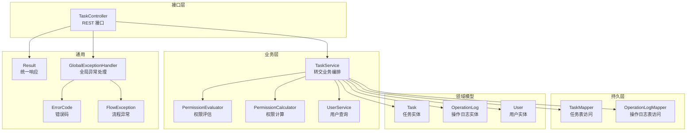
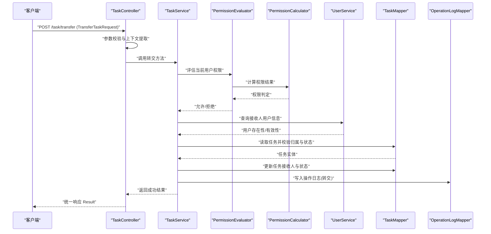
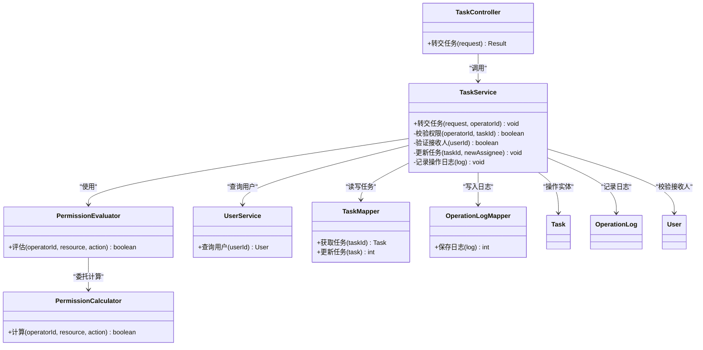

# 转交任务处理

<cite>
**本文引用的文件**   
- [TransferTaskRequest.java](file://flow-engine/src/main/java/com/flow/engine/dto/TransferTaskRequest.java)
- [TaskController.java](file://flow-engine/src/main/java/com/flow/engine/controller/TaskController.java)
- [TaskService.java](file://flow-engine/src/main/java/com/flow/engine/service/TaskService.java)
- [Task.java](file://flow-engine/src/main/java/com/flow/engine/entity/Task.java)
- [TaskMapper.java](file://flow-engine/src/main/java/com/flow/engine/mapper/TaskMapper.java)
- [OperationLog.java](file://flow-engine/src/main/java/com/flow/engine/entity/OperationLog.java)
- [OperationLogMapper.java](file://flow-engine/src/main/java/com/flow/engine/mapper/OperationLogMapper.java)
- [User.java](file://flow-engine/src/main/java/com/flow/engine/entity/User.java)
- [UserService.java](file://flow-engine/src/main/java/com/flow/engine/service/UserService.java)
- [PermissionEvaluator.java](file://flow-engine/src/main/java/com/flow/engine/service/PermissionEvaluator.java)
- [PermissionCalculator.java](file://flow-engine/src/main/java/com/flow/engine/service/PermissionCalculator.java)
- [GlobalExceptionHandler.java](file://flow-engine/src/main/java/com/flow/engine/common/GlobalExceptionHandler.java)
- [ErrorCode.java](file://flow-engine/src/main/java/com/flow/engine/common/ErrorCode.java)
- [FlowException.java](file://flow-engine/src/main/java/com/flow/engine/common/exception/FlowException.java)
- [Result.java](file://flow-engine/src/main/java/com/flow/engine/common/Result.java)
- [TaskApiTest.java](file://flow-engine/src/test/java/com/flow/engine/controller/TaskApiTest.java)
</cite>

## 目录
1. [简介](#简介)
2. [项目结构](#项目结构)
3. [核心组件](#核心组件)
4. [架构总览](#架构总览)
5. [详细组件分析](#详细组件分析)
6. [依赖关系分析](#依赖关系分析)
7. [性能与并发考虑](#性能与并发考虑)
8. [故障排查指南](#故障排查指南)
9. [结论](#结论)
10. [附录：API 使用示例](#附录api-使用示例)

## 简介
本文件围绕“任务转交”能力，系统性阐述业务逻辑与技术实现。重点覆盖以下方面：
- 目标用户验证、权限检查与任务重新分配机制
- TransferTaskRequest 请求参数结构与校验规则（接收人信息、转交原因、备注）
- 转交操作对任务状态的影响及历史记录维护方式
- 并发控制与数据一致性保证策略
- 完整的 API 使用示例与异常处理方案
- 转交权限控制策略与审计日志记录方式

## 项目结构
与“任务转交”相关的后端代码主要位于 flow-engine 模块中，涉及控制器、服务层、实体、映射器、DTO、异常与结果封装等。前端调用通过 REST API 完成，测试用例提供了端到端的使用参考。

图表来源
- [TaskController.java](file://flow-engine/src/main/java/com/flow/engine/controller/TaskController.java)
- [TaskService.java](file://flow-engine/src/main/java/com/flow/engine/service/TaskService.java)
- [PermissionEvaluator.java](file://flow-engine/src/main/java/com/flow/engine/service/PermissionEvaluator.java)
- [PermissionCalculator.java](file://flow-engine/src/main/java/com/flow/engine/service/PermissionCalculator.java)
- [UserService.java](file://flow-engine/src/main/java/com/flow/engine/service/UserService.java)
- [TaskMapper.java](file://flow-engine/src/main/java/com/flow/engine/mapper/TaskMapper.java)
- [OperationLogMapper.java](file://flow-engine/src/main/java/com/flow/engine/mapper/OperationLogMapper.java)
- [Task.java](file://flow-engine/src/main/java/com/flow/engine/entity/Task.java)
- [OperationLog.java](file://flow-engine/src/main/java/com/flow/engine/entity/OperationLog.java)
- [User.java](file://flow-engine/src/main/java/com/flow/engine/entity/User.java)
- [Result.java](file://flow-engine/src/main/java/com/flow/engine/common/Result.java)
- [GlobalExceptionHandler.java](file://flow-engine/src/main/java/com/flow/engine/common/GlobalExceptionHandler.java)
- [ErrorCode.java](file://flow-engine/src/main/java/com/flow/engine/common/ErrorCode.java)
- [FlowException.java](file://flow-engine/src/main/java/com/flow/engine/common/exception/FlowException.java)

章节来源
- [TaskController.java](file://flow-engine/src/main/java/com/flow/engine/controller/TaskController.java)
- [TaskService.java](file://flow-engine/src/main/java/com/flow/engine/service/TaskService.java)
- [TransferTaskRequest.java](file://flow-engine/src/main/java/com/flow/engine/dto/TransferTaskRequest.java)

## 核心组件
- TaskController：暴露任务相关 REST 接口，包括任务转交入口。负责参数绑定、基础校验与返回统一响应。
- TaskService：实现任务转交的核心编排逻辑，包含目标用户验证、权限检查、任务重新分配、状态更新与审计日志落库。
- PermissionEvaluator / PermissionCalculator：提供权限评估与计算能力，用于判断当前用户是否具备转交权限。
- UserService：提供用户信息查询能力，用于验证接收人有效性。
- TaskMapper / OperationLogMapper：分别负责任务与操作日志的持久化访问。
- DTO/Entity：TransferTaskRequest 为转交请求体；Task、OperationLog、User 为领域实体。
- 通用组件：Result 统一响应封装；GlobalExceptionHandler 集中处理异常；ErrorCode 定义错误码；FlowException 表示业务异常。

章节来源
- [TaskController.java](file://flow-engine/src/main/java/com/flow/engine/controller/TaskController.java)
- [TaskService.java](file://flow-engine/src/main/java/com/flow/engine/service/TaskService.java)
- [PermissionEvaluator.java](file://flow-engine/src/main/java/com/flow/engine/service/PermissionEvaluator.java)
- [PermissionCalculator.java](file://flow-engine/src/main/java/com/flow/engine/service/PermissionCalculator.java)
- [UserService.java](file://flow-engine/src/main/java/com/flow/engine/service/UserService.java)
- [TaskMapper.java](file://flow-engine/src/main/java/com/flow/engine/mapper/TaskMapper.java)
- [OperationLogMapper.java](file://flow-engine/src/main/java/com/flow/engine/mapper/OperationLogMapper.java)
- [TransferTaskRequest.java](file://flow-engine/src/main/java/com/flow/engine/dto/TransferTaskRequest.java)
- [Task.java](file://flow-engine/src/main/java/com/flow/engine/entity/Task.java)
- [OperationLog.java](file://flow-engine/src/main/java/com/flow/engine/entity/OperationLog.java)
- [User.java](file://flow-engine/src/main/java/com/flow/engine/entity/User.java)
- [Result.java](file://flow-engine/src/main/java/com/flow/engine/common/Result.java)
- [GlobalExceptionHandler.java](file://flow-engine/src/main/java/com/flow/engine/common/GlobalExceptionHandler.java)
- [ErrorCode.java](file://flow-engine/src/main/java/com/flow/engine/common/ErrorCode.java)
- [FlowException.java](file://flow-engine/src/main/java/com/flow/engine/common/exception/FlowException.java)

## 架构总览
下图展示了从 HTTP 请求到数据库写入的完整调用链，以及权限与审计的关键节点。

图表来源
- [TaskController.java](file://flow-engine/src/main/java/com/flow/engine/controller/TaskController.java)
- [TaskService.java](file://flow-engine/src/main/java/com/flow/engine/service/TaskService.java)
- [PermissionEvaluator.java](file://flow-engine/src/main/java/com/flow/engine/service/PermissionEvaluator.java)
- [PermissionCalculator.java](file://flow-engine/src/main/java/com/flow/engine/service/PermissionCalculator.java)
- [UserService.java](file://flow-engine/src/main/java/com/flow/engine/service/UserService.java)
- [TaskMapper.java](file://flow-engine/src/main/java/com/flow/engine/mapper/TaskMapper.java)
- [OperationLogMapper.java](file://flow-engine/src/main/java/com/flow/engine/mapper/OperationLogMapper.java)

## 详细组件分析

### 请求模型：TransferTaskRequest
- 字段语义
  - 任务标识：用于定位待转交的任务
  - 接收人标识：目标用户的唯一标识
  - 转交原因：可选的业务说明
  - 备注信息：可选的补充说明
- 校验规则
  - 必填项：任务标识、接收人标识
  - 格式约束：接收人标识需符合系统用户体系规范
  - 长度限制：转交原因与备注建议设置合理上限，避免过大负载
- 数据来源与上下文
  - 当前操作用户由安全上下文注入
  - 接收人有效性由用户服务校验

章节来源
- [TransferTaskRequest.java](file://flow-engine/src/main/java/com/flow/engine/dto/TransferTaskRequest.java)

### 控制器：TaskController
- 职责
  - 暴露任务转交 REST 接口
  - 解析并校验请求体
  - 调用服务层执行转交
  - 返回统一响应 Result
- 关键点
  - 参数校验失败时返回明确的错误码
  - 将业务异常交由全局异常处理器统一处理

章节来源
- [TaskController.java](file://flow-engine/src/main/java/com/flow/engine/controller/TaskController.java)
- [Result.java](file://flow-engine/src/main/java/com/flow/engine/common/Result.java)

### 服务层：TaskService（转交编排）
- 核心步骤
  1) 权限检查：基于当前用户与任务上下文，调用权限评估器与计算器进行判定
  2) 目标用户验证：根据接收人标识查询用户，确保用户有效且可被指派
  3) 任务加载与校验：按任务标识加载任务，校验任务归属、当前状态是否允许转交
  4) 任务重新分配：更新任务的接收人及相关状态字段
  5) 审计日志：记录转交操作详情（操作人、时间、原因、备注、前后状态等）
  6) 事务提交：上述写操作在事务内完成，保证一致性
- 并发与一致性
  - 采用乐观锁或行级锁防止重复转交
  - 在事务边界内完成状态变更与日志落库
- 异常处理
  - 对非法状态、无权限、目标用户不存在等情况抛出 FlowException
  - 由全局异常处理器转换为标准错误响应

章节来源
- [TaskService.java](file://flow-engine/src/main/java/com/flow/engine/service/TaskService.java)
- [PermissionEvaluator.java](file://flow-engine/src/main/java/com/flow/engine/service/PermissionEvaluator.java)
- [PermissionCalculator.java](file://flow-engine/src/main/java/com/flow/engine/service/PermissionCalculator.java)
- [UserService.java](file://flow-engine/src/main/java/com/flow/engine/service/UserService.java)
- [TaskMapper.java](file://flow-engine/src/main/java/com/flow/engine/mapper/TaskMapper.java)
- [OperationLogMapper.java](file://flow-engine/src/main/java/com/flow/engine/mapper/OperationLogMapper.java)
- [FlowException.java](file://flow-engine/src/main/java/com/flow/engine/common/exception/FlowException.java)

### 权限控制：PermissionEvaluator / PermissionCalculator
- 权限评估维度
  - 当前用户是否为任务当前处理人或流程发起人
  - 是否拥有“转交任务”的系统级权限
  - 目标用户是否在允许范围内（如部门、角色等策略）
- 计算策略
  - 基于角色、资源与动作三元组进行决策
  - 支持扩展自定义策略（例如白名单、黑名单）

章节来源
- [PermissionEvaluator.java](file://flow-engine/src/main/java/com/flow/engine/service/PermissionEvaluator.java)
- [PermissionCalculator.java](file://flow-engine/src/main/java/com/flow/engine/service/PermissionCalculator.java)

### 数据模型：Task / OperationLog / User
- Task
  - 关键字段：任务标识、流程实例标识、节点标识、当前处理人、状态、创建/更新时间等
  - 转交影响：更新处理人、必要时更新状态（如保持待办但更换责任人）
- OperationLog
  - 关键字段：操作类型、操作人、操作时间、关联对象、操作内容摘要、扩展信息等
  - 转交记录：记录转交原因与备注，便于审计追溯
- User
  - 关键字段：用户标识、姓名、部门、角色等，用于接收人有效性校验

章节来源
- [Task.java](file://flow-engine/src/main/java/com/flow/engine/entity/Task.java)
- [OperationLog.java](file://flow-engine/src/main/java/com/flow/engine/entity/OperationLog.java)
- [User.java](file://flow-engine/src/main/java/com/flow/engine/entity/User.java)

### 异常与错误码：GlobalExceptionHandler / ErrorCode / FlowException
- 统一异常处理
  - 捕获业务异常并转换为标准错误响应
  - 记录关键错误上下文，便于问题定位
- 错误码设计
  - 针对“无权限”、“任务不存在”、“目标用户无效”、“任务状态不允许转交”等场景定义明确错误码

章节来源
- [GlobalExceptionHandler.java](file://flow-engine/src/main/java/com/flow/engine/common/GlobalExceptionHandler.java)
- [ErrorCode.java](file://flow-engine/src/main/java/com/flow/engine/common/ErrorCode.java)
- [FlowException.java](file://flow-engine/src/main/java/com/flow/engine/common/exception/FlowException.java)

## 依赖关系分析
- 控制器依赖服务层，服务层组合权限、用户、任务与日志的访问能力
- 权限评估与计算解耦，便于扩展新的权限策略
- 持久层通过 Mapper 抽象数据库访问，降低耦合度

图表来源
- [TaskController.java](file://flow-engine/src/main/java/com/flow/engine/controller/TaskController.java)
- [TaskService.java](file://flow-engine/src/main/java/com/flow/engine/service/TaskService.java)
- [PermissionEvaluator.java](file://flow-engine/src/main/java/com/flow/engine/service/PermissionEvaluator.java)
- [PermissionCalculator.java](file://flow-engine/src/main/java/com/flow/engine/service/PermissionCalculator.java)
- [UserService.java](file://flow-engine/src/main/java/com/flow/engine/service/UserService.java)
- [TaskMapper.java](file://flow-engine/src/main/java/com/flow/engine/mapper/TaskMapper.java)
- [OperationLogMapper.java](file://flow-engine/src/main/java/com/flow/engine/mapper/OperationLogMapper.java)
- [Task.java](file://flow-engine/src/main/java/com/flow/engine/entity/Task.java)
- [OperationLog.java](file://flow-engine/src/main/java/com/flow/engine/entity/OperationLog.java)
- [User.java](file://flow-engine/src/main/java/com/flow/engine/entity/User.java)

## 性能与并发考虑
- 并发控制
  - 使用行级锁或乐观锁版本字段，避免同一任务被多次转交
  - 在事务内完成状态更新与日志写入，确保原子性
- 性能优化
  - 仅查询必要字段，减少 I/O
  - 对高频查询的用户信息进行缓存（注意失效策略）
  - 批量操作时合并日志写入，降低磁盘压力
- 一致性保障
  - 事务回滚：任一环节失败均回滚，保证任务与日志一致
  - 幂等性：对相同转交请求进行去重（基于任务ID+接收人+时间窗口）

[本节为通用指导，不直接分析具体文件]

## 故障排查指南
- 常见错误
  - 无权限：检查当前用户角色与资源权限配置
  - 任务不存在：确认任务ID是否正确，流程实例是否已终止
  - 目标用户无效：确认用户是否存在且处于可用状态
  - 任务状态不允许转交：检查任务当前状态是否符合转交条件
- 定位手段
  - 查看全局异常处理器的错误码与消息
  - 检索操作日志，核对转交前后的状态变化
  - 结合请求链路 ID 追踪调用栈

章节来源
- [GlobalExceptionHandler.java](file://flow-engine/src/main/java/com/flow/engine/common/GlobalExceptionHandler.java)
- [ErrorCode.java](file://flow-engine/src/main/java/com/flow/engine/common/ErrorCode.java)
- [FlowException.java](file://flow-engine/src/main/java/com/flow/engine/common/exception/FlowException.java)
- [OperationLog.java](file://flow-engine/src/main/java/com/flow/engine/entity/OperationLog.java)

## 结论
任务转交是流程协作中的关键能力。通过清晰的权限评估、严格的用户验证、可靠的任务重新分配与完善的审计日志，系统在易用性与安全性之间取得平衡。配合合理的并发控制与一致性策略，可在高并发场景下稳定运行。

[本节为总结性内容，不直接分析具体文件]

## 附录：API 使用示例
- 接口路径与方法
  - POST /task/transfer
- 请求体（TransferTaskRequest）
  - 必填字段：任务标识、接收人标识
  - 可选字段：转交原因、备注信息
- 成功响应
  - 统一响应 Result，包含操作结果与消息
- 失败响应
  - 统一响应 Result，包含错误码与错误描述
- 示例（概念性）
  - 请求：{ "taskId": "T001", "assigneeId": "U002", "reason": "请假交接", "remark": "请优先处理" }
  - 成功：{ "code": "0", "message": "转交成功", "data": null }
  - 失败：{ "code": "E403", "message": "无转交权限", "data": null }

章节来源
- [TaskController.java](file://flow-engine/src/main/java/com/flow/engine/controller/TaskController.java)
- [TransferTaskRequest.java](file://flow-engine/src/main/java/com/flow/engine/dto/TransferTaskRequest.java)
- [Result.java](file://flow-engine/src/main/java/com/flow/engine/common/Result.java)
- [TaskApiTest.java](file://flow-engine/src/test/java/com/flow/engine/controller/TaskApiTest.java)