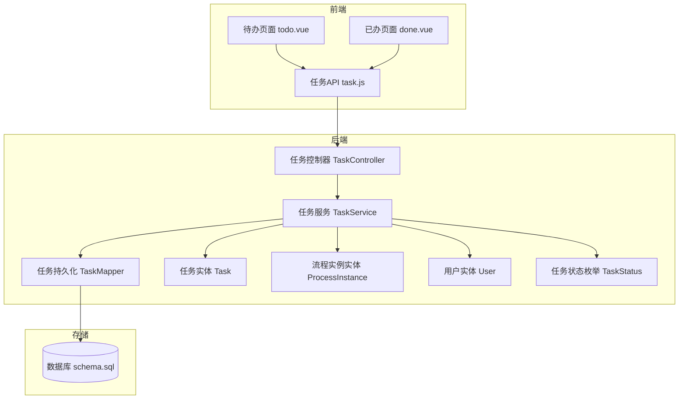
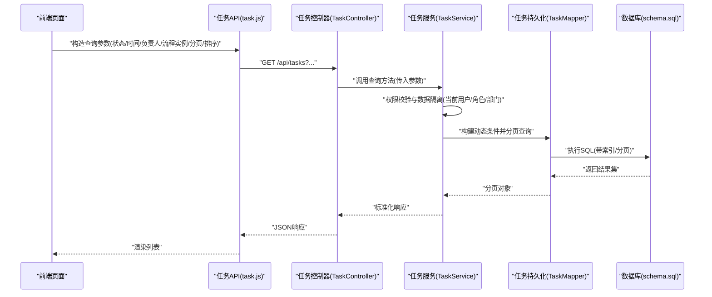
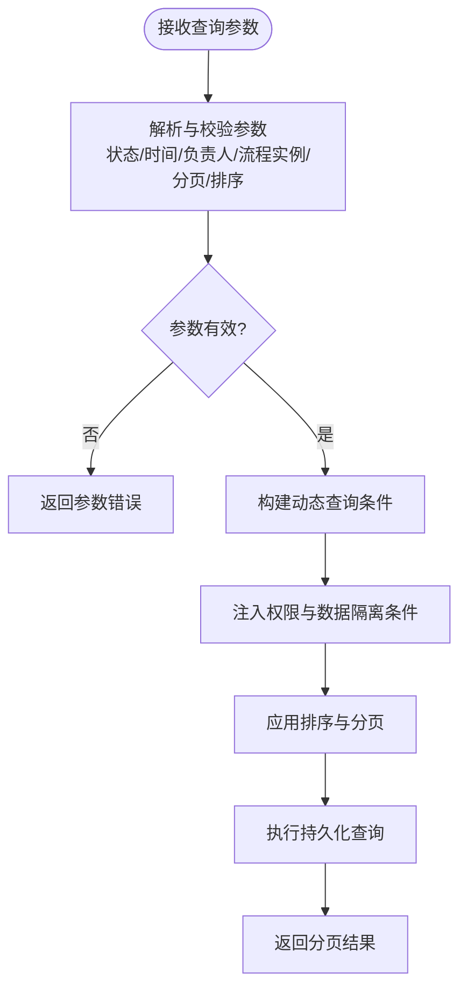
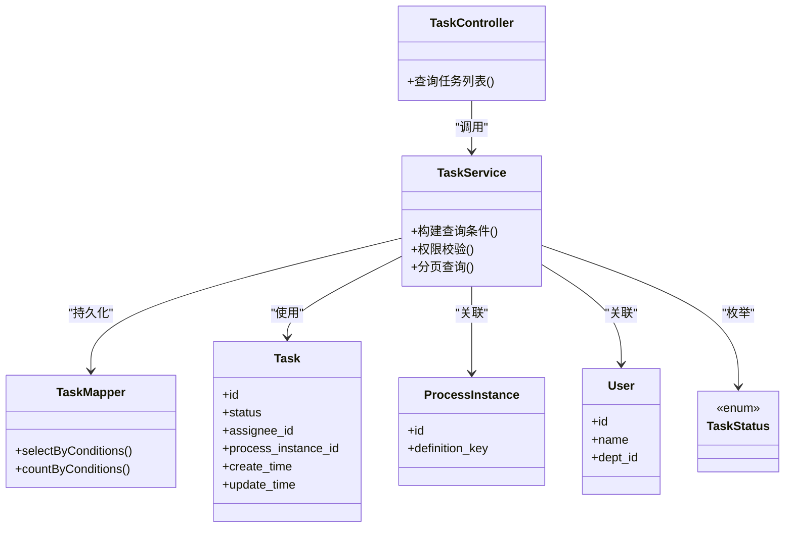

# 任务查询筛选

<cite>
**本文引用的文件**   
- [TaskController.java](file://flow-engine/src/main/java/com/flow/engine/controller/TaskController.java)
- [TaskService.java](file://flow-engine/src/main/java/com/flow/engine/service/TaskService.java)
- [TaskMapper.java](file://flow-engine/src/main/java/com/flow/engine/mapper/TaskMapper.java)
- [Task.java](file://flow-engine/src/main/java/com/flow/engine/entity/Task.java)
- [ProcessInstance.java](file://flow-engine/src/main/java/com/flow/engine/entity/ProcessInstance.java)
- [User.java](file://flow-engine/src/main/java/com/flow/engine/entity/User.java)
- [TaskStatus.java](file://flow-engine/src/main/java/com/flow/engine/common/enums/TaskStatus.java)
- [TaskApiTest.java](file://flow-engine/src/test/java/com/flow/engine/controller/TaskApiTest.java)
- [task.js](file://flow-web/src/api/task.js)
- [todo.vue](file://flow-web/src/views/task/todo.vue)
- [done.vue](file://flow-web/src/views/task/done.vue)
- [application.yml](file://flow-engine/src/main/resources/application.yml)
- [schema.sql](file://flow-engine/src/main/resources/db/schema.sql)
</cite>

## 目录
1. [简介](#简介)
2. [项目结构](#项目结构)
3. [核心组件](#核心组件)
4. [架构总览](#架构总览)
5. [详细组件分析](#详细组件分析)
6. [依赖关系分析](#依赖关系分析)
7. [性能考虑](#性能考虑)
8. [故障排查指南](#故障排查指南)
9. [结论](#结论)
10. [附录](#附录)

## 简介
本文件围绕“任务查询筛选”能力，系统化说明以下方面：
- 查询维度与组合条件：按状态、时间范围、负责人、流程实例等多条件组合查询。
- 复杂查询条件的构建与解析逻辑：前端参数到后端查询条件的映射与校验。
- 查询API接口文档与使用示例：REST接口定义、请求/响应结构与调用示例。
- 排序与统计：结果排序策略与基础统计能力。
- 权限控制与数据隔离：基于用户、角色与数据权限的访问控制。
- 性能优化策略：索引设计、分页查询、缓存机制等。

## 项目结构
任务查询筛选功能涉及前后端协作：
- 前端（flow-web）提供任务待办/已办页面，封装任务查询API并渲染列表。
- 后端（flow-engine）提供任务控制器、服务层与数据访问层，实现多条件查询、分页、排序与权限校验。
- 数据库（schema.sql）定义任务、流程实例、用户等实体及索引。

图表来源
- [TaskController.java](file://flow-engine/src/main/java/com/flow/engine/controller/TaskController.java)
- [TaskService.java](file://flow-engine/src/main/java/com/flow/engine/service/TaskService.java)
- [TaskMapper.java](file://flow-engine/src/main/java/com/flow/engine/mapper/TaskMapper.java)
- [Task.java](file://flow-engine/src/main/java/com/flow/engine/entity/Task.java)
- [ProcessInstance.java](file://flow-engine/src/main/java/com/flow/engine/entity/ProcessInstance.java)
- [User.java](file://flow-engine/src/main/java/com/flow/engine/entity/User.java)
- [TaskStatus.java](file://flow-engine/src/main/java/com/flow/engine/common/enums/TaskStatus.java)
- [task.js](file://flow-web/src/api/task.js)
- [todo.vue](file://flow-web/src/views/task/todo.vue)
- [done.vue](file://flow-web/src/views/task/done.vue)
- [schema.sql](file://flow-engine/src/main/resources/db/schema.sql)

章节来源
- [TaskController.java](file://flow-engine/src/main/java/com/flow/engine/controller/TaskController.java)
- [TaskService.java](file://flow-engine/src/main/java/com/flow/engine/service/TaskService.java)
- [TaskMapper.java](file://flow-engine/src/main/java/com/flow/engine/mapper/TaskMapper.java)
- [Task.java](file://flow-engine/src/main/java/com/flow/engine/entity/Task.java)
- [ProcessInstance.java](file://flow-engine/src/main/java/com/flow/engine/entity/ProcessInstance.java)
- [User.java](file://flow-engine/src/main/java/com/flow/engine/entity/User.java)
- [TaskStatus.java](file://flow-engine/src/main/java/com/flow/engine/common/enums/TaskStatus.java)
- [task.js](file://flow-web/src/api/task.js)
- [todo.vue](file://flow-web/src/views/task/todo.vue)
- [done.vue](file://flow-web/src/views/task/done.vue)
- [schema.sql](file://flow-engine/src/main/resources/db/schema.sql)

## 核心组件
- 任务控制器：暴露任务查询相关HTTP接口，负责参数接收、校验与返回统一响应。
- 任务服务：封装业务规则，包括多条件查询构建、权限校验、分页与排序处理。
- 任务持久化：通过MyBatis-Plus或自定义SQL完成复杂条件查询与分页。
- 实体与枚举：任务、流程实例、用户实体以及任务状态枚举用于约束与映射。
- 前端API与页面：封装查询参数、发起请求、展示结果与交互。

章节来源
- [TaskController.java](file://flow-engine/src/main/java/com/flow/engine/controller/TaskController.java)
- [TaskService.java](file://flow-engine/src/main/java/com/flow/engine/service/TaskService.java)
- [TaskMapper.java](file://flow-engine/src/main/java/com/flow/engine/mapper/TaskMapper.java)
- [Task.java](file://flow-engine/src/main/java/com/flow/engine/entity/Task.java)
- [ProcessInstance.java](file://flow-engine/src/main/java/com/flow/engine/entity/ProcessInstance.java)
- [User.java](file://flow-engine/src/main/java/com/flow/engine/entity/User.java)
- [TaskStatus.java](file://flow-engine/src/main/java/com/flow/engine/common/enums/TaskStatus.java)
- [task.js](file://flow-web/src/api/task.js)
- [todo.vue](file://flow-web/src/views/task/todo.vue)
- [done.vue](file://flow-web/src/views/task/done.vue)

## 架构总览
任务查询从前端发起，经控制器进入服务层进行条件组装与权限校验，再交由持久层执行查询，最终返回分页结果。

图表来源
- [TaskController.java](file://flow-engine/src/main/java/com/flow/engine/controller/TaskController.java)
- [TaskService.java](file://flow-engine/src/main/java/com/flow/engine/service/TaskService.java)
- [TaskMapper.java](file://flow-engine/src/main/java/com/flow/engine/mapper/TaskMapper.java)
- [schema.sql](file://flow-engine/src/main/resources/db/schema.sql)

## 详细组件分析

### 查询维度与组合条件
- 状态筛选：支持按任务状态过滤，如待处理、已完成、已拒绝等，来源于任务状态枚举。
- 时间范围：支持创建时间、开始时间、结束时间的区间筛选。
- 负责人：支持按任务负责人ID或用户名筛选。
- 流程实例：支持按流程实例ID、流程定义名称或关键字筛选。
- 其他常见维度：任务标题关键词、优先级、是否加签、是否转派等。
- 组合查询：上述条件可任意组合，空值条件将被忽略；当存在冲突条件时以服务端校验为准。

章节来源
- [TaskStatus.java](file://flow-engine/src/main/java/com/flow/engine/common/enums/TaskStatus.java)
- [Task.java](file://flow-engine/src/main/java/com/flow/engine/entity/Task.java)
- [ProcessInstance.java](file://flow-engine/src/main/java/com/flow/engine/entity/ProcessInstance.java)
- [User.java](file://flow-engine/src/main/java/com/flow/engine/entity/User.java)

### 复杂查询条件的构建与解析逻辑
- 前端参数解析：将URL查询参数转换为结构化查询对象，对时间范围进行起止边界校验，对状态值进行白名单校验。
- 动态条件拼装：在服务层根据非空条件动态拼接查询条件，避免全表扫描。
- 权限注入：自动附加当前用户可见的数据范围（如本人任务、本部门任务、授权可见的流程实例）。
- 排序与分页：默认按创建时间倒序，支持按更新时间、优先级等字段排序；分页参数限制最大页大小。

图表来源
- [TaskController.java](file://flow-engine/src/main/java/com/flow/engine/controller/TaskController.java)
- [TaskService.java](file://flow-engine/src/main/java/com/flow/engine/service/TaskService.java)
- [TaskMapper.java](file://flow-engine/src/main/java/com/flow/engine/mapper/TaskMapper.java)

章节来源
- [TaskController.java](file://flow-engine/src/main/java/com/flow/engine/controller/TaskController.java)
- [TaskService.java](file://flow-engine/src/main/java/com/flow/engine/service/TaskService.java)
- [TaskMapper.java](file://flow-engine/src/main/java/com/flow/engine/mapper/TaskMapper.java)

### 查询API接口文档
- 接口路径：GET /api/tasks
- 认证方式：需携带登录态（如JWT），由全局拦截器校验。
- 请求参数（Query）：
  - status: 任务状态（可选，枚举值来自任务状态枚举）
  - startTime: 起始时间（可选，ISO格式）
  - endTime: 结束时间（可选，ISO格式）
  - assigneeId: 负责人ID（可选）
  - assigneeName: 负责人姓名（可选）
  - processInstanceId: 流程实例ID（可选）
  - processDefinitionKey: 流程定义标识（可选）
  - keyword: 关键词（可选，匹配任务标题或备注）
  - page: 页码（默认1）
  - size: 每页条数（默认20，上限受配置限制）
  - sortBy: 排序字段（默认create_time）
  - sortOrder: 排序方向（asc/desc，默认desc）
- 响应体：
  - code: 状态码
  - message: 消息
  - data: 分页对象，包含records列表与总数、页码、每页大小等

使用示例（前端调用）：
- 在待办页面中，根据当前用户上下文构造查询参数，调用任务API获取待办列表。
- 在已办页面中，增加已完成状态过滤与时间范围筛选。

章节来源
- [TaskController.java](file://flow-engine/src/main/java/com/flow/engine/controller/TaskController.java)
- [task.js](file://flow-web/src/api/task.js)
- [todo.vue](file://flow-web/src/views/task/todo.vue)
- [done.vue](file://flow-web/src/views/task/done.vue)

### 排序与统计
- 排序：支持按创建时间、更新时间、优先级等字段排序，默认按创建时间倒序。
- 统计：可在服务层扩展统计接口，例如按状态分组计数、按负责人分组计数、按流程实例分组计数等。
- 分页：采用数据库分页，避免一次性加载大量数据。

章节来源
- [TaskService.java](file://flow-engine/src/main/java/com/flow/engine/service/TaskService.java)
- [TaskMapper.java](file://flow-engine/src/main/java/com/flow/engine/mapper/TaskMapper.java)

### 权限控制与数据隔离
- 用户级隔离：仅返回当前用户作为负责人的任务。
- 组织级隔离：允许查看本部门或授权部门的任务（依据角色与部门关系）。
- 流程级隔离：仅返回用户有权限访问的流程实例下的任务。
- 管理员特权：具备系统管理员角色的用户可跨部门/流程实例查询。
- 实现位置：在服务层进行权限计算与条件注入，确保所有查询均遵循同一套安全策略。

章节来源
- [TaskService.java](file://flow-engine/src/main/java/com/flow/engine/service/TaskService.java)
- [User.java](file://flow-engine/src/main/java/com/flow/engine/entity/User.java)
- [ProcessInstance.java](file://flow-engine/src/main/java/com/flow/engine/entity/ProcessInstance.java)

### 测试与验证
- 单元测试：针对任务API的查询行为进行断言，覆盖正常查询、参数缺失、非法状态值等场景。
- 集成测试：结合数据库初始化脚本，验证复杂条件组合与分页排序的正确性。

章节来源
- [TaskApiTest.java](file://flow-engine/src/test/java/com/flow/engine/controller/TaskApiTest.java)
- [schema.sql](file://flow-engine/src/main/resources/db/schema.sql)

## 依赖关系分析
- 控制器依赖服务层，服务层依赖持久层与实体模型。
- 前端API模块依赖后端控制器接口。
- 持久层依赖数据库表结构与索引。

图表来源
- [TaskController.java](file://flow-engine/src/main/java/com/flow/engine/controller/TaskController.java)
- [TaskService.java](file://flow-engine/src/main/java/com/flow/engine/service/TaskService.java)
- [TaskMapper.java](file://flow-engine/src/main/java/com/flow/engine/mapper/TaskMapper.java)
- [Task.java](file://flow-engine/src/main/java/com/flow/engine/entity/Task.java)
- [ProcessInstance.java](file://flow-engine/src/main/java/com/flow/engine/entity/ProcessInstance.java)
- [User.java](file://flow-engine/src/main/java/com/flow/engine/entity/User.java)
- [TaskStatus.java](file://flow-engine/src/main/java/com/flow/engine/common/enums/TaskStatus.java)

章节来源
- [TaskController.java](file://flow-engine/src/main/java/com/flow/engine/controller/TaskController.java)
- [TaskService.java](file://flow-engine/src/main/java/com/flow/engine/service/TaskService.java)
- [TaskMapper.java](file://flow-engine/src/main/java/com/flow/engine/mapper/TaskMapper.java)
- [Task.java](file://flow-engine/src/main/java/com/flow/engine/entity/Task.java)
- [ProcessInstance.java](file://flow-engine/src/main/java/com/flow/engine/entity/ProcessInstance.java)
- [User.java](file://flow-engine/src/main/java/com/flow/engine/entity/User.java)
- [TaskStatus.java](file://flow-engine/src/main/java/com/flow/engine/common/enums/TaskStatus.java)

## 性能考虑
- 索引设计建议：
  - 为常用筛选字段建立复合索引，如(status, create_time)、(assignee_id, status, create_time)、(process_instance_id, status)。
  - 为模糊搜索字段建立全文索引或使用搜索引擎（如Elasticsearch）进行关键词检索。
- 分页查询：
  - 使用数据库分页，避免大偏移量导致的性能问题；必要时采用游标分页。
  - 限制最大页大小，防止恶意请求导致资源耗尽。
- 缓存机制：
  - 对热点查询结果进行短期缓存（如Redis），设置合理的过期时间与失效策略。
  - 缓存键包含关键查询维度，避免脏读。
- SQL优化：
  - 避免SELECT *，按需选择字段。
  - 减少不必要的JOIN，必要时使用冗余字段或物化视图。
- 监控与调优：
  - 记录慢查询日志，定期分析执行计划。
  - 根据实际负载调整连接池与线程池参数。

章节来源
- [application.yml](file://flow-engine/src/main/resources/application.yml)
- [schema.sql](file://flow-engine/src/main/resources/db/schema.sql)

## 故障排查指南
- 常见问题：
  - 参数缺失或类型错误：检查前端传参与后端校验逻辑。
  - 权限不足导致结果为空：确认当前用户角色与数据权限配置。
  - 分页异常或数据重复：检查排序字段唯一性与分页参数。
  - 查询缓慢：检查索引命中情况与SQL执行计划。
- 定位步骤：
  - 开启调试日志，查看请求参数与服务层处理过程。
  - 使用数据库工具执行相同条件，观察耗时与索引使用情况。
  - 对比不同环境（开发/测试/生产）的配置差异。

章节来源
- [TaskController.java](file://flow-engine/src/main/java/com/flow/engine/controller/TaskController.java)
- [TaskService.java](file://flow-engine/src/main/java/com/flow/engine/service/TaskService.java)
- [TaskMapper.java](file://flow-engine/src/main/java/com/flow/engine/mapper/TaskMapper.java)

## 结论
任务查询筛选功能通过多维度条件组合、严格的权限控制与数据隔离、完善的分页与排序机制，提供了高效且安全的任务检索能力。配合合理的索引设计与缓存策略，可在高并发场景下保持良好性能。建议在后续迭代中引入更丰富的统计分析与可视化报表，进一步提升用户体验。

## 附录
- 前端页面参考：
  - 待办页面：[todo.vue](file://flow-web/src/views/task/todo.vue)
  - 已办页面：[done.vue](file://flow-web/src/views/task/done.vue)
- 任务API封装：
  - [task.js](file://flow-web/src/api/task.js)
- 后端接口与服务：
  - [TaskController.java](file://flow-engine/src/main/java/com/flow/engine/controller/TaskController.java)
  - [TaskService.java](file://flow-engine/src/main/java/com/flow/engine/service/TaskService.java)
- 数据模型与索引：
  - [Task.java](file://flow-engine/src/main/java/com/flow/engine/entity/Task.java)
  - [ProcessInstance.java](file://flow-engine/src/main/java/com/flow/engine/entity/ProcessInstance.java)
  - [User.java](file://flow-engine/src/main/java/com/flow/engine/entity/User.java)
  - [schema.sql](file://flow-engine/src/main/resources/db/schema.sql)
- 测试用例：
  - [TaskApiTest.java](file://flow-engine/src/test/java/com/flow/engine/controller/TaskApiTest.java)