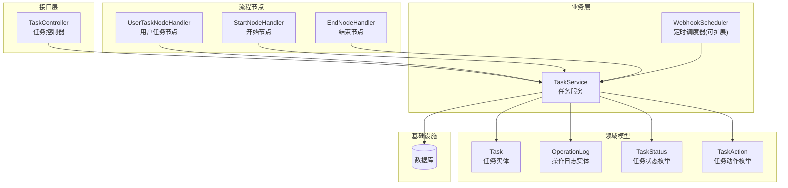
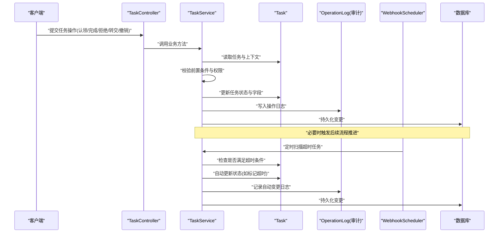
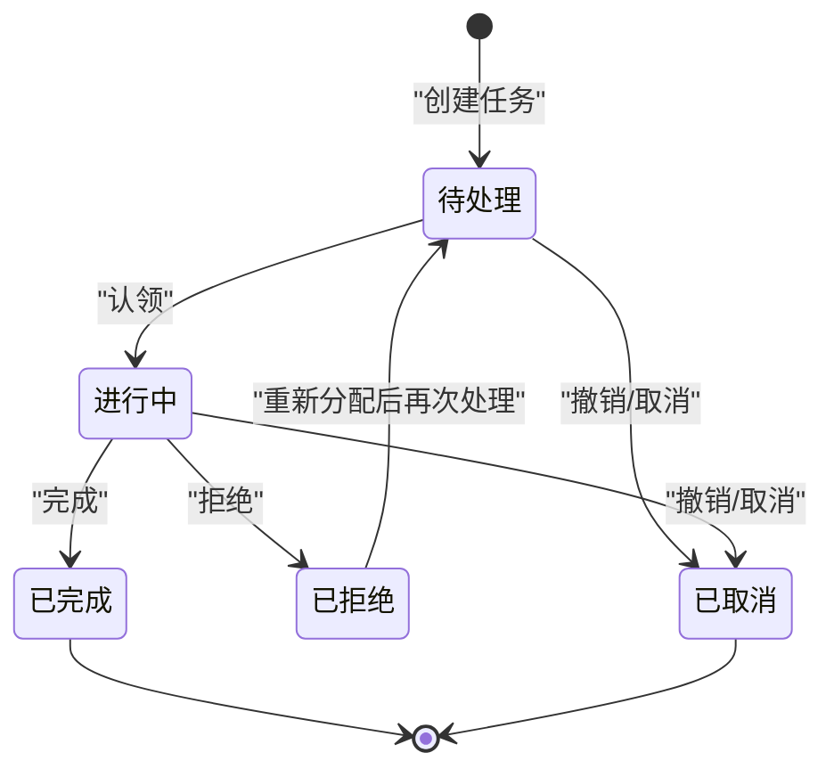
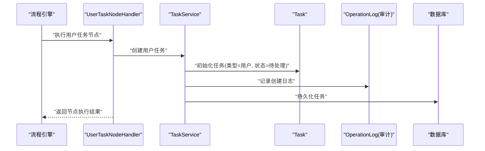
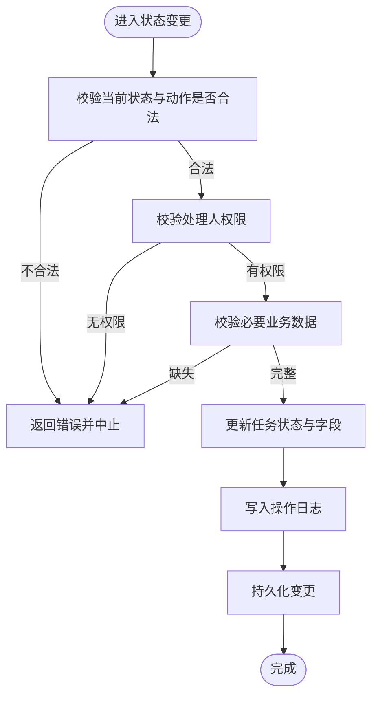
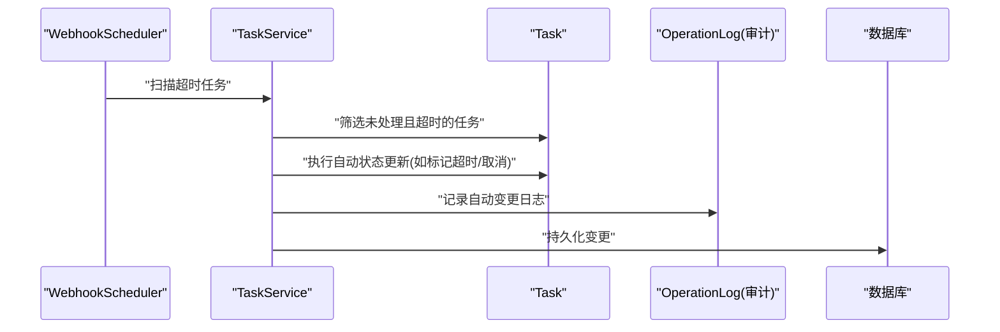
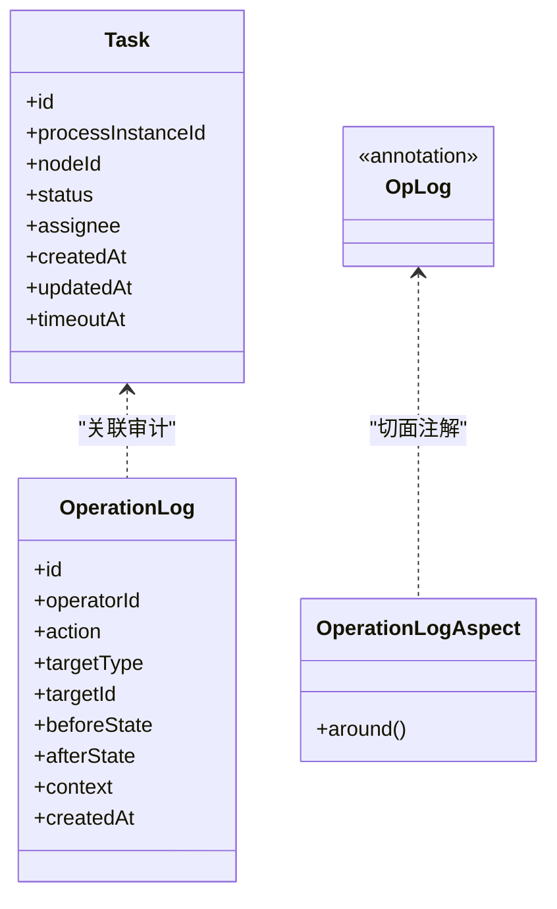
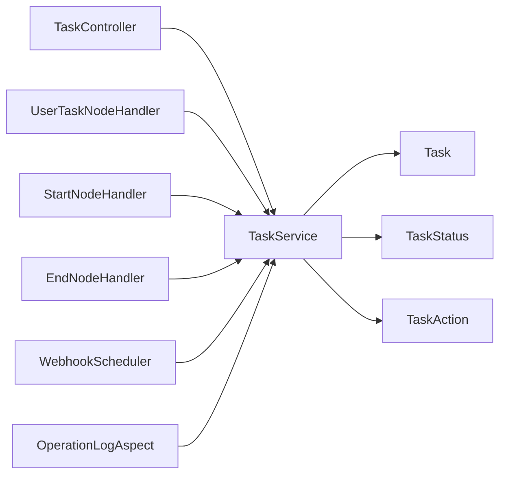

# 任务生命周期管理

<cite>
**本文引用的文件**   
- [TaskStatus.java](file://flow-engine/src/main/java/com/flow/engine/common/enums/TaskStatus.java)
- [TaskAction.java](file://flow-engine/src/main/java/com/flow/engine/common/enums/TaskAction.java)
- [Task.java](file://flow-engine/src/main/java/com/flow/engine/entity/Task.java)
- [TaskService.java](file://flow-engine/src/main/java/com/flow/engine/service/TaskService.java)
- [TaskController.java](file://flow-engine/src/main/java/com/flow/engine/controller/TaskController.java)
- [UserTaskNodeHandler.java](file://flow-engine/src/main/java/com/flow/engine/node/impl/UserTaskNodeHandler.java)
- [StartNodeHandler.java](file://flow-engine/src/main/java/com/flow/engine/node/impl/StartNodeHandler.java)
- [EndNodeHandler.java](file://flow-engine/src/main/java/com/flow/engine/node/impl/EndNodeHandler.java)
- [OperationLog.java](file://flow-engine/src/main/java/com/flow/engine/entity/OperationLog.java)
- [OperationLogAspect.java](file://flow-engine/src/main/java/com/flow/engine/aspect/OperationLogAspect.java)
- [OpLog.java](file://flow-engine/src/main/java/com/flow/engine/annotation/OpLog.java)
- [WebhookScheduler.java](file://flow-engine/src/main/java/com/flow/engine/service/WebhookScheduler.java)
- [schema.sql](file://flow-engine/src/main/resources/db/schema.sql)
</cite>

## 目录
1. [简介](#简介)
2. [项目结构](#项目结构)
3. [核心组件](#核心组件)
4. [架构总览](#架构总览)
5. [详细组件分析](#详细组件分析)
6. [依赖关系分析](#依赖关系分析)
7. [性能考虑](#性能考虑)
8. [故障排查指南](#故障排查指南)
9. [结论](#结论)
10. [附录](#附录)

## 简介
本文件聚焦于“任务生命周期管理”，围绕任务从创建到终结的完整状态流转、不同来源任务的创建机制、状态变更的业务规则与约束、超时处理与自动更新、以及历史追踪与审计记录进行系统化说明。文档同时提供状态机图与关键流程时序图，帮助读者快速理解并落地实现。

## 项目结构
与任务生命周期相关的核心代码位于后端服务模块 flow-engine 中，主要涉及：
- 枚举定义：任务状态与动作
- 实体模型：任务与操作日志
- 控制器与服务：对外接口与业务编排
- 节点处理器：用户任务、开始/结束节点等对任务生命周期的影响
- 审计切面：统一记录操作日志
- 调度器：用于定时任务（如超时处理）的扩展点

图表来源
- [TaskController.java](file://flow-engine/src/main/java/com/flow/engine/controller/TaskController.java)
- [TaskService.java](file://flow-engine/src/main/java/com/flow/engine/service/TaskService.java)
- [Task.java](file://flow-engine/src/main/java/com/flow/engine/entity/Task.java)
- [OperationLog.java](file://flow-engine/src/main/java/com/flow/engine/entity/OperationLog.java)
- [TaskStatus.java](file://flow-engine/src/main/java/com/flow/engine/common/enums/TaskStatus.java)
- [TaskAction.java](file://flow-engine/src/main/java/com/flow/engine/common/enums/TaskAction.java)
- [UserTaskNodeHandler.java](file://flow-engine/src/main/java/com/flow/engine/node/impl/UserTaskNodeHandler.java)
- [StartNodeHandler.java](file://flow-engine/src/main/java/com/flow/engine/node/impl/StartNodeHandler.java)
- [EndNodeHandler.java](file://flow-engine/src/main/java/com/flow/engine/node/impl/EndNodeHandler.java)
- [WebhookScheduler.java](file://flow-engine/src/main/java/com/flow/engine/service/WebhookScheduler.java)

章节来源
- [TaskController.java](file://flow-engine/src/main/java/com/flow/engine/controller/TaskController.java)
- [TaskService.java](file://flow-engine/src/main/java/com/flow/engine/service/TaskService.java)
- [Task.java](file://flow-engine/src/main/java/com/flow/engine/entity/Task.java)
- [OperationLog.java](file://flow-engine/src/main/java/com/flow/engine/entity/OperationLog.java)
- [TaskStatus.java](file://flow-engine/src/main/java/com/flow/engine/common/enums/TaskStatus.java)
- [TaskAction.java](file://flow-engine/src/main/java/com/flow/engine/common/enums/TaskAction.java)
- [UserTaskNodeHandler.java](file://flow-engine/src/main/java/com/flow/engine/node/impl/UserTaskNodeHandler.java)
- [StartNodeHandler.java](file://flow-engine/src/main/java/com/flow/engine/node/impl/StartNodeHandler.java)
- [EndNodeHandler.java](file://flow-engine/src/main/java/com/flow/engine/node/impl/EndNodeHandler.java)
- [WebhookScheduler.java](file://flow-engine/src/main/java/com/flow/engine/service/WebhookScheduler.java)

## 核心组件
- 任务状态与动作
  - 任务状态：用于描述任务当前所处阶段（例如待处理、进行中、已完成、已拒绝、已取消等）。
  - 任务动作：驱动状态转换的操作（例如认领、完成、拒绝、转交、撤销等）。
- 任务实体
  - 包含任务标识、所属流程实例、节点信息、当前状态、负责人、创建时间、更新时间、超时时间等字段，支撑生命周期管理与查询。
- 任务服务
  - 封装任务创建、认领、完成、拒绝、转交、撤销等核心能力；负责校验前置条件、执行状态转换、持久化变更、写入审计日志、触发后续流程推进。
- 任务控制器
  - 暴露 REST 接口，接收前端请求，调用任务服务完成业务编排。
- 节点处理器
  - 在流程引擎执行过程中，根据节点类型创建或推进任务（如用户任务节点会生成待处理任务）。
- 审计切面
  - 基于注解统一记录操作日志，确保任务相关的关键操作可追溯。
- 定时调度器
  - 作为扩展点，支持扫描超时任务并自动更新状态（如将长时间未处理的待处理任务标记为超时或转入其他状态）。

章节来源
- [TaskStatus.java](file://flow-engine/src/main/java/com/flow/engine/common/enums/TaskStatus.java)
- [TaskAction.java](file://flow-engine/src/main/java/com/flow/engine/common/enums/TaskAction.java)
- [Task.java](file://flow-engine/src/main/java/com/flow/engine/entity/Task.java)
- [TaskService.java](file://flow-engine/src/main/java/com/flow/engine/service/TaskService.java)
- [TaskController.java](file://flow-engine/src/main/java/com/flow/engine/controller/TaskController.java)
- [UserTaskNodeHandler.java](file://flow-engine/src/main/java/com/flow/engine/node/impl/UserTaskNodeHandler.java)
- [StartNodeHandler.java](file://flow-engine/src/main/java/com/flow/engine/node/impl/StartNodeHandler.java)
- [EndNodeHandler.java](file://flow-engine/src/main/java/com/flow/engine/node/impl/EndNodeHandler.java)
- [OperationLogAspect.java](file://flow-engine/src/main/java/com/flow/engine/aspect/OperationLogAspect.java)
- [OpLog.java](file://flow-engine/src/main/java/com/flow/engine/annotation/OpLog.java)
- [WebhookScheduler.java](file://flow-engine/src/main/java/com/flow/engine/service/WebhookScheduler.java)

## 架构总览
下图展示了任务生命周期在系统中的整体交互：控制器接收外部请求，交由服务层执行业务规则与状态转换，并通过实体持久化；节点处理器在流程推进时参与任务创建与推进；审计切面记录关键操作；调度器负责超时等自动化处理。

图表来源
- [TaskController.java](file://flow-engine/src/main/java/com/flow/engine/controller/TaskController.java)
- [TaskService.java](file://flow-engine/src/main/java/com/flow/engine/service/TaskService.java)
- [Task.java](file://flow-engine/src/main/java/com/flow/engine/entity/Task.java)
- [OperationLog.java](file://flow-engine/src/main/java/com/flow/engine/entity/OperationLog.java)
- [WebhookScheduler.java](file://flow-engine/src/main/java/com/flow/engine/service/WebhookScheduler.java)

## 详细组件分析

### 任务状态机与转换规则
- 状态集合
  - 待处理：任务已创建且尚未被任何人认领或处理。
  - 进行中：任务已被认领或进入处理阶段。
  - 已完成：任务处理成功并关闭。
  - 已拒绝：任务被拒绝，通常需回退或重新分配。
  - 已取消：任务被主动取消或由于上游原因终止。
- 典型转换
  - 待处理 → 进行中：通过“认领”动作触发。
  - 进行中 → 已完成：通过“完成”动作触发。
  - 进行中 → 已拒绝：通过“拒绝”动作触发。
  - 待处理/进行中 → 已取消：通过“撤销/取消”动作触发。
  - 待处理 → 已取消：当任务被上游流程取消或达到取消条件时。
- 约束与规则
  - 仅允许合法的动作驱动状态转换，非法组合应返回错误。
  - 同一时刻任务只能处于单一状态，避免并发导致的状态不一致。
  - 某些转换需要附加数据（如拒绝原因、完成备注），需在服务层校验。
  - 权限控制：只有具备相应角色或数据的用户才能执行特定动作。

图表来源
- [TaskStatus.java](file://flow-engine/src/main/java/com/flow/engine/common/enums/TaskStatus.java)
- [TaskAction.java](file://flow-engine/src/main/java/com/flow/engine/common/enums/TaskAction.java)
- [TaskService.java](file://flow-engine/src/main/java/com/flow/engine/service/TaskService.java)

章节来源
- [TaskStatus.java](file://flow-engine/src/main/java/com/flow/engine/common/enums/TaskStatus.java)
- [TaskAction.java](file://flow-engine/src/main/java/com/flow/engine/common/enums/TaskAction.java)
- [TaskService.java](file://flow-engine/src/main/java/com/flow/engine/service/TaskService.java)

### 任务创建机制
- 用户任务
  - 由流程引擎在执行到“用户任务节点”时创建，目标负责人可能来自节点配置或运行时计算。
  - 创建后任务初始状态通常为“待处理”。
- 系统任务
  - 可由系统内部逻辑或外部事件触发创建（例如审批失败后的补偿任务、通知任务等）。
  - 创建后可直接进入“待处理”或“进行中”，取决于具体业务场景。
- 创建流程要点
  - 解析节点或业务上下文，确定任务类型、负责人、超时策略等。
  - 初始化任务实体并持久化。
  - 写入审计日志，记录创建来源与上下文。
  - 若需要，立即推进流程至下一节点或等待人工处理。

图表来源
- [UserTaskNodeHandler.java](file://flow-engine/src/main/java/com/flow/engine/node/impl/UserTaskNodeHandler.java)
- [TaskService.java](file://flow-engine/src/main/java/com/flow/engine/service/TaskService.java)
- [Task.java](file://flow-engine/src/main/java/com/flow/engine/entity/Task.java)
- [OperationLog.java](file://flow-engine/src/main/java/com/flow/engine/entity/OperationLog.java)

章节来源
- [UserTaskNodeHandler.java](file://flow-engine/src/main/java/com/flow/engine/node/impl/UserTaskNodeHandler.java)
- [StartNodeHandler.java](file://flow-engine/src/main/java/com/flow/engine/node/impl/StartNodeHandler.java)
- [EndNodeHandler.java](file://flow-engine/src/main/java/com/flow/engine/node/impl/EndNodeHandler.java)
- [TaskService.java](file://flow-engine/src/main/java/com/flow/engine/service/TaskService.java)
- [Task.java](file://flow-engine/src/main/java/com/flow/engine/entity/Task.java)
- [OperationLog.java](file://flow-engine/src/main/java/com/flow/engine/entity/OperationLog.java)

### 状态变更业务规则与约束
- 动作合法性校验
  - 仅允许在特定状态下接受对应动作（例如“拒绝”仅在“进行中”有效）。
- 并发与一致性
  - 使用乐观锁或事务保证状态更新的原子性，防止重复认领或重复完成。
- 数据完整性
  - 完成/拒绝时需校验必要字段（如备注、附件、表单数据等）。
- 权限与授权
  - 校验当前用户对任务的处理权限（角色、部门、数据范围）。
- 审计与可追溯
  - 每次状态变更必须写入操作日志，包含操作人、时间、动作、前后状态等。

图表来源
- [TaskService.java](file://flow-engine/src/main/java/com/flow/engine/service/TaskService.java)
- [OperationLog.java](file://flow-engine/src/main/java/com/flow/engine/entity/OperationLog.java)

章节来源
- [TaskService.java](file://flow-engine/src/main/java/com/flow/engine/service/TaskService.java)
- [OperationLog.java](file://flow-engine/src/main/java/com/flow/engine/entity/OperationLog.java)

### 超时处理与自动状态更新
- 超时策略
  - 任务实体包含超时时间字段，可在创建时设置或由节点配置决定。
- 自动检测
  - 定时调度器周期性扫描未处理且超过阈值的任务。
- 自动更新
  - 对符合条件的任务执行预设动作（如标记为“超时”或转为“已取消”），并记录审计日志。
- 扩展点
  - 可通过 WebhookScheduler 扩展更多自动化行为（如发送提醒、升级告警等）。

图表来源
- [WebhookScheduler.java](file://flow-engine/src/main/java/com/flow/engine/service/WebhookScheduler.java)
- [TaskService.java](file://flow-engine/src/main/java/com/flow/engine/service/TaskService.java)
- [Task.java](file://flow-engine/src/main/java/com/flow/engine/entity/Task.java)
- [OperationLog.java](file://flow-engine/src/main/java/com/flow/engine/entity/OperationLog.java)

章节来源
- [WebhookScheduler.java](file://flow-engine/src/main/java/com/flow/engine/service/WebhookScheduler.java)
- [TaskService.java](file://flow-engine/src/main/java/com/flow/engine/service/TaskService.java)
- [Task.java](file://flow-engine/src/main/java/com/flow/engine/entity/Task.java)
- [OperationLog.java](file://flow-engine/src/main/java/com/flow/engine/entity/OperationLog.java)

### 历史追踪与审计记录
- 审计切面
  - 通过注解标注关键方法，统一捕获入参、出参、异常与耗时，写入操作日志表。
- 日志内容
  - 包含操作人、操作时间、操作对象、动作类型、前后状态、业务上下文等。
- 查询与分析
  - 提供按任务、流程实例、操作人、时间范围等维度的查询能力，便于审计与排障。

图表来源
- [Task.java](file://flow-engine/src/main/java/com/flow/engine/entity/Task.java)
- [OperationLog.java](file://flow-engine/src/main/java/com/flow/engine/entity/OperationLog.java)
- [OpLog.java](file://flow-engine/src/main/java/com/flow/engine/annotation/OpLog.java)
- [OperationLogAspect.java](file://flow-engine/src/main/java/com/flow/engine/aspect/OperationLogAspect.java)

章节来源
- [OperationLogAspect.java](file://flow-engine/src/main/java/com/flow/engine/aspect/OperationLogAspect.java)
- [OpLog.java](file://flow-engine/src/main/java/com/flow/engine/annotation/OpLog.java)
- [OperationLog.java](file://flow-engine/src/main/java/com/flow/engine/entity/OperationLog.java)
- [Task.java](file://flow-engine/src/main/java/com/flow/engine/entity/Task.java)

## 依赖关系分析
- 控制器依赖服务：TaskController 调用 TaskService 完成业务编排。
- 服务依赖实体与枚举：TaskService 使用 Task、TaskStatus、TaskAction 进行状态管理与校验。
- 节点处理器依赖服务：UserTaskNodeHandler 等在流程推进时通过 TaskService 创建或推进任务。
- 审计切面贯穿服务：OperationLogAspect 基于 OpLog 注解统一记录操作日志。
- 调度器与服务协作：WebhookScheduler 定期调用 TaskService 执行超时处理。

图表来源
- [TaskController.java](file://flow-engine/src/main/java/com/flow/engine/controller/TaskController.java)
- [TaskService.java](file://flow-engine/src/main/java/com/flow/engine/service/TaskService.java)
- [Task.java](file://flow-engine/src/main/java/com/flow/engine/entity/Task.java)
- [TaskStatus.java](file://flow-engine/src/main/java/com/flow/engine/common/enums/TaskStatus.java)
- [TaskAction.java](file://flow-engine/src/main/java/com/flow/engine/common/enums/TaskAction.java)
- [UserTaskNodeHandler.java](file://flow-engine/src/main/java/com/flow/engine/node/impl/UserTaskNodeHandler.java)
- [StartNodeHandler.java](file://flow-engine/src/main/java/com/flow/engine/node/impl/StartNodeHandler.java)
- [EndNodeHandler.java](file://flow-engine/src/main/java/com/flow/engine/node/impl/EndNodeHandler.java)
- [WebhookScheduler.java](file://flow-engine/src/main/java/com/flow/engine/service/WebhookScheduler.java)
- [OperationLogAspect.java](file://flow-engine/src/main/java/com/flow/engine/aspect/OperationLogAspect.java)

章节来源
- [TaskController.java](file://flow-engine/src/main/java/com/flow/engine/controller/TaskController.java)
- [TaskService.java](file://flow-engine/src/main/java/com/flow/engine/service/TaskService.java)
- [Task.java](file://flow-engine/src/main/java/com/flow/engine/entity/Task.java)
- [TaskStatus.java](file://flow-engine/src/main/java/com/flow/engine/common/enums/TaskStatus.java)
- [TaskAction.java](file://flow-engine/src/main/java/com/flow/engine/common/enums/TaskAction.java)
- [UserTaskNodeHandler.java](file://flow-engine/src/main/java/com/flow/engine/node/impl/UserTaskNodeHandler.java)
- [StartNodeHandler.java](file://flow-engine/src/main/java/com/flow/engine/node/impl/StartNodeHandler.java)
- [EndNodeHandler.java](file://flow-engine/src/main/java/com/flow/engine/node/impl/EndNodeHandler.java)
- [WebhookScheduler.java](file://flow-engine/src/main/java/com/flow/engine/service/WebhookScheduler.java)
- [OperationLogAspect.java](file://flow-engine/src/main/java/com/flow/engine/aspect/OperationLogAspect.java)

## 性能考虑
- 状态更新的事务边界
  - 将状态更新、审计写入与持久化置于同一事务，减少中间态与重试成本。
- 并发控制
  - 使用乐观锁或唯一索引避免重复认领/完成导致的竞争条件。
- 批量扫描优化
  - 超时扫描采用分页与索引优化，避免全表扫描与锁竞争。
- 缓存与幂等
  - 对热点任务元数据进行短期缓存，结合幂等键避免重复处理。
- 异步与解耦
  - 将非关键路径（如通知、统计）异步化，降低主流程延迟。

## 故障排查指南
- 常见错误
  - 非法状态转换：检查当前状态与动作是否匹配。
  - 权限不足：确认操作人角色与数据范围。
  - 数据缺失：完成/拒绝时必填字段是否齐全。
  - 并发冲突：是否存在重复认领或重复完成。
- 定位手段
  - 查看操作日志，确认最近一次状态变更的来源与上下文。
  - 核对任务实体的状态与更新时间，判断是否被自动调度修改。
  - 检查超时配置与调度器运行状态。
- 恢复建议
  - 对于误操作，可通过“撤销/取消”或“重新分配”恢复。
  - 对于超时任务，调整超时阈值或补充处理后再继续。

章节来源
- [TaskService.java](file://flow-engine/src/main/java/com/flow/engine/service/TaskService.java)
- [OperationLog.java](file://flow-engine/src/main/java/com/flow/engine/entity/OperationLog.java)
- [WebhookScheduler.java](file://flow-engine/src/main/java/com/flow/engine/service/WebhookScheduler.java)

## 结论
任务生命周期管理以明确的状态机为核心，配合严格的业务规则、完善的审计记录与可扩展的超时处理机制，形成稳定可靠的闭环。通过控制器-服务-实体-节点的清晰分层与切面式审计，系统在可维护性与可观测性方面具备良好的工程实践基础。

## 附录
- 数据库表结构参考
  - 任务表与操作日志表的字段设计可参考 schema.sql，确保关键字段（状态、负责人、时间戳、超时时间等）存在并建立合适索引。

章节来源
- [schema.sql](file://flow-engine/src/main/resources/db/schema.sql)