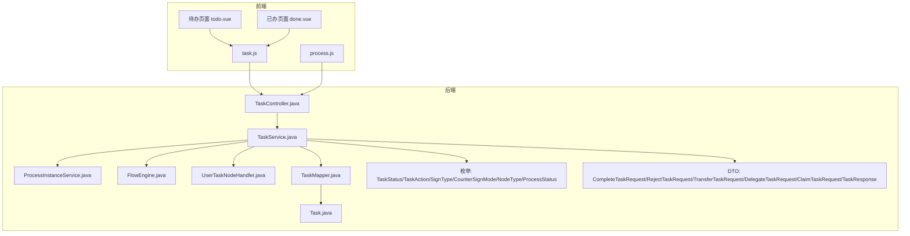
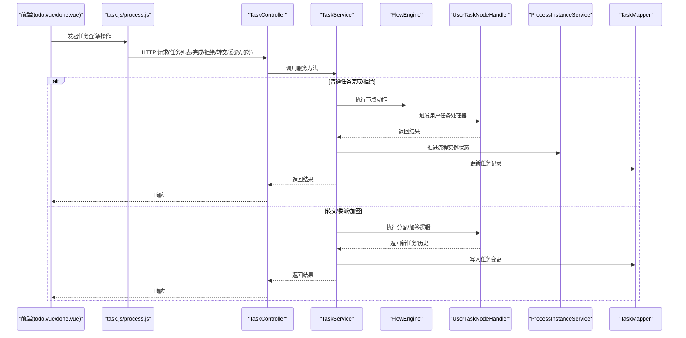
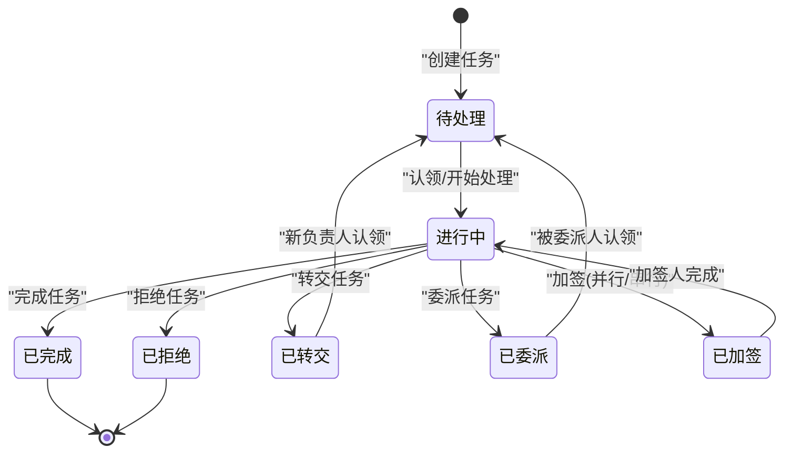
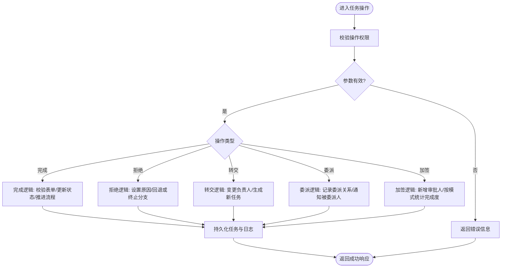
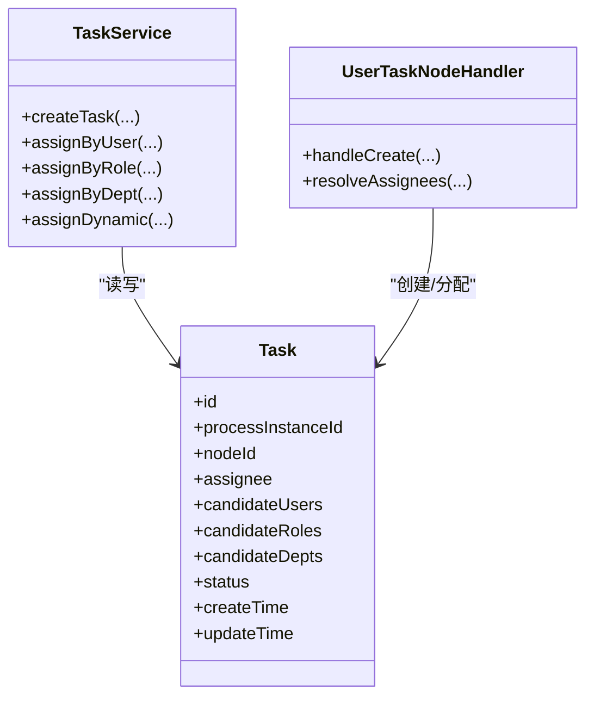
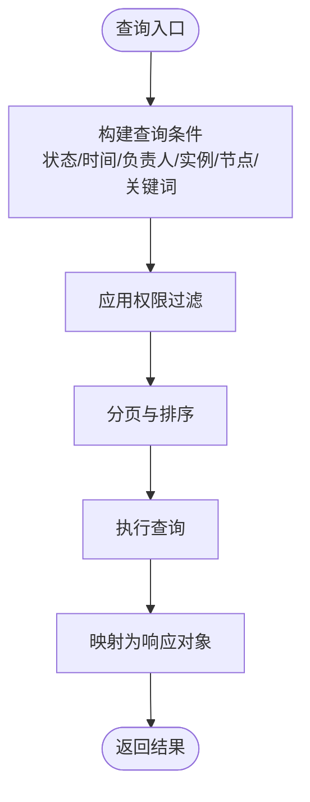
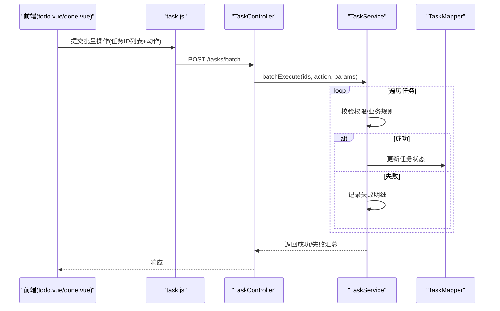
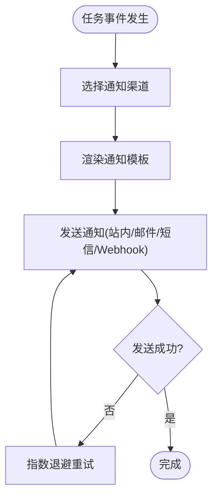
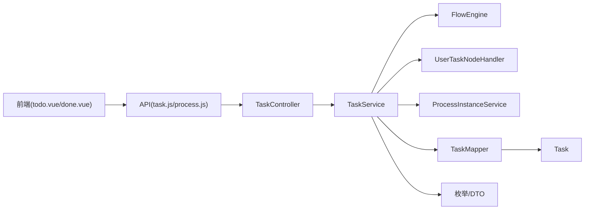

# 任务管理

<cite>
**本文引用的文件**   
- [TaskController.java](file://flow-engine/src/main/java/com/flow/engine/controller/TaskController.java)
- [TaskService.java](file://flow-engine/src/main/java/com/flow/engine/service/TaskService.java)
- [Task.java](file://flow-engine/src/main/java/com/flow/engine/entity/Task.java)
- [TaskMapper.java](file://flow-engine/src/main/java/com/flow/engine/mapper/TaskMapper.java)
- [ProcessInstanceService.java](file://flow-engine/src/main/java/com/flow/engine/service/ProcessInstanceService.java)
- [UserTaskNodeHandler.java](file://flow-engine/src/main/java/com/flow/engine/node/impl/UserTaskNodeHandler.java)
- [FlowEngine.java](file://flow-engine/src/main/java/com/flow/engine/engine/FlowEngine.java)
- [TaskStatus.java](file://flow-engine/src/main/java/com/flow/engine/common/enums/TaskStatus.java)
- [TaskAction.java](file://flow-engine/src/main/java/com/flow/engine/common/enums/TaskAction.java)
- [SignType.java](file://flow-engine/src/main/java/com/flow/engine/common/enums/SignType.java)
- [CounterSignMode.java](file://flow-engine/src/main/java/com/flow/engine/common/enums/CounterSignMode.java)
- [NodeType.java](file://flow-engine/src/main/java/com/flow/engine/common/enums/NodeType.java)
- [ProcessStatus.java](file://flow-engine/src/main/java/com/flow/engine/common/enums/ProcessStatus.java)
- [CompleteTaskRequest.java](file://flow-engine/src/main/java/com/flow/engine/dto/CompleteTaskRequest.java)
- [RejectTaskRequest.java](file://flow-engine/src/main/java/com/flow/engine/dto/RejectTaskRequest.java)
- [TransferTaskRequest.java](file://flow-engine/src/main/java/com/flow/engine/dto/TransferTaskRequest.java)
- [DelegateTaskRequest.java](file://flow-engine/src/main/java/com/flow/engine/dto/DelegateTaskRequest.java)
- [ClaimTaskRequest.java](file://flow-engine/src/main/java/com/flow/engine/dto/ClaimTaskRequest.java)
- [TaskResponse.java](file://flow-engine/src/main/java/com/flow/engine/dto/TaskResponse.java)
- [process.js](file://flow-web/src/api/process.js)
- [task.js](file://flow-web/src/api/task.js)
- [todo.vue](file://flow-web/src/views/task/todo.vue)
- [done.vue](file://flow-web/src/views/task/done.vue)
- [application.yml](file://flow-engine/src/main/resources/application.yml)
</cite>

## 目录
1. [简介](#简介)
2. [项目结构](#项目结构)
3. [核心组件](#核心组件)
4. [架构总览](#架构总览)
5. [详细组件分析](#详细组件分析)
6. [依赖关系分析](#依赖关系分析)
7. [性能考虑](#性能考虑)
8. [故障排查指南](#故障排查指南)
9. [结论](#结论)
10. [附录](#附录)

## 简介
本文件围绕“任务管理”主题，系统化阐述任务从创建、分配、处理到完成的完整生命周期，覆盖完成任务、拒绝任务、转交任务、加签、委派等关键操作的业务逻辑与实现要点；说明任务分配策略（指定用户、角色、部门）；提供多维度查询与筛选能力；描述任务列表展示与批量操作；并给出任务通知与待办提醒机制的设计建议。同时提供后端API接口文档与前端集成示例路径，帮助读者快速落地。

## 项目结构
本项目采用前后端分离的架构：
- 后端服务 flow-engine：基于 Spring Boot，包含控制器、服务层、实体、枚举、节点处理器、引擎执行器等模块。
- 前端应用 flow-web：基于 Vue/Vite，提供流程定义、实例、任务等页面与 API 调用封装。

图表来源
- [TaskController.java](file://flow-engine/src/main/java/com/flow/engine/controller/TaskController.java)
- [TaskService.java](file://flow-engine/src/main/java/com/flow/engine/service/TaskService.java)
- [ProcessInstanceService.java](file://flow-engine/src/main/java/com/flow/engine/service/ProcessInstanceService.java)
- [FlowEngine.java](file://flow-engine/src/main/java/com/flow/engine/engine/FlowEngine.java)
- [UserTaskNodeHandler.java](file://flow-engine/src/main/java/com/flow/engine/node/impl/UserTaskNodeHandler.java)
- [TaskMapper.java](file://flow-engine/src/main/java/com/flow/engine/mapper/TaskMapper.java)
- [Task.java](file://flow-engine/src/main/java/com/flow/engine/entity/Task.java)
- [TaskStatus.java](file://flow-engine/src/main/java/com/flow/engine/common/enums/TaskStatus.java)
- [TaskAction.java](file://flow-engine/src/main/java/com/flow/engine/common/enums/TaskAction.java)
- [SignType.java](file://flow-engine/src/main/java/com/flow/engine/common/enums/SignType.java)
- [CounterSignMode.java](file://flow-engine/src/main/java/com/flow/engine/common/enums/CounterSignMode.java)
- [NodeType.java](file://flow-engine/src/main/java/com/flow/engine/common/enums/NodeType.java)
- [ProcessStatus.java](file://flow-engine/src/main/java/com/flow/engine/common/enums/ProcessStatus.java)
- [CompleteTaskRequest.java](file://flow-engine/src/main/java/com/flow/engine/dto/CompleteTaskRequest.java)
- [RejectTaskRequest.java](file://flow-engine/src/main/java/com/flow/engine/dto/RejectTaskRequest.java)
- [TransferTaskRequest.java](file://flow-engine/src/main/java/com/flow/engine/dto/TransferTaskRequest.java)
- [DelegateTaskRequest.java](file://flow-engine/src/main/java/com/flow/engine/dto/DelegateTaskRequest.java)
- [ClaimTaskRequest.java](file://flow-engine/src/main/java/com/flow/engine/dto/ClaimTaskRequest.java)
- [TaskResponse.java](file://flow-engine/src/main/java/com/flow/engine/dto/TaskResponse.java)
- [process.js](file://flow-web/src/api/process.js)
- [task.js](file://flow-web/src/api/task.js)
- [todo.vue](file://flow-web/src/views/task/todo.vue)
- [done.vue](file://flow-web/src/views/task/done.vue)

章节来源
- [TaskController.java](file://flow-engine/src/main/java/com/flow/engine/controller/TaskController.java)
- [TaskService.java](file://flow-engine/src/main/java/com/flow/engine/service/TaskService.java)
- [Task.java](file://flow-engine/src/main/java/com/flow/engine/entity/Task.java)
- [TaskMapper.java](file://flow-engine/src/main/java/com/flow/engine/mapper/TaskMapper.java)
- [ProcessInstanceService.java](file://flow-engine/src/main/java/com/flow/engine/service/ProcessInstanceService.java)
- [UserTaskNodeHandler.java](file://flow-engine/src/main/java/com/flow/engine/node/impl/UserTaskNodeHandler.java)
- [FlowEngine.java](file://flow-engine/src/main/java/com/flow/engine/engine/FlowEngine.java)
- [TaskStatus.java](file://flow-engine/src/main/java/com/flow/engine/common/enums/TaskStatus.java)
- [TaskAction.java](file://flow-engine/src/main/java/com/flow/engine/common/enums/TaskAction.java)
- [SignType.java](file://flow-engine/src/main/java/com/flow/engine/common/enums/SignType.java)
- [CounterSignMode.java](file://flow-engine/src/main/java/com/flow/engine/common/enums/CounterSignMode.java)
- [NodeType.java](file://flow-engine/src/main/java/com/flow/engine/common/enums/NodeType.java)
- [ProcessStatus.java](file://flow-engine/src/main/java/com/flow/engine/common/enums/ProcessStatus.java)
- [CompleteTaskRequest.java](file://flow-engine/src/main/java/com/flow/engine/dto/CompleteTaskRequest.java)
- [RejectTaskRequest.java](file://flow-engine/src/main/java/com/flow/engine/dto/RejectTaskRequest.java)
- [TransferTaskRequest.java](file://flow-engine/src/main/java/com/flow/engine/dto/TransferTaskRequest.java)
- [DelegateTaskRequest.java](file://flow-engine/src/main/java/com/flow/engine/dto/DelegateTaskRequest.java)
- [ClaimTaskRequest.java](file://flow-engine/src/main/java/com/flow/engine/dto/ClaimTaskRequest.java)
- [TaskResponse.java](file://flow-engine/src/main/java/com/flow/engine/dto/TaskResponse.java)
- [process.js](file://flow-web/src/api/process.js)
- [task.js](file://flow-web/src/api/task.js)
- [todo.vue](file://flow-web/src/views/task/todo.vue)
- [done.vue](file://flow-web/src/views/task/done.vue)

## 核心组件
- 任务控制器 TaskController：暴露任务相关 HTTP 接口，接收请求参数并委托给服务层。
- 任务服务 TaskService：封装任务业务逻辑，包括任务查询、分配、完成、拒绝、转交、委派、加签等。
- 流程实例服务 ProcessInstanceService：负责流程实例状态推进、变量更新、事件发布等。
- 用户任务节点处理器 UserTaskNodeHandler：处理用户任务的创建、分配、审批动作等节点级行为。
- 引擎 FlowEngine：驱动流程执行，协调节点处理器与服务层协作。
- 数据访问层 TaskMapper + 实体 Task：持久化任务数据。
- 枚举与DTO：统一任务状态、动作类型、加签模式、节点类型、流程状态以及请求/响应数据结构。

章节来源
- [TaskController.java](file://flow-engine/src/main/java/com/flow/engine/controller/TaskController.java)
- [TaskService.java](file://flow-engine/src/main/java/com/flow/engine/service/TaskService.java)
- [ProcessInstanceService.java](file://flow-engine/src/main/java/com/flow/engine/service/ProcessInstanceService.java)
- [UserTaskNodeHandler.java](file://flow-engine/src/main/java/com/flow/engine/node/impl/UserTaskNodeHandler.java)
- [FlowEngine.java](file://flow-engine/src/main/java/com/flow/engine/engine/FlowEngine.java)
- [TaskMapper.java](file://flow-engine/src/main/java/com/flow/engine/mapper/TaskMapper.java)
- [Task.java](file://flow-engine/src/main/java/com/flow/engine/entity/Task.java)
- [TaskStatus.java](file://flow-engine/src/main/java/com/flow/engine/common/enums/TaskStatus.java)
- [TaskAction.java](file://flow-engine/src/main/java/com/flow/engine/common/enums/TaskAction.java)
- [SignType.java](file://flow-engine/src/main/java/com/flow/engine/common/enums/SignType.java)
- [CounterSignMode.java](file://flow-engine/src/main/java/com/flow/engine/common/enums/CounterSignMode.java)
- [NodeType.java](file://flow-engine/src/main/java/com/flow/engine/common/enums/NodeType.java)
- [ProcessStatus.java](file://flow-engine/src/main/java/com/flow/engine/common/enums/ProcessStatus.java)
- [CompleteTaskRequest.java](file://flow-engine/src/main/java/com/flow/engine/dto/CompleteTaskRequest.java)
- [RejectTaskRequest.java](file://flow-engine/src/main/java/com/flow/engine/dto/RejectTaskRequest.java)
- [TransferTaskRequest.java](file://flow-engine/src/main/java/com/flow/engine/dto/TransferTaskRequest.java)
- [DelegateTaskRequest.java](file://flow-engine/src/main/java/com/flow/engine/dto/DelegateTaskRequest.java)
- [ClaimTaskRequest.java](file://flow-engine/src/main/java/com/flow/engine/dto/ClaimTaskRequest.java)
- [TaskResponse.java](file://flow-engine/src/main/java/com/flow/engine/dto/TaskResponse.java)

## 架构总览
任务管理的整体交互如下：前端通过 task.js 和 process.js 调用后端 TaskController；控制器将请求交由 TaskService 处理；TaskService 根据操作类型调用流程引擎或用户任务节点处理器，必要时与流程实例服务协同推进流程状态；最终通过 TaskMapper 持久化任务数据。

图表来源
- [TaskController.java](file://flow-engine/src/main/java/com/flow/engine/controller/TaskController.java)
- [TaskService.java](file://flow-engine/src/main/java/com/flow/engine/service/TaskService.java)
- [FlowEngine.java](file://flow-engine/src/main/java/com/flow/engine/engine/FlowEngine.java)
- [UserTaskNodeHandler.java](file://flow-engine/src/main/java/com/flow/engine/node/impl/UserTaskNodeHandler.java)
- [ProcessInstanceService.java](file://flow-engine/src/main/java/com/flow/engine/service/ProcessInstanceService.java)
- [TaskMapper.java](file://flow-engine/src/main/java/com/flow/engine/mapper/TaskMapper.java)
- [process.js](file://flow-web/src/api/process.js)
- [task.js](file://flow-web/src/api/task.js)
- [todo.vue](file://flow-web/src/views/task/todo.vue)
- [done.vue](file://flow-web/src/views/task/done.vue)

## 详细组件分析

### 任务生命周期
- 创建：当流程到达用户任务节点时，由用户任务处理器创建任务记录，并根据分配策略确定负责人。
- 分配：支持指定用户、角色、部门等多种方式；可结合表达式或配置动态计算。
- 处理：负责人对任务进行完成、拒绝、转交、委派、加签等操作。
- 完成：任务完成后，引擎推进流程至下一节点或结束；若为会签/反签，按模式判定是否继续。
- 归档：任务状态变更为已完成或终止，保留审计日志与历史记录。

图表来源
- [TaskStatus.java](file://flow-engine/src/main/java/com/flow/engine/common/enums/TaskStatus.java)
- [TaskAction.java](file://flow-engine/src/main/java/com/flow/engine/common/enums/TaskAction.java)
- [SignType.java](file://flow-engine/src/main/java/com/flow/engine/common/enums/SignType.java)
- [CounterSignMode.java](file://flow-engine/src/main/java/com/flow/engine/common/enums/CounterSignMode.java)
- [UserTaskNodeHandler.java](file://flow-engine/src/main/java/com/flow/engine/node/impl/UserTaskNodeHandler.java)
- [TaskService.java](file://flow-engine/src/main/java/com/flow/engine/service/TaskService.java)

章节来源
- [TaskStatus.java](file://flow-engine/src/main/java/com/flow/engine/common/enums/TaskStatus.java)
- [TaskAction.java](file://flow-engine/src/main/java/com/flow/engine/common/enums/TaskAction.java)
- [SignType.java](file://flow-engine/src/main/java/com/flow/engine/common/enums/SignType.java)
- [CounterSignMode.java](file://flow-engine/src/main/java/com/flow/engine/common/enums/CounterSignMode.java)
- [UserTaskNodeHandler.java](file://flow-engine/src/main/java/com/flow/engine/node/impl/UserTaskNodeHandler.java)
- [TaskService.java](file://flow-engine/src/main/java/com/flow/engine/service/TaskService.java)

### 任务操作类型与实现要点
- 完成任务：校验权限与表单数据，更新任务状态，推进流程实例，记录操作日志。
- 拒绝任务：回退或终止流程分支，设置拒绝原因，更新任务与实例状态。
- 转交任务：将当前任务转移至其他用户，保留原处理人与时间戳，生成新的待办。
- 委派任务：将任务临时委派给他人处理，原负责人仍可见并可恢复。
- 加签：在现有任务基础上增加额外审批人，支持并行或串行模式，按模式统计完成比例决定是否继续。

图表来源
- [TaskService.java](file://flow-engine/src/main/java/com/flow/engine/service/TaskService.java)
- [UserTaskNodeHandler.java](file://flow-engine/src/main/java/com/flow/engine/node/impl/UserTaskNodeHandler.java)
- [ProcessInstanceService.java](file://flow-engine/src/main/java/com/flow/engine/service/ProcessInstanceService.java)
- [TaskMapper.java](file://flow-engine/src/main/java/com/flow/engine/mapper/TaskMapper.java)
- [TaskAction.java](file://flow-engine/src/main/java/com/flow/engine/common/enums/TaskAction.java)
- [SignType.java](file://flow-engine/src/main/java/com/flow/engine/common/enums/SignType.java)
- [CounterSignMode.java](file://flow-engine/src/main/java/com/flow/engine/common/enums/CounterSignMode.java)

章节来源
- [TaskService.java](file://flow-engine/src/main/java/com/flow/engine/service/TaskService.java)
- [UserTaskNodeHandler.java](file://flow-engine/src/main/java/com/flow/engine/node/impl/UserTaskNodeHandler.java)
- [ProcessInstanceService.java](file://flow-engine/src/main/java/com/flow/engine/service/ProcessInstanceService.java)
- [TaskMapper.java](file://flow-engine/src/main/java/com/flow/engine/mapper/TaskMapper.java)
- [TaskAction.java](file://flow-engine/src/main/java/com/flow/engine/common/enums/TaskAction.java)
- [SignType.java](file://flow-engine/src/main/java/com/flow/engine/common/enums/SignType.java)
- [CounterSignMode.java](file://flow-engine/src/main/java/com/flow/engine/common/enums/CounterSignMode.java)

### 任务分配策略
- 指定用户：直接绑定具体用户ID作为负责人。
- 角色分配：根据用户角色匹配具有该角色的所有用户。
- 部门分配：根据用户所属部门或上级部门进行分配。
- 动态分配：结合表达式或外部服务计算负责人，支持运行时决策。

图表来源
- [Task.java](file://flow-engine/src/main/java/com/flow/engine/entity/Task.java)
- [TaskService.java](file://flow-engine/src/main/java/com/flow/engine/service/TaskService.java)
- [UserTaskNodeHandler.java](file://flow-engine/src/main/java/com/flow/engine/node/impl/UserTaskNodeHandler.java)

章节来源
- [Task.java](file://flow-engine/src/main/java/com/flow/engine/entity/Task.java)
- [TaskService.java](file://flow-engine/src/main/java/com/flow/engine/service/TaskService.java)
- [UserTaskNodeHandler.java](file://flow-engine/src/main/java/com/flow/engine/node/impl/UserTaskNodeHandler.java)

### 任务查询与筛选
- 维度：按状态、时间范围、负责人、流程实例ID、节点ID、关键词等筛选。
- 分页：支持页码与每页数量参数，返回总数与列表。
- 排序：支持按创建时间、更新时间等字段排序。
- 权限：仅返回当前用户有权限查看的任务（本人、本部门、角色范围）。

图表来源
- [TaskService.java](file://flow-engine/src/main/java/com/flow/engine/service/TaskService.java)
- [TaskMapper.java](file://flow-engine/src/main/java/com/flow/engine/mapper/TaskMapper.java)
- [TaskResponse.java](file://flow-engine/src/main/java/com/flow/engine/dto/TaskResponse.java)

章节来源
- [TaskService.java](file://flow-engine/src/main/java/com/flow/engine/service/TaskService.java)
- [TaskMapper.java](file://flow-engine/src/main/java/com/flow/engine/mapper/TaskMapper.java)
- [TaskResponse.java](file://flow-engine/src/main/java/com/flow/engine/dto/TaskResponse.java)

### 任务列表与批量操作
- 列表展示：待办与已办两个视图，分别对应不同状态集合。
- 批量操作：批量完成、批量拒绝、批量转交等，需逐条校验权限与业务规则。
- 事务性：批量操作应在事务中执行，保证一致性；失败时回滚或记录部分成功明细。

图表来源
- [TaskController.java](file://flow-engine/src/main/java/com/flow/engine/controller/TaskController.java)
- [TaskService.java](file://flow-engine/src/main/java/com/flow/engine/service/TaskService.java)
- [TaskMapper.java](file://flow-engine/src/main/java/com/flow/engine/mapper/TaskMapper.java)
- [task.js](file://flow-web/src/api/task.js)
- [todo.vue](file://flow-web/src/views/task/todo.vue)
- [done.vue](file://flow-web/src/views/task/done.vue)

章节来源
- [TaskController.java](file://flow-engine/src/main/java/com/flow/engine/controller/TaskController.java)
- [TaskService.java](file://flow-engine/src/main/java/com/flow/engine/service/TaskService.java)
- [TaskMapper.java](file://flow-engine/src/main/java/com/flow/engine/mapper/TaskMapper.java)
- [task.js](file://flow-web/src/api/task.js)
- [todo.vue](file://flow-web/src/views/task/todo.vue)
- [done.vue](file://flow-web/src/views/task/done.vue)

### 任务通知与待办提醒
- 通知渠道：站内消息、邮件、短信、Webhook（可配置）。
- 触发时机：任务创建、转交、委派、加签、完成、拒绝等关键节点。
- 内容模板：支持变量替换（任务名称、发起人、截止时间、链接等）。
- 重试与幂等：通知发送失败应重试，避免重复通知。

图表来源
- [application.yml](file://flow-engine/src/main/resources/application.yml)
- [TaskService.java](file://flow-engine/src/main/java/com/flow/engine/service/TaskService.java)

章节来源
- [application.yml](file://flow-engine/src/main/resources/application.yml)
- [TaskService.java](file://flow-engine/src/main/java/com/flow/engine/service/TaskService.java)

### 任务API接口文档
以下列出任务相关的主要接口（以实际控制器与服务实现为准）：
- 任务列表查询
  - 方法：GET
  - 路径：/api/tasks
  - 参数：page、size、status、assignee、startTime、endTime、keyword、sortField、sortOrder
  - 响应：分页结果（列表、总数）
- 任务详情
  - 方法：GET
  - 路径：/api/tasks/{taskId}
  - 响应：任务详情对象
- 完成任务
  - 方法：POST
  - 路径：/api/tasks/{taskId}/complete
  - 请求体：CompleteTaskRequest
  - 响应：通用结果
- 拒绝任务
  - 方法：POST
  - 路径：/api/tasks/{taskId}/reject
  - 请求体：RejectTaskRequest
  - 响应：通用结果
- 转交任务
  - 方法：POST
  - 路径：/api/tasks/{taskId}/transfer
  - 请求体：TransferTaskRequest
  - 响应：通用结果
- 委派任务
  - 方法：POST
  - 路径：/api/tasks/{taskId}/delegate
  - 请求体：DelegateTaskRequest
  - 响应：通用结果
- 认领任务
  - 方法：POST
  - 路径：/api/tasks/{taskId}/claim
  - 请求体：ClaimTaskRequest
  - 响应：通用结果
- 批量操作
  - 方法：POST
  - 路径：/api/tasks/batch
  - 请求体：{ids, action, params}
  - 响应：成功/失败汇总

章节来源
- [TaskController.java](file://flow-engine/src/main/java/com/flow/engine/controller/TaskController.java)
- [TaskService.java](file://flow-engine/src/main/java/com/flow/engine/service/TaskService.java)
- [CompleteTaskRequest.java](file://flow-engine/src/main/java/com/flow/engine/dto/CompleteTaskRequest.java)
- [RejectTaskRequest.java](file://flow-engine/src/main/java/com/flow/engine/dto/RejectTaskRequest.java)
- [TransferTaskRequest.java](file://flow-engine/src/main/java/com/flow/engine/dto/TransferTaskRequest.java)
- [DelegateTaskRequest.java](file://flow-engine/src/main/java/com/flow/engine/dto/DelegateTaskRequest.java)
- [ClaimTaskRequest.java](file://flow-engine/src/main/java/com/flow/engine/dto/ClaimTaskRequest.java)
- [TaskResponse.java](file://flow-engine/src/main/java/com/flow/engine/dto/TaskResponse.java)

### 前端集成示例
- 待办页面
  - 文件：[todo.vue](file://flow-web/src/views/task/todo.vue)
  - 功能：加载待办列表、分页、搜索、批量操作、跳转任务详情与处理。
- 已办页面
  - 文件：[done.vue](file://flow-web/src/views/task/done.vue)
  - 功能：加载已办列表、筛选历史任务、查看详情与审计日志。
- API 封装
  - 文件：[task.js](file://flow-web/src/api/task.js)、[process.js](file://flow-web/src/api/process.js)
  - 功能：封装任务与流程相关HTTP调用，统一错误处理与拦截器。

章节来源
- [todo.vue](file://flow-web/src/views/task/todo.vue)
- [done.vue](file://flow-web/src/views/task/done.vue)
- [task.js](file://flow-web/src/api/task.js)
- [process.js](file://flow-web/src/api/process.js)

## 依赖关系分析
- 控制器依赖服务层，服务层依赖引擎与节点处理器，数据访问层依赖实体与数据库。
- 枚举与DTO贯穿各层，确保一致的数据契约。
- 前端通过API模块与后端交互，页面组件负责展示与用户交互。

图表来源
- [TaskController.java](file://flow-engine/src/main/java/com/flow/engine/controller/TaskController.java)
- [TaskService.java](file://flow-engine/src/main/java/com/flow/engine/service/TaskService.java)
- [FlowEngine.java](file://flow-engine/src/main/java/com/flow/engine/engine/FlowEngine.java)
- [UserTaskNodeHandler.java](file://flow-engine/src/main/java/com/flow/engine/node/impl/UserTaskNodeHandler.java)
- [ProcessInstanceService.java](file://flow-engine/src/main/java/com/flow/engine/service/ProcessInstanceService.java)
- [TaskMapper.java](file://flow-engine/src/main/java/com/flow/engine/mapper/TaskMapper.java)
- [Task.java](file://flow-engine/src/main/java/com/flow/engine/entity/Task.java)
- [task.js](file://flow-web/src/api/task.js)
- [process.js](file://flow-web/src/api/process.js)
- [todo.vue](file://flow-web/src/views/task/todo.vue)
- [done.vue](file://flow-web/src/views/task/done.vue)

章节来源
- [TaskController.java](file://flow-engine/src/main/java/com/flow/engine/controller/TaskController.java)
- [TaskService.java](file://flow-engine/src/main/java/com/flow/engine/service/TaskService.java)
- [FlowEngine.java](file://flow-engine/src/main/java/com/flow/engine/engine/FlowEngine.java)
- [UserTaskNodeHandler.java](file://flow-engine/src/main/java/com/flow/engine/node/impl/UserTaskNodeHandler.java)
- [ProcessInstanceService.java](file://flow-engine/src/main/java/com/flow/engine/service/ProcessInstanceService.java)
- [TaskMapper.java](file://flow-engine/src/main/java/com/flow/engine/mapper/TaskMapper.java)
- [Task.java](file://flow-engine/src/main/java/com/flow/engine/entity/Task.java)
- [task.js](file://flow-web/src/api/task.js)
- [process.js](file://flow-web/src/api/process.js)
- [todo.vue](file://flow-web/src/views/task/todo.vue)
- [done.vue](file://flow-web/src/views/task/done.vue)

## 性能考虑
- 查询优化：合理使用索引（如 assignee、status、createTime），避免全表扫描；分页查询限制返回字段。
- 批量操作：分批提交，控制单次事务大小，避免长事务锁竞争。
- 缓存策略：热点任务列表或字典数据可引入缓存，注意失效策略。
- 异步通知：通知发送采用异步队列，降低主流程延迟。
- 并发安全：加签与并行审批需保证计数与状态的原子性。

## 故障排查指南
- 常见问题
  - 权限不足：检查当前用户与任务候选者/负责人的匹配关系。
  - 参数缺失：确认请求体字段完整性与类型正确。
  - 流程状态异常：核对流程实例状态与节点流转是否符合预期。
- 定位步骤
  - 查看任务与流程实例记录，确认状态变更轨迹。
  - 检查操作日志与审计记录，定位失败环节。
  - 验证通知渠道配置与网络连通性。
- 建议
  - 增加更详细的错误码与提示信息。
  - 对关键路径添加监控指标与告警。

章节来源
- [TaskService.java](file://flow-engine/src/main/java/com/flow/engine/service/TaskService.java)
- [TaskController.java](file://flow-engine/src/main/java/com/flow/engine/controller/TaskController.java)
- [application.yml](file://flow-engine/src/main/resources/application.yml)

## 结论
本任务管理系统围绕任务全生命周期设计，提供了丰富的操作类型与灵活的分配策略，支持多维度查询与批量操作，并通过通知机制提升用户体验。通过清晰的架构分层与一致的枚举/DTO契约，系统具备良好的扩展性与可维护性。后续可在通知渠道、权限模型与性能优化方面持续完善。

## 附录
- 配置项参考：见 application.yml 中的通知与Webhook配置。
- 前端页面参考：待办与已办页面位于 views/task 目录，API 封装位于 api 目录。

章节来源
- [application.yml](file://flow-engine/src/main/resources/application.yml)
- [todo.vue](file://flow-web/src/views/task/todo.vue)
- [done.vue](file://flow-web/src/views/task/done.vue)
- [task.js](file://flow-web/src/api/task.js)
- [process.js](file://flow-web/src/api/process.js)