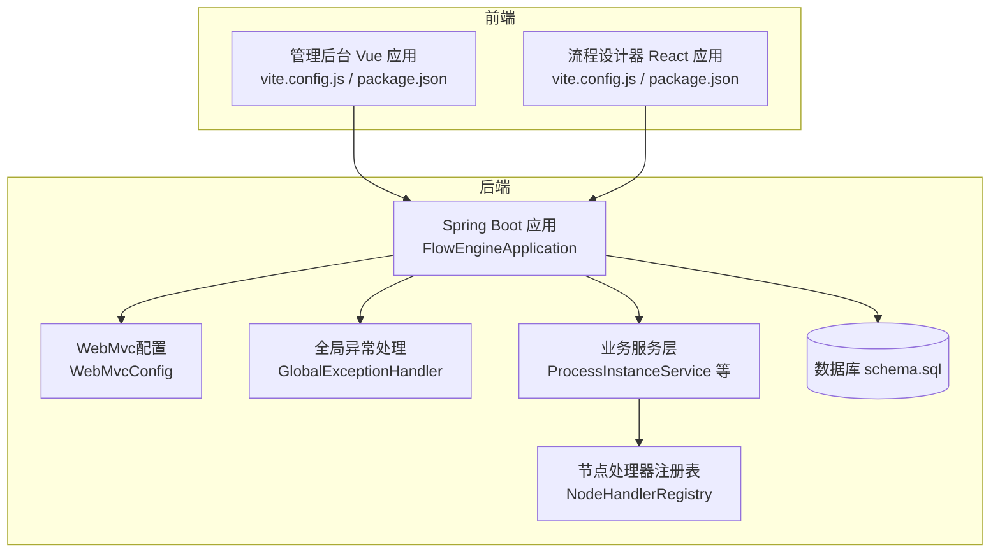
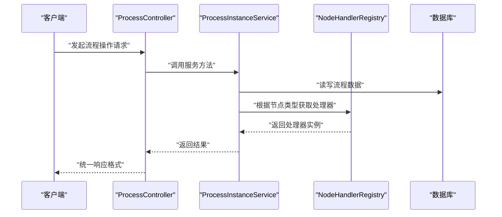
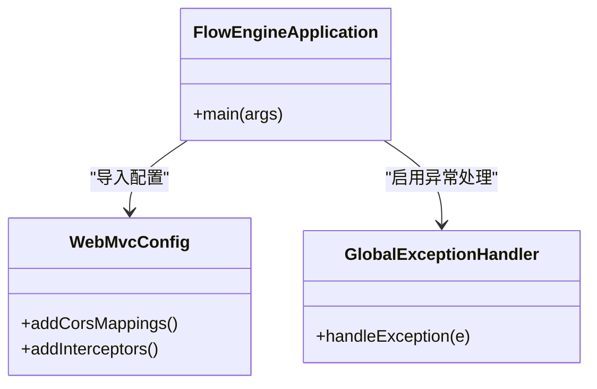
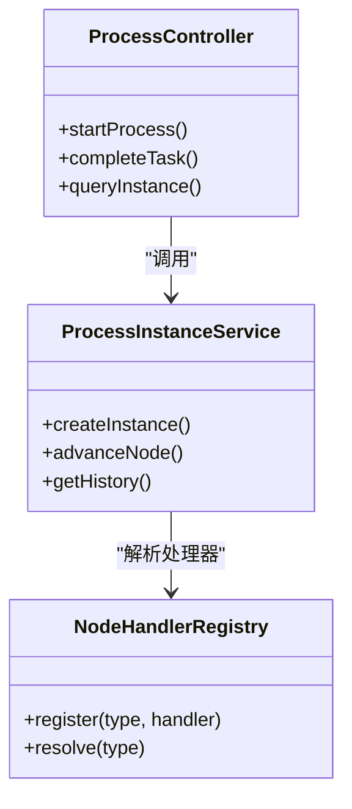
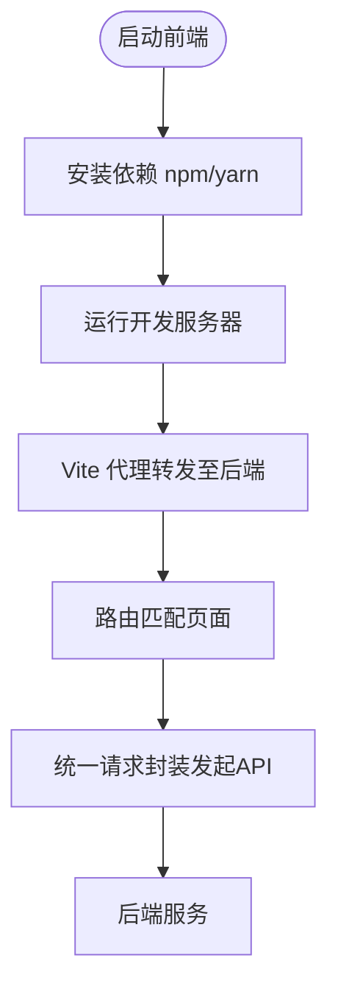
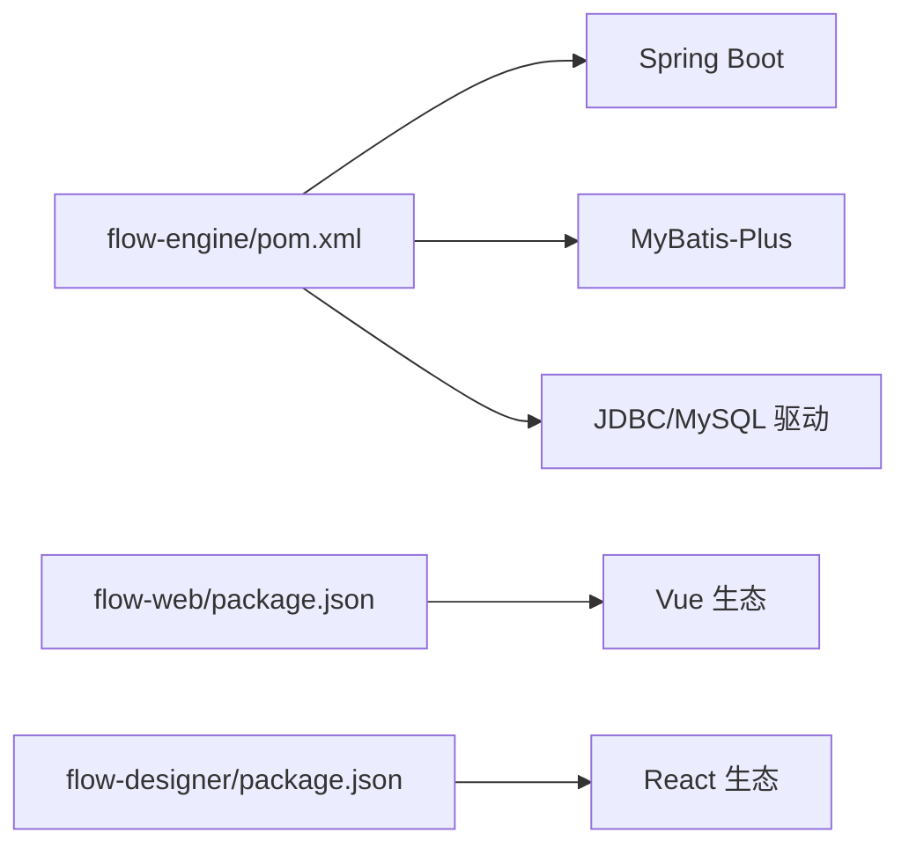
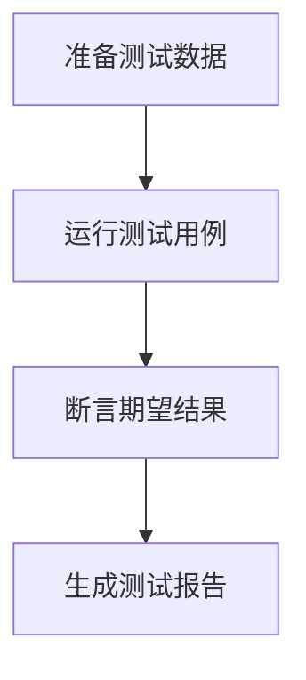

# 开发指南

<cite>
**本文引用的文件**   
- [flow-engine/pom.xml](file://flow-engine/pom.xml)
- [flow-engine/src/main/resources/application.yml](file://flow-engine/src/main/resources/application.yml)
- [flow-engine/src/main/java/com/flow/engine/FlowEngineApplication.java](file://flow-engine/src/main/java/com/flow/engine/FlowEngineApplication.java)
- [flow-engine/src/main/java/com/flow/engine/common/GlobalExceptionHandler.java](file://flow-engine/src/main/java/com/flow/engine/common/GlobalExceptionHandler.java)
- [flow-engine/src/main/java/com/flow/engine/config/WebMvcConfig.java](file://flow-engine/src/main/java/com/flow/engine/config/WebMvcConfig.java)
- [flow-engine/src/main/java/com/flow/engine/controller/ProcessController.java](file://flow-engine/src/main/java/com/flow/engine/controller/ProcessController.java)
- [flow-engine/src/main/java/com/flow/engine/service/ProcessInstanceService.java](file://flow-engine/src/main/java/com/flow/engine/service/ProcessInstanceService.java)
- [flow-engine/src/main/java/com/flow/engine/node/NodeHandlerRegistry.java](file://flow-engine/src/main/java/com/flow/engine/node/NodeHandlerRegistry.java)
- [flow-engine/src/test/resources/application-test.yml](file://flow-engine/src/test/resources/application-test.yml)
- [flow-engine/src/test/java/com/flow/engine/controller/TaskApiTest.java](file://flow-engine/src/test/java/com/flow/engine/controller/TaskApiTest.java)
- [flow-engine/src/test/java/com/flow/engine/service/DeptServiceTest.java](file://flow-engine/src/test/java/com/flow/engine/service/DeptServiceTest.java)
- [flow-engine/src/test/java/com/flow/engine/engine/FlowEngineE2ETest.java](file://flow-engine/src/test/java/com/flow/engine/engine/FlowEngineE2ETest.java)
- [flow-engine/src/main/resources/db/schema.sql](file://flow-engine/src/main/resources/db/schema.sql)
- [flow-web/package.json](file://flow-web/package.json)
- [flow-web/vite.config.js](file://flow-web/vite.config.js)
- [flow-web/src/api/request.js](file://flow-web/src/api/request.js)
- [flow-web/src/router/index.js](file://flow-web/src/router/index.js)
- [flow-designer/package.json](file://flow-designer/package.json)
- [flow-designer/vite.config.js](file://flow-designer/vite.config.js)
- [flow-designer/eslint.config.js](file://flow-designer/eslint.config.js)
</cite>

## 目录
1. [简介](#简介)
2. [项目结构](#项目结构)
3. [核心组件](#核心组件)
4. [架构总览](#架构总览)
5. [详细组件分析](#详细组件分析)
6. [依赖分析](#依赖分析)
7. [性能考虑](#性能考虑)
8. [故障排除指南](#故障排除指南)
9. [结论](#结论)
10. [附录](#附录)

## 简介
本指南面向后端与前端开发者，覆盖本地开发环境搭建、代码规范与约定、测试编写方法、持续集成与部署建议、调试技巧与工具推荐、代码审查与发布策略，以及常见问题排查。目标是帮助团队快速上手并高效协作。

## 项目结构
仓库采用前后端分离的多模块组织：
- flow-engine：基于 Spring Boot 的流程引擎后端服务，提供流程定义、实例、任务等 API，内置节点执行器注册机制与全局异常处理。
- flow-web：Vue 3 + Vite 管理后台前端，包含系统管理、流程监控、任务中心等页面，通过统一请求封装访问后端接口。
- flow-designer：流程设计器前端（React），用于可视化编排流程节点，独立构建与运行。

图表来源
- [flow-engine/src/main/java/com/flow/engine/FlowEngineApplication.java](file://flow-engine/src/main/java/com/flow/engine/FlowEngineApplication.java)
- [flow-engine/src/main/java/com/flow/engine/config/WebMvcConfig.java](file://flow-engine/src/main/java/com/flow/engine/config/WebMvcConfig.java)
- [flow-engine/src/main/java/com/flow/engine/common/GlobalExceptionHandler.java](file://flow-engine/src/main/java/com/flow/engine/common/GlobalExceptionHandler.java)
- [flow-engine/src/main/java/com/flow/engine/service/ProcessInstanceService.java](file://flow-engine/src/main/java/com/flow/engine/service/ProcessInstanceService.java)
- [flow-engine/src/main/java/com/flow/engine/node/NodeHandlerRegistry.java](file://flow-engine/src/main/java/com/flow/engine/node/NodeHandlerRegistry.java)
- [flow-engine/src/main/resources/db/schema.sql](file://flow-engine/src/main/resources/db/schema.sql)
- [flow-web/vite.config.js](file://flow-web/vite.config.js)
- [flow-designer/vite.config.js](file://flow-designer/vite.config.js)

章节来源
- [flow-engine/pom.xml](file://flow-engine/pom.xml)
- [flow-engine/src/main/resources/application.yml](file://flow-engine/src/main/resources/application.yml)
- [flow-engine/src/main/java/com/flow/engine/FlowEngineApplication.java](file://flow-engine/src/main/java/com/flow/engine/FlowEngineApplication.java)
- [flow-engine/src/main/java/com/flow/engine/config/WebMvcConfig.java](file://flow-engine/src/main/java/com/flow/engine/config/WebMvcConfig.java)
- [flow-engine/src/main/java/com/flow/engine/common/GlobalExceptionHandler.java](file://flow-engine/src/main/java/com/flow/engine/common/GlobalExceptionHandler.java)
- [flow-engine/src/main/java/com/flow/engine/service/ProcessInstanceService.java](file://flow-engine/src/main/java/com/flow/engine/service/ProcessInstanceService.java)
- [flow-engine/src/main/java/com/flow/engine/node/NodeHandlerRegistry.java](file://flow-engine/src/main/java/com/flow/engine/node/NodeHandlerRegistry.java)
- [flow-engine/src/main/resources/db/schema.sql](file://flow-engine/src/main/resources/db/schema.sql)
- [flow-web/package.json](file://flow-web/package.json)
- [flow-web/vite.config.js](file://flow-web/vite.config.js)
- [flow-designer/package.json](file://flow-designer/package.json)
- [flow-designer/vite.config.js](file://flow-designer/vite.config.js)

## 核心组件
- 启动入口与配置
  - 应用主类负责引导 Spring Boot 容器加载。
  - WebMvcConfig 集中配置跨域、拦截器等通用能力。
  - GlobalExceptionHandler 统一捕获并返回标准化错误响应。
- 业务流程
  - ProcessController 暴露流程相关 REST API。
  - ProcessInstanceService 实现流程实例的创建、推进、查询等核心逻辑。
  - NodeHandlerRegistry 维护节点处理器注册表，支持扩展自定义节点。
- 数据持久化
  - application.yml 配置数据源、MyBatis-Plus 等。
  - schema.sql 提供初始化建库脚本。

章节来源
- [flow-engine/src/main/java/com/flow/engine/FlowEngineApplication.java](file://flow-engine/src/main/java/com/flow/engine/FlowEngineApplication.java)
- [flow-engine/src/main/java/com/flow/engine/config/WebMvcConfig.java](file://flow-engine/src/main/java/com/flow/engine/config/WebMvcConfig.java)
- [flow-engine/src/main/java/com/flow/engine/common/GlobalExceptionHandler.java](file://flow-engine/src/main/java/com/flow/engine/common/GlobalExceptionHandler.java)
- [flow-engine/src/main/java/com/flow/engine/controller/ProcessController.java](file://flow-engine/src/main/java/com/flow/engine/controller/ProcessController.java)
- [flow-engine/src/main/java/com/flow/engine/service/ProcessInstanceService.java](file://flow-engine/src/main/java/com/flow/engine/service/ProcessInstanceService.java)
- [flow-engine/src/main/java/com/flow/engine/node/NodeHandlerRegistry.java](file://flow-engine/src/main/java/com/flow/engine/node/NodeHandlerRegistry.java)
- [flow-engine/src/main/resources/application.yml](file://flow-engine/src/main/resources/application.yml)
- [flow-engine/src/main/resources/db/schema.sql](file://flow-engine/src/main/resources/db/schema.sql)

## 架构总览
后端采用分层架构：控制器层接收请求，服务层承载业务，节点执行器按类型分发到具体处理器；前端通过 HTTP 调用后端接口。

图表来源
- [flow-engine/src/main/java/com/flow/engine/controller/ProcessController.java](file://flow-engine/src/main/java/com/flow/engine/controller/ProcessController.java)
- [flow-engine/src/main/java/com/flow/engine/service/ProcessInstanceService.java](file://flow-engine/src/main/java/com/flow/engine/service/ProcessInstanceService.java)
- [flow-engine/src/main/java/com/flow/engine/node/NodeHandlerRegistry.java](file://flow-engine/src/main/java/com/flow/engine/node/NodeHandlerRegistry.java)

## 详细组件分析

### 后端启动与配置
- 启动入口
  - 应用主类负责扫描包与自动装配。
- Web 配置
  - 跨域、路径前缀、静态资源映射等在 WebMvcConfig 中集中管理。
- 异常处理
  - GlobalExceptionHandler 捕获运行时异常与业务异常，转换为统一 Result 结构。

图表来源
- [flow-engine/src/main/java/com/flow/engine/FlowEngineApplication.java](file://flow-engine/src/main/java/com/flow/engine/FlowEngineApplication.java)
- [flow-engine/src/main/java/com/flow/engine/config/WebMvcConfig.java](file://flow-engine/src/main/java/com/flow/engine/config/WebMvcConfig.java)
- [flow-engine/src/main/java/com/flow/engine/common/GlobalExceptionHandler.java](file://flow-engine/src/main/java/com/flow/engine/common/GlobalExceptionHandler.java)

章节来源
- [flow-engine/src/main/java/com/flow/engine/FlowEngineApplication.java](file://flow-engine/src/main/java/com/flow/engine/FlowEngineApplication.java)
- [flow-engine/src/main/java/com/flow/engine/config/WebMvcConfig.java](file://flow-engine/src/main/java/com/flow/engine/config/WebMvcConfig.java)
- [flow-engine/src/main/java/com/flow/engine/common/GlobalExceptionHandler.java](file://flow-engine/src/main/java/com/flow/engine/common/GlobalExceptionHandler.java)

### 流程控制与服务
- 控制器
  - ProcessController 暴露流程定义、实例、任务等接口。
- 服务层
  - ProcessInstanceService 封装流程实例生命周期管理与状态流转。
- 节点执行器
  - NodeHandlerRegistry 维护节点处理器集合，支持动态扩展。

图表来源
- [flow-engine/src/main/java/com/flow/engine/controller/ProcessController.java](file://flow-engine/src/main/java/com/flow/engine/controller/ProcessController.java)
- [flow-engine/src/main/java/com/flow/engine/service/ProcessInstanceService.java](file://flow-engine/src/main/java/com/flow/engine/service/ProcessInstanceService.java)
- [flow-engine/src/main/java/com/flow/engine/node/NodeHandlerRegistry.java](file://flow-engine/src/main/java/com/flow/engine/node/NodeHandlerRegistry.java)

章节来源
- [flow-engine/src/main/java/com/flow/engine/controller/ProcessController.java](file://flow-engine/src/main/java/com/flow/engine/controller/ProcessController.java)
- [flow-engine/src/main/java/com/flow/engine/service/ProcessInstanceService.java](file://flow-engine/src/main/java/com/flow/engine/service/ProcessInstanceService.java)
- [flow-engine/src/main/java/com/flow/engine/node/NodeHandlerRegistry.java](file://flow-engine/src/main/java/com/flow/engine/node/NodeHandlerRegistry.java)

### 前端工程与路由
- 管理后台（Vue）
  - 使用 Vite 构建，package.json 定义依赖与脚本。
  - vite.config.js 配置代理、别名、插件等。
  - src/api/request.js 统一封装请求（如 baseURL、拦截器）。
  - src/router/index.js 定义页面路由。
- 流程设计器（React）
  - 独立 Vite 工程，eslint.config.js 提供 ESLint 规则。

图表来源
- [flow-web/package.json](file://flow-web/package.json)
- [flow-web/vite.config.js](file://flow-web/vite.config.js)
- [flow-web/src/api/request.js](file://flow-web/src/api/request.js)
- [flow-web/src/router/index.js](file://flow-web/src/router/index.js)
- [flow-designer/package.json](file://flow-designer/package.json)
- [flow-designer/vite.config.js](file://flow-designer/vite.config.js)
- [flow-designer/eslint.config.js](file://flow-designer/eslint.config.js)

章节来源
- [flow-web/package.json](file://flow-web/package.json)
- [flow-web/vite.config.js](file://flow-web/vite.config.js)
- [flow-web/src/api/request.js](file://flow-web/src/api/request.js)
- [flow-web/src/router/index.js](file://flow-web/src/router/index.js)
- [flow-designer/package.json](file://flow-designer/package.json)
- [flow-designer/vite.config.js](file://flow-designer/vite.config.js)
- [flow-designer/eslint.config.js](file://flow-designer/eslint.config.js)

## 依赖分析
- 后端依赖
  - pom.xml 声明了 Spring Boot、MyBatis-Plus、数据库驱动等依赖。
- 前端依赖
  - flow-web 与 flow-designer 各自维护 package.json，分别管理 Vue/React 生态依赖。

图表来源
- [flow-engine/pom.xml](file://flow-engine/pom.xml)
- [flow-web/package.json](file://flow-web/package.json)
- [flow-designer/package.json](file://flow-designer/package.json)

章节来源
- [flow-engine/pom.xml](file://flow-engine/pom.xml)
- [flow-web/package.json](file://flow-web/package.json)
- [flow-designer/package.json](file://flow-designer/package.json)

## 性能考虑
- 后端
  - 合理分页与索引优化，避免 N+1 查询。
  - 热点数据缓存（如字典、权限）减少数据库压力。
  - 异步处理耗时任务（如 Webhook 调度）。
- 前端
  - 路由懒加载与组件按需引入。
  - 列表虚拟滚动与分页加载。
  - 图片与静态资源 CDN 加速。

[本节为通用指导，不直接分析具体文件]

## 故障排除指南
- 启动失败
  - 检查 application.yml 中的数据库连接、端口占用。
  - 确认 schema.sql 已正确初始化。
- 接口报错
  - 查看 GlobalExceptionHandler 的统一错误输出。
  - 使用浏览器网络面板或 Postman 复现问题。
- 跨域问题
  - 核对 WebMvcConfig 的跨域配置是否放行前端域名。
- 前端无法访问后端
  - 检查 vite.config.js 的代理配置与后端实际端口。
  - 确认 request.js 的 baseURL 指向正确。

章节来源
- [flow-engine/src/main/resources/application.yml](file://flow-engine/src/main/resources/application.yml)
- [flow-engine/src/main/resources/db/schema.sql](file://flow-engine/src/main/resources/db/schema.sql)
- [flow-engine/src/main/java/com/flow/engine/common/GlobalExceptionHandler.java](file://flow-engine/src/main/java/com/flow/engine/common/GlobalExceptionHandler.java)
- [flow-engine/src/main/java/com/flow/engine/config/WebMvcConfig.java](file://flow-engine/src/main/java/com/flow/engine/config/WebMvcConfig.java)
- [flow-web/vite.config.js](file://flow-web/vite.config.js)
- [flow-web/src/api/request.js](file://flow-web/src/api/request.js)

## 结论
本指南提供了从环境搭建到开发规范、测试、CI/CD、调试与排障的全链路参考。遵循本文档可显著提升团队协作效率与交付质量。

[本节为总结性内容，不直接分析具体文件]

## 附录

### 开发环境搭建步骤
- 基础环境
  - JDK 17+、Maven、Node.js 18+、npm/yarn、MySQL 8.x。
- 后端
  - 克隆仓库后进入 flow-engine。
  - 在 application.yml 中配置数据库连接。
  - 执行 schema.sql 初始化数据库。
  - 使用 IDE 运行 FlowEngineApplication 主类。
- 前端
  - 进入 flow-web，安装依赖并启动开发服务器。
  - 如需流程设计器，进入 flow-designer 安装依赖并启动。
- IDE 配置
  - Java：启用 Lombok（若使用）、Spring Boot 插件、MyBatis-Plus 插件。
  - Vue：安装 Volar、ESLint、Prettier。
  - React：安装 ESLint、Prettier、Flow Designer 的 eslint.config.js 规则生效。

章节来源
- [flow-engine/src/main/resources/application.yml](file://flow-engine/src/main/resources/application.yml)
- [flow-engine/src/main/resources/db/schema.sql](file://flow-engine/src/main/resources/db/schema.sql)
- [flow-engine/src/main/java/com/flow/engine/FlowEngineApplication.java](file://flow-engine/src/main/java/com/flow/engine/FlowEngineApplication.java)
- [flow-web/package.json](file://flow-web/package.json)
- [flow-web/vite.config.js](file://flow-web/vite.config.js)
- [flow-designer/package.json](file://flow-designer/package.json)
- [flow-designer/vite.config.js](file://flow-designer/vite.config.js)
- [flow-designer/eslint.config.js](file://flow-designer/eslint.config.js)

### 代码规范与开发约定
- Java 编码规范
  - 命名：类名大驼峰，方法与变量小驼峰，常量全大写加下划线。
  - 包结构：controller/service/mapper/entity/dto/config 分层清晰。
  - 异常：业务异常继承统一基类，由 GlobalExceptionHandler 统一处理。
  - 日志：关键路径打印结构化日志，敏感信息脱敏。
- Vue.js 开发标准
  - 组件单文件结构：template/script/style 分离。
  - 路由与状态：router/index.js 统一管理，stores 集中状态。
  - 请求封装：request.js 统一 baseURL、拦截器与错误提示。
- Git 分支管理
  - main：稳定版本。
  - develop：集成开发分支。
  - feature/*：功能分支。
  - hotfix/*：紧急修复分支。
  - release/*：预发布分支。

章节来源
- [flow-engine/src/main/java/com/flow/engine/common/GlobalExceptionHandler.java](file://flow-engine/src/main/java/com/flow/engine/common/GlobalExceptionHandler.java)
- [flow-web/src/router/index.js](file://flow-web/src/router/index.js)
- [flow-web/src/api/request.js](file://flow-web/src/api/request.js)

### 单元测试与集成测试
- 编写原则
  - 单元：最小粒度，隔离外部依赖，关注输入输出与边界条件。
  - 集成：验证多组件协作，使用测试配置文件与内存/测试数据库。
- Mock 数据准备
  - 使用 @MockBean 或 Testcontainers 模拟外部服务。
  - 准备 JSON 样例与 SQL 种子数据。
- 示例位置
  - 控制器 API 测试：TaskApiTest。
  - 服务层测试：DeptServiceTest。
  - 端到端测试：FlowEngineE2ETest。
  - 测试配置：application-test.yml。

章节来源
- [flow-engine/src/test/java/com/flow/engine/controller/TaskApiTest.java](file://flow-engine/src/test/java/com/flow/engine/controller/TaskApiTest.java)
- [flow-engine/src/test/java/com/flow/engine/service/DeptServiceTest.java](file://flow-engine/src/test/java/com/flow/engine/service/DeptServiceTest.java)
- [flow-engine/src/test/java/com/flow/engine/engine/FlowEngineE2ETest.java](file://flow-engine/src/test/java/com/flow/engine/engine/FlowEngineE2ETest.java)
- [flow-engine/src/test/resources/application-test.yml](file://flow-engine/src/test/resources/application-test.yml)

### 持续集成与持续部署（建议）
- 自动化构建
  - Maven 构建后端，npm/yarn 构建前端。
- 自动化测试
  - 执行单元测试与集成测试，生成覆盖率报告。
- 制品发布
  - 打包 Docker 镜像，推送至镜像仓库。
- 部署流水线
  - 蓝绿/金丝雀发布，健康检查与回滚策略。
- 建议工具
  - GitHub Actions/GitLab CI/Jenkins。
  - SonarQube 代码质量门禁。
  - Harbor/Nexus 制品仓库。

[本节为通用指导，不直接分析具体文件]

### 调试技巧与开发工具
- 日志调试
  - 调整 application.yml 日志级别，定位关键链路。
- 接口测试
  - Postman/Apifox 构造请求，保存环境与变量。
- 性能分析
  - 后端：Arthas、Micrometer + Prometheus + Grafana。
  - 前端：Chrome DevTools Performance/Lighthouse。
- 数据库
  - DBeaver/DataGrip 连接测试库，回放慢查询。

章节来源
- [flow-engine/src/main/resources/application.yml](file://flow-engine/src/main/resources/application.yml)

### 代码审查流程与发布管理
- 代码审查
  - 提交 MR/PR，至少一名 reviewer 批准。
  - 强制通过 CI 检查（编译、测试、Lint）。
- 发布策略
  - 版本号遵循语义化版本。
  - 变更日志记录重要更新与破坏性变更。
  - 灰度发布与回滚预案。

[本节为通用指导，不直接分析具体文件]

### 常见问题解答
- 端口冲突
  - 修改 application.yml 或 vite.config.js 的端口。
- 跨域失败
  - 检查 WebMvcConfig 的允许来源与方法。
- 数据库连接失败
  - 校验用户名、密码、URL、时区与字符集。
- 前端代理无效
  - 确认 vite.config.js 的 proxy 目标地址与协议。

章节来源
- [flow-engine/src/main/resources/application.yml](file://flow-engine/src/main/resources/application.yml)
- [flow-engine/src/main/java/com/flow/engine/config/WebMvcConfig.java](file://flow-engine/src/main/java/com/flow/engine/config/WebMvcConfig.java)
- [flow-web/vite.config.js](file://flow-web/vite.config.js)