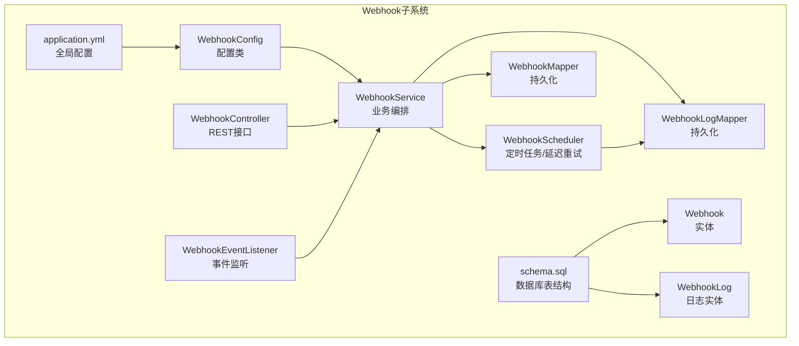
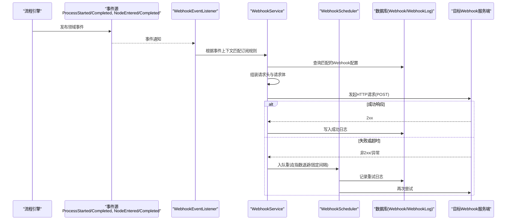
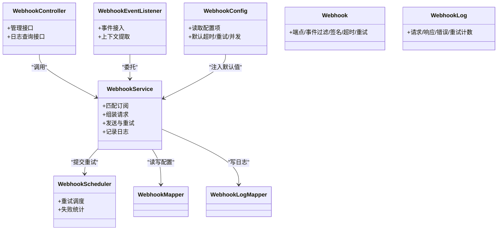

# Webhook事件集成

<cite>
**本文引用的文件**   
- [WebhookConfig.java](file://flow-engine/src/main/java/com/flow/engine/config/WebhookConfig.java)
- [WebhookController.java](file://flow-engine/src/main/java/com/flow/engine/controllers/WebhookController.java)
- [WebhookService.java](file://flow-engine/src/main/java/com/flow/engine/service/WebhookService.java)
- [WebhookScheduler.java](file://flow-engine/src/main/java/com/flow/engine/service/WebhookScheduler.java)
- [WebhookEventListener.java](file://flow-engine/src/main/java/com/flow/engine/listener/WebhookEventListener.java)
- [Webhook.java](file://flow-engine/src/main/java/com/flow/engine/entity/Webhook.java)
- [WebhookLog.java](file://flow-engine/src/main/java/com/flow/engine/entity/WebhookLog.java)
- [WebhookMapper.java](file://flow-engine/src/main/java/com/flow/engine/mapper/WebhookMapper.java)
- [WebhookLogMapper.java](file://flow-engine/src/main/java/com/flow/engine/mapper/WebhookLogMapper.java)
- [WebhookRequest.java](file://flow-engine/src/main/java/com/flow/engine/dto/WebhookRequest.java)
- [WebhookResponse.java](file://flow-engine/src/main/java/com/flow/engine/dto/WebhookResponse.java)
- [WebhookLogResponse.java](file://flow-engine/src/main/java/com/flow/engine/dto/WebhookLogResponse.java)
- [ProcessStartedEvent.java](file://flow-engine/src/main/java/com/flow/engine/event/ProcessStartedEvent.java)
- [ProcessCompletedEvent.java](file://flow-engine/src/main/java/com/flow/engine/event/ProcessCompletedEvent.java)
- [NodeEnteredEvent.java](file://flow-engine/src/main/java/com/flow/engine/event/NodeEnteredEvent.java)
- [NodeCompletedEvent.java](file://flow-engine/src/main/java/com/flow/engine/event/NodeCompletedEvent.java)
- [application.yml](file://flow-engine/src/main/resources/application.yml)
- [schema.sql](file://flow-engine/src/main/resources/db/schema.sql)
- [WebhookApiTest.java](file://flow-engine/src/test/java/com/flow/engine/controllers/WebhookApiTest.java)
</cite>

## 目录
1. [简介](#简介)
2. [项目结构](#项目结构)
3. [核心组件](#核心组件)
4. [架构总览](#架构总览)
5. [详细组件分析](#详细组件分析)
6. [依赖关系分析](#依赖关系分析)
7. [性能考虑](#性能考虑)
8. [故障排查指南](#故障排查指南)
9. [结论](#结论)
10. [附录](#附录)

## 简介
本文件面向需要集成与使用系统Webhook能力的开发者与管理员，系统性说明Webhook事件的订阅机制、触发时机、请求格式规范、回调处理逻辑、配置CRUD能力（端点管理、重试与超时）、事件类型清单与安全策略（签名验证、IP白名单、HTTPS），并提供监控指标与排障建议。文档内容严格基于仓库源码与资源文件进行分析与总结。

## 项目结构
Webhook相关能力集中在后端模块 flow-engine 中，主要涉及配置、控制器、服务、调度器、事件监听器、实体与映射层以及测试用例。前端模块 flow-web 提供后台管理界面用于Webhook配置的可视化管理。

图表来源
- [WebhookConfig.java](file://flow-engine/src/main/java/com/flow/engine/config/WebhookConfig.java)
- [WebhookController.java](file://flow-engine/src/main/java/com/flow/engine/controllers/WebhookController.java)
- [WebhookService.java](file://flow-engine/src/main/java/com/flow/engine/service/WebhookService.java)
- [WebhookScheduler.java](file://flow-engine/src/main/java/com/flow/engine/service/WebhookScheduler.java)
- [WebhookEventListener.java](file://flow-engine/src/main/java/com/flow/engine/listener/WebhookEventListener.java)
- [Webhook.java](file://flow-engine/src/main/java/com/flow/engine/entity/Webhook.java)
- [WebhookLog.java](file://flow-engine/src/main/java/com/flow/engine/entity/WebhookLog.java)
- [WebhookMapper.java](file://flow-engine/src/main/java/com/flow/engine/mapper/WebhookMapper.java)
- [WebhookLogMapper.java](file://flow-engine/src/main/java/com/flow/engine/mapper/WebhookLogMapper.java)
- [application.yml](file://flow-engine/src/main/resources/application.yml)
- [schema.sql](file://flow-engine/src/main/resources/db/schema.sql)

章节来源
- [WebhookConfig.java](file://flow-engine/src/main/java/com/flow/engine/config/WebhookConfig.java)
- [WebhookController.java](file://flow-engine/src/main/java/com/flow/engine/controllers/WebhookController.java)
- [WebhookService.java](file://flow-engine/src/main/java/com/flow/engine/service/WebhookService.java)
- [WebhookScheduler.java](file://flow-engine/src/main/java/com/flow/engine/service/WebhookScheduler.java)
- [WebhookEventListener.java](file://flow-engine/src/main/java/com/flow/engine/listener/WebhookEventListener.java)
- [Webhook.java](file://flow-engine/src/main/java/com/flow/engine/entity/Webhook.java)
- [WebhookLog.java](file://flow-engine/src/main/java/com/flow/engine/entity/WebhookLog.java)
- [WebhookMapper.java](file://flow-engine/src/main/java/com/flow/engine/mapper/WebhookMapper.java)
- [WebhookLogMapper.java](file://flow-engine/src/main/java/com/flow/engine/mapper/WebhookLogMapper.java)
- [application.yml](file://flow-engine/src/main/resources/application.yml)
- [schema.sql](file://flow-engine/src/main/resources/db/schema.sql)

## 核心组件
- 配置中心：集中管理Webhook开关、默认超时、重试次数、并发度等参数。
- 控制器：暴露Webhook配置与日志的REST API，供后台管理与外部调用。
- 服务层：负责匹配订阅规则、构建请求体、发起HTTP调用、记录结果与错误。
- 调度器：实现失败重试与延迟投递，保障最终一致性。
- 事件监听器：在流程节点或实例生命周期事件发生时，触发Webhook投递。
- 数据模型：Webhook定义与WebhookLog日志实体，配合MyBatis Mapper进行持久化。
- 测试用例：覆盖关键API路径与异常分支，确保行为稳定。

章节来源
- [WebhookConfig.java](file://flow-engine/src/main/java/com/flow/engine/config/WebhookConfig.java)
- [WebhookController.java](file://flow-engine/src/main/java/com/flow/engine/controllers/WebhookController.java)
- [WebhookService.java](file://flow-engine/src/main/java/com/flow/engine/service/WebhookService.java)
- [WebhookScheduler.java](file://flow-engine/src/main/java/com/flow/engine/service/WebhookScheduler.java)
- [WebhookEventListener.java](file://flow-engine/src/main/java/com/flow/engine/listener/WebhookEventListener.java)
- [Webhook.java](file://flow-engine/src/main/java/com/flow/engine/entity/Webhook.java)
- [WebhookLog.java](file://flow-engine/src/main/java/com/flow/engine/entity/WebhookLog.java)
- [WebhookMapper.java](file://flow-engine/src/main/java/com/flow/engine/mapper/WebhookMapper.java)
- [WebhookLogMapper.java](file://flow-engine/src/main/java/com/flow/engine/mapper/WebhookLogMapper.java)

## 架构总览
下图展示了从事件产生到Webhook回调执行的端到端流程，包括订阅匹配、请求构造、发送、重试与日志落库。

图表来源
- [WebhookEventListener.java](file://flow-engine/src/main/java/com/flow/engine/listener/WebhookEventListener.java)
- [WebhookService.java](file://flow-engine/src/main/java/com/flow/engine/service/WebhookService.java)
- [WebhookScheduler.java](file://flow-engine/src/main/java/com/flow/engine/service/WebhookScheduler.java)
- [Webhook.java](file://flow-engine/src/main/java/com/flow/engine/entity/Webhook.java)
- [WebhookLog.java](file://flow-engine/src/main/java/com/flow/engine/entity/WebhookLog.java)
- [ProcessStartedEvent.java](file://flow-engine/src/main/java/com/flow/engine/event/ProcessStartedEvent.java)
- [ProcessCompletedEvent.java](file://flow-engine/src/main/java/com/flow/engine/event/ProcessCompletedEvent.java)
- [NodeEnteredEvent.java](file://flow-engine/src/main/java/com/flow/engine/event/NodeEnteredEvent.java)
- [NodeCompletedEvent.java](file://flow-engine/src/main/java/com/flow/engine/event/NodeCompletedEvent.java)

## 详细组件分析

### 事件监听与触发时机
- 事件类型
  - 流程启动：ProcessStartedEvent
  - 流程完成：ProcessCompletedEvent
  - 节点进入：NodeEnteredEvent
  - 节点完成：NodeCompletedEvent
- 监听器职责
  - 接收上述事件，提取上下文（流程ID、节点ID、变量快照等）
  - 依据订阅规则（如事件类型、流程定义标识、节点标识、表达式过滤）匹配Webhook配置
  - 将待投递任务交给服务层统一处理
- 触发时机
  - 在流程引擎执行相应阶段时发布事件，监听器异步消费，避免阻塞主流程

章节来源
- [WebhookEventListener.java](file://flow-engine/src/main/java/com/flow/engine/listener/WebhookEventListener.java)
- [ProcessStartedEvent.java](file://flow-engine/src/main/java/com/flow/engine/event/ProcessStartedEvent.java)
- [ProcessCompletedEvent.java](file://flow-engine/src/main/java/com/flow/engine/event/ProcessCompletedEvent.java)
- [NodeEnteredEvent.java](file://flow-engine/src/main/java/com/flow/engine/event/NodeEnteredEvent.java)
- [NodeCompletedEvent.java](file://flow-engine/src/main/java/com/flow/engine/event/NodeCompletedEvent.java)

### Webhook服务与调度
- 服务层
  - 加载并缓存匹配到的Webhook配置
  - 组装HTTP请求（方法、URL、头部、Body）
  - 发起网络调用，捕获异常与超时
  - 记录成功/失败日志，必要时提交至调度器重试
- 调度器
  - 支持失败重试策略（可配置最大重试次数、间隔时间、是否指数退避）
  - 将重试任务持久化，按周期扫描并重新投递
  - 对重复失败的任务进行告警或降级处理（由具体实现决定）

章节来源
- [WebhookService.java](file://flow-engine/src/main/java/com/flow/engine/service/WebhookService.java)
- [WebhookScheduler.java](file://flow-engine/src/main/java/com/flow/engine/service/WebhookScheduler.java)

### REST接口与请求格式
- 管理接口
  - 提供Webhook配置的增删改查与状态启停
  - 提供Webhook日志查询与导出
- 回调接口
  - 统一采用HTTP POST方法
  - URL模式由Webhook配置中的“目标地址”决定
  - 请求头包含鉴权与追踪信息（如签名、请求ID、内容类型）
  - 请求体为JSON，包含事件元数据与业务上下文
- 成功与错误响应
  - 成功：返回2xx状态码
  - 失败：返回非2xx或抛出异常，服务层记录日志并触发重试

章节来源
- [WebhookController.java](file://flow-engine/src/main/java/com/flow/engine/controllers/WebhookController.java)
- [WebhookRequest.java](file://flow-engine/src/main/java/com/flow/engine/dto/WebhookRequest.java)
- [WebhookResponse.java](file://flow-engine/src/main/java/com/flow/engine/dto/WebhookResponse.java)
- [WebhookLogResponse.java](file://flow-engine/src/main/java/com/flow/engine/dto/WebhookLogResponse.java)

### 配置CRUD与运行时参数
- 配置项
  - 端点URL、启用状态、事件类型过滤、签名密钥、超时时间、重试次数、并发度等
- 持久化
  - Webhook实体与WebhookLog实体通过Mapper访问数据库
- 运行时参数
  - 通过配置文件注入默认值，支持热更新（若实现支持）

章节来源
- [Webhook.java](file://flow-engine/src/main/java/com/flow/engine/entity/Webhook.java)
- [WebhookLog.java](file://flow-engine/src/main/java/com/flow/engine/entity/WebhookLog.java)
- [WebhookMapper.java](file://flow-engine/src/main/java/com/flow/engine/mapper/WebhookMapper.java)
- [WebhookLogMapper.java](file://flow-engine/src/main/java/com/flow/engine/mapper/WebhookLogMapper.java)
- [WebhookConfig.java](file://flow-engine/src/main/java/com/flow/engine/config/WebhookConfig.java)
- [application.yml](file://flow-engine/src/main/resources/application.yml)
- [schema.sql](file://flow-engine/src/main/resources/db/schema.sql)

### 安全策略
- HTTPS强制
  - 要求目标地址使用HTTPS，防止中间人攻击
- 签名验证
  - 服务端生成签名（如HMAC-SHA256），客户端校验；或服务端校验来自上游的签名
- IP白名单
  - 可在网关或反向代理层限制来源IP，仅允许受信任网段访问回调入口
- 最小权限
  - 仅开放必要的管理接口，结合认证与授权控制

章节来源
- [WebhookConfig.java](file://flow-engine/src/main/java/com/flow/engine/config/WebhookConfig.java)
- [WebhookController.java](file://flow-engine/src/main/java/com/flow/engine/controllers/WebhookController.java)

### 监控与指标
- 基础指标
  - 投递总量、成功数、失败数、重试次数、平均耗时、P95/P99耗时
- 日志与审计
  - WebhookLog记录每次调用的请求摘要、响应状态、错误堆栈、重试次数
- 告警
  - 连续失败阈值、超时比例、慢调用比例超过阈值时触发告警

章节来源
- [WebhookLog.java](file://flow-engine/src/main/java/com/flow/engine/entity/WebhookLog.java)
- [WebhookLogMapper.java](file://flow-engine/src/main/java/com/flow/engine/mapper/WebhookLogMapper.java)
- [WebhookScheduler.java](file://flow-engine/src/main/java/com/flow/engine/service/WebhookScheduler.java)

## 依赖关系分析

图表来源
- [WebhookConfig.java](file://flow-engine/src/main/java/com/flow/engine/config/WebhookConfig.java)
- [WebhookController.java](file://flow-engine/src/main/java/com/flow/engine/controllers/WebhookController.java)
- [WebhookService.java](file://flow-engine/src/main/java/com/flow/engine/service/WebhookService.java)
- [WebhookScheduler.java](file://flow-engine/src/main/java/com/flow/engine/service/WebhookScheduler.java)
- [WebhookEventListener.java](file://flow-engine/src/main/java/com/flow/engine/listener/WebhookEventListener.java)
- [Webhook.java](file://flow-engine/src/main/java/com/flow/engine/entity/Webhook.java)
- [WebhookLog.java](file://flow-engine/src/main/java/com/flow/engine/entity/WebhookLog.java)
- [WebhookMapper.java](file://flow-engine/src/main/java/com/flow/engine/mapper/WebhookMapper.java)
- [WebhookLogMapper.java](file://flow-engine/src/main/java/com/flow/engine/mapper/WebhookLogMapper.java)

章节来源
- [WebhookConfig.java](file://flow-engine/src/main/java/com/flow/engine/config/WebhookConfig.java)
- [WebhookController.java](file://flow-engine/src/main/java/com/flow/engine/controllers/WebhookController.java)
- [WebhookService.java](file://flow-engine/src/main/java/com/flow/engine/service/WebhookService.java)
- [WebhookScheduler.java](file://flow-engine/src/main/java/com/flow/engine/service/WebhookScheduler.java)
- [WebhookEventListener.java](file://flow-engine/src/main/java/com/flow/engine/listener/WebhookEventListener.java)
- [Webhook.java](file://flow-engine/src/main/java/com/flow/engine/entity/Webhook.java)
- [WebhookLog.java](file://flow-engine/src/main/java/com/flow/engine/entity/WebhookLog.java)
- [WebhookMapper.java](file://flow-engine/src/main/java/com/flow/engine/mapper/WebhookMapper.java)
- [WebhookLogMapper.java](file://flow-engine/src/main/java/com/flow/engine/mapper/WebhookLogMapper.java)

## 性能考虑
- 异步解耦：事件监听与服务发送分离，避免阻塞流程主线程
- 批量与限流：对高吞吐场景可引入批量发送与令牌桶限流
- 连接池与超时：合理设置HTTP连接池大小与读写超时，避免资源耗尽
- 重试策略：采用指数退避与抖动，降低雪崩风险
- 幂等性：目标端应支持幂等处理，避免重复投递导致副作用

[本节为通用指导，不直接分析具体文件]

## 故障排查指南
- 常见问题
  - 目标地址不可达或证书错误：检查HTTPS证书链与域名解析
  - 签名校验失败：核对签名算法、密钥与时序参数
  - 超时频繁：调整超时阈值与目标端处理能力
  - 重试风暴：检查重试上限与退避策略
- 定位手段
  - 查看Webhook日志，关注状态码、错误堆栈与重试次数
  - 对比事件上下文与订阅规则，确认是否命中预期配置
  - 使用测试用例模拟请求，快速验证接口连通性与鉴权
- 恢复建议
  - 临时关闭问题订阅，优先恢复其他正常通道
  - 清理积压重试任务，逐步恢复投递

章节来源
- [WebhookLog.java](file://flow-engine/src/main/java/com/flow/engine/entity/WebhookLog.java)
- [WebhookLogMapper.java](file://flow-engine/src/main/java/com/flow/engine/mapper/WebhookLogMapper.java)
- [WebhookScheduler.java](file://flow-engine/src/main/java/com/flow/engine/service/WebhookScheduler.java)
- [WebhookApiTest.java](file://flow-engine/src/test/java/com/flow/engine/controllers/WebhookApiTest.java)

## 结论
本方案以事件驱动为核心，通过监听器、服务层与调度器的协作，实现了可靠、可扩展的Webhook事件集成。配合完善的配置管理、安全策略与监控指标，能够满足生产环境对稳定性与可观测性的要求。建议在上线前完成端到端联调与压测，完善告警与回滚预案。

[本节为总结性内容，不直接分析具体文件]

## 附录

### Webhook事件类型清单
- 流程启动：ProcessStartedEvent
- 流程完成：ProcessCompletedEvent
- 节点进入：NodeEnteredEvent
- 节点完成：NodeCompletedEvent

章节来源
- [ProcessStartedEvent.java](file://flow-engine/src/main/java/com/flow/engine/event/ProcessStartedEvent.java)
- [ProcessCompletedEvent.java](file://flow-engine/src/main/java/com/flow/engine/event/ProcessCompletedEvent.java)
- [NodeEnteredEvent.java](file://flow-engine/src/main/java/com/flow/engine/event/NodeEnteredEvent.java)
- [NodeCompletedEvent.java](file://flow-engine/src/main/java/com/flow/engine/event/NodeCompletedEvent.java)

### 请求格式规范
- 方法：POST
- URL：由Webhook配置的目标地址决定
- 请求头：
  - Content-Type: application/json
  - X-Trace-Id: 请求追踪ID
  - X-Signature: 签名值（可选，取决于配置）
- 请求体：
  - event_type: 事件类型
  - timestamp: 事件时间戳
  - process_id: 流程实例ID
  - node_id: 节点ID（部分事件携带）
  - payload: 业务上下文（键值对）

章节来源
- [WebhookRequest.java](file://flow-engine/src/main/java/com/flow/engine/dto/WebhookRequest.java)
- [WebhookController.java](file://flow-engine/src/main/java/com/flow/engine/controllers/WebhookController.java)

### 回调处理逻辑
- 成功：返回2xx状态码
- 失败：返回非2xx或抛异常，服务层记录日志并触发重试
- 幂等：目标端需基于唯一键去重处理

章节来源
- [WebhookService.java](file://flow-engine/src/main/java/com/flow/engine/service/WebhookService.java)
- [WebhookScheduler.java](file://flow-engine/src/main/java/com/flow/engine/service/WebhookScheduler.java)

### 配置CRUD要点
- 新增：填写目标地址、选择事件类型、配置签名密钥、超时与重试
- 修改：动态调整超时、重试与并发度
- 删除：停止投递并归档历史日志
- 启停：快速屏蔽问题订阅

章节来源
- [WebhookController.java](file://flow-engine/src/main/java/com/flow/engine/controllers/WebhookController.java)
- [Webhook.java](file://flow-engine/src/main/java/com/flow/engine/entity/Webhook.java)
- [WebhookMapper.java](file://flow-engine/src/main/java/com/flow/engine/mapper/WebhookMapper.java)

### 安全清单
- 强制HTTPS
- 签名校验（HMAC-SHA256或同等级算法）
- IP白名单（网关/反向代理层）
- 最小权限与访问控制

章节来源
- [WebhookConfig.java](file://flow-engine/src/main/java/com/flow/engine/config/WebhookConfig.java)
- [WebhookController.java](file://flow-engine/src/main/java/com/flow/engine/controllers/WebhookController.java)

### 监控指标建议
- 投递成功率、失败率、重试率
- 平均/分位耗时
- 队列积压与重试堆积
- 错误分类（超时、签名失败、网络异常等）

章节来源
- [WebhookLog.java](file://flow-engine/src/main/java/com/flow/engine/entity/WebhookLog.java)
- [WebhookLogMapper.java](file://flow-engine/src/main/java/com/flow/engine/mapper/WebhookLogMapper.java)
- [WebhookScheduler.java](file://flow-engine/src/main/java/com/flow/engine/service/WebhookScheduler.java)