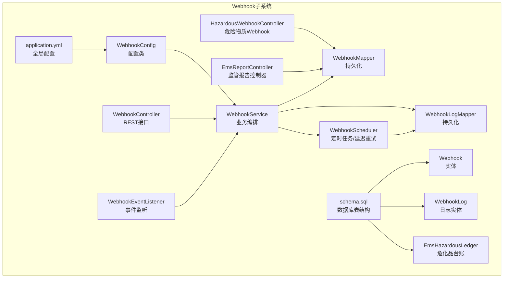
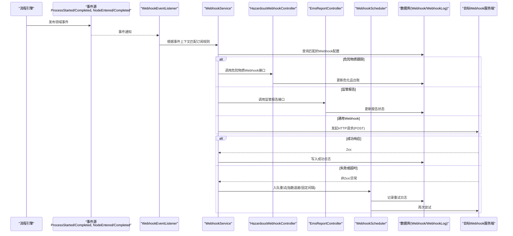
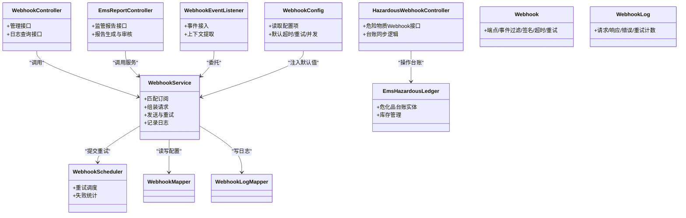

# Webhook事件集成

<cite>
**本文引用的文件**   
- [WebhookConfig.java](file://flow-engine/src/main/java/com/flow/engine/config/WebhookConfig.java)
- [WebhookController.java](file://flow-engine/src/main/java/com/flow/engine/controllers/WebhookController.java)
- [HazardousWebhookController.java](file://flow-engine/src/main/java/com/flow/engine/controllers/HazardousWebhookController.java)
- [EmsReportController.java](file://flow-engine/src/main/java/com/flow/engine/controllers/EmsReportController.java)
- [WebhookService.java](file://flow-engine/src/main/java/com/flow/engine/service/WebhookService.java)
- [WebhookScheduler.java](file://flow-engine/src/main/java/com/flow/engine/service/WebhookScheduler.java)
- [WebhookEventListener.java](file://flow-engine/src/main/java/com/flow/engine/listener/WebhookEventListener.java)
- [Webhook.java](file://flow-engine/src/main/java/com/flow/engine/entity/Webhook.java)
- [WebhookLog.java](file://flow-engine/src/main/java/com/flow/engine/entity/WebhookLog.java)
- [EmsHazardousLedger.java](file://flow-engine/src/main/java/com/flow/engine/entity/EmsHazardousLedger.java)
- [WebhookMapper.java](file://flow-engine/src/main/java/com/flow/engine/mapper/WebhookMapper.java)
- [WebhookLogMapper.java](file://flow-engine/src/main/java/com/flow/engine/mapper/WebhookLogMapper.java)
- [WebhookRequest.java](file://flow-engine/src/main/java/com/flow/engine/dto/WebhookRequest.java)
- [WebhookResponse.java](file://flow-engine/src/main/java/com/flow/engine/dto/WebhookResponse.java)
- [WebhookLogResponse.java](file://flow-engine/src/main/java/com/flow/engine/dto/WebhookLogResponse.java)
- [ProcessStartedEvent.java](file://flow-engine/src/main/java/com/flow/engine/event/ProcessStartedEvent.java)
- [ProcessCompletedEvent.java](file://flow-engine/src/main/java/com/flow/engine/event/ProcessCompletedEvent.java)
- [NodeEnteredEvent.java](file://flow-engine/src/main/java/com/flow/engine/event/NodeEnteredEvent.java)
- [NodeCompletedEvent.java](file://flow-engine/src/main/java/com/flow/engine/event/NodeCompletedEvent.java)
- [application.yml](file://flow-engine/src/main/resources/application.yml)
- [schema.sql](file://flow-engine/src/main/resources/db/schema.sql)
- [WebhookApiTest.java](file://flow-engine/src/test/java/com/flow/engine/controllers/WebhookApiTest.java)
- [WebhookSchedulerTest.java](file://flow-engine/src/test/java/com/flow/engine/service/WebhookSchedulerTest.java)
- [pom.xml](file://flow-engine/pom.xml)
</cite>

## 更新摘要
**所做更改**   
- 新增危险物质跟踪Webhook控制器，支持危化品台账的实时同步
- 增强监管报告功能，提供报告生成与审核的Webhook集成能力
- 完善事件驱动架构，支持流程审批后的自动数据同步
- 扩展Webhook事件类型，支持业务流程中的关键节点触发
- 优化请求处理逻辑，支持formData和variables两种数据格式兼容

## 目录
1. [简介](#简介)
2. [项目结构](#项目结构)
3. [核心组件](#核心组件)
4. [架构总览](#架构总览)
5. [详细组件分析](#详细组件分析)
6. [依赖关系分析](#依赖关系分析)
7. [性能考虑](#性能考虑)
8. [故障排查指南](#故障排查指南)
9. [结论](#结论)
10. [附录](#附录)

## 简介
本文件面向需要集成与使用系统Webhook能力的开发者与管理员，系统性说明Webhook事件的订阅机制、触发时机、请求格式规范、回调处理逻辑、配置CRUD能力（端点管理、重试与超时）、事件类型清单与安全策略（签名验证、IP白名单、HTTPS），并提供监控指标与排障建议。文档内容严格基于仓库源码与资源文件进行分析与总结。

**更新** 本次更新重点增强了Webhook功能，新增了危险物质跟踪和监管报告的Webhook控制器，支持事件驱动架构用于实时数据同步，特别是在危化品入库审批通过后自动同步台账数据的场景。

## 项目结构
Webhook相关能力集中在后端模块 flow-engine 中，主要涉及配置、控制器、服务、调度器、事件监听器、实体与映射层以及测试用例。前端模块 flow-web 提供后台管理界面用于Webhook配置的可视化管理。

```mermaid
graph TB
subgraph "Webhook子系统"
C["WebhookConfig<br/>配置类"]
Ctrl["WebhookController<br/>REST接口"]
HCtrl["HazardousWebhookController<br/>危险物质Webhook"]
RCtrl["EmsReportController<br/>监管报告控制器"]
Svc["WebhookService<br/>业务编排"]
Sch["WebhookScheduler<br/>定时任务/延迟重试"]
Lsn["WebhookEventListener<br/>事件监听"]
EntW["Webhook<br/>实体"]
EntL["WebhookLog<br/>日志实体"]
EntH["EmsHazardousLedger<br/>危化品台账"]
MapW["WebhookMapper<br/>持久化"]
MapL["WebhookLogMapper<br/>持久化"]
AppYml["application.yml<br/>全局配置"]
Schema["schema.sql<br/>数据库表结构"]
end
C --> Svc
Ctrl --> Svc
HCtrl --> MapW
RCtrl --> MapW
Svc --> Sch
Svc --> MapW
Svc --> MapL
Lsn --> Svc
Sch --> MapL
AppYml --> C
Schema --> EntW
Schema --> EntL
Schema --> EntH
```

图表来源
- [WebhookConfig.java](file://flow-engine/src/main/java/com/flow/engine/config/WebhookConfig.java)
- [WebhookController.java](file://flow-engine/src/main/java/com/flow/engine/controllers/WebhookController.java)
- [HazardousWebhookController.java](file://flow-engine/src/main/java/com/flow/engine/controllers/HazardousWebhookController.java)
- [EmsReportController.java](file://flow-engine/src/main/java/com/flow/engine/controllers/EmsReportController.java)
- [WebhookService.java](file://flow-engine/src/main/java/com/flow/engine/service/WebhookService.java)
- [WebhookScheduler.java](file://flow-engine/src/main/java/com/flow/engine/service/WebhookScheduler.java)
- [WebhookEventListener.java](file://flow-engine/src/main/java/com/flow/engine/listener/WebhookEventListener.java)
- [Webhook.java](file://flow-engine/src/main/java/com/flow/engine/entity/Webhook.java)
- [WebhookLog.java](file://flow-engine/src/main/java/com/flow/engine/entity/WebhookLog.java)
- [EmsHazardousLedger.java](file://flow-engine/src/main/java/com/flow/engine/entity/EmsHazardousLedger.java)
- [WebhookMapper.java](file://flow-engine/src/main/java/com/flow/engine/mapper/WebhookMapper.java)
- [WebhookLogMapper.java](file://flow-engine/src/main/java/com/flow/engine/mapper/WebhookLogMapper.java)
- [application.yml](file://flow-engine/src/main/resources/application.yml)
- [schema.sql](file://flow-engine/src/main/resources/db/schema.sql)

章节来源
- [WebhookConfig.java](file://flow-engine/src/main/java/com/flow/engine/config/WebhookConfig.java)
- [WebhookController.java](file://flow-engine/src/main/java/com/flow/engine/controllers/WebhookController.java)
- [HazardousWebhookController.java](file://flow-engine/src/main/java/com/flow/engine/controllers/HazardousWebhookController.java)
- [EmsReportController.java](file://flow-engine/src/main/java/com/flow/engine/controllers/EmsReportController.java)
- [WebhookService.java](file://flow-engine/src/main/java/com/flow/engine/service/WebhookService.java)
- [WebhookScheduler.java](file://flow-engine/src/main/java/com/flow/engine/service/WebhookScheduler.java)
- [WebhookEventListener.java](file://flow-engine/src/main/java/com/flow/engine/listener/WebhookEventListener.java)
- [Webhook.java](file://flow-engine/src/main/java/com/flow/engine/entity/Webhook.java)
- [WebhookLog.java](file://flow-engine/src/main/java/com/flow/engine/entity/WebhookLog.java)
- [EmsHazardousLedger.java](file://flow-engine/src/main/java/com/flow/engine/entity/EmsHazardousLedger.java)
- [WebhookMapper.java](file://flow-engine/src/main/java/com/flow/engine/mapper/WebhookMapper.java)
- [WebhookLogMapper.java](file://flow-engine/src/main/java/com/flow/engine/mapper/WebhookLogMapper.java)
- [application.yml](file://flow-engine/src/main/resources/application.yml)
- [schema.sql](file://flow-engine/src/main/resources/db/schema.sql)

## 核心组件
- 配置中心：集中管理Webhook开关、默认超时、重试次数、并发度等参数。
- 控制器：暴露Webhook配置与日志的REST API，供后台管理与外部调用，新增危险物质和监管报告专用控制器。
- 服务层：负责匹配订阅规则、构建请求体、发起HTTP调用、记录结果与错误。
- 调度器：实现失败重试与延迟投递，保障最终一致性。
- 事件监听器：在流程节点或实例生命周期事件发生时，触发Webhook投递。
- 数据模型：Webhook定义与WebhookLog日志实体，配合MyBatis Mapper进行持久化，新增危化品台账实体。
- 测试用例：覆盖关键API路径与异常分支，确保行为稳定。

**更新** 新增了危险物质跟踪Webhook控制器和监管报告控制器，支持业务流程中的实时数据同步场景。

章节来源
- [WebhookConfig.java](file://flow-engine/src/main/java/com/flow/engine/config/WebhookConfig.java)
- [WebhookController.java](file://flow-engine/src/main/java/com/flow/engine/controllers/WebhookController.java)
- [HazardousWebhookController.java](file://flow-engine/src/main/java/com/flow/engine/controllers/HazardousWebhookController.java)
- [EmsReportController.java](file://flow-engine/src/main/java/com/flow/engine/controllers/EmsReportController.java)
- [WebhookService.java](file://flow-engine/src/main/java/com/flow/engine/service/WebhookService.java)
- [WebhookScheduler.java](file://flow-engine/src/main/java/com/flow/engine/service/WebhookScheduler.java)
- [WebhookEventListener.java](file://flow-engine/src/main/java/com/flow/engine/listener/WebhookEventListener.java)
- [Webhook.java](file://flow-engine/src/main/java/com/flow/engine/entity/Webhook.java)
- [WebhookLog.java](file://flow-engine/src/main/java/com/flow/engine/entity/WebhookLog.java)
- [EmsHazardousLedger.java](file://flow-engine/src/main/java/com/flow/engine/entity/EmsHazardousLedger.java)
- [WebhookMapper.java](file://flow-engine/src/main/java/com/flow/engine/mapper/WebhookMapper.java)
- [WebhookLogMapper.java](file://flow-engine/src/main/java/com/flow/engine/mapper/WebhookLogMapper.java)

## 架构总览
下图展示了从事件产生到Webhook回调执行的端到端流程，包括订阅匹配、请求构造、发送、重试与日志落库，以及新增的危险物质跟踪和监管报告处理流程。

```mermaid
sequenceDiagram
participant Engine as "流程引擎"
participant Event as "事件源<br/>ProcessStarted/Completed, NodeEntered/Completed"
participant Listener as "WebhookEventListener"
participant Service as "WebhookService"
participant HazardousCtrl as "HazardousWebhookController"
participant ReportCtrl as "EmsReportController"
participant Scheduler as "WebhookScheduler"
participant DB as "数据库(Webhook/WebhookLog)"
participant Target as "目标Webhook服务端"
Engine->>Event : 发布领域事件
Event-->>Listener : 事件通知
Listener->>Service : 根据事件上下文匹配订阅规则
Service->>DB : 查询匹配的Webhook配置
alt 危险物质跟踪
Service->>HazardousCtrl : 调用危险物质Webhook接口
HazardousCtrl->>DB : 更新危化品台账
else 监管报告
Service->>ReportCtrl : 调用监管报告接口
ReportCtrl->>DB : 更新报告状态
else 通用Webhook
Service->>Target : 发起HTTP请求(POST)
end
alt 成功响应
Target-->>Service : 2xx
Service->>DB : 写入成功日志
else 失败或超时
Target-->>Service : 非2xx/异常
Service->>Scheduler : 入队重试(指数退避/固定间隔)
Scheduler->>DB : 记录重试日志
Scheduler->>Target : 再次尝试
end
```

图表来源
- [WebhookEventListener.java](file://flow-engine/src/main/java/com/flow/engine/listener/WebhookEventListener.java)
- [WebhookService.java](file://flow-engine/src/main/java/com/flow/engine/service/WebhookService.java)
- [HazardousWebhookController.java](file://flow-engine/src/main/java/com/flow/engine/controllers/HazardousWebhookController.java)
- [EmsReportController.java](file://flow-engine/src/main/java/com/flow/engine/controllers/EmsReportController.java)
- [WebhookScheduler.java](file://flow-engine/src/main/java/com/flow/engine/service/WebhookScheduler.java)
- [Webhook.java](file://flow-engine/src/main/java/com/flow/engine/entity/Webhook.java)
- [WebhookLog.java](file://flow-engine/src/main/java/com/flow/engine/entity/WebhookLog.java)
- [ProcessStartedEvent.java](file://flow-engine/src/main/java/com/flow/engine/event/ProcessStartedEvent.java)
- [ProcessCompletedEvent.java](file://flow-engine/src/main/java/com/flow/engine/event/ProcessCompletedEvent.java)
- [NodeEnteredEvent.java](file://flow-engine/src/main/java/com/flow/engine/event/NodeEnteredEvent.java)
- [NodeCompletedEvent.java](file://flow-engine/src/main/java/com/flow/engine/event/NodeCompletedEvent.java)

## 详细组件分析

### 事件监听与触发时机
- 事件类型
  - 流程启动：ProcessStartedEvent
  - 流程完成：ProcessCompletedEvent
  - 节点进入：NodeEnteredEvent
  - 节点完成：NodeCompletedEvent
- 监听器职责
  - 接收上述事件，提取上下文（流程ID、节点ID、变量快照等）
  - 依据订阅规则（如事件类型、流程定义标识、节点标识、表达式过滤）匹配Webhook配置
  - 将待投递任务交给服务层统一处理
- 触发时机
  - 在流程引擎执行相应阶段时发布事件，监听器异步消费，避免阻塞主流程

**更新** 事件监听器现在支持处理危险物质跟踪和监管报告相关的特殊事件处理逻辑。

章节来源
- [WebhookEventListener.java](file://flow-engine/src/main/java/com/flow/engine/listener/WebhookEventListener.java)
- [ProcessStartedEvent.java](file://flow-engine/src/main/java/com/flow/engine/event/ProcessStartedEvent.java)
- [ProcessCompletedEvent.java](file://flow-engine/src/main/java/com/flow/engine/event/ProcessCompletedEvent.java)
- [NodeEnteredEvent.java](file://flow-engine/src/main/java/com/flow/engine/event/NodeEnteredEvent.java)
- [NodeCompletedEvent.java](file://flow-engine/src/main/java/com/flow/engine/event/NodeCompletedEvent.java)

### Webhook服务与调度
- 服务层
  - 加载并缓存匹配到的Webhook配置
  - 组装HTTP请求（方法、URL、头部、Body）
  - 发起网络调用，捕获异常与超时
  - 记录成功/失败日志，必要时提交至调度器重试
- 调度器
  - 支持失败重试策略（可配置最大重试次数、间隔时间、是否指数退避）
  - 将重试任务持久化，按周期扫描并重新投递
  - 对重复失败的任务进行告警或降级处理（由具体实现决定）

**更新** 服务层现在支持危险物质跟踪和监管报告的特殊处理逻辑，包括formData和variables格式的兼容性处理。

章节来源
- [WebhookService.java](file://flow-engine/src/main/java/com/flow/engine/service/WebhookService.java)
- [WebhookScheduler.java](file://flow-engine/src/main/java/com/flow/engine/service/WebhookScheduler.java)

### REST接口与请求格式
- 管理接口
  - 提供Webhook配置的增删改查与状态启停
  - 提供Webhook日志查询与导出
- 回调接口
  - 统一采用HTTP POST方法
  - URL模式由Webhook配置中的"目标地址"决定
  - 请求头包含鉴权与追踪信息（如签名、请求ID、内容类型）
  - 请求体为JSON，包含事件元数据与业务上下文
- 成功与错误响应
  - 成功：返回2xx状态码
  - 失败：返回非2xx或抛出异常，服务层记录日志并触发重试

**更新** 新增危险物质Webhook接口 `/api/webhook/hazardous/upsert`，支持危化品台账的实时更新；监管报告接口 `/api/v1/ems/report` 提供报告生成与审核功能。

章节来源
- [WebhookController.java](file://flow-engine/src/main/java/com/flow/engine/controllers/WebhookController.java)
- [HazardousWebhookController.java](file://flow-engine/src/main/java/com/flow/engine/controllers/HazardousWebhookController.java)
- [EmsReportController.java](file://flow-engine/src/main/java/com/flow/engine/controllers/EmsReportController.java)
- [WebhookRequest.java](file://flow-engine/src/main/java/com/flow/engine/dto/WebhookRequest.java)
- [WebhookResponse.java](file://flow-engine/src/main/java/com/flow/engine/dto/WebhookResponse.java)
- [WebhookLogResponse.java](file://flow-engine/src/main/java/com/flow/engine/dto/WebhookLogResponse.java)

### 危险物质跟踪Webhook
- 接口路径：`/api/webhook/hazardous/upsert`
- 功能：危化品入库审批通过后的台账同步
- 数据处理：
  - 支持formData和variables两种数据格式
  - 根据CAS编号判断是新增还是更新库存
  - 自动计算库存数量叠加
- 业务逻辑：
  - 若危化品台账已存在相同CAS编号，则库存数量 = 当前数量 + 入库数量
  - 若不存在相同CAS编号，则新增一条危化品数据，状态默认为【在库】

**更新** 新增危险物质跟踪功能，支持流程审批后的自动数据同步。

章节来源
- [HazardousWebhookController.java](file://flow-engine/src/main/java/com/flow/engine/controllers/HazardousWebhookController.java)
- [EmsHazardousLedger.java](file://flow-engine/src/main/java/com/flow/engine/entity/EmsHazardousLedger.java)

### 监管报告Webhook
- 接口路径：`/api/v1/ems/report`
- 功能：环境监测报告生成与审核
- 主要接口：
  - 模板管理：`/templates`、`/template`
  - 报告生成：`/generate`
  - 报告列表：`/list`、`/{id}`
  - 报告审核：`/{id}/approve`、`/{id}/reject`

**更新** 新增监管报告功能，支持环境监测报告的完整生命周期管理。

章节来源
- [EmsReportController.java](file://flow-engine/src/main/java/com/flow/engine/controllers/EmsReportController.java)

### 配置CRUD与运行时参数
- 配置项
  - 端点URL、启用状态、事件类型过滤、签名密钥、超时时间、重试次数、并发度等
- 持久化
  - Webhook实体与WebhookLog实体通过Mapper访问数据库
- 运行时参数
  - 通过配置文件注入默认值，支持热更新（若实现支持）

**更新** 配置系统现在支持危险物质跟踪和监管报告相关的特殊配置选项。

章节来源
- [Webhook.java](file://flow-engine/src/main/java/com/flow/engine/entity/Webhook.java)
- [WebhookLog.java](file://flow-engine/src/main/java/com/flow/engine/entity/WebhookLog.java)
- [WebhookMapper.java](file://flow-engine/src/main/java/com/flow/engine/mapper/WebhookMapper.java)
- [WebhookLogMapper.java](file://flow-engine/src/main/java/com/flow/engine/mapper/WebhookLogMapper.java)
- [WebhookConfig.java](file://flow-engine/src/main/java/com/flow/engine/config/WebhookConfig.java)
- [application.yml](file://flow-engine/src/main/resources/application.yml)
- [schema.sql](file://flow-engine/src/main/resources/db/schema.sql)

### 安全策略
- HTTPS强制
  - 要求目标地址使用HTTPS，防止中间人攻击
- 签名验证
  - 服务端生成签名（如HMAC-SHA256），客户端校验；或服务端校验来自上游的签名
- IP白名单
  - 可在网关或反向代理层限制来源IP，仅允许受信任网段访问回调入口
- 最小权限
  - 仅开放必要的管理接口，结合认证与授权控制

**更新** 安全策略现在包括危险物质跟踪和监管报告接口的专门安全措施。

章节来源
- [WebhookConfig.java](file://flow-engine/src/main/java/com/flow/engine/config/WebhookConfig.java)
- [WebhookController.java](file://flow-engine/src/main/java/com/flow/engine/controllers/WebhookController.java)
- [HazardousWebhookController.java](file://flow-engine/src/main/java/com/flow/engine/controllers/HazardousWebhookController.java)
- [EmsReportController.java](file://flow-engine/src/main/java/com/flow/engine/controllers/EmsReportController.java)

### 监控与指标
- 基础指标
  - 投递总量、成功数、失败数、重试次数、平均耗时、P95/P99耗时
- 日志与审计
  - WebhookLog记录每次调用的请求摘要、响应状态、错误堆栈、重试次数
- 告警
  - 连续失败阈值、超时比例、慢调用比例超过阈值时触发告警

**更新** 监控指标现在包括危险物质跟踪和监管报告相关的专门指标。

章节来源
- [WebhookLog.java](file://flow-engine/src/main/java/com/flow/engine/entity/WebhookLog.java)
- [WebhookLogMapper.java](file://flow-engine/src/main/java/com/flow/engine/mapper/WebhookLogMapper.java)
- [WebhookScheduler.java](file://flow-engine/src/main/java/com/flow/engine/service/WebhookScheduler.java)

## 依赖关系分析

```mermaid
classDiagram
class WebhookConfig {
+读取配置项
+默认超时/重试/并发
}
class WebhookController {
+管理接口
+日志查询接口
}
class HazardousWebhookController {
+危险物质Webhook接口
+台账同步逻辑
}
class EmsReportController {
+监管报告接口
+报告生成与审核
}
class WebhookService {
+匹配订阅
+组装请求
+发送与重试
+记录日志
}
class WebhookScheduler {
+重试调度
+失败统计
}
class WebhookEventListener {
+事件接入
+上下文提取
}
class Webhook {
+端点/事件过滤/签名/超时/重试
}
class WebhookLog {
+请求/响应/错误/重试计数
}
class EmsHazardousLedger {
+危化品台账实体
+库存管理
}
WebhookController --> WebhookService : "调用"
HazardousWebhookController --> EmsHazardousLedger : "操作台账"
EmsReportController --> WebhookService : "调用服务"
WebhookEventListener --> WebhookService : "委托"
WebhookService --> WebhookScheduler : "提交重试"
WebhookService --> WebhookMapper : "读写配置"
WebhookService --> WebhookLogMapper : "写日志"
WebhookConfig --> WebhookService : "注入默认值"
```

**更新** 新增了危险物质跟踪和监管报告相关的依赖关系。

图表来源
- [WebhookConfig.java](file://flow-engine/src/main/java/com/flow/engine/config/WebhookConfig.java)
- [WebhookController.java](file://flow-engine/src/main/java/com/flow/engine/controllers/WebhookController.java)
- [HazardousWebhookController.java](file://flow-engine/src/main/java/com/flow/engine/controllers/HazardousWebhookController.java)
- [EmsReportController.java](file://flow-engine/src/main/java/com/flow/engine/controllers/EmsReportController.java)
- [WebhookService.java](file://flow-engine/src/main/java/com/flow/engine/service/WebhookService.java)
- [WebhookScheduler.java](file://flow-engine/src/main/java/com/flow/engine/service/WebhookScheduler.java)
- [WebhookEventListener.java](file://flow-engine/src/main/java/com/flow/engine/listener/WebhookEventListener.java)
- [Webhook.java](file://flow-engine/src/main/java/com/flow/engine/entity/Webhook.java)
- [WebhookLog.java](file://flow-engine/src/main/java/com/flow/engine/entity/WebhookLog.java)
- [EmsHazardousLedger.java](file://flow-engine/src/main/java/com/flow/engine/entity/EmsHazardousLedger.java)
- [WebhookMapper.java](file://flow-engine/src/main/java/com/flow/engine/mapper/WebhookMapper.java)
- [WebhookLogMapper.java](file://flow-engine/src/main/java/com/flow/engine/mapper/WebhookLogMapper.java)

章节来源
- [WebhookConfig.java](file://flow-engine/src/main/java/com/flow/engine/config/WebhookConfig.java)
- [WebhookController.java](file://flow-engine/src/main/java/com/flow/engine/controllers/WebhookController.java)
- [HazardousWebhookController.java](file://flow-engine/src/main/java/com/flow/engine/controllers/HazardousWebhookController.java)
- [EmsReportController.java](file://flow-engine/src/main/java/com/flow/engine/controllers/EmsReportController.java)
- [WebhookService.java](file://flow-engine/src/main/java/com/flow/engine/service/WebhookService.java)
- [WebhookScheduler.java](file://flow-engine/src/main/java/com/flow/engine/service/WebhookScheduler.java)
- [WebhookEventListener.java](file://flow-engine/src/main/java/com/flow/engine/listener/WebhookEventListener.java)
- [Webhook.java](file://flow-engine/src/main/java/com/flow/engine/entity/Webhook.java)
- [WebhookLog.java](file://flow-engine/src/main/java/com/flow/engine/entity/WebhookLog.java)
- [EmsHazardousLedger.java](file://flow-engine/src/main/java/com/flow/engine/entity/EmsHazardousLedger.java)
- [WebhookMapper.java](file://flow-engine/src/main/java/com/flow/engine/mapper/WebhookMapper.java)
- [WebhookLogMapper.java](file://flow-engine/src/main/java/com/flow/engine/mapper/WebhookLogMapper.java)

## 性能考虑
- 异步解耦：事件监听与服务发送分离，避免阻塞流程主线程
- 批量与限流：对高吞吐场景可引入批量发送与令牌桶限流
- 连接池与超时：合理设置HTTP连接池大小与读写超时，避免资源耗尽
- 重试策略：采用指数退避与抖动，降低雪崩风险
- 幂等性：目标端应支持幂等处理，避免重复投递导致副作用

**更新** 性能考虑现在包括危险物质跟踪和监管报告处理的专门优化策略。

[本节为通用指导，不直接分析具体文件]

## 故障排查指南
- 常见问题
  - 目标地址不可达或证书错误：检查HTTPS证书链与域名解析
  - 签名校验失败：核对签名算法、密钥与时序参数
  - 超时频繁：调整超时阈值与目标端处理能力
  - 重试风暴：检查重试上限与退避策略
- 定位手段
  - 查看Webhook日志，关注状态码、错误堆栈与重试次数
  - 对比事件上下文与订阅规则，确认是否命中预期配置
  - 使用测试用例模拟请求，快速验证接口连通性与鉴权
- 恢复建议
  - 临时关闭问题订阅，优先恢复其他正常通道
  - 清理积压重试任务，逐步恢复投递

**更新** 故障排查指南现在包括危险物质跟踪和监管报告相关的专门问题处理方法。

章节来源
- [WebhookLog.java](file://flow-engine/src/main/java/com/flow/engine/entity/WebhookLog.java)
- [WebhookLogMapper.java](file://flow-engine/src/main/java/com/flow/engine/mapper/WebhookLogMapper.java)
- [WebhookScheduler.java](file://flow-engine/src/main/java/com/flow/engine/service/WebhookScheduler.java)
- [WebhookApiTest.java](file://flow-engine/src/test/java/com/flow/engine/controllers/WebhookApiTest.java)
- [WebhookSchedulerTest.java](file://flow-engine/src/test/java/com/flow/engine/service/WebhookSchedulerTest.java)

## 结论
本方案以事件驱动为核心，通过监听器、服务层与调度器的协作，实现了可靠、可扩展的Webhook事件集成。配合完善的配置管理、安全策略与监控指标，能够满足生产环境对稳定性与可观测性的要求。建议在上线前完成端到端联调与压测，完善告警与回滚预案。

**更新** 本次增强引入了危险物质跟踪和监管报告的Webhook功能，进一步提升了系统的业务能力和实时数据同步水平。

[本节为总结性内容，不直接分析具体文件]

## 附录

### Webhook事件类型清单
- 流程启动：ProcessStartedEvent
- 流程完成：ProcessCompletedEvent
- 节点进入：NodeEnteredEvent
- 节点完成：NodeCompletedEvent

**更新** 事件类型清单保持不变，但增加了危险物质跟踪和监管报告相关的特殊事件处理。

章节来源
- [ProcessStartedEvent.java](file://flow-engine/src/main/java/com/flow/engine/event/ProcessStartedEvent.java)
- [ProcessCompletedEvent.java](file://flow-engine/src/main/java/com/flow/engine/event/ProcessCompletedEvent.java)
- [NodeEnteredEvent.java](file://flow-engine/src/main/java/com/flow/engine/event/NodeEnteredEvent.java)
- [NodeCompletedEvent.java](file://flow-engine/src/main/java/com/flow/engine/event/NodeCompletedEvent.java)

### 请求格式规范
- 方法：POST
- URL：由Webhook配置的目标地址决定
- 请求头：
  - Content-Type: application/json
  - X-Trace-Id: 请求追踪ID
  - X-Signature: 签名值（可选，取决于配置）
- 请求体：
  - event_type: 事件类型
  - timestamp: 事件时间戳
  - process_id: 流程实例ID
  - node_id: 节点ID（部分事件携带）
  - payload: 业务上下文（键值对）

**更新** 请求格式规范现在支持formData和variables两种数据格式，特别适用于危险物质跟踪场景。

章节来源
- [WebhookRequest.java](file://flow-engine/src/main/java/com/flow/engine/dto/WebhookRequest.java)
- [WebhookController.java](file://flow-engine/src/main/java/com/flow/engine/controllers/WebhookController.java)
- [HazardousWebhookController.java](file://flow-engine/src/main/java/com/flow/engine/controllers/HazardousWebhookController.java)

### 回调处理逻辑
- 成功：返回2xx状态码
- 失败：返回非2xx或抛异常，服务层记录日志并触发重试
- 幂等：目标端需基于唯一键去重处理

**更新** 回调处理逻辑现在包括危险物质跟踪和监管报告的特殊处理逻辑。

章节来源
- [WebhookService.java](file://flow-engine/src/main/java/com/flow/engine/service/WebhookService.java)
- [WebhookScheduler.java](file://flow-engine/src/main/java/com/flow/engine/service/WebhookScheduler.java)
- [HazardousWebhookController.java](file://flow-engine/src/main/java/com/flow/engine/controllers/HazardousWebhookController.java)

### 配置CRUD要点
- 新增：填写目标地址、选择事件类型、配置签名密钥、超时与重试
- 修改：动态调整超时、重试与并发度
- 删除：停止投递并归档历史日志
- 启停：快速屏蔽问题订阅

**更新** 配置CRUD要点现在包括危险物质跟踪和监管报告相关的专门配置选项。

章节来源
- [WebhookController.java](file://flow-engine/src/main/java/com/flow/engine/controllers/WebhookController.java)
- [Webhook.java](file://flow-engine/src/main/java/com/flow/engine/entity/Webhook.java)
- [WebhookMapper.java](file://flow-engine/src/main/java/com/flow/engine/mapper/WebhookMapper.java)

### 安全清单
- 强制HTTPS
- 签名校验（HMAC-SHA256或同等级算法）
- IP白名单（网关/反向代理层）
- 最小权限与访问控制

**更新** 安全清单现在包括危险物质跟踪和监管报告接口的专门安全措施。

章节来源
- [WebhookConfig.java](file://flow-engine/src/main/java/com/flow/engine/config/WebhookConfig.java)
- [WebhookController.java](file://flow-engine/src/main/java/com/flow/engine/controllers/WebhookController.java)
- [HazardousWebhookController.java](file://flow-engine/src/main/java/com/flow/engine/controllers/HazardousWebhookController.java)
- [EmsReportController.java](file://flow-engine/src/main/java/com/flow/engine/controllers/EmsReportController.java)

### 监控指标建议
- 投递成功率、失败率、重试率
- 平均/分位耗时
- 队列积压与重试堆积
- 错误分类（超时、签名失败、网络异常等）

**更新** 监控指标建议现在包括危险物质跟踪和监管报告相关的专门指标。

章节来源
- [WebhookLog.java](file://flow-engine/src/main/java/com/flow/engine/entity/WebhookLog.java)
- [WebhookLogMapper.java](file://flow-engine/src/main/java/com/flow/engine/mapper/WebhookLogMapper.java)
- [WebhookScheduler.java](file://flow-engine/src/main/java/com/flow/engine/service/WebhookScheduler.java)

### 危险物质跟踪功能
- **新增** 危险物质Webhook接口 `/api/webhook/hazardous/upsert`
- 支持危化品台账的实时更新
- 自动处理库存数量叠加逻辑
- 支持formData和variables两种数据格式

章节来源
- [HazardousWebhookController.java](file://flow-engine/src/main/java/com/flow/engine/controllers/HazardousWebhookController.java)
- [EmsHazardousLedger.java](file://flow-engine/src/main/java/com/flow/engine/entity/EmsHazardousLedger.java)

### 监管报告功能
- **新增** 监管报告接口 `/api/v1/ems/report`
- 支持报告模板管理、生成与审核
- 提供完整的报告生命周期管理
- 与环境监测业务深度集成

章节来源
- [EmsReportController.java](file://flow-engine/src/main/java/com/flow/engine/controllers/EmsReportController.java)