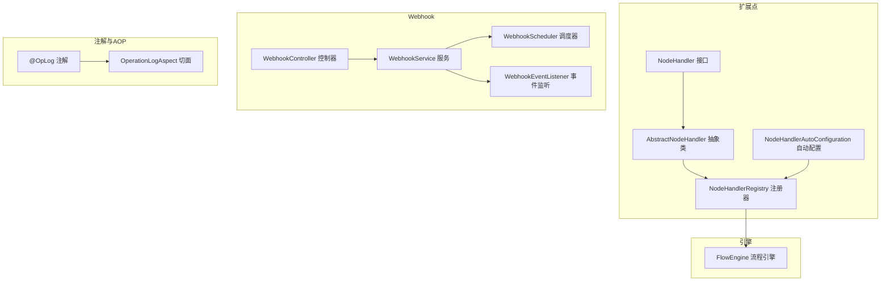
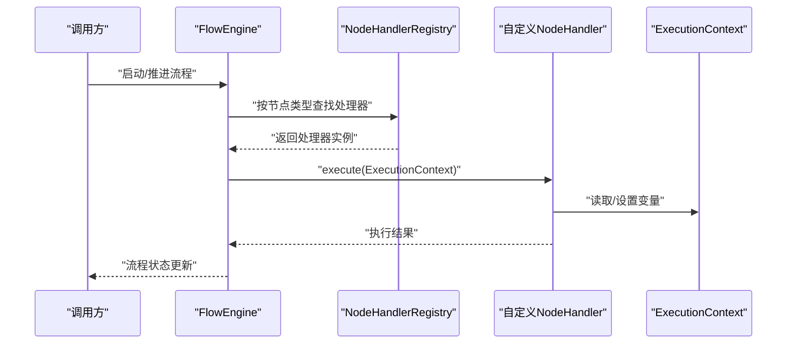
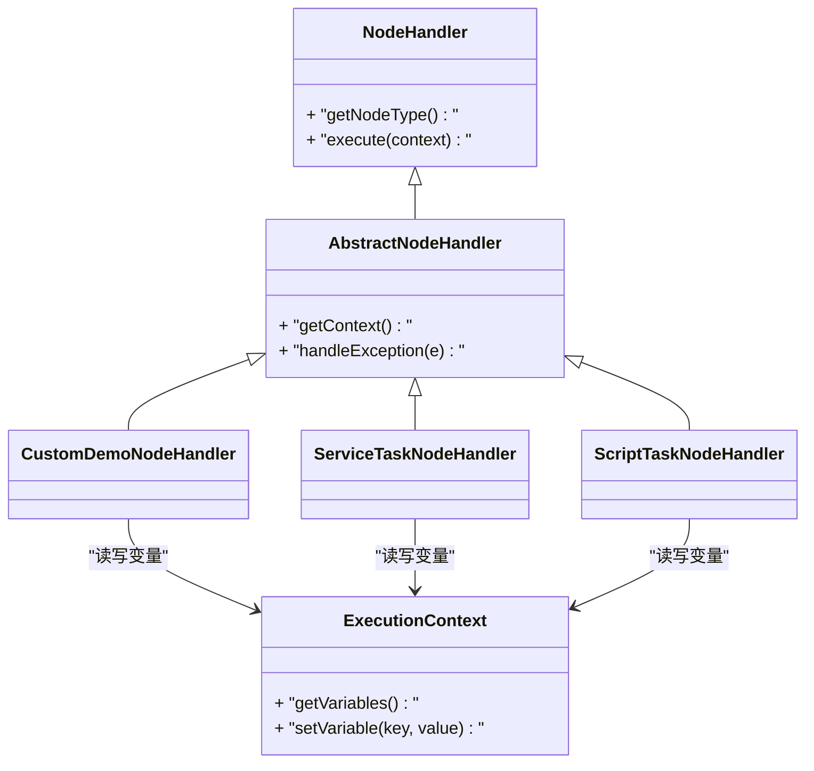
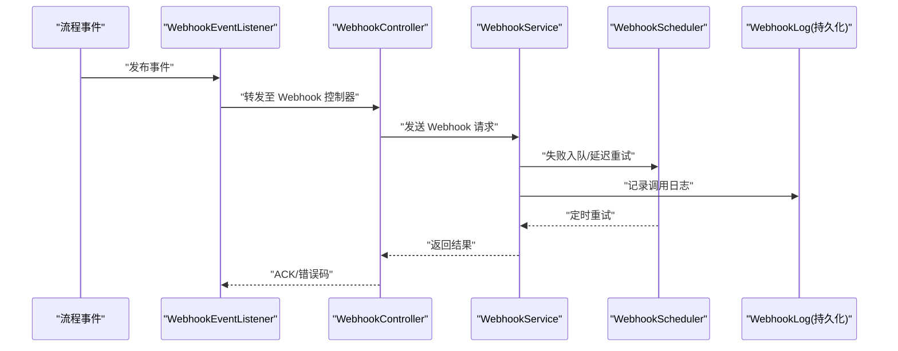
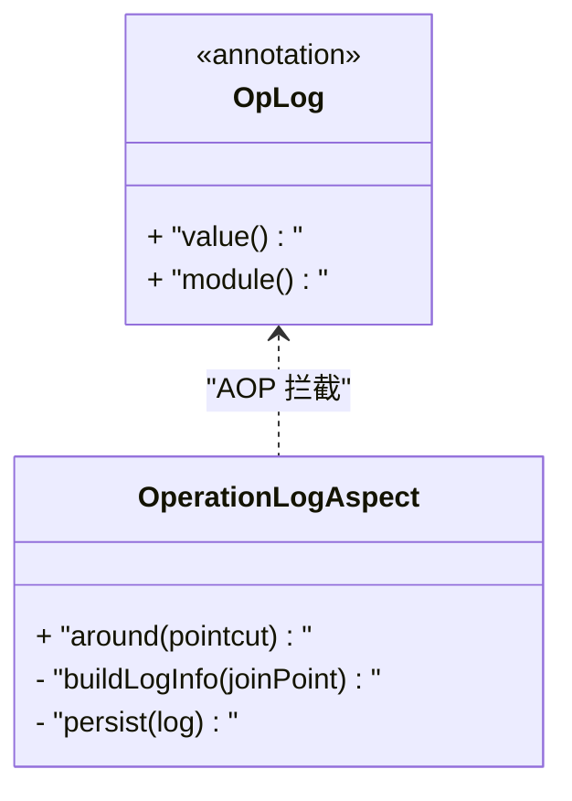
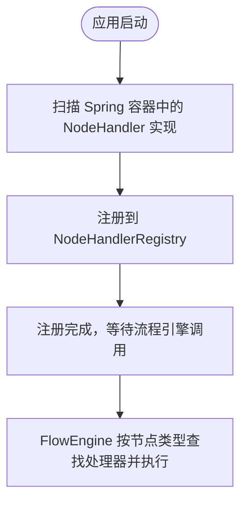
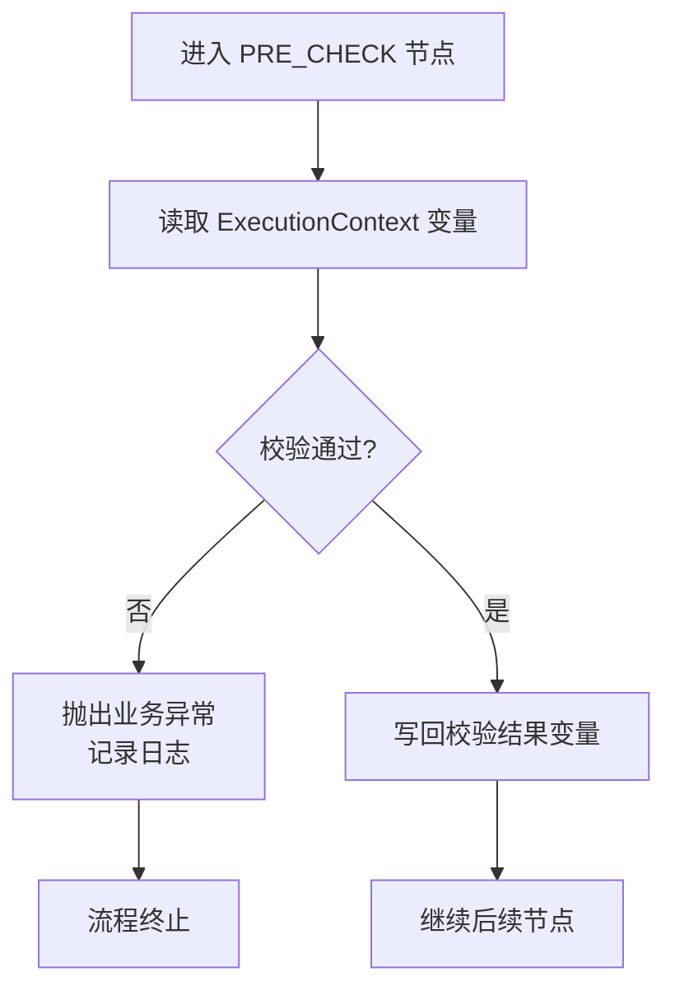
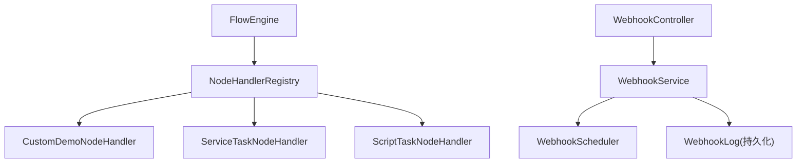

# 扩展开发指南

<cite>
**本文引用的文件**   
- [NodeHandler.java](file://flow-engine/src/main/java/com/flow/engine/node/NodeHandler.java)
- [AbstractNodeHandler.java](file://flow-engine/src/main/java/com/flow/engine/node/AbstractNodeHandler.java)
- [ExecutionContext.java](file://flow-engine/src/main/java/com/flow/engine/node/ExecutionContext.java)
- [NodeHandlerRegistry.java](file://flow-engine/src/main/java/com/flow/engine/node/NodeHandlerRegistry.java)
- [NodeHandlerAutoConfiguration.java](file://flow-engine/src/main/java/com/flow/engine/node/NodeHandlerAutoConfiguration.java)
- [CustomDemoNodeHandler.java](file://flow-engine/src/main/java/com/flow/engine/node/impl/CustomDemoNodeHandler.java)
- [ServiceTaskNodeHandler.java](file://flow-engine/src/main/java/com/flow/engine/node/impl/ServiceTaskNodeHandler.java)
- [ScriptTaskNodeHandler.java](file://flow-engine/src/main/java/com/flow/engine/node/impl/ScriptTaskNodeHandler.java)
- [FlowEngine.java](file://flow-engine/src/main/java/com/flow/engine/engine/FlowEngine.java)
- [OpLog.java](file://flow-engine/src/main/java/com/flow/engine/annotation/OpLog.java)
- [OperationLogAspect.java](file://flow-engine/src/main/java/com/flow/engine/aspect/OperationLogAspect.java)
- [WebhookController.java](file://flow-engine/src/main/java/com/flow/engine/controllers/WebhookController.java)
- [WebhookConfig.java](file://flow-engine/src/main/java/com/flow/engine/config/WebhookConfig.java)
- [WebhookService.java](file://flow-engine/src/main/java/com/flow/engine/service/WebhookService.java)
- [WebhookScheduler.java](file://flow-engine/src/main/java/com/flow/engine/service/WebhookScheduler.java)
- [WebhookEventListener.java](file://flow-engine/src/main/java/com/flow/engine/listener/WebhookEventListener.java)
- [WebhookRequest.java](file://flow-engine/src/main/java/com/flow/engine/dto/WebhookRequest.java)
- [WebhookResponse.java](file://flow-engine/src/main/java/com/flow/engine/dto/WebhookResponse.java)
- [WebhookLogResponse.java](file://flow-engine/src/main/java/com/flow/engine/dto/WebhookLogResponse.java)
- [Webhook.java](file://flow-engine/src/main/java/com/flow/engine/entity/Webhook.java)
- [WebhookLog.java](file://flow-engine/src/main/java/com/flow/engine/entity/WebhookLog.java)
- [ProcessDefinitionService.java](file://flow-engine/src/main/java/com/flow/engine/service/ProcessDefinitionService.java)
- [ProcessInstanceService.java](file://flow-engine/src/main/java/com/flow/engine/service/ProcessInstanceService.java)
- [GlobalExceptionHandler.java](file://flow-engine/src/main/java/com/flow/engine/common/GlobalExceptionHandler.java)
- [ErrorCode.java](file://flow-engine/src/main/java/com/flow/engine/common/ErrorCode.java)
- [Result.java](file://flow-engine/src/main/java/com/flow/engine/common/Result.java)
</cite>

## 目录
1. [简介](#简介)
2. [项目结构](#项目结构)
3. [核心组件](#核心组件)
4. [架构总览](#架构总览)
5. [详细组件分析](#详细组件分析)
6. [依赖关系分析](#依赖关系分析)
7. [性能考虑](#性能考虑)
8. [故障排查指南](#故障排查指南)
9. [结论](#结论)
10. [附录](#附录)

## 简介
本指南面向希望在流程引擎中进行扩展开发的工程师，重点覆盖以下主题：
- 自定义节点处理器开发：实现 NodeHandler 接口、定义节点配置参数、编写执行逻辑
- Webhook 事件订阅与回调机制：触发时机、请求格式、错误处理
- 注解使用与扩展：以 @OpLog 操作日志注解为例说明 AOP 切面扩展方式
- 插件自动发现与加载：基于 Spring Boot 自动配置的注册机制
- 完整自定义节点示例：从需求到实现的端到端流程
- 打包部署与版本管理最佳实践
- 调试技巧与常见问题解决方案

## 项目结构
本项目采用多模块组织，后端核心位于 flow-engine 模块。与扩展开发密切相关的包与职责如下：
- node：节点处理器抽象、注册器与自动配置
- engine：流程引擎入口与调度
- annotation/aspect：注解与 AOP 切面（如操作日志）
- controllers：HTTP 控制器（含 Webhook 接收）
- service：业务服务（含 Webhook 调度与服务）
- entity/dto：数据模型与请求响应对象
- config：系统配置（含 Webhook 相关配置）

图表来源
- [NodeHandler.java](file://flow-engine/src/main/java/com/flow/engine/node/NodeHandler.java)
- [AbstractNodeHandler.java](file://flow-engine/src/main/java/com/flow/engine/node/AbstractNodeHandler.java)
- [NodeHandlerRegistry.java](file://flow-engine/src/main/java/com/flow/engine/node/NodeHandlerRegistry.java)
- [NodeHandlerAutoConfiguration.java](file://flow-engine/src/main/java/com/flow/engine/node/NodeHandlerAutoConfiguration.java)
- [FlowEngine.java](file://flow-engine/src/main/java/com/flow/engine/engine/FlowEngine.java)
- [WebhookController.java](file://flow-engine/src/main/java/com/flow/engine/controllers/WebhookController.java)
- [WebhookService.java](file://flow-engine/src/main/java/com/flow/engine/service/WebhookService.java)
- [WebhookScheduler.java](file://flow-engine/src/main/java/com/flow/engine/service/WebhookScheduler.java)
- [WebhookEventListener.java](file://flow-engine/src/main/java/com/flow/engine/listener/WebhookEventListener.java)
- [OpLog.java](file://flow-engine/src/main/java/com/flow/engine/annotation/OpLog.java)
- [OperationLogAspect.java](file://flow-engine/src/main/java/com/flow/engine/aspect/OperationLogAspect.java)

章节来源
- [NodeHandler.java](file://flow-engine/src/main/java/com/flow/engine/node/NodeHandler.java)
- [AbstractNodeHandler.java](file://flow-engine/src/main/java/com/flow/engine/node/AbstractNodeHandler.java)
- [NodeHandlerRegistry.java](file://flow-engine/src/main/java/com/flow/engine/node/NodeHandlerRegistry.java)
- [NodeHandlerAutoConfiguration.java](file://flow-engine/src/main/java/com/flow/engine/node/NodeHandlerAutoConfiguration.java)
- [FlowEngine.java](file://flow-engine/src/main/java/com/flow/engine/engine/FlowEngine.java)
- [WebhookController.java](file://flow-engine/src/main/java/com/flow/engine/controllers/WebhookController.java)
- [WebhookService.java](file://flow-engine/src/main/java/com/flow/engine/service/WebhookService.java)
- [WebhookScheduler.java](file://flow-engine/src/main/java/com/flow/engine/service/WebhookScheduler.java)
- [WebhookEventListener.java](file://flow-engine/src/main/java/com/flow/engine/listener/WebhookEventListener.java)
- [OpLog.java](file://flow-engine/src/main/java/com/flow/engine/annotation/OpLog.java)
- [OperationLogAspect.java](file://flow-engine/src/main/java/com/flow/engine/aspect/OperationLogAspect.java)

## 核心组件
- 节点处理器接口与抽象基类
  - NodeHandler：定义节点执行契约，包含节点类型标识、执行方法等
  - AbstractNodeHandler：提供通用能力（上下文访问、异常封装、默认行为）
- 执行上下文
  - ExecutionContext：承载流程实例、变量、当前节点信息，供处理器读写
- 注册器与自动配置
  - NodeHandlerRegistry：维护节点类型到处理器的映射
  - NodeHandlerAutoConfiguration：基于 Spring 容器扫描并自动注册所有 NodeHandler 实现
- 内置处理器示例
  - CustomDemoNodeHandler：演示自定义节点的最小实现
  - ServiceTaskNodeHandler：调用外部服务的任务节点
  - ScriptTaskNodeHandler：执行脚本的任务节点

章节来源
- [NodeHandler.java](file://flow-engine/src/main/java/com/flow/engine/node/NodeHandler.java)
- [AbstractNodeHandler.java](file://flow-engine/src/main/java/com/flow/engine/node/AbstractNodeHandler.java)
- [ExecutionContext.java](file://flow-engine/src/main/java/com/flow/engine/node/ExecutionContext.java)
- [NodeHandlerRegistry.java](file://flow-engine/src/main/java/com/flow/engine/node/NodeHandlerRegistry.java)
- [NodeHandlerAutoConfiguration.java](file://flow-engine/src/main/java/com/flow/engine/node/NodeHandlerAutoConfiguration.java)
- [CustomDemoNodeHandler.java](file://flow-engine/src/main/java/com/flow/engine/node/impl/CustomDemoNodeHandler.java)
- [ServiceTaskNodeHandler.java](file://flow-engine/src/main/java/com/flow/engine/node/impl/ServiceTaskNodeHandler.java)
- [ScriptTaskNodeHandler.java](file://flow-engine/src/main/java/com/flow/engine/node/impl/ScriptTaskNodeHandler.java)

## 架构总览
下图展示了自定义节点在流程引擎中的整体交互：流程引擎根据节点类型从注册器获取处理器，处理器通过执行上下文读取/写入流程变量，完成业务逻辑后返回结果驱动后续流转。

图表来源
- [FlowEngine.java](file://flow-engine/src/main/java/com/flow/engine/engine/FlowEngine.java)
- [NodeHandlerRegistry.java](file://flow-engine/src/main/java/com/flow/engine/node/NodeHandlerRegistry.java)
- [NodeHandler.java](file://flow-engine/src/main/java/com/flow/engine/node/NodeHandler.java)
- [AbstractNodeHandler.java](file://flow-engine/src/main/java/com/flow/engine/node/AbstractNodeHandler.java)
- [ExecutionContext.java](file://flow-engine/src/main/java/com/flow/engine/node/ExecutionContext.java)

## 详细组件分析

### 自定义节点处理器开发
- 实现要点
  - 实现 NodeHandler 接口，声明节点类型标识
  - 继承 AbstractNodeHandler 可复用上下文访问与异常处理
  - 在 execute 中读取 ExecutionContext 的变量、进行业务处理、写回变量
  - 通过 Spring 容器注册为 Bean，自动被 NodeHandlerAutoConfiguration 发现并注册
- 配置参数定义
  - 建议在节点模型或配置 JSON 中定义参数键值对
  - 在处理器中解析配置，结合表达式工具计算最终值
- 执行逻辑编写
  - 优先使用无副作用的纯函数式逻辑
  - 对外部依赖（DB、HTTP、消息队列）进行隔离与重试策略设计
  - 统一异常包装，便于全局异常处理器捕获并返回标准错误码

图表来源
- [NodeHandler.java](file://flow-engine/src/main/java/com/flow/engine/node/NodeHandler.java)
- [AbstractNodeHandler.java](file://flow-engine/src/main/java/com/flow/engine/node/AbstractNodeHandler.java)
- [CustomDemoNodeHandler.java](file://flow-engine/src/main/java/com/flow/engine/node/impl/CustomDemoNodeHandler.java)
- [ServiceTaskNodeHandler.java](file://flow-engine/src/main/java/com/flow/engine/node/impl/ServiceTaskNodeHandler.java)
- [ScriptTaskNodeHandler.java](file://flow-engine/src/main/java/com/flow/engine/node/impl/ScriptTaskNodeHandler.java)
- [ExecutionContext.java](file://flow-engine/src/main/java/com/flow/engine/node/ExecutionContext.java)

章节来源
- [NodeHandler.java](file://flow-engine/src/main/java/com/flow/engine/node/NodeHandler.java)
- [AbstractNodeHandler.java](file://flow-engine/src/main/java/com/flow/engine/node/AbstractNodeHandler.java)
- [ExecutionContext.java](file://flow-engine/src/main/java/com/flow/engine/node/ExecutionContext.java)
- [CustomDemoNodeHandler.java](file://flow-engine/src/main/java/com/flow/engine/node/impl/CustomDemoNodeHandler.java)
- [ServiceTaskNodeHandler.java](file://flow-engine/src/main/java/com/flow/engine/node/impl/ServiceTaskNodeHandler.java)
- [ScriptTaskNodeHandler.java](file://flow-engine/src/main/java/com/flow/engine/node/impl/ScriptTaskNodeHandler.java)

### Webhook 事件订阅与回调机制
- 触发时机
  - 流程事件发生时（如节点进入/完成、流程开始/结束），由事件监听器触发 Webhook 调用
- 请求格式
  - 请求体遵循 WebhookRequest 定义，包含事件类型、关联实体 ID、时间戳等
  - 响应体遵循 WebhookResponse 定义，用于确认消费或指示重试
- 错误处理
  - 调用失败时记录 WebhookLog，支持重试调度
  - 全局异常处理器将异常转换为标准 Result 响应

图表来源
- [WebhookController.java](file://flow-engine/src/main/java/com/flow/engine/controllers/WebhookController.java)
- [WebhookService.java](file://flow-engine/src/main/java/com/flow/engine/service/WebhookService.java)
- [WebhookScheduler.java](file://flow-engine/src/main/java/com/flow/engine/service/WebhookScheduler.java)
- [WebhookEventListener.java](file://flow-engine/src/main/java/com/flow/engine/listener/WebhookEventListener.java)
- [WebhookRequest.java](file://flow-engine/src/main/java/com/flow/engine/dto/WebhookRequest.java)
- [WebhookResponse.java](file://flow-engine/src/main/java/com/flow/engine/dto/WebhookResponse.java)
- [WebhookLog.java](file://flow-engine/src/main/java/com/flow/engine/entity/WebhookLog.java)

章节来源
- [WebhookController.java](file://flow-engine/src/main/java/com/flow/engine/controllers/WebhookController.java)
- [WebhookService.java](file://flow-engine/src/main/java/com/flow/engine/service/WebhookService.java)
- [WebhookScheduler.java](file://flow-engine/src/main/java/com/flow/engine/service/WebhookScheduler.java)
- [WebhookEventListener.java](file://flow-engine/src/main/java/com/flow/engine/listener/WebhookEventListener.java)
- [WebhookRequest.java](file://flow-engine/src/main/java/com/flow/engine/dto/WebhookRequest.java)
- [WebhookResponse.java](file://flow-engine/src/main/java/com/flow/engine/dto/WebhookResponse.java)
- [WebhookLog.java](file://flow-engine/src/main/java/com/flow/engine/entity/WebhookLog.java)
- [Webhook.java](file://flow-engine/src/main/java/com/flow/engine/entity/Webhook.java)
- [WebhookConfig.java](file://flow-engine/src/main/java/com/flow/engine/config/WebhookConfig.java)

### 注解使用与扩展（@OpLog 操作日志）
- 注解定义
  - @OpLog 用于标记需要记录操作日志的方法或类
- 切面实现
  - OperationLogAspect 拦截带 @OpLog 的目标方法，收集上下文信息并持久化日志
- 扩展建议
  - 新增自定义注解时，参考现有模式定义注解元数据并在切面中增加对应处理分支
  - 将敏感字段脱敏后再落库

图表来源
- [OpLog.java](file://flow-engine/src/main/java/com/flow/engine/annotation/OpLog.java)
- [OperationLogAspect.java](file://flow-engine/src/main/java/com/flow/engine/aspect/OperationLogAspect.java)

章节来源
- [OpLog.java](file://flow-engine/src/main/java/com/flow/engine/annotation/OpLog.java)
- [OperationLogAspect.java](file://flow-engine/src/main/java/com/flow/engine/aspect/OperationLogAspect.java)

### 插件自动发现与加载机制（Spring Boot 自动配置）
- 自动配置原理
  - NodeHandlerAutoConfiguration 在应用启动时扫描 Spring 容器中的所有 NodeHandler 实现
  - 将每个实现与其节点类型映射注册到 NodeHandlerRegistry
- 注册流程
  - 启动阶段：自动配置类初始化 -> 遍历 Bean -> 注册到注册器
  - 运行阶段：FlowEngine 根据节点类型从注册器获取处理器执行

图表来源
- [NodeHandlerAutoConfiguration.java](file://flow-engine/src/main/java/com/flow/engine/node/NodeHandlerAutoConfiguration.java)
- [NodeHandlerRegistry.java](file://flow-engine/src/main/java/com/flow/engine/node/NodeHandlerRegistry.java)
- [FlowEngine.java](file://flow-engine/src/main/java/com/flow/engine/engine/FlowEngine.java)

章节来源
- [NodeHandlerAutoConfiguration.java](file://flow-engine/src/main/java/com/flow/engine/node/NodeHandlerAutoConfiguration.java)
- [NodeHandlerRegistry.java](file://flow-engine/src/main/java/com/flow/engine/node/NodeHandlerRegistry.java)
- [FlowEngine.java](file://flow-engine/src/main/java/com/flow/engine/engine/FlowEngine.java)

### 完整自定义节点开发示例（端到端）
- 需求分析
  - 目标：新增一个“审批前校验”节点，校验输入变量是否满足条件，不满足则抛出业务异常并终止流程
- 设计与实现步骤
  - 定义节点类型标识（例如：PRE_CHECK）
  - 创建处理器类继承 AbstractNodeHandler，实现 execute 方法
  - 在 execute 中读取 ExecutionContext 的变量并进行校验
  - 校验失败时抛出业务异常；成功则写回校验结果变量
  - 确保处理器类被 Spring 管理（作为 Bean），自动注册生效
- 配置与集成
  - 在流程定义 JSON 中添加该节点类型及配置参数
  - 在节点连线条件中使用表达式引用处理器写回的变量
- 测试与验证
  - 单元测试：构造 ExecutionContext，模拟不同输入，断言变量变化与异常路径
  - 集成测试：通过 ProcessDefinitionService/ProcessInstanceService 发起流程，观察节点执行与流转

图表来源
- [AbstractNodeHandler.java](file://flow-engine/src/main/java/com/flow/engine/node/AbstractNodeHandler.java)
- [ExecutionContext.java](file://flow-engine/src/main/java/com/flow/engine/node/ExecutionContext.java)
- [CustomDemoNodeHandler.java](file://flow-engine/src/main/java/com/flow/engine/node/impl/CustomDemoNodeHandler.java)
- [ProcessDefinitionService.java](file://flow-engine/src/main/java/com/flow/engine/service/ProcessDefinitionService.java)
- [ProcessInstanceService.java](file://flow-engine/src/main/java/com/flow/engine/service/ProcessInstanceService.java)

章节来源
- [AbstractNodeHandler.java](file://flow-engine/src/main/java/com/flow/engine/node/AbstractNodeHandler.java)
- [ExecutionContext.java](file://flow-engine/src/main/java/com/flow/engine/node/ExecutionContext.java)
- [CustomDemoNodeHandler.java](file://flow-engine/src/main/java/com/flow/engine/node/impl/CustomDemoNodeHandler.java)
- [ProcessDefinitionService.java](file://flow-engine/src/main/java/com/flow/engine/service/ProcessDefinitionService.java)
- [ProcessInstanceService.java](file://flow-engine/src/main/java/com/flow/engine/service/ProcessInstanceService.java)

## 依赖关系分析
- 组件耦合
  - FlowEngine 依赖 NodeHandlerRegistry 获取处理器，低耦合高内聚
  - 处理器仅依赖 ExecutionContext，避免直接耦合流程内部状态
  - Webhook 子系统通过控制器与服务解耦，调度器负责重试
- 外部依赖
  - Spring 容器与自动配置
  - 数据库持久化（WebhookLog、流程实体）
  - HTTP 客户端（调用外部 Webhook 地址）

图表来源
- [FlowEngine.java](file://flow-engine/src/main/java/com/flow/engine/engine/FlowEngine.java)
- [NodeHandlerRegistry.java](file://flow-engine/src/main/java/com/flow/engine/node/NodeHandlerRegistry.java)
- [CustomDemoNodeHandler.java](file://flow-engine/src/main/java/com/flow/engine/node/impl/CustomDemoNodeHandler.java)
- [ServiceTaskNodeHandler.java](file://flow-engine/src/main/java/com/flow/engine/node/impl/ServiceTaskNodeHandler.java)
- [ScriptTaskNodeHandler.java](file://flow-engine/src/main/java/com/flow/engine/node/impl/ScriptTaskNodeHandler.java)
- [WebhookController.java](file://flow-engine/src/main/java/com/flow/engine/controllers/WebhookController.java)
- [WebhookService.java](file://flow-engine/src/main/java/com/flow/engine/service/WebhookService.java)
- [WebhookScheduler.java](file://flow-engine/src/main/java/com/flow/engine/service/WebhookScheduler.java)
- [WebhookLog.java](file://flow-engine/src/main/java/com/flow/engine/entity/WebhookLog.java)

章节来源
- [FlowEngine.java](file://flow-engine/src/main/java/com/flow/engine/engine/FlowEngine.java)
- [NodeHandlerRegistry.java](file://flow-engine/src/main/java/com/flow/engine/node/NodeHandlerRegistry.java)
- [WebhookController.java](file://flow-engine/src/main/java/com/flow/engine/controllers/WebhookController.java)
- [WebhookService.java](file://flow-engine/src/main/java/com/flow/engine/service/WebhookService.java)
- [WebhookScheduler.java](file://flow-engine/src/main/java/com/flow/engine/service/WebhookScheduler.java)
- [WebhookLog.java](file://flow-engine/src/main/java/com/flow/engine/entity/WebhookLog.java)

## 性能考虑
- 节点执行
  - 避免在处理器中进行阻塞 IO；必要时异步化或引入缓存
  - 合理拆分复杂逻辑，减少单次执行耗时
- Webhook 调用
  - 使用连接池与超时控制，避免资源耗尽
  - 失败重试采用指数退避与最大次数限制
- 日志与监控
  - 操作日志批量写入，降低 I/O 压力
  - 关键指标埋点（QPS、P99、错误率）

[本节为通用指导，无需特定文件来源]

## 故障排查指南
- 常见错误
  - 节点未找到：检查节点类型标识是否与处理器实现一致，确认自动配置已启用
  - Webhook 调用失败：查看 WebhookLog 记录，确认网络连通性与签名校验
  - 变量未生效：确认处理器是否正确写入 ExecutionContext 变量
- 定位手段
  - 开启 DEBUG 日志，关注 FlowEngine 与 Webhook 相关日志
  - 使用全局异常处理器返回的标准错误码与消息快速定位问题
- 恢复策略
  - 对于 Webhook 失败，利用调度器重试；必要时人工介入重放
  - 对于节点异常，修正配置或代码后重新发起流程

章节来源
- [GlobalExceptionHandler.java](file://flow-engine/src/main/java/com/flow/engine/common/GlobalExceptionHandler.java)
- [ErrorCode.java](file://flow-engine/src/main/java/com/flow/engine/common/ErrorCode.java)
- [Result.java](file://flow-engine/src/main/java/com/flow/engine/common/Result.java)
- [WebhookLog.java](file://flow-engine/src/main/java/com/flow/engine/entity/WebhookLog.java)

## 结论
通过实现 NodeHandler 接口并结合自动配置机制，开发者可以便捷地扩展流程节点；借助 Webhook 事件机制可实现与外部系统的松耦合集成；注解与 AOP 提供了统一的横切能力。遵循本文的最佳实践与排障建议，可显著提升扩展的可维护性与稳定性。

[本节为总结性内容，无需特定文件来源]

## 附录
- 打包与部署
  - 将自定义处理器所在模块纳入主应用依赖，确保 Spring 扫描范围包含新包
  - 使用 Maven/Gradle 构建产物，部署至目标环境并验证自动注册
- 版本管理
  - 为处理器定义稳定的节点类型标识，避免破坏兼容
  - 变更配置参数时保持向后兼容，提供迁移脚本或默认值
- 调试技巧
  - 在处理器中打印关键变量快照，配合链路追踪 ID 定位问题
  - 使用单元测试覆盖边界条件与异常路径

[本节为通用指导，无需特定文件来源]