# 扩展开发指南

<cite>
**本文引用的文件**
- [NodeHandler.java](file://flow-engine/src/main/java/com/flow/engine/node/NodeHandler.java)
- [AbstractNodeHandler.java](file://flow-engine/src/main/java/com/flow/engine/node/AbstractNodeHandler.java)
- [ExecutionContext.java](file://flow-engine/src/main/java/com/flow/engine/node/ExecutionContext.java)
- [NodeHandlerRegistry.java](file://flow-engine/src/main/java/com/flow/engine/node/NodeHandlerRegistry.java)
- [NodeHandlerAutoConfiguration.java](file://flow-engine/src/main/java/com/flow/engine/node/NodeHandlerAutoConfiguration.java)
- [CustomDemoNodeHandler.java](file://flow-engine/src/main/java/com/flow/engine/node/impl/CustomDemoNodeHandler.java)
- [ServiceTaskNodeHandler.java](file://flow-engine/src/main/java/com/flow/engine/node/impl/ServiceTaskNodeHandler.java)
- [ScriptTaskNodeHandler.java](file://flow-engine/src/main/java/com/flow/engine/node/impl/ScriptTaskNodeHandler.java)
- [FlowEngine.java](file://flow-engine/src/main/java/com/flow/engine/engine/FlowEngine.java)
- [OpLog.java](file://flow-engine/src/main/java/com/flow/engine/annotation/OpLog.java)
- [OperationLogAspect.java](file://flow-engine/src/main/java/com/flow/engine/aspect/OperationLogAspect.java)
- [WebhookController.java](file://flow-engine/src/main/java/com/flow/engine/controllers/WebhookController.java)
- [WebhookConfig.java](file://flow-engine/src/main/java/com/flow/engine/config/WebhookConfig.java)
- [WebhookService.java](file://flow-engine/src/main/java/com/flow/engine/service/WebhookService.java)
- [WebhookScheduler.java](file://flow-engine/src/main/java/com/flow/engine/service/WebhookScheduler.java)
- [WebhookEventListener.java](file://flow-engine/src/main/java/com/flow/engine/listener/WebhookEventListener.java)
- [WebhookRequest.java](file://flow-engine/src/main/java/com/flow/engine/dto/WebhookRequest.java)
- [WebhookResponse.java](file://flow-engine/src/main/java/com/flow/engine/dto/WebhookResponse.java)
- [WebhookLogResponse.java](file://flow-engine/src/main/java/com/flow/engine/dto/WebhookLogResponse.java)
- [Webhook.java](file://flow-engine/src/main/java/com/flow/engine/entity/Webhook.java)
- [WebhookLog.java](file://flow-engine/src/main/java/com/flow/engine/entity/WebhookLog.java)
- [ProcessDefinitionService.java](file://flow-engine/src/main/java/com/flow/engine/service/ProcessDefinitionService.java)
- [ProcessInstanceService.java](file://flow-engine/src/main/java/com/flow/engine/service/ProcessInstanceService.java)
- [GlobalExceptionHandler.java](file://flow-engine/src/main/java/com/flow/engine/common/GlobalExceptionHandler.java)
- [ErrorCode.java](file://flow-engine/src/main/java/com/flow/engine/common/ErrorCode.java)
- [Result.java](file://flow-engine/src/main/java/com/flow/engine/common/Result.java)
- [EmsStateMachineService.java](file://flow-engine/src/main/java/com/flow/engine/service/EmsStateMachineService.java)
- [EmsFormulaEngineService.java](file://flow-engine/src/main/java/com/flow/engine/service/EmsFormulaEngineService.java)
- [EmsSeqEngineService.java](file://flow-engine/src/main/java/com/flow/engine/service/EmsSeqEngineService.java)
- [ExprEngine.java](file://flow-engine/src/main/java/com/flow/engine/util/ExprEngine.java)
- [EmsTransitionDef.java](file://flow-engine/src/main/java/com/flow/engine/entity/EmsTransitionDef.java)
- [EmsSeqDef.java](file://flow-engine/src/main/java/com/flow/engine/entity/EmsSeqDef.java)
</cite>

## 更新摘要
**变更内容**
- 新增环境监测LIMS专用组件开发指南：状态机服务、公式引擎、序列号引擎
- 补充表达式引擎（ExprEngine）在业务组件中的应用说明
- 增强节点处理器与专用组件的集成示例
- 完善错误处理与调试指南，涵盖新组件常见问题

## 目录
1. [简介](#简介)
2. [项目结构](#项目结构)
3. [核心组件](#核心组件)
4. [架构总览](#架构总览)
5. [详细组件分析](#详细组件分析)
6. [依赖关系分析](#依赖关系分析)
7. [性能考虑](#性能考虑)
8. [故障排查指南](#故障排查指南)
9. [结论](#结论)
10. [附录](#附录)

## 简介
本指南面向希望在流程引擎中进行扩展开发的工程师，重点覆盖以下主题：
- 自定义节点处理器开发：实现 NodeHandler 接口、定义节点配置参数、编写执行逻辑
- Webhook 事件订阅与回调机制：触发时机、请求格式、错误处理
- 注解使用与扩展：以 @OpLog 操作日志注解为例说明 AOP 切面扩展方式
- 插件自动发现与加载：基于 Spring Boot 自动配置的注册机制
- **环境监测LIMS专用组件开发**：状态机服务、公式引擎、序列号引擎等专用组件的开发指南
- 完整自定义节点示例：从需求到实现的端到端流程
- 打包部署与版本管理最佳实践
- 调试技巧与常见问题解决方案

## 项目结构
本项目采用多模块组织，后端核心位于 flow-engine 模块。与扩展开发密切相关的包与职责如下：
- node：节点处理器抽象、注册器与自动配置
- engine：流程引擎入口与调度
- annotation/aspect：注解与 AOP 切面（如操作日志）
- controllers：HTTP 控制器（含 Webhook 接收）
- service：业务服务（含 Webhook 调度与服务、**环境监测LIMS专用服务**）
- entity/dto：数据模型与请求响应对象
- config：系统配置（含 Webhook 相关配置）
- util：工具类（含**表达式引擎 ExprEngine**）

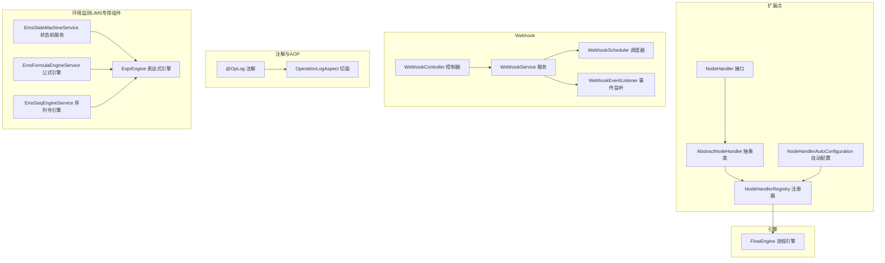
```mermaid
graph TB
subgraph "扩展点"
NH["NodeHandler 接口"]
ANH["AbstractNodeHandler 抽象类"]
REG["NodeHandlerRegistry 注册器"]
AUTO["NodeHandlerAutoConfiguration 自动配置"]
end
subgraph "引擎"
FE["FlowEngine 流程引擎"]
end
subgraph "Webhook"
WC["WebhookController 控制器"]
WS["WebhookService 服务"]
WSC["WebhookScheduler 调度器"]
WEL["WebhookEventListener 事件监听"]
end
subgraph "注解与AOP"
OPLOG["@OpLog 注解"]
OLA["OperationLogAspect 切面"]
end
subgraph "环境监测LIMS专用组件"
SSM["EmsStateMachineService 状态机服务"]
FFE["EmsFormulaEngineService 公式引擎"]
SSE["EmsSeqEngineService 序列号引擎"]
EE["ExprEngine 表达式引擎"]
end
NH --> ANH
ANH --> REG
REG --> FE
AUTO --> REG
WC --> WS
WS --> WSC
WS --> WEL
OPLOG --> OLA
SSM --> EE
FFE --> EE
SSE --> EE
```

**图表来源**
- [NodeHandler.java](file://flow-engine/src/main/java/com/flow/engine/node/NodeHandler.java)
- [AbstractNodeHandler.java](file://flow-engine/src/main/java/com/flow/engine/node/AbstractNodeHandler.java)
- [NodeHandlerRegistry.java](file://flow-engine/src/main/java/com/flow/engine/node/NodeHandlerRegistry.java)
- [NodeHandlerAutoConfiguration.java](file://flow-engine/src/main/java/com/flow/engine/node/NodeHandlerAutoConfiguration.java)
- [FlowEngine.java](file://flow-engine/src/main/java/com/flow/engine/engine/FlowEngine.java)
- [WebhookController.java](file://flow-engine/src/main/java/com/flow/engine/controllers/WebhookController.java)
- [WebhookService.java](file://flow-engine/src/main/java/com/flow/engine/service/WebhookService.java)
- [WebhookScheduler.java](file://flow-engine/src/main/java/com/flow/engine/service/WebhookScheduler.java)
- [WebhookEventListener.java](file://flow-engine/src/main/java/com/flow/engine/listener/WebhookEventListener.java)
- [OpLog.java](file://flow-engine/src/main/java/com/flow/engine/annotation/OpLog.java)
- [OperationLogAspect.java](file://flow-engine/src/main/java/com/flow/engine/aspect/OperationLogAspect.java)
- [EmsStateMachineService.java](file://flow-engine/src/main/java/com/flow/engine/service/EmsStateMachineService.java)
- [EmsFormulaEngineService.java](file://flow-engine/src/main/java/com/flow/engine/service/EmsFormulaEngineService.java)
- [EmsSeqEngineService.java](file://flow-engine/src/main/java/com/flow/engine/service/EmsSeqEngineService.java)
- [ExprEngine.java](file://flow-engine/src/main/java/com/flow/engine/util/ExprEngine.java)

章节来源
- [NodeHandler.java](file://flow-engine/src/main/java/com/flow/engine/node/NodeHandler.java)
- [AbstractNodeHandler.java](file://flow-engine/src/main/java/com/flow/engine/node/AbstractNodeHandler.java)
- [NodeHandlerRegistry.java](file://flow-engine/src/main/java/com/flow/engine/node/NodeHandlerRegistry.java)
- [NodeHandlerAutoConfiguration.java](file://flow-engine/src/main/java/com/flow/engine/node/NodeHandlerAutoConfiguration.java)
- [FlowEngine.java](file://flow-engine/src/main/java/com/flow/engine/engine/FlowEngine.java)
- [WebhookController.java](file://flow-engine/src/main/java/com/flow/engine/controllers/WebhookController.java)
- [WebhookService.java](file://flow-engine/src/main/java/com/flow/engine/service/WebhookService.java)
- [WebhookScheduler.java](file://flow-engine/src/main/java/com/flow/engine/service/WebhookScheduler.java)
- [WebhookEventListener.java](file://flow-engine/src/main/java/com/flow/engine/listener/WebhookEventListener.java)
- [OpLog.java](file://flow-engine/src/main/java/com/flow/engine/annotation/OpLog.java)
- [OperationLogAspect.java](file://flow-engine/src/main/java/com/flow/engine/aspect/OperationLogAspect.java)

## 核心组件
- 节点处理器接口与抽象基类
  - NodeHandler：定义节点执行契约，包含节点类型标识、执行方法等
  - AbstractNodeHandler：提供通用能力（上下文访问、异常封装、默认行为）
- 执行上下文
  - ExecutionContext：承载流程实例、变量、当前节点信息，供处理器读写
- 注册器与自动配置
  - NodeHandlerRegistry：维护节点类型到处理器的映射
  - NodeHandlerAutoConfiguration：基于 Spring 容器扫描并自动注册所有 NodeHandler 实现
- 内置处理器示例
  - CustomDemoNodeHandler：演示自定义节点的最小实现
  - ServiceTaskNodeHandler：调用外部服务的任务节点
  - ScriptTaskNodeHandler：执行脚本的任务节点
- **环境监测LIMS专用组件**
  - EmsStateMachineService：固定状态机框架，支持配置驱动的状态迁移和守卫校验
  - EmsFormulaEngineService：公式计算引擎，基于SpEL执行检测结果公式运算
  - EmsSeqEngineService：编号引擎，生成全局唯一的业务单号
  - ExprEngine：表达式执行引擎，提供安全的SpEL表达式求值能力

章节来源
- [NodeHandler.java](file://flow-engine/src/main/java/com/flow/engine/node/NodeHandler.java)
- [AbstractNodeHandler.java](file://flow-engine/src/main/java/com/flow/engine/node/AbstractNodeHandler.java)
- [ExecutionContext.java](file://flow-engine/src/main/java/com/flow/engine/node/ExecutionContext.java)
- [NodeHandlerRegistry.java](file://flow-engine/src/main/java/com/flow/engine/node/NodeHandlerRegistry.java)
- [NodeHandlerAutoConfiguration.java](file://flow-engine/src/main/java/com/flow/engine/node/NodeHandlerAutoConfiguration.java)
- [CustomDemoNodeHandler.java](file://flow-engine/src/main/java/com/flow/engine/node/impl/CustomDemoNodeHandler.java)
- [ServiceTaskNodeHandler.java](file://flow-engine/src/main/java/com/flow/engine/node/impl/ServiceTaskNodeHandler.java)
- [ScriptTaskNodeHandler.java](file://flow-engine/src/main/java/com/flow/engine/node/impl/ScriptTaskNodeHandler.java)
- [EmsStateMachineService.java](file://flow-engine/src/main/java/com/flow/engine/service/EmsStateMachineService.java)
- [EmsFormulaEngineService.java](file://flow-engine/src/main/java/com/flow/engine/service/EmsFormulaEngineService.java)
- [EmsSeqEngineService.java](file://flow-engine/src/main/java/com/flow/engine/service/EmsSeqEngineService.java)
- [ExprEngine.java](file://flow-engine/src/main/java/com/flow/engine/util/ExprEngine.java)

## 架构总览
下图展示了自定义节点在流程引擎中的整体交互，以及环境监测LIMS专用组件的集成方式：流程引擎根据节点类型从注册器获取处理器，处理器通过执行上下文读取/写入流程变量，完成业务逻辑后返回结果驱动后续流转。同时，专用组件提供状态机控制、公式计算和编号生成等业务能力。

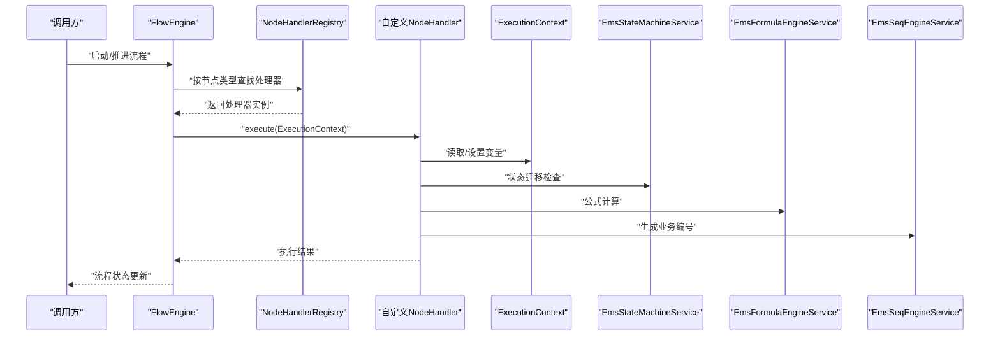
```mermaid
sequenceDiagram
participant Client as "调用方"
participant Engine as "FlowEngine"
participant Registry as "NodeHandlerRegistry"
participant Handler as "自定义NodeHandler"
participant Ctx as "ExecutionContext"
participant StateMachine as "EmsStateMachineService"
participant Formula as "EmsFormulaEngineService"
participant SeqEngine as "EmsSeqEngineService"
Client->>Engine : "启动/推进流程"
Engine->>Registry : "按节点类型查找处理器"
Registry-->>Engine : "返回处理器实例"
Engine->>Handler : "execute(ExecutionContext)"
Handler->>Ctx : "读取/设置变量"
Handler->>StateMachine : "状态迁移检查"
Handler->>Formula : "公式计算"
Handler->>SeqEngine : "生成业务编号"
Handler-->>Engine : "执行结果"
Engine-->>Client : "流程状态更新"
```

**图表来源**
- [FlowEngine.java](file://flow-engine/src/main/java/com/flow/engine/engine/FlowEngine.java)
- [NodeHandlerRegistry.java](file://flow-engine/src/main/java/com/flow/engine/node/NodeHandlerRegistry.java)
- [NodeHandler.java](file://flow-engine/src/main/java/com/flow/engine/node/NodeHandler.java)
- [AbstractNodeHandler.java](file://flow-engine/src/main/java/com/flow/engine/node/AbstractNodeHandler.java)
- [ExecutionContext.java](file://flow-engine/src/main/java/com/flow/engine/node/ExecutionContext.java)
- [EmsStateMachineService.java](file://flow-engine/src/main/java/com/flow/engine/service/EmsStateMachineService.java)
- [EmsFormulaEngineService.java](file://flow-engine/src/main/java/com/flow/engine/service/EmsFormulaEngineService.java)
- [EmsSeqEngineService.java](file://flow-engine/src/main/java/com/flow/engine/service/EmsSeqEngineService.java)

## 详细组件分析

### 自定义节点处理器开发
- 实现要点
  - 实现 NodeHandler 接口，声明节点类型标识
  - 继承 AbstractNodeHandler 可复用上下文访问与异常处理
  - 在 execute 中读取 ExecutionContext 的变量、进行业务处理、写回变量
  - 通过 Spring 容器注册为 Bean，自动被 NodeHandlerAutoConfiguration 发现并注册
- 配置参数定义
  - 建议在节点模型或配置 JSON 中定义参数键值对
  - 在处理器中解析配置，结合表达式工具计算最终值
- 执行逻辑编写
  - 优先使用无副作用的纯函数式逻辑
  - 对外部依赖（DB、HTTP、消息队列）进行隔离与重试策略设计
  - 统一异常包装，便于全局异常处理器捕获并返回标准错误码

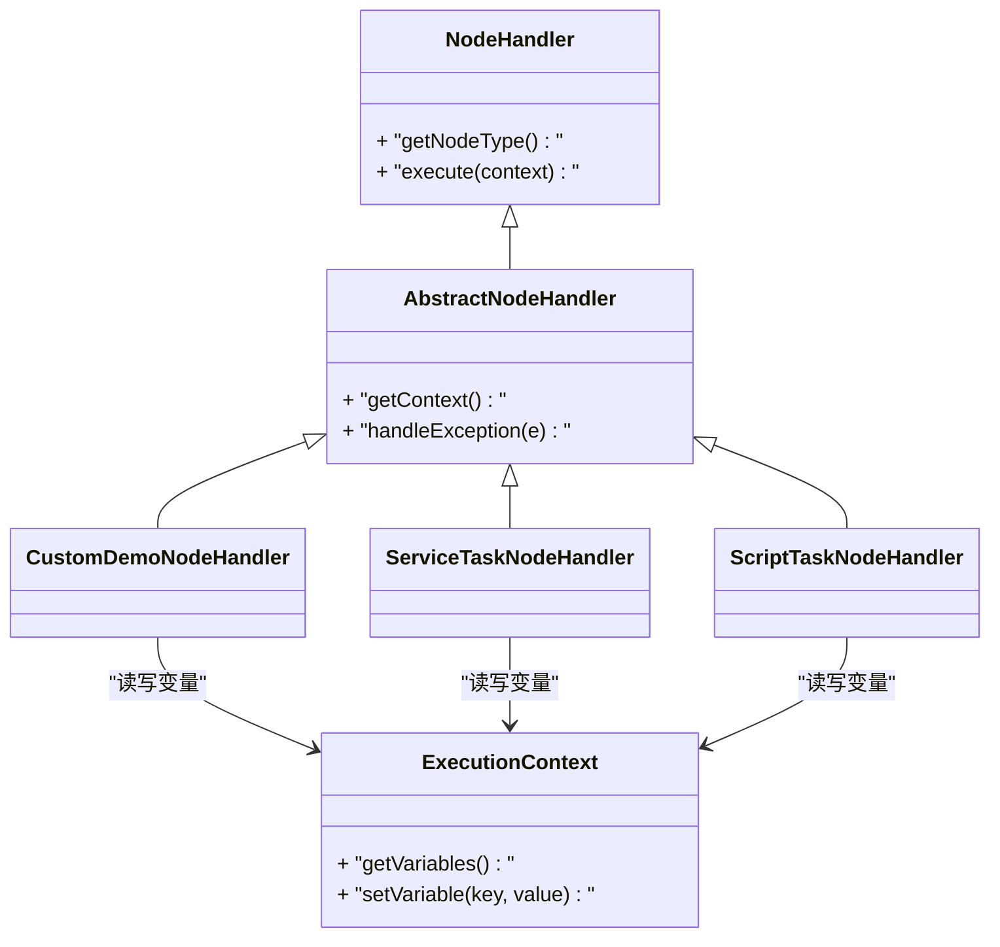
```mermaid
classDiagram
class NodeHandler {
+ "getNodeType()"
+ "execute(context)"
}
class AbstractNodeHandler {
+ "getContext()"
+ "handleException(e)"
}
class CustomDemoNodeHandler
class ServiceTaskNodeHandler
class ScriptTaskNodeHandler
class ExecutionContext {
+ "getVariables()"
+ "setVariable(key, value)"
}
NodeHandler <|-- AbstractNodeHandler
AbstractNodeHandler <|-- CustomDemoNodeHandler
AbstractNodeHandler <|-- ServiceTaskNodeHandler
AbstractNodeHandler <|-- ScriptTaskNodeHandler
CustomDemoNodeHandler --> ExecutionContext : "读写变量"
ServiceTaskNodeHandler --> ExecutionContext : "读写变量"
ScriptTaskNodeHandler --> ExecutionContext : "读写变量"
```

**图表来源**
- [NodeHandler.java](file://flow-engine/src/main/java/com/flow/engine/node/NodeHandler.java)
- [AbstractNodeHandler.java](file://flow-engine/src/main/java/com/flow/engine/node/AbstractNodeHandler.java)
- [CustomDemoNodeHandler.java](file://flow-engine/src/main/java/com/flow/engine/node/impl/CustomDemoNodeHandler.java)
- [ServiceTaskNodeHandler.java](file://flow-engine/src/main/java/com/flow/engine/node/impl/ServiceTaskNodeHandler.java)
- [ScriptTaskNodeHandler.java](file://flow-engine/src/main/java/com/flow/engine/node/impl/ScriptTaskNodeHandler.java)
- [ExecutionContext.java](file://flow-engine/src/main/java/com/flow/engine/node/ExecutionContext.java)

章节来源
- [NodeHandler.java](file://flow-engine/src/main/java/com/flow/engine/node/NodeHandler.java)
- [AbstractNodeHandler.java](file://flow-engine/src/main/java/com/flow/engine/node/AbstractNodeHandler.java)
- [ExecutionContext.java](file://flow-engine/src/main/java/com/flow/engine/node/ExecutionContext.java)
- [CustomDemoNodeHandler.java](file://flow-engine/src/main/java/com/flow/engine/node/impl/CustomDemoNodeHandler.java)
- [ServiceTaskNodeHandler.java](file://flow-engine/src/main/java/com/flow/engine/node/impl/ServiceTaskNodeHandler.java)
- [ScriptTaskNodeHandler.java](file://flow-engine/src/main/java/com/flow/engine/node/impl/ScriptTaskNodeHandler.java)

### Webhook 事件订阅与回调机制
- 触发时机
  - 流程事件发生时（如节点进入/完成、流程开始/结束），由事件监听器触发 Webhook 调用
- 请求格式
  - 请求体遵循 WebhookRequest 定义，包含事件类型、关联实体 ID、时间戳等
  - 响应体遵循 WebhookResponse 定义，用于确认消费或指示重试
- 错误处理
  - 调用失败时记录 WebhookLog，支持重试调度
  - 全局异常处理器将异常转换为标准 Result 响应

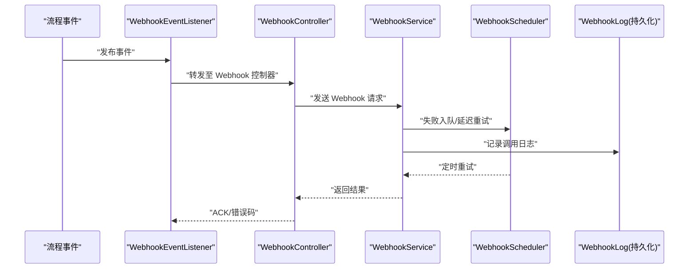
```mermaid
sequenceDiagram
participant Event as "流程事件"
participant Listener as "WebhookEventListener"
participant Controller as "WebhookController"
participant Service as "WebhookService"
participant Scheduler as "WebhookScheduler"
participant DB as "WebhookLog(持久化)"
Event->>Listener : "发布事件"
Listener->>Controller : "转发至 Webhook 控制器"
Controller->>Service : "发送 Webhook 请求"
Service->>Scheduler : "失败入队/延迟重试"
Service->>DB : "记录调用日志"
Scheduler-->>Service : "定时重试"
Service-->>Controller : "返回结果"
Controller-->>Listener : "ACK/错误码"
```

**图表来源**
- [WebhookController.java](file://flow-engine/src/main/java/com/flow/engine/controllers/WebhookController.java)
- [WebhookService.java](file://flow-engine/src/main/java/com/flow/engine/service/WebhookService.java)
- [WebhookScheduler.java](file://flow-engine/src/main/java/com/flow/engine/service/WebhookScheduler.java)
- [WebhookEventListener.java](file://flow-engine/src/main/java/com/flow/engine/listener/WebhookEventListener.java)
- [WebhookRequest.java](file://flow-engine/src/main/java/com/flow/engine/dto/WebhookRequest.java)
- [WebhookResponse.java](file://flow-engine/src/main/java/com/flow/engine/dto/WebhookResponse.java)
- [WebhookLog.java](file://flow-engine/src/main/java/com/flow/engine/entity/WebhookLog.java)

章节来源
- [WebhookController.java](file://flow-engine/src/main/java/com/flow/engine/controllers/WebhookController.java)
- [WebhookService.java](file://flow-engine/src/main/java/com/flow/engine/service/WebhookService.java)
- [WebhookScheduler.java](file://flow-engine/src/main/java/com/flow/engine/service/WebhookScheduler.java)
- [WebhookEventListener.java](file://flow-engine/src/main/java/com/flow/engine/listener/WebhookEventListener.java)
- [WebhookRequest.java](file://flow-engine/src/main/java/com/flow/engine/dto/WebhookRequest.java)
- [WebhookResponse.java](file://flow-engine/src/main/java/com/flow/engine/dto/WebhookResponse.java)
- [WebhookLog.java](file://flow-engine/src/main/java/com/flow/engine/entity/WebhookLog.java)
- [Webhook.java](file://flow-engine/src/main/java/com/flow/engine/entity/Webhook.java)
- [WebhookConfig.java](file://flow-engine/src/main/java/com/flow/engine/config/WebhookConfig.java)

### 注解使用与扩展（@OpLog 操作日志）
- 注解定义
  - @OpLog 用于标记需要记录操作日志的方法或类
- 切面实现
  - OperationLogAspect 拦截带 @OpLog 的目标方法，收集上下文信息并持久化日志
- 扩展建议
  - 新增自定义注解时，参考现有模式定义注解元数据并在切面中增加对应处理分支
  - 将敏感字段脱敏后再落库

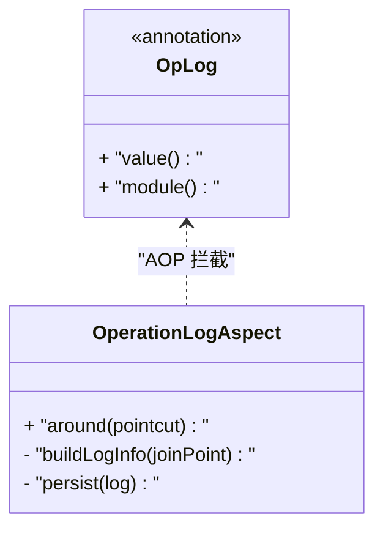
```mermaid
classDiagram
class OpLog {
<<annotation>>
+ "value()"
+ "module()"
}
class OperationLogAspect {
+ "around(pointcut)"
- "buildLogInfo(joinPoint)"
- "persist(log)"
}
OpLog <.. OperationLogAspect : "AOP 拦截"
```

**图表来源**
- [OpLog.java](file://flow-engine/src/main/java/com/flow/engine/annotation/OpLog.java)
- [OperationLogAspect.java](file://flow-engine/src/main/java/com/flow/engine/aspect/OperationLogAspect.java)

章节来源
- [OpLog.java](file://flow-engine/src/main/java/com/flow/engine/annotation/OpLog.java)
- [OperationLogAspect.java](file://flow-engine/src/main/java/com/flow/engine/aspect/OperationLogAspect.java)

### 插件自动发现与加载机制（Spring Boot 自动配置）
- 自动配置原理
  - NodeHandlerAutoConfiguration 在应用启动时扫描 Spring 容器中的所有 NodeHandler 实现
  - 将每个实现与其节点类型映射注册到 NodeHandlerRegistry
- 注册流程
  - 启动阶段：自动配置类初始化 -> 遍历 Bean -> 注册到注册器
  - 运行阶段：FlowEngine 根据节点类型从注册器获取处理器执行

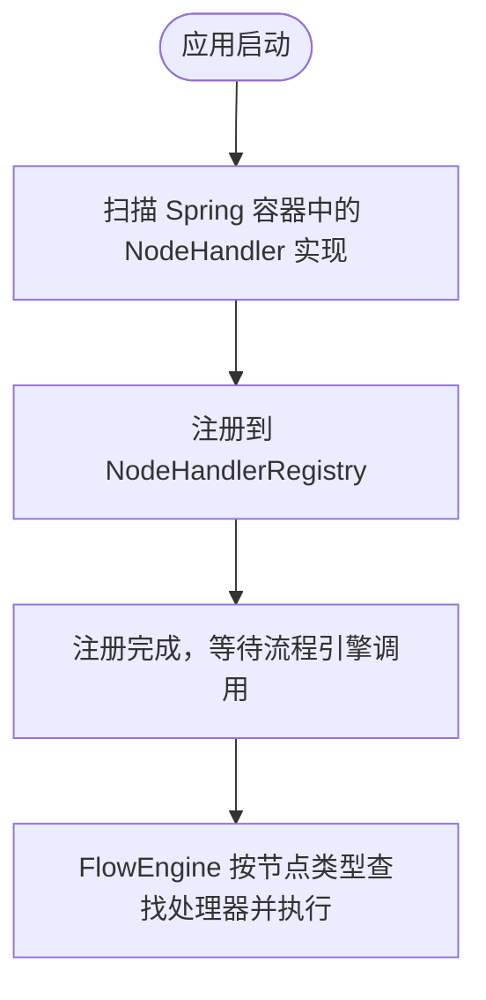
```mermaid
flowchart TD
Start(["应用启动"]) --> Scan["扫描 Spring 容器中的 NodeHandler 实现"]
Scan --> Register["注册到 NodeHandlerRegistry"]
Register --> Ready["注册完成，等待流程引擎调用"]
Ready --> Execute["FlowEngine 按节点类型查找处理器并执行"]
```

**图表来源**
- [NodeHandlerAutoConfiguration.java](file://flow-engine/src/main/java/com/flow/engine/node/NodeHandlerAutoConfiguration.java)
- [NodeHandlerRegistry.java](file://flow-engine/src/main/java/com/flow/engine/node/NodeHandlerRegistry.java)
- [FlowEngine.java](file://flow-engine/src/main/java/com/flow/engine/engine/FlowEngine.java)

章节来源
- [NodeHandlerAutoConfiguration.java](file://flow-engine/src/main/java/com/flow/engine/node/NodeHandlerAutoConfiguration.java)
- [NodeHandlerRegistry.java](file://flow-engine/src/main/java/com/flow/engine/node/NodeHandlerRegistry.java)
- [FlowEngine.java](file://flow-engine/src/main/java/com/flow/engine/engine/FlowEngine.java)

### 环境监测LIMS专用组件开发

#### 状态机服务（EmsStateMachineService）
- 功能特性
  - 配置驱动的状态迁移：通过 t_transition_def 表定义业务状态机规则
  - 守卫表达式支持：使用 SpEL 表达式进行条件校验
  - 事务安全保障：确保状态迁移的原子性和一致性
- 核心API
  - fire()：执行状态迁移，返回 FireResult 包含迁移结果和详细信息
  - transitionsOf()：查询某业务类型下某状态的所有可用事件
- 使用场景
  - 委托单状态管理：待受理→已受理→检测中→已完成
  - 采样任务状态管理：待采样→采样中→已采样→已入库
  - 报告审核流程：草稿→审核中→已审核→已发布

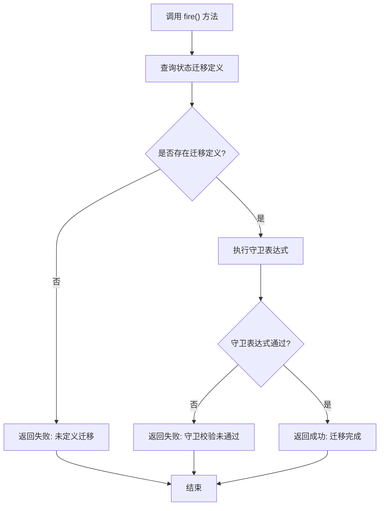
```mermaid
flowchart TD
Start["调用 fire() 方法"] --> Query["查询状态迁移定义"]
Query --> CheckExists{"是否存在迁移定义?"}
CheckExists --> |否| ReturnFail["返回失败: 未定义迁移"]
CheckExists --> |是| EvalGuard["执行守卫表达式"]
EvalGuard --> GuardPass{"守卫表达式通过?"}
GuardPass --> |否| ReturnGuardFail["返回失败: 守卫校验未通过"]
GuardPass --> |是| ReturnSuccess["返回成功: 迁移完成"]
ReturnFail --> End["结束"]
ReturnGuardFail --> End
ReturnSuccess --> End
```

**图表来源**
- [EmsStateMachineService.java](file://flow-engine/src/main/java/com/flow/engine/service/EmsStateMachineService.java)
- [EmsTransitionDef.java](file://flow-engine/src/main/java/com/flow/engine/entity/EmsTransitionDef.java)
- [ExprEngine.java](file://flow-engine/src/main/java/com/flow/engine/util/ExprEngine.java)

章节来源
- [EmsStateMachineService.java](file://flow-engine/src/main/java/com/flow/engine/service/EmsStateMachineService.java)
- [EmsTransitionDef.java](file://flow-engine/src/main/java/com/flow/engine/entity/EmsTransitionDef.java)

#### 公式引擎（EmsFormulaEngineService）
- 功能特性
  - 基于SpEL的公式计算：支持复杂的数学运算和逻辑判断
  - 变量注入机制：通过 params 参数注入计算变量
  - 单位换算支持：兼容环境监测数据的单位转换需求
- 核心API
  - calc()：执行公式计算，返回计算结果
- 应用场景
  - 检测结果计算：浓度=质量/体积×稀释倍数
  - 质量控制：回收率=(加标样品测定值-原样品测定值)/加标量×100%
  - 数据验证：数值范围检查、逻辑关系验证

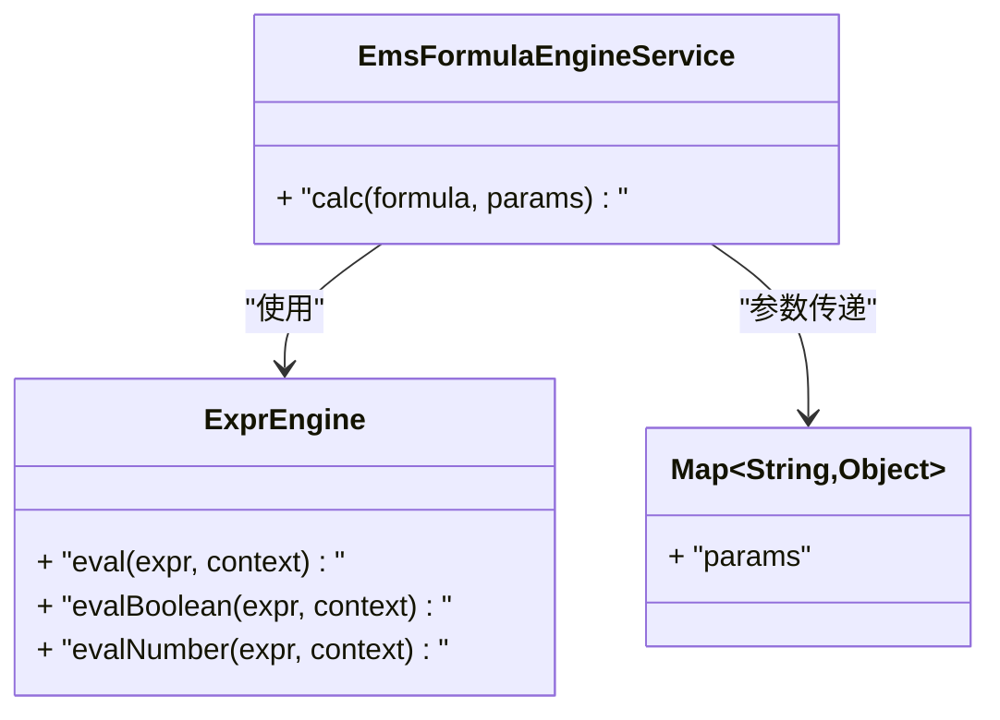
```mermaid
classDiagram
class EmsFormulaEngineService {
+ "calc(formula, params)"
}
class ExprEngine {
+ "eval(expr, context)"
+ "evalBoolean(expr, context)"
+ "evalNumber(expr, context)"
}
class Map~String,Object~ {
+ "params"
}
EmsFormulaEngineService --> ExprEngine : "使用"
EmsFormulaEngineService --> Map : "参数传递"
```

**图表来源**
- [EmsFormulaEngineService.java](file://flow-engine/src/main/java/com/flow/engine/service/EmsFormulaEngineService.java)
- [ExprEngine.java](file://flow-engine/src/main/java/com/flow/engine/util/ExprEngine.java)

章节来源
- [EmsFormulaEngineService.java](file://flow-engine/src/main/java/com/flow/engine/service/EmsFormulaEngineService.java)
- [ExprEngine.java](file://flow-engine/src/main/java/com/flow/engine/util/ExprEngine.java)

#### 序列号引擎（EmsSeqEngineService）
- 功能特性
  - 全局唯一编号生成：前缀 + yyyyMMdd + 当日序列（4位补零）
  - 日期分段管理：每日序列自动重置，保证编号可读性
  - 线程安全保证：事务内行级更新 + 同步机制
- 核心API
  - next()：生成下一个唯一业务单号，支持事务和并发控制
- 应用场景
  - 委托单号：WT202401010001
  - 采样任务号：SM202401010001
  - 检测报告号：RP202401010001

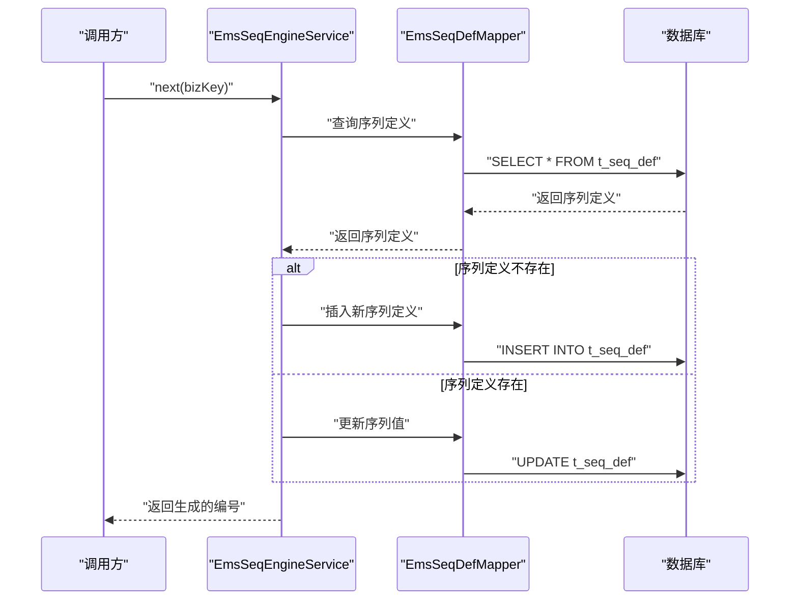
```mermaid
sequenceDiagram
participant Client as "调用方"
participant SeqEngine as "EmsSeqEngineService"
participant Mapper as "EmsSeqDefMapper"
participant DB as "数据库"
Client->>SeqEngine : "next(bizKey)"
SeqEngine->>Mapper : "查询序列定义"
Mapper->>DB : "SELECT * FROM t_seq_def"
DB-->>Mapper : "返回序列定义"
Mapper-->>SeqEngine : "返回序列定义"
alt 序列定义不存在
SeqEngine->>Mapper : "插入新序列定义"
Mapper->>DB : "INSERT INTO t_seq_def"
else 序列定义存在
SeqEngine->>Mapper : "更新序列值"
Mapper->>DB : "UPDATE t_seq_def"
end
SeqEngine-->>Client : "返回生成的编号"
```

**图表来源**
- [EmsSeqEngineService.java](file://flow-engine/src/main/java/com/flow/engine/service/EmsSeqEngineService.java)
- [EmsSeqDef.java](file://flow-engine/src/main/java/com/flow/engine/entity/EmsSeqDef.java)

章节来源
- [EmsSeqEngineService.java](file://flow-engine/src/main/java/com/flow/engine/service/EmsSeqEngineService.java)
- [EmsSeqDef.java](file://flow-engine/src/main/java/com/flow/engine/entity/EmsSeqDef.java)

### 完整自定义节点开发示例（端到端）
- 需求分析
  - 目标：新增一个"审批前校验"节点，校验输入变量是否满足条件，不满足则抛出业务异常并终止流程
  - 集成环境监测LIMS专用组件：使用状态机服务进行业务状态检查，使用公式引擎进行数据验证
- 设计与实现步骤
  - 定义节点类型标识（例如：PRE_CHECK）
  - 创建处理器类继承 AbstractNodeHandler，实现 execute 方法
  - 在 execute 中读取 ExecutionContext 的变量并进行校验
  - 集成状态机服务：检查业务状态是否允许继续处理
  - 集成公式引擎：执行数据验证公式
  - 校验失败时抛出业务异常；成功则写回校验结果变量
  - 确保处理器类被 Spring 管理（作为 Bean），自动注册生效
- 配置与集成
  - 在流程定义 JSON 中添加该节点类型及配置参数
  - 在节点连线条件中使用表达式引用处理器写回的变量
- 测试与验证
  - 单元测试：构造 ExecutionContext，模拟不同输入，断言变量变化与异常路径
  - 集成测试：通过 ProcessDefinitionService/ProcessInstanceService 发起流程，观察节点执行与流转

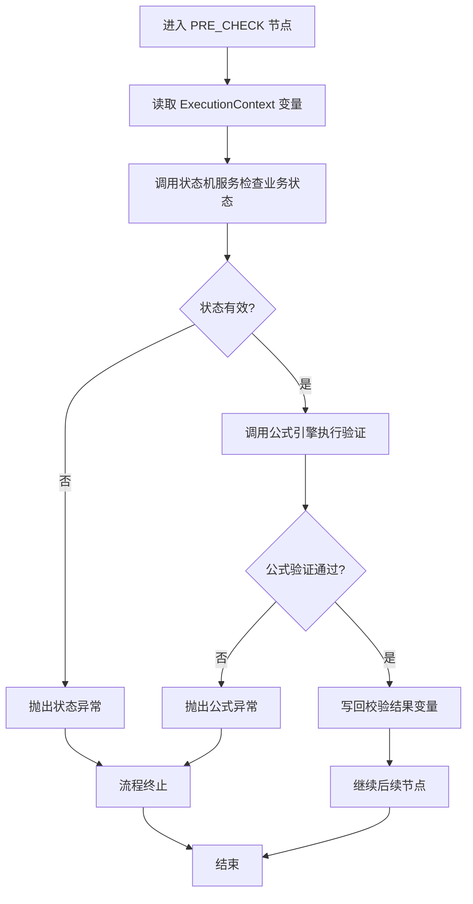
```mermaid
flowchart TD
Enter["进入 PRE_CHECK 节点"] --> ReadVars["读取 ExecutionContext 变量"]
ReadVars --> CheckState["调用状态机服务检查业务状态"]
CheckState --> StateValid{"状态有效?"}
StateValid --> |否| ThrowStateErr["抛出状态异常"]
StateValid --> |是| CalcFormula["调用公式引擎执行验证"]
CalcFormula --> FormulaValid{"公式验证通过?"}
FormulaValid --> |否| ThrowFormulaErr["抛出公式异常"]
FormulaValid --> |是| WriteRes["写回校验结果变量"]
ThrowStateErr --> EndFail["流程终止"]
ThrowFormulaErr --> EndFail
WriteRes --> Next["继续后续节点"]
EndFail --> End["结束"]
Next --> End
```

**图表来源**
- [AbstractNodeHandler.java](file://flow-engine/src/main/java/com/flow/engine/node/AbstractNodeHandler.java)
- [ExecutionContext.java](file://flow-engine/src/main/java/com/flow/engine/node/ExecutionContext.java)
- [CustomDemoNodeHandler.java](file://flow-engine/src/main/java/com/flow/engine/node/impl/CustomDemoNodeHandler.java)
- [EmsStateMachineService.java](file://flow-engine/src/main/java/com/flow/engine/service/EmsStateMachineService.java)
- [EmsFormulaEngineService.java](file://flow-engine/src/main/java/com/flow/engine/service/EmsFormulaEngineService.java)
- [ProcessDefinitionService.java](file://flow-engine/src/main/java/com/flow/engine/service/ProcessDefinitionService.java)
- [ProcessInstanceService.java](file://flow-engine/src/main/java/com/flow/engine/service/ProcessInstanceService.java)

章节来源
- [AbstractNodeHandler.java](file://flow-engine/src/main/java/com/flow/engine/node/AbstractNodeHandler.java)
- [ExecutionContext.java](file://flow-engine/src/main/java/com/flow/engine/node/ExecutionContext.java)
- [CustomDemoNodeHandler.java](file://flow-engine/src/main/java/com/flow/engine/node/impl/CustomDemoNodeHandler.java)
- [EmsStateMachineService.java](file://flow-engine/src/main/java/com/flow/engine/service/EmsStateMachineService.java)
- [EmsFormulaEngineService.java](file://flow-engine/src/main/java/com/flow/engine/service/EmsFormulaEngineService.java)
- [ProcessDefinitionService.java](file://flow-engine/src/main/java/com/flow/engine/service/ProcessDefinitionService.java)
- [ProcessInstanceService.java](file://flow-engine/src/main/java/com/flow/engine/service/ProcessInstanceService.java)

## 依赖关系分析
- 组件耦合
  - FlowEngine 依赖 NodeHandlerRegistry 获取处理器，低耦合高内聚
  - 处理器仅依赖 ExecutionContext，避免直接耦合流程内部状态
  - Webhook 子系统通过控制器与服务解耦，调度器负责重试
  - **环境监测LIMS专用组件依赖 ExprEngine 提供统一的表达式求值能力**
- 外部依赖
  - Spring 容器与自动配置
  - 数据库持久化（WebhookLog、流程实体、状态机定义、序列定义）
  - HTTP 客户端（调用外部 Webhook 地址）

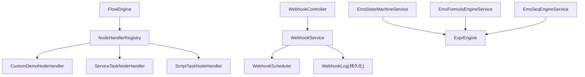
```mermaid
graph TB
FE["FlowEngine"] --> REG["NodeHandlerRegistry"]
REG --> H1["CustomDemoNodeHandler"]
REG --> H2["ServiceTaskNodeHandler"]
REG --> H3["ScriptTaskNodeHandler"]
WC["WebhookController"] --> WS["WebhookService"]
WS --> SCH["WebhookScheduler"]
WS --> LOG["WebhookLog(持久化)"]
SSM["EmsStateMachineService"] --> EE["ExprEngine"]
FFE["EmsFormulaEngineService"] --> EE
SSE["EmsSeqEngineService"] --> EE
```

**图表来源**
- [FlowEngine.java](file://flow-engine/src/main/java/com/flow/engine/engine/FlowEngine.java)
- [NodeHandlerRegistry.java](file://flow-engine/src/main/java/com/flow/engine/node/NodeHandlerRegistry.java)
- [CustomDemoNodeHandler.java](file://flow-engine/src/main/java/com/flow/engine/node/impl/CustomDemoNodeHandler.java)
- [ServiceTaskNodeHandler.java](file://flow-engine/src/main/java/com/flow/engine/node/impl/ServiceTaskNodeHandler.java)
- [ScriptTaskNodeHandler.java](file://flow-engine/src/main/java/com/flow/engine/node/impl/ScriptTaskNodeHandler.java)
- [WebhookController.java](file://flow-engine/src/main/java/com/flow/engine/controllers/WebhookController.java)
- [WebhookService.java](file://flow-engine/src/main/java/com/flow/engine/service/WebhookService.java)
- [WebhookScheduler.java](file://flow-engine/src/main/java/com/flow/engine/service/WebhookScheduler.java)
- [WebhookLog.java](file://flow-engine/src/main/java/com/flow/engine/entity/WebhookLog.java)
- [EmsStateMachineService.java](file://flow-engine/src/main/java/com/flow/engine/service/EmsStateMachineService.java)
- [EmsFormulaEngineService.java](file://flow-engine/src/main/java/com/flow/engine/service/EmsFormulaEngineService.java)
- [EmsSeqEngineService.java](file://flow-engine/src/main/java/com/flow/engine/service/EmsSeqEngineService.java)
- [ExprEngine.java](file://flow-engine/src/main/java/com/flow/engine/util/ExprEngine.java)

章节来源
- [FlowEngine.java](file://flow-engine/src/main/java/com/flow/engine/engine/FlowEngine.java)
- [NodeHandlerRegistry.java](file://flow-engine/src/main/java/com/flow/engine/node/NodeHandlerRegistry.java)
- [WebhookController.java](file://flow-engine/src/main/java/com/flow/engine/controllers/WebhookController.java)
- [WebhookService.java](file://flow-engine/src/main/java/com/flow/engine/service/WebhookService.java)
- [WebhookScheduler.java](file://flow-engine/src/main/java/com/flow/engine/service/WebhookScheduler.java)
- [WebhookLog.java](file://flow-engine/src/main/java/com/flow/engine/entity/WebhookLog.java)
- [EmsStateMachineService.java](file://flow-engine/src/main/java/com/flow/engine/service/EmsStateMachineService.java)
- [EmsFormulaEngineService.java](file://flow-engine/src/main/java/com/flow/engine/service/EmsFormulaEngineService.java)
- [EmsSeqEngineService.java](file://flow-engine/src/main/java/com/flow/engine/service/EmsSeqEngineService.java)
- [ExprEngine.java](file://flow-engine/src/main/java/com/flow/engine/util/ExprEngine.java)

## 性能考虑
- 节点执行
  - 避免在处理器中进行阻塞 IO；必要时异步化或引入缓存
  - 合理拆分复杂逻辑，减少单次执行耗时
- Webhook 调用
  - 使用连接池与超时控制，避免资源耗尽
  - 失败重试采用指数退避与最大次数限制
- **环境监测LIMS专用组件优化**
  - 状态机查询：合理使用索引，避免全表扫描
  - 公式计算：缓存常用表达式，减少重复解析
  - 序列号生成：利用数据库事务保证并发安全，避免锁竞争
- 日志与监控
  - 操作日志批量写入，降低 I/O 压力
  - 关键指标埋点（QPS、P99、错误率）

## 故障排查指南
- 常见错误
  - 节点未找到：检查节点类型标识是否与处理器实现一致，确认自动配置已启用
  - Webhook 调用失败：查看 WebhookLog 记录，确认网络连通性与签名校验
  - 变量未生效：确认处理器是否正确写入 ExecutionContext 变量
  - **状态机迁移失败：检查 t_transition_def 表配置，确认状态迁移定义和守卫表达式**
  - **公式计算错误：验证公式语法和变量类型，检查 ExprEngine 上下文参数**
  - **序列号冲突：确认业务键唯一性，检查数据库序列定义**
- 定位手段
  - 开启 DEBUG 日志，关注 FlowEngine 与 Webhook 相关日志
  - 使用全局异常处理器返回的标准错误码与消息快速定位问题
  - **针对专用组件：添加详细的执行日志，记录状态机查询结果、公式计算过程、序列号生成详情**
- 恢复策略
  - 对于 Webhook 失败，利用调度器重试；必要时人工介入重放
  - 对于节点异常，修正配置或代码后重新发起流程
  - **对于专用组件问题：修复配置后清理缓存，重新初始化相关服务**

章节来源
- [GlobalExceptionHandler.java](file://flow-engine/src/main/java/com/flow/engine/common/GlobalExceptionHandler.java)
- [ErrorCode.java](file://flow-engine/src/main/java/com/flow/engine/common/ErrorCode.java)
- [Result.java](file://flow-engine/src/main/java/com/flow/engine/common/Result.java)
- [WebhookLog.java](file://flow-engine/src/main/java/com/flow/engine/entity/WebhookLog.java)
- [EmsStateMachineService.java](file://flow-engine/src/main/java/com/flow/engine/service/EmsStateMachineService.java)
- [EmsFormulaEngineService.java](file://flow-engine/src/main/java/com/flow/engine/service/EmsFormulaEngineService.java)
- [EmsSeqEngineService.java](file://flow-engine/src/main/java/com/flow/engine/service/EmsSeqEngineService.java)

## 结论
通过实现 NodeHandler 接口并结合自动配置机制，开发者可以便捷地扩展流程节点；借助 Webhook 事件机制可实现与外部系统的松耦合集成；注解与 AOP 提供了统一的横切能力。**新增的环境监测LIMS专用组件（状态机服务、公式引擎、序列号引擎）为业务流程提供了强大的状态管理和数据处理能力**。遵循本文的最佳实践与排障建议，可显著提升扩展的可维护性与稳定性。

## 附录
- 打包与部署
  - 将自定义处理器所在模块纳入主应用依赖，确保 Spring 扫描范围包含新包
  - 使用 Maven/Gradle 构建产物，部署至目标环境并验证自动注册
  - **专用组件部署：确保数据库表结构正确初始化，配置相应的业务规则和公式**
- 版本管理
  - 为处理器定义稳定的节点类型标识，避免破坏兼容
  - 变更配置参数时保持向后兼容，提供迁移脚本或默认值
  - **专用组件版本管理：状态机定义、公式模板、序列规则的版本控制和迁移策略**
- 调试技巧
  - 在处理器中打印关键变量快照，配合链路追踪 ID 定位问题
  - 使用单元测试覆盖边界条件与异常路径
  - **专用组件调试：使用表达式测试工具验证公式，使用状态机可视化界面检查状态流转**