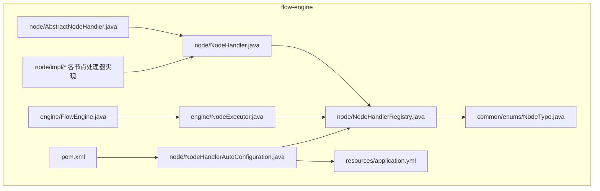
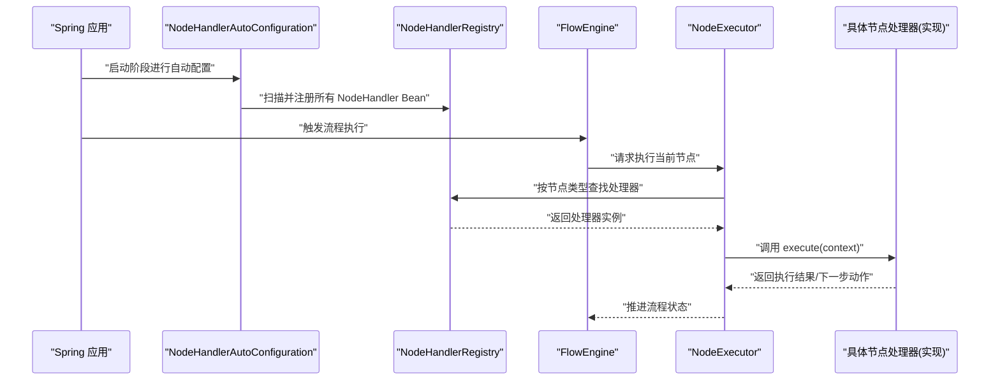
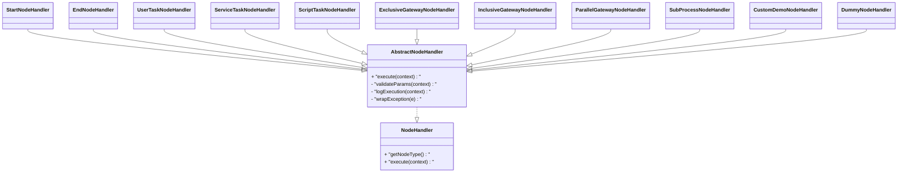
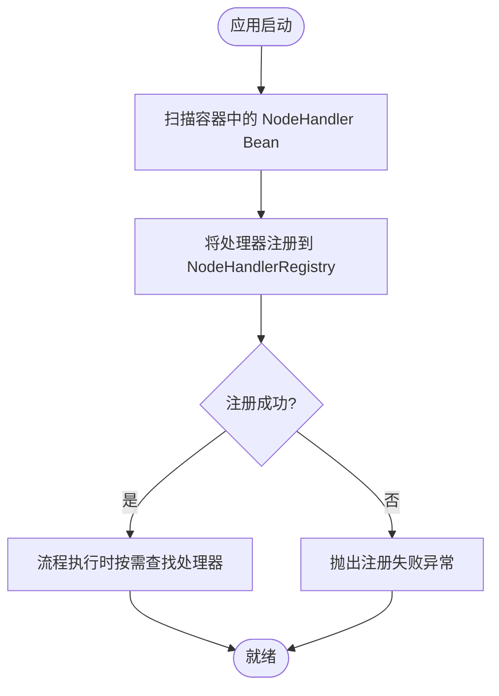
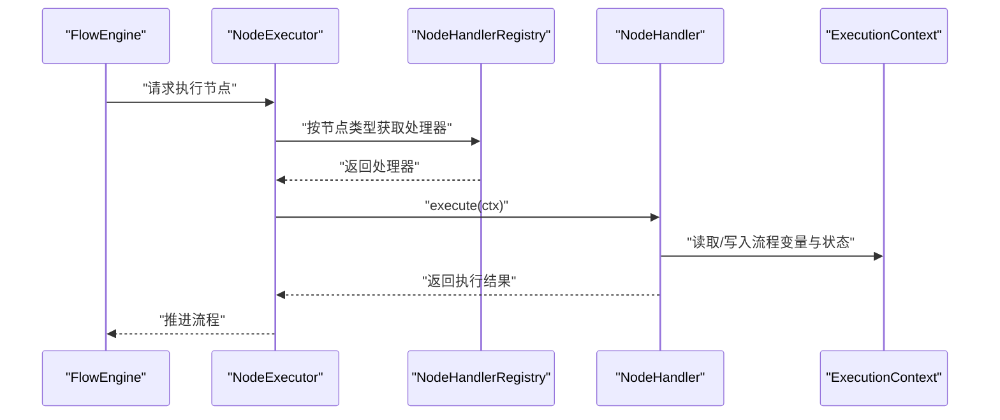
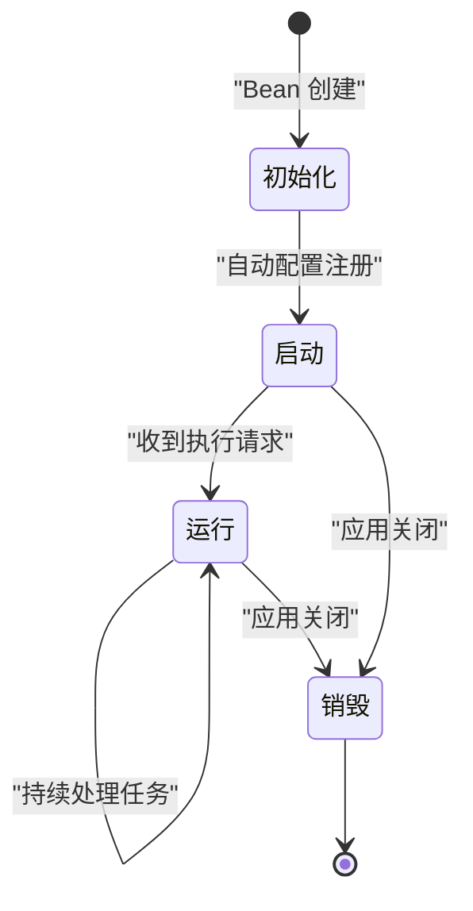
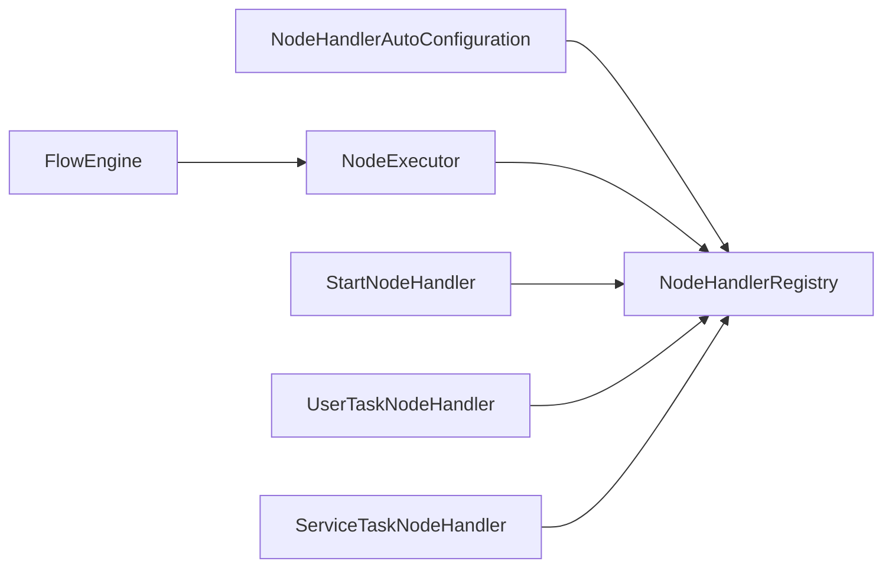

# 插件架构设计

<cite>
**本文引用的文件**   
- [NodeHandler.java](file://flow-engine/src/main/java/com/flow/engine/node/NodeHandler.java)
- [AbstractNodeHandler.java](file://flow-engine/src/main/java/com/flow/engine/node/AbstractNodeHandler.java)
- [NodeHandlerRegistry.java](file://flow-engine/src/main/java/com/flow/engine/node/NodeHandlerRegistry.java)
- [NodeHandlerAutoConfiguration.java](file://flow-engine/src/main/java/com/flow/engine/node/NodeHandlerAutoConfiguration.java)
- [FlowEngine.java](file://flow-engine/src/main/java/com/flow/engine/engine/FlowEngine.java)
- [NodeExecutor.java](file://flow-engine/src/main/java/com/flow/engine/engine/NodeExecutor.java)
- [StartNodeHandler.java](file://flow-engine/src/main/java/com/flow/engine/node/impl/StartNodeHandler.java)
- [EndNodeHandler.java](file://flow-engine/src/main/java/com/flow/engine/node/impl/EndNodeHandler.java)
- [UserTaskNodeHandler.java](file://flow-engine/src/main/java/com/flow/engine/node/impl/UserTaskNodeHandler.java)
- [ServiceTaskNodeHandler.java](file://flow-engine/src/main/java/com/flow/engine/node/impl/ServiceTaskNodeHandler.java)
- [ScriptTaskNodeHandler.java](file://flow-engine/src/main/java/com/flow/engine/node/impl/ScriptTaskNodeHandler.java)
- [ExclusiveGatewayNodeHandler.java](file://flow-engine/src/main/java/com/flow/engine/node/impl/ExclusiveGatewayNodeHandler.java)
- [InclusiveGatewayNodeHandler.java](file://flow-engine/src/main/java/com/flow/engine/node/impl/InclusiveGatewayNodeHandler.java)
- [ParallelGatewayNodeHandler.java](file://flow-engine/src/main/java/com/flow/engine/node/impl/ParallelGatewayNodeHandler.java)
- [SubProcessNodeHandler.java](file://flow-engine/src/main/java/com/flow/engine/node/impl/SubProcessNodeHandler.java)
- [CustomDemoNodeHandler.java](file://flow-engine/src/main/java/com/flow/engine/node/impl/CustomDemoNodeHandler.java)
- [DummyNodeHandler.java](file://flow-engine/src/main/java/com/flow/engine/node/DummyNodeHandler.java)
- [ExecutionContext.java](file://flow-engine/src/main/java/com/flow/engine/node/ExecutionContext.java)
- [NodeType.java](file://flow-engine/src/main/java/com/flow/engine/common/enums/NodeType.java)
- [application.yml](file://flow-engine/src/main/resources/application.yml)
- [pom.xml](file://flow-engine/pom.xml)
- [NodeHandlerRegistryTest.java](file://flow-engine/src/test/java/com/flow/engine/node/NodeHandlerRegistryTest.java)
- [NodeHandlerAutoRegisterTest.java](file://flow-engine/src/test/java/com/flow/engine/node/NodeHandlerAutoRegisterTest.java)
- [BuiltinNodeTest.java](file://flow-engine/src/test/java/com/flow/engine/node/BuiltinNodeTest.java)
- [CustomNodeExtensionTest.java](file://flow-engine/src/test/java/com/flow/engine/node/CustomNodeExtensionTest.java)
</cite>

## 目录
1. [简介](#简介)
2. [项目结构](#项目结构)
3. [核心组件](#核心组件)
4. [架构总览](#架构总览)
5. [详细组件分析](#详细组件分析)
6. [依赖关系分析](#依赖关系分析)
7. [性能考量](#性能考量)
8. [故障排查指南](#故障排查指南)
9. [结论](#结论)
10. [附录](#附录)

## 简介
本文件围绕流程引擎的“插件化节点”能力，系统化阐述以下主题：
- Spring Boot 自动配置原理与条件装配（@Configuration、条件注解）在节点处理器注册中的应用
- NodeHandlerRegistry 节点注册表的设计模式与实现要点（发现、加载、管理）
- 插件生命周期管理（初始化、启动、运行、销毁）
- 插件间依赖管理与版本兼容性策略
- 插件打包与部署最佳实践（Maven/Gradle 配置与依赖声明）
- 插件配置管理机制（配置文件结构与环境变量支持）
- 插件测试策略与调试技巧
- 插件市场或仓库的管理方案

## 项目结构
本项目采用分层与按功能域组织相结合的结构。与插件体系直接相关的代码集中在 flow-engine 模块的 node 包及其实现 impl 子包中，并通过自动配置类完成扫描与注册；执行层通过 FlowEngine 与 NodeExecutor 驱动节点执行。

图表来源
- [NodeHandler.java](file://flow-engine/src/main/java/com/flow/engine/node/NodeHandler.java)
- [AbstractNodeHandler.java](file://flow-engine/src/main/java/com/flow/engine/node/AbstractNodeHandler.java)
- [NodeHandlerRegistry.java](file://flow-engine/src/main/java/com/flow/engine/node/NodeHandlerRegistry.java)
- [NodeHandlerAutoConfiguration.java](file://flow-engine/src/main/java/com/flow/engine/node/NodeHandlerAutoConfiguration.java)
- [FlowEngine.java](file://flow-engine/src/main/java/com/flow/engine/engine/FlowEngine.java)
- [NodeExecutor.java](file://flow-engine/src/main/java/com/flow/engine/engine/NodeExecutor.java)
- [NodeType.java](file://flow-engine/src/main/java/com/flow/engine/common/enums/NodeType.java)
- [application.yml](file://flow-engine/src/main/resources/application.yml)
- [pom.xml](file://flow-engine/pom.xml)

章节来源
- [NodeHandler.java](file://flow-engine/src/main/java/com/flow/engine/node/NodeHandler.java)
- [NodeHandlerRegistry.java](file://flow-engine/src/main/java/com/flow/engine/node/NodeHandlerRegistry.java)
- [NodeHandlerAutoConfiguration.java](file://flow-engine/src/main/java/com/flow/engine/node/NodeHandlerAutoConfiguration.java)
- [FlowEngine.java](file://flow-engine/src/main/java/com/flow/engine/engine/FlowEngine.java)
- [NodeExecutor.java](file://flow-engine/src/main/java/com/flow/engine/engine/NodeExecutor.java)
- [NodeType.java](file://flow-engine/src/main/java/com/flow/engine/common/enums/NodeType.java)
- [application.yml](file://flow-engine/src/main/resources/application.yml)
- [pom.xml](file://flow-engine/pom.xml)

## 核心组件
- 节点处理器接口与抽象基类
  - NodeHandler：定义节点处理契约（如类型标识、执行入口等）
  - AbstractNodeHandler：提供通用能力（上下文访问、日志、异常封装等），降低重复实现成本
- 节点注册表
  - NodeHandlerRegistry：维护节点类型到处理器实例的映射，提供查询、校验、扩展点
- 自动配置
  - NodeHandlerAutoConfiguration：基于 Spring 容器扫描并注册所有实现了 NodeHandler 的 Bean，完成“约定优于配置”的插件发现
- 执行器
  - FlowEngine：编排流程执行，协调节点进入、退出、分支、并行等
  - NodeExecutor：根据当前节点类型从注册表解析处理器并委派执行
- 内置节点实现
  - StartNodeHandler、EndNodeHandler、UserTaskNodeHandler、ServiceTaskNodeHandler、ScriptTaskNodeHandler、各类网关与子流程处理器
- 上下文与枚举
  - ExecutionContext：承载流程变量、运行时状态、事件发布等
  - NodeType：统一节点类型常量，用于路由与校验

章节来源
- [NodeHandler.java](file://flow-engine/src/main/java/com/flow/engine/node/NodeHandler.java)
- [AbstractNodeHandler.java](file://flow-engine/src/main/java/com/flow/engine/node/AbstractNodeHandler.java)
- [NodeHandlerRegistry.java](file://flow-engine/src/main/java/com/flow/engine/node/NodeHandlerRegistry.java)
- [NodeHandlerAutoConfiguration.java](file://flow-engine/src/main/java/com/flow/engine/node/NodeHandlerAutoConfiguration.java)
- [FlowEngine.java](file://flow-engine/src/main/java/com/flow/engine/engine/FlowEngine.java)
- [NodeExecutor.java](file://flow-engine/src/main/java/com/flow/engine/engine/NodeExecutor.java)
- [ExecutionContext.java](file://flow-engine/src/main/java/com/flow/engine/node/ExecutionContext.java)
- [NodeType.java](file://flow-engine/src/main/java/com/flow/engine/common/enums/NodeType.java)

## 架构总览
下图展示了插件化节点在 Spring Boot 中的装配与执行路径：应用启动时由自动配置类扫描并注册节点处理器；流程执行时，执行器依据节点类型从注册表获取处理器并调用其执行方法。

图表来源
- [NodeHandlerAutoConfiguration.java](file://flow-engine/src/main/java/com/flow/engine/node/NodeHandlerAutoConfiguration.java)
- [NodeHandlerRegistry.java](file://flow-engine/src/main/java/com/flow/engine/node/NodeHandlerRegistry.java)
- [FlowEngine.java](file://flow-engine/src/main/java/com/flow/engine/engine/FlowEngine.java)
- [NodeExecutor.java](file://flow-engine/src/main/java/com/flow/engine/engine/NodeExecutor.java)
- [NodeHandler.java](file://flow-engine/src/main/java/com/flow/engine/node/NodeHandler.java)

## 详细组件分析

### 节点处理器接口与抽象基类
- 职责边界
  - NodeHandler：定义统一的节点处理契约，确保不同节点具备一致的可插拔能力
  - AbstractNodeHandler：沉淀公共逻辑（上下文访问、参数校验、异常转换、日志埋点等），减少样板代码
- 复杂度与可扩展性
  - 新增节点只需实现接口并在容器中注册为 Bean，即可被自动发现
  - 通过继承抽象基类可快速复用通用能力，提升一致性

图表来源
- [NodeHandler.java](file://flow-engine/src/main/java/com/flow/engine/node/NodeHandler.java)
- [AbstractNodeHandler.java](file://flow-engine/src/main/java/com/flow/engine/node/AbstractNodeHandler.java)
- [StartNodeHandler.java](file://flow-engine/src/main/java/com/flow/engine/node/impl/StartNodeHandler.java)
- [EndNodeHandler.java](file://flow-engine/src/main/java/com/flow/engine/node/impl/EndNodeHandler.java)
- [UserTaskNodeHandler.java](file://flow-engine/src/main/java/com/flow/engine/node/impl/UserTaskNodeHandler.java)
- [ServiceTaskNodeHandler.java](file://flow-engine/src/main/java/com/flow/engine/node/impl/ServiceTaskNodeHandler.java)
- [ScriptTaskNodeHandler.java](file://flow-engine/src/main/java/com/flow/engine/node/impl/ScriptTaskNodeHandler.java)
- [ExclusiveGatewayNodeHandler.java](file://flow-engine/src/main/java/com/flow/engine/node/impl/ExclusiveGatewayNodeHandler.java)
- [InclusiveGatewayNodeHandler.java](file://flow-engine/src/main/java/com/flow/engine/node/impl/InclusiveGatewayNodeHandler.java)
- [ParallelGatewayNodeHandler.java](file://flow-engine/src/main/java/com/flow/engine/node/impl/ParallelGatewayNodeHandler.java)
- [SubProcessNodeHandler.java](file://flow-engine/src/main/java/com/flow/engine/node/impl/SubProcessNodeHandler.java)
- [CustomDemoNodeHandler.java](file://flow-engine/src/main/java/com/flow/engine/node/impl/CustomDemoNodeHandler.java)
- [DummyNodeHandler.java](file://flow-engine/src/main/java/com/flow/engine/node/DummyNodeHandler.java)

章节来源
- [NodeHandler.java](file://flow-engine/src/main/java/com/flow/engine/node/NodeHandler.java)
- [AbstractNodeHandler.java](file://flow-engine/src/main/java/com/flow/engine/node/AbstractNodeHandler.java)
- [StartNodeHandler.java](file://flow-engine/src/main/java/com/flow/engine/node/impl/StartNodeHandler.java)
- [EndNodeHandler.java](file://flow-engine/src/main/java/com/flow/engine/node/impl/EndNodeHandler.java)
- [UserTaskNodeHandler.java](file://flow-engine/src/main/java/com/flow/engine/node/impl/UserTaskNodeHandler.java)
- [ServiceTaskNodeHandler.java](file://flow-engine/src/main/java/com/flow/engine/node/impl/ServiceTaskNodeHandler.java)
- [ScriptTaskNodeHandler.java](file://flow-engine/src/main/java/com/flow/engine/node/impl/ScriptTaskNodeHandler.java)
- [ExclusiveGatewayNodeHandler.java](file://flow-engine/src/main/java/com/flow/engine/node/impl/ExclusiveGatewayNodeHandler.java)
- [InclusiveGatewayNodeHandler.java](file://flow-engine/src/main/java/com/flow/engine/node/impl/InclusiveGatewayNodeHandler.java)
- [ParallelGatewayNodeHandler.java](file://flow-engine/src/main/java/com/flow/engine/node/impl/ParallelGatewayNodeHandler.java)
- [SubProcessNodeHandler.java](file://flow-engine/src/main/java/com/flow/engine/node/impl/SubProcessNodeHandler.java)
- [CustomDemoNodeHandler.java](file://flow-engine/src/main/java/com/flow/engine/node/impl/CustomDemoNodeHandler.java)
- [DummyNodeHandler.java](file://flow-engine/src/main/java/com/flow/engine/node/DummyNodeHandler.java)

### 节点注册表与自动配置
- 设计要点
  - 注册表负责维护“节点类型 -> 处理器实例”的映射，并提供线程安全的查询与校验能力
  - 自动配置类在应用启动时扫描容器内所有 NodeHandler Bean，将其注入注册表
- 条件装配
  - 可通过 @ConditionalOnProperty / @ConditionalOnClass 等条件注解控制是否启用特定处理器或注册行为，避免不必要的依赖引入
- 扩展方式
  - 新增插件仅需实现 NodeHandler 并以 Spring Bean 暴露，无需修改核心代码

图表来源
- [NodeHandlerAutoConfiguration.java](file://flow-engine/src/main/java/com/flow/engine/node/NodeHandlerAutoConfiguration.java)
- [NodeHandlerRegistry.java](file://flow-engine/src/main/java/com/flow/engine/node/NodeHandlerRegistry.java)

章节来源
- [NodeHandlerAutoConfiguration.java](file://flow-engine/src/main/java/com/flow/engine/node/NodeHandlerAutoConfiguration.java)
- [NodeHandlerRegistry.java](file://flow-engine/src/main/java/com/flow/engine/node/NodeHandlerRegistry.java)

### 执行流程与上下文
- 执行链路
  - FlowEngine 驱动流程推进，遇到节点时委托 NodeExecutor 执行
  - NodeExecutor 根据当前节点类型从注册表解析处理器并调用执行方法
- 上下文对象
  - ExecutionContext 贯穿整个执行过程，承载流程变量、运行时状态、事件发布等

图表来源
- [FlowEngine.java](file://flow-engine/src/main/java/com/flow/engine/engine/FlowEngine.java)
- [NodeExecutor.java](file://flow-engine/src/main/java/com/flow/engine/engine/NodeExecutor.java)
- [NodeHandlerRegistry.java](file://flow-engine/src/main/java/com/flow/engine/node/NodeHandlerRegistry.java)
- [NodeHandler.java](file://flow-engine/src/main/java/com/flow/engine/node/NodeHandler.java)
- [ExecutionContext.java](file://flow-engine/src/main/java/com/flow/engine/node/ExecutionContext.java)

章节来源
- [FlowEngine.java](file://flow-engine/src/main/java/com/flow/engine/engine/FlowEngine.java)
- [NodeExecutor.java](file://flow-engine/src/main/java/com/flow/engine/engine/NodeExecutor.java)
- [NodeHandlerRegistry.java](file://flow-engine/src/main/java/com/flow/engine/node/NodeHandlerRegistry.java)
- [NodeHandler.java](file://flow-engine/src/main/java/com/flow/engine/node/NodeHandler.java)
- [ExecutionContext.java](file://flow-engine/src/main/java/com/flow/engine/node/ExecutionContext.java)

### 插件生命周期管理
- 初始化
  - 作为 Spring Bean 创建时完成依赖注入与资源准备
- 启动
  - 自动配置阶段完成注册，注册表建立映射
- 运行
  - 执行期通过 execute 方法处理业务逻辑，读写 ExecutionContext
- 销毁
  - 应用关闭时由 Spring 容器回收 Bean，释放资源

[本节为概念性说明，不直接分析具体文件，故无章节来源]

### 插件间依赖管理与版本兼容
- 依赖管理
  - 通过 Spring 容器依赖注入解决处理器之间的协作关系
  - 使用条件装配按需启用依赖，避免循环依赖与不必要耦合
- 版本兼容
  - 在处理器内部对输入参数做向后兼容校验与默认值填充
  - 通过 NodeType 与配置项区分不同版本的行为差异

章节来源
- [NodeHandlerAutoConfiguration.java](file://flow-engine/src/main/java/com/flow/engine/node/NodeHandlerAutoConfiguration.java)
- [NodeType.java](file://flow-engine/src/main/java/com/flow/engine/common/enums/NodeType.java)

### 插件打包与部署最佳实践
- Maven/Gradle 配置
  - 将插件作为独立 artifact 发布，明确依赖范围（compile/runtime/test）
  - 使用 spring-boot-maven-plugin 或对应 Gradle 插件构建可部署产物
- 依赖声明
  - 仅声明必要依赖，避免引入大型无关库
  - 通过 BOM 或父 POM 统一管理版本，保证一致性
- 部署
  - 将插件 jar 放入应用 classpath 或通过外部依赖管理工具注入
  - 利用条件装配与环境变量控制是否启用某插件

章节来源
- [pom.xml](file://flow-engine/pom.xml)

### 插件配置管理机制
- 配置文件结构
  - application.yml 中可按模块划分配置项，便于插件读取
- 环境变量支持
  - 结合 Spring 的环境占位符与 @Value/@ConfigurationProperties 注入
- 建议
  - 为每个插件提供独立的配置前缀，避免命名冲突
  - 提供默认值与校验规则，增强鲁棒性

章节来源
- [application.yml](file://flow-engine/src/main/resources/application.yml)

### 插件测试策略与调试技巧
- 单元测试
  - 针对注册表与自动配置的覆盖用例，验证扫描与注册行为
  - 针对内置节点处理器编写单测，覆盖正常路径与异常路径
- 集成测试
  - 使用 SpringBootTest 启动完整上下文，端到端验证流程执行
- 调试技巧
  - 开启 DEBUG 日志定位注册与执行链路
  - 使用断点跟踪 ExecutionContext 的状态变化

章节来源
- [NodeHandlerRegistryTest.java](file://flow-engine/src/test/java/com/flow/engine/node/NodeHandlerRegistryTest.java)
- [NodeHandlerAutoRegisterTest.java](file://flow-engine/src/test/java/com/flow/engine/node/NodeHandlerAutoRegisterTest.java)
- [BuiltinNodeTest.java](file://flow-engine/src/test/java/com/flow/engine/node/BuiltinNodeTest.java)
- [CustomNodeExtensionTest.java](file://flow-engine/src/test/java/com/flow/engine/node/CustomNodeExtensionTest.java)

### 插件市场或仓库管理方案
- 私有仓库
  - 使用 Nexus/Artifactory 托管插件制品，配合 CI/CD 流水线自动化发布
- 版本治理
  - 遵循语义化版本，提供变更日志与兼容性矩阵
- 元数据与清单
  - 在制品中附带插件描述、依赖、配置项清单，便于平台侧展示与校验
- 安全与审计
  - 签名校验、漏洞扫描、访问控制与审计日志

[本节为概念性说明，不直接分析具体文件，故无章节来源]

## 依赖关系分析
- 组件耦合
  - 处理器与注册表松耦合，通过接口与映射表解耦
  - 自动配置集中管理扫描与注册，降低侵入性
- 外部依赖
  - Spring 容器与条件装配机制
  - 数据库、缓存、消息等基础设施通过服务层注入，不影响插件核心

图表来源
- [NodeHandlerAutoConfiguration.java](file://flow-engine/src/main/java/com/flow/engine/node/NodeHandlerAutoConfiguration.java)
- [NodeHandlerRegistry.java](file://flow-engine/src/main/java/com/flow/engine/node/NodeHandlerRegistry.java)
- [NodeExecutor.java](file://flow-engine/src/main/java/com/flow/engine/engine/NodeExecutor.java)
- [FlowEngine.java](file://flow-engine/src/main/java/com/flow/engine/engine/FlowEngine.java)
- [StartNodeHandler.java](file://flow-engine/src/main/java/com/flow/engine/node/impl/StartNodeHandler.java)
- [UserTaskNodeHandler.java](file://flow-engine/src/main/java/com/flow/engine/node/impl/UserTaskNodeHandler.java)
- [ServiceTaskNodeHandler.java](file://flow-engine/src/main/java/com/flow/engine/node/impl/ServiceTaskNodeHandler.java)

章节来源
- [NodeHandlerAutoConfiguration.java](file://flow-engine/src/main/java/com/flow/engine/node/NodeHandlerAutoConfiguration.java)
- [NodeHandlerRegistry.java](file://flow-engine/src/main/java/com/flow/engine/node/NodeHandlerRegistry.java)
- [NodeExecutor.java](file://flow-engine/src/main/java/com/flow/engine/engine/NodeExecutor.java)
- [FlowEngine.java](file://flow-engine/src/main/java/com/flow/engine/engine/FlowEngine.java)

## 性能考量
- 注册表查询
  - 使用哈希映射实现 O(1) 查找，避免线性扫描
- 处理器实现
  - 避免阻塞操作，必要时异步化或批量化
- 上下文对象
  - 控制变量大小与序列化开销，避免频繁大对象传递
- 条件装配
  - 按需启用处理器，减少内存占用与启动时间

[本节为通用指导，不直接分析具体文件，故无章节来源]

## 故障排查指南
- 常见问题
  - 节点未注册：检查自动配置扫描范围与 Bean 可见性
  - 节点类型不匹配：核对 NodeType 与处理器 getNodeType 返回值
  - 配置缺失：确认 application.yml 与系统环境变量是否正确注入
- 定位手段
  - 开启 DEBUG 日志，观察注册与执行链路
  - 使用单测与集成测试复现问题，逐步缩小范围

章节来源
- [NodeHandlerAutoConfiguration.java](file://flow-engine/src/main/java/com/flow/engine/node/NodeHandlerAutoConfiguration.java)
- [NodeHandlerRegistry.java](file://flow-engine/src/main/java/com/flow/engine/node/NodeHandlerRegistry.java)
- [application.yml](file://flow-engine/src/main/resources/application.yml)

## 结论
通过将节点处理器抽象为可插拔组件，并结合 Spring Boot 的条件装配与自动配置，本架构实现了低侵入、高扩展的流程节点管理能力。注册表与执行器的清晰分工保障了可测试性与可维护性；完善的测试策略与配置机制进一步提升了交付质量与运维效率。

[本节为总结性内容，不直接分析具体文件，故无章节来源]

## 附录
- 术语
  - 插件：实现 NodeHandler 接口的处理器，以 Spring Bean 形式注册
  - 自动配置：在应用启动阶段完成插件发现与注册
  - 上下文：ExecutionContext，贯穿执行期的状态载体
- 参考路径
  - 接口与实现：见 node 与 node/impl 包
  - 自动配置与注册：见 NodeHandlerAutoConfiguration 与 NodeHandlerRegistry
  - 执行链路：见 FlowEngine 与 NodeExecutor

[本节为补充信息，不直接分析具体文件，故无章节来源]