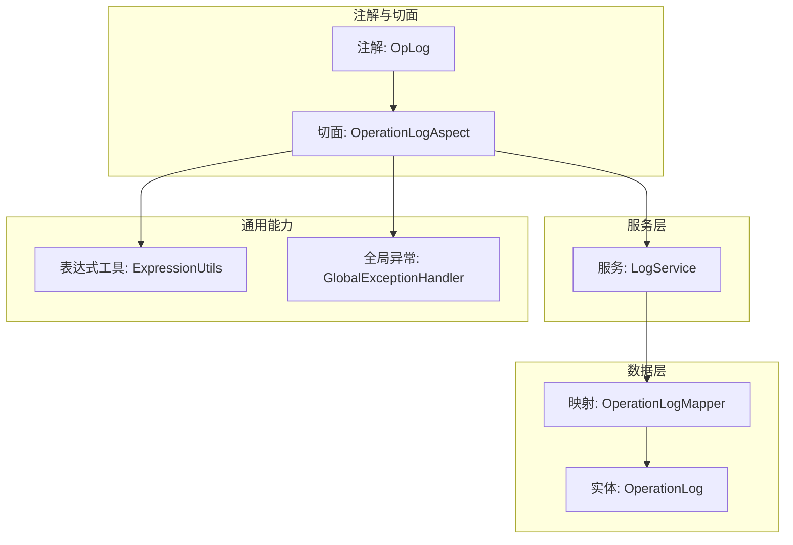
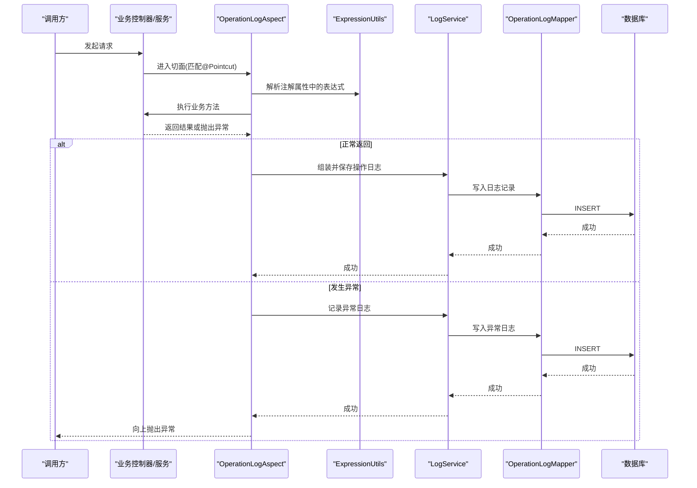
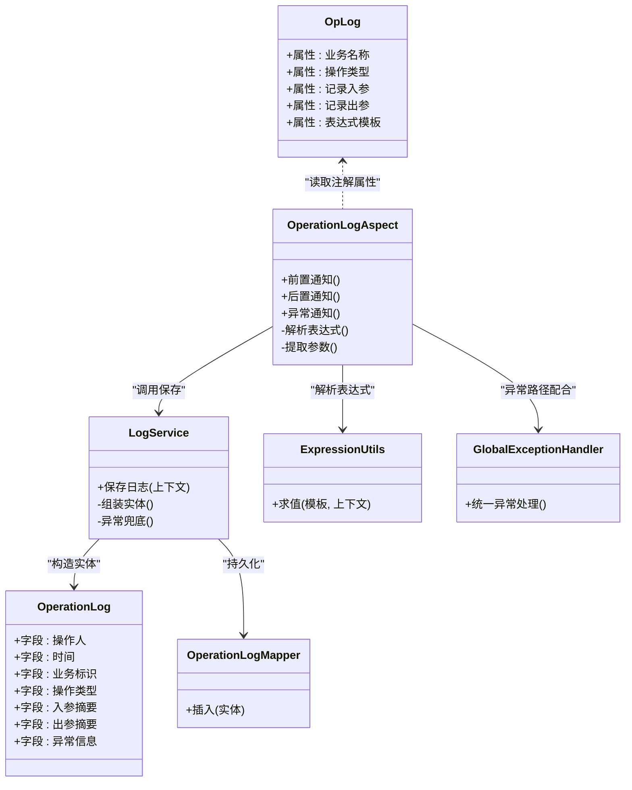
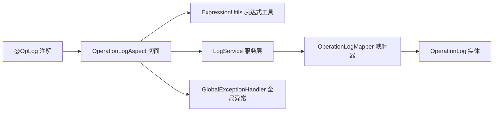

# 注解扩展机制

<cite>
**本文引用的文件**   
- [OpLog.java](file://flow-engine/src/main/java/com/flow/engine/annotation/OpLog.java)
- [OperationLogAspect.java](file://flow-engine/src/main/java/com/flow/engine/aspect/OperationLogAspect.java)
- [OperationLog.java](file://flow-engine/src/main/java/com/flow/engine/entity/OperationLog.java)
- [OperationLogMapper.java](file://flow-engine/src/main/java/com/flow/engine/mapper/OperationLogMapper.java)
- [LogService.java](file://flow-engine/src/main/java/com/flow/engine/service/LogService.java)
- [GlobalExceptionHandler.java](file://flow-engine/src/main/java/com/flow/engine/common/GlobalExceptionHandler.java)
- [ExpressionUtils.java](file://flow-engine/src/main/java/com/flow/engine/common/utils/ExpressionUtils.java)
</cite>

## 目录
1. [简介](#简介)
2. [项目结构](#项目结构)
3. [核心组件](#核心组件)
4. [架构总览](#架构总览)
5. [详细组件分析](#详细组件分析)
6. [依赖关系分析](#依赖关系分析)
7. [性能考虑](#性能考虑)
8. [故障排查指南](#故障排查指南)
9. [结论](#结论)
10. [附录](#附录)

## 简介
本文件围绕“注解扩展机制”展开，聚焦于AOP切面与自定义注解的协同工作。文档以项目中已有的操作日志注解@OpLog及其切面实现为蓝本，系统阐述：
- AOP切面的工作原理与@Aspect的使用方式
- 切点表达式的编写规范与最佳实践
- @OpLog注解的属性定义与拦截逻辑
- 如何创建自定义注解（含元注解、属性）
- 注解处理器与切面的配合流程（参数提取、业务执行、结果处理）
- 完整的自定义注解开发示例（从定义到切面落地）
- 性能考量与调试技巧、常见问题解决方案

## 项目结构
与注解扩展机制直接相关的代码位于后端模块 flow-engine 中，关键位置如下：
- 注解定义：annotation 包
- 切面实现：aspect 包
- 持久化实体与映射：entity、mapper 包
- 服务层封装：service 包
- 表达式工具：common/utils 包
- 全局异常处理：common 包

图表来源
- [OpLog.java](file://flow-engine/src/main/java/com/flow/engine/annotation/OpLog.java)
- [OperationLogAspect.java](file://flow-engine/src/main/java/com/flow/engine/aspect/OperationLogAspect.java)
- [OperationLog.java](file://flow-engine/src/main/java/com/flow/engine/entity/OperationLog.java)
- [OperationLogMapper.java](file://flow-engine/src/main/java/com/flow/engine/mapper/OperationLogMapper.java)
- [LogService.java](file://flow-engine/src/main/java/com/flow/engine/service/LogService.java)
- [ExpressionUtils.java](file://flow-engine/src/main/java/com/flow/engine/common/utils/ExpressionUtils.java)
- [GlobalExceptionHandler.java](file://flow-engine/src/main/java/com/flow/engine/common/GlobalExceptionHandler.java)

章节来源
- [OpLog.java](file://flow-engine/src/main/java/com/flow/engine/annotation/OpLog.java)
- [OperationLogAspect.java](file://flow-engine/src/main/java/com/flow/engine/aspect/OperationLogAspect.java)
- [OperationLog.java](file://flow-engine/src/main/java/com/flow/engine/entity/OperationLog.java)
- [OperationLogMapper.java](file://flow-engine/src/main/java/com/flow/engine/mapper/OperationLogMapper.java)
- [LogService.java](file://flow-engine/src/main/java/com/flow/engine/service/LogService.java)
- [ExpressionUtils.java](file://flow-engine/src/main/java/com/flow/engine/common/utils/ExpressionUtils.java)
- [GlobalExceptionHandler.java](file://flow-engine/src/main/java/com/flow/engine/common/GlobalExceptionHandler.java)

## 核心组件
- 注解定义：提供可配置的元信息，如业务名称、操作类型、是否记录入参/出参等，供切面在运行时解析。
- 切面实现：基于@Aspect声明切面类，使用@Pointcut定义匹配规则，通过前置/后置/异常通知完成参数提取、业务执行、结果落库与异常记录。
- 服务与数据层：将日志对象持久化，统一由服务层封装，便于复用与事务控制。
- 表达式工具：支持在注解属性中使用表达式动态计算字段值。
- 全局异常处理：与切面配合，确保异常路径下的日志完整性与一致性。

章节来源
- [OpLog.java](file://flow-engine/src/main/java/com/flow/engine/annotation/OpLog.java)
- [OperationLogAspect.java](file://flow-engine/src/main/java/com/flow/engine/aspect/OperationLogAspect.java)
- [LogService.java](file://flow-engine/src/main/java/com/flow/engine/service/LogService.java)
- [ExpressionUtils.java](file://flow-engine/src/main/java/com/flow/engine/common/utils/ExpressionUtils.java)
- [GlobalExceptionHandler.java](file://flow-engine/src/main/java/com/flow/engine/common/GlobalExceptionHandler.java)

## 架构总览
下图展示了从方法调用到日志落库的完整链路，以及切面与表达式工具、服务层的协作关系。

图表来源
- [OperationLogAspect.java](file://flow-engine/src/main/java/com/flow/engine/aspect/OperationLogAspect.java)
- [ExpressionUtils.java](file://flow-engine/src/main/java/com/flow/engine/common/utils/ExpressionUtils.java)
- [LogService.java](file://flow-engine/src/main/java/com/flow/engine/service/LogService.java)
- [OperationLogMapper.java](file://flow-engine/src/main/java/com/flow/engine/mapper/OperationLogMapper.java)
- [OperationLog.java](file://flow-engine/src/main/java/com/flow/engine/entity/OperationLog.java)

## 详细组件分析

### 注解定义：@OpLog
- 作用：标记需要记录操作日志的方法，提供业务名称、操作类型、是否记录入参/出参、表达式模板等配置项。
- 设计要点：
  - 使用元注解声明注解的作用域（方法级别）、保留策略（运行期可见）。
  - 属性多为字符串或布尔值，支持占位符或表达式以便动态填充。
  - 默认值应合理，避免不必要的开销。

章节来源
- [OpLog.java](file://flow-engine/src/main/java/com/flow/engine/annotation/OpLog.java)

### 切面实现：OperationLogAspect
- 职责：
  - 定义切点表达式，匹配所有带@OpLog的方法。
  - 前置通知：提取方法签名、注解属性、入参，必要时进行表达式求值。
  - 环绕/后置通知：捕获返回值，构造日志对象，调用服务层持久化。
  - 异常通知：捕获异常，记录失败原因，保证日志不丢失。
- 关键点：
  - 切点表达式需兼顾精确性与可读性，建议限定在特定包或接口上。
  - 参数提取时注意敏感信息脱敏与序列化成本。
  - 表达式求值需具备容错能力，避免影响主流程。

章节来源
- [OperationLogAspect.java](file://flow-engine/src/main/java/com/flow/engine/aspect/OperationLogAspect.java)

### 数据模型与持久化：OperationLog 与 OperationLogMapper
- 实体：包含操作人、时间、业务标识、操作类型、入参摘要、出参摘要、异常信息等字段。
- 映射：提供插入接口，通常由服务层封装事务边界。
- 设计要点：
  - 大字段（如JSON）建议压缩或截断，避免阻塞写路径。
  - 索引策略：按时间、业务标识、操作人建立必要索引，提升查询效率。

章节来源
- [OperationLog.java](file://flow-engine/src/main/java/com/flow/engine/entity/OperationLog.java)
- [OperationLogMapper.java](file://flow-engine/src/main/java/com/flow/engine/mapper/OperationLogMapper.java)

### 服务层：LogService
- 职责：
  - 接收切面传入的日志上下文，组装实体对象。
  - 负责事务边界与异常兜底，确保日志落库不影响主业务。
  - 可选：异步落库、批量写入、去重策略。
- 设计要点：
  - 与切面解耦，仅暴露稳定的接口契约。
  - 对表达式求值、参数序列化等耗时操作进行隔离与降级。

章节来源
- [LogService.java](file://flow-engine/src/main/java/com/flow/engine/service/LogService.java)

### 表达式工具：ExpressionUtils
- 职责：
  - 解析注解属性中的表达式模板，结合上下文变量生成最终值。
  - 提供安全的表达式环境，限制危险函数访问。
- 设计要点：
  - 缓存已编译的表达式，减少重复解析开销。
  - 对非法表达式进行快速失败与友好提示。

章节来源
- [ExpressionUtils.java](file://flow-engine/src/main/java/com/flow/engine/common/utils/ExpressionUtils.java)

### 全局异常处理：GlobalExceptionHandler
- 职责：
  - 统一捕获未处理异常，标准化响应格式。
  - 与切面配合，确保异常路径下也能记录必要的审计信息。
- 设计要点：
  - 避免在异常处理中再次抛异常，防止循环。
  - 对敏感信息进行脱敏。

章节来源
- [GlobalExceptionHandler.java](file://flow-engine/src/main/java/com/flow/engine/common/GlobalExceptionHandler.java)

### 类关系图

图表来源
- [OpLog.java](file://flow-engine/src/main/java/com/flow/engine/annotation/OpLog.java)
- [OperationLogAspect.java](file://flow-engine/src/main/java/com/flow/engine/aspect/OperationLogAspect.java)
- [LogService.java](file://flow-engine/src/main/java/com/flow/engine/service/LogService.java)
- [OperationLog.java](file://flow-engine/src/main/java/com/flow/engine/entity/OperationLog.java)
- [OperationLogMapper.java](file://flow-engine/src/main/java/com/flow/engine/mapper/OperationLogMapper.java)
- [ExpressionUtils.java](file://flow-engine/src/main/java/com/flow/engine/common/utils/ExpressionUtils.java)
- [GlobalExceptionHandler.java](file://flow-engine/src/main/java/com/flow/engine/common/GlobalExceptionHandler.java)

## 依赖关系分析
- 松耦合：切面仅依赖服务接口，不直接访问数据层；服务层再委托映射器完成持久化。
- 可替换性：表达式工具、异常处理均可替换为不同实现，满足多环境或多策略需求。
- 潜在风险：
  - 切点表达式过宽导致性能问题。
  - 表达式求值或参数序列化引发主流程延迟。
  - 日志写入失败影响主事务（可通过异步或补偿机制规避）。

图表来源
- [OpLog.java](file://flow-engine/src/main/java/com/flow/engine/annotation/OpLog.java)
- [OperationLogAspect.java](file://flow-engine/src/main/java/com/flow/engine/aspect/OperationLogAspect.java)
- [ExpressionUtils.java](file://flow-engine/src/main/java/com/flow/engine/common/utils/ExpressionUtils.java)
- [LogService.java](file://flow-engine/src/main/java/com/flow/engine/service/LogService.java)
- [OperationLogMapper.java](file://flow-engine/src/main/java/com/flow/engine/mapper/OperationLogMapper.java)
- [OperationLog.java](file://flow-engine/src/main/java/com/flow/engine/entity/OperationLog.java)
- [GlobalExceptionHandler.java](file://flow-engine/src/main/java/com/flow/engine/common/GlobalExceptionHandler.java)

## 性能考虑
- 切点表达式优化
  - 尽量限定包名或接口，避免全量扫描。
  - 使用静态常量维护切点表达式，减少重复解析。
- 参数与结果处理
  - 对大对象进行截断或采样，避免序列化膨胀。
  - 对敏感字段脱敏，降低安全风险与体积。
- 表达式求值
  - 预编译表达式并缓存，避免每次求值都重新解析。
  - 设置超时与最大复杂度限制，防止恶意表达式拖垮线程。
- 持久化
  - 采用异步写入或批量提交，削峰填谷。
  - 合理索引，避免慢查询。
- 异常路径
  - 异常日志单独处理，避免在主事务中二次失败。
  - 使用幂等写入策略，防止重复记录。

[本节为通用指导，无需具体文件引用]

## 故障排查指南
- 日志未记录
  - 检查切点表达式是否正确匹配目标方法。
  - 确认注解是否放置在正确的元素上（方法级）。
  - 验证服务层是否被正确注入且无异常中断。
- 表达式求值失败
  - 检查模板语法与上下文变量是否齐全。
  - 查看表达式工具的日志输出与错误码。
- 性能抖动
  - 定位是否存在大对象序列化或复杂表达式。
  - 评估是否可改为异步落库或降采样。
- 异常丢失
  - 确认异常通知是否生效，是否与全局异常处理冲突。
  - 检查事务传播与回滚策略。

章节来源
- [OperationLogAspect.java](file://flow-engine/src/main/java/com/flow/engine/aspect/OperationLogAspect.java)
- [ExpressionUtils.java](file://flow-engine/src/main/java/com/flow/engine/common/utils/ExpressionUtils.java)
- [LogService.java](file://flow-engine/src/main/java/com/flow/engine/service/LogService.java)
- [GlobalExceptionHandler.java](file://flow-engine/src/main/java/com/flow/engine/common/GlobalExceptionHandler.java)

## 结论
通过@OpLog与OperationLogAspect的配合，本项目实现了轻量、可扩展的操作日志机制。借助表达式工具与服务层封装，既保证了灵活性，又维持了良好的性能与可维护性。遵循本文的最佳实践与排障建议，可在实际工程中稳定落地并持续演进。

[本节为总结性内容，无需具体文件引用]

## 附录

### 切点表达式编写指南
- 基本语法
  - 匹配方法：execution(修饰符 返回类型 包.类.方法(参数))
  - 通配符：* 表示任意单个元素，.. 表示任意包/参数
- 常用模式
  - 匹配指定包下所有方法：execution(* com.xxx.service..*(..))
  - 匹配带注解的方法：@annotation(com.xxx.annotation.OpLog)
  - 组合条件：&&、||、!
- 注意事项
  - 避免过于宽泛的表达式，优先精确匹配。
  - 将表达式抽取为静态常量，便于复用与维护。

[本节为概念性说明，无需具体文件引用]

### 自定义注解开发示例（端到端流程）
- 步骤一：定义注解
  - 使用元注解声明作用域与保留策略。
  - 定义属性：名称、类型、开关、表达式模板等。
- 步骤二：编写切面
  - 使用@Aspect声明切面类。
  - 使用@Pointcut定义匹配规则（推荐基于注解）。
  - 实现前置/后置/异常通知，完成参数提取、表达式求值、结果落库。
- 步骤三：服务层封装
  - 提供统一的日志保存接口，封装事务与异常兜底。
- 步骤四：表达式工具集成
  - 在切面中调用表达式工具，解析注解属性中的模板。
- 步骤五：测试与验证
  - 单元测试覆盖正常与异常路径。
  - 压测验证性能指标，必要时引入异步与批处理。

章节来源
- [OpLog.java](file://flow-engine/src/main/java/com/flow/engine/annotation/OpLog.java)
- [OperationLogAspect.java](file://flow-engine/src/main/java/com/flow/engine/aspect/OperationLogAspect.java)
- [LogService.java](file://flow-engine/src/main/java/com/flow/engine/service/LogService.java)
- [ExpressionUtils.java](file://flow-engine/src/main/java/com/flow/engine/common/utils/ExpressionUtils.java)