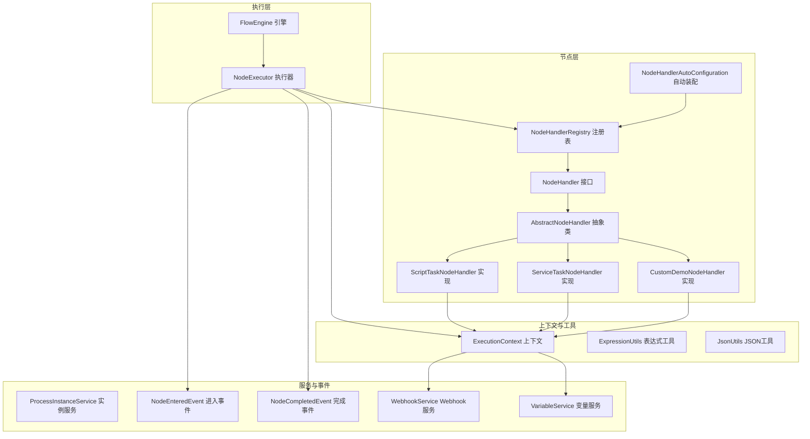
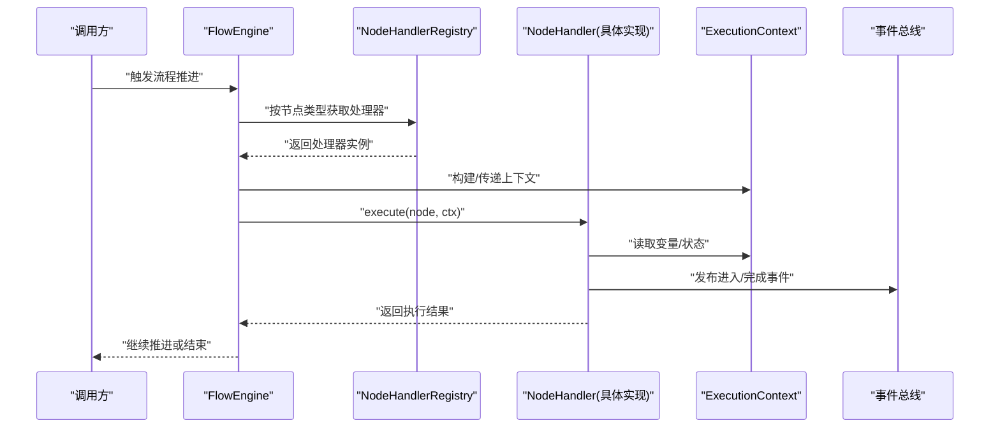
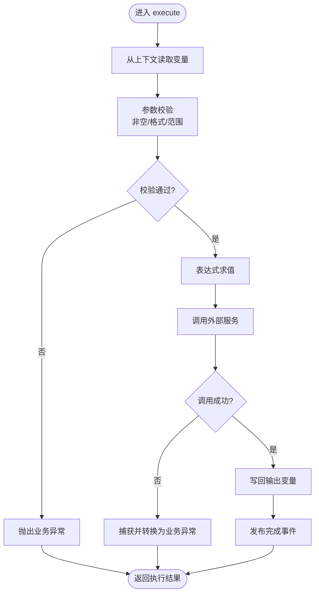
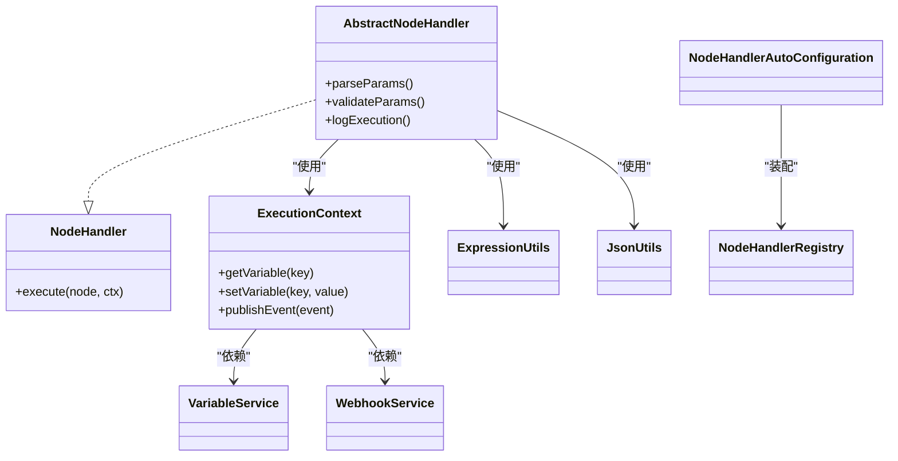

# 自定义节点开发

<cite>
**本文引用的文件**   
- [NodeHandler.java](file://flow-engine/src/main/java/com/flow/engine/node/NodeHandler.java)
- [AbstractNodeHandler.java](file://flow-engine/src/main/java/com/flow/engine/node/AbstractNodeHandler.java)
- [ExecutionContext.java](file://flow-engine/src/main/java/com/flow/engine/node/ExecutionContext.java)
- [NodeHandlerRegistry.java](file://flow-engine/src/main/java/com/flow/engine/node/NodeHandlerRegistry.java)
- [NodeHandlerAutoConfiguration.java](file://flow-engine/src/main/java/com/flow/engine/node/NodeHandlerAutoConfiguration.java)
- [CustomDemoNodeHandler.java](file://flow-engine/src/main/java/com/flow/engine/node/impl/CustomDemoNodeHandler.java)
- [ServiceTaskNodeHandler.java](file://flow-engine/src/main/java/com/flow/engine/node/impl/ServiceTaskNodeHandler.java)
- [ScriptTaskNodeHandler.java](file://flow-engine/src/main/java/com/flow/engine/node/impl/ScriptTaskNodeHandler.java)
- [FlowEngine.java](file://flow-engine/src/main/java/com/flow/engine/engine/FlowEngine.java)
- [ProcessInstanceService.java](file://flow-engine/src/main/java/com/flow/engine/service/ProcessInstanceService.java)
- [VariableService.java](file://flow-engine/src/main/java/com/flow/engine/service/VariableService.java)
- [WebhookService.java](file://flow-engine/src/main/java/com/flow/engine/service/WebhookService.java)
- [NodeCompletedEvent.java](file://flow-engine/src/main/java/com/flow/engine/event/NodeCompletedEvent.java)
- [NodeEnteredEvent.java](file://flow-engine/src/main/java/com/flow/engine/event/NodeEnteredEvent.java)
- [GlobalExceptionHandler.java](file://flow-engine/src/main/java/com/flow/engine/common/GlobalExceptionHandler.java)
- [BusinessException.java](file://flow-engine/src/main/java/com/flow/engine/common/BusinessException.java)
- [ErrorCode.java](file://flow-engine/src/main/java/com/flow/engine/common/ErrorCode.java)
- [ExpressionUtils.java](file://flow-engine/src/main/java/com/flow/engine/common/utils/ExpressionUtils.java)
- [JsonUtils.java](file://flow-engine/src/main/java/com/flow/engine/common/utils/JsonUtils.java)
- [NodeType.java](file://flow-engine/src/main/java/com/flow/engine/common/enums/NodeType.java)
- [ProcessDefinitionService.java](file://flow-engine/src/main/java/com/flow/engine/service/ProcessDefinitionService.java)
- [ProcessModel.java](file://flow-engine/src/main/java/com/flow/engine/model/ProcessModel.java)
- [NodeModel.java](file://flow-engine/src/main/java/com/flow/engine/model/NodeModel.java)
- [EdgeModel.java](file://flow-engine/src/main/java/com/flow/engine/model/EdgeModel.java)
</cite>

## 目录
1. [简介](#简介)
2. [项目结构](#项目结构)
3. [核心组件](#核心组件)
4. [架构总览](#架构总览)
5. [详细组件分析](#详细组件分析)
6. [依赖关系分析](#依赖关系分析)
7. [性能考虑](#性能考虑)
8. [故障排查指南](#故障排查指南)
9. [结论](#结论)
10. [附录](#附录)

## 简介
本指南面向需要在流程引擎中扩展“自定义节点”的开发者，围绕 NodeHandler 接口与 AbstractNodeHandler 抽象类，系统讲解 execute() 方法编写、参数校验与异常处理；说明节点配置参数的定义方式（含注解与校验）、ExecutionContext 上下文对象的使用（变量获取、状态管理、事件发布）；并提供从需求到实现的完整示例路径、注册与依赖注入最佳实践、调试技巧与性能优化建议。

## 项目结构
与自定义节点开发直接相关的代码集中在 flow-engine 模块的 node、engine、service、event、common 等包下。下图展示了与节点执行相关的关键模块与文件：

图表来源
- [NodeHandler.java](file://flow-engine/src/main/java/com/flow/engine/node/NodeHandler.java)
- [AbstractNodeHandler.java](file://flow-engine/src/main/java/com/flow/engine/node/AbstractNodeHandler.java)
- [NodeHandlerRegistry.java](file://flow-engine/src/main/java/com/flow/engine/node/NodeHandlerRegistry.java)
- [NodeHandlerAutoConfiguration.java](file://flow-engine/src/main/java/com/flow/engine/node/NodeHandlerAutoConfiguration.java)
- [CustomDemoNodeHandler.java](file://flow-engine/src/main/java/com/flow/engine/node/impl/CustomDemoNodeHandler.java)
- [ServiceTaskNodeHandler.java](file://flow-engine/src/main/java/com/flow/engine/node/impl/ServiceTaskNodeHandler.java)
- [ScriptTaskNodeHandler.java](file://flow-engine/src/main/java/com/flow/engine/node/impl/ScriptTaskNodeHandler.java)
- [FlowEngine.java](file://flow-engine/src/main/java/com/flow/engine/engine/FlowEngine.java)
- [ExecutionContext.java](file://flow-engine/src/main/java/com/flow/engine/node/ExecutionContext.java)
- [ExpressionUtils.java](file://flow-engine/src/main/java/com/flow/engine/common/utils/ExpressionUtils.java)
- [JsonUtils.java](file://flow-engine/src/main/java/com/flow/engine/common/utils/JsonUtils.java)
- [ProcessInstanceService.java](file://flow-engine/src/main/java/com/flow/engine/service/ProcessInstanceService.java)
- [VariableService.java](file://flow-engine/src/main/java/com/flow/engine/service/VariableService.java)
- [WebhookService.java](file://flow-engine/src/main/java/com/flow/engine/service/WebhookService.java)
- [NodeCompletedEvent.java](file://flow-engine/src/main/java/com/flow/engine/event/NodeCompletedEvent.java)
- [NodeEnteredEvent.java](file://flow-engine/src/main/java/com/flow/engine/event/NodeEnteredEvent.java)

章节来源
- [FlowEngine.java](file://flow-engine/src/main/java/com/flow/engine/engine/FlowEngine.java)
- [NodeHandler.java](file://flow-engine/src/main/java/com/flow/engine/node/NodeHandler.java)
- [AbstractNodeHandler.java](file://flow-engine/src/main/java/com/flow/engine/node/AbstractNodeHandler.java)
- [NodeHandlerRegistry.java](file://flow-engine/src/main/java/com/flow/engine/node/NodeHandlerRegistry.java)
- [NodeHandlerAutoConfiguration.java](file://flow-engine/src/main/java/com/flow/engine/node/NodeHandlerAutoConfiguration.java)

## 核心组件
- NodeHandler 接口：定义节点执行契约，包含 execute() 方法与可选元数据描述（如节点类型、名称、描述等）。
- AbstractNodeHandler 抽象类：提供通用能力，如参数解析、默认校验、日志记录、上下文访问封装等，减少重复代码。
- ExecutionContext 上下文：贯穿节点执行的运行时环境，提供变量读写、状态存取、事件发布、外部服务调用入口等。
- NodeHandlerRegistry 注册表：维护节点类型到处理器实现的映射，供引擎在运行时查找并执行对应节点。
- NodeHandlerAutoConfiguration 自动装配：扫描并注册所有实现了 NodeHandler 的 Bean，简化集成。

章节来源
- [NodeHandler.java](file://flow-engine/src/main/java/com/flow/engine/node/NodeHandler.java)
- [AbstractNodeHandler.java](file://flow-engine/src/main/java/com/flow/engine/node/AbstractNodeHandler.java)
- [ExecutionContext.java](file://flow-engine/src/main/java/com/flow/engine/node/ExecutionContext.java)
- [NodeHandlerRegistry.java](file://flow-engine/src/main/java/com/flow/engine/node/NodeHandlerRegistry.java)
- [NodeHandlerAutoConfiguration.java](file://flow-engine/src/main/java/com/flow/engine/node/NodeHandlerAutoConfiguration.java)

## 架构总览
下图展示一次节点执行的端到端流程：引擎根据当前节点类型从注册表获取处理器，构造上下文，调用处理器 execute()，并在完成后发布事件。

图表来源
- [FlowEngine.java](file://flow-engine/src/main/java/com/flow/engine/engine/FlowEngine.java)
- [NodeHandlerRegistry.java](file://flow-engine/src/main/java/com/flow/engine/node/NodeHandlerRegistry.java)
- [NodeHandler.java](file://flow-engine/src/main/java/com/flow/engine/node/NodeHandler.java)
- [ExecutionContext.java](file://flow-engine/src/main/java/com/flow/engine/node/ExecutionContext.java)
- [NodeCompletedEvent.java](file://flow-engine/src/main/java/com/flow/engine/event/NodeCompletedEvent.java)
- [NodeEnteredEvent.java](file://flow-engine/src/main/java/com/flow/engine/event/NodeEnteredEvent.java)

## 详细组件分析

### NodeHandler 接口与 execute() 编写要点
- 职责边界：仅关注“节点业务逻辑”，不关心流程编排细节。
- 输入输出：通过 ExecutionContext 获取输入变量，写入输出变量；必要时更新节点级状态。
- 返回值约定：若使用统一结果包装，需遵循引擎约定的成功/失败语义。
- 幂等性：同一节点可能被重试，应避免副作用重复发生。
- 可观测性：结合上下文的事件发布机制，记录关键步骤。

章节来源
- [NodeHandler.java](file://flow-engine/src/main/java/com/flow/engine/node/NodeHandler.java)
- [ExecutionContext.java](file://flow-engine/src/main/java/com/flow/engine/node/ExecutionContext.java)

### AbstractNodeHandler 抽象类与继承模式
- 提供模板方法：如参数预解析、公共校验、日志埋点、异常转换等。
- 重写策略：子类只需聚焦核心业务，避免样板代码。
- 安全与健壮：对空值、非法类型进行前置检查，抛出明确的业务异常。

章节来源
- [AbstractNodeHandler.java](file://flow-engine/src/main/java/com/flow/engine/node/AbstractNodeHandler.java)

### 节点配置参数定义与校验
- 定义位置：节点模型中的配置字段通常由前端设计器生成，后端通过 ProcessModel/NodeModel 解析。
- 注解与校验：可在处理器或配置对象上使用校验注解（例如非空、长度、格式等），在 AbstractNodeHandler 的统一校验阶段生效。
- 表达式支持：复杂参数可通过 ExpressionUtils 进行动态求值。
- JSON 序列化：使用 JsonUtils 将配置与变量进行互转，确保兼容性与稳定性。

章节来源
- [ProcessModel.java](file://flow-engine/src/main/java/com/flow/engine/model/ProcessModel.java)
- [NodeModel.java](file://flow-engine/src/main/java/com/flow/engine/model/NodeModel.java)
- [ExpressionUtils.java](file://flow-engine/src/main/java/com/flow/engine/common/utils/ExpressionUtils.java)
- [JsonUtils.java](file://flow-engine/src/main/java/com/flow/engine/common/utils/JsonUtils.java)

### ExecutionContext 上下文对象使用
- 变量管理：通过 VariableService 读写流程变量，注意作用域与生命周期。
- 状态管理：保存节点运行期状态，便于分支判断与重试恢复。
- 事件发布：在进入/完成节点时发布事件，供监听器消费（如审计、通知、指标采集）。
- 外部服务：通过 WebhookService 等对外部系统进行异步或同步调用。

章节来源
- [ExecutionContext.java](file://flow-engine/src/main/java/com/flow/engine/node/ExecutionContext.java)
- [VariableService.java](file://flow-engine/src/main/java/com/flow/engine/service/VariableService.java)
- [WebhookService.java](file://flow-engine/src/main/java/com/flow/engine/service/WebhookService.java)
- [NodeCompletedEvent.java](file://flow-engine/src/main/java/com/flow/engine/event/NodeCompletedEvent.java)
- [NodeEnteredEvent.java](file://flow-engine/src/main/java/com/flow/engine/event/NodeEnteredEvent.java)

### 内置节点参考实现
- CustomDemoNodeHandler：演示最小可用实现，适合快速上手。
- ServiceTaskNodeHandler：展示如何调用外部服务并处理响应。
- ScriptTaskNodeHandler：展示脚本任务执行与上下文交互。

章节来源
- [CustomDemoNodeHandler.java](file://flow-engine/src/main/java/com/flow/engine/node/impl/CustomDemoNodeHandler.java)
- [ServiceTaskNodeHandler.java](file://flow-engine/src/main/java/com/flow/engine/node/impl/ServiceTaskNodeHandler.java)
- [ScriptTaskNodeHandler.java](file://flow-engine/src/main/java/com/flow/engine/node/impl/ScriptTaskNodeHandler.java)

### 自定义节点开发示例（从需求到实现）
以下以“发送短信通知”为例，给出端到端流程与关键路径定位，帮助读者快速落地。

- 需求分析
  - 输入：手机号、短信内容、模板ID
  - 输出：发送结果、消息ID
  - 异常：参数缺失、第三方服务不可用
- 实现步骤
  - 新建处理器类，继承 AbstractNodeHandler，实现 execute()
  - 在 execute() 中：
    - 从 ExecutionContext 读取变量
    - 使用表达式工具解析动态参数
    - 调用外部服务（如 WebhookService 或直接 HTTP 客户端）
    - 将结果写回上下文变量
    - 发布完成事件
  - 注册与装配：确保处理器被 Spring 容器管理并由自动装配发现
- 关键路径
  - 处理器实现：[CustomDemoNodeHandler.java](file://flow-engine/src/main/java/com/flow/engine/node/impl/CustomDemoNodeHandler.java)
  - 上下文与变量：[ExecutionContext.java](file://flow-engine/src/main/java/com/flow/engine/node/ExecutionContext.java)、[VariableService.java](file://flow-engine/src/main/java/com/flow/engine/service/VariableService.java)
  - 事件发布：[NodeCompletedEvent.java](file://flow-engine/src/main/java/com/flow/engine/event/NodeCompletedEvent.java)
  - 自动装配：[NodeHandlerAutoConfiguration.java](file://flow-engine/src/main/java/com/flow/engine/node/NodeHandlerAutoConfiguration.java)

章节来源
- [CustomDemoNodeHandler.java](file://flow-engine/src/main/java/com/flow/engine/node/impl/CustomDemoNodeHandler.java)
- [ExecutionContext.java](file://flow-engine/src/main/java/com/flow/engine/node/ExecutionContext.java)
- [VariableService.java](file://flow-engine/src/main/java/com/flow/engine/service/VariableService.java)
- [NodeCompletedEvent.java](file://flow-engine/src/main/java/com/flow/engine/event/NodeCompletedEvent.java)
- [NodeHandlerAutoConfiguration.java](file://flow-engine/src/main/java/com/flow/engine/node/NodeHandlerAutoConfiguration.java)

### 节点类型注册与依赖注入最佳实践
- 类型枚举：在 NodeType 中新增自定义节点类型常量，保持前后端一致。
- 自动装配：实现 NodeHandler 的 Bean 会被自动发现并注册至 NodeHandlerRegistry。
- 依赖注入：通过构造函数或 @Autowired 注入所需服务（如 VariableService、WebhookService）。
- 资源管理：避免在处理器中持有长连接或大对象，尽量短生命周期、无状态化。

章节来源
- [NodeType.java](file://flow-engine/src/main/java/com/flow/engine/common/enums/NodeType.java)
- [NodeHandlerRegistry.java](file://flow-engine/src/main/java/com/flow/engine/node/NodeHandlerRegistry.java)
- [NodeHandlerAutoConfiguration.java](file://flow-engine/src/main/java/com/flow/engine/node/NodeHandlerAutoConfiguration.java)

### 流程图：参数校验与异常处理

图表来源
- [AbstractNodeHandler.java](file://flow-engine/src/main/java/com/flow/engine/node/AbstractNodeHandler.java)
- [ExpressionUtils.java](file://flow-engine/src/main/java/com/flow/engine/common/utils/ExpressionUtils.java)
- [VariableService.java](file://flow-engine/src/main/java/com/flow/engine/service/VariableService.java)
- [NodeCompletedEvent.java](file://flow-engine/src/main/java/com/flow/engine/event/NodeCompletedEvent.java)

## 依赖关系分析
下图展示处理器与其依赖的服务与工具之间的关系：

图表来源
- [NodeHandler.java](file://flow-engine/src/main/java/com/flow/engine/node/NodeHandler.java)
- [AbstractNodeHandler.java](file://flow-engine/src/main/java/com/flow/engine/node/AbstractNodeHandler.java)
- [ExecutionContext.java](file://flow-engine/src/main/java/com/flow/engine/node/ExecutionContext.java)
- [VariableService.java](file://flow-engine/src/main/java/com/flow/engine/service/VariableService.java)
- [WebhookService.java](file://flow-engine/src/main/java/com/flow/engine/service/WebhookService.java)
- [ExpressionUtils.java](file://flow-engine/src/main/java/com/flow/engine/common/utils/ExpressionUtils.java)
- [JsonUtils.java](file://flow-engine/src/main/java/com/flow/engine/common/utils/JsonUtils.java)
- [NodeHandlerRegistry.java](file://flow-engine/src/main/java/com/flow/engine/node/NodeHandlerRegistry.java)
- [NodeHandlerAutoConfiguration.java](file://flow-engine/src/main/java/com/flow/engine/node/NodeHandlerAutoConfiguration.java)

章节来源
- [NodeHandler.java](file://flow-engine/src/main/java/com/flow/engine/node/NodeHandler.java)
- [AbstractNodeHandler.java](file://flow-engine/src/main/java/com/flow/engine/node/AbstractNodeHandler.java)
- [ExecutionContext.java](file://flow-engine/src/main/java/com/flow/engine/node/ExecutionContext.java)
- [NodeHandlerRegistry.java](file://flow-engine/src/main/java/com/flow/engine/node/NodeHandlerRegistry.java)
- [NodeHandlerAutoConfiguration.java](file://flow-engine/src/main/java/com/flow/engine/node/NodeHandlerAutoConfiguration.java)

## 性能考虑
- 避免阻塞：外部调用应设置超时与重试上限，必要时采用异步回调。
- 缓存热点：对频繁读取的配置或字典数据，结合缓存策略降低 IO 压力。
- 批量操作：合并多次变量读写为一次性批处理，减少上下文锁竞争。
- 表达式求值：复杂表达式应缓存编译结果，避免重复解析。
- 事件发布：高频事件可改为批量聚合或异步落盘，降低主链路延迟。

## 故障排查指南
- 全局异常处理：统一捕获并转换为标准错误码，便于前端展示与监控告警。
- 业务异常：在参数校验失败或外部服务异常时抛出明确业务异常，附带错误码与提示。
- 日志与追踪：利用上下文与切面记录关键步骤，结合请求 ID 进行链路追踪。
- 常见问题
  - 变量未初始化：在执行前检查必要变量是否存在。
  - 表达式语法错误：使用表达式工具的错误信息定位问题。
  - 事件丢失：确认事件监听器已正确注册且未被过滤。

章节来源
- [GlobalExceptionHandler.java](file://flow-engine/src/main/java/com/flow/engine/common/GlobalExceptionHandler.java)
- [BusinessException.java](file://flow-engine/src/main/java/com/flow/engine/common/BusinessException.java)
- [ErrorCode.java](file://flow-engine/src/main/java/com/flow/engine/common/ErrorCode.java)
- [ExpressionUtils.java](file://flow-engine/src/main/java/com/flow/engine/common/utils/ExpressionUtils.java)

## 结论
通过 NodeHandler 接口与 AbstractNodeHandler 抽象类，配合 ExecutionContext 上下文、变量服务与事件机制，可以高效地扩展自定义节点。遵循统一的参数校验、异常处理与资源管理规范，能够显著提升系统的可维护性与稳定性。建议在实现过程中充分利用自动装配与注册表机制，并结合监控与日志完善可观测性。

## 附录
- 节点模型与流程模型：用于承载节点配置与流程拓扑，供解析器与引擎使用。
- 流程定义服务：负责流程定义的创建、更新与导入，确保节点类型与处理器实现保持一致。

章节来源
- [ProcessModel.java](file://flow-engine/src/main/java/com/flow/engine/model/ProcessModel.java)
- [NodeModel.java](file://flow-engine/src/main/java/com/flow/engine/model/NodeModel.java)
- [EdgeModel.java](file://flow-engine/src/main/java/com/flow/engine/model/EdgeModel.java)
- [ProcessDefinitionService.java](file://flow-engine/src/main/java/com/flow/engine/service/ProcessDefinitionService.java)