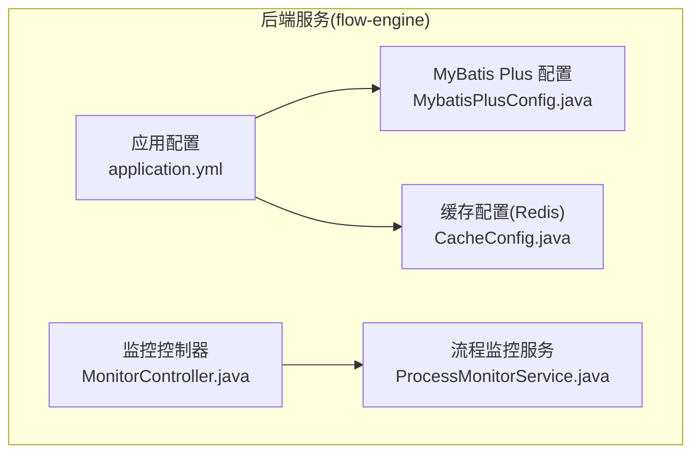
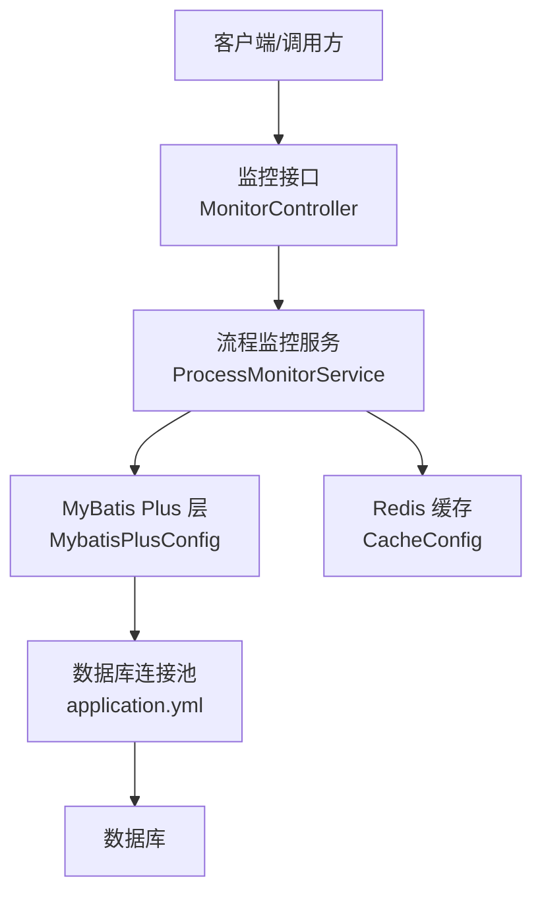
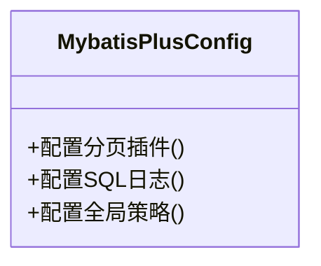
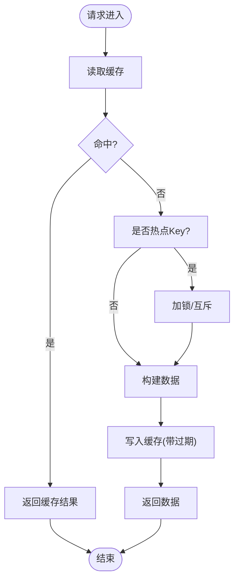
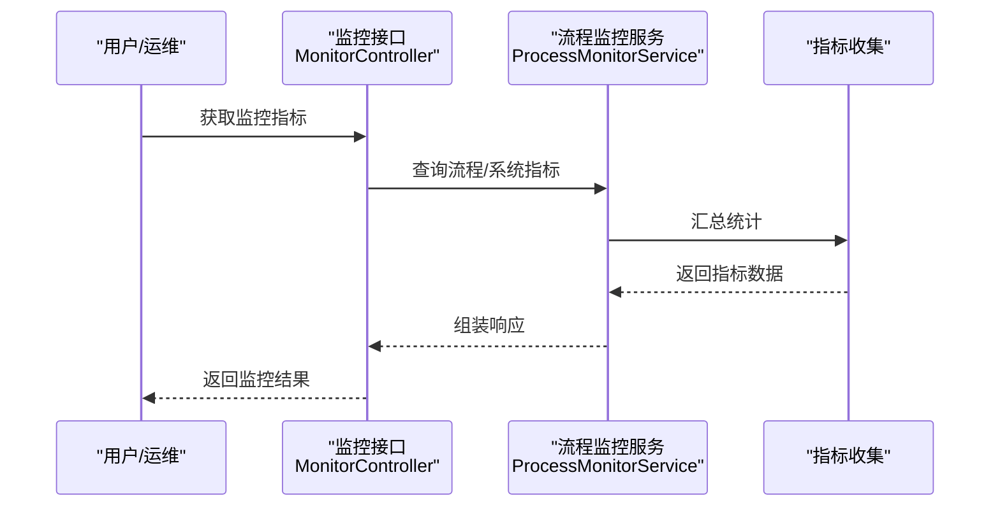
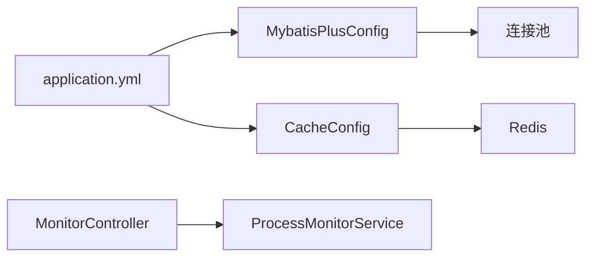

# 性能调优配置

<cite>
**本文引用的文件**   
- [application.yml](file://flow-engine/src/main/resources/application.yml)
- [MybatisPlusConfig.java](file://flow-engine/src/main/java/com/flow/engine/config/MybatisPlusConfig.java)
- [CacheConfig.java](file://flow-engine/src/main/java/com/flow/engine/config/CacheConfig.java)
- [MonitorController.java](file://flow-engine/src/main/java/com/flow/engine/controllers/MonitorController.java)
- [ProcessMonitorService.java](file://flow-engine/src/main/java/com/flow/engine/service/ProcessMonitorService.java)
</cite>

## 目录
1. [简介](#简介)
2. [项目结构](#项目结构)
3. [核心组件](#核心组件)
4. [架构总览](#架构总览)
5. [详细组件分析](#详细组件分析)
6. [依赖关系分析](#依赖关系分析)
7. [性能考虑](#性能考虑)
8. [故障排查指南](#故障排查指南)
9. [结论](#结论)
10. [附录](#附录)

## 简介
本文件聚焦于“性能调优配置”，围绕数据库连接池、MyBatis Plus、Redis缓存、慢查询监控与分析、数据库服务器参数、监控指标与告警阈值，以及瓶颈识别方法论与实践案例进行系统化说明。文档以仓库中实际存在的配置与代码为依据，提供可落地的优化建议与可视化图示，帮助读者快速定位并解决性能问题。

## 项目结构
本项目为前后端分离的流程图引擎系统：
- flow-engine：后端服务（Spring Boot），包含应用配置、数据访问、流程引擎、监控接口等。
- flow-web：前端管理界面（Vue）。
- docs：需求与设计文档。

与性能调优直接相关的后端关键位置：
- 应用配置：resources/application.yml
- MyBatis Plus 配置：config/MybatisPlusConfig.java
- Redis 缓存配置：config/CacheConfig.java
- 监控接口与服务：controllers/MonitorController.java、service/ProcessMonitorService.java

图表来源
- [application.yml](file://flow-engine/src/main/resources/application.yml)
- [MybatisPlusConfig.java](file://flow-engine/src/main/java/com/flow/engine/config/MybatisPlusConfig.java)
- [CacheConfig.java](file://flow-engine/src/main/java/com/flow/engine/config/CacheConfig.java)
- [MonitorController.java](file://flow-engine/src/main/java/com/flow/engine/controllers/MonitorController.java)
- [ProcessMonitorService.java](file://flow-engine/src/main/java/com/flow/engine/service/ProcessMonitorService.java)

章节来源
- [application.yml](file://flow-engine/src/main/resources/application.yml)
- [MybatisPlusConfig.java](file://flow-engine/src/main/java/com/flow/engine/config/MybatisPlusConfig.java)
- [CacheConfig.java](file://flow-engine/src/main/java/com/flow/engine/config/CacheConfig.java)
- [MonitorController.java](file://flow-engine/src/main/java/com/flow/engine/controllers/MonitorController.java)
- [ProcessMonitorService.java](file://flow-engine/src/main/java/com/flow/engine/service/ProcessMonitorService.java)

## 核心组件
本节从“配置入口”和“运行时能力”两个维度梳理与性能相关的关键组件：
- 应用配置(application.yml)：集中承载数据库、连接池、Redis、日志、监控等开关与参数。
- MyBatis Plus(MybatisPlusConfig.java)：分页插件、SQL日志、全局策略等。
- 缓存(CacheConfig.java)：Redis连接、序列化、过期策略、Key前缀等。
- 监控(MonitorController.java + ProcessMonitorService.java)：暴露健康检查、运行指标、流程状态统计等。

章节来源
- [application.yml](file://flow-engine/src/main/resources/application.yml)
- [MybatisPlusConfig.java](file://flow-engine/src/main/java/com/flow/engine/config/MybatisPlusConfig.java)
- [CacheConfig.java](file://flow-engine/src/main/java/com/flow/engine/config/CacheConfig.java)
- [MonitorController.java](file://flow-engine/src/main/java/com/flow/engine/controllers/MonitorController.java)
- [ProcessMonitorService.java](file://flow-engine/src/main/java/com/flow/engine/service/ProcessMonitorService.java)

## 架构总览
下图展示了性能相关组件在运行时的交互关系：应用通过连接池访问数据库，通过Redis缓存热点数据，通过监控接口采集指标并对外暴露。

图表来源
- [MonitorController.java](file://flow-engine/src/main/java/com/flow/engine/controllers/MonitorController.java)
- [ProcessMonitorService.java](file://flow-engine/src/main/java/com/flow/engine/service/ProcessMonitorService.java)
- [MybatisPlusConfig.java](file://flow-engine/src/main/java/com/flow/engine/config/MybatisPlusConfig.java)
- [application.yml](file://flow-engine/src/main/resources/application.yml)
- [CacheConfig.java](file://flow-engine/src/main/java/com/flow/engine/config/CacheConfig.java)

## 详细组件分析

### 数据库连接池配置与优化
- 目标
  - 合理设置最大连接数、最小空闲、超时与健康检查，避免连接泄漏与抖动。
- 关键参数（来源于 application.yml）
  - 连接池类型、最大连接数、最小空闲、最大等待时间、空闲回收间隔、连接有效性检测等。
- 优化策略
  - 根据并发量与数据库容量估算最大连接数；在高并发场景下优先提升连接复用率而非盲目增大连接数。
  - 开启健康检查与空闲回收，降低无效连接占用。
  - 合理设置超时，避免长事务或慢查询拖垮连接池。
- 验证方法
  - 压测观察连接使用曲线、等待队列、超时错误比例。
  - 结合数据库侧活跃会话与锁等待情况综合判断。

章节来源
- [application.yml](file://flow-engine/src/main/resources/application.yml)

### MyBatis Plus 性能优化配置
- 目标
  - 通过分页、SQL日志、全局策略等减少不必要开销、提升可观测性。
- 关键配置（来源于 MybatisPlusConfig.java）
  - 分页插件：拦截器注册、方言、是否 count 查询优化等。
  - SQL 日志：打印 SQL、执行时长、参数，便于定位慢查询。
  - 全局策略：驼峰映射、逻辑删除、主键策略等对写入路径的影响。
- 优化建议
  - 分页：默认启用分页插件；复杂查询时评估是否需要关闭 count 查询以提升吞吐。
  - SQL 日志：生产环境按需开启，避免高频全量打印造成额外 IO。
  - 批量操作：利用内置批量接口减少往返次数。
  - 索引与字段选择：配合日志输出，持续优化 SQL 与索引。

图表来源
- [MybatisPlusConfig.java](file://flow-engine/src/main/java/com/flow/engine/config/MybatisPlusConfig.java)

章节来源
- [MybatisPlusConfig.java](file://flow-engine/src/main/java/com/flow/engine/config/MybatisPlusConfig.java)

### Redis 缓存配置与防护策略
- 目标
  - 提高读多写少场景的性能，同时防范缓存穿透、击穿、雪崩。
- 关键配置（来源于 CacheConfig.java 与 application.yml）
  - Redis 连接信息、序列化方式、默认过期时间、Key 前缀、连接池参数等。
- 防护策略
  - 穿透：空值缓存+短过期；布隆过滤器（可选）。
  - 击穿：互斥锁/分布式锁保护热点 Key 重建；逻辑过期+后台刷新。
  - 雪崩：随机化过期时间；多级缓存；限流降级。
- 监控与回退
  - 记录缓存命中率、异常率；失败时快速回源数据库并降级。

图表来源
- [CacheConfig.java](file://flow-engine/src/main/java/com/flow/engine/config/CacheConfig.java)
- [application.yml](file://flow-engine/src/main/resources/application.yml)

章节来源
- [CacheConfig.java](file://flow-engine/src/main/java/com/flow/engine/config/CacheConfig.java)
- [application.yml](file://flow-engine/src/main/resources/application.yml)

### 慢查询监控与分析工具
- 目标
  - 快速发现慢 SQL、高耗时接口与流程节点，形成闭环治理。
- 实现要点（来源于 MonitorController.java 与 ProcessMonitorService.java）
  - 暴露监控接口，聚合运行指标与流程状态统计。
  - 结合 SQL 日志与业务埋点，输出耗时分布与Top N。
- 使用方法
  - 定期拉取监控指标，绘制趋势图；对异常峰值进行根因分析。
  - 将慢查询纳入工单，跟踪优化效果。

图表来源
- [MonitorController.java](file://flow-engine/src/main/java/com/flow/engine/controllers/MonitorController.java)
- [ProcessMonitorService.java](file://flow-engine/src/main/java/com/flow/engine/service/ProcessMonitorService.java)

章节来源
- [MonitorController.java](file://flow-engine/src/main/java/com/flow/engine/controllers/MonitorController.java)
- [ProcessMonitorService.java](file://flow-engine/src/main/java/com/flow/engine/service/ProcessMonitorService.java)

### 数据库服务器性能调优参数
- 目标
  - 从数据库内核层面释放性能潜力，保障高并发与低延迟。
- 关注点（通用实践）
  - 内存分配：实例内存、缓冲池大小、排序/临时表空间。
  - I/O 与日志：redo/log 文件大小与落盘策略、预读/写放大控制。
  - 锁机制：锁粒度、死锁检测、长事务抑制。
  - 连接与会话：最大连接数、线程池、超时与资源限制。
- 建议
  - 基于压测与线上负载逐步调整，避免一次性大改。
  - 结合慢查询与锁等待视图持续优化。

[本节为通用指导，不直接分析具体文件]

### 性能监控指标定义与告警阈值
- 指标分类
  - 资源类：CPU、内存、磁盘IO、网络带宽。
  - 连接池：活跃连接、等待队列、超时次数。
  - 数据库：QPS、TPS、慢查询数、锁等待、复制延迟。
  - 缓存：命中率、读写延迟、淘汰率。
  - 应用：接口P95/P99延迟、错误率、GC停顿。
- 告警阈值（示例思路）
  - 连接池等待>阈值且持续增长：立即告警。
  - 慢查询占比上升：分级告警并触发复盘。
  - 缓存命中率低于阈值：检查热点Key与失效策略。
- 落地建议
  - 统一指标口径，建立看板与自动化告警。
  - 将指标纳入发布门禁与回归测试。

[本节为通用指导，不直接分析具体文件]

## 依赖关系分析
- 耦合与内聚
  - 配置层(application.yml)与功能模块松耦合，通过配置注入生效。
  - 监控层与业务层解耦，通过接口暴露指标，便于横向扩展。
- 外部依赖
  - 数据库连接池、Redis 客户端均为外部依赖，需关注版本兼容与连接参数。
- 潜在风险
  - 过度依赖全局配置导致变更影响面大；建议按环境拆分配置。
  - 监控接口未做鉴权与限流可能带来安全风险。

图表来源
- [application.yml](file://flow-engine/src/main/resources/application.yml)
- [MybatisPlusConfig.java](file://flow-engine/src/main/java/com/flow/engine/config/MybatisPlusConfig.java)
- [CacheConfig.java](file://flow-engine/src/main/java/com/flow/engine/config/CacheConfig.java)
- [MonitorController.java](file://flow-engine/src/main/java/com/flow/engine/controllers/MonitorController.java)
- [ProcessMonitorService.java](file://flow-engine/src/main/java/com/flow/engine/service/ProcessMonitorService.java)

章节来源
- [application.yml](file://flow-engine/src/main/resources/application.yml)
- [MybatisPlusConfig.java](file://flow-engine/src/main/java/com/flow/engine/config/MybatisPlusConfig.java)
- [CacheConfig.java](file://flow-engine/src/main/java/com/flow/engine/config/CacheConfig.java)
- [MonitorController.java](file://flow-engine/src/main/java/com/flow/engine/controllers/MonitorController.java)
- [ProcessMonitorService.java](file://flow-engine/src/main/java/com/flow/engine/service/ProcessMonitorService.java)

## 性能考虑
- 连接池
  - 根据业务峰值与数据库承载能力设定最大连接数；避免连接风暴。
  - 开启空闲回收与健康检查，缩短异常连接恢复时间。
- MyBatis Plus
  - 分页与 count 查询权衡；复杂查询可关闭 count。
  - 生产环境谨慎开启全量 SQL 日志，必要时仅开启慢 SQL 日志。
- Redis
  - 热点Key采用互斥锁或逻辑过期；非热点数据设置合理TTL。
  - 多级缓存与限流降级作为兜底。
- 监控
  - 建立端到端链路追踪与指标看板；对异常波动自动告警。

[本节为通用指导，不直接分析具体文件]

## 故障排查指南
- 常见问题
  - 连接池耗尽：检查慢查询、事务过长、连接泄漏。
  - 缓存命中率低：检查Key设计、过期策略与一致性。
  - 慢查询增多：结合SQL日志与索引分析，定位缺失索引或低效SQL。
- 定位步骤
  - 查看监控接口返回的指标趋势，确认异常时间点。
  - 关联数据库慢查询与锁等待视图，缩小范围。
  - 复现问题并采集快照，提交复盘与优化。

章节来源
- [MonitorController.java](file://flow-engine/src/main/java/com/flow/engine/controllers/MonitorController.java)
- [ProcessMonitorService.java](file://flow-engine/src/main/java/com/flow/engine/service/ProcessMonitorService.java)

## 结论
通过合理的连接池与缓存配置、完善的MyBatis Plus优化、持续的慢查询治理与监控告警体系，可以显著提升系统的稳定性与吞吐能力。建议以压测与线上指标为依据，循序渐进地调优，并将最佳实践沉淀为规范与自动化流程。

[本节为总结性内容，不直接分析具体文件]

## 附录
- 术语
  - 连接池：用于复用数据库连接的中间件。
  - 缓存穿透/击穿/雪崩：三类典型缓存异常场景。
  - 慢查询：超过阈值的数据库查询。
- 参考
  - 各配置文件与监控接口源码路径见“本文引用的文件”。

[本节为补充说明，不直接分析具体文件]