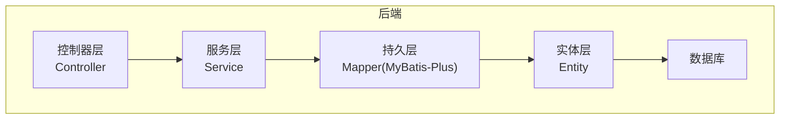
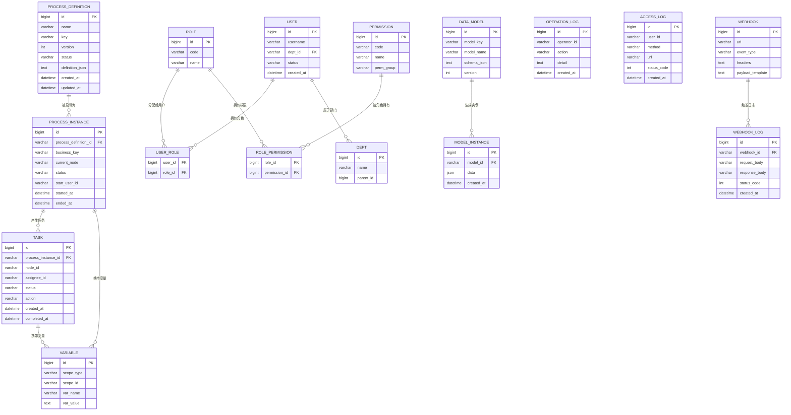

# 数据库设计

<cite>
**本文引用的文件**   
- [schema.sql](file://flow-engine/src/main/resources/db/schema.sql)
- [data.sql](file://flow-engine/src/main/resources/db/data.sql)
- [ProcessDefinition.java](file://flow-engine/src/main/java/com/flow/engine/entity/ProcessDefinition.java)
- [ProcessInstance.java](file://flow-engine/src/main/java/com/flow/engine/entity/ProcessInstance.java)
- [Task.java](file://flow-engine/src/main/java/com/flow/engine/entity/Task.java)
- [User.java](file://flow-engine/src/main/java/com/flow/engine/entity/User.java)
- [Role.java](file://flow-engine/src/main/java/com/flow/engine/entity/Role.java)
- [Permission.java](file://flow-engine/src/main/java/com/flow/engine/entity/Permission.java)
- [UserRole.java](file://flow-engine/src/main/java/com/flow/engine/entity/UserRole.java)
- [RolePermission.java](file://flow-engine/src/main/java/com/flow/engine/entity/RolePermission.java)
- [Variable.java](file://flow-engine/src/main/java/com/flow/engine/entity/Variable.java)
- [Dept.java](file://flow-engine/src/main/java/com/flow/engine/entity/Dept.java)
- [DataModel.java](file://flow-engine/src/main/java/com/flow/engine/entity/DataModel.java)
- [ModelInstance.java](file://flow-engine/src/main/java/com/flow/engine/entity/ModelInstance.java)
- [OperationLog.java](file://flow-engine/src/main/java/com/flow/engine/entity/OperationLog.java)
- [AccessLog.java](file://flow-engine/src/main/java/com/flow/engine/entity/AccessLog.java)
- [Webhook.java](file://flow-engine/src/main/java/com/flow/engine/entity/Webhook.java)
- [WebhookLog.java](file://flow-engine/src/main/java/com/flow/engine/entity/WebhookLog.java)
- [MybatisPlusConfig.java](file://flow-engine/src/main/java/com/flow/engine/config/MybatisPlusConfig.java)
- [application.yml](file://flow-engine/src/main/resources/application.yml)
</cite>

## 更新摘要
**变更内容**   
- 权限表新增perm_group字段，支持权限分组管理
- 测试数据集包含165个用户账户和完整的3级部门层级结构
- 更新了权限模型设计和部门组织结构说明

## 目录
1. [引言](#引言)
2. [项目结构](#项目结构)
3. [核心组件](#核心组件)
4. [架构总览](#架构总览)
5. [详细组件分析](#详细组件分析)
6. [依赖分析](#依赖分析)
7. [性能考虑](#性能考虑)
8. [故障排查指南](#故障排查指南)
9. [结论](#结论)
10. [附录](#附录)

## 引言
本文件面向流程引擎的数据层，系统性梳理核心表结构、字段与约束设计原则、索引优化策略、数据迁移方案、备份恢复与灾难恢复计划、完整性约束与业务规则验证、连接池配置与性能调优建议，以及常用查询示例与SQL优化技巧。文档以实际实体类与初始化脚本为依据，确保可落地执行。

## 项目结构
本项目采用分层架构：控制器层暴露API，服务层实现业务流程，持久层通过MyBatis-Plus访问数据库。数据库初始化脚本位于资源目录的db子目录中，实体类定义在entity包下，ORM配置在config包中，应用配置在resources目录下。

图表来源
- [ProcessDefinition.java](file://flow-engine/src/main/java/com/flow/engine/entity/ProcessDefinition.java)
- [ProcessInstance.java](file://flow-engine/src/main/java/com/flow/engine/entity/ProcessInstance.java)
- [Task.java](file://flow-engine/src/main/java/com/flow/engine/entity/Task.java)
- [MybatisPlusConfig.java](file://flow-engine/src/main/java/com/flow/engine/config/MybatisPlusConfig.java)
- [application.yml](file://flow-engine/src/main/resources/application.yml)

章节来源
- [schema.sql](file://flow-engine/src/main/resources/db/schema.sql)
- [ProcessDefinition.java](file://flow-engine/src/main/java/com/flow/engine/entity/ProcessDefinition.java)
- [ProcessInstance.java](file://flow-engine/src/main/java/com/flow/engine/entity/ProcessInstance.java)
- [Task.java](file://flow-engine/src/main/java/com/flow/engine/entity/Task.java)
- [MybatisPlusConfig.java](file://flow-engine/src/main/java/com/flow/engine/config/MybatisPlusConfig.java)
- [application.yml](file://flow-engine/src/main/resources/application.yml)

## 核心组件
本节聚焦流程引擎的核心实体及其关系：流程定义、流程实例、任务、用户与权限、变量、部门、数据模型与实例、操作日志、访问日志、Webhook等。

- 流程定义（ProcessDefinition）：描述流程模板的结构、版本、状态、元数据等。
- 流程实例（ProcessInstance）：一次流程运行的上下文，包含当前节点、状态、发起人、业务标识等。
- 任务（Task）：待办或已办任务，关联流程实例与节点，记录处理人、动作、时间戳等。
- 用户与权限（User/Role/Permission/UserRole/RolePermission）：RBAC模型，支持用户-角色-权限的多对多关系，新增权限分组功能。
- 变量（Variable）：流程级或任务级的键值变量存储。
- 部门（Dept）：组织架构基础信息，支持3级层级结构。
- 数据模型与实例（DataModel/ModelInstance）：动态数据模型及其实例化数据。
- 日志（OperationLog/AccessLog/Webhook/WebhookLog）：审计与监控相关数据。

**更新** 权限系统新增perm_group字段，支持权限分组管理；测试数据包含完整的3级部门结构和165个用户账户。

章节来源
- [ProcessDefinition.java](file://flow-engine/src/main/java/com/flow/engine/entity/ProcessDefinition.java)
- [ProcessInstance.java](file://flow-engine/src/main/java/com/flow/engine/entity/ProcessInstance.java)
- [Task.java](file://flow-engine/src/main/java/com/flow/engine/entity/Task.java)
- [User.java](file://flow-engine/src/main/java/com/flow/engine/entity/User.java)
- [Role.java](file://flow-engine/src/main/java/com/flow/engine/entity/Role.java)
- [Permission.java](file://flow-engine/src/main/java/com/flow/engine/entity/Permission.java)
- [UserRole.java](file://flow-engine/src/main/java/com/flow/engine/entity/UserRole.java)
- [RolePermission.java](file://flow-engine/src/main/java/com/flow/engine/entity/RolePermission.java)
- [Variable.java](file://flow-engine/src/main/java/com/flow/engine/entity/Variable.java)
- [Dept.java](file://flow-engine/src/main/java/com/flow/engine/entity/Dept.java)
- [DataModel.java](file://flow-engine/src/main/java/com/flow/engine/entity/DataModel.java)
- [ModelInstance.java](file://flow-engine/src/main/java/com/flow/engine/entity/ModelInstance.java)
- [OperationLog.java](file://flow-engine/src/main/java/com/flow/engine/entity/OperationLog.java)
- [AccessLog.java](file://flow-engine/src/main/java/com/flow/engine/entity/AccessLog.java)
- [Webhook.java](file://flow-engine/src/main/java/com/flow/engine/entity/Webhook.java)
- [WebhookLog.java](file://flow-engine/src/main/java/com/flow/engine/entity/WebhookLog.java)

## 架构总览
下图展示核心实体之间的关系，包括流程定义到实例、实例到任务、用户与权限的RBAC关系，以及变量、日志、Webhook等扩展实体的关联。

图表来源
- [ProcessDefinition.java](file://flow-engine/src/main/java/com/flow/engine/entity/ProcessDefinition.java)
- [ProcessInstance.java](file://flow-engine/src/main/java/com/flow/engine/entity/ProcessInstance.java)
- [Task.java](file://flow-engine/src/main/java/com/flow/engine/entity/Task.java)
- [User.java](file://flow-engine/src/main/java/com/flow/engine/entity/User.java)
- [Role.java](file://flow-engine/src/main/java/com/flow/engine/entity/Role.java)
- [Permission.java](file://flow-engine/src/main/java/com/flow/engine/entity/Permission.java)
- [UserRole.java](file://flow-engine/src/main/java/com/flow/engine/entity/UserRole.java)
- [RolePermission.java](file://flow-engine/src/main/java/com/flow/engine/entity/RolePermission.java)
- [Variable.java](file://flow-engine/src/main/java/com/flow/engine/entity/Variable.java)
- [Dept.java](file://flow-engine/src/main/java/com/flow/engine/entity/Dept.java)
- [DataModel.java](file://flow-engine/src/main/java/com/flow/engine/entity/DataModel.java)
- [ModelInstance.java](file://flow-engine/src/main/java/com/flow/engine/entity/ModelInstance.java)
- [OperationLog.java](file://flow-engine/src/main/java/com/flow/engine/entity/OperationLog.java)
- [AccessLog.java](file://flow-engine/src/main/java/com/flow/engine/entity/AccessLog.java)
- [Webhook.java](file://flow-engine/src/main/java/com/flow/engine/entity/Webhook.java)
- [WebhookLog.java](file://flow-engine/src/main/java/com/flow/engine/entity/WebhookLog.java)

## 详细组件分析

### 流程定义表（ProcessDefinition）
- 设计要点
  - 主键：自增或雪花ID（bigint）。
  - 唯一性：流程键（key）+ 版本（version）应唯一，避免重复定义。
  - 状态：草稿、已发布、已停用等枚举值。
  - 定义内容：JSON格式的流程定义，便于可视化编辑器导入导出。
- 字段类型选择
  - 文本型使用varchar(长度合理)，大文本使用text。
  - 时间戳使用datetime或timestamp，统一时区。
- 外键约束
  - 通常不直接与其他表建立物理外键，由逻辑约束保证一致性。
- 索引策略
  - 唯一索引：(key, version)。
  - 查询索引：status、created_at。
- 变更管理
  - 新增字段需评估历史数据兼容性与默认值。
  - 版本升级通过增量脚本管理。

章节来源
- [ProcessDefinition.java](file://flow-engine/src/main/java/com/flow/engine/entity/ProcessDefinition.java)
- [schema.sql](file://flow-engine/src/main/resources/db/schema.sql)

### 流程实例表（ProcessInstance）
- 设计要点
  - 主键：自增或雪花ID。
  - 流程定义关联：process_definition_id。
  - 业务键：business_key用于外部系统关联。
  - 当前节点：current_node用于定位运行位置。
  - 状态：running、completed、cancelled等。
- 字段类型选择
  - 状态与节点使用varchar，必要时使用字典表映射。
- 外键约束
  - 逻辑外键指向流程定义；删除定义前需检查是否有活跃实例。
- 索引策略
  - 复合索引：(process_definition_id, status)、(business_key)、(started_at)。
- 事务与一致性
  - 启动实例与创建初始任务应在同一事务内完成。

章节来源
- [ProcessInstance.java](file://flow-engine/src/main/java/com/flow/engine/entity/ProcessInstance.java)
- [schema.sql](file://flow-engine/src/main/resources/db/schema.sql)

### 任务表（Task）
- 设计要点
  - 主键：自增或雪花ID。
  - 流程实例关联：process_instance_id。
  - 节点标识：node_id。
  - 处理人：assignee_id（可为空，表示未认领）。
  - 状态：pending、completed、rejected、delegated等。
  - 动作：action记录审批动作（同意、拒绝、退回等）。
- 字段类型选择
  - 状态与动作使用varchar，配合字典或枚举。
- 外键约束
  - 逻辑外键指向流程实例；删除实例时需级联清理任务。
- 索引策略
  - 复合索引：(process_instance_id, status)、(assignee_id, status)、(created_at)。
- 并发控制
  - 认领与完成操作需加乐观锁或行级锁，防止重复处理。

章节来源
- [Task.java](file://flow-engine/src/main/java/com/flow/engine/entity/Task.java)
- [schema.sql](file://flow-engine/src/main/resources/db/schema.sql)

### 用户与权限（User/Role/Permission/UserRole/RolePermission）
- 设计要点
  - RBAC模型：用户-角色-权限多对多。
  - 用户归属部门：dept_id。
  - 权限编码：code唯一，name可读。
  - **新增** 权限分组：perm_group字段支持权限分类管理。
- 字段类型选择
  - 用户名、编码使用varchar，状态使用varchar或tinyint。
  - 权限分组使用varchar类型，支持分组标识。
- 外键约束
  - 逻辑外键：user_role(user_id, role_id)、role_permission(role_id, permission_id)。
- 索引策略
  - 用户：username唯一索引。
  - 角色：code唯一索引。
  - 权限：code唯一索引，perm_group普通索引。
  - 关联表：(user_id, role_id)、(role_id, permission_id)复合索引。
- 安全与审计
  - 敏感字段加密存储（如密码哈希）。
  - 操作日志记录权限变更。

**更新** 权限表新增perm_group字段，支持权限分组管理，便于按功能模块组织权限。

章节来源
- [User.java](file://flow-engine/src/main/java/com/flow/engine/entity/User.java)
- [Role.java](file://flow-engine/src/main/java/com/flow/engine/entity/Role.java)
- [Permission.java](file://flow-engine/src/main/java/com/flow/engine/entity/Permission.java)
- [UserRole.java](file://flow-engine/src/main/java/com/flow/engine/entity/UserRole.java)
- [RolePermission.java](file://flow-engine/src/main/java/com/flow/engine/entity/RolePermission.java)
- [schema.sql](file://flow-engine/src/main/resources/db/schema.sql)

### 变量（Variable）
- 设计要点
  - 作用域：scope_type（process/task）、scope_id（对应实例或任务ID）。
  - 名称与值：var_name唯一于作用域内，var_value支持JSON。
- 字段类型选择
  - JSON字段使用text或json类型（视数据库支持）。
- 索引策略
  - 复合索引：(scope_type, scope_id, var_name)。
- 一致性
  - 变量更新需与任务状态变更在同一事务中。

章节来源
- [Variable.java](file://flow-engine/src/main/java/com/flow/engine/entity/Variable.java)
- [schema.sql](file://flow-engine/src/main/resources/db/schema.sql)

### 部门（Dept）
- 设计要点
  - 层级结构：parent_id自引用。
  - 名称与排序：name、sort_order。
  - **测试数据** 支持3级部门层级结构（3个一级部门、10个二级部门、20个三级部门）。
- 字段类型选择
  - 父ID使用bigint，状态使用varchar或tinyint。
- 索引策略
  - 父ID索引：parent_id。
  - 路径索引：可维护path字段加速祖先查询。
- 测试数据
  - 完整3级部门结构，便于组织架构功能测试。

**更新** 测试数据包含完整的3级部门层级结构，支持复杂的组织架构场景。

章节来源
- [Dept.java](file://flow-engine/src/main/java/com/flow/engine/entity/Dept.java)
- [schema.sql](file://flow-engine/src/main/resources/db/schema.sql)
- [data.sql](file://flow-engine/src/main/resources/db/data.sql)

### 数据模型与实例（DataModel/ModelInstance）
- 设计要点
  - 数据模型：model_key唯一，schema_json定义字段结构。
  - 实例：model_id关联模型，data存储JSON数据。
- 字段类型选择
  - JSON字段使用text或json类型。
- 索引策略
  - 模型：model_key唯一索引。
  - 实例：model_id索引；可按业务字段建二级索引（若JSON列支持）。
- 校验
  - 写入前按schema_json进行数据校验。

章节来源
- [DataModel.java](file://flow-engine/src/main/java/com/flow/engine/entity/DataModel.java)
- [ModelInstance.java](file://flow-engine/src/main/java/com/flow/engine/entity/ModelInstance.java)
- [schema.sql](file://flow-engine/src/main/resources/db/schema.sql)

### 日志与Webhook（OperationLog/AccessLog/Webhook/WebhookLog）
- 设计要点
  - 操作日志：operator_id、action、detail。
  - 访问日志：user_id、method、url、status_code。
  - Webhook：url、event_type、headers、payload_template。
  - Webhook日志：webhook_id、request_body、response_body、status_code。
- 字段类型选择
  - 日志体使用text或json类型。
- 索引策略
  - 操作日志：operator_id、created_at。
  - 访问日志：user_id、created_at。
  - Webhook日志：webhook_id、created_at。
- 归档
  - 定期归档历史日志，保持热数据表轻量。

章节来源
- [OperationLog.java](file://flow-engine/src/main/java/com/flow/engine/entity/OperationLog.java)
- [AccessLog.java](file://flow-engine/src/main/java/com/flow/engine/entity/AccessLog.java)
- [Webhook.java](file://flow-engine/src/main/java/com/flow/engine/entity/Webhook.java)
- [WebhookLog.java](file://flow-engine/src/main/java/com/flow/engine/entity/WebhookLog.java)
- [schema.sql](file://flow-engine/src/main/resources/db/schema.sql)

## 依赖分析
- 模块耦合
  - 控制器依赖服务，服务依赖持久层，持久层基于MyBatis-Plus与实体类映射。
- 外部依赖
  - 数据库驱动、连接池、ORM框架。
- 循环依赖
  - 实体之间无代码级循环依赖，仅存在逻辑外键关系。

图表来源
- [MybatisPlusConfig.java](file://flow-engine/src/main/java/com/flow/engine/config/MybatisPlusConfig.java)
- [application.yml](file://flow-engine/src/main/resources/application.yml)

章节来源
- [MybatisPlusConfig.java](file://flow-engine/src/main/java/com/flow/engine/config/MybatisPlusConfig.java)
- [application.yml](file://flow-engine/src/main/resources/application.yml)

## 性能考虑
- 索引设计
  - 高频查询条件列建立单列索引。
  - 多条件组合查询建立复合索引，遵循最左前缀原则。
  - 唯一性约束列建立唯一索引。
  - **新增** 权限分组字段建立普通索引，支持按分组查询权限。
- 连接池配置
  - 根据CPU核数与IO特性调整最大连接数、最小空闲连接、获取超时时间。
  - 启用连接健康检查与自动重连。
- SQL优化
  - 避免SELECT *，按需选择字段。
  - 分页查询使用延迟关联或覆盖索引。
  - 批量操作使用批量插入/更新减少往返。
- 缓存策略
  - 热点字典、权限、流程定义可引入缓存层（Redis），降低DB压力。
- 分库分表
  - 日志与实例表按时间或业务维度分区/分表，提升查询与归档效率。

**更新** 权限分组字段需要适当的索引设计，支持按分组快速查询权限列表。

## 故障排查指南
- 常见问题
  - 连接失败：检查数据库地址、端口、账号权限、防火墙。
  - 死锁：查看慢查询与事务范围，缩短事务时长，避免跨表长事务。
  - 索引失效：确认查询条件是否命中索引，避免函数包裹列。
- 诊断工具
  - 开启慢查询日志，分析Top N语句。
  - 使用EXPLAIN分析执行计划，关注全表扫描与临时表。
- 回滚与恢复
  - 变更前备份目标表，变更后验证数据一致性与功能回归。

章节来源
- [schema.sql](file://flow-engine/src/main/resources/db/schema.sql)
- [application.yml](file://flow-engine/src/main/resources/application.yml)

## 结论
本数据库设计围绕流程引擎的核心场景展开，明确了关键实体的结构与关系，提出了索引优化、连接池配置、备份恢复与灾难恢复策略，并给出SQL优化与故障排查建议。权限系统新增分组功能，测试数据提供完整的组织架构和用户体系，便于全面功能测试。建议在上线前完成压测与容量规划，持续监控慢查询与资源使用，逐步完善索引与归档策略。

## 附录

### 数据迁移方案
- 版本管理
  - 使用增量脚本管理DDL变更，命名规范：V{版本号}__{变更说明}.sql。
  - 每个脚本幂等，支持回滚脚本。
- 变更流程
  - 开发提交变更脚本 → 评审 → 预发环境验证 → 生产灰度发布 → 全量发布。
- 兼容性
  - 新增字段设置默认值，避免破坏旧版本。
  - 删除字段前先标记废弃，观察一段时间后再移除。
- **权限分组迁移**
  - 新增perm_group字段时设置合理的默认值。
  - 提供数据迁移脚本，将现有权限分配到合适的分组。

章节来源
- [schema.sql](file://flow-engine/src/main/resources/db/schema.sql)

### 备份恢复与灾难恢复
- 备份策略
  - 全量备份：每日一次，保留N天。
  - 增量备份：每小时一次，结合binlog或WAL。
- 恢复演练
  - 定期在隔离环境演练恢复流程，验证RTO/RPO指标。
- 灾备
  - 异地容灾：跨机房或跨地域复制，主从切换预案。

### 数据完整性与业务规则验证
- 完整性约束
  - 主键、唯一键、非空约束。
  - 逻辑外键：在应用层校验，避免长事务。
- 业务规则
  - 流程状态机：状态转换合法性的服务端校验。
  - 权限校验：基于RBAC的接口级鉴权。
  - 数据模型校验：按schema_json校验实例数据。
  - **权限分组规则**：权限分组应保持语义清晰，避免过度细分。

章节来源
- [ProcessInstance.java](file://flow-engine/src/main/java/com/flow/engine/entity/ProcessInstance.java)
- [Task.java](file://flow-engine/src/main/java/com/flow/engine/entity/Task.java)
- [DataModel.java](file://flow-engine/src/main/java/com/flow/engine/entity/DataModel.java)
- [ModelInstance.java](file://flow-engine/src/main/java/com/flow/engine/entity/ModelInstance.java)

### 连接池配置与性能调优建议
- 连接池参数
  - 最大连接数：根据并发与DB能力设定。
  - 最小空闲连接：维持一定基线连接，减少冷启动开销。
  - 获取超时：避免线程长时间阻塞。
- 调优建议
  - 预热连接池，避免首请求抖动。
  - 监控连接泄漏与等待队列。
  - 针对热点查询增加缓存与索引。

章节来源
- [application.yml](file://flow-engine/src/main/resources/application.yml)
- [MybatisPlusConfig.java](file://flow-engine/src/main/java/com/flow/engine/config/MybatisPlusConfig.java)

### 常用查询示例与SQL优化技巧
- 查询示例
  - 按流程定义与状态查询实例列表。
  - 按处理人与状态查询待办任务。
  - 按业务键查询流程实例与任务链。
  - 查询用户角色与权限集合。
  - **新增** 按权限分组查询权限列表。
  - **新增** 查询部门层级结构。
- 优化技巧
  - 使用覆盖索引减少回表。
  - 分页使用游标或延迟关联。
  - 批量写入使用INSERT...VALUES多行。
  - 避免在WHERE中对列使用函数或隐式类型转换。
  - **权限分组查询优化**：利用perm_group索引快速筛选权限。

### 测试数据说明
- 用户数据
  - 包含165个用户账户，覆盖不同部门和角色。
  - 用户状态分布：正常、禁用、离职等。
- 部门结构
  - 3个一级部门：公司总部、研发中心、营销中心。
  - 10个二级部门：各事业部和技术团队。
  - 20个三级部门：具体业务小组和项目团队。
- 权限分组
  - 系统管理、流程管理、表单管理、数据管理等分组。
  - 每个分组包含相关的功能权限。

**新增** 完整的测试数据集，支持全面的权限和组织架构功能测试。

章节来源
- [data.sql](file://flow-engine/src/main/resources/db/data.sql)