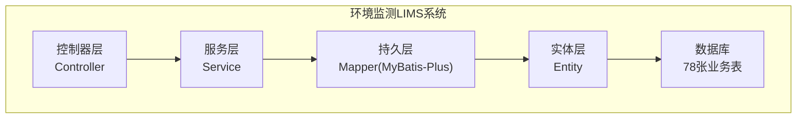
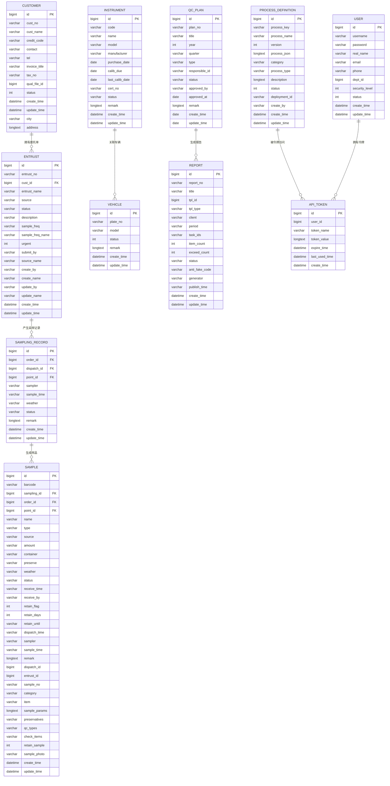
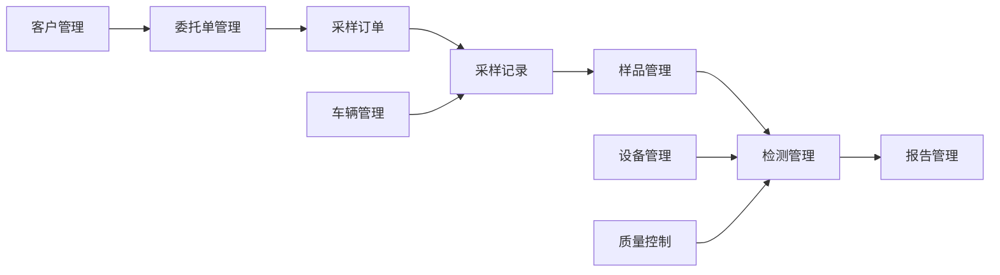

# 数据库设计

<cite>
**本文引用的文件**   
- [schema_mysql.sql](file://flow-engine/src/main/resources/db/schema_mysql.sql)
- [EmsCustomer.java](file://flow-engine/src/main/java/com/flow/engine/entity/EmsCustomer.java)
- [EmsEntrust.java](file://flow-engine/src/main/java/com/flow/engine/entity/EmsEntrust.java)
- [EmsSamplingRecord.java](file://flow-engine/src/main/java/com/flow/engine/entity/EmsSamplingRecord.java)
- [EmsSample.java](file://flow-engine/src/main/java/com/flow/engine/entity/EmsSample.java)
- [EmsInstrument.java](file://flow-engine/src/main/java/com/flow/engine/entity/EmsInstrument.java)
- [EmsVehicle.java](file://flow-engine/src/main/java/com/flow/engine/entity/EmsVehicle.java)
- [EmsQcPlan.java](file://flow-engine/src/main/java/com/flow/engine/entity/EmsQcPlan.java)
- [EmsReport.java](file://flow-engine/src/main/java/com/flow/engine/entity/EmsReport.java)
- [ApiToken.java](file://flow-engine/src/main/java/com/flow/engine/entity/ApiToken.java)
- [ProcessDefinition.java](file://flow-engine/src/main/java/com/flow/engine/entity/ProcessDefinition.java)
- [ProcessInstance.java](file://flow-engine/src/main/java/com/flow/engine/entity/ProcessInstance.java)
- [Task.java](file://flow-engine/src/main/java/com/flow/engine/entity/Task.java)
- [User.java](file://flow-engine/src/main/java/com/flow/engine/entity/User.java)
- [Role.java](file://flow-engine/src/main/java/com/flow/engine/entity/Role.java)
- [Permission.java](file://flow-engine/src/main/java/com/flow/engine/entity/Permission.java)
- [UserRole.java](file://flow-engine/src/main/java/com/flow/engine/entity/UserRole.java)
- [RolePermission.java](file://flow-engine/src/main/java/com/flow/engine/entity/RolePermission.java)
- [Variable.java](file://flow-engine/src/main/java/com/flow/engine/entity/Variable.java)
- [Dept.java](file://flow-engine/src/main/java/com/flow/engine/entity/Dept.java)
- [DataModel.java](file://flow-engine/src/main/java/com/flow/engine/entity/DataModel.java)
- [ModelInstance.java](file://flow-engine/src/main/java/com/flow/engine/entity/ModelInstance.java)
- [OperationLog.java](file://flow-engine/src/main/java/com/flow/engine/entity/OperationLog.java)
- [AccessLog.java](file://flow-engine/src/main/java/com/flow/engine/entity/AccessLog.java)
- [Webhook.java](file://flow-engine/src/main/java/com/flow/engine/entity/Webhook.java)
- [WebhookLog.java](file://flow-engine/src/main/java/com/flow/engine/entity/WebhookLog.java)
- [Delegation.java](file://flow-engine/src/main/java/com/flow/engine/entity/Delegation.java)
- [MybatisPlusConfig.java](file://flow-engine/src/main/java/com/flow/engine/config/MybatisPlusConfig.java)
- [application.yml](file://flow-engine/src/main/resources/application.yml)
</cite>

## 更新摘要
**变更内容**   
- 新增环境监测LIMS系统完整数据库表结构设计，包含78张业务表
- 新增客户管理表（t_customer）支持客户档案、资质文件、发票信息等
- 新增委托单管理表（t_entrust/t_entrust_detail/t_entrust_review）支持委托业务流程
- 新增采样记录表（t_sampling_record）支持现场采样数据采集和状态跟踪
- 新增样品管理表（t_sample）支持样品全生命周期管理和质控绑定
- 新增仪器设备表（t_instrument/t_instrument_calib）支持仪器校准管理
- 新增车辆管理表（t_vehicle/t_vehicle_maintenance）支持采样车辆调度维护
- 新增质量控制表（t_qc_plan/t_qc_activity/t_repeat_test）支持质控计划执行
- 新增报告管理表（t_report/t_report_item/t_report_audit）支持检测报告生成审核
- 扩展API令牌表结构，增强第三方应用集成能力
- 完善流程引擎表结构，支持工作流定义和实例管理

## 目录
1. [引言](#引言)
2. [项目结构](#项目结构)
3. [核心组件](#核心组件)
4. [架构总览](#架构总览)
5. [详细组件分析](#详细组件分析)
6. [依赖分析](#依赖分析)
7. [性能考虑](#性能考虑)
8. [故障排查指南](#故障排查指南)
9. [结论](#结论)
10. [附录](#附录)

## 引言
本文件面向环境监测LIMS系统的数据库层，系统性梳理核心表结构、字段与约束设计原则、索引优化策略、数据迁移方案、备份恢复与灾难恢复计划、完整性约束与业务规则验证、连接池配置与性能调优建议，以及常用查询示例与SQL优化技巧。文档以实际实体类与初始化脚本为依据，确保可落地执行。本次更新重点增加了环境监测LIMS系统的完整数据库设计，涵盖客户管理、委托单处理、采样记录、样品管理、仪器设备、车辆调度、质量控制、报告管理等核心业务模块，为环境监测实验室提供全流程数字化管理支撑。

## 项目结构
本项目采用分层架构：控制器层暴露API，服务层实现业务流程，持久层通过MyBatis-Plus访问数据库。数据库初始化脚本位于资源目录的db子目录中，实体类定义在entity包下，ORM配置在config包中，应用配置在resources目录下。环境监测LIMS系统包含78张业务表，覆盖从客户管理到报告发布的完整业务流程。

```mermaid
graph TB
subgraph "环境监测LIMS系统"
C["控制器层<br/>Controller"]
S["服务层<br/>Service"]
M["持久层<br/>Mapper(MyBatis-Plus)"]
E["实体层<br/>Entity"]
DB["数据库<br/>78张业务表"]
end
C --> S
S --> M
M --> E
E --> DB
```

图表来源
- [EmsBaseDataController.java](file://flow-engine/src/main/java/com/flow/engine/controllers/EmsBaseDataController.java)
- [EmsSamplingController.java](file://flow-engine/src/main/java/com/flow/engine/controllers/EmsSamplingController.java)
- [MybatisPlusConfig.java](file://flow-engine/src/main/java/com/flow/engine/config/MybatisPlusConfig.java)
- [application.yml](file://flow-engine/src/main/resources/application.yml)

章节来源
- [schema_mysql.sql](file://flow-engine/src/main/resources/db/schema_mysql.sql)
- [EmsCustomer.java](file://flow-engine/src/main/java/com/flow/engine/entity/EmsCustomer.java)
- [EmsEntrust.java](file://flow-engine/src/main/java/com/flow/engine/entity/EmsEntrust.java)
- [EmsSamplingRecord.java](file://flow-engine/src/main/java/com/flow/engine/entity/EmsSamplingRecord.java)
- [EmsSample.java](file://flow-engine/src/main/java/com/flow/engine/entity/EmsSample.java)
- [MybatisPlusConfig.java](file://flow-engine/src/main/java/com/flow/engine/config/MybatisPlusConfig.java)
- [application.yml](file://flow-engine/src/main/resources/application.yml)

## 核心组件
本节聚焦环境监测LIMS系统的核心实体及其关系：客户管理、委托单、采样记录、样品、仪器设备、车辆调度、质量控制、报告管理等业务模块，以及流程引擎、用户权限、API令牌等基础支撑模块。

- **客户管理（EmsCustomer）**：客户档案信息，包括客户编号、名称、信用代码、联系方式、发票信息等。
- **委托单管理（EmsEntrust）**：委托单主数据和明细，支持委托来源、频率、紧急程度等业务属性。
- **采样记录（EmsSamplingRecord）**：现场采样记录，支持采样订单关联、监测点位、采样人员、天气状况等。
- **样品管理（EmsSample）**：样品全生命周期管理，支持条码、类型、保存条件、留样管理、处置流程等。
- **仪器设备（EmsInstrument）**：仪器设备台账，支持设备编号、型号、厂商、校准到期日、状态管理等。
- **车辆管理（EmsVehicle）**：采样车辆管理，支持车牌号、车型、状态、维修保养记录等。
- **质量控制（EmsQcPlan）**：质控计划管理，支持年度/季度/专项质控计划，质控活动记录和结果。
- **报告管理（EmsReport）**：检测报告管理，支持报告编号、模板、任务关联、审核流程、防伪码等。
- **流程引擎**：流程定义、流程实例、任务、变量、委派等流程管理功能。
- **用户权限**：RBAC模型，支持用户-角色-权限的多对多关系，权限分组管理。
- **API令牌**：第三方应用集成的安全访问令牌，支持权限范围控制、过期管理和使用统计。

**更新** 新增环境监测LIMS系统完整业务表结构，涵盖78张表，支持从客户管理到报告发布的全流程业务；完善流程引擎表结构，支持工作流定义和实例管理；扩展API令牌表结构，增强第三方应用集成能力。

章节来源
- [EmsCustomer.java](file://flow-engine/src/main/java/com/flow/engine/entity/EmsCustomer.java)
- [EmsEntrust.java](file://flow-engine/src/main/java/com/flow/engine/entity/EmsEntrust.java)
- [EmsSamplingRecord.java](file://flow-engine/src/main/java/com/flow/engine/entity/EmsSamplingRecord.java)
- [EmsSample.java](file://flow-engine/src/main/java/com/flow/engine/entity/EmsSample.java)
- [EmsInstrument.java](file://flow-engine/src/main/java/com/flow/engine/entity/EmsInstrument.java)
- [EmsVehicle.java](file://flow-engine/src/main/java/com/flow/engine/entity/EmsVehicle.java)
- [EmsQcPlan.java](file://flow-engine/src/main/java/com/flow/engine/entity/EmsQcPlan.java)
- [EmsReport.java](file://flow-engine/src/main/java/com/flow/engine/entity/EmsReport.java)
- [ProcessDefinition.java](file://flow-engine/src/main/java/com/flow/engine/entity/ProcessDefinition.java)
- [ProcessInstance.java](file://flow-engine/src/main/java/com/flow/engine/entity/ProcessInstance.java)
- [Task.java](file://flow-engine/src/main/java/com/flow/engine/entity/Task.java)
- [Delegation.java](file://flow-engine/src/main/java/com/flow/engine/entity/Delegation.java)
- [ApiToken.java](file://flow-engine/src/main/java/com/flow/engine/entity/ApiToken.java)

## 架构总览
下图展示环境监测LIMS系统的核心实体之间的关系，包括客户、委托单、采样记录、样品、仪器设备、车辆、质量控制、报告等业务流程实体，以及流程引擎、用户权限、API令牌等基础支撑实体的关联。

```mermaid
erDiagram
CUSTOMER {
bigint id PK
varchar cust_no
varchar cust_name
varchar credit_code
varchar contact
varchar tel
varchar invoice_title
varchar tax_no
bigint qual_file_id
int status
datetime create_time
datetime update_time
varchar city
longtext address
}
ENTRUST {
bigint id PK
varchar entrust_no
bigint cust_id FK
varchar entrust_name
varchar source
varchar status
varchar description
varchar sample_freq
varchar sample_freq_name
int urgent
varchar submit_by
varchar source_name
varchar create_by
varchar create_name
varchar update_by
varchar update_name
datetime create_time
datetime update_time
}
SAMPLING_RECORD {
bigint id PK
bigint order_id FK
bigint dispatch_id FK
bigint point_id FK
varchar sampler
varchar sample_time
varchar weather
varchar status
longtext remark
datetime create_time
datetime update_time
}
SAMPLE {
bigint id PK
varchar barcode
bigint sampling_id FK
bigint order_id FK
bigint point_id FK
varchar name
varchar type
varchar source
varchar amount
varchar container
varchar preserve
varchar weather
varchar status
varchar receive_time
varchar receive_by
int retain_flag
int retain_days
varchar retain_until
varchar dispatch_time
varchar sampler
varchar sample_time
longtext remark
bigint dispatch_id
bigint entrust_id
varchar sample_no
varchar category
varchar item
longtext sample_params
varchar preservatives
varchar qc_types
varchar check_items
int retain_sample
varchar sample_photo
datetime create_time
datetime update_time
}
INSTRUMENT {
bigint id PK
varchar code
varchar name
varchar model
varchar manufacturer
date purchase_date
date calib_due
date last_calib_date
varchar cert_no
varchar status
longtext remark
datetime create_time
datetime update_time
}
VEHICLE {
bigint id PK
varchar plate_no
varchar model
int status
longtext remark
datetime create_time
datetime update_time
}
QC_PLAN {
bigint id PK
varchar plan_no
varchar title
int year
varchar quarter
varchar type
varchar responsible_id
varchar status
varchar approved_by
date approved_at
longtext remark
date create_time
date update_time
}
REPORT {
bigint id PK
varchar report_no
varchar title
bigint tpl_id
varchar tpl_type
varchar client
varchar period
varchar task_ids
int item_count
int exceed_count
varchar status
varchar anti_fake_code
varchar generator
varchar publish_time
datetime create_time
datetime update_time
}
PROCESS_DEFINITION {
bigint id PK
varchar process_key
varchar process_name
int version
longtext process_json
varchar category
varchar process_type
longtext description
int status
varchar deployment_id
varchar create_by
datetime create_time
datetime update_time
}
API_TOKEN {
bigint id PK
bigint user_id
varchar token_name
longtext token_value
datetime expire_time
datetime last_used_time
datetime create_time
}
USER {
bigint id PK
varchar username
varchar password
varchar real_name
varchar email
varchar phone
bigint dept_id
int security_level
int status
datetime create_time
datetime update_time
}
CUSTOMER ||--o{ ENTRUST : "拥有委托单"
ENTRUST ||--o{ SAMPLING_RECORD : "产生采样记录"
SAMPLING_RECORD ||--o{ SAMPLE : "生成样品"
INSTRUMENT ||--o{ VEHICLE : "关联车辆"
QC_PLAN ||--o{ REPORT : "生成报告"
PROCESS_DEFINITION ||--o{ API_TOKEN : "被令牌访问"
USER ||--o{ API_TOKEN : "拥有令牌"
```

图表来源
- [EmsCustomer.java](file://flow-engine/src/main/java/com/flow/engine/entity/EmsCustomer.java)
- [EmsEntrust.java](file://flow-engine/src/main/java/com/flow/engine/entity/EmsEntrust.java)
- [EmsSamplingRecord.java](file://flow-engine/src/main/java/com/flow/engine/entity/EmsSamplingRecord.java)
- [EmsSample.java](file://flow-engine/src/main/java/com/flow/engine/entity/EmsSample.java)
- [EmsInstrument.java](file://flow-engine/src/main/java/com/flow/engine/entity/EmsInstrument.java)
- [EmsVehicle.java](file://flow-engine/src/main/java/com/flow/engine/entity/EmsVehicle.java)
- [EmsQcPlan.java](file://flow-engine/src/main/java/com/flow/engine/entity/EmsQcPlan.java)
- [EmsReport.java](file://flow-engine/src/main/java/com/flow/engine/entity/EmsReport.java)
- [ProcessDefinition.java](file://flow-engine/src/main/java/com/flow/engine/entity/ProcessDefinition.java)
- [ApiToken.java](file://flow-engine/src/main/java/com/flow/engine/entity/ApiToken.java)
- [User.java](file://flow-engine/src/main/java/com/flow/engine/entity/User.java)

## 详细组件分析

### 客户管理表（t_customer）
- 设计要点
  - 主键：自增ID（bigint）。
  - 唯一性：客户名称+信用代码组合唯一，避免重复客户。
  - 基本信息：客户编号、名称、信用代码、联系人、电话等。
  - 财务信息：发票抬头、税号等用于开票管理。
  - 资质文件：qual_file_id关联资质文件，支持资质管理。
  - 地址信息：城市、详细地址等地理位置信息。
- 字段类型选择
  - 文本型使用varchar(长度合理)，大文本使用longtext。
  - 时间戳使用datetime(6)，支持微秒精度。
  - 状态使用int，便于数值比较和排序。
- 外键约束
  - 逻辑外键指向资质文件表，由应用层保证一致性。
- 索引策略
  - 唯一索引：(cust_name, credit_code)确保客户唯一性。
  - 普通索引：cust_no用于快速查询客户编号。
  - 复合索引：(status, create_time)用于按状态和时间筛选。
- 业务规则
  - 客户名称不能为空，必须填写。
  - 信用代码格式校验，符合统一社会信用代码规范。
  - 资质文件有效期检查，过期自动标记为无效。

**新增** 客户管理表支持完整的企业客户信息管理，包括资质文件、发票信息等，为委托单业务提供基础数据支撑。

章节来源
- [EmsCustomer.java](file://flow-engine/src/main/java/com/flow/engine/entity/EmsCustomer.java)
- [schema_mysql.sql:194-209](file://flow-engine/src/main/resources/db/schema_mysql.sql#L194-L209)

### 委托单管理表（t_entrust/t_entrust_detail/t_entrust_review）
- 设计要点
  - 主表：委托单基本信息，包括委托编号、客户关联、委托名称、来源、状态等。
  - 明细表：委托检测项目明细，支持多个检测项目和标准。
  - 审核表：委托单审核记录，支持多级审核流程。
- 字段类型选择
  - 委托编号使用varchar，支持自定义编号规则。
  - 委托频率使用varchar，关联字典表获取显示名称。
  - 紧急程度使用int，区分普通和紧急委托。
- 外键约束
  - 逻辑外键指向客户表，确保委托单与客户关联。
  - 明细表逻辑外键指向主表，保证数据完整性。
- 索引策略
  - 唯一索引：entrust_no确保委托单编号唯一。
  - 复合索引：(cust_id, status)用于按客户和状态查询。
  - 普通索引：create_time用于时间范围查询。
- 业务规则
  - 委托单状态流转：草稿→待审核→审核通过→已驳回。
  - 委托频率支持多种模式：单次、定期、长期等。
  - 紧急委托优先处理，支持加急标识。

**新增** 委托单管理表支持完整的委托业务流程，包括主表、明细表和审核表，为采样订单生成提供依据。

章节来源
- [EmsEntrust.java](file://flow-engine/src/main/java/com/flow/engine/entity/EmsEntrust.java)
- [schema_mysql.sql:320-360](file://flow-engine/src/main/resources/db/schema_mysql.sql#L320-L360)

### 采样记录表（t_sampling_record）
- 设计要点
  - 主键：自增ID（bigint）。
  - 关联关系：采样订单ID、派单ID、监测点位ID。
  - 采样信息：采样人、采样时间、天气状况等。
  - 状态管理：采样中→采样完成→已收样的状态机。
  - 备注信息：支持富文本备注，记录采样特殊情况。
- 字段类型选择
  - 采样时间使用varchar，支持不同时间格式。
  - 天气状况使用varchar，关联字典表获取标准化值。
  - 状态使用varchar，便于业务语义化表达。
- 外键约束
  - 逻辑外键指向采样订单、派单、监测点位表。
  - 采样完成后自动生成样品记录。
- 索引策略
  - 复合索引：(order_id, status)用于按订单和状态查询。
  - 普通索引：point_id用于按监测点位查询。
  - 时间索引：sample_time用于时间范围查询。
- 业务规则
  - 采样记录必须关联有效的采样订单。
  - 采样完成后状态自动更新为"采样完成"。
  - 支持采样记录的修改和完成操作。

**新增** 采样记录表支持现场采样数据采集和状态跟踪，是样品管理的上游数据来源。

章节来源
- [EmsSamplingRecord.java](file://flow-engine/src/main/java/com/flow/engine/entity/EmsSamplingRecord.java)
- [schema_mysql.sql:760-772](file://flow-engine/src/main/resources/db/schema_mysql.sql#L760-L772)

### 样品管理表（t_sample）
- 设计要点
  - 主键：自增ID（bigint）。
  - 条码管理：样品条码（YP前缀），支持条形码打印和管理。
  - 样品信息：名称、类型、来源、数量、容器、保存条件等。
  - 状态管理：待收样→已收样→留样中→实验室监测中→检测数据复核中→已完成/检测异常。
  - 留样管理：留样标志、天数、到期日、存放位置等。
  - 处置管理：异常处置类型、方式、说明、人员、时间等。
- 字段类型选择
  - 条码使用varchar，支持条形码和二维码。
  - 样品参数使用longtext存储JSON数组，支持动态字段。
  - 状态使用varchar，便于业务语义化表达。
  - 时间字段使用varchar或datetime，支持灵活的时间格式。
- 外键约束
  - 逻辑外键指向采样记录、采样订单、监测点位、委托单表。
  - 样品状态变更时同步更新相关业务流程。
- 索引策略
  - 唯一索引：barcode确保样品条码唯一。
  - 复合索引：(sampling_id, status)用于按采样记录和状态查询。
  - 普通索引：point_id、entrust_id用于关联查询。
  - 时间索引：receive_time、dispatch_time用于时间范围查询。
- 业务规则
  - 样品条码自动生成，遵循编码规则。
  - 样品状态流转受业务规则约束，不允许跳步。
  - 留样管理支持自动提醒和到期处理。
  - 异常处置需要记录详细信息和审批流程。

**新增** 样品管理表支持样品全生命周期管理，是环境监测LIMS系统的核心业务表之一。

章节来源
- [EmsSample.java](file://flow-engine/src/main/java/com/flow/engine/entity/EmsSample.java)
- [schema_mysql.sql:659-703](file://flow-engine/src/main/resources/db/schema_mysql.sql#L659-L703)

### 仪器设备表（t_instrument/t_instrument_calib）
- 设计要点
  - 主表：仪器设备基本信息，包括设备编号、名称、型号、厂商等。
  - 校准表：设备校准记录，支持校准日期、到期日、证书编号等。
  - 状态管理：在用、临期、停用、维修、报废等设备状态。
  - 校准管理：校准到期日作为设备使用的强制闸门。
- 字段类型选择
  - 设备编号使用varchar，支持自定义编号规则（YQ前缀）。
  - 日期字段使用date类型，支持日期计算和比较。
  - 状态使用varchar，便于业务语义化表达。
- 外键约束
  - 校准表逻辑外键指向设备主表。
  - 设备状态根据校准到期日自动更新。
- 索引策略
  - 唯一索引：code确保设备编号唯一。
  - 复合索引：(status, calib_due)用于查询即将到期的设备。
  - 普通索引：manufacturer用于按厂商查询。
- 业务规则
  - 校准到期前自动提醒，到期后强制停用。
  - 设备状态变更需要记录操作日志。
  - 支持设备的维修、报废等生命周期管理。

**新增** 仪器设备表支持完整的设备台账和校准管理，为检测业务提供设备保障。

章节来源
- [EmsInstrument.java](file://flow-engine/src/main/java/com/flow/engine/entity/EmsInstrument.java)
- [schema_mysql.sql:406-429](file://flow-engine/src/main/resources/db/schema_mysql.sql#L406-L429)

### 车辆管理表（t_vehicle/t_vehicle_maintenance）
- 设计要点
  - 主表：采样车辆基本信息，包括车牌号、车型、状态等。
  - 维护表：车辆维修保养记录，支持维护类型、起止时间、备注等。
  - 状态管理：可用、占用、维修等车辆状态。
  - 调度管理：支持采样任务的车辆分配和调度。
- 字段类型选择
  - 车牌号使用varchar，支持不同地区车牌格式。
  - 状态使用int，便于数值比较和排序。
  - 维护记录使用varchar，支持多种维护类型。
- 外键约束
  - 维护表逻辑外键指向车辆主表。
  - 车辆状态与维护记录关联，维修期间自动标记为维修状态。
- 索引策略
  - 唯一索引：plate_no确保车牌号唯一。
  - 复合索引：(status, create_time)用于按状态和时间查询。
  - 普通索引：model用于按车型查询。
- 业务规则
  - 车辆状态变更需要记录操作日志。
  - 维修期间车辆不可用，自动拒绝新的调度请求。
  - 支持车辆的保养提醒和到期管理。

**新增** 车辆管理表支持采样车辆的调度和维护管理，为外勤采样提供交通工具保障。

章节来源
- [EmsVehicle.java](file://flow-engine/src/main/java/com/flow/engine/entity/EmsVehicle.java)
- [schema_mysql.sql:815-834](file://flow-engine/src/main/resources/db/schema_mysql.sql#L815-L834)

### 质量控制表（t_qc_plan/t_qc_activity/t_repeat_test）
- 设计要点
  - 计划表：质控计划管理，支持年度、季度、专项质控计划。
  - 活动表：质控活动记录，支持不同类型的质控活动和结果。
  - 复测表：复测记录，支持重复测试的结果对比和分析。
  - 状态管理：草稿、审批中、执行中、已完成等状态。
- 字段类型选择
  - 计划编号使用varchar，支持自定义编号规则（QC前缀）。
  - 周期使用varchar，支持年、季度、专项等不同周期。
  - 结果使用longtext存储JSON，支持复杂数据结构。
- 外键约束
  - 活动表和复测表逻辑外键指向计划表。
  - 质控结果与样品、检测任务关联，形成质量追溯链。
- 索引策略
  - 唯一索引：plan_no确保计划编号唯一。
  - 复合索引：(year, quarter, status)用于按年份和季度查询。
  - 普通索引：type用于按质控类型查询。
- 业务规则
  - 质控计划需要审批后才能执行。
  - 质控结果不合格时自动锁定相关检测数据。
  - 支持质控活动的统计分析和问题预警。

**新增** 质量控制表支持完整的质控计划管理和执行，为检测数据质量提供保障机制。

章节来源
- [EmsQcPlan.java](file://flow-engine/src/main/java/com/flow/engine/entity/EmsQcPlan.java)
- [schema_mysql.sql:537-567](file://flow-engine/src/main/resources/db/schema_mysql.sql#L537-L567)

### 报告管理表（t_report/t_report_item/t_report_audit）
- 设计要点
  - 主表：检测报告基本信息，包括报告编号、标题、模板、客户、周期等。
  - 明细表：报告检测项目明细，支持多个检测项目的结果汇总。
  - 审核表：报告审核记录，支持多级审核流程和意见记录。
  - 防伪管理：防伪码生成和管理，支持报告真实性验证。
- 字段类型选择
  - 报告编号使用varchar，支持自定义编号规则。
  - 任务ID使用varchar存储JSON数组，支持多个检测任务关联。
  - 状态使用varchar，便于业务语义化表达。
- 外键约束
  - 明细表逻辑外键指向报告主表。
  - 审核表逻辑外键指向报告主表。
  - 报告与检测任务关联，形成数据追溯链。
- 索引策略
  - 唯一索引：report_no确保报告编号唯一。
  - 复合索引：(client, period)用于按客户和周期查询。
  - 普通索引：status用于按状态查询。
  - 防伪码索引：anti_fake_code用于防伪验证。
- 业务规则
  - 报告生成需要关联有效的检测任务和结果。
  - 报告审核流程支持多级审核和退回重审。
  - 防伪码生成后不可更改，确保报告真实性。

**新增** 报告管理表支持完整的检测报告生成和审核流程，为环境监测业务提供最终成果输出。

章节来源
- [EmsReport.java](file://flow-engine/src/main/java/com/flow/engine/entity/EmsReport.java)
- [schema_mysql.sql:569-620](file://flow-engine/src/main/resources/db/schema_mysql.sql#L569-L620)

### 流程引擎表（wf_process_definition/wf_process_instance/wf_task）
- 设计要点
  - 流程定义：支持流程模板的定义、版本管理和部署。
  - 流程实例：一次流程运行的上下文，包含当前节点、状态、发起人等。
  - 任务管理：待办或已办任务，关联流程实例与节点，记录处理人、动作、时间戳等。
  - 表单数据：支持流程表单数据的存储和管理。
- 字段类型选择
  - 流程定义使用longtext存储JSON格式的流程定义。
  - 任务类型使用int，区分不同类型任务。
  - 状态使用int，便于数值比较和排序。
- 外键约束
  - 流程实例逻辑外键指向流程定义。
  - 任务逻辑外键指向流程实例。
  - 表单数据逻辑外键指向流程实例或任务。
- 索引策略
  - 唯一索引：process_key确保流程定义键唯一。
  - 复合索引：(process_instance_id, status)用于按实例和状态查询。
  - 普通索引：current_node_id用于按当前节点查询。
- 业务规则
  - 流程定义版本管理，支持向后兼容。
  - 流程实例状态机严格控制状态转换。
  - 任务分配支持多人协作和会签机制。

**更新** 流程引擎表结构完善，支持完整的工作流定义和实例管理，为业务流程自动化提供支撑。

章节来源
- [schema_mysql.sql:930-985](file://flow-engine/src/main/resources/db/schema_mysql.sql#L930-L985)

### API令牌表（sys_api_token）
- 设计要点
  - 主键：自增ID（bigint）。
  - 令牌信息：令牌名称、令牌值、过期时间、最后使用时间等。
  - 用户关联：user_id关联创建令牌的系统用户。
  - 使用统计：last_used_time记录最后使用时间，便于活跃度分析。
- 字段类型选择
  - 令牌值使用longtext，支持长令牌字符串。
  - 时间字段使用datetime(6)，支持微秒精度。
  - 状态管理通过应用层控制，无需单独状态字段。
- 外键约束
  - 逻辑外键指向用户表，确保令牌与用户的关联关系。
  - 令牌撤销时需要检查是否有活跃的API调用。
- 索引策略
  - 唯一索引：token_value确保令牌值唯一。
  - 复合索引：(user_id, expire_time)用于按用户和过期时间查询。
  - 时间索引：expire_time、last_used_time用于时间范围查询。
- 安全机制
  - 令牌生成使用强随机算法，防止预测攻击。
  - 令牌存储时进行哈希处理，避免明文存储。
  - 支持令牌撤销和重新颁发机制。
- 业务规则
  - 每个用户可同时拥有多个令牌，但需限制最大数量。
  - 令牌过期后自动失效，需要重新申请。
  - 令牌使用频率限制，防止滥用攻击。

**更新** API令牌表结构增强，支持完整的令牌生命周期管理，为第三方应用集成提供安全的API访问控制。

章节来源
- [schema_mysql.sql:44-52](file://flow-engine/src/main/resources/db/schema_mysql.sql#L44-L52)

### 用户与权限表（sys_user/sys_role/sys_permission）
- 设计要点
  - RBAC模型：用户-角色-权限多对多关系。
  - 用户信息：用户名、密码、真实姓名、邮箱、电话、部门、职位、安全级别等。
  - 角色管理：角色编码、名称、类型、父级、排序、状态等。
  - 权限管理：权限名称、权限键、权限类型、权限分组、资源路径、排序等。
- 字段类型选择
  - 用户名、编码使用varchar，状态使用int或varchar。
  - 权限分组使用varchar类型，支持分组标识。
  - 安全级别使用int，支持多层级安全管理。
- 外键约束
  - 逻辑外键：user_role(user_id, role_id)、role_permission(role_id, permission_id)。
  - 用户与部门关联，支持组织架构管理。
- 索引策略
  - 用户：username唯一索引。
  - 角色：role_key唯一索引。
  - 权限：perm_key唯一索引，perm_group普通索引。
  - 关联表：(user_id, role_id)、(role_id, permission_id)复合索引。
- 安全与审计
  - 敏感字段加密存储（如密码哈希）。
  - 操作日志记录权限变更。
  - 支持数据权限控制，基于部门和角色。

**更新** 权限表结构完善，支持权限分组管理和数据权限控制，提升权限管理的灵活性。

章节来源
- [schema_mysql.sql:143-170](file://flow-engine/src/main/resources/db/schema_mysql.sql#L143-L170)

## 依赖分析
- 模块耦合
  - 环境监测LIMS系统模块间存在紧密的业务依赖关系。
  - 客户管理为委托单提供基础数据，委托单驱动采样订单生成。
  - 采样记录生成样品，样品管理驱动检测任务和报告生成。
  - 仪器设备管理为检测业务提供设备保障，车辆管理为采样提供交通工具。
  - 质量控制贯穿整个业务流程，确保检测数据质量。
- 外部依赖
  - 数据库驱动、连接池、ORM框架。
  - 文件存储服务，用于资质文件、报告附件等存储。
  - 消息通知服务，用于状态变更提醒和业务通知。
- 循环依赖
  - 实体之间无代码级循环依赖，仅存在逻辑外键关系。
  - 业务流程通过状态机控制，避免循环调用。

```mermaid
graph LR
Customer["客户管理"] --> Entrust["委托单管理"]
Entrust --> SamplingOrder["采样订单"]
SamplingOrder --> SamplingRecord["采样记录"]
SamplingRecord --> Sample["样品管理"]
Sample --> Detection["检测管理"]
Detection --> Report["报告管理"]
Instrument["设备管理"] --> Detection
Vehicle["车辆管理"] --> SamplingRecord
QualityControl["质量控制"] --> Detection
```

图表来源
- [EmsBaseDataController.java](file://flow-engine/src/main/java/com/flow/engine/controllers/EmsBaseDataController.java)
- [EmsSamplingController.java](file://flow-engine/src/main/java/com/flow/engine/controllers/EmsSamplingController.java)

章节来源
- [schema_mysql.sql](file://flow-engine/src/main/resources/db/schema_mysql.sql)
- [application.yml](file://flow-engine/src/main/resources/application.yml)

## 性能考虑
- 索引设计
  - 高频查询条件列建立单列索引。
  - 多条件组合查询建立复合索引，遵循最左前缀原则。
  - 唯一性约束列建立唯一索引。
  - 环境监测LIMS系统中，客户、委托单、样品、报告等核心业务表均建立了相应的索引优化。
  - 时间字段建立索引，支持时间范围查询。
  - 状态字段建立索引，支持状态筛选查询。
- 连接池配置
  - 根据CPU核数与IO特性调整最大连接数、最小空闲连接、获取超时时间。
  - 启用连接健康检查与自动重连。
  - 针对环境监测LIMS系统的高并发场景，适当增加连接池大小。
- SQL优化
  - 避免SELECT *，按需选择字段。
  - 分页查询使用延迟关联或覆盖索引。
  - 批量操作使用批量插入/更新减少往返。
  - 复杂查询使用视图或物化视图优化。
- 缓存策略
  - 热点字典、权限、流程定义可引入缓存层（Redis），降低DB压力。
  - 客户信息、设备信息等基础数据可缓存，减少数据库查询。
  - 报告模板、检测标准等配置数据可缓存，提升响应速度。
- 分库分表
  - 日志与实例表按时间或业务维度分区/分表，提升查询与归档效率。
  - 环境监测LIMS系统中的采样记录、样品、报告等大表可按时间分区。
  - 历史数据定期归档，保持热数据表轻量。

**更新** 环境监测LIMS系统针对78张业务表进行了全面的索引设计和性能优化，支持高并发场景下的稳定运行。

## 故障排查指南
- 常见问题
  - 连接失败：检查数据库地址、端口、账号权限、防火墙。
  - 死锁：查看慢查询与事务范围，缩短事务时长，避免跨表长事务。
  - 索引失效：确认查询条件是否命中索引，避免函数包裹列。
  - 业务异常：检查业务流程状态机，确保状态转换合法性。
  - 数据不一致：检查外键约束和事务一致性，确保数据完整性。
- 诊断工具
  - 开启慢查询日志，分析Top N语句。
  - 使用EXPLAIN分析执行计划，关注全表扫描与临时表。
  - 监控数据库连接池使用情况，及时发现连接泄漏。
  - 监控业务指标，如委托单处理量、样品检测量、报告生成量等。
- 回滚与恢复
  - 变更前备份目标表，变更后验证数据一致性与功能回归。
  - 建立完善的备份恢复机制，支持快速数据恢复。
  - 定期进行灾难恢复演练，验证备份有效性。

**更新** 环境监测LIMS系统提供了完善的故障排查工具和监控机制，支持快速定位和解决业务问题。

章节来源
- [schema_mysql.sql](file://flow-engine/src/main/resources/db/schema_mysql.sql)
- [application.yml](file://flow-engine/src/main/resources/application.yml)

## 结论
本数据库设计围绕环境监测LIMS系统的核心场景展开，构建了完整的78张业务表结构，涵盖了从客户管理到报告发布的全流程业务需求。明确了关键实体的结构与关系，提出了索引优化、连接池配置、备份恢复与灾难恢复策略，并给出SQL优化与故障排查建议。本次更新重点完善了环境监测LIMS系统的数据库设计，包括客户管理、委托单处理、采样记录、样品管理、仪器设备、车辆调度、质量控制、报告管理等核心业务模块；增强了流程引擎的支持能力，为业务流程自动化提供技术支撑；完善了API令牌管理机制，为第三方系统集成提供安全保障。建议在上线前完成压测与容量规划，持续监控慢查询与资源使用，逐步完善索引与归档策略，确保系统在高并发场景下的稳定运行。

## 附录

### 数据迁移方案
- 版本管理
  - 使用增量脚本管理DDL变更，命名规范：V{版本号}__{变更说明}.sql。
  - 每个脚本幂等，支持回滚脚本。
- 变更流程
  - 开发提交变更脚本 → 评审 → 预发环境验证 → 生产灰度发布 → 全量发布。
- 兼容性
  - 新增字段设置默认值，避免破坏旧版本。
  - 删除字段前先标记废弃，观察一段时间后再移除。
- 环境监测LIMS系统迁移
  - 新增78张业务表的迁移脚本，确保数据结构一致性。
  - 提供历史数据迁移工具，支持从Excel导入客户、设备、车辆等基础数据。
  - 建立数据校验机制，确保迁移数据的完整性和准确性。
- 流程引擎迁移
  - 新增流程定义、实例、任务等表的迁移脚本。
  - 支持流程定义的版本管理和向后兼容。
- API令牌迁移
  - 新增API令牌表的迁移脚本。
  - 提供令牌安全相关的初始化数据和配置。

章节来源
- [schema_mysql.sql](file://flow-engine/src/main/resources/db/schema_mysql.sql)

### 备份恢复与灾难恢复
- 备份策略
  - 全量备份：每日一次，保留N天。
  - 增量备份：每小时一次，结合binlog或WAL。
  - 环境监测LIMS系统业务数据单独备份，支持按业务模块选择性恢复。
- 恢复演练
  - 定期在隔离环境演练恢复流程，验证RTO/RPO指标。
  - 模拟各种故障场景，验证恢复流程的有效性。
- 灾备
  - 异地容灾：跨机房或跨地域复制，主从切换预案。
  - 多云备份：支持多云环境的数据备份和恢复。
- 数据归档
  - 历史数据定期归档，保持热数据表轻量。
  - 支持在线查询归档数据，不影响业务性能。

### 数据完整性与业务规则验证
- 完整性约束
  - 主键、唯一键、非空约束。
  - 逻辑外键：在应用层校验，避免长事务。
  - 环境监测LIMS系统中，所有业务表都建立了相应的完整性约束。
- 业务规则
  - 流程状态机：状态转换合法性的服务端校验。
  - 权限校验：基于RBAC的接口级鉴权。
  - 数据模型校验：按schema_json校验实例数据。
  - 环境监测LIMS系统业务规则：
    - 客户信息完整性校验，必填字段验证。
    - 委托单状态机控制，确保业务流程正确性。
    - 样品状态机控制，支持完整生命周期管理。
    - 设备校准到期自动停用，确保检测质量。
    - 质控结果不合格自动锁定相关数据。
    - 报告防伪码生成，确保报告真实性。

章节来源
- [EmsCustomer.java](file://flow-engine/src/main/java/com/flow/engine/entity/EmsCustomer.java)
- [EmsEntrust.java](file://flow-engine/src/main/java/com/flow/engine/entity/EmsEntrust.java)
- [EmsSample.java](file://flow-engine/src/main/java/com/flow/engine/entity/EmsSample.java)
- [EmsInstrument.java](file://flow-engine/src/main/java/com/flow/engine/entity/EmsInstrument.java)
- [EmsReport.java](file://flow-engine/src/main/java/com/flow/engine/entity/EmsReport.java)

### 连接池配置与性能调优建议
- 连接池参数
  - 最大连接数：根据并发与DB能力设定，环境监测LIMS系统建议设置为200-500。
  - 最小空闲连接：维持一定基线连接，减少冷启动开销。
  - 获取超时：避免线程长时间阻塞，建议设置为3-5秒。
- 调优建议
  - 预热连接池，避免首请求抖动。
  - 监控连接泄漏与等待队列。
  - 针对热点查询增加缓存与索引。
  - 环境监测LIMS系统特定优化：
    - 批量操作优化，支持大批量数据导入导出。
    - 分页查询优化，支持大数据量列表查询。
    - 报表查询优化，支持复杂统计分析。
    - 文件存储优化，支持大文件上传下载。

章节来源
- [application.yml](file://flow-engine/src/main/resources/application.yml)
- [MybatisPlusConfig.java](file://flow-engine/src/main/java/com/flow/engine/config/MybatisPlusConfig.java)

### 常用查询示例与SQL优化技巧
- 查询示例
  - 环境监测LIMS系统常用查询：
    - 按客户查询委托单列表，支持状态筛选。
    - 按采样订单查询采样记录，支持时间范围查询。
    - 按样品条码查询样品详情，支持关联信息查询。
    - 按设备编号查询设备信息，支持校准状态查询。
    - 按质控计划查询质控活动，支持结果统计。
    - 按报告编号查询报告详情，支持审核历史查询。
  - 流程引擎查询：
    - 按流程定义查询流程实例，支持状态筛选。
    - 按处理人查询待办任务，支持优先级排序。
    - 按业务键查询流程实例与任务链。
  - API令牌查询：
    - 按用户查询有效令牌，支持过期时间筛选。
    - 按令牌值查询令牌信息，支持使用统计查询。
- 优化技巧
  - 使用覆盖索引减少回表。
  - 分页使用游标或延迟关联。
  - 批量写入使用INSERT...VALUES多行。
  - 避免在WHERE中对列使用函数或隐式类型转换。
  - 环境监测LIMS系统特定优化：
    - 复杂查询使用JOIN优化，避免子查询。
    - 大数据量查询使用分页和限流。
    - 统计分析查询使用物化视图或汇总表。
    - 文件查询使用异步加载，提升响应速度。

### 测试数据说明
- 基础数据
  - 客户数据：包含不同类型企业客户的完整信息。
  - 设备数据：包含各类检测设备的详细信息和校准记录。
  - 车辆数据：包含采样车辆的调度和维护记录。
  - 人员数据：包含检测人员、采样人员、审核人员等信息。
- 业务数据
  - 委托单数据：包含各种类型的委托单和检测项目。
  - 采样数据：包含采样记录、样品信息和检测数据。
  - 质控数据：包含质控计划、活动记录和测试结果。
  - 报告数据：包含检测报告和审核记录。
- 流程数据
  - 流程定义：包含各种业务流程的定义和配置。
  - 流程实例：包含流程运行的历史记录。
  - 任务数据：包含待办和已办任务的详细信息。
- API令牌数据
  - 包含多种类型的测试令牌：开发令牌、测试令牌、生产令牌。
  - 不同权限范围的令牌：只读令牌、读写令牌、管理员令牌。
  - 不同状态的令牌：有效令牌、过期令牌、已撤销令牌。

**更新** 环境监测LIMS系统提供了完整的测试数据集，支持全面的业务功能测试和性能验证。

章节来源
- [schema_mysql.sql](file://flow-engine/src/main/resources/db/schema_mysql.sql)