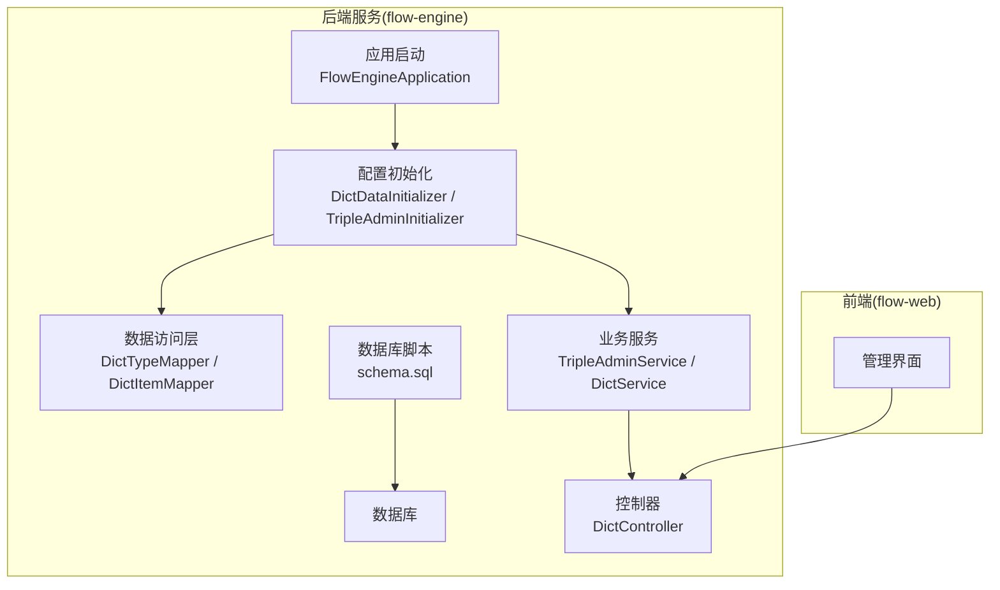
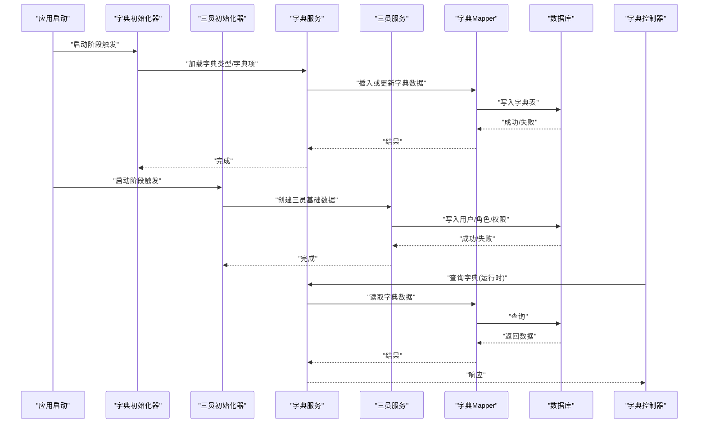
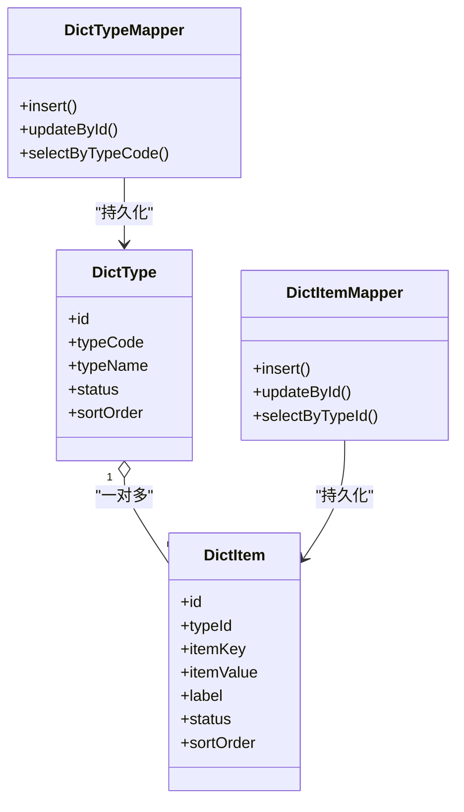
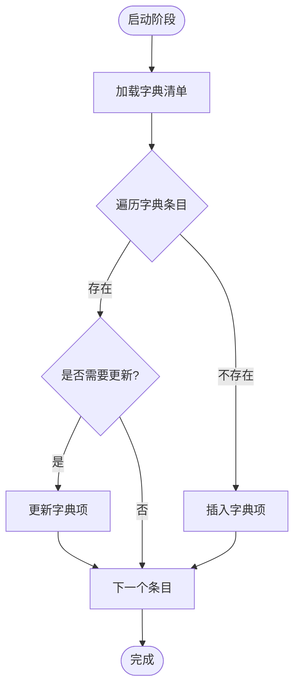
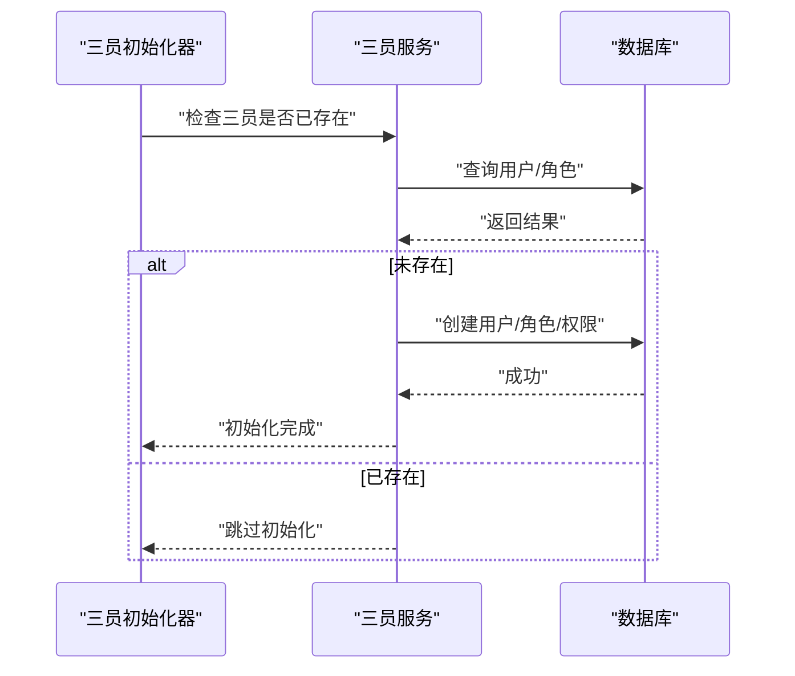
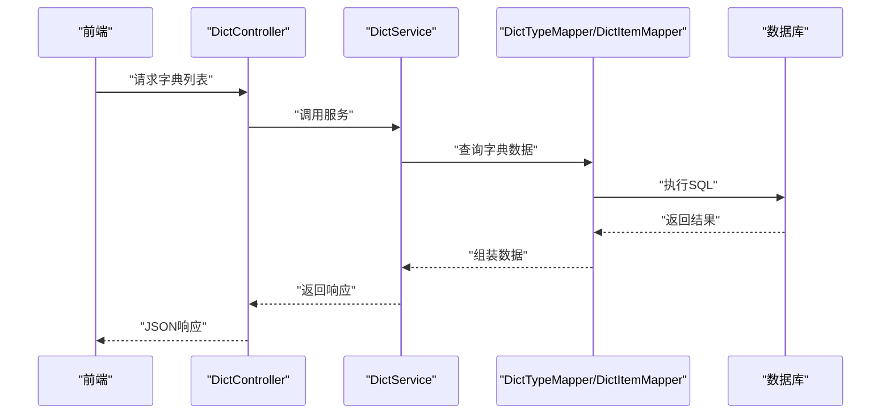
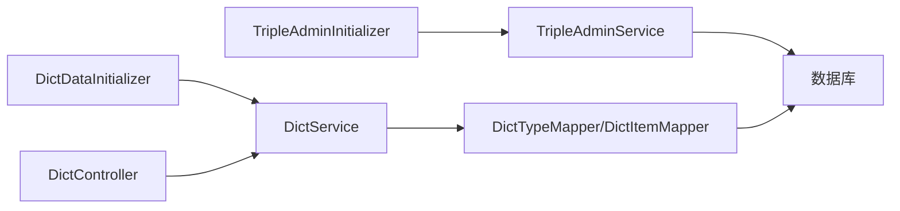

# 数据迁移方案

<cite>
**本文引用的文件**   
- [flow-engine/src/main/resources/db/schema.sql](file://flow-engine/src/main/resources/db/schema.sql)
- [flow-engine/src/main/java/com/flow/engine/config/DictDataInitializer.java](file://flow-engine/src/main/java/com/flow/engine/config/DictDataInitializer.java)
- [flow-engine/src/main/java/com/flow/engine/config/TripleAdminInitializer.java](file://flow-engine/src/main/java/com/flow/engine/config/TripleAdminInitializer.java)
- [flow-engine/src/main/java/com/flow/engine/service/TripleAdminService.java](file://flow-engine/src/main/java/com/flow/engine/service/TripleAdminService.java)
- [flow-engine/src/main/java/com/flow/engine/entity/DictType.java](file://flow-engine/src/main/java/com/flow/engine/entity/DictType.java)
- [flow-engine/src/main/java/com/flow/engine/entity/DictItem.java](file://flow-engine/src/main/java/com/flow/engine/entity/DictItem.java)
- [flow-engine/src/main/java/com/flow/engine/mapper/DictTypeMapper.java](file://flow-engine/src/main/java/com/flow/engine/mapper/DictTypeMapper.java)
- [flow-engine/src/main/java/com/flow/engine/mapper/DictItemMapper.java](file://flow-engine/src/main/java/com/flow/engine/mapper/DictItemMapper.java)
- [flow-engine/src/main/java/com/flow/engine/controller/DictController.java](file://flow-engine/src/main/java/com/flow/engine/controllers/DictController.java)
- [flow-engine/src/main/java/com/flow/engine/service/DictService.java](file://flow-engine/src/main/java/com/flow/engine/service/DictService.java)
- [flow-engine/src/main/java/com/flow/engine/common/GlobalExceptionHandler.java](file://flow-engine/src/main/java/com/flow/engine/common/GlobalExceptionHandler.java)
- [flow-engine/src/main/java/com/flow/engine/common/BusinessException.java](file://flow-engine/src/main/java/com/flow/engine/common/BusinessException.java)
- [flow-engine/src/main/java/com/flow/engine/common/ErrorCode.java](file://flow-engine/src/main/java/com/flow/engine/common/ErrorCode.java)
- [flow-engine/src/test/java/com/flow/engine/SchemaInitTest.java](file://flow-engine/src/test/java/com/flow/engine/SchemaInitTest.java)
- [flow-engine/pom.xml](file://flow-engine/pom.xml)
</cite>

## 目录
1. [引言](#引言)
2. [项目结构](#项目结构)
3. [核心组件](#核心组件)
4. [架构总览](#架构总览)
5. [详细组件分析](#详细组件分析)
6. [依赖关系分析](#依赖关系分析)
7. [性能考虑](#性能考虑)
8. [故障排查指南](#故障排查指南)
9. [结论](#结论)
10. [附录](#附录)

## 引言
本方案围绕“数据库版本管理与数据迁移”的目标，结合当前代码库中的初始化机制与实体映射，给出可落地的迁移策略、脚本规范、回滚与增量升级方法、初始数据加载流程（字典数据、三员管理）、生产环境发布流程与风险控制、备份恢复与灾难恢复计划，以及迁移测试方法与验收标准。文档同时提供可视化图示，帮助非技术读者理解整体流程。

## 项目结构
本项目采用前后端分离的模块化组织方式：
- flow-engine：后端服务，包含启动配置、业务逻辑、数据访问层、控制器、实体与映射器、资源脚本等。
- flow-web：前端管理界面，负责系统管理、流程设计与运行监控等。
- docs：需求与设计文档。

与数据迁移相关的核心位置集中在后端模块：
- 数据库脚本存放于 resources/db 下。
- 初始化逻辑通过配置类在应用启动时执行。
- 实体与 Mapper 定义了数据模型与持久化能力。
- 控制器与服务暴露了字典管理等接口。

图表来源
- [flow-engine/src/main/java/com/flow/engine/config/DictDataInitializer.java](file://flow-engine/src/main/java/com/flow/engine/config/DictDataInitializer.java)
- [flow-engine/src/main/java/com/flow/engine/config/TripleAdminInitializer.java](file://flow-engine/src/main/java/com/flow/engine/config/TripleAdminInitializer.java)
- [flow-engine/src/main/java/com/flow/engine/mapper/DictTypeMapper.java](file://flow-engine/src/main/java/com/flow/engine/mapper/DictTypeMapper.java)
- [flow-engine/src/main/java/com/flow/engine/mapper/DictItemMapper.java](file://flow-engine/src/main/java/com/flow/engine/mapper/DictItemMapper.java)
- [flow-engine/src/main/java/com/flow/engine/service/TripleAdminService.java](file://flow-engine/src/main/java/com/flow/engine/service/TripleAdminService.java)
- [flow-engine/src/main/java/com/flow/engine/service/DictService.java](file://flow-engine/src/main/java/com/flow/engine/service/DictService.java)
- [flow-engine/src/main/java/com/flow/engine/controller/DictController.java](file://flow-engine/src/main/java/com/flow/engine/controllers/DictController.java)
- [flow-engine/src/main/resources/db/schema.sql](file://flow-engine/src/main/resources/db/schema.sql)

章节来源
- [flow-engine/src/main/resources/db/schema.sql](file://flow-engine/src/main/resources/db/schema.sql)
- [flow-engine/src/main/java/com/flow/engine/config/DictDataInitializer.java](file://flow-engine/src/main/java/com/flow/engine/config/DictDataInitializer.java)
- [flow-engine/src/main/java/com/flow/engine/config/TripleAdminInitializer.java](file://flow-engine/src/main/java/com/flow/engine/config/TripleAdminInitializer.java)

## 核心组件
- 数据库脚本与版本基线
  - schema.sql 作为当前版本的DDL基线，用于新建库或重建环境时的表结构与约束初始化。
- 初始化器
  - DictDataInitializer：在应用启动阶段加载字典类型与字典项的基础数据。
  - TripleAdminInitializer：在应用启动阶段完成三员管理（如系统管理员、安全管理员、审计管理员）的初始账号与角色绑定。
- 数据模型与持久化
  - 字典相关实体：DictType、DictItem；对应 Mapper：DictTypeMapper、DictItemMapper。
  - 三员管理相关服务：TripleAdminService，封装三员数据的创建、校验与权限关联逻辑。
- 对外接口
  - DictController 暴露字典查询与管理接口，供前端使用。
- 异常处理
  - GlobalExceptionHandler、BusinessException、ErrorCode 统一错误码与异常返回格式，便于迁移过程中的错误定位与幂等控制。

章节来源
- [flow-engine/src/main/java/com/flow/engine/entity/DictType.java](file://flow-engine/src/main/java/com/flow/engine/entity/DictType.java)
- [flow-engine/src/main/java/com/flow/engine/entity/DictItem.java](file://flow-engine/src/main/java/com/flow/engine/entity/DictItem.java)
- [flow-engine/src/main/java/com/flow/engine/mapper/DictTypeMapper.java](file://flow-engine/src/main/java/com/flow/engine/mapper/DictTypeMapper.java)
- [flow-engine/src/main/java/com/flow/engine/mapper/DictItemMapper.java](file://flow-engine/src/main/java/com/flow/engine/mapper/DictItemMapper.java)
- [flow-engine/src/main/java/com/flow/engine/service/TripleAdminService.java](file://flow-engine/src/main/java/com/flow/engine/service/TripleAdminService.java)
- [flow-engine/src/main/java/com/flow/engine/controllers/DictController.java](file://flow-engine/src/main/java/com/flow/engine/controllers/DictController.java)
- [flow-engine/src/main/java/com/flow/engine/common/GlobalExceptionHandler.java](file://flow-engine/src/main/java/com/flow/engine/common/GlobalExceptionHandler.java)
- [flow-engine/src/main/java/com/flow/engine/common/BusinessException.java](file://flow-engine/src/main/java/com/flow/engine/common/BusinessException.java)
- [flow-engine/src/main/java/com/flow/engine/common/ErrorCode.java](file://flow-engine/src/main/java/com/flow/engine/common/ErrorCode.java)

## 架构总览
下图展示了从应用启动到数据初始化、再到对外接口的调用链路，以及数据库脚本的作用点。

图表来源
- [flow-engine/src/main/java/com/flow/engine/config/DictDataInitializer.java](file://flow-engine/src/main/java/com/flow/engine/config/DictDataInitializer.java)
- [flow-engine/src/main/java/com/flow/engine/config/TripleAdminInitializer.java](file://flow-engine/src/main/java/com/flow/engine/config/TripleAdminInitializer.java)
- [flow-engine/src/main/java/com/flow/engine/service/DictService.java](file://flow-engine/src/main/java/com/flow/engine/service/DictService.java)
- [flow-engine/src/main/java/com/flow/engine/service/TripleAdminService.java](file://flow-engine/src/main/java/com/flow/engine/service/TripleAdminService.java)
- [flow-engine/src/main/java/com/flow/engine/mapper/DictTypeMapper.java](file://flow-engine/src/main/java/com/flow/engine/mapper/DictTypeMapper.java)
- [flow-engine/src/main/java/com/flow/engine/mapper/DictItemMapper.java](file://flow-engine/src/main/java/com/flow/engine/mapper/DictItemMapper.java)
- [flow-engine/src/main/java/com/flow/engine/controllers/DictController.java](file://flow-engine/src/main/java/com/flow/engine/controllers/DictController.java)

## 详细组件分析

### 数据模型与持久化
- 字典数据模型
  - DictType：字典类型主数据，用于分类管理字典项。
  - DictItem：字典项明细，包含键值、显示文本、排序等属性。
- 持久化映射
  - DictTypeMapper、DictItemMapper：提供对字典表的增删改查操作。
- 设计要点
  - 字典数据具备唯一性约束（类型编码、键），便于幂等插入与更新。
  - 建议为常用查询字段建立索引，提升字典检索性能。

图表来源
- [flow-engine/src/main/java/com/flow/engine/entity/DictType.java](file://flow-engine/src/main/java/com/flow/engine/entity/DictType.java)
- [flow-engine/src/main/java/com/flow/engine/entity/DictItem.java](file://flow-engine/src/main/java/com/flow/engine/entity/DictItem.java)
- [flow-engine/src/main/java/com/flow/engine/mapper/DictTypeMapper.java](file://flow-engine/src/main/java/com/flow/engine/mapper/DictTypeMapper.java)
- [flow-engine/src/main/java/com/flow/engine/mapper/DictItemMapper.java](file://flow-engine/src/main/java/com/flow/engine/mapper/DictItemMapper.java)

章节来源
- [flow-engine/src/main/java/com/flow/engine/entity/DictType.java](file://flow-engine/src/main/java/com/flow/engine/entity/DictType.java)
- [flow-engine/src/main/java/com/flow/engine/entity/DictItem.java](file://flow-engine/src/main/java/com/flow/engine/entity/DictItem.java)
- [flow-engine/src/main/java/com/flow/engine/mapper/DictTypeMapper.java](file://flow-engine/src/main/java/com/flow/engine/mapper/DictTypeMapper.java)
- [flow-engine/src/main/java/com/flow/engine/mapper/DictItemMapper.java](file://flow-engine/src/main/java/com/flow/engine/mapper/DictItemMapper.java)

### 字典数据自动初始化
- 触发时机
  - 应用启动阶段由 DictDataInitializer 执行，确保字典数据存在且最新。
- 处理逻辑
  - 按类型编码与键进行幂等写入：若不存在则插入，若存在则根据版本或更新时间决定是否覆盖。
  - 批量写入以提升性能，并在事务中提交，保证一致性。
- 错误处理
  - 捕获并记录异常，必要时抛出业务异常，由全局异常处理器统一返回错误码与消息。

图表来源
- [flow-engine/src/main/java/com/flow/engine/config/DictDataInitializer.java](file://flow-engine/src/main/java/com/flow/engine/config/DictDataInitializer.java)
- [flow-engine/src/main/java/com/flow/engine/service/DictService.java](file://flow-engine/src/main/java/com/flow/engine/service/DictService.java)
- [flow-engine/src/main/java/com/flow/engine/mapper/DictTypeMapper.java](file://flow-engine/src/main/java/com/flow/engine/mapper/DictTypeMapper.java)
- [flow-engine/src/main/java/com/flow/engine/mapper/DictItemMapper.java](file://flow-engine/src/main/java/com/flow/engine/mapper/DictItemMapper.java)

章节来源
- [flow-engine/src/main/java/com/flow/engine/config/DictDataInitializer.java](file://flow-engine/src/main/java/com/flow/engine/config/DictDataInitializer.java)
- [flow-engine/src/main/java/com/flow/engine/service/DictService.java](file://flow-engine/src/main/java/com/flow/engine/service/DictService.java)

### 三员管理自动初始化
- 目标
  - 在首次部署或指定条件下，创建系统管理员、安全管理员、审计管理员三类账户，并完成角色与权限的绑定。
- 处理逻辑
  - 检查是否存在三员账户，避免重复创建。
  - 创建用户、分配角色、设置默认密码策略与状态。
  - 将关键权限授予相应角色，确保最小权限原则。
- 风险与保护
  - 敏感信息（如默认密码）应通过配置注入，禁止硬编码。
  - 初始化过程需具备幂等性与可回滚能力。

图表来源
- [flow-engine/src/main/java/com/flow/engine/config/TripleAdminInitializer.java](file://flow-engine/src/main/java/com/flow/engine/config/TripleAdminInitializer.java)
- [flow-engine/src/main/java/com/flow/engine/service/TripleAdminService.java](file://flow-engine/src/main/java/com/flow/engine/service/TripleAdminService.java)

章节来源
- [flow-engine/src/main/java/com/flow/engine/config/TripleAdminInitializer.java](file://flow-engine/src/main/java/com/flow/engine/config/TripleAdminInitializer.java)
- [flow-engine/src/main/java/com/flow/engine/service/TripleAdminService.java](file://flow-engine/src/main/java/com/flow/engine/service/TripleAdminService.java)

### 字典管理接口
- 功能范围
  - 提供字典类型的增删改查与字典项的维护接口。
- 典型调用链
  - 前端调用 DictController -> DictService -> DictTypeMapper/DictItemMapper -> 数据库。
- 错误处理
  - 通过 GlobalExceptionHandler 统一捕获异常，返回标准化错误码与消息。

图表来源
- [flow-engine/src/main/java/com/flow/engine/controllers/DictController.java](file://flow-engine/src/main/java/com/flow/engine/controllers/DictController.java)
- [flow-engine/src/main/java/com/flow/engine/service/DictService.java](file://flow-engine/src/main/java/com/flow/engine/service/DictService.java)
- [flow-engine/src/main/java/com/flow/engine/mapper/DictTypeMapper.java](file://flow-engine/src/main/java/com/flow/engine/mapper/DictTypeMapper.java)
- [flow-engine/src/main/java/com/flow/engine/mapper/DictItemMapper.java](file://flow-engine/src/main/java/com/flow/engine/mapper/DictItemMapper.java)

章节来源
- [flow-engine/src/main/java/com/flow/engine/controllers/DictController.java](file://flow-engine/src/main/java/com/flow/engine/controllers/DictController.java)
- [flow-engine/src/main/java/com/flow/engine/service/DictService.java](file://flow-engine/src/main/java/com/flow/engine/service/DictService.java)

## 依赖关系分析
- 内部依赖
  - 初始化器依赖服务层，服务层依赖 Mapper 层，Mapper 层依赖数据库。
  - 控制器依赖服务层，形成清晰的分层解耦。
- 外部依赖
  - 数据库驱动与连接池（由 pom.xml 引入）。
  - MyBatis-Plus 提供的通用 Mapper 能力（基于现有 Mapper 接口推断）。
- 潜在耦合点
  - 初始化器与服务之间的强耦合，建议在初始化过程中增加重试与幂等判断，降低并发部署带来的冲突。

图表来源
- [flow-engine/src/main/java/com/flow/engine/config/DictDataInitializer.java](file://flow-engine/src/main/java/com/flow/engine/config/DictDataInitializer.java)
- [flow-engine/src/main/java/com/flow/engine/config/TripleAdminInitializer.java](file://flow-engine/src/main/java/com/flow/engine/config/TripleAdminInitializer.java)
- [flow-engine/src/main/java/com/flow/engine/service/DictService.java](file://flow-engine/src/main/java/com/flow/engine/service/DictService.java)
- [flow-engine/src/main/java/com/flow/engine/service/TripleAdminService.java](file://flow-engine/src/main/java/com/flow/engine/service/TripleAdminService.java)
- [flow-engine/src/main/java/com/flow/engine/mapper/DictTypeMapper.java](file://flow-engine/src/main/java/com/flow/engine/mapper/DictTypeMapper.java)
- [flow-engine/src/main/java/com/flow/engine/mapper/DictItemMapper.java](file://flow-engine/src/main/java/com/flow/engine/mapper/DictItemMapper.java)
- [flow-engine/src/main/java/com/flow/engine/controllers/DictController.java](file://flow-engine/src/main/java/com/flow/engine/controllers/DictController.java)

章节来源
- [flow-engine/pom.xml](file://flow-engine/pom.xml)

## 性能考虑
- 批量写入
  - 字典初始化建议使用批量插入，减少往返次数，提高吞吐。
- 索引优化
  - 为字典类型编码、字典项键、排序字段建立合适索引，避免全表扫描。
- 幂等与去重
  - 利用唯一约束与条件更新，避免重复写入导致的锁竞争。
- 事务边界
  - 初始化过程尽量在一个事务内完成，缩短持有锁的时间，降低死锁概率。
- 缓存策略
  - 字典数据适合读多写少，可在应用层引入本地缓存或分布式缓存，减轻数据库压力。

[本节为通用指导，不直接分析具体文件]

## 故障排查指南
- 常见错误
  - 初始化失败：检查数据库连接、权限、唯一约束冲突。
  - 字典数据不一致：核对类型编码与键的唯一性，确认更新策略。
  - 三员账户冲突：检查是否存在同名用户或角色，清理脏数据后重试。
- 日志与异常
  - 通过 GlobalExceptionHandler 捕获异常，查看 ErrorCode 与消息定位问题。
  - 建议在初始化器中输出关键步骤日志，便于追踪。
- 验证手段
  - 使用 SchemaInitTest 进行端到端验证，确保表结构与初始数据正确。

章节来源
- [flow-engine/src/main/java/com/flow/engine/common/GlobalExceptionHandler.java](file://flow-engine/src/main/java/com/flow/engine/common/GlobalExceptionHandler.java)
- [flow-engine/src/main/java/com/flow/engine/common/BusinessException.java](file://flow-engine/src/main/java/com/flow/engine/common/BusinessException.java)
- [flow-engine/src/main/java/com/flow/engine/common/ErrorCode.java](file://flow-engine/src/main/java/com/flow/engine/common/ErrorCode.java)
- [flow-engine/src/test/java/com/flow/engine/SchemaInitTest.java](file://flow-engine/src/test/java/com/flow/engine/SchemaInitTest.java)

## 结论
本方案以现有初始化器与数据模型为基础，构建了幂等、可回滚、可验证的数据迁移与初始化流程。通过规范的脚本管理、严格的错误处理与完善的测试验证，可有效降低生产环境变更风险，保障系统稳定运行。

[本节为总结性内容，不直接分析具体文件]

## 附录

### 数据迁移工具选择与配置建议
- 推荐工具
  - Flyway：轻量、易用，支持 SQL 与 Java 迁移脚本，具备版本管理与回滚能力。
  - Liquibase：XML/YAML/SQL/JSON 多种格式，变更集丰富，适合复杂场景。
- 选型依据
  - 团队熟悉度、生态集成、回滚能力、并行执行与灰度发布支持。
- 配置要点
  - 数据库连接、迁移脚本路径、版本号命名规则、回滚策略、忽略顺序选项。

[本节为通用指导，不直接分析具体文件]

### 迁移脚本编写规范与命名约定
- 命名约定
  - V{version}__{description}.sql，例如 V1.0.0__init_schema.sql。
  - 版本号遵循语义化版本，递增且不可复用。
- 脚本内容
  - 仅包含增量变更：新增表、新增列、新增索引、数据修正等。
  - 避免删除或破坏性操作，如需删除，提供对应的回滚脚本。
- 幂等性
  - 使用条件语句（如 IF NOT EXISTS）确保多次执行安全。
- 回滚机制
  - 提供 U{version}__rollback.sql 或在工具中声明回滚逻辑。

[本节为通用指导，不直接分析具体文件]

### 增量升级与回滚实现
- 增量升级
  - 每次发布只执行新增的迁移脚本，保持向后兼容。
  - 对于数据修复，先评估影响范围，再逐步滚动发布。
- 回滚实现
  - 优先使用工具内置回滚能力；若无，提供独立回滚脚本，按逆序执行。
  - 回滚前进行数据快照，确保可恢复。

[本节为通用指导，不直接分析具体文件]

### 初始化数据加载策略
- 字典数据
  - 启动时由 DictDataInitializer 加载，支持幂等更新与批量写入。
- 三员管理
  - 启动时由 TripleAdminInitializer 创建基础账户与权限，具备存在性检查与最小权限原则。
- 加载顺序
  - 先执行 DDL（schema.sql），再执行初始化数据，最后启动业务服务。

章节来源
- [flow-engine/src/main/resources/db/schema.sql](file://flow-engine/src/main/resources/db/schema.sql)
- [flow-engine/src/main/java/com/flow/engine/config/DictDataInitializer.java](file://flow-engine/src/main/java/com/flow/engine/config/DictDataInitializer.java)
- [flow-engine/src/main/java/com/flow/engine/config/TripleAdminInitializer.java](file://flow-engine/src/main/java/com/flow/engine/config/TripleAdminInitializer.java)

### 最佳实践
- 事务处理
  - 将相关变更放入同一事务，失败即回滚，保证一致性。
- 错误恢复
  - 捕获异常并记录上下文，提供重试与补偿机制。
- 并发控制
  - 使用分布式锁或数据库唯一约束防止重复执行。
- 灰度与回滚
  - 小流量验证后再全量发布，准备快速回滚方案。

[本节为通用指导，不直接分析具体文件]

### 生产环境迁移流程与风险控制
- 发布前
  - 评审变更、准备回滚脚本、备份数据、制定回退计划。
- 发布中
  - 分批次滚动发布，观察指标与日志，出现异常立即暂停。
- 发布后
  - 验证核心功能与数据一致性，持续监控一段时间。

[本节为通用指导，不直接分析具体文件]

### 备份与恢复策略及灾难恢复计划
- 备份策略
  - 定期全量备份与增量备份，保留多份副本，异地存储。
- 恢复演练
  - 定期进行恢复演练，验证恢复时间目标与恢复点目标。
- 灾难恢复
  - 明确责任人、沟通渠道、应急流程与回退步骤。

[本节为通用指导，不直接分析具体文件]

### 迁移测试方法与验证标准
- 单元测试
  - 针对 Mapper 与服务层进行单测，覆盖正常与异常路径。
- 集成测试
  - 使用 SchemaInitTest 验证表结构与初始数据。
- 验收标准
  - 所有迁移脚本可幂等执行；回滚脚本可逆序执行；核心接口可用；无数据丢失与不一致。

章节来源
- [flow-engine/src/test/java/com/flow/engine/SchemaInitTest.java](file://flow-engine/src/test/java/com/flow/engine/SchemaInitTest.java)