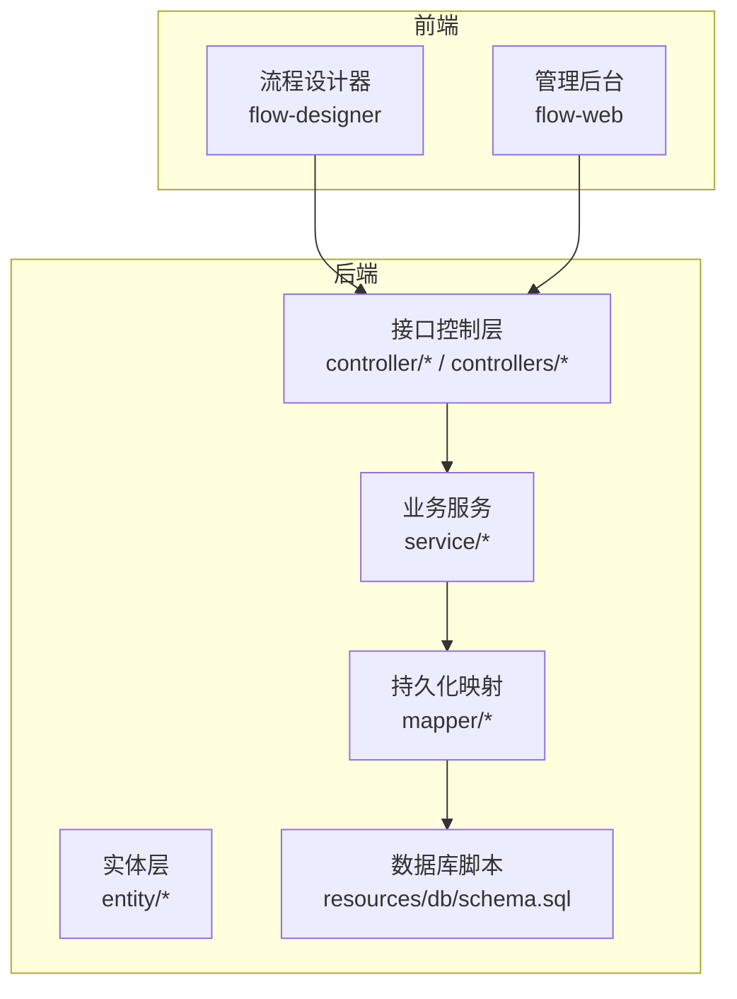
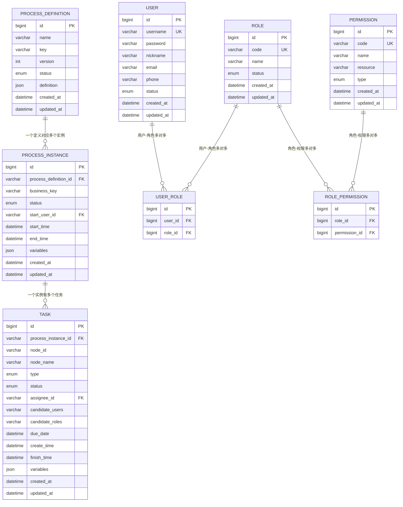
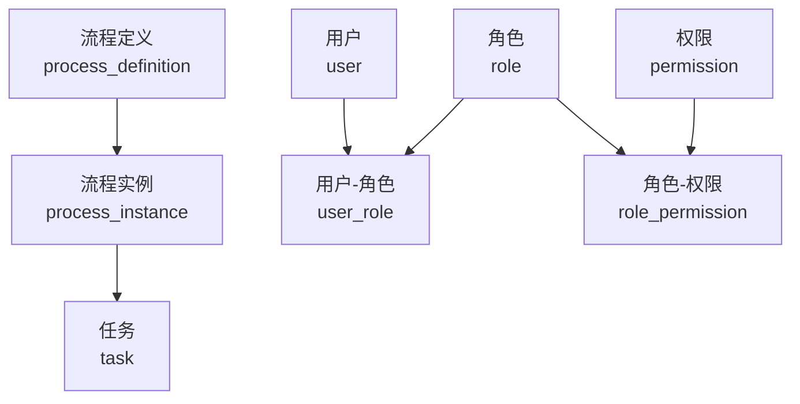
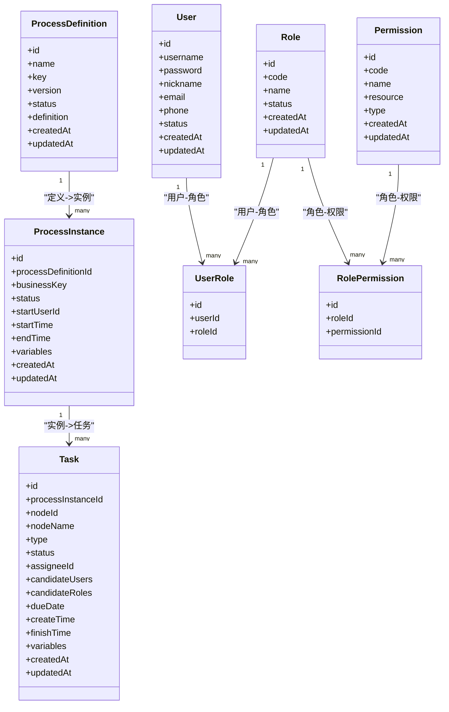

# 核心表结构设计

<cite>
**本文引用的文件**
- [schema.sql](file://flow-engine/src/main/resources/db/schema.sql)
- [ProcessDefinition.java](file://flow-engine/src/main/java/com/flow/engine/entity/ProcessDefinition.java)
- [ProcessInstance.java](file://flow-engine/src/main/java/com/flow/engine/entity/ProcessInstance.java)
- [Task.java](file://flow-engine/src/main/java/com/flow/engine/entity/Task.java)
- [User.java](file://flow-engine/src/main/java/com/flow/engine/entity/User.java)
- [Role.java](file://flow-engine/src/main/java/com/flow/engine/entity/Role.java)
- [Permission.java](file://flow-engine/src/main/java/com/flow/engine/entity/Permission.java)
- [UserRole.java](file://flow-engine/src/main/java/com/flow/engine/entity/UserRole.java)
- [RolePermission.java](file://flow-engine/src/main/java/com/flow/engine/entity/RolePermission.java)
</cite>

## 目录
1. [简介](#简介)
2. [项目结构](#项目结构)
3. [核心组件](#核心组件)
4. [架构总览](#架构总览)
5. [详细组件分析](#详细组件分析)
6. [依赖关系分析](#依赖关系分析)
7. [性能考虑](#性能考虑)
8. [故障排查指南](#故障排查指南)
9. [结论](#结论)
10. [附录](#附录)

## 简介
本文件聚焦于流程引擎的核心数据模型，围绕流程定义、流程实例、任务、用户、角色与权限等关键实体进行系统化说明。文档涵盖字段定义、数据类型选择与约束规则、外键与关联关系（一对一、一对多、多对多）、完整性约束与业务校验机制、ER图与数据模型关系图、版本演进与兼容性策略，以及特殊字段的设计原因与使用场景。目标读者既包括需要快速上手的业务人员，也包括关注实现细节的工程师。

## 项目结构
本项目采用前后端分离架构：
- 后端服务位于 flow-engine 模块，包含实体类、控制器、服务层、解析器、节点处理器及数据库初始化脚本。
- 前端应用位于 flow-web 模块，提供流程设计器、任务中心与后台管理界面。
- 数据库初始化脚本位于 resources/db/schema.sql，是核心表结构的权威来源。

图表来源
- [schema.sql](file://flow-engine/src/main/resources/db/schema.sql)
- [ProcessDefinition.java](file://flow-engine/src/main/java/com/flow/engine/entity/ProcessDefinition.java)
- [ProcessInstance.java](file://flow-engine/src/main/java/com/flow/engine/entity/ProcessInstance.java)
- [Task.java](file://flow-engine/src/main/java/com/flow/engine/entity/Task.java)
- [User.java](file://flow-engine/src/main/java/com/flow/engine/entity/User.java)
- [Role.java](file://flow-engine/src/main/java/com/flow/engine/entity/Role.java)
- [Permission.java](file://flow-engine/src/main/java/com/flow/engine/entity/Permission.java)
- [UserRole.java](file://flow-engine/src/main/java/com/flow/engine/entity/UserRole.java)
- [RolePermission.java](file://flow-engine/src/main/java/com/flow/engine/entity/RolePermission.java)

章节来源
- [schema.sql](file://flow-engine/src/main/resources/db/schema.sql)

## 核心组件
本节概述核心实体及其职责：
- 流程定义（process_definition）：描述流程的静态结构与元数据，如名称、版本、状态、JSON 定义等。
- 流程实例（process_instance）：一次具体的流程执行上下文，包含当前状态、发起人、开始时间、结束时间等。
- 任务（task）：流程运行过程中产生的待办或已办任务，记录任务类型、处理人、状态、创建/完成时间等。
- 用户（user）：系统用户主数据，含登录名、姓名、联系方式、状态等。
- 角色（role）：角色主数据，用于权限聚合。
- 权限（permission）：细粒度资源与操作标识，供角色绑定。
- 用户-角色（user_role）：用户与角色的多对多中间表。
- 角色-权限（role_permission）：角色与权限的多对多中间表。

章节来源
- [ProcessDefinition.java](file://flow-engine/src/main/java/com/flow/engine/entity/ProcessDefinition.java)
- [ProcessInstance.java](file://flow-engine/src/main/java/com/flow/engine/entity/ProcessInstance.java)
- [Task.java](file://flow-engine/src/main/java/com/flow/engine/entity/Task.java)
- [User.java](file://flow-engine/src/main/java/com/flow/engine/entity/User.java)
- [Role.java](file://flow-engine/src/main/java/com/flow/engine/entity/Role.java)
- [Permission.java](file://flow-engine/src/main/java/com/flow/engine/entity/Permission.java)
- [UserRole.java](file://flow-engine/src/main/java/com/flow/engine/entity/UserRole.java)
- [RolePermission.java](file://flow-engine/src/main/java/com/flow/engine/entity/RolePermission.java)

## 架构总览
下图展示了核心实体之间的主要关系，包括一对一、一对多与多对多关系，并标注了典型的外键约束与索引策略。

图表来源
- [schema.sql](file://flow-engine/src/main/resources/db/schema.sql)

## 详细组件分析

### 流程定义表（process_definition）
- 关键字段
  - id：主键，自增或雪花ID，唯一标识流程定义。
  - name：流程显示名称，便于管理与展示。
  - key：流程唯一编码，作为版本化的维度之一。
  - version：版本号，配合 key 保证同一流程的不同版本可并存。
  - status：发布状态（如草稿、已发布、已下线），驱动生命周期。
  - definition：流程 JSON 定义，存储可视化设计结果与运行时所需配置。
  - created_at/updated_at：审计字段，记录创建与更新时间。
- 数据类型与约束
  - 建议 id 使用 bigint；name/key 使用 varchar(64~128)；version 使用 int；status 使用 tinyint 或 enum；definition 使用 json 或 longtext。
  - 唯一性：key + version 组合唯一，避免重复定义。
  - 非空：name、key、version、status 必填。
- 索引策略
  - 在 key、status、created_at 建立索引，加速按流程编码查询与列表分页。
- 业务规则
  - 仅“已发布”的定义可被启动实例引用。
  - 更新定义时递增 version，旧版本保留以兼容历史实例。
- 特殊字段说明
  - definition 字段承载流程拓扑、节点配置与表达式，支持扩展而不改动表结构。

章节来源
- [ProcessDefinition.java](file://flow-engine/src/main/java/com/flow/engine/entity/ProcessDefinition.java)
- [schema.sql](file://flow-engine/src/main/resources/db/schema.sql)

### 流程实例表（process_instance）
- 关键字段
  - id：实例主键。
  - process_definition_id：外键，指向流程定义，表示该实例基于哪个定义生成。
  - business_key：业务单号，便于与外部系统关联。
  - status：实例状态（如运行中、已完成、已终止）。
  - start_user_id：发起人用户 ID。
  - start_time/end_time：起止时间，用于统计与审计。
  - variables：流程变量快照或引用，支持动态扩展。
  - created_at/updated_at：审计字段。
- 数据类型与约束
  - process_definition_id 为外键，级联删除需谨慎，通常采用逻辑删除或限制删除。
  - business_key 建议唯一，避免重复发起。
  - status 使用枚举或 tinyint，限定合法值。
- 索引策略
  - 在 process_definition_id、business_key、status、start_time 建索引，支撑按定义、业务单号与时间范围查询。
- 业务规则
  - 实例创建后进入“运行中”，根据任务推进至“已完成”或“已终止”。
  - 实例状态变更需落库并触发事件。
- 特殊字段说明
  - variables 字段用于存放轻量流程变量，复杂变量可通过独立表或缓存存储，此处保持灵活性与可扩展性。

章节来源
- [ProcessInstance.java](file://flow-engine/src/main/java/com/flow/engine/entity/ProcessInstance.java)
- [schema.sql](file://flow-engine/src/main/resources/db/schema.sql)

### 任务表（task）
- 关键字段
  - id：任务主键。
  - process_instance_id：外键，归属的流程实例。
  - node_id/node_name：节点标识与名称，便于追踪与展示。
  - type：任务类型（如用户任务、服务任务、网关分支等）。
  - status：任务状态（待处理、进行中、已完成、已取消等）。
  - assignee_id：实际处理人（若为个人任务）。
  - candidate_users/candidate_roles：候选人与候选角色集合，用于多人协作或组任务。
  - due_date：截止时间，支持超时提醒。
  - create_time/finish_time：任务生命周期时间戳。
  - variables：任务级变量。
  - created_at/updated_at：审计字段。
- 数据类型与约束
  - process_instance_id 为外键，确保任务始终属于有效实例。
  - assignee_id 可为空（组任务），但候选人至少存在其一。
  - status/type 使用枚举或 tinyint，限制取值域。
- 索引策略
  - 在 process_instance_id、assignee_id、status、create_time 建索引，支撑待办/已办查询与实例轨迹。
- 业务规则
  - 任务创建后处于“待处理”，认领或指派后进入“进行中”，完成后进入“已完成”。
  - 支持加签、转派、退回等动作，通过状态机与审计日志保障一致性。
- 特殊字段说明
  - candidate_users/candidate_roles 使用 JSON 或分隔字符串存储，兼顾查询效率与灵活性。

章节来源
- [Task.java](file://flow-engine/src/main/java/com/flow/engine/entity/Task.java)
- [schema.sql](file://flow-engine/src/main/resources/db/schema.sql)

### 用户表（user）
- 关键字段
  - id：用户主键。
  - username：登录名，唯一。
  - password：密码密文。
  - nickname/email/phone：基本信息。
  - status：账号状态（启用/禁用）。
  - created_at/updated_at：审计字段。
- 数据类型与约束
  - username 唯一且非空；password 长度满足安全要求。
  - status 使用枚举或 tinyint。
- 索引策略
  - 在 username、email、phone 建立唯一或普通索引，提升登录与检索性能。
- 业务规则
  - 禁用账号不可参与流程与任务。
  - 密码需加密存储，禁止明文。
- 特殊字段说明
  - 预留扩展字段（如部门、岗位）可通过附加表或 JSON 扩展。

章节来源
- [User.java](file://flow-engine/src/main/java/com/flow/engine/entity/User.java)
- [schema.sql](file://flow-engine/src/main/resources/db/schema.sql)

### 角色表（role）
- 关键字段
  - id：角色主键。
  - code：角色编码，唯一。
  - name：角色名称。
  - status：状态。
  - created_at/updated_at：审计字段。
- 数据类型与约束
  - code 唯一且非空；status 使用枚举或 tinyint。
- 索引策略
  - 在 code、status 建索引。
- 业务规则
  - 角色用于聚合权限，支持层级或分类扩展。
- 特殊字段说明
  - 可结合字典表维护角色类别与适用范围。

章节来源
- [Role.java](file://flow-engine/src/main/java/com/flow/engine/entity/Role.java)
- [schema.sql](file://flow-engine/src/main/resources/db/schema.sql)

### 权限表（permission）
- 关键字段
  - id：权限主键。
  - code：权限编码，唯一。
  - name：权限名称。
  - resource：资源标识（如模块/页面/按钮）。
  - type：权限类型（菜单、按钮、API 等）。
  - created_at/updated_at：审计字段。
- 数据类型与约束
  - code 唯一且非空；type 使用枚举或 tinyint。
- 索引策略
  - 在 code、resource、type 建索引。
- 业务规则
  - 权限作为最小授权单元，供角色绑定。
- 特殊字段说明
  - resource 与 type 共同构成访问控制的判定依据。

章节来源
- [Permission.java](file://flow-engine/src/main/java/com/flow/engine/entity/Permission.java)
- [schema.sql](file://flow-engine/src/main/resources/db/schema.sql)

### 用户-角色（user_role）与角色-权限（role_permission）
- 用户-角色（user_role）
  - 作用：实现用户与角色的多对多关系。
  - 关键字段：user_id、role_id，联合唯一约束防止重复分配。
  - 索引：在 user_id、role_id 分别建索引，加速按用户查角色与按角色查用户。
- 角色-权限（role_permission）
  - 作用：实现角色与权限的多对多关系。
  - 关键字段：role_id、permission_id，联合唯一约束防止重复绑定。
  - 索引：在 role_id、permission_id 分别建索引，加速权限计算与鉴权。
- 业务规则
  - 用户拥有其所有角色的并集权限；权限计算应缓存以提升性能。
- 特殊字段说明
  - 可在中间表中增加生效时间、范围等扩展字段，支持更精细的授权策略。

章节来源
- [UserRole.java](file://flow-engine/src/main/java/com/flow/engine/entity/UserRole.java)
- [RolePermission.java](file://flow-engine/src/main/java/com/flow/engine/entity/RolePermission.java)
- [schema.sql](file://flow-engine/src/main/resources/db/schema.sql)

## 依赖关系分析
核心实体的依赖关系如下：
- 流程定义到流程实例：一对多（一个定义可被多次启动产生多个实例）。
- 流程实例到任务：一对多（一个实例在执行过程中会产生多个任务）。
- 用户到任务：一对多（用户可作为处理人或候选人参与多个任务）。
- 用户到角色：多对多（通过 user_role 中间表）。
- 角色到权限：多对多（通过 role_permission 中间表）。

图表来源
- [schema.sql](file://flow-engine/src/main/resources/db/schema.sql)

章节来源
- [schema.sql](file://flow-engine/src/main/resources/db/schema.sql)

## 性能考虑
- 索引优化
  - 针对高频查询列（如 process_definition_id、business_key、assignee_id、status、create_time）建立合适索引。
  - 复合索引覆盖常见查询条件，减少回表。
- 分库分表
  - 当实例与任务量增长到千万级，可按时间或租户进行水平拆分。
- 读写分离
  - 将报表与监控查询路由到只读副本，降低主库压力。
- 缓存策略
  - 权限计算结果、流程定义 JSON、字典数据等可缓存，缩短响应时间。
- 归档策略
  - 对已完成的历史实例与任务定期归档，保持热数据表轻量化。

[本节为通用性能建议，不直接分析具体文件]

## 故障排查指南
- 外键约束冲突
  - 现象：删除流程定义或用户时报外键约束失败。
  - 排查：检查是否存在未清理的实例或任务；必要时先软删除或级联处理。
- 唯一性冲突
  - 现象：插入重复的 username、code、business_key 报错。
  - 排查：确认上游是否重复提交；增加幂等控制。
- 状态不一致
  - 现象：实例或任务状态异常。
  - 排查：核对事务边界与事件监听；补充重试与补偿逻辑。
- 权限失效
  - 现象：用户无法访问资源。
  - 排查：检查 user_role 与 role_permission 是否正确；验证权限缓存是否过期。

章节来源
- [schema.sql](file://flow-engine/src/main/resources/db/schema.sql)

## 结论
本设计围绕流程引擎的核心实体构建了清晰的数据模型，明确了字段类型、约束与索引策略，并通过中间表实现了多对多关系。ER 图直观呈现了一对一、一对多与多对多的关联方式，配合业务规则与完整性约束，保障了数据一致性与可扩展性。后续可根据规模与业务复杂度引入分库分表、读写分离与缓存策略，进一步提升系统性能与可用性。

[本节为总结性内容，不直接分析具体文件]

## 附录

### ER 图与数据模型关系图
- ER 图已在“架构总览”部分给出，可直接参考。
- 数据模型关系图（代码级）：

图表来源
- [ProcessDefinition.java](file://flow-engine/src/main/java/com/flow/engine/entity/ProcessDefinition.java)
- [ProcessInstance.java](file://flow-engine/src/main/java/com/flow/engine/entity/ProcessInstance.java)
- [Task.java](file://flow-engine/src/main/java/com/flow/engine/entity/Task.java)
- [User.java](file://flow-engine/src/main/java/com/flow/engine/entity/User.java)
- [Role.java](file://flow-engine/src/main/java/com/flow/engine/entity/Role.java)
- [Permission.java](file://flow-engine/src/main/java/com/flow/engine/entity/Permission.java)
- [UserRole.java](file://flow-engine/src/main/java/com/flow/engine/entity/UserRole.java)
- [RolePermission.java](file://flow-engine/src/main/java/com/flow/engine/entity/RolePermission.java)

### 版本演进与兼容性考虑
- 版本化策略
  - 流程定义通过 key+version 实现版本化，新增版本不影响历史实例。
- 向后兼容
  - 新增字段默认允许为空并提供默认值；修改字段类型时评估迁移成本。
  - JSON 字段（definition、variables）用于承载扩展信息，避免频繁改表。
- 迁移方案
  - 使用增量脚本逐步演进，确保灰度发布与回滚能力。
  - 对敏感字段（如密码、手机号）进行脱敏与加密升级。

章节来源
- [schema.sql](file://flow-engine/src/main/resources/db/schema.sql)

### 特殊字段设计与使用场景
- definition（流程定义）
  - 用途：保存流程拓扑与节点配置，支持可视化编辑与动态加载。
  - 场景：流程设计器导出、运行时解析、版本对比。
- variables（流程/任务变量）
  - 用途：轻量流程变量存储，支持表达式与动态表单。
  - 场景：条件分支、表单回填、审计追溯。
- candidate_users/candidate_roles（候选人）
  - 用途：支持组任务与动态授权。
  - 场景：会签、轮询、按部门/角色分发。
- business_key（业务单号）
  - 用途：与外部系统单号关联，便于对账与追踪。
  - 场景：订单审批、合同签署、报销流程。

章节来源
- [ProcessDefinition.java](file://flow-engine/src/main/java/com/flow/engine/entity/ProcessDefinition.java)
- [ProcessInstance.java](file://flow-engine/src/main/java/com/flow/engine/entity/ProcessInstance.java)
- [Task.java](file://flow-engine/src/main/java/com/flow/engine/entity/Task.java)
- [schema.sql](file://flow-engine/src/main/resources/db/schema.sql)