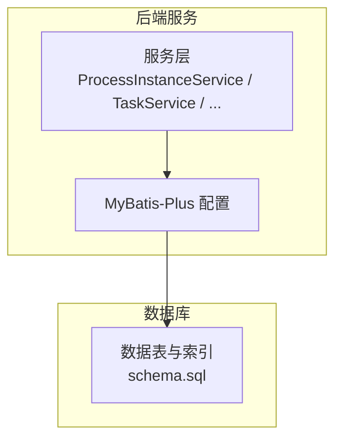
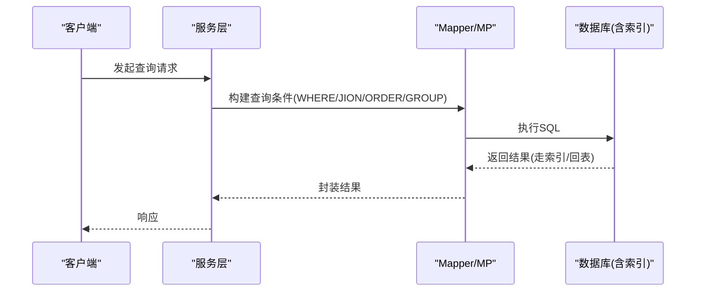
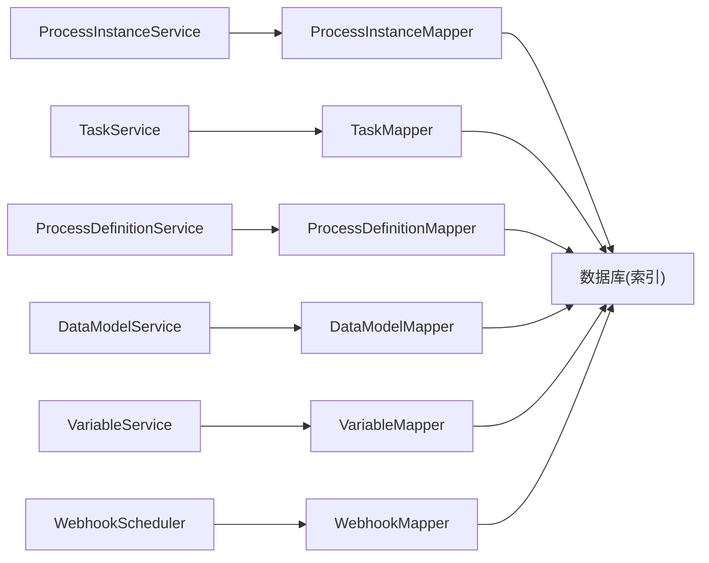

# 索引优化策略

<cite>
**本文引用的文件**   
- [schema.sql](file://flow-engine/src/main/resources/db/schema.sql)
- [ProcessInstanceService.java](file://flow-engine/src/main/java/com/flow/engine/service/ProcessInstanceService.java)
- [TaskService.java](file://flow-engine/src/main/java/com/flow/engine/service/TaskService.java)
- [ProcessDefinitionService.java](file://flow-engine/src/main/java/com/flow/engine/service/ProcessDefinitionService.java)
- [DataModelService.java](file://flow-engine/src/main/java/com/flow/engine/service/DataModelService.java)
- [VariableService.java](file://flow-engine/src/main/java/com/flow/engine/service/VariableService.java)
- [WebhookScheduler.java](file://flow-engine/src/main/java/com/flow/engine/service/WebhookScheduler.java)
- [MybatisPlusConfig.java](file://flow-engine/src/main/java/com/flow/engine/config/MybatisPlusConfig.java)
</cite>

## 目录
1. [引言](#引言)
2. [项目结构](#项目结构)
3. [核心组件](#核心组件)
4. [架构总览](#架构总览)
5. [详细组件分析](#详细组件分析)
6. [依赖关系分析](#依赖关系分析)
7. [性能考虑](#性能考虑)
8. [故障排查指南](#故障排查指南)
9. [结论](#结论)
10. [附录](#附录)

## 引言
本文件聚焦于流程引擎项目的数据库索引优化策略，围绕主键索引、唯一索引、普通索引与复合索引的设计原则展开，结合高频查询场景给出覆盖索引与选择性分析建议；同时总结复合索引在联合查询、排序与分组中的使用模式，提供最佳实践、常见陷阱、监控与维护方法，以及SQL优化与执行计划分析方法。

## 项目结构
本项目采用前后端分离的架构：后端基于Spring Boot + MyBatis-Plus，数据模型定义位于资源脚本中，服务层通过Mapper访问数据库。索引设计与优化主要涉及以下方面：
- 数据表结构与约束（主键、唯一键）
- 业务查询路径（按实例、任务、定义等维度）
- 分页与排序字段
- 审计与日志类表的分区与归档策略

图表来源
- [MybatisPlusConfig.java](file://flow-engine/src/main/java/com/flow/engine/config/MybatisPlusConfig.java)
- [schema.sql](file://flow-engine/src/main/resources/db/schema.sql)

章节来源
- [schema.sql](file://flow-engine/src/main/resources/db/schema.sql)
- [MybatisPlusConfig.java](file://flow-engine/src/main/java/com/flow/engine/config/MybatisPlusConfig.java)

## 核心组件
- 数据模型与索引定义：集中在数据库初始化脚本中，包含实体表的主键、唯一键及常用查询索引。
- 服务层查询入口：各Service通过Mapper发起查询，决定WHERE、JOIN、ORDER BY、GROUP BY等条件，是索引设计的关键输入。
- 框架配置：MyBatis-Plus配置影响分页、逻辑删除、SQL打印等，间接影响索引利用与执行计划。

章节来源
- [schema.sql](file://flow-engine/src/main/resources/db/schema.sql)
- [ProcessInstanceService.java](file://flow-engine/src/main/java/com/flow/engine/service/ProcessInstanceService.java)
- [TaskService.java](file://flow-engine/src/main/java/com/flow/engine/service/TaskService.java)
- [ProcessDefinitionService.java](file://flow-engine/src/main/java/com/flow/engine/service/ProcessDefinitionService.java)
- [DataModelService.java](file://flow-engine/src/main/java/com/flow/engine/service/DataModelService.java)
- [VariableService.java](file://flow-engine/src/main/java/com/flow/engine/service/VariableService.java)
- [WebhookScheduler.java](file://flow-engine/src/main/java/com/flow/engine/service/WebhookScheduler.java)
- [MybatisPlusConfig.java](file://flow-engine/src/main/java/com/flow/engine/config/MybatisPlusConfig.java)

## 架构总览
下图展示了从服务层到数据库的调用链路，以及索引优化的关键切入点（过滤、排序、分组、覆盖）。

图表来源
- [ProcessInstanceService.java](file://flow-engine/src/main/java/com/flow/engine/service/ProcessInstanceService.java)
- [TaskService.java](file://flow-engine/src/main/java/com/flow/engine/service/TaskService.java)
- [schema.sql](file://flow-engine/src/main/resources/db/schema.sql)

## 详细组件分析

### 数据表与索引现状梳理
- 主键索引：每张业务表均具备自增或UUID主键，用于快速定位单行记录。
- 唯一索引：对强一致性的标识字段建立唯一约束，如流程定义编码、用户账号等。
- 普通索引：针对高频过滤字段（如状态、类型、租户ID、创建时间等）建立索引。
- 复合索引：为多条件过滤、排序、分组的组合场景设计，遵循最左前缀原则。

章节来源
- [schema.sql](file://flow-engine/src/main/resources/db/schema.sql)

### 高频查询与覆盖索引策略
- 目标：让查询尽可能“仅扫描索引”，避免回表，减少I/O。
- 做法：将WHERE过滤列与SELECT返回列尽量放入同一复合索引，形成覆盖索引。
- 注意：覆盖索引会增大索引体积，需权衡写入放大与空间成本。

章节来源
- [ProcessInstanceService.java](file://flow-engine/src/main/java/com/flow/engine/service/ProcessInstanceService.java)
- [TaskService.java](file://flow-engine/src/main/java/com/flow/engine/service/TaskService.java)
- [schema.sql](file://flow-engine/src/main/resources/db/schema.sql)

### 索引选择性分析与选择原则
- 选择性高：区分度高的列优先作为索引首列（如租户ID、业务编号）。
- 选择性低：枚举类小范围值（如状态）不宜单独做索引首列，常作为复合索引的第二列。
- 组合顺序：先高选择性列，再低选择性列；若存在排序/分组，需兼顾最左前缀与排序列位置。

章节来源
- [schema.sql](file://flow-engine/src/main/resources/db/schema.sql)

### 复合索引的使用场景与设计模式
- 联合查询：WHERE a=? AND b=? 且 SELECT 需要 a,b,c 时，可设计 (a,b,c) 覆盖索引。
- 排序优化：ORDER BY a,b 且 WHERE a=? 时，(a,b) 可同时满足过滤与排序。
- 分组优化：GROUP BY a,b 且 WHERE a=? 时，(a,b) 有助于加速分组。
- 最左前缀：复合索引只能从左到右匹配，缺失首列会导致索引失效或部分失效。

章节来源
- [schema.sql](file://flow-engine/src/main/resources/db/schema.sql)

### 审计与日志类表的索引策略
- 审计/日志表通常写多读少，建议：
  - 以时间戳为主键或聚簇索引，便于按时间范围查询与归档。
  - 对必要查询维度（如操作人、模块、时间范围）建立复合索引。
  - 定期归档历史数据，控制单表规模，提升索引效率。

章节来源
- [schema.sql](file://flow-engine/src/main/resources/db/schema.sql)

### 定时任务与批量处理的索引考量
- 定时任务（如Webhook调度）常按状态+时间窗口筛选，应建立 (status, next_run_time) 类复合索引。
- 批量更新/删除应避免全表扫描，确保WHERE条件命中索引。

章节来源
- [WebhookScheduler.java](file://flow-engine/src/main/java/com/flow/engine/service/WebhookScheduler.java)
- [schema.sql](file://flow-engine/src/main/resources/db/schema.sql)

### 变量与扩展字段的索引策略
- 变量表若按流程实例/节点维度频繁查询，建议 (process_instance_id, node_id/key) 复合索引。
- 若存在JSON/文本大字段，避免将其纳入索引；必要时拆分子表并加索引。

章节来源
- [VariableService.java](file://flow-engine/src/main/java/com/flow/engine/service/VariableService.java)
- [schema.sql](file://flow-engine/src/main/resources/db/schema.sql)

### 数据模型与权限相关查询
- 数据模型与权限表常按租户、角色、权限码等维度查询，建议相应复合索引。
- 权限计算热点路径应保证最小回表次数，必要时使用覆盖索引。

章节来源
- [DataModelService.java](file://flow-engine/src/main/java/com/flow/engine/service/DataModelService.java)
- [schema.sql](file://flow-engine/src/main/resources/db/schema.sql)

## 依赖关系分析
- 服务层依赖Mapper接口，Mapper由MyBatis-Plus生成或自定义XML，最终落到数据库表与索引。
- 索引有效性取决于SQL的WHERE/JION/ORDER/GROUP与索引列的前缀匹配关系。

图表来源
- [ProcessInstanceService.java](file://flow-engine/src/main/java/com/flow/engine/service/ProcessInstanceService.java)
- [TaskService.java](file://flow-engine/src/main/java/com/flow/engine/service/TaskService.java)
- [ProcessDefinitionService.java](file://flow-engine/src/main/java/com/flow/engine/service/ProcessDefinitionService.java)
- [DataModelService.java](file://flow-engine/src/main/java/com/flow/engine/service/DataModelService.java)
- [VariableService.java](file://flow-engine/src/main/java/com/flow/engine/service/VariableService.java)
- [WebhookScheduler.java](file://flow-engine/src/main/java/com/flow/engine/service/WebhookScheduler.java)
- [schema.sql](file://flow-engine/src/main/resources/db/schema.sql)

章节来源
- [ProcessInstanceService.java](file://flow-engine/src/main/java/com/flow/engine/service/ProcessInstanceService.java)
- [TaskService.java](file://flow-engine/src/main/java/com/flow/engine/service/TaskService.java)
- [ProcessDefinitionService.java](file://flow-engine/src/main/java/com/flow/engine/service/ProcessDefinitionService.java)
- [DataModelService.java](file://flow-engine/src/main/java/com/flow/engine/service/DataModelService.java)
- [VariableService.java](file://flow-engine/src/main/java/com/flow/engine/service/VariableService.java)
- [WebhookScheduler.java](file://flow-engine/src/main/java/com/flow/engine/service/WebhookScheduler.java)
- [schema.sql](file://flow-engine/src/main/resources/db/schema.sql)

## 性能考虑
- 索引数量控制：单表索引不宜过多，避免写入放大与统计信息膨胀。
- 覆盖索引优先：对热点只读查询优先设计覆盖索引，减少回表。
- 排序与分组：尽量让ORDER BY/GROUP BY与索引列一致，避免文件排序。
- 分页优化：深分页建议使用延迟关联或游标分页，避免大范围扫描。
- 统计信息维护：定期ANALYZE，确保优化器选择正确执行计划。
- 冷热分层：历史数据归档至冷表，热表保持较小规模以提升索引命中率。

[本节为通用指导，不直接分析具体文件]

## 故障排查指南
- 索引失效常见原因
  - WHERE条件未命中最左前缀或缺失首列
  - 对索引列进行函数运算、隐式类型转换
  - OR连接导致优化器放弃索引
  - LIKE前导通配符（%xxx）无法使用前缀索引
  - 统计信息陈旧导致错误执行计划
- 诊断步骤
  - 使用EXPLAIN查看执行计划，关注type、key、rows、Extra
  - 核对WHERE/JION/ORDER/GROUP与索引列的前缀匹配
  - 检查是否存在隐式类型转换或函数包裹
  - 评估选择性，确认是否更适合复合索引
- 修复建议
  - 调整SQL条件顺序，确保最左前缀匹配
  - 拆分OR为UNION ALL，分别命中不同索引
  - 改写LIKE为前缀匹配或使用全文检索
  - 重建统计信息，必要时强制指定索引（谨慎使用）

章节来源
- [schema.sql](file://flow-engine/src/main/resources/db/schema.sql)
- [MybatisPlusConfig.java](file://flow-engine/src/main/java/com/flow/engine/config/MybatisPlusConfig.java)

## 结论
索引优化的核心在于“以查询为中心”：明确高频查询路径，合理选择主键、唯一键与普通索引，善用复合索引实现覆盖、排序与分组优化；同时控制索引数量、维护统计信息、定期复盘慢查询，持续迭代索引策略，以获得稳定高效的查询性能。

[本节为总结性内容，不直接分析具体文件]

## 附录

### SQL优化与执行计划分析要点
- EXPLAIN关键字段解读
  - type：访问类型（const/ref/range/index/all等），越靠左越好
  - key：实际使用的索引
  - rows：预估扫描行数
  - Extra：Using index（覆盖）、Using filesort（文件排序）、Using temporary（临时表）等提示
- 优化清单
  - 确保WHERE条件命中索引最左前缀
  - 避免对索引列使用函数或表达式
  - 限制SELECT列数，必要时用覆盖索引
  - 合理使用LIMIT与分页策略
  - 对大表增加合适的时间/状态复合索引
  - 定期收集统计信息并观察执行计划变化

[本节为通用指导，不直接分析具体文件]