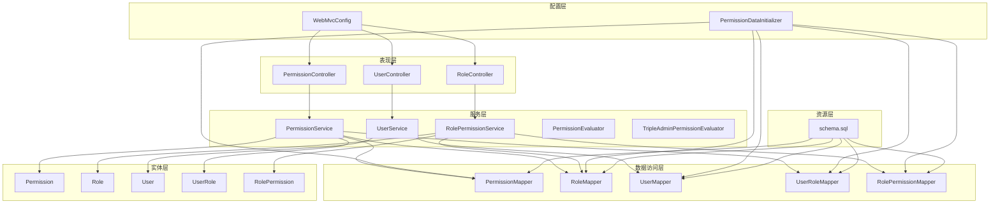
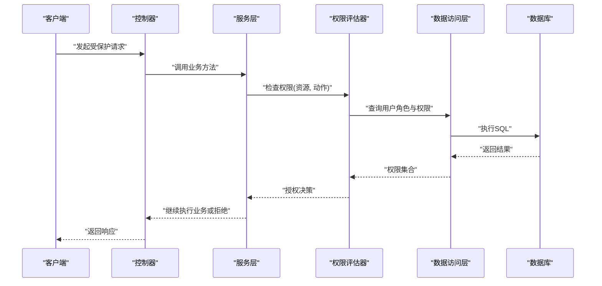
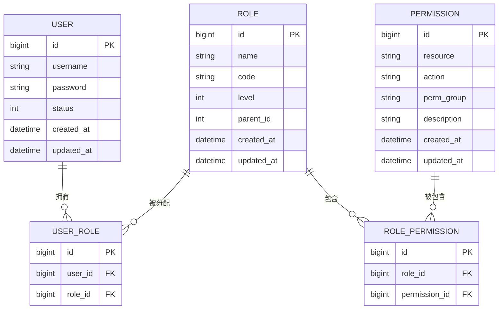
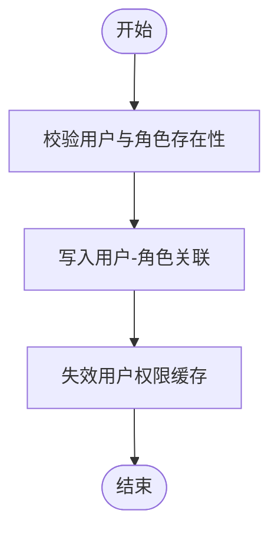
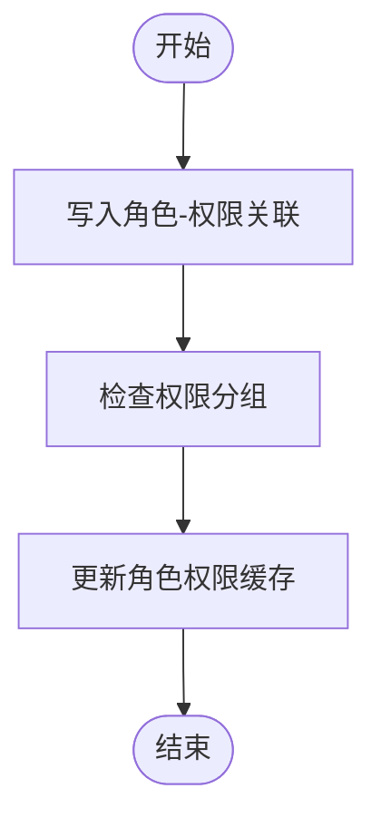
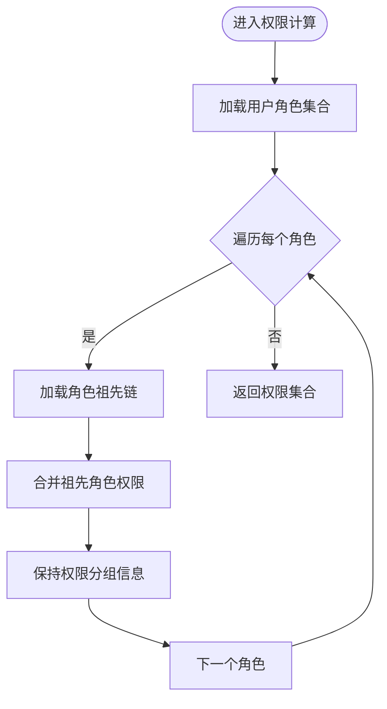
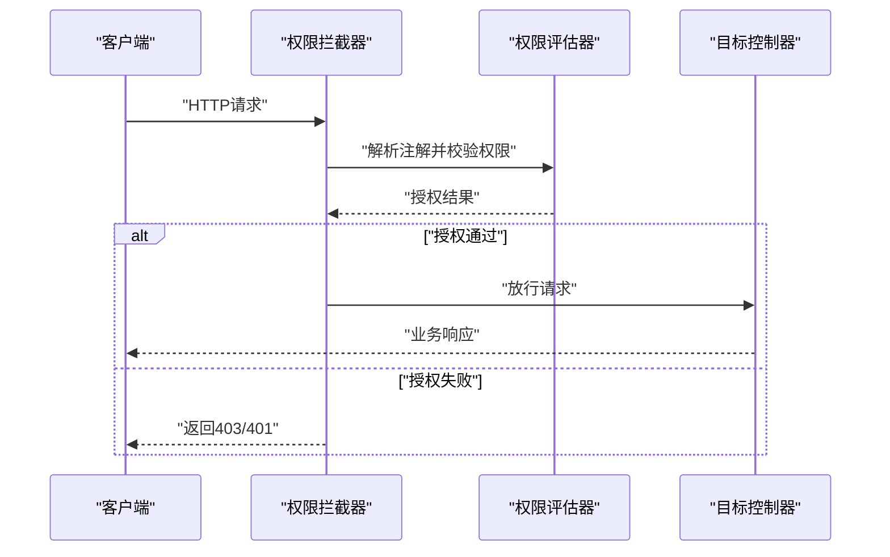
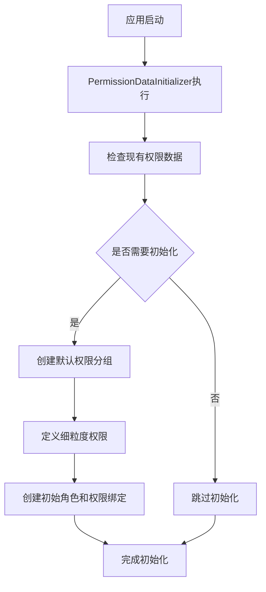
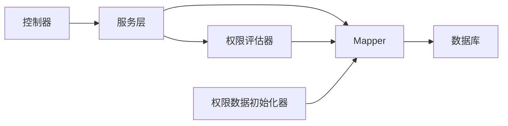

# RBAC权限模型

<cite>
**本文引用的文件**   
- [Permission.java](file://flow-engine/src/main/java/com/flow/engine/entity/Permission.java)
- [Role.java](file://flow-engine/src/main/java/com/flow/engine/entity/Role.java)
- [User.java](file://flow-engine/src/main/java/com/flow/engine/entity/User.java)
- [UserRole.java](file://flow-engine/src/main/java/com/flow/engine/entity/UserRole.java)
- [RolePermission.java](file://flow-engine/src/main/java/com/flow/engine/entity/RolePermission.java)
- [PermissionMapper.java](file://flow-engine/src/main/java/com/flow/engine/mapper/PermissionMapper.java)
- [RoleMapper.java](file://flow-engine/src/main/java/com/flow/engine/mapper/RoleMapper.java)
- [UserMapper.java](file://flow-engine/src/main/java/com/flow/engine/mapper/UserMapper.java)
- [UserRoleMapper.java](file://flow-engine/src/main/java/com/flow/engine/mapper/UserRoleMapper.java)
- [RolePermissionMapper.java](file://flow-engine/src/main/java/com/flow/engine/mapper/RolePermissionMapper.java)
- [PermissionController.java](file://flow-engine/src/main/java/com/flow/engine/controllers/PermissionController.java)
- [RoleController.java](file://flow-engine/src/main/java/com/flow/engine/controllers/RoleController.java)
- [UserController.java](file://flow-engine/src/main/java/com/flow/engine/controllers/UserController.java)
- [PermissionService.java](file://flow-engine/src/main/java/com/flow/engine/service/PermissionService.java)
- [RolePermissionService.java](file://flow-engine/src/main/java/com/flow/engine/service/RolePermissionService.java)
- [UserService.java](file://flow-engine/src/main/java/com/flow/engine/service/UserService.java)
- [PermissionEvaluator.java](file://flow-engine/src/main/java/com/flow/engine/service/PermissionEvaluator.java)
- [TripleAdminPermissionEvaluator.java](file://flow-engine/src/main/java/com/flow/engine/service/TripleAdminPermissionEvaluator.java)
- [WebMvcConfig.java](file://flow-engine/src/main/java/com/flow/engine/config/WebMvcConfig.java)
- [PermissionDataInitializer.java](file://flow-engine/src/main/java/com/flow/engine/config/PermissionDataInitializer.java)
- [schema.sql](file://flow-engine/src/main/resources/db/schema.sql)
</cite>

## 更新摘要
**变更内容**   
- PermissionDataInitializer.java进行了重大更新以支持更细粒度的权限定义
- RolePermissionService.java已增强以支持新的权限模型
- 新增权限分组功能：Permission实体增加permGroup字段支持权限分组管理
- 增强权限查询接口：PermissionController扩展了基于权限组的查询能力
- 更新数据模型：在权限实体中引入分组概念，支持更精细的权限组织
- 改进API设计：提供按权限组筛选和管理的REST接口

## 目录
1. [简介](#简介)
2. [项目结构](#项目结构)
3. [核心组件](#核心组件)
4. [架构总览](#架构总览)
5. [详细组件分析](#详细组件分析)
6. [依赖关系分析](#依赖关系分析)
7. [性能考虑](#性能考虑)
8. [故障排查指南](#故障排查指南)
9. [结论](#结论)
10. [附录](#附录)

## 简介
本技术文档围绕RBAC（基于角色的访问控制）权限模型，系统阐述用户、角色、权限之间的多对多关系设计与实现，包括实体类结构、数据库表关系与关联查询；说明用户与角色的分配机制、角色与权限的绑定关系；描述权限继承机制的实现思路与规则；提供完整的CRUD操作示例路径；给出权限缓存策略与性能优化方案；并说明权限验证拦截器与注解的使用方式。最后结合实际业务场景给出最佳实践建议。

**更新** 本次更新对RBAC权限模型进行了显著增强，PermissionDataInitializer.java进行了重大更新以支持更细粒度的权限定义，RolePermissionService.java已增强以支持新的权限模型。新增了权限分组功能，通过permGroup字段实现对权限的分类管理，提升了权限系统的可维护性和组织性。

## 项目结构
本项目采用分层架构：
- 表现层：控制器负责接收请求与返回响应
- 服务层：封装业务逻辑，协调各Mapper完成数据访问
- 数据访问层：MyBatis-Plus Mapper接口
- 实体层：领域对象映射数据库表
- 配置层：MVC配置、缓存配置、数据初始化等
- 资源层：数据库初始化脚本

图表来源
- [PermissionController.java](file://flow-engine/src/main/java/com/flow/engine/controllers/PermissionController.java)
- [RoleController.java](file://flow-engine/src/main/java/com/flow/engine/controllers/RoleController.java)
- [UserController.java](file://flow-engine/src/main/java/com/flow/engine/controllers/UserController.java)
- [PermissionService.java](file://flow-engine/src/main/java/com/flow/engine/service/PermissionService.java)
- [RolePermissionService.java](file://flow-engine/src/main/java/com/flow/engine/service/RolePermissionService.java)
- [UserService.java](file://flow-engine/src/main/java/com/flow/engine/service/UserService.java)
- [PermissionMapper.java](file://flow-engine/src/main/java/com/flow/engine/mapper/PermissionMapper.java)
- [RoleMapper.java](file://flow-engine/src/main/java/com/flow/engine/mapper/RoleMapper.java)
- [UserMapper.java](file://flow-engine/src/main/java/com/flow/engine/mapper/UserMapper.java)
- [UserRoleMapper.java](file://flow-engine/src/main/java/com/flow/engine/mapper/UserRoleMapper.java)
- [RolePermissionMapper.java](file://flow-engine/src/main/java/com/flow/engine/mapper/RolePermissionMapper.java)
- [Permission.java](file://flow-engine/src/main/java/com/flow/engine/entity/Permission.java)
- [Role.java](file://flow-engine/src/main/java/com/flow/engine/entity/Role.java)
- [User.java](file://flow-engine/src/main/java/com/flow/engine/entity/User.java)
- [UserRole.java](file://flow-engine/src/main/java/com/flow/engine/entity/UserRole.java)
- [RolePermission.java](file://flow-engine/src/main/java/com/flow/engine/entity/RolePermission.java)
- [WebMvcConfig.java](file://flow-engine/src/main/java/com/flow/engine/config/WebMvcConfig.java)
- [PermissionDataInitializer.java](file://flow-engine/src/main/java/com/flow/engine/config/PermissionDataInitializer.java)
- [schema.sql](file://flow-engine/src/main/resources/db/schema.sql)

章节来源
- [PermissionController.java](file://flow-engine/src/main/java/com/flow/engine/controllers/PermissionController.java)
- [RoleController.java](file://flow-engine/src/main/java/com/flow/engine/controllers/RoleController.java)
- [UserController.java](file://flow-engine/src/main/java/com/flow/engine/controllers/UserController.java)
- [PermissionService.java](file://flow-engine/src/main/java/com/flow/engine/service/PermissionService.java)
- [RolePermissionService.java](file://flow-engine/src/main/java/com/flow/engine/service/RolePermissionService.java)
- [UserService.java](file://flow-engine/src/main/java/com/flow/engine/service/UserService.java)
- [PermissionMapper.java](file://flow-engine/src/main/java/com/flow/engine/mapper/PermissionMapper.java)
- [RoleMapper.java](file://flow-engine/src/main/java/com/flow/engine/mapper/RoleMapper.java)
- [UserMapper.java](file://flow-engine/src/main/java/com/flow/engine/mapper/UserMapper.java)
- [UserRoleMapper.java](file://flow-engine/src/main/java/com/flow/engine/mapper/UserRoleMapper.java)
- [RolePermissionMapper.java](file://flow-engine/src/main/java/com/flow/engine/mapper/RolePermissionMapper.java)
- [Permission.java](file://flow-engine/src/main/java/com/flow/engine/entity/Permission.java)
- [Role.java](file://flow-engine/src/main/java/com/flow/engine/entity/Role.java)
- [User.java](file://flow-engine/src/main/java/com/flow/engine/entity/User.java)
- [UserRole.java](file://flow-engine/src/main/java/com/flow/engine/entity/UserRole.java)
- [RolePermission.java](file://flow-engine/src/main/java/com/flow/engine/entity/RolePermission.java)
- [WebMvcConfig.java](file://flow-engine/src/main/java/com/flow/engine/config/WebMvcConfig.java)
- [PermissionDataInitializer.java](file://flow-engine/src/main/java/com/flow/engine/config/PermissionDataInitializer.java)
- [schema.sql](file://flow-engine/src/main/resources/db/schema.sql)

## 核心组件
- 实体层
  - 用户实体：承载用户基本信息与登录态相关字段
  - 角色实体：承载角色标识、名称、层级等信息
  - 权限实体：承载权限标识、资源、动作、分组等元信息
  - 用户-角色中间表：维护用户与角色的多对多关系
  - 角色-权限中间表：维护角色与权限的多对多关系
- 数据访问层
  - 对应实体的Mapper接口，提供基础CRUD与自定义查询方法
- 服务层
  - 权限计算与校验：根据当前用户与其角色集合，计算可用权限集
  - 三员管理员特殊权限评估：在特定场景下赋予更高权限判断能力
  - 用户、角色、权限的业务编排：组合多个Mapper调用完成复杂事务
- 表现层
  - 权限、角色、用户的REST接口，暴露增删改查与分配/绑定操作
- 配置层
  - MVC配置：注册拦截器、全局异常处理、跨域等
  - 数据初始化：系统启动时初始化权限数据和测试数据
- 资源层
  - 数据库初始化脚本：定义表结构与索引

**更新** 权限实体现在支持permGroup字段，允许将权限按功能模块或业务领域进行分组管理，提升了权限的组织性和可维护性。PermissionDataInitializer.java进行了重大更新以支持更细粒度的权限定义，RolePermissionService.java已增强以支持新的权限模型。

章节来源
- [Permission.java](file://flow-engine/src/main/java/com/flow/engine/entity/Permission.java)
- [Role.java](file://flow-engine/src/main/java/com/flow/engine/entity/Role.java)
- [User.java](file://flow-engine/src/main/java/com/flow/engine/entity/User.java)
- [UserRole.java](file://flow-engine/src/main/java/com/flow/engine/entity/UserRole.java)
- [RolePermission.java](file://flow-engine/src/main/java/com/flow/engine/entity/RolePermission.java)
- [PermissionMapper.java](file://flow-engine/src/main/java/com/flow/engine/mapper/PermissionMapper.java)
- [RoleMapper.java](file://flow-engine/src/main/java/com/flow/engine/mapper/RoleMapper.java)
- [UserMapper.java](file://flow-engine/src/main/java/com/flow/engine/mapper/UserMapper.java)
- [UserRoleMapper.java](file://flow-engine/src/main/java/com/flow/engine/mapper/UserRoleMapper.java)
- [RolePermissionMapper.java](file://flow-engine/src/main/java/com/flow/engine/mapper/RolePermissionMapper.java)
- [PermissionService.java](file://flow-engine/src/main/java/com/flow/engine/service/PermissionService.java)
- [RolePermissionService.java](file://flow-engine/src/main/java/com/flow/engine/service/RolePermissionService.java)
- [UserService.java](file://flow-engine/src/main/java/com/flow/engine/service/UserService.java)
- [PermissionEvaluator.java](file://flow-engine/src/main/java/com/flow/engine/service/PermissionEvaluator.java)
- [TripleAdminPermissionEvaluator.java](file://flow-engine/src/main/java/com/flow/engine/service/TripleAdminPermissionEvaluator.java)
- [WebMvcConfig.java](file://flow-engine/src/main/java/com/flow/engine/config/WebMvcConfig.java)
- [PermissionDataInitializer.java](file://flow-engine/src/main/java/com/flow/engine/config/PermissionDataInitializer.java)
- [schema.sql](file://flow-engine/src/main/resources/db/schema.sql)

## 架构总览
下图展示了RBAC在系统中的整体交互流程：请求进入控制器后，由服务层进行权限计算与校验，必要时通过Mapper访问数据库，最终返回授权结果或执行受保护操作。

图表来源
- [PermissionController.java](file://flow-engine/src/main/java/com/flow/engine/controllers/PermissionController.java)
- [RoleController.java](file://flow-engine/src/main/java/com/flow/engine/controllers/RoleController.java)
- [UserController.java](file://flow-engine/src/main/java/com/flow/engine/controllers/UserController.java)
- [PermissionService.java](file://flow-engine/src/main/java/com/flow/engine/service/PermissionService.java)
- [PermissionEvaluator.java](file://flow-engine/src/main/java/com/flow/engine/service/PermissionEvaluator.java)
- [PermissionMapper.java](file://flow-engine/src/main/java/com/flow/engine/mapper/PermissionMapper.java)
- [RoleMapper.java](file://flow-engine/src/main/java/com/flow/engine/mapper/RoleMapper.java)
- [UserMapper.java](file://flow-engine/src/main/java/com/flow/engine/mapper/UserMapper.java)
- [UserRoleMapper.java](file://flow-engine/src/main/java/com/flow/engine/mapper/UserRoleMapper.java)
- [RolePermissionMapper.java](file://flow-engine/src/main/java/com/flow/engine/mapper/RolePermissionMapper.java)

## 详细组件分析

### 实体与数据模型
- 用户-角色-权限多对多关系
  - 用户与角色通过中间表关联
  - 角色与权限通过中间表关联
  - 支持按用户快速聚合其所有权限
- 角色层级与权限继承
  - 角色实体包含层级字段，用于表达父子关系
  - 权限继承规则：子角色自动继承父角色及其祖先角色的全部权限
- 权限维度
  - 资源与动作组合形成细粒度权限标识
  - **新增** 权限分组字段permGroup，支持按功能模块或业务领域组织权限
  - 支持通配符或前缀匹配以简化配置

**更新** 权限实体现在包含permGroup字段，允许将相关权限进行逻辑分组，便于批量管理和权限审计。PermissionDataInitializer.java的重大更新提供了更细粒度的权限定义支持。

图表来源
- [User.java](file://flow-engine/src/main/java/com/flow/engine/entity/User.java)
- [Role.java](file://flow-engine/src/main/java/com/flow/engine/entity/Role.java)
- [Permission.java](file://flow-engine/src/main/java/com/flow/engine/entity/Permission.java)
- [UserRole.java](file://flow-engine/src/main/java/com/flow/engine/entity/UserRole.java)
- [RolePermission.java](file://flow-engine/src/main/java/com/flow/engine/entity/RolePermission.java)
- [schema.sql](file://flow-engine/src/main/resources/db/schema.sql)

章节来源
- [User.java](file://flow-engine/src/main/java/com/flow/engine/entity/User.java)
- [Role.java](file://flow-engine/src/main/java/com/flow/engine/entity/Role.java)
- [Permission.java](file://flow-engine/src/main/java/com/flow/engine/entity/Permission.java)
- [UserRole.java](file://flow-engine/src/main/java/com/flow/engine/entity/UserRole.java)
- [RolePermission.java](file://flow-engine/src/main/java/com/flow/engine/entity/RolePermission.java)
- [schema.sql](file://flow-engine/src/main/resources/db/schema.sql)

### 用户与角色分配机制
- 用户分配角色
  - 通过用户-角色中间表插入记录，建立用户到角色的多对多关系
  - 支持批量分配与去重校验
- 角色变更影响
  - 修改用户角色后，应清理该用户的权限缓存，确保后续鉴权使用最新集合

图表来源
- [UserRoleMapper.java](file://flow-engine/src/main/java/com/flow/engine/mapper/UserRoleMapper.java)
- [UserService.java](file://flow-engine/src/main/java/com/flow/engine/service/UserService.java)

章节来源
- [UserRoleMapper.java](file://flow-engine/src/main/java/com/flow/engine/mapper/UserRoleMapper.java)
- [UserService.java](file://flow-engine/src/main/java/com/flow/engine/service/UserService.java)

### 角色与权限绑定关系
- 角色绑定权限
  - 通过角色-权限中间表插入记录，建立角色到权限的多对多关系
  - 支持批量绑定与幂等处理
- 权限继承生效
  - 当查询某角色的权限时，需递归向上查找父角色并合并权限集合
- **新增** 权限分组管理
  - 支持按权限组进行批量权限分配和管理
  - 提供基于权限组的查询和过滤功能
  - RolePermissionService.java已增强以支持新的权限模型

图表来源
- [RolePermissionMapper.java](file://flow-engine/src/main/java/com/flow/engine/mapper/RolePermissionMapper.java)
- [RolePermissionService.java](file://flow-engine/src/main/java/com/flow/engine/service/RolePermissionService.java)
- [PermissionController.java](file://flow-engine/src/main/java/com/flow/engine/controllers/PermissionController.java)

章节来源
- [RolePermissionMapper.java](file://flow-engine/src/main/java/com/flow/engine/mapper/RolePermissionMapper.java)
- [RolePermissionService.java](file://flow-engine/src/main/java/com/flow/engine/service/RolePermissionService.java)
- [PermissionController.java](file://flow-engine/src/main/java/com/flow/engine/controllers/PermissionController.java)

### 权限继承机制与传递规则
- 角色层级结构
  - 角色实体包含层级与父角色ID，构成树形结构
- 继承规则
  - 子角色自动继承父角色及祖先角色的全部权限
  - 权限计算时需自底向上遍历至根节点，合并权限集合
- 冲突与覆盖
  - 若存在显式拒绝策略，可优先于继承的允许策略
- **新增** 权限分组继承
  - 权限分组信息随权限一起继承，保持分组的完整性

图表来源
- [Role.java](file://flow-engine/src/main/java/com/flow/engine/entity/Role.java)
- [PermissionService.java](file://flow-engine/src/main/java/com/flow/engine/service/PermissionService.java)
- [PermissionMapper.java](file://flow-engine/src/main/java/com/flow/engine/mapper/PermissionMapper.java)
- [RoleMapper.java](file://flow-engine/src/main/java/com/flow/engine/mapper/RoleMapper.java)

章节来源
- [Role.java](file://flow-engine/src/main/java/com/flow/engine/entity/Role.java)
- [PermissionService.java](file://flow-engine/src/main/java/com/flow/engine/service/PermissionService.java)
- [PermissionMapper.java](file://flow-engine/src/main/java/com/flow/engine/mapper/PermissionMapper.java)
- [RoleMapper.java](file://flow-engine/src/main/java/com/flow/engine/mapper/RoleMapper.java)

### CRUD操作示例（路径指引）
- 用户管理
  - 新增用户：[UserController.java](file://flow-engine/src/main/java/com/flow/engine/controllers/UserController.java)
  - 更新用户：[UserController.java](file://flow-engine/src/main/java/com/flow/engine/controllers/UserController.java)
  - 删除用户：[UserController.java](file://flow-engine/src/main/java/com/flow/engine/controllers/UserController.java)
  - 查询用户列表/详情：[UserController.java](file://flow-engine/src/main/java/com/flow/engine/controllers/UserController.java)
  - 用户分配角色：[UserService.java](file://flow-engine/src/main/java/com/flow/engine/service/UserService.java)、[UserRoleMapper.java](file://flow-engine/src/main/java/com/flow/engine/mapper/UserRoleMapper.java)
- 角色配置
  - 新增角色：[RoleController.java](file://flow-engine/src/main/java/com/flow/engine/controllers/RoleController.java)
  - 更新角色：[RoleController.java](file://flow-engine/src/main/java/com/flow/engine/controllers/RoleController.java)
  - 删除角色：[RoleController.java](file://flow-engine/src/main/java/com/flow/engine/controllers/RoleController.java)
  - 查询角色列表/详情：[RoleController.java](file://flow-engine/src/main/java/com/flow/engine/controllers/RoleController.java)
  - 角色绑定权限：[RolePermissionService.java](file://flow-engine/src/main/java/com/flow/engine/service/RolePermissionService.java)、[RolePermissionMapper.java](file://flow-engine/src/main/java/com/flow/engine/mapper/RolePermissionMapper.java)
- 权限管理
  - 新增权限：[PermissionController.java](file://flow-engine/src/main/java/com/flow/engine/controllers/PermissionController.java)
  - 更新权限：[PermissionController.java](file://flow-engine/src/main/java/com/flow/engine/controllers/PermissionController.java)
  - 删除权限：[PermissionController.java](file://flow-engine/src/main/java/com/flow/engine/controllers/PermissionController.java)
  - 查询权限列表/详情：[PermissionController.java](file://flow-engine/src/main/java/com/flow/engine/controllers/PermissionController.java)
  - **新增** 按权限组查询：[PermissionController.java](file://flow-engine/src/main/java/com/flow/engine/controllers/PermissionController.java)
  - **新增** 权限组管理接口：[PermissionController.java](file://flow-engine/src/main/java/com/flow/engine/controllers/PermissionController.java)
  - **新增** 细粒度权限定义：[PermissionDataInitializer.java](file://flow-engine/src/main/java/com/flow/engine/config/PermissionDataInitializer.java)

**更新** 权限管理功能现已增强，支持基于权限组的查询和管理操作，提供更灵活的权限组织方式。PermissionDataInitializer.java的重大更新为系统提供了更细粒度的权限定义支持。

章节来源
- [UserController.java](file://flow-engine/src/main/java/com/flow/engine/controllers/UserController.java)
- [RoleController.java](file://flow-engine/src/main/java/com/flow/engine/controllers/RoleController.java)
- [PermissionController.java](file://flow-engine/src/main/java/com/flow/engine/controllers/PermissionController.java)
- [UserService.java](file://flow-engine/src/main/java/com/flow/engine/service/UserService.java)
- [RolePermissionService.java](file://flow-engine/src/main/java/com/flow/engine/service/RolePermissionService.java)
- [UserRoleMapper.java](file://flow-engine/src/main/java/com/flow/engine/mapper/UserRoleMapper.java)
- [RolePermissionMapper.java](file://flow-engine/src/main/java/com/flow/engine/mapper/RolePermissionMapper.java)
- [PermissionDataInitializer.java](file://flow-engine/src/main/java/com/flow/engine/config/PermissionDataInitializer.java)

### 权限验证拦截器与注解
- 拦截器
  - 在MVC配置中注册权限拦截器，统一在请求到达控制器前进行鉴权
  - 可从请求上下文获取当前用户，结合权限评估器进行判定
- 注解使用
  - 在需要保护的控制器方法上标注权限注解，指定所需资源与动作
  - 未通过鉴权的请求将被拒绝并返回标准错误码
- 三员管理员特殊策略
  - 针对特定管理员角色，提供独立的权限评估实现，支持更严格的审计与隔离

图表来源
- [WebMvcConfig.java](file://flow-engine/src/main/java/com/flow/engine/config/WebMvcConfig.java)
- [PermissionEvaluator.java](file://flow-engine/src/main/java/com/flow/engine/service/PermissionEvaluator.java)
- [TripleAdminPermissionEvaluator.java](file://flow-engine/src/main/java/com/flow/engine/service/TripleAdminPermissionEvaluator.java)

章节来源
- [WebMvcConfig.java](file://flow-engine/src/main/java/com/flow/engine/config/WebMvcConfig.java)
- [PermissionEvaluator.java](file://flow-engine/src/main/java/com/flow/engine/service/PermissionEvaluator.java)
- [TripleAdminPermissionEvaluator.java](file://flow-engine/src/main/java/com/flow/engine/service/TripleAdminPermissionEvaluator.java)

### 实际业务场景与最佳实践
- 典型场景
  - 后台管理系统：管理员对用户、角色、权限进行集中管理
  - 流程引擎：任务节点审批人依据角色与权限动态生成待办
  - 表单权限：不同角色对同一表单具备不同的可见与编辑范围
  - **新增** 模块化权限管理：按业务模块组织权限，便于大型系统的权限治理
  - **新增** 细粒度权限控制：通过PermissionDataInitializer提供的细粒度权限定义，实现更精确的访问控制
- 最佳实践
  - 将权限标识设计为"资源:动作"形式，便于前端按钮级控制
  - 角色层级不宜过深，避免权限计算开销过大
  - 对高频鉴权路径引入缓存，降低数据库压力
  - 变更用户角色或角色权限后，及时失效相关缓存
  - 使用唯一约束与幂等写入，防止重复分配与绑定
  - **新增** 合理使用权限分组，将相关权限归类管理，提升可维护性
  - **新增** 在设计权限分组时考虑业务边界，避免过度拆分导致管理复杂度增加
  - **新增** 利用PermissionDataInitializer提供的细粒度权限定义，确保权限模型的完整性和一致性

**更新** 新增权限分组功能和细粒度权限定义的最佳实践建议，帮助开发者更好地利用新的特性来组织和管理权限。

### 权限数据初始化机制
- 系统启动时的权限数据初始化
  - PermissionDataInitializer在应用启动时自动执行
  - 提供默认的细粒度权限定义和初始数据
  - 支持权限分组的预定义和批量创建
- 权限数据版本管理
  - 支持权限数据的版本控制和升级
  - 确保权限模型演进时的数据一致性
- 测试环境支持
  - 为开发测试提供完整的权限数据环境
  - 支持快速搭建测试场景

图表来源
- [PermissionDataInitializer.java](file://flow-engine/src/main/java/com/flow/engine/config/PermissionDataInitializer.java)

章节来源
- [PermissionDataInitializer.java](file://flow-engine/src/main/java/com/flow/engine/config/PermissionDataInitializer.java)

## 依赖关系分析
- 组件耦合
  - 控制器依赖服务层，服务层依赖Mapper与评估器
  - 评估器依赖Mapper读取用户角色与权限
  - 数据初始化器依赖所有Mapper进行数据准备
- 外部依赖
  - MyBatis-Plus作为ORM框架
  - 缓存组件（如Redis）用于存储用户权限集合与角色权限集合
- 潜在循环依赖
  - 服务层之间应避免相互注入，必要时通过事件或消息解耦

图表来源
- [PermissionController.java](file://flow-engine/src/main/java/com/flow/engine/controllers/PermissionController.java)
- [RoleController.java](file://flow-engine/src/main/java/com/flow/engine/controllers/RoleController.java)
- [UserController.java](file://flow-engine/src/main/java/com/flow/engine/controllers/UserController.java)
- [PermissionService.java](file://flow-engine/src/main/java/com/flow/engine/service/PermissionService.java)
- [RolePermissionService.java](file://flow-engine/src/main/java/com/flow/engine/service/RolePermissionService.java)
- [UserService.java](file://flow-engine/src/main/java/com/flow/engine/service/UserService.java)
- [PermissionMapper.java](file://flow-engine/src/main/java/com/flow/engine/mapper/PermissionMapper.java)
- [RoleMapper.java](file://flow-engine/src/main/java/com/flow/engine/mapper/RoleMapper.java)
- [UserMapper.java](file://flow-engine/src/main/java/com/flow/engine/mapper/UserMapper.java)
- [UserRoleMapper.java](file://flow-engine/src/main/java/com/flow/engine/mapper/UserRoleMapper.java)
- [RolePermissionMapper.java](file://flow-engine/src/main/java/com/flow/engine/mapper/RolePermissionMapper.java)
- [PermissionDataInitializer.java](file://flow-engine/src/main/java/com/flow/engine/config/PermissionDataInitializer.java)

章节来源
- [PermissionController.java](file://flow-engine/src/main/java/com/flow/engine/controllers/PermissionController.java)
- [RoleController.java](file://flow-engine/src/main/java/com/flow/engine/controllers/RoleController.java)
- [UserController.java](file://flow-engine/src/main/java/com/flow/engine/controllers/UserController.java)
- [PermissionService.java](file://flow-engine/src/main/java/com/flow/engine/service/PermissionService.java)
- [RolePermissionService.java](file://flow-engine/src/main/java/com/flow/engine/service/RolePermissionService.java)
- [UserService.java](file://flow-engine/src/main/java/com/flow/engine/service/UserService.java)
- [PermissionMapper.java](file://flow-engine/src/main/java/com/flow/engine/mapper/PermissionMapper.java)
- [RoleMapper.java](file://flow-engine/src/main/java/com/flow/engine/mapper/RoleMapper.java)
- [UserMapper.java](file://flow-engine/src/main/java/com/flow/engine/mapper/UserMapper.java)
- [UserRoleMapper.java](file://flow-engine/src/main/java/com/flow/engine/mapper/UserRoleMapper.java)
- [RolePermissionMapper.java](file://flow-engine/src/main/java/com/flow/engine/mapper/RolePermissionMapper.java)
- [PermissionDataInitializer.java](file://flow-engine/src/main/java/com/flow/engine/config/PermissionDataInitializer.java)

## 性能考虑
- 缓存策略
  - 用户权限缓存：以用户ID为键，存储其所有权限集合，设置合理过期时间
  - 角色权限缓存：以角色ID为键，存储其直接权限集合；继承权限在计算时合并
  - 缓存失效：在用户角色变更、角色权限变更时主动失效相关缓存
  - **新增** 权限分组缓存：可按权限组维度缓存权限集合，提高分组查询性能
- 查询优化
  - 使用批量查询减少往返次数
  - 为常用查询字段建立索引（如用户ID、角色ID、权限ID、权限分组）
  - **新增** 为permGroup字段建立索引，优化按分组查询的性能
- 计算优化
  - 预计算并缓存角色祖先链，避免每次递归查询
  - 对频繁鉴权的热点资源进行局部缓存
  - **新增** 缓存权限分组映射关系，减少分组信息的重复计算
- 初始化优化
  - **新增** PermissionDataInitializer的执行时机优化，避免阻塞应用启动
  - **新增** 权限数据的增量更新机制，减少不必要的重复初始化

**更新** 新增权限分组相关的性能优化策略，包括分组索引和缓存机制，确保新功能不会影响系统性能。PermissionDataInitializer的优化确保了系统启动性能。

## 故障排查指南
- 常见问题
  - 权限未生效：检查是否已正确分配用户角色与角色权限，确认缓存是否失效
  - 鉴权失败：检查权限注解是否正确标注，资源与动作是否与权限实体一致
  - 性能问题：关注慢查询日志，检查是否存在N+1查询或缺少索引
  - **新增** 权限分组查询异常：检查permGroup字段值是否正确，确认分组索引是否建立
  - **新增** 权限初始化失败：检查PermissionDataInitializer的执行日志，确认数据库连接和权限定义
- 定位步骤
  - 查看请求链路日志，确认拦截器是否触发
  - 核对权限评估器的决策分支与返回值
  - 检查数据库表关联数据完整性与唯一约束
  - **新增** 验证权限分组数据的完整性和一致性
  - **新增** 检查权限数据初始化过程，确认细粒度权限定义的正确性

**更新** 新增权限分组和权限初始化相关的故障排查指南，帮助开发者快速定位和解决相关问题。

章节来源
- [PermissionEvaluator.java](file://flow-engine/src/main/java/com/flow/engine/service/PermissionEvaluator.java)
- [WebMvcConfig.java](file://flow-engine/src/main/java/com/flow/engine/config/WebMvcConfig.java)
- [PermissionController.java](file://flow-engine/src/main/java/com/flow/engine/controllers/PermissionController.java)
- [PermissionDataInitializer.java](file://flow-engine/src/main/java/com/flow/engine/config/PermissionDataInitializer.java)

## 结论
本RBAC模型通过清晰的用户-角色-权限多对多关系与角色层级继承机制，实现了灵活且可扩展的权限控制。配合拦截器与注解，可在应用层统一实施鉴权。通过合理的缓存策略与查询优化，能够满足高并发场景下的性能要求。

**更新** 本次更新对RBAC权限模型进行了显著增强，PermissionDataInitializer.java的重大更新提供了更细粒度的权限定义支持，RolePermissionService.java的增强提升了权限模型的灵活性。新增的权限分组功能进一步增强了系统的可维护性和组织性，使得大型系统的权限管理更加清晰和高效。建议在业务实践中持续完善权限标识规范与审计机制，保障系统安全与可维护性。

## 附录
- 术语
  - 资源：系统中可被访问的对象（如页面、菜单、API）
  - 动作：对资源的操作（如查看、编辑、删除）
  - 角色：一组权限的集合，代表一种职责
  - 权限：资源与动作的组合，表示最小授权单元
  - **新增** 权限分组：对权限进行逻辑分类的标识，便于批量管理和组织
  - **新增** 细粒度权限：通过PermissionDataInitializer定义的精确权限控制单元
- 参考实现路径
  - 实体与表结构：见实体类与schema.sql
  - 控制器与服务：见controllers与service包
  - 数据访问：见mapper包
  - 鉴权与配置：见config与evaluator相关类
  - **新增** 权限分组功能：重点关注Permission实体的permGroup字段和相关查询接口
  - **新增** 权限数据初始化：重点关注PermissionDataInitializer.java中的细粒度权限定义

**更新** 新增权限分组和细粒度权限定义相关的术语解释和参考实现路径，帮助开发者更好地理解和使用新功能。