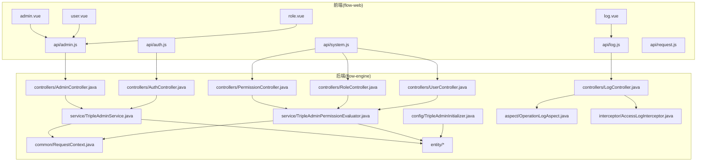
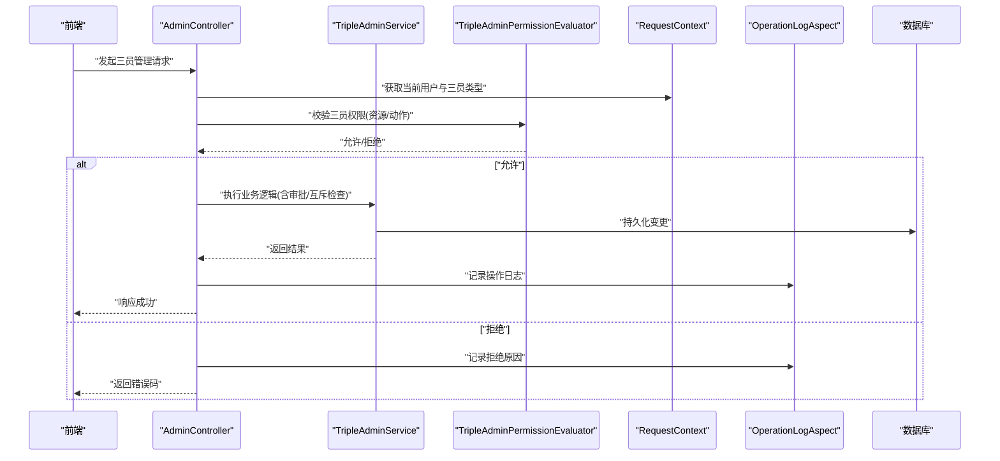
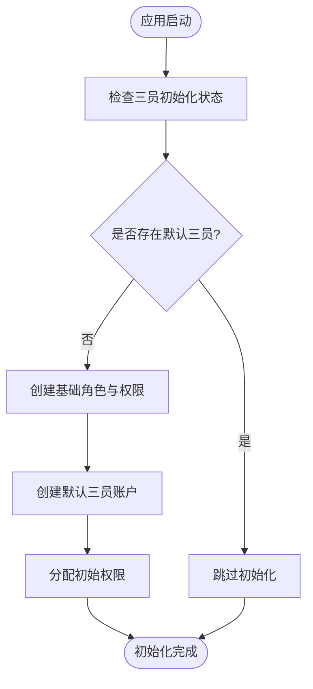
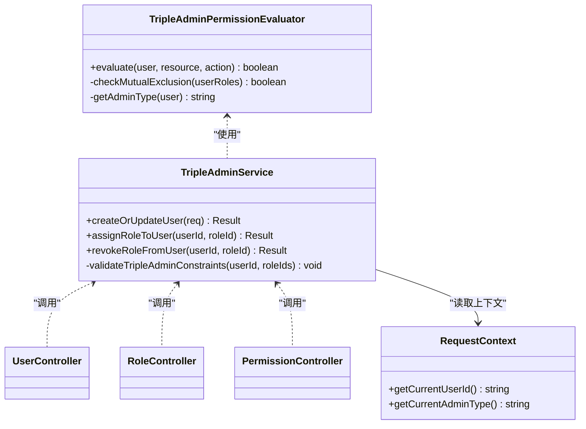
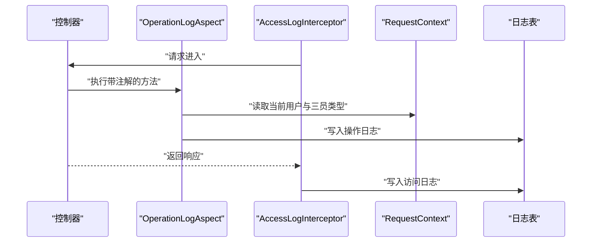
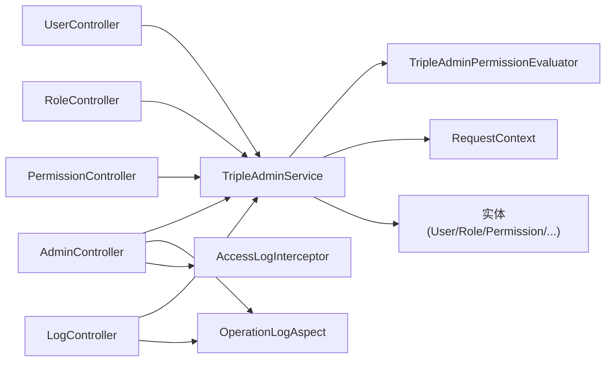

# 三员管理体系

<cite>
**本文引用的文件**   
- [TripleAdminInitializer.java](file://flow-engine/src/main/java/com/flow/engine/config/TripleAdminInitializer.java)
- [TripleAdminService.java](file://flow-engine/src/main/java/com/flow/engine/service/TripleAdminService.java)
- [TripleAdminPermissionEvaluator.java](file://flow-engine/src/main/java/com/flow/engine/service/TripleAdminPermissionEvaluator.java)
- [AdminController.java](file://flow-engine/src/main/java/com/flow/engine/controllers/AdminController.java)
- [AuthController.java](file://flow-engine/src/main/java/com/flow/engine/controllers/AuthController.java)
- [PermissionController.java](file://flow-engine/src/main/java/com/flow/engine/controllers/PermissionController.java)
- [RoleController.java](file://flow-engine/src/main/java/com/flow/engine/controllers/RoleController.java)
- [UserController.java](file://flow-engine/src/main/java/com/flow/engine/controllers/UserController.java)
- [LogController.java](file://flow-engine/src/main/java/com/flow/engine/controllers/LogController.java)
- [OperationLogAspect.java](file://flow-engine/src/main/java/com/flow/engine/aspect/OperationLogAspect.java)
- [OpLog.java](file://flow-engine/src/main/java/com/flow/engine/annotation/OpLog.java)
- [AccessLogInterceptor.java](file://flow-engine/src/main/java/com/flow/engine/interceptor/AccessLogInterceptor.java)
- [RequestContext.java](file://flow-engine/src/main/java/com/flow/engine/common/RequestContext.java)
- [Result.java](file://flow-engine/src/main/java/com/flow/engine/common/Result.java)
- [ErrorCode.java](file://flow-engine/src/main/java/com/flow/engine/common/ErrorCode.java)
- [GlobalExceptionHandler.java](file://flow-engine/src/main/java/com/flow/engine/common/GlobalExceptionHandler.java)
- [User.java](file://flow-engine/src/main/java/com/flow/engine/entity/User.java)
- [Role.java](file://flow-engine/src/main/java/com/flow/engine/entity/Role.java)
- [Permission.java](file://flow-engine/src/main/java/com/flow/engine/entity/Permission.java)
- [UserRole.java](file://flow-engine/src/main/java/com/flow/engine/entity/UserRole.java)
- [RolePermission.java](file://flow-engine/src/main/java/com/flow/engine/entity/RolePermission.java)
- [OperationLog.java](file://flow-engine/src/main/java/com/flow/engine/entity/OperationLog.java)
- [AccessLog.java](file://flow-engine/src/main/java/com/flow/engine/entity/AccessLog.java)
- [schema.sql](file://flow-engine/src/main/resources/db/schema.sql)
- [application.yml](file://flow-engine/src/main/resources/application.yml)
- [admin.vue](file://flow-web/src/views/system/admin.vue)
- [user.vue](file://flow-web/src/views/system/user.vue)
- [role.vue](file://flow-web/src/views/system/role.vue)
- [log.vue](file://flow-web/src/views/system/log.vue)
- [admin.js](file://flow-web/src/api/admin.js)
- [auth.js](file://flow-web/src/api/auth.js)
- [system.js](file://flow-web/src/api/system.js)
- [log.js](file://flow-web/src/api/log.js)
- [request.js](file://flow-web/src/api/request.js)
</cite>

## 目录
1. [引言](#引言)
2. [项目结构](#项目结构)
3. [核心组件](#核心组件)
4. [架构总览](#架构总览)
5. [详细组件分析](#详细组件分析)
6. [依赖关系分析](#依赖关系分析)
7. [性能考虑](#性能考虑)
8. [故障排查指南](#故障排查指南)
9. [结论](#结论)
10. [附录](#附录)

## 引言
本技术文档围绕“三员管理体系”展开，聚焦系统管理员、安全管理员、审计管理员三类角色的职责分离与安全控制。内容涵盖：
- 角色职责与权限边界
- 初始化流程（默认账户创建、权限分配、初始配置）
- 制衡机制（操作审批、权限互斥、审计追踪）
- API 接口说明（用户管理、角色分配、权限配置）
- 日志记录与审计能力
- 安全策略与防绕过措施
- 前端界面操作指南与常见问题处理

## 项目结构
本项目采用前后端分离架构：
- 后端服务位于 flow-engine，提供三员管理的业务逻辑、权限评估、审计日志等能力
- 前端应用位于 flow-web，提供三员管理相关的页面与交互

图表来源
- [admin.vue:1-200](file://flow-web/src/views/system/admin.vue#L1-L200)
- [user.vue:1-200](file://flow-web/src/views/system/user.vue#L1-L200)
- [role.vue:1-200](file://flow-web/src/views/system/role.vue#L1-L200)
- [log.vue:1-200](file://flow-web/src/views/system/log.vue#L1-L200)
- [admin.js:1-200](file://flow-web/src/api/admin.js#L1-L200)
- [auth.js:1-200](file://flow-web/src/api/auth.js#L1-L200)
- [system.js:1-200](file://flow-web/src/api/system.js#L1-L200)
- [log.js:1-200](file://flow-web/src/api/log.js#L1-L200)
- [request.js:1-200](file://flow-web/src/api/request.js#L1-L200)
- [AdminController.java:1-200](file://flow-engine/src/main/java/com/flow/engine/controllers/AdminController.java#L1-L200)
- [AuthController.java:1-200](file://flow-engine/src/main/java/com/flow/engine/controllers/AuthController.java#L1-L200)
- [PermissionController.java:1-200](file://flow-engine/src/main/java/com/flow/engine/controllers/PermissionController.java#L1-L200)
- [RoleController.java:1-200](file://flow-engine/src/main/java/com/flow/engine/controllers/RoleController.java#L1-L200)
- [UserController.java:1-200](file://flow-engine/src/main/java/com/flow/engine/controllers/UserController.java#L1-L200)
- [LogController.java:1-200](file://flow-engine/src/main/java/com/flow/engine/controllers/LogController.java#L1-L200)
- [TripleAdminService.java:1-200](file://flow-engine/src/main/java/com/flow/engine/service/TripleAdminService.java#L1-L200)
- [TripleAdminPermissionEvaluator.java:1-200](file://flow-engine/src/main/java/com/flow/engine/service/TripleAdminPermissionEvaluator.java#L1-L200)
- [TripleAdminInitializer.java:1-200](file://flow-engine/src/main/java/com/flow/engine/config/TripleAdminInitializer.java#L1-L200)
- [OperationLogAspect.java:1-200](file://flow-engine/src/main/java/com/flow/engine/aspect/OperationLogAspect.java#L1-L200)
- [AccessLogInterceptor.java:1-200](file://flow-engine/src/main/java/com/flow/engine/interceptor/AccessLogInterceptor.java#L1-L200)
- [RequestContext.java:1-200](file://flow-engine/src/main/java/com/flow/engine/common/RequestContext.java#L1-L200)

章节来源
- [TripleAdminInitializer.java:1-200](file://flow-engine/src/main/java/com/flow/engine/config/TripleAdminInitializer.java#L1-L200)
- [TripleAdminService.java:1-200](file://flow-engine/src/main/java/com/flow/engine/service/TripleAdminService.java#L1-L200)
- [TripleAdminPermissionEvaluator.java:1-200](file://flow-engine/src/main/java/com/flow/engine/service/TripleAdminPermissionEvaluator.java#L1-L200)
- [AdminController.java:1-200](file://flow-engine/src/main/java/com/flow/engine/controllers/AdminController.java#L1-L200)
- [AuthController.java:1-200](file://flow-engine/src/main/java/com/flow/engine/controllers/AuthController.java#L1-L200)
- [PermissionController.java:1-200](file://flow-engine/src/main/java/com/flow/engine/controllers/PermissionController.java#L1-L200)
- [RoleController.java:1-200](file://flow-engine/src/main/java/com/flow/engine/controllers/RoleController.java#L1-L200)
- [UserController.java:1-200](file://flow-engine/src/main/java/com/flow/engine/controllers/UserController.java#L1-L200)
- [LogController.java:1-200](file://flow-engine/src/main/java/com/flow/engine/controllers/LogController.java#L1-L200)
- [OperationLogAspect.java:1-200](file://flow-engine/src/main/java/com/flow/engine/aspect/OperationLogAspect.java#L1-L200)
- [AccessLogInterceptor.java:1-200](file://flow-engine/src/main/java/com/flow/engine/interceptor/AccessLogInterceptor.java#L1-L200)
- [RequestContext.java:1-200](file://flow-engine/src/main/java/com/flow/engine/common/RequestContext.java#L1-L200)
- [schema.sql:1-200](file://flow-engine/src/main/resources/db/schema.sql#L1-L200)
- [application.yml:1-200](file://flow-engine/src/main/resources/application.yml#L1-L200)

## 核心组件
- 三员初始化器：负责启动时创建默认三员账户、基础角色与权限，并建立最小化授权关系
- 三员服务：封装三员相关的关键业务规则，包括角色互斥、敏感操作校验、审批流触发点
- 三员权限评估器：在访问控制层对当前登录用户的三员身份进行判定，决定是否允许执行目标操作
- 控制器层：暴露用户、角色、权限、日志等管理接口，并在关键路径上调用服务与评估器
- 审计与日志：通过注解切面与拦截器采集操作上下文，持久化到操作日志与访问日志实体
- 请求上下文：贯穿请求生命周期，携带当前用户、三员类型、会话信息等

章节来源
- [TripleAdminInitializer.java:1-200](file://flow-engine/src/main/java/com/flow/engine/config/TripleAdminInitializer.java#L1-L200)
- [TripleAdminService.java:1-200](file://flow-engine/src/main/java/com/flow/engine/service/TripleAdminService.java#L1-L200)
- [TripleAdminPermissionEvaluator.java:1-200](file://flow-engine/src/main/java/com/flow/engine/service/TripleAdminPermissionEvaluator.java#L1-L200)
- [OperationLogAspect.java:1-200](file://flow-engine/src/main/java/com/flow/engine/aspect/OperationLogAspect.java#L1-L200)
- [AccessLogInterceptor.java:1-200](file://flow-engine/src/main/java/com/flow/engine/interceptor/AccessLogInterceptor.java#L1-L200)
- [RequestContext.java:1-200](file://flow-engine/src/main/java/com/flow/engine/common/RequestContext.java#L1-L200)

## 架构总览
三员体系在权限评估与服务编排两个层面实现职责分离与制衡：
- 权限评估器基于当前登录用户的三员类型与目标资源/动作进行决策
- 服务层在三员敏感操作中引入审批或二次确认，避免单点越权
- 日志与审计贯穿全链路，确保可追溯

图表来源
- [AdminController.java:1-200](file://flow-engine/src/main/java/com/flow/engine/controllers/AdminController.java#L1-L200)
- [TripleAdminService.java:1-200](file://flow-engine/src/main/java/com/flow/engine/service/TripleAdminService.java#L1-L200)
- [TripleAdminPermissionEvaluator.java:1-200](file://flow-engine/src/main/java/com/flow/engine/service/TripleAdminPermissionEvaluator.java#L1-L200)
- [RequestContext.java:1-200](file://flow-engine/src/main/java/com/flow/engine/common/RequestContext.java#L1-L200)
- [OperationLogAspect.java:1-200](file://flow-engine/src/main/java/com/flow/engine/aspect/OperationLogAspect.java#L1-L200)

## 详细组件分析

### 三员角色与职责
- 系统管理员：负责系统运行维护、资源配置、流程与数据模型管理等非安全敏感操作
- 安全管理员：负责账号与权限策略、密码策略、访问控制策略等安全相关配置
- 审计管理员：负责查看与导出审计日志、监督其他两员的合规性，不参与业务配置

职责分离原则：
- 权限互斥：同一用户不得同时拥有相互冲突的三员角色
- 最小授权：仅授予完成工作所需的最小权限集合
- 审计覆盖：所有敏感操作均被记录并可追溯

章节来源
- [TripleAdminService.java:1-200](file://flow-engine/src/main/java/com/flow/engine/service/TripleAdminService.java#L1-L200)
- [TripleAdminPermissionEvaluator.java:1-200](file://flow-engine/src/main/java/com/flow/engine/service/TripleAdminPermissionEvaluator.java#L1-L200)
- [User.java:1-200](file://flow-engine/src/main/java/com/flow/engine/entity/User.java#L1-L200)
- [Role.java:1-200](file://flow-engine/src/main/java/com/flow/engine/entity/Role.java#L1-L200)
- [Permission.java:1-200](file://flow-engine/src/main/java/com/flow/engine/entity/Permission.java#L1-L200)
- [UserRole.java:1-200](file://flow-engine/src/main/java/com/flow/engine/entity/UserRole.java#L1-L200)
- [RolePermission.java:1-200](file://flow-engine/src/main/java/com/flow/engine/entity/RolePermission.java#L1-L200)

### 初始化流程
- 启动阶段由初始化器创建默认三员账户与基础角色、权限，并建立初始授权关系
- 若已存在对应三员账户则跳过创建，保证幂等
- 初始化完成后，系统进入受控状态，后续变更需遵循三员互斥与审计要求

图表来源
- [TripleAdminInitializer.java:1-200](file://flow-engine/src/main/java/com/flow/engine/config/TripleAdminInitializer.java#L1-L200)
- [schema.sql:1-200](file://flow-engine/src/main/resources/db/schema.sql#L1-L200)

章节来源
- [TripleAdminInitializer.java:1-200](file://flow-engine/src/main/java/com/flow/engine/config/TripleAdminInitializer.java#L1-L200)
- [schema.sql:1-200](file://flow-engine/src/main/resources/db/schema.sql#L1-L200)

### 权限评估与互斥
- 权限评估器根据当前用户的三员类型与目标资源/动作进行判断
- 服务层在执行敏感操作前进行互斥校验，防止越权
- 对于高风险操作，可引入审批节点或二次确认

图表来源
- [TripleAdminPermissionEvaluator.java:1-200](file://flow-engine/src/main/java/com/flow/engine/service/TripleAdminPermissionEvaluator.java#L1-L200)
- [TripleAdminService.java:1-200](file://flow-engine/src/main/java/com/flow/engine/service/TripleAdminService.java#L1-L200)
- [RequestContext.java:1-200](file://flow-engine/src/main/java/com/flow/engine/common/RequestContext.java#L1-L200)
- [UserController.java:1-200](file://flow-engine/src/main/java/com/flow/engine/controllers/UserController.java#L1-L200)
- [RoleController.java:1-200](file://flow-engine/src/main/java/com/flow/engine/controllers/RoleController.java#L1-L200)
- [PermissionController.java:1-200](file://flow-engine/src/main/java/com/flow/engine/controllers/PermissionController.java#L1-L200)

章节来源
- [TripleAdminPermissionEvaluator.java:1-200](file://flow-engine/src/main/java/com/flow/engine/service/TripleAdminPermissionEvaluator.java#L1-L200)
- [TripleAdminService.java:1-200](file://flow-engine/src/main/java/com/flow/engine/service/TripleAdminService.java#L1-L200)
- [RequestContext.java:1-200](file://flow-engine/src/main/java/com/flow/engine/common/RequestContext.java#L1-L200)

### 审计与日志
- 操作日志：通过注解切面捕获关键方法入参、出参与异常信息，写入操作日志实体
- 访问日志：通过拦截器记录HTTP请求元数据，便于追踪访问行为
- 审计管理员可查询与导出日志，形成闭环监督

图表来源
- [OperationLogAspect.java:1-200](file://flow-engine/src/main/java/com/flow/engine/aspect/OperationLogAspect.java#L1-L200)
- [AccessLogInterceptor.java:1-200](file://flow-engine/src/main/java/com/flow/engine/interceptor/AccessLogInterceptor.java#L1-L200)
- [RequestContext.java:1-200](file://flow-engine/src/main/java/com/flow/engine/common/RequestContext.java#L1-L200)
- [OperationLog.java:1-200](file://flow-engine/src/main/java/com/flow/engine/entity/OperationLog.java#L1-L200)
- [AccessLog.java:1-200](file://flow-engine/src/main/java/com/flow/engine/entity/AccessLog.java#L1-L200)

章节来源
- [OperationLogAspect.java:1-200](file://flow-engine/src/main/java/com/flow/engine/aspect/OperationLogAspect.java#L1-L200)
- [AccessLogInterceptor.java:1-200](file://flow-engine/src/main/java/com/flow/engine/interceptor/AccessLogInterceptor.java#L1-L200)
- [OperationLog.java:1-200](file://flow-engine/src/main/java/com/flow/engine/entity/OperationLog.java#L1-L200)
- [AccessLog.java:1-200](file://flow-engine/src/main/java/com/flow/engine/entity/AccessLog.java#L1-L200)

### API 接口说明
以下接口用于三员管理的前后端交互，具体参数与返回结构请参考各控制器与服务定义。

- 用户管理
  - 新增/更新用户：POST /api/users
  - 删除用户：DELETE /api/users/{id}
  - 查询用户列表：GET /api/users
  - 查询用户详情：GET /api/users/{id}
  - 重置密码：PUT /api/users/{id}/password
- 角色管理
  - 新增/更新角色：POST /api/roles
  - 删除角色：DELETE /api/roles/{id}
  - 查询角色列表：GET /api/roles
  - 查询角色详情：GET /api/roles/{id}
- 权限管理
  - 新增/更新权限：POST /api/permissions
  - 删除权限：DELETE /api/permissions/{id}
  - 查询权限列表：GET /api/permissions
  - 查询权限详情：GET /api/permissions/{id}
- 用户-角色分配
  - 为用户分配角色：POST /api/users/{userId}/roles
  - 撤销用户角色：DELETE /api/users/{userId}/roles/{roleId}
  - 查询用户角色：GET /api/users/{userId}/roles
- 审计日志
  - 查询操作日志：GET /api/logs/operation
  - 查询访问日志：GET /api/logs/access
  - 导出日志：POST /api/logs/export

注意：
- 所有写操作均需通过三员权限评估与审计记录
- 敏感操作可能触发审批或二次确认流程

章节来源
- [UserController.java:1-200](file://flow-engine/src/main/java/com/flow/engine/controllers/UserController.java#L1-L200)
- [RoleController.java:1-200](file://flow-engine/src/main/java/com/flow/engine/controllers/RoleController.java#L1-L200)
- [PermissionController.java:1-200](file://flow-engine/src/main/java/com/flow/engine/controllers/PermissionController.java#L1-L200)
- [LogController.java:1-200](file://flow-engine/src/main/java/com/flow/engine/controllers/LogController.java#L1-L200)
- [Result.java:1-200](file://flow-engine/src/main/java/com/flow/engine/common/Result.java#L1-L200)
- [ErrorCode.java:1-200](file://flow-engine/src/main/java/com/flow/engine/common/ErrorCode.java#L1-L200)

### 前端界面操作指南
- 三员管理入口：系统管理 -> 三员管理
- 用户管理：支持新增、编辑、删除、重置密码、批量导入
- 角色管理：支持新增、编辑、删除、权限绑定
- 权限管理：支持新增、编辑、删除、层级展示
- 日志审计：支持按时间、操作人、模块筛选与导出

章节来源
- [admin.vue:1-200](file://flow-web/src/views/system/admin.vue#L1-L200)
- [user.vue:1-200](file://flow-web/src/views/system/user.vue#L1-L200)
- [role.vue:1-200](file://flow-web/src/views/system/role.vue#L1-L200)
- [log.vue:1-200](file://flow-web/src/views/system/log.vue#L1-L200)
- [admin.js:1-200](file://flow-web/src/api/admin.js#L1-L200)
- [auth.js:1-200](file://flow-web/src/api/auth.js#L1-L200)
- [system.js:1-200](file://flow-web/src/api/system.js#L1-L200)
- [log.js:1-200](file://flow-web/src/api/log.js#L1-L200)
- [request.js:1-200](file://flow-web/src/api/request.js#L1-L200)

## 依赖关系分析
三员体系的核心依赖如下：
- 控制器依赖服务层进行业务编排
- 服务层依赖权限评估器与请求上下文
- 日志切面与拦截器贯穿控制器层
- 实体层承载用户、角色、权限、日志等数据模型

图表来源
- [AdminController.java:1-200](file://flow-engine/src/main/java/com/flow/engine/controllers/AdminController.java#L1-L200)
- [UserController.java:1-200](file://flow-engine/src/main/java/com/flow/engine/controllers/UserController.java#L1-L200)
- [RoleController.java:1-200](file://flow-engine/src/main/java/com/flow/engine/controllers/RoleController.java#L1-L200)
- [PermissionController.java:1-200](file://flow-engine/src/main/java/com/flow/engine/controllers/PermissionController.java#L1-L200)
- [LogController.java:1-200](file://flow-engine/src/main/java/com/flow/engine/controllers/LogController.java#L1-L200)
- [TripleAdminService.java:1-200](file://flow-engine/src/main/java/com/flow/engine/service/TripleAdminService.java#L1-L200)
- [TripleAdminPermissionEvaluator.java:1-200](file://flow-engine/src/main/java/com/flow/engine/service/TripleAdminPermissionEvaluator.java#L1-L200)
- [RequestContext.java:1-200](file://flow-engine/src/main/java/com/flow/engine/common/RequestContext.java#L1-L200)
- [OperationLogAspect.java:1-200](file://flow-engine/src/main/java/com/flow/engine/aspect/OperationLogAspect.java#L1-L200)
- [AccessLogInterceptor.java:1-200](file://flow-engine/src/main/java/com/flow/engine/interceptor/AccessLogInterceptor.java#L1-L200)

章节来源
- [TripleAdminService.java:1-200](file://flow-engine/src/main/java/com/flow/engine/service/TripleAdminService.java#L1-L200)
- [TripleAdminPermissionEvaluator.java:1-200](file://flow-engine/src/main/java/com/flow/engine/service/TripleAdminPermissionEvaluator.java#L1-L200)
- [RequestContext.java:1-200](file://flow-engine/src/main/java/com/flow/engine/common/RequestContext.java#L1-L200)

## 性能考虑
- 权限评估缓存：对频繁访问的权限矩阵进行缓存，降低重复计算开销
- 日志异步落盘：将操作日志写入改为异步队列，减少主链路延迟
- 分页与索引：对用户、角色、权限与日志查询提供分页与必要索引
- 连接池与超时：合理配置数据库连接池与超时参数，避免资源耗尽

[本节为通用指导，不直接分析具体文件]

## 故障排查指南
- 无法登录或无权限
  - 检查三员初始化是否完成
  - 核对用户-角色-权限关联是否正确
  - 查看权限评估器返回的拒绝原因
- 操作未记录日志
  - 确认注解是否生效
  - 检查拦截器是否注册
  - 查看全局异常处理器是否吞掉异常
- 初始化失败
  - 检查数据库脚本是否执行
  - 查看配置文件中的初始化开关与默认值

章节来源
- [GlobalExceptionHandler.java:1-200](file://flow-engine/src/main/java/com/flow/engine/common/GlobalExceptionHandler.java#L1-L200)
- [OperationLogAspect.java:1-200](file://flow-engine/src/main/java/com/flow/engine/aspect/OperationLogAspect.java#L1-L200)
- [AccessLogInterceptor.java:1-200](file://flow-engine/src/main/java/com/flow/engine/interceptor/AccessLogInterceptor.java#L1-L200)
- [TripleAdminInitializer.java:1-200](file://flow-engine/src/main/java/com/flow/engine/config/TripleAdminInitializer.java#L1-L200)
- [application.yml:1-200](file://flow-engine/src/main/resources/application.yml#L1-L200)

## 结论
三员管理体系通过严格的职责分离、权限互斥与全面审计，有效降低了越权风险与内部威胁。结合初始化流程、API 规范与前端操作指南，可在保障安全的同时提升运维效率。建议在生产环境启用日志异步与权限缓存，并定期开展审计复核与策略优化。

[本节为总结性内容，不直接分析具体文件]

## 附录
- 安全策略与防绕过措施
  - 强制三员互斥：同一用户不可同时具备冲突的三员角色
  - 最小授权：默认仅授予必要权限，按需申请与审批
  - 二次确认与审批：对高危操作引入审批节点
  - 审计全覆盖：所有敏感操作必须记录且不可篡改
  - 会话与会话劫持防护：统一鉴权与上下文传递，禁止绕过
  - 输入校验与输出编码：防止注入与跨站脚本
  - 密钥与凭据管理：使用安全存储与轮换策略

[本节为通用指导，不直接分析具体文件]