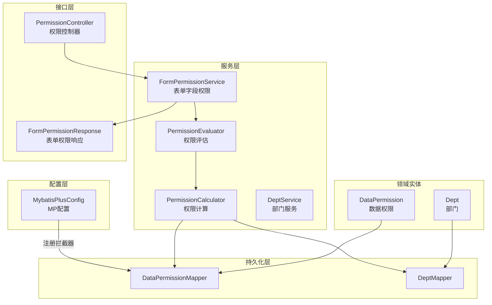
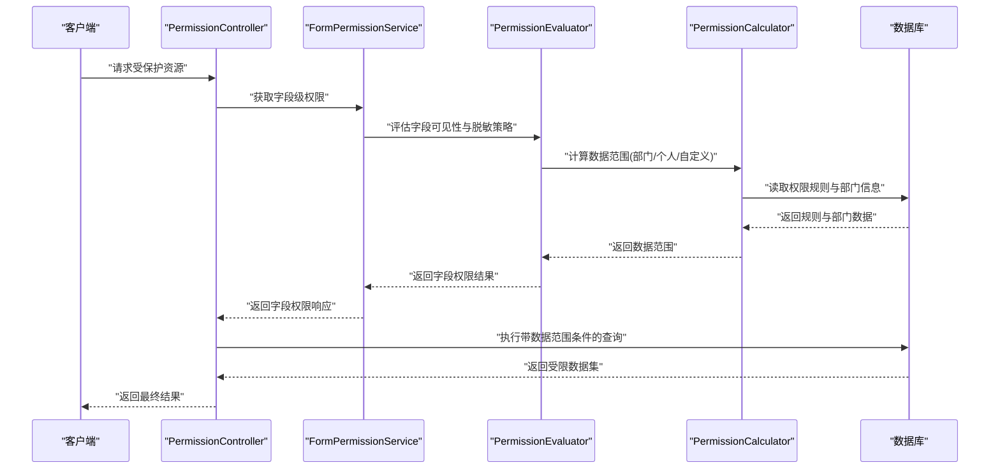
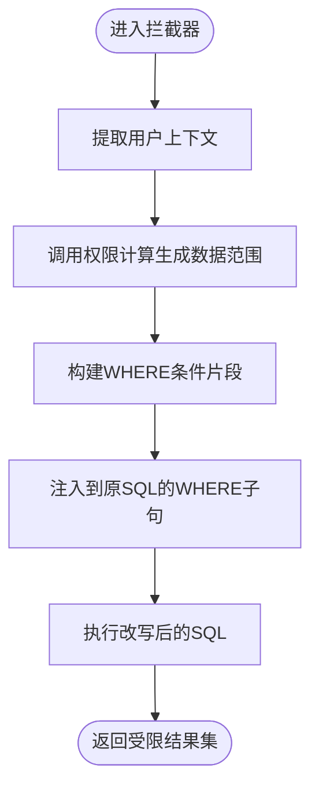
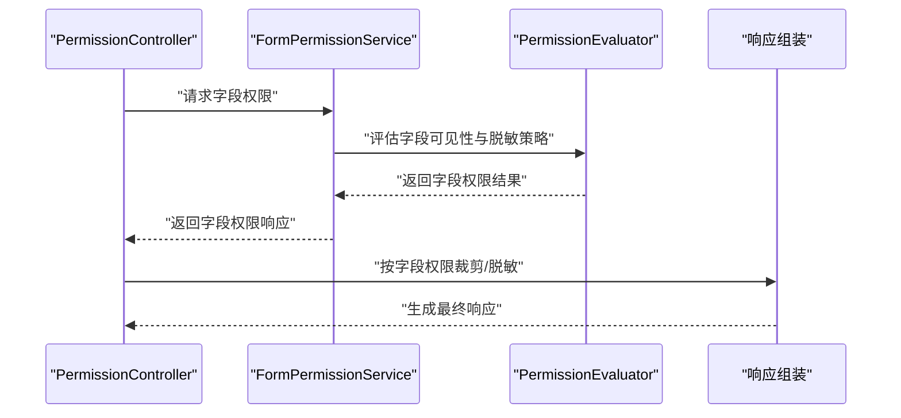
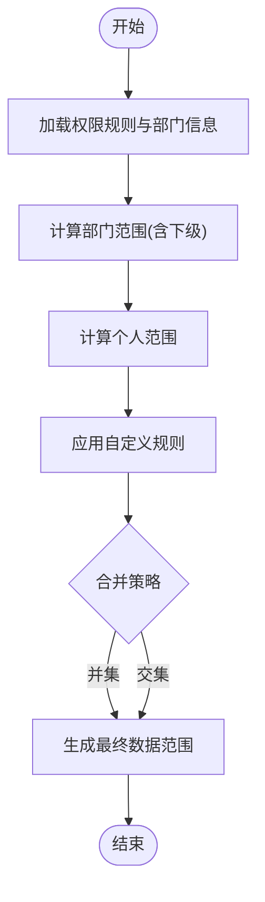

# 数据权限控制

<cite>
**本文引用的文件**
- [DataPermission.java](file://flow-engine/src/main/java/com/flow/engine/entity/DataPermission.java)
- [DataPermissionMapper.java](file://flow-engine/src/main/java/com/flow/engine/mapper/DataPermissionMapper.java)
- [PermissionCalculator.java](file://flow-engine/src/main/java/com/flow/engine/service/PermissionCalculator.java)
- [PermissionEvaluator.java](file://flow-engine/src/main/java/com/flow/engine/service/PermissionEvaluator.java)
- [DeptService.java](file://flow-engine/src/main/java/com/flow/engine/service/DeptService.java)
- [Dept.java](file://flow-engine/src/main/java/com/flow/engine/entity/Dept.java)
- [DeptMapper.java](file://flow-engine/src/main/java/com/flow/engine/mapper/DeptMapper.java)
- [MybatisPlusConfig.java](file://flow-engine/src/main/java/com/flow/engine/config/MybatisPlusConfig.java)
- [schema.sql](file://flow-engine/src/main/resources/db/schema.sql)
- [application.yml](file://flow-engine/src/main/resources/application.yml)
- [PermissionController.java](file://flow-engine/src/main/java/com/flow/engine/controllers/PermissionController.java)
- [FormPermissionService.java](file://flow-engine/src/main/java/com/flow/engine/service/FormPermissionService.java)
- [FormPermissionResponse.java](file://flow-engine/src/main/java/com/flow/engine/dto/FormPermissionResponse.java)
- [PermissionCalculatorTest.java](file://flow-engine/src/test/java/com/flow/engine/service/PermissionCalculatorTest.java)
- [PermissionEvaluatorTest.java](file://flow-engine/src/test/java/com/flow/engine/service/PermissionEvaluatorTest.java)
</cite>

## 目录
1. [简介](#简介)
2. [项目结构](#项目结构)
3. [核心组件](#核心组件)
4. [架构总览](#架构总览)
5. [详细组件分析](#详细组件分析)
6. [依赖关系分析](#依赖关系分析)
7. [性能考虑](#性能考虑)
8. [故障排查指南](#故障排查指南)
9. [结论](#结论)
10. [附录](#附录)

## 简介
本技术文档围绕“数据权限控制系统”展开，重点覆盖以下方面：
- 行级数据过滤机制：SQL拦截器设计与动态条件注入
- 字段级权限控制：敏感字段脱敏与可见性控制
- 数据权限计算逻辑：部门、个人与自定义规则的优先级处理
- 数据权限配置示例：规则定义、数据范围设置、权限继承
- 性能优化策略：缓存机制与查询优化
- 测试用例与调试方法
- 常见业务场景的解决方案

## 项目结构
本项目采用分层架构，数据权限相关能力主要分布在服务层、实体与映射层、配置层以及控制器与DTO中。关键路径如下：
- 实体与持久化：数据权限模型、部门模型及其映射器
- 服务层：权限计算、权限评估、表单字段权限
- 配置层：MyBatis-Plus 配置（用于扩展拦截器）
- 控制器与DTO：对外暴露的数据权限与表单字段权限接口



图表来源
- [DataPermission.java](file://flow-engine/src/main/java/com/flow/engine/entity/DataPermission.java)
- [DataPermissionMapper.java](file://flow-engine/src/main/java/com/flow/engine/mapper/DataPermissionMapper.java)
- [Dept.java](file://flow-engine/src/main/java/com/flow/engine/entity/Dept.java)
- [DeptMapper.java](file://flow-engine/src/main/java/com/flow/engine/mapper/DeptMapper.java)
- [PermissionCalculator.java](file://flow-engine/src/main/java/com/flow/engine/service/PermissionCalculator.java)
- [PermissionEvaluator.java](file://flow-engine/src/main/java/com/flow/engine/service/PermissionEvaluator.java)
- [FormPermissionService.java](file://flow-engine/src/main/java/com/flow/engine/service/FormPermissionService.java)
- [FormPermissionResponse.java](file://flow-engine/src/main/java/com/flow/engine/dto/FormPermissionResponse.java)
- [MybatisPlusConfig.java](file://flow-engine/src/main/java/com/flow/engine/config/MybatisPlusConfig.java)
- [PermissionController.java](file://flow-engine/src/main/java/com/flow/engine/controllers/PermissionController.java)

章节来源
- [DataPermission.java](file://flow-engine/src/main/java/com/flow/engine/entity/DataPermission.java)
- [DataPermissionMapper.java](file://flow-engine/src/main/java/com/flow/engine/mapper/DataPermissionMapper.java)
- [PermissionCalculator.java](file://flow-engine/src/main/java/com/flow/engine/service/PermissionCalculator.java)
- [PermissionEvaluator.java](file://flow-engine/src/main/java/com/flow/engine/service/PermissionEvaluator.java)
- [DeptService.java](file://flow-engine/src/main/java/com/flow/engine/service/DeptService.java)
- [Dept.java](file://flow-engine/src/main/java/com/flow/engine/entity/Dept.java)
- [DeptMapper.java](file://flow-engine/src/main/java/com/flow/engine/mapper/DeptMapper.java)
- [MybatisPlusConfig.java](file://flow-engine/src/main/java/com/flow/engine/config/MybatisPlusConfig.java)
- [schema.sql](file://flow-engine/src/main/resources/db/schema.sql)
- [application.yml](file://flow-engine/src/main/resources/application.yml)
- [PermissionController.java](file://flow-engine/src/main/java/com/flow/engine/controllers/PermissionController.java)
- [FormPermissionService.java](file://flow-engine/src/main/java/com/flow/engine/service/FormPermissionService.java)
- [FormPermissionResponse.java](file://flow-engine/src/main/java/com/flow/engine/dto/FormPermissionResponse.java)

## 核心组件
- 数据权限实体与映射
  - DataPermission：承载数据权限规则（如适用对象、数据范围、表达式等）
  - DataPermissionMapper：提供数据权限记录的查询能力
- 权限计算与评估
  - PermissionCalculator：根据当前用户上下文与规则集合，计算可访问的数据范围（部门、个人、自定义）
  - PermissionEvaluator：将计算结果转换为具体执行时的权限判定（是否允许访问某条记录或某个字段）
- 部门服务
  - DeptService：提供部门树与成员关系查询，支撑部门维度权限计算
- 表单字段权限
  - FormPermissionService：基于字段级权限规则，返回字段可见性与脱敏策略
  - FormPermissionResponse：封装字段级权限响应结构
- MyBatis-Plus 配置
  - MybatisPlusConfig：用于注册数据权限拦截器，实现SQL动态改写

章节来源
- [DataPermission.java](file://flow-engine/src/main/java/com/flow/engine/entity/DataPermission.java)
- [DataPermissionMapper.java](file://flow-engine/src/main/java/com/flow/engine/mapper/DataPermissionMapper.java)
- [PermissionCalculator.java](file://flow-engine/src/main/java/com/flow/engine/service/PermissionCalculator.java)
- [PermissionEvaluator.java](file://flow-engine/src/main/java/com/flow/engine/service/PermissionEvaluator.java)
- [DeptService.java](file://flow-engine/src/main/java/com/flow/engine/service/DeptService.java)
- [Dept.java](file://flow-engine/src/main/java/com/flow/engine/entity/Dept.java)
- [DeptMapper.java](file://flow-engine/src/main/java/com/flow/engine/mapper/DeptMapper.java)
- [FormPermissionService.java](file://flow-engine/src/main/java/com/flow/engine/service/FormPermissionService.java)
- [FormPermissionResponse.java](file://flow-engine/src/main/java/com/flow/engine/dto/FormPermissionResponse.java)
- [MybatisPlusConfig.java](file://flow-engine/src/main/java/com/flow/engine/config/MybatisPlusConfig.java)

## 架构总览
数据权限系统通过“规则定义—权限计算—SQL拦截—字段脱敏”的链路实现端到端控制。



图表来源
- [PermissionController.java](file://flow-engine/src/main/java/com/flow/engine/controllers/PermissionController.java)
- [FormPermissionService.java](file://flow-engine/src/main/java/com/flow/engine/service/FormPermissionService.java)
- [PermissionEvaluator.java](file://flow-engine/src/main/java/com/flow/engine/service/PermissionEvaluator.java)
- [PermissionCalculator.java](file://flow-engine/src/main/java/com/flow/engine/service/PermissionCalculator.java)
- [DataPermissionMapper.java](file://flow-engine/src/main/java/com/flow/engine/mapper/DataPermissionMapper.java)
- [DeptMapper.java](file://flow-engine/src/main/java/com/flow/engine/mapper/DeptMapper.java)

## 详细组件分析

### 行级数据过滤机制（SQL拦截器与动态条件注入）
- 设计要点
  - 在 MyBatis-Plus 配置中注册数据权限拦截器，统一拦截所有查询语句
  - 解析当前用户上下文，结合已计算的“数据范围”，动态拼接 WHERE 子句
  - 支持多条件组合（部门、个人、自定义表达式），并保证 SQL 安全（参数化绑定）
- 动态条件注入流程
  - 进入拦截器后，从上下文提取用户标识与租户信息
  - 调用权限计算服务生成数据范围条件片段
  - 将条件片段以安全方式注入到原 SQL 的 WHERE 子句
  - 执行改写后的 SQL，返回受限结果集



图表来源
- [MybatisPlusConfig.java](file://flow-engine/src/main/java/com/flow/engine/config/MybatisPlusConfig.java)
- [PermissionCalculator.java](file://flow-engine/src/main/java/com/flow/engine/service/PermissionCalculator.java)
- [DataPermissionMapper.java](file://flow-engine/src/main/java/com/flow/engine/mapper/DataPermissionMapper.java)
- [DeptMapper.java](file://flow-engine/src/main/java/com/flow/engine/mapper/DeptMapper.java)

章节来源
- [MybatisPlusConfig.java](file://flow-engine/src/main/java/com/flow/engine/config/MybatisPlusConfig.java)
- [PermissionCalculator.java](file://flow-engine/src/main/java/com/flow/engine/service/PermissionCalculator.java)
- [DataPermissionMapper.java](file://flow-engine/src/main/java/com/flow/engine/mapper/DataPermissionMapper.java)
- [DeptMapper.java](file://flow-engine/src/main/java/com/flow/engine/mapper/DeptMapper.java)

### 字段级权限控制（敏感字段脱敏与可见性）
- 目标
  - 对敏感字段进行可见性控制与脱敏展示
  - 基于角色、数据范围与字段规则决定字段输出内容
- 实现思路
  - 使用 FormPermissionService 聚合字段级权限规则
  - 通过 PermissionEvaluator 判断字段是否可见、是否需要脱敏及脱敏策略
  - 在响应组装阶段按策略替换或隐藏字段值
- 典型流程
  - 请求进入控制器，先拉取字段级权限
  - 根据权限结果对响应数据进行字段裁剪或脱敏
  - 返回给前端



图表来源
- [PermissionController.java](file://flow-engine/src/main/java/com/flow/engine/controllers/PermissionController.java)
- [FormPermissionService.java](file://flow-engine/src/main/java/com/flow/engine/service/FormPermissionService.java)
- [PermissionEvaluator.java](file://flow-engine/src/main/java/com/flow/engine/service/PermissionEvaluator.java)
- [FormPermissionResponse.java](file://flow-engine/src/main/java/com/flow/engine/dto/FormPermissionResponse.java)

章节来源
- [FormPermissionService.java](file://flow-engine/src/main/java/com/flow/engine/service/FormPermissionService.java)
- [PermissionEvaluator.java](file://flow-engine/src/main/java/com/flow/engine/service/PermissionEvaluator.java)
- [FormPermissionResponse.java](file://flow-engine/src/main/java/com/flow/engine/dto/FormPermissionResponse.java)
- [PermissionController.java](file://flow-engine/src/main/java/com/flow/engine/controllers/PermissionController.java)

### 数据权限计算逻辑（部门、个人、自定义规则优先级）
- 输入
  - 当前用户上下文（用户ID、所属部门、角色等）
  - 数据权限规则集合（DataPermission）
  - 部门层级与成员关系（Dept）
- 计算步骤
  - 加载并筛选适用的数据权限规则
  - 计算部门维度范围（含本部门及下级部门）
  - 合并个人维度范围（直接归属该用户的记录）
  - 应用自定义规则（表达式或条件片段）
  - 按优先级合并得到最终数据范围
- 优先级建议
  - 个人 > 自定义 > 部门（可根据业务调整）
  - 多个同级别规则时采用并集策略



图表来源
- [PermissionCalculator.java](file://flow-engine/src/main/java/com/flow/engine/service/PermissionCalculator.java)
- [DataPermission.java](file://flow-engine/src/main/java/com/flow/engine/entity/DataPermission.java)
- [Dept.java](file://flow-engine/src/main/java/com/flow/engine/entity/Dept.java)
- [DeptService.java](file://flow-engine/src/main/java/com/flow/engine/service/DeptService.java)

章节来源
- [PermissionCalculator.java](file://flow-engine/src/main/java/com/flow/engine/service/PermissionCalculator.java)
- [DataPermission.java](file://flow-engine/src/main/java/com/flow/engine/entity/DataPermission.java)
- [Dept.java](file://flow-engine/src/main/java/com/flow/engine/entity/Dept.java)
- [DeptService.java](file://flow-engine/src/main/java/com/flow/engine/service/DeptService.java)

### 数据权限配置示例（规则定义、数据范围、权限继承）
- 规则定义
  - 为不同主体（用户、角色、部门）定义数据权限规则
  - 指定数据范围类型（本人、本部门、本部门及下级、全部、自定义）
- 数据范围设置
  - 部门范围需包含自身与下级部门
  - 个人范围限定为用户直接拥有的记录
  - 自定义范围通过表达式或条件片段表达
- 权限继承
  - 角色继承其关联的用户与部门属性
  - 部门继承其上级部门的范围（可选）

章节来源
- [DataPermission.java](file://flow-engine/src/main/java/com/flow/engine/entity/DataPermission.java)
- [Dept.java](file://flow-engine/src/main/java/com/flow/engine/entity/Dept.java)
- [DeptService.java](file://flow-engine/src/main/java/com/flow/engine/service/DeptService.java)
- [schema.sql](file://flow-engine/src/main/resources/db/schema.sql)

## 依赖关系分析
- 组件耦合
  - PermissionCalculator 依赖 DataPermissionMapper 与 DeptMapper，负责范围计算
  - PermissionEvaluator 依赖 PermissionCalculator，负责执行期判定
  - FormPermissionService 依赖 PermissionEvaluator，负责字段级权限
  - MybatisPlusConfig 负责注册拦截器，影响所有查询
- 外部依赖
  - MyBatis-Plus 提供的拦截器扩展点
  - 数据库表结构与索引（影响查询性能）

```mermaid
classDiagram
class PermissionCalculator {
+计算数据范围()
}
class PermissionEvaluator {
+评估权限()
}
class FormPermissionService {
+获取字段权限()
}
class DataPermissionMapper
class DeptMapper
class MybatisPlusConfig
PermissionEvaluator --> PermissionCalculator : "依赖"
FormPermissionService --> PermissionEvaluator : "依赖"
PermissionCalculator --> DataPermissionMapper : "读取规则"
PermissionCalculator --> DeptMapper : "读取部门"
MybatisPlusConfig -->|"注册拦截器"| DataPermissionMapper
```

图表来源
- [PermissionCalculator.java](file://flow-engine/src/main/java/com/flow/engine/service/PermissionCalculator.java)
- [PermissionEvaluator.java](file://flow-engine/src/main/java/com/flow/engine/service/PermissionEvaluator.java)
- [FormPermissionService.java](file://flow-engine/src/main/java/com/flow/engine/service/FormPermissionService.java)
- [DataPermissionMapper.java](file://flow-engine/src/main/java/com/flow/engine/mapper/DataPermissionMapper.java)
- [DeptMapper.java](file://flow-engine/src/main/java/com/flow/engine/mapper/DeptMapper.java)
- [MybatisPlusConfig.java](file://flow-engine/src/main/java/com/flow/engine/config/MybatisPlusConfig.java)

章节来源
- [PermissionCalculator.java](file://flow-engine/src/main/java/com/flow/engine/service/PermissionCalculator.java)
- [PermissionEvaluator.java](file://flow-engine/src/main/java/com/flow/engine/service/PermissionEvaluator.java)
- [FormPermissionService.java](file://flow-engine/src/main/java/com/flow/engine/service/FormPermissionService.java)
- [DataPermissionMapper.java](file://flow-engine/src/main/java/com/flow/engine/mapper/DataPermissionMapper.java)
- [DeptMapper.java](file://flow-engine/src/main/java/com/flow/engine/mapper/DeptMapper.java)
- [MybatisPlusConfig.java](file://flow-engine/src/main/java/com/flow/engine/config/MybatisPlusConfig.java)

## 性能考虑
- 缓存策略
  - 缓存数据权限规则与部门树，减少重复查询
  - 缓存键包含用户标识、租户、时间戳等维度，确保一致性
- 查询优化
  - 在数据范围计算阶段尽量使用集合操作，避免 N+1 查询
  - 为常用过滤字段建立合适索引，提升 SQL 执行效率
- 拦截器优化
  - 条件片段复用，避免重复构建
  - 对大结果集分页查询，限制单次扫描行数

[本节为通用性能指导，不直接分析具体文件]

## 故障排查指南
- 常见问题定位
  - 数据范围未生效：检查拦截器是否正确注册、上下文是否携带用户信息
  - 字段未脱敏：确认字段级权限规则是否匹配、脱敏策略是否启用
  - 性能问题：关注慢查询日志，检查索引与缓存命中率
- 调试方法
  - 开启 SQL 日志，观察改写后的 SQL 是否符合预期
  - 打印权限计算中间结果，验证部门与个人范围合并逻辑
  - 使用单元测试复现问题，逐步缩小范围

章节来源
- [PermissionCalculatorTest.java](file://flow-engine/src/test/java/com/flow/engine/service/PermissionCalculatorTest.java)
- [PermissionEvaluatorTest.java](file://flow-engine/src/test/java/com/flow/engine/service/PermissionEvaluatorTest.java)

## 结论
本方案通过“规则驱动+拦截器注入+字段级控制”的方式，实现了灵活且可扩展的数据权限体系。建议在业务演进中持续完善规则建模与缓存策略，并结合监控与测试保障稳定性与性能。

[本节为总结性内容，不直接分析具体文件]

## 附录
- 配置参考
  - application.yml：基础运行配置（如数据源、日志级别等）
  - schema.sql：数据权限与部门相关表结构定义
- 接口参考
  - PermissionController：数据权限相关接口入口
  - FormPermissionResponse：字段级权限响应结构

章节来源
- [application.yml](file://flow-engine/src/main/resources/application.yml)
- [schema.sql](file://flow-engine/src/main/resources/db/schema.sql)
- [PermissionController.java](file://flow-engine/src/main/java/com/flow/engine/controllers/PermissionController.java)
- [FormPermissionResponse.java](file://flow-engine/src/main/java/com/flow/engine/dto/FormPermissionResponse.java)