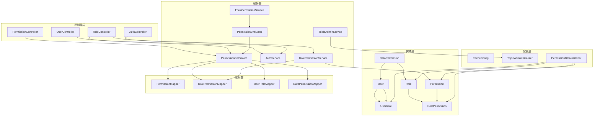
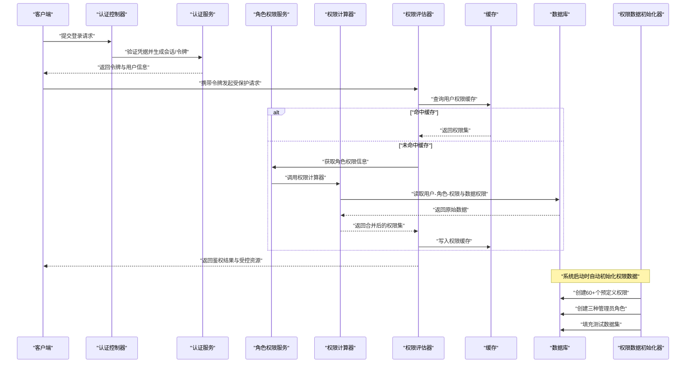
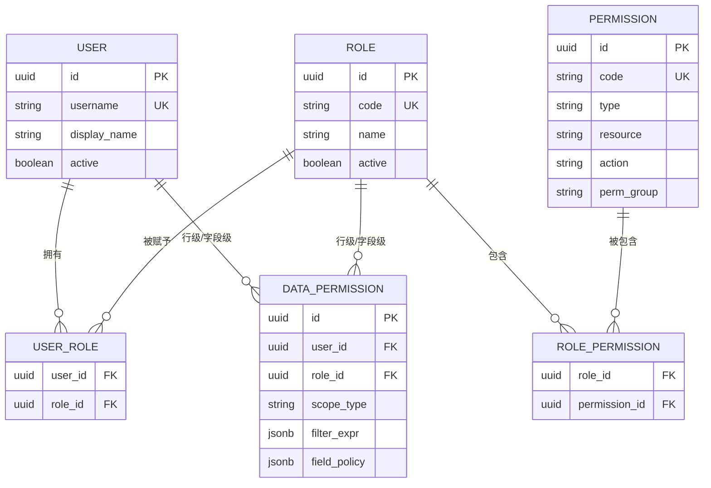
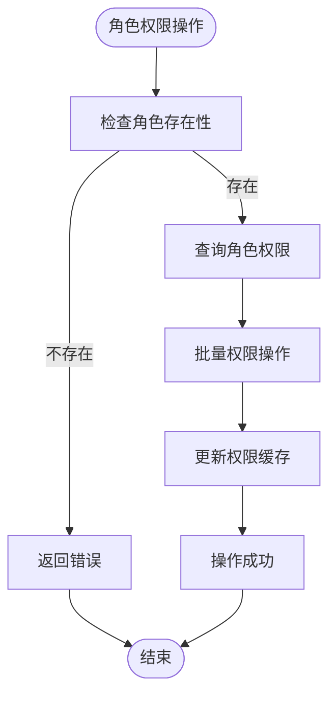
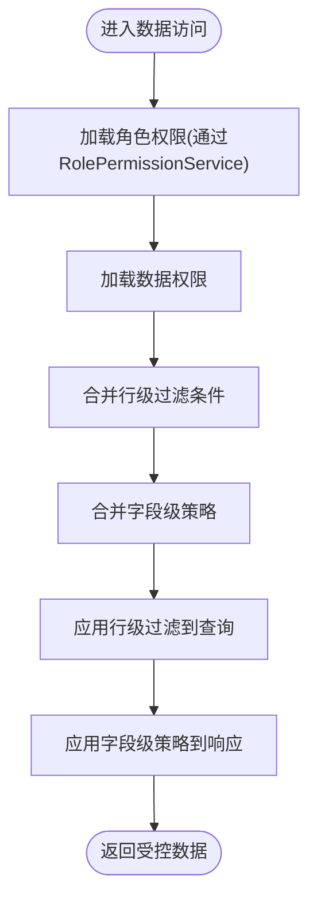
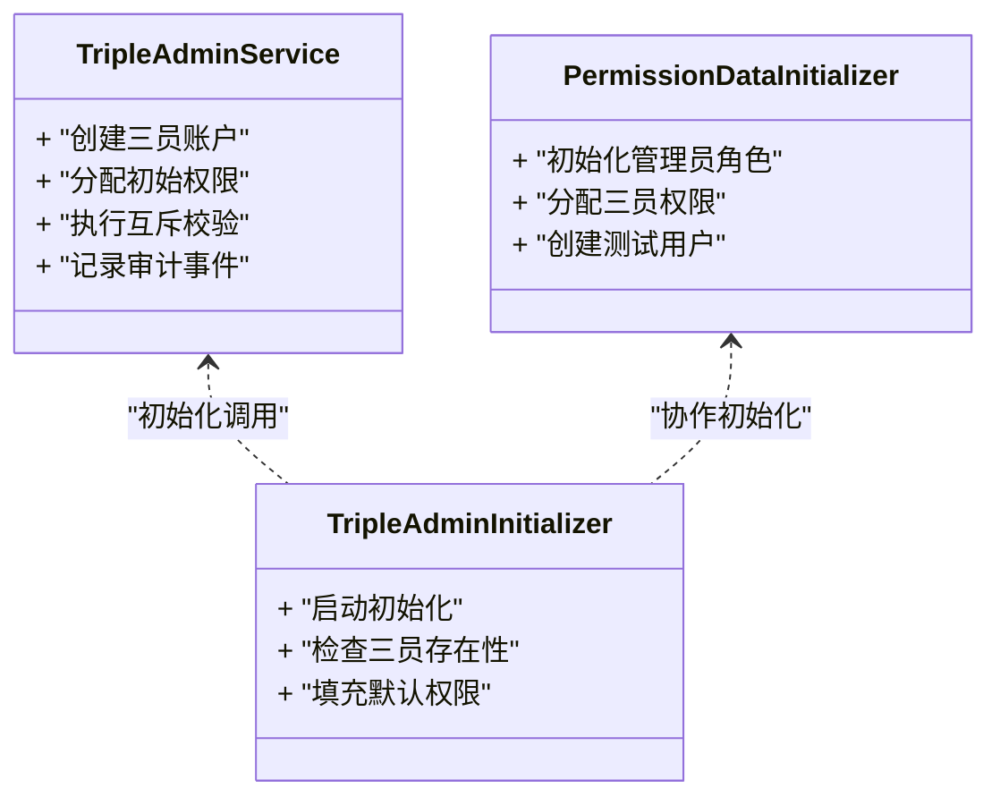
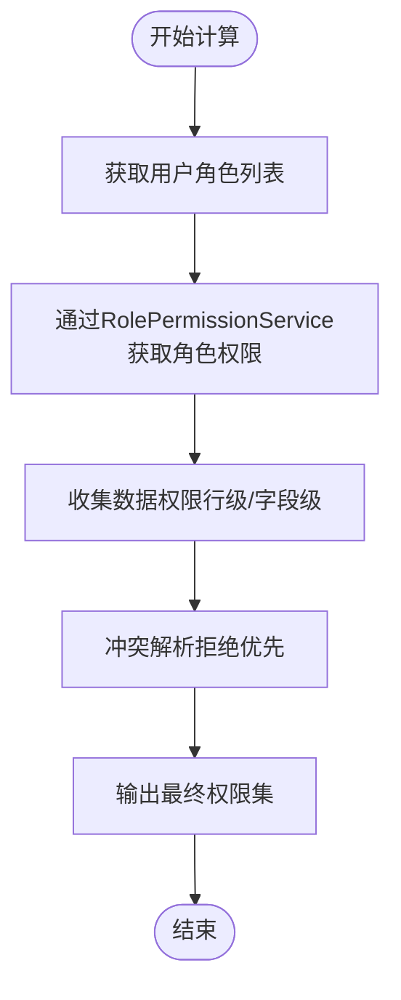
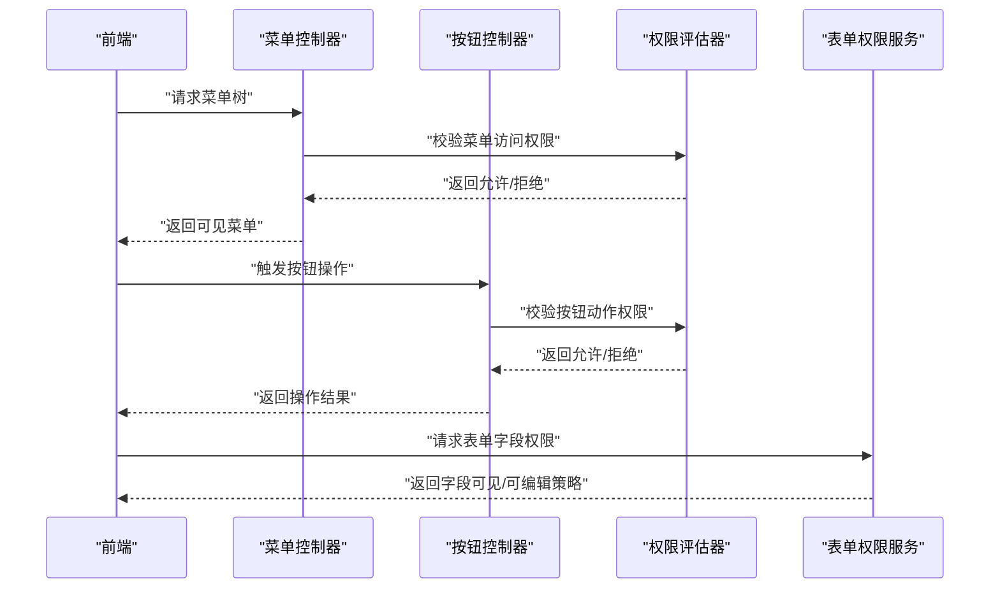
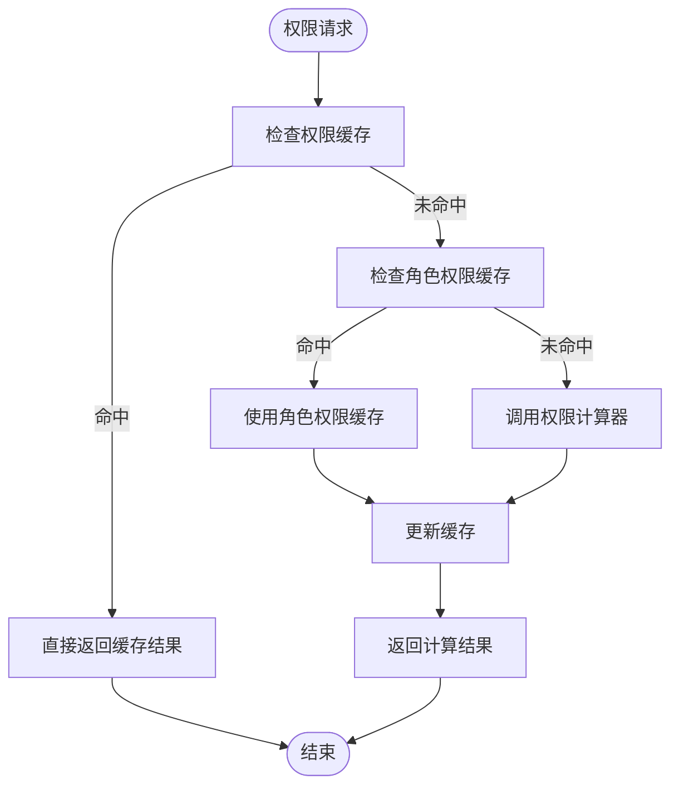
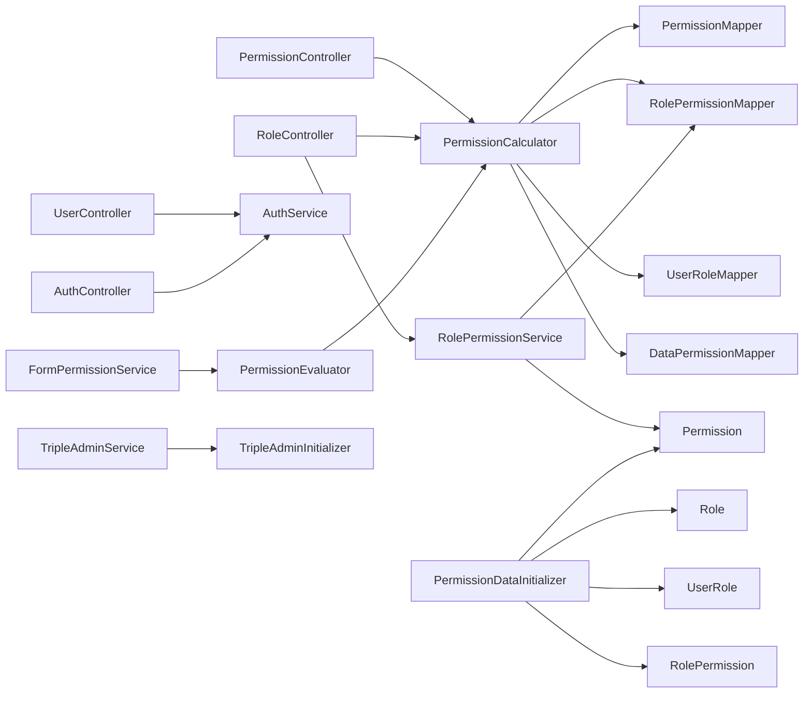

# 权限控制系统

<cite>
**本文引用的文件**   
- [Permission.java](file://flow-engine/src/main/java/com/flow/engine/entity/Permission.java)
- [Role.java](file://flow-engine/src/main/java/com/flow/engine/entity/Role.java)
- [User.java](file://flow-engine/src/main/java/com/flow/engine/entity/User.java)
- [RolePermission.java](file://flow-engine/src/main/java/com/flow/engine/entity/RolePermission.java)
- [UserRole.java](file://flow-engine/src/main/java/com/flow/engine/entity/UserRole.java)
- [DataPermission.java](file://flow-engine/src/main/java/com/flow/engine/entity/DataPermission.java)
- [PermissionController.java](file://flow-engine/src/main/java/com/flow/engine/controllers/PermissionController.java)
- [RoleController.java](file://flow-engine/src/main/java/com/flow/engine/controllers/RoleController.java)
- [UserController.java](file://flow-engine/src/main/java/com/flow/engine/controllers/UserController.java)
- [PermissionCalculator.java](file://flow-engine/src/main/java/com/flow/engine/service/PermissionCalculator.java)
- [PermissionEvaluator.java](file://flow-engine/src/main/java/com/flow/engine/service/PermissionEvaluator.java)
- [TripleAdminService.java](file://flow-engine/src/main/java/com/flow/engine/service/TripleAdminService.java)
- [TripleAdminInitializer.java](file://flow-engine/src/main/java/com/flow/engine/config/TripleAdminInitializer.java)
- [PermissionDataInitializer.java](file://flow-engine/src/main/java/com/flow/engine/config/PermissionDataInitializer.java)
- [AuthController.java](file://flow-engine/src/main/java/com/flow/engine/controllers/AuthController.java)
- [AuthService.java](file://flow-engine/src/main/java/com/flow/engine/service/AuthService.java)
- [CacheConfig.java](file://flow-engine/src/main/java/com/flow/engine/config/CacheConfig.java)
- [schema.sql](file://flow-engine/src/main/resources/db/schema.sql)
- [application.yml](file://flow-engine/src/main/resources/application.yml)
- [FormPermissionService.java](file://flow-engine/src/main/java/com/flow/engine/service/FormPermissionService.java)
- [FormPermissionResponse.java](file://flow-engine/src/main/java/com/flow/engine/dto/FormPermissionResponse.java)
- [PermissionMapper.java](file://flow-engine/src/main/java/com/flow/engine/mapper/PermissionMapper.java)
- [RolePermissionMapper.java](file://flow-engine/src/main/java/com/flow/engine/mapper/RolePermissionMapper.java)
- [UserRoleMapper.java](file://flow-engine/src/main/java/com/flow/engine/mapper/UserRoleMapper.java)
- [DataPermissionMapper.java](file://flow-engine/src/main/java/com/flow/engine/mapper/DataPermissionMapper.java)
- [RolePermissionService.java](file://flow-engine/src/main/java/com/flow/engine/service/RolePermissionService.java)
</cite>

## 更新摘要
**所做更改**   
- 新增RolePermissionService角色权限服务章节，详细说明角色权限管理的增强功能
- 完善RBAC权限模型的数据权限控制机制说明
- 更新权限计算引擎部分，反映RolePermissionService对权限计算的优化
- 扩展权限缓存机制，包含角色权限服务的缓存策略
- 更新依赖关系分析，增加RolePermissionService的集成说明

## 目录
1. [简介](#简介)
2. [项目结构](#项目结构)
3. [核心组件](#核心组件)
4. [架构总览](#架构总览)
5. [详细组件分析](#详细组件分析)
6. [依赖关系分析](#依赖关系分析)
7. [性能考虑](#性能考虑)
8. [故障排查指南](#故障排查指南)
9. [结论](#结论)
10. [附录](#附录)

## 简介
本技术文档围绕权限控制系统的RBAC模型、数据权限、三员管理、权限计算引擎、菜单与按钮级控制、缓存与性能优化，以及配置与管理界面使用进行系统化说明。系统采用用户-角色-权限的多对多关系建模，结合行级与字段级数据权限策略，并通过三员管理体系实现职责分离与安全管控。**更新** 系统现已集成RolePermissionService角色权限服务，进一步增强了RBAC权限模型的数据权限控制能力，提供更完善的角色权限管理功能。

## 项目结构
权限相关代码主要位于后端工程 flow-engine 中，涵盖实体模型、控制器、服务层、映射器与配置等模块：
- 实体层：定义用户、角色、权限、关联表及数据权限实体
- 控制器层：暴露权限、角色、用户、认证等API
- 服务层：实现权限计算、评估、表单字段权限、三员管理及角色权限管理等业务逻辑
- 映射层：提供数据库访问接口
- 配置层：包含缓存、三员初始化、权限数据初始化等配置

图表来源
- [Permission.java](file://flow-engine/src/main/java/com/flow/engine/entity/Permission.java)
- [Role.java](file://flow-engine/src/main/java/com/flow/engine/entity/Role.java)
- [User.java](file://flow-engine/src/main/java/com/flow/engine/entity/User.java)
- [RolePermission.java](file://flow-engine/src/main/java/com/flow/engine/entity/RolePermission.java)
- [UserRole.java](file://flow-engine/src/main/java/com/flow/engine/entity/UserRole.java)
- [DataPermission.java](file://flow-engine/src/main/java/com/flow/engine/entity/DataPermission.java)
- [PermissionController.java](file://flow-engine/src/main/java/com/flow/engine/controllers/PermissionController.java)
- [RoleController.java](file://flow-engine/src/main/java/com/flow/engine/controllers/RoleController.java)
- [UserController.java](file://flow-engine/src/main/java/com/flow/engine/controllers/UserController.java)
- [AuthController.java](file://flow-engine/src/main/java/com/flow/engine/controllers/AuthController.java)
- [PermissionCalculator.java](file://flow-engine/src/main/java/com/flow/engine/service/PermissionCalculator.java)
- [PermissionEvaluator.java](file://flow-engine/src/main/java/com/flow/engine/service/PermissionEvaluator.java)
- [FormPermissionService.java](file://flow-engine/src/main/java/com/flow/engine/service/FormPermissionService.java)
- [TripleAdminService.java](file://flow-engine/src/main/java/com/flow/engine/service/TripleAdminService.java)
- [TripleAdminInitializer.java](file://flow-engine/src/main/java/com/flow/engine/config/TripleAdminInitializer.java)
- [PermissionDataInitializer.java](file://flow-engine/src/main/java/com/flow/engine/config/PermissionDataInitializer.java)
- [RolePermissionService.java](file://flow-engine/src/main/java/com/flow/engine/service/RolePermissionService.java)
- [CacheConfig.java](file://flow-engine/src/main/java/com/flow/engine/config/CacheConfig.java)
- [PermissionMapper.java](file://flow-engine/src/main/java/com/flow/engine/mapper/PermissionMapper.java)
- [RolePermissionMapper.java](file://flow-engine/src/main/java/com/flow/engine/mapper/RolePermissionMapper.java)
- [UserRoleMapper.java](file://flow-engine/src/main/java/com/flow/engine/mapper/UserRoleMapper.java)
- [DataPermissionMapper.java](file://flow-engine/src/main/java/com/flow/engine/mapper/DataPermissionMapper.java)

章节来源
- [Permission.java](file://flow-engine/src/main/java/com/flow/engine/entity/Permission.java)
- [Role.java](file://flow-engine/src/main/java/com/flow/engine/entity/Role.java)
- [User.java](file://flow-engine/src/main/java/com/flow/engine/entity/User.java)
- [RolePermission.java](file://flow-engine/src/main/java/com/flow/engine/entity/RolePermission.java)
- [UserRole.java](file://flow-engine/src/main/java/com/flow/engine/entity/UserRole.java)
- [DataPermission.java](file://flow-engine/src/main/java/com/flow/engine/entity/DataPermission.java)
- [PermissionController.java](file://flow-engine/src/main/java/com/flow/engine/controllers/PermissionController.java)
- [RoleController.java](file://flow-engine/src/main/java/com/flow/engine/controllers/RoleController.java)
- [UserController.java](file://flow-engine/src/main/java/com/flow/engine/controllers/UserController.java)
- [AuthController.java](file://flow-engine/src/main/java/com/flow/engine/controllers/AuthController.java)
- [PermissionCalculator.java](file://flow-engine/src/main/java/com/flow/engine/service/PermissionCalculator.java)
- [PermissionEvaluator.java](file://flow-engine/src/main/java/com/flow/engine/service/PermissionEvaluator.java)
- [FormPermissionService.java](file://flow-engine/src/main/java/com/flow/engine/service/FormPermissionService.java)
- [TripleAdminService.java](file://flow-engine/src/main/java/com/flow/engine/service/TripleAdminService.java)
- [TripleAdminInitializer.java](file://flow-engine/src/main/java/com/flow/engine/config/TripleAdminInitializer.java)
- [PermissionDataInitializer.java](file://flow-engine/src/main/java/com/flow/engine/config/PermissionDataInitializer.java)
- [RolePermissionService.java](file://flow-engine/src/main/java/com/flow/engine/service/RolePermissionService.java)
- [CacheConfig.java](file://flow-engine/src/main/java/com/flow/engine/config/CacheConfig.java)
- [PermissionMapper.java](file://flow-engine/src/main/java/com/flow/engine/mapper/PermissionMapper.java)
- [RolePermissionMapper.java](file://flow-engine/src/main/java/com/flow/engine/mapper/RolePermissionMapper.java)
- [UserRoleMapper.java](file://flow-engine/src/main/java/com/flow/engine/mapper/UserRoleMapper.java)
- [DataPermissionMapper.java](file://flow-engine/src/main/java/com/flow/engine/mapper/DataPermissionMapper.java)

## 核心组件
- RBAC实体模型
  - 用户（User）：系统登录主体，具备唯一标识与基础属性
  - 角色（Role）：一组权限的集合，用于聚合授权
  - 权限（Permission）：最小授权单元，可表示菜单、按钮或资源操作，支持权限分组（permGroup字段）
  - 用户-角色关联（UserRole）：支持用户拥有多个角色
  - 角色-权限关联（RolePermission）：支持角色授予多个权限
  - 数据权限（DataPermission）：定义行级与字段级的数据访问范围

- 权限计算与评估
  - 权限计算器（PermissionCalculator）：负责从用户-角色-权限与数据权限表中计算最终权限集
  - 权限评估器（PermissionEvaluator）：基于已计算的权限集进行访问判断，支持菜单与按钮级别校验
  - **新增** 角色权限服务（RolePermissionService）：专门处理角色与权限的关联管理，提供高效的权限查询和批量操作功能

- 表单字段权限
  - 表单权限服务（FormPermissionService）：根据当前用户权限返回字段可见/可编辑状态，供前端渲染控制

- 三员管理
  - 三员管理员服务（TripleAdminService）：实现系统管理员、安全管理员、审计管理员的职责分离与互斥控制
  - 三员初始化（TripleAdminInitializer）：在启动时创建默认三员账户并分配初始权限

- 权限数据自动初始化
  - 权限数据初始化器（PermissionDataInitializer）：系统启动时自动创建完整的权限数据、角色数据和测试数据集

- 认证与鉴权
  - 认证控制器（AuthController）与认证服务（AuthService）：处理登录、令牌签发与上下文注入

- 缓存配置
  - 缓存配置（CacheConfig）：为权限相关数据提供缓存策略，降低重复计算开销

章节来源
- [Permission.java](file://flow-engine/src/main/java/com/flow/engine/entity/Permission.java)
- [Role.java](file://flow-engine/src/main/java/com/flow/engine/entity/Role.java)
- [User.java](file://flow-engine/src/main/java/com/flow/engine/entity/User.java)
- [RolePermission.java](file://flow-engine/src/main/java/com/flow/engine/entity/RolePermission.java)
- [UserRole.java](file://flow-engine/src/main/java/com/flow/engine/entity/UserRole.java)
- [DataPermission.java](file://flow-engine/src/main/java/com/flow/engine/entity/DataPermission.java)
- [PermissionCalculator.java](file://flow-engine/src/main/java/com/flow/engine/service/PermissionCalculator.java)
- [PermissionEvaluator.java](file://flow-engine/src/main/java/com/flow/engine/service/PermissionEvaluator.java)
- [RolePermissionService.java](file://flow-engine/src/main/java/com/flow/engine/service/RolePermissionService.java)
- [FormPermissionService.java](file://flow-engine/src/main/java/com/flow/engine/service/FormPermissionService.java)
- [TripleAdminService.java](file://flow-engine/src/main/java/com/flow/engine/service/TripleAdminService.java)
- [TripleAdminInitializer.java](file://flow-engine/src/main/java/com/flow/engine/config/TripleAdminInitializer.java)
- [PermissionDataInitializer.java](file://flow-engine/src/main/java/com/flow/engine/config/PermissionDataInitializer.java)
- [AuthController.java](file://flow-engine/src/main/java/com/flow/engine/controllers/AuthController.java)
- [AuthService.java](file://flow-engine/src/main/java/com/flow/engine/service/AuthService.java)
- [CacheConfig.java](file://flow-engine/src/main/java/com/flow/engine/config/CacheConfig.java)

## 架构总览
权限控制体系由"实体模型 + 计算引擎 + 评估器 + 控制器 + 缓存 + 自动初始化"构成，形成从数据到决策的闭环流程。

图表来源
- [AuthController.java](file://flow-engine/src/main/java/com/flow/engine/controllers/AuthController.java)
- [AuthService.java](file://flow-engine/src/main/java/com/flow/engine/service/AuthService.java)
- [RolePermissionService.java](file://flow-engine/src/main/java/com/flow/engine/service/RolePermissionService.java)
- [PermissionCalculator.java](file://flow-engine/src/main/java/com/flow/engine/service/PermissionCalculator.java)
- [PermissionEvaluator.java](file://flow-engine/src/main/java/com/flow/engine/service/PermissionEvaluator.java)
- [PermissionDataInitializer.java](file://flow-engine/src/main/java/com/flow/engine/config/PermissionDataInitializer.java)
- [CacheConfig.java](file://flow-engine/src/main/java/com/flow/engine/config/CacheConfig.java)
- [schema.sql](file://flow-engine/src/main/resources/db/schema.sql)

## 详细组件分析

### RBAC模型与多对多关系
- 用户与角色：通过用户-角色关联表建立多对多关系，一个用户可拥有多个角色，一个角色可赋予多个用户
- 角色与权限：通过角色-权限关联表建立多对多关系，一个角色可包含多个权限，一个权限可授予多个角色
- 权限类型：支持菜单权限与按钮权限两类，前者控制页面导航，后者控制操作按钮显示与可用状态
- 权限分组：通过permGroup字段对权限进行分类管理，便于批量授权和权限组织
- 数据权限：通过数据权限实体定义行级过滤条件与字段级读写控制，作用于具体业务数据的查询与更新

图表来源
- [User.java](file://flow-engine/src/main/java/com/flow/engine/entity/User.java)
- [Role.java](file://flow-engine/src/main/java/com/flow/engine/entity/Role.java)
- [Permission.java](file://flow-engine/src/main/java/com/flow/engine/entity/Permission.java)
- [UserRole.java](file://flow-engine/src/main/java/com/flow/engine/entity/UserRole.java)
- [RolePermission.java](file://flow-engine/src/main/java/com/flow/engine/entity/RolePermission.java)
- [DataPermission.java](file://flow-engine/src/main/java/com/flow/engine/entity/DataPermission.java)
- [schema.sql](file://flow-engine/src/main/resources/db/schema.sql)

章节来源
- [User.java](file://flow-engine/src/main/java/com/flow/engine/entity/User.java)
- [Role.java](file://flow-engine/src/main/java/com/flow/engine/entity/Role.java)
- [Permission.java](file://flow-engine/src/main/java/com/flow/engine/entity/Permission.java)
- [UserRole.java](file://flow-engine/src/main/java/com/flow/engine/entity/UserRole.java)
- [RolePermission.java](file://flow-engine/src/main/java/com/flow/engine/entity/RolePermission.java)
- [DataPermission.java](file://flow-engine/src/main/java/com/flow/engine/entity/DataPermission.java)
- [schema.sql](file://flow-engine/src/main/resources/db/schema.sql)

### 角色权限服务增强
**新增** RolePermissionService角色权限服务提供了专门的角色权限管理功能：

- 角色权限查询：提供高效的角色权限批量查询接口，支持按角色ID获取所有关联权限
- 权限分配管理：支持角色的权限分配、撤销和批量操作，确保权限变更的事务一致性
- 权限继承优化：优化了角色权限的继承计算，减少数据库查询次数，提升权限计算性能
- 数据权限整合：将数据权限与角色权限统一管理，提供更完整的数据访问控制

图表来源
- [RolePermissionService.java](file://flow-engine/src/main/java/com/flow/engine/service/RolePermissionService.java)
- [RolePermissionMapper.java](file://flow-engine/src/main/java/com/flow/engine/mapper/RolePermissionMapper.java)

章节来源
- [RolePermissionService.java](file://flow-engine/src/main/java/com/flow/engine/service/RolePermissionService.java)
- [RolePermissionMapper.java](file://flow-engine/src/main/java/com/flow/engine/mapper/RolePermissionMapper.java)

### 数据权限控制机制
- 行级数据过滤：通过数据权限实体的作用域类型与过滤表达式限定用户可访问的数据行范围，例如按部门、项目或创建者过滤
- 字段级权限控制：通过字段策略定义字段的可见性与可写性，支持只读、隐藏、必填等策略，配合表单权限服务返回字段级控制信息
- 权限合并：当用户同时拥有多个角色时，行级与字段级策略按"并集+最严格"原则合并，确保最小权限原则
- **更新** 角色权限整合：通过RolePermissionService统一处理角色权限与数据权限的关联，提供更高效的数据权限计算

图表来源
- [DataPermission.java](file://flow-engine/src/main/java/com/flow/engine/entity/DataPermission.java)
- [RolePermissionService.java](file://flow-engine/src/main/java/com/flow/engine/service/RolePermissionService.java)
- [PermissionCalculator.java](file://flow-engine/src/main/java/com/flow/engine/service/PermissionCalculator.java)
- [FormPermissionService.java](file://flow-engine/src/main/java/com/flow/engine/service/FormPermissionService.java)
- [FormPermissionResponse.java](file://flow-engine/src/main/java/com/flow/engine/dto/FormPermissionResponse.java)

章节来源
- [DataPermission.java](file://flow-engine/src/main/java/com/flow/engine/entity/DataPermission.java)
- [RolePermissionService.java](file://flow-engine/src/main/java/com/flow/engine/service/RolePermissionService.java)
- [PermissionCalculator.java](file://flow-engine/src/main/java/com/flow/engine/service/PermissionCalculator.java)
- [FormPermissionService.java](file://flow-engine/src/main/java/com/flow/engine/service/FormPermissionService.java)
- [FormPermissionResponse.java](file://flow-engine/src/main/java/com/flow/engine/dto/FormPermissionResponse.java)

### 三员管理体系
- 系统管理员：负责系统配置、用户与角色管理、权限分配等日常运维工作
- 安全管理员：负责安全策略配置、敏感操作审批、权限变更审核等安全管控
- 审计管理员：负责操作日志审计、合规检查、异常告警等监督职能
- 职责分离：三员之间互斥，关键操作需双人或多员协同完成，避免单点风险
- 自动初始化：系统启动时自动创建三员账户并分配相应权限，无需手动配置

图表来源
- [TripleAdminService.java](file://flow-engine/src/main/java/com/flow/engine/service/TripleAdminService.java)
- [TripleAdminInitializer.java](file://flow-engine/src/main/java/com/flow/engine/config/TripleAdminInitializer.java)
- [PermissionDataInitializer.java](file://flow-engine/src/main/java/com/flow/engine/config/PermissionDataInitializer.java)

章节来源
- [TripleAdminService.java](file://flow-engine/src/main/java/com/flow/engine/service/TripleAdminService.java)
- [TripleAdminInitializer.java](file://flow-engine/src/main/java/com/flow/engine/config/TripleAdminInitializer.java)
- [PermissionDataInitializer.java](file://flow-engine/src/main/java/com/flow/engine/config/PermissionDataInitializer.java)

### 权限计算引擎
- 权限继承：用户通过角色继承权限，支持多层角色继承（若存在角色层级），最终权限为用户所有角色权限的并集
- 权限合并：当同一权限在不同角色中存在不同策略时，采用"显式拒绝优先、显式允许次之、默认拒绝兜底"的冲突解决规则
- 计算流程：从用户出发，遍历其角色，收集角色对应的权限与数据权限，合并后输出最终权限集
- **更新** 角色权限优化：通过RolePermissionService优化角色权限的查询和计算过程，减少数据库往返次数

图表来源
- [PermissionCalculator.java](file://flow-engine/src/main/java/com/flow/engine/service/PermissionCalculator.java)
- [RolePermissionService.java](file://flow-engine/src/main/java/com/flow/engine/service/RolePermissionService.java)
- [PermissionMapper.java](file://flow-engine/src/main/java/com/flow/engine/mapper/PermissionMapper.java)
- [RolePermissionMapper.java](file://flow-engine/src/main/java/com/flow/engine/mapper/RolePermissionMapper.java)
- [UserRoleMapper.java](file://flow-engine/src/main/java/com/flow/engine/mapper/UserRoleMapper.java)
- [DataPermissionMapper.java](file://flow-engine/src/main/java/com/flow/engine/mapper/DataPermissionMapper.java)

章节来源
- [PermissionCalculator.java](file://flow-engine/src/main/java/com/flow/engine/service/PermissionCalculator.java)
- [RolePermissionService.java](file://flow-engine/src/main/java/com/flow/engine/service/RolePermissionService.java)
- [PermissionMapper.java](file://flow-engine/src/main/java/com/flow/engine/mapper/PermissionMapper.java)
- [RolePermissionMapper.java](file://flow-engine/src/main/java/com/flow/engine/mapper/RolePermissionMapper.java)
- [UserRoleMapper.java](file://flow-engine/src/main/java/com/flow/engine/mapper/UserRoleMapper.java)
- [DataPermissionMapper.java](file://flow-engine/src/main/java/com/flow/engine/mapper/DataPermissionMapper.java)

### 菜单权限与按钮权限控制
- 菜单权限：通过权限类型区分菜单资源，前端路由守卫与服务端鉴权共同保障菜单访问控制
- 按钮权限：通过权限码匹配按钮操作，服务端在接口层进行动作校验，前端根据权限集动态渲染按钮
- 表单字段权限：表单权限服务返回字段级控制信息，前端据此设置字段可见性与可编辑状态
- 权限分组：支持按功能模块组织权限，便于批量管理和授权

图表来源
- [PermissionController.java](file://flow-engine/src/main/java/com/flow/engine/controllers/PermissionController.java)
- [PermissionEvaluator.java](file://flow-engine/src/main/java/com/flow/engine/service/PermissionEvaluator.java)
- [FormPermissionService.java](file://flow-engine/src/main/java/com/flow/engine/service/FormPermissionService.java)
- [FormPermissionResponse.java](file://flow-engine/src/main/java/com/flow/engine/dto/FormPermissionResponse.java)

章节来源
- [PermissionController.java](file://flow-engine/src/main/java/com/flow/engine/controllers/PermissionController.java)
- [PermissionEvaluator.java](file://flow-engine/src/main/java/com/flow/engine/service/PermissionEvaluator.java)
- [FormPermissionService.java](file://flow-engine/src/main/java/com/flow/engine/service/FormPermissionService.java)
- [FormPermissionResponse.java](file://flow-engine/src/main/java/com/flow/engine/dto/FormPermissionResponse.java)

### 权限缓存机制与性能优化
- 缓存策略：将用户权限集与数据权限策略缓存至内存，减少重复计算与数据库访问
- 失效策略：在用户-角色、角色-权限、数据权限发生变更时主动失效相关缓存
- 并发优化：采用读写锁或无锁数据结构保证高并发下的正确性与性能
- 初始化优化：权限数据自动初始化完成后，预加载常用权限到缓存，提升首次访问性能
- **更新** 角色权限缓存：RolePermissionService提供专门的权限缓存机制，优化角色权限的查询性能

图表来源
- [CacheConfig.java](file://flow-engine/src/main/java/com/flow/engine/config/CacheConfig.java)
- [RolePermissionService.java](file://flow-engine/src/main/java/com/flow/engine/service/RolePermissionService.java)
- [PermissionCalculator.java](file://flow-engine/src/main/java/com/flow/engine/service/PermissionCalculator.java)
- [PermissionEvaluator.java](file://flow-engine/src/main/java/com/flow/engine/service/PermissionEvaluator.java)

章节来源
- [CacheConfig.java](file://flow-engine/src/main/java/com/flow/engine/config/CacheConfig.java)
- [RolePermissionService.java](file://flow-engine/src/main/java/com/flow/engine/service/RolePermissionService.java)
- [PermissionCalculator.java](file://flow-engine/src/main/java/com/flow/engine/service/PermissionCalculator.java)
- [PermissionEvaluator.java](file://flow-engine/src/main/java/com/flow/engine/service/PermissionEvaluator.java)

## 依赖关系分析
权限控制模块内部依赖清晰，控制器依赖服务层，服务层依赖映射层与实体层，配置层提供运行时行为调整。

图表来源
- [PermissionController.java](file://flow-engine/src/main/java/com/flow/engine/controllers/PermissionController.java)
- [RoleController.java](file://flow-engine/src/main/java/com/flow/engine/controllers/RoleController.java)
- [UserController.java](file://flow-engine/src/main/java/com/flow/engine/controllers/UserController.java)
- [AuthController.java](file://flow-engine/src/main/java/com/flow/engine/controllers/AuthController.java)
- [PermissionCalculator.java](file://flow-engine/src/main/java/com/flow/engine/service/PermissionCalculator.java)
- [PermissionEvaluator.java](file://flow-engine/src/main/java/com/flow/engine/service/PermissionEvaluator.java)
- [FormPermissionService.java](file://flow-engine/src/main/java/com/flow/engine/service/FormPermissionService.java)
- [TripleAdminService.java](file://flow-engine/src/main/java/com/flow/engine/service/TripleAdminService.java)
- [TripleAdminInitializer.java](file://flow-engine/src/main/java/com/flow/engine/config/TripleAdminInitializer.java)
- [PermissionDataInitializer.java](file://flow-engine/src/main/java/com/flow/engine/config/PermissionDataInitializer.java)
- [RolePermissionService.java](file://flow-engine/src/main/java/com/flow/engine/service/RolePermissionService.java)
- [PermissionMapper.java](file://flow-engine/src/main/java/com/flow/engine/mapper/PermissionMapper.java)
- [RolePermissionMapper.java](file://flow-engine/src/main/java/com/flow/engine/mapper/RolePermissionMapper.java)
- [UserRoleMapper.java](file://flow-engine/src/main/java/com/flow/engine/mapper/UserRoleMapper.java)
- [DataPermissionMapper.java](file://flow-engine/src/main/java/com/flow/engine/mapper/DataPermissionMapper.java)

章节来源
- [PermissionController.java](file://flow-engine/src/main/java/com/flow/engine/controllers/PermissionController.java)
- [RoleController.java](file://flow-engine/src/main/java/com/flow/engine/controllers/RoleController.java)
- [UserController.java](file://flow-engine/src/main/java/com/flow/engine/controllers/UserController.java)
- [AuthController.java](file://flow-engine/src/main/java/com/flow/engine/controllers/AuthController.java)
- [PermissionCalculator.java](file://flow-engine/src/main/java/com/flow/engine/service/PermissionCalculator.java)
- [PermissionEvaluator.java](file://flow-engine/src/main/java/com/flow/engine/service/PermissionEvaluator.java)
- [FormPermissionService.java](file://flow-engine/src/main/java/com/flow/engine/service/FormPermissionService.java)
- [TripleAdminService.java](file://flow-engine/src/main/java/com/flow/engine/service/TripleAdminService.java)
- [TripleAdminInitializer.java](file://flow-engine/src/main/java/com/flow/engine/config/TripleAdminInitializer.java)
- [PermissionDataInitializer.java](file://flow-engine/src/main/java/com/flow/engine/config/PermissionDataInitializer.java)
- [RolePermissionService.java](file://flow-engine/src/main/java/com/flow/engine/service/RolePermissionService.java)
- [PermissionMapper.java](file://flow-engine/src/main/java/com/flow/engine/mapper/PermissionMapper.java)
- [RolePermissionMapper.java](file://flow-engine/src/main/java/com/flow/engine/mapper/RolePermissionMapper.java)
- [UserRoleMapper.java](file://flow-engine/src/main/java/com/flow/engine/mapper/UserRoleMapper.java)
- [DataPermissionMapper.java](file://flow-engine/src/main/java/com/flow/engine/mapper/DataPermissionMapper.java)

## 性能考虑
- 缓存命中率：合理设置缓存键与过期时间，提升热点用户与角色的权限命中概率
- 批量加载：在计算权限时尽量批量查询用户-角色与角色-权限，减少往返次数
- 延迟加载：仅在需要时加载数据权限，避免不必要的复杂计算
- 幂等设计：权限计算与评估应保证幂等，便于重试与缓存一致性维护
- 初始化性能：权限数据自动初始化采用批量操作和事务控制，确保大数据量下的性能和一致性
- **更新** 角色权限优化：RolePermissionService通过专门的缓存和批量查询机制，显著提升角色权限的查询性能

## 故障排查指南
- 权限未生效：检查用户-角色与角色-权限关联是否正确，确认缓存是否失效
- 数据权限异常：核对数据权限的作用域类型与过滤表达式，验证字段策略是否覆盖目标字段
- 三员互斥失败：确认三员账户是否存在且权限分配符合互斥规则，查看初始化日志
- 认证失败：检查认证控制器与服务器的会话/令牌处理逻辑，确认用户状态与密码策略
- 初始化问题：检查权限数据初始化器日志，确认60+个预定义权限是否成功创建，验证管理员角色权限分配
- **新增** 角色权限问题：检查RolePermissionService的日志，确认角色权限的查询和缓存是否正常，验证权限分配的完整性

章节来源
- [AuthController.java](file://flow-engine/src/main/java/com/flow/engine/controllers/AuthController.java)
- [AuthService.java](file://flow-engine/src/main/java/com/flow/engine/service/AuthService.java)
- [PermissionCalculator.java](file://flow-engine/src/main/java/com/flow/engine/service/PermissionCalculator.java)
- [PermissionEvaluator.java](file://flow-engine/src/main/java/com/flow/engine/service/PermissionEvaluator.java)
- [TripleAdminService.java](file://flow-engine/src/main/java/com/flow/engine/service/TripleAdminService.java)
- [TripleAdminInitializer.java](file://flow-engine/src/main/java/com/flow/engine/config/TripleAdminInitializer.java)
- [PermissionDataInitializer.java](file://flow-engine/src/main/java/com/flow/engine/config/PermissionDataInitializer.java)
- [RolePermissionService.java](file://flow-engine/src/main/java/com/flow/engine/service/RolePermissionService.java)

## 结论
本权限控制系统以RBAC为核心，结合数据权限与三员管理，实现了细粒度的访问控制与职责分离。**更新** 新增的RolePermissionService角色权限服务进一步增强了RBAC权限模型的数据权限控制能力，通过专门的权限管理服务提升了角色权限的查询效率和缓存性能。权限数据自动初始化系统大幅简化了部署和配置流程，通过预定义的60+个权限和完整的测试数据集，使系统能够快速投入生产环境使用。权限计算引擎与评估器协同工作，确保权限继承、合并与冲突解决的准确性；菜单与按钮级控制提升了前端交互的安全性；缓存机制保障了系统在高并发场景下的性能表现。通过合理的配置与管理界面，可实现灵活的权限管理与持续的安全治理。

## 附录

### 权限配置示例与管理界面使用说明
- 角色与权限配置
  - 在角色管理中创建角色并分配权限，支持菜单与按钮两类权限
  - 在权限管理中定义权限码与资源描述，便于统一管理与检索
  - 使用权限分组功能，按功能模块组织和管理权限
  - **更新** 通过RolePermissionService进行高效的批量权限分配和管理
- 用户与角色分配
  - 在用户管理中为用户分配一个或多个角色，注意避免过度授权
  - 系统启动后可直接使用预创建的三种管理员角色
- 数据权限配置
  - 为特定用户或角色配置行级过滤条件与字段级策略，确保数据访问最小化
- 三员管理
  - 系统启动时自动创建系统管理员、安全管理员、审计管理员账户，无需手动初始化
  - 在三员管理中执行互斥校验与审计事件记录，确保职责分离
- 自动初始化配置
  - 权限数据自动初始化器会在系统启动时自动创建完整的权限体系
  - 包含60+个预定义权限、三种管理员角色和完整的测试数据集
  - 支持按功能模块分组的权限组织结构，便于后续扩展和维护

章节来源
- [PermissionController.java](file://flow-engine/src/main/java/com/flow/engine/controllers/PermissionController.java)
- [RoleController.java](file://flow-engine/src/main/java/com/flow/engine/controllers/RoleController.java)
- [UserController.java](file://flow-engine/src/main/java/com/flow/engine/controllers/UserController.java)
- [RolePermissionService.java](file://flow-engine/src/main/java/com/flow/engine/service/RolePermissionService.java)
- [TripleAdminInitializer.java](file://flow-engine/src/main/java/com/flow/engine/config/TripleAdminInitializer.java)
- [PermissionDataInitializer.java](file://flow-engine/src/main/java/com/flow/engine/config/PermissionDataInitializer.java)
- [application.yml](file://flow-engine/src/main/resources/application.yml)
- [schema.sql](file://flow-engine/src/main/resources/db/schema.sql)