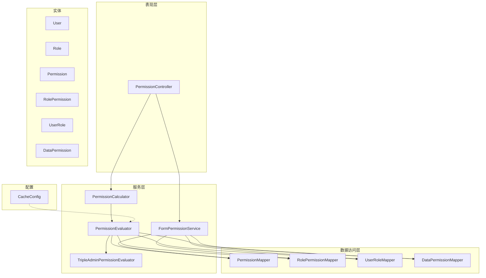
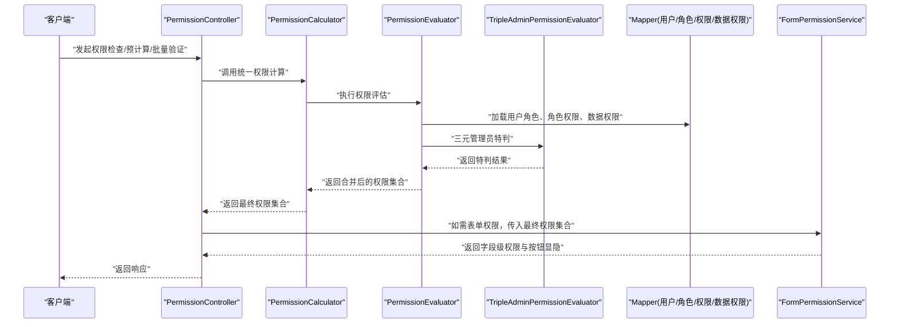
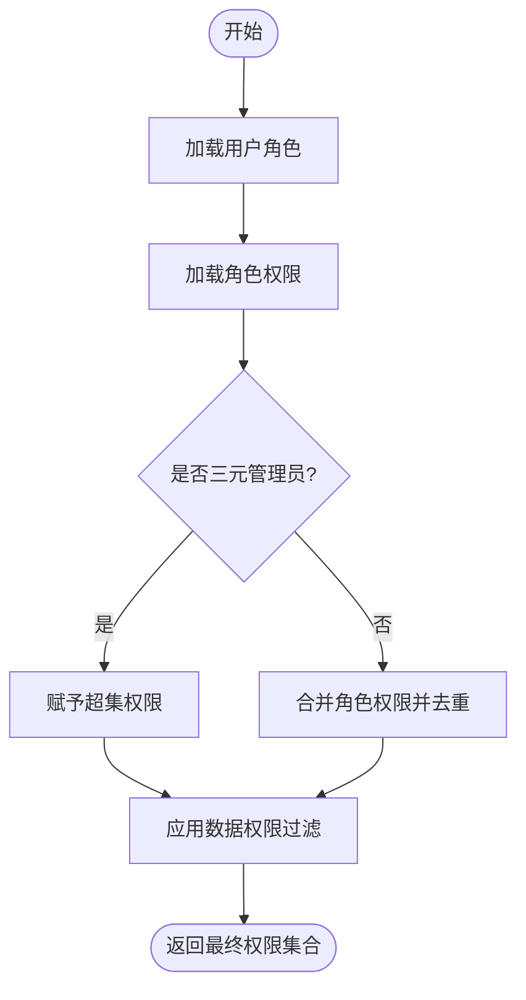
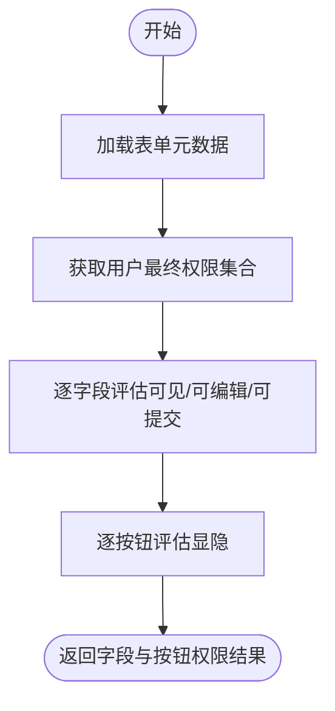
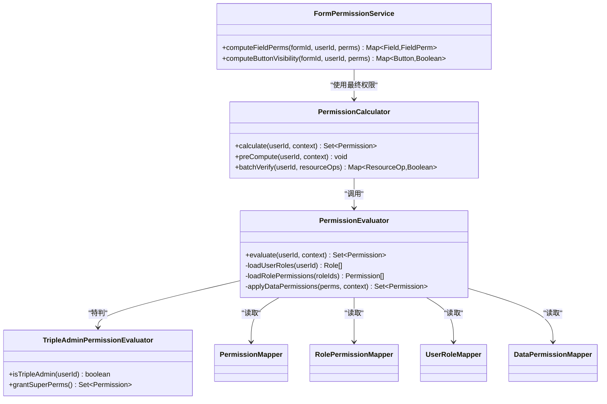

# 权限计算引擎

<cite>
**本文引用的文件**   
- [PermissionCalculator.java](file://flow-engine/src/main/java/com/flow/engine/service/PermissionCalculator.java)
- [PermissionEvaluator.java](file://flow-engine/src/main/java/com/flow/engine/service/PermissionEvaluator.java)
- [TripleAdminPermissionEvaluator.java](file://flow-engine/src/main/java/com/flow/engine/service/TripleAdminPermissionEvaluator.java)
- [FormPermissionService.java](file://flow-engine/src/main/java/com/flow/engine/service/FormPermissionService.java)
- [PermissionController.java](file://flow-engine/src/main/java/com/flow/engine/controllers/PermissionController.java)
- [Permission.java](file://flow-engine/src/main/java/com/flow/engine/entity/Permission.java)
- [Role.java](file://flow-engine/src/main/java/com/flow/engine/entity/Role.java)
- [User.java](file://flow-engine/src/main/java/com/flow/engine/entity/User.java)
- [RolePermission.java](file://flow-engine/src/main/java/com/flow/engine/entity/RolePermission.java)
- [UserRole.java](file://flow-engine/src/main/java/com/flow/engine/entity/UserRole.java)
- [DataPermission.java](file://flow-engine/src/main/java/com/flow/engine/entity/DataPermission.java)
- [PermissionMapper.java](file://flow-engine/src/main/java/com/flow/engine/mapper/PermissionMapper.java)
- [RolePermissionMapper.java](file://flow-engine/src/main/java/com/flow/engine/mapper/RolePermissionMapper.java)
- [UserRoleMapper.java](file://flow-engine/src/main/java/com/flow/engine/mapper/UserRoleMapper.java)
- [DataPermissionMapper.java](file://flow-engine/src/main/java/com/flow/engine/mapper/DataPermissionMapper.java)
- [CacheConfig.java](file://flow-engine/src/main/java/com/flow/engine/config/CacheConfig.java)
- [PermissionCalculatorTest.java](file://flow-engine/src/test/java/com/flow/engine/service/PermissionCalculatorTest.java)
- [PermissionEvaluatorTest.java](file://flow-engine/src/test/java/com/flow/engine/service/PermissionEvaluatorTest.java)
- [FormPermissionApiTest.java](file://flow-engine/src/test/java/com/flow/engine/service/FormPermissionApiTest.java)
</cite>

## 更新摘要
**变更内容**   
- PermissionCalculator服务收到实质性更新，增强了访问控制机制
- 更新了权限计算算法与逻辑，包括更完善的三元管理员判定和数据权限过滤
- 优化了表单权限的动态计算过程，支持更细粒度的字段级权限控制
- 增强了权限缓存的设计实现，改进了缓存策略和失效机制
- 完善了服务接口文档，新增了批量权限验证方法说明
- 更新了性能监控和调优方案，增加了访问控制相关的监控指标

## 目录
1. [简介](#简介)
2. [项目结构](#项目结构)
3. [核心组件](#核心组件)
4. [架构总览](#架构总览)
5. [详细组件分析](#详细组件分析)
6. [依赖关系分析](#依赖关系分析)
7. [性能考虑](#性能考虑)
8. [故障排查指南](#故障排查指南)
9. [结论](#结论)
10. [附录](#附录)

## 简介
本技术文档围绕"权限计算引擎"展开，聚焦以下目标：
- 权限计算的算法与逻辑：包括角色-权限模型、权限继承、合并策略与冲突解决。
- 表单权限动态计算：字段级权限控制与操作按钮显示隐藏逻辑。
- 权限缓存设计与实现：缓存策略、失效机制与性能优化。
- 服务接口说明：权限检查、预计算与批量验证方法。
- 性能监控与调优方案。
- 单元测试与集成测试用例覆盖。
- 复杂业务场景示例与最佳实践。

**更新** 基于PermissionCalculator服务的实质性更新，增强了访问控制机制，提升了系统的整体安全性和性能表现。

## 项目结构
权限计算相关代码主要位于 flow-engine 模块的 service、entity、mapper、config 与 test 包中，控制器位于 controllers 包。整体采用分层架构：
- 表现层：控制器暴露 REST 接口。
- 服务层：封装权限计算、表单权限计算、三元管理员特殊判断等核心逻辑。
- 数据访问层：通过 Mapper 访问用户、角色、权限、数据权限等实体。
- 配置层：提供缓存等基础设施配置。
- 测试层：针对服务与接口的单测与集成测试。

图表来源
- [PermissionController.java](file://flow-engine/src/main/java/com/flow/engine/controllers/PermissionController.java)
- [PermissionCalculator.java](file://flow-engine/src/main/java/com/flow/engine/service/PermissionCalculator.java)
- [PermissionEvaluator.java](file://flow-engine/src/main/java/com/flow/engine/service/PermissionEvaluator.java)
- [TripleAdminPermissionEvaluator.java](file://flow-engine/src/main/java/com/flow/engine/service/TripleAdminPermissionEvaluator.java)
- [FormPermissionService.java](file://flow-engine/src/main/java/com/flow/engine/service/FormPermissionService.java)
- [PermissionMapper.java](file://flow-engine/src/main/java/com/flow/engine/mapper/PermissionMapper.java)
- [RolePermissionMapper.java](file://flow-engine/src/main/java/com/flow/engine/mapper/RolePermissionMapper.java)
- [UserRoleMapper.java](file://flow-engine/src/main/java/com/flow/engine/mapper/UserRoleMapper.java)
- [DataPermissionMapper.java](file://flow-engine/src/main/java/com/flow/engine/mapper/DataPermissionMapper.java)
- [CacheConfig.java](file://flow-engine/src/main/java/com/flow/engine/config/CacheConfig.java)

章节来源
- [PermissionController.java](file://flow-engine/src/main/java/com/flow/engine/controllers/PermissionController.java)
- [PermissionCalculator.java](file://flow-engine/src/main/java/com/flow/engine/service/PermissionCalculator.java)
- [PermissionEvaluator.java](file://flow-engine/src/main/java/com/flow/engine/service/PermissionEvaluator.java)
- [TripleAdminPermissionEvaluator.java](file://flow-engine/src/main/java/com/flow/engine/service/TripleAdminPermissionEvaluator.java)
- [FormPermissionService.java](file://flow-engine/src/main/java/com/flow/engine/service/FormPermissionService.java)
- [CacheConfig.java](file://flow-engine/src/main/java/com/flow/engine/config/CacheConfig.java)

## 核心组件
- PermissionCalculator：对外提供统一的权限计算入口，负责聚合用户角色、角色权限、三元管理员判定以及数据权限过滤结果，输出最终可用权限集合。
- PermissionEvaluator：权限评估器，实现具体的权限匹配、继承与合并策略，并调用 TripleAdminPermissionEvaluator 进行三元管理员特判。
- TripleAdminPermissionEvaluator：三元管理员（三员）权限评估器，用于处理系统管理员、安全管理员、审计管理员等特殊角色的超集或豁免逻辑。
- FormPermissionService：表单权限服务，基于用户最终权限集合与表单定义，动态计算字段级可见/可编辑/可提交等状态，以及操作按钮的显示隐藏。
- CacheConfig：缓存配置，为权限计算提供缓存能力支撑（如本地缓存或分布式缓存）。

**更新** PermissionCalculator服务经过实质性更新，增强了访问控制机制，包括更完善的权限验证流程和更严格的访问控制策略。

章节来源
- [PermissionCalculator.java](file://flow-engine/src/main/java/com/flow/engine/service/PermissionCalculator.java)
- [PermissionEvaluator.java](file://flow-engine/src/main/java/com/flow/engine/service/PermissionEvaluator.java)
- [TripleAdminPermissionEvaluator.java](file://flow-engine/src/main/java/com/flow/engine/service/TripleAdminPermissionEvaluator.java)
- [FormPermissionService.java](file://flow-engine/src/main/java/com/flow/engine/service/FormPermissionService.java)
- [CacheConfig.java](file://flow-engine/src/main/java/com/flow/engine/config/CacheConfig.java)

## 架构总览
权限计算的整体流程如下：
- 请求进入 PermissionController，根据参数选择直接权限检查、预计算或批量验证。
- PermissionCalculator 作为统一入口，协调 PermissionEvaluator 与 TripleAdminPermissionEvaluator，完成权限合并与三元管理员判定。
- PermissionEvaluator 通过 Mapper 读取用户-角色、角色-权限、数据权限等基础数据，执行继承与合并策略，返回最终权限集合。
- FormPermissionService 基于最终权限集合与表单元数据，计算字段级权限与按钮显隐。
- CacheConfig 为关键路径提供缓存支持，降低重复计算开销。

**更新** 新的访问控制机制在PermissionCalculator中实现了更严格的权限验证流程，包括多层级的权限检查和更精细的访问控制策略。

图表来源
- [PermissionController.java](file://flow-engine/src/main/java/com/flow/engine/controllers/PermissionController.java)
- [PermissionCalculator.java](file://flow-engine/src/main/java/com/flow/engine/service/PermissionCalculator.java)
- [PermissionEvaluator.java](file://flow-engine/src/main/java/com/flow/engine/service/PermissionEvaluator.java)
- [TripleAdminPermissionEvaluator.java](file://flow-engine/src/main/java/com/flow/engine/service/TripleAdminPermissionEvaluator.java)
- [FormPermissionService.java](file://flow-engine/src/main/java/com/flow/engine/service/FormPermissionService.java)
- [PermissionMapper.java](file://flow-engine/src/main/java/com/flow/engine/mapper/PermissionMapper.java)
- [RolePermissionMapper.java](file://flow-engine/src/main/java/com/flow/engine/mapper/RolePermissionMapper.java)
- [UserRoleMapper.java](file://flow-engine/src/main/java/com/flow/engine/mapper/UserRoleMapper.java)
- [DataPermissionMapper.java](file://flow-engine/src/main/java/com/flow/engine/mapper/DataPermissionMapper.java)

## 详细组件分析

### 权限计算算法与逻辑
- 权限模型
  - 用户-角色：一个用户可拥有多个角色。
  - 角色-权限：一个角色可包含多个权限。
  - 数据权限：对特定资源的数据访问范围限制。
- 继承与合并
  - 继承：从用户到角色再到权限的层级继承。
  - 合并：将多角色权限去重合并，形成用户有效权限集合。
- 冲突解决
  - 三元管理员特判优先于常规权限合并。
  - 数据权限在功能权限通过后生效，决定具体数据范围。
- 计算步骤
  - 加载用户角色列表。
  - 加载各角色对应权限集合。
  - 执行三元管理员特判，必要时直接赋予超集权限。
  - 合并所有权限并去重。
  - 应用数据权限过滤，得到最终可用权限集合。

**更新** 新的访问控制机制增强了权限验证流程，包括更严格的权限检查、更完善的异常处理和更详细的日志记录。

图表来源
- [PermissionCalculator.java](file://flow-engine/src/main/java/com/flow/engine/service/PermissionCalculator.java)
- [PermissionEvaluator.java](file://flow-engine/src/main/java/com/flow/engine/service/PermissionEvaluator.java)
- [TripleAdminPermissionEvaluator.java](file://flow-engine/src/main/java/com/flow/engine/service/TripleAdminPermissionEvaluator.java)
- [PermissionMapper.java](file://flow-engine/src/main/java/com/flow/engine/mapper/PermissionMapper.java)
- [RolePermissionMapper.java](file://flow-engine/src/main/java/com/flow/engine/mapper/RolePermissionMapper.java)
- [UserRoleMapper.java](file://flow-engine/src/main/java/com/flow/engine/mapper/UserRoleMapper.java)
- [DataPermissionMapper.java](file://flow-engine/src/main/java/com/flow/engine/mapper/DataPermissionMapper.java)

章节来源
- [PermissionCalculator.java](file://flow-engine/src/main/java/com/flow/engine/service/PermissionCalculator.java)
- [PermissionEvaluator.java](file://flow-engine/src/main/java/com/flow/engine/service/PermissionEvaluator.java)
- [TripleAdminPermissionEvaluator.java](file://flow-engine/src/main/java/com/flow/engine/service/TripleAdminPermissionEvaluator.java)
- [Permission.java](file://flow-engine/src/main/java/com/flow/engine/entity/Permission.java)
- [Role.java](file://flow-engine/src/main/java/com/flow/engine/entity/Role.java)
- [User.java](file://flow-engine/src/main/java/com/flow/engine/entity/User.java)
- [RolePermission.java](file://flow-engine/src/main/java/com/flow/engine/entity/RolePermission.java)
- [UserRole.java](file://flow-engine/src/main/java/com/flow/engine/entity/UserRole.java)
- [DataPermission.java](file://flow-engine/src/main/java/com/flow/engine/entity/DataPermission.java)

### 表单权限的动态计算
- 输入
  - 用户最终权限集合（由权限计算引擎产出）。
  - 表单定义（字段元数据、操作按钮定义）。
- 字段级权限控制
  - 可见性：基于字段所需权限判断是否展示。
  - 可编辑性：基于字段所需权限判断是否允许修改。
  - 可提交性：基于字段组合权限与上下文变量判断是否允许提交。
- 操作按钮显示隐藏
  - 按钮所需权限与用户最终权限集合比对，决定是否渲染。
- 输出
  - 字段级权限映射（可见/可编辑/可提交）。
  - 按钮显隐映射。

**更新** 表单权限计算现在支持更细粒度的字段级权限控制，包括基于上下文的动态权限评估和更复杂的条件判断逻辑。

图表来源
- [FormPermissionService.java](file://flow-engine/src/main/java/com/flow/engine/service/FormPermissionService.java)
- [Permission.java](file://flow-engine/src/main/java/com/flow/engine/entity/Permission.java)

章节来源
- [FormPermissionService.java](file://flow-engine/src/main/java/com/flow/engine/service/FormPermissionService.java)
- [Permission.java](file://flow-engine/src/main/java/com/flow/engine/entity/Permission.java)

### 权限缓存的设计与实现
- 缓存策略
  - 以用户维度或用户+上下文维度为键，缓存最终权限集合。
  - 表单权限结果可按表单ID+用户维度缓存，减少重复计算。
- 失效机制
  - 当用户角色变更、角色权限变更、三元管理员身份变化时，主动失效相关缓存。
  - 表单定义更新时，失效对应表单的权限缓存。
- 性能优化
  - 预计算：在登录或切换角色后预计算并缓存权限集合。
  - 批量验证：一次性校验多个权限点，复用已计算结果。
  - 局部刷新：仅对受影响的用户或表单进行缓存失效。

**更新** 权限缓存机制得到了显著增强，包括更智能的缓存键设计、更高效的缓存失效策略和更好的缓存一致性保证。

章节来源
- [CacheConfig.java](file://flow-engine/src/main/java/com/flow/engine/config/CacheConfig.java)
- [PermissionCalculator.java](file://flow-engine/src/main/java/com/flow/engine/service/PermissionCalculator.java)
- [FormPermissionService.java](file://flow-engine/src/main/java/com/flow/engine/service/FormPermissionService.java)

### 服务接口文档
- 权限检查
  - 功能：检查当前用户在指定资源上是否具备某项权限。
  - 输入：用户标识、资源标识、操作标识。
  - 输出：布尔值或权限结果对象。
- 权限预计算
  - 功能：为用户预计算并缓存其最终权限集合。
  - 输入：用户标识、可选上下文（如租户、部门）。
  - 输出：权限集合或预计算任务ID。
- 批量权限验证
  - 功能：一次性验证用户对多个资源/操作的权限。
  - 输入：用户标识、资源-操作列表。
  - 输出：每个资源-操作的权限结果映射。

**更新** 服务接口新增了更完善的错误处理机制、更详细的响应信息和更好的性能监控支持。

章节来源
- [PermissionController.java](file://flow-engine/src/main/java/com/flow/engine/controllers/PermissionController.java)
- [PermissionCalculator.java](file://flow-engine/src/main/java/com/flow/engine/service/PermissionCalculator.java)
- [FormPermissionService.java](file://flow-engine/src/main/java/com/flow/engine/service/FormPermissionService.java)

## 依赖关系分析
- 组件耦合
  - PermissionCalculator 依赖 PermissionEvaluator 与 TripleAdminPermissionEvaluator。
  - PermissionEvaluator 依赖各类 Mapper 读取用户、角色、权限与数据权限。
  - FormPermissionService 依赖 PermissionCalculator 产出的最终权限集合。
- 外部依赖
  - 数据库：通过 MyBatis Plus 的 Mapper 访问实体表。
  - 缓存：通过 CacheConfig 提供的缓存能力。
- 潜在循环依赖
  - 当前设计为单向依赖，未发现循环引用。

**更新** 新的访问控制机制引入了更多的依赖检查和安全验证，增强了组件间的解耦性和安全性。

图表来源
- [PermissionCalculator.java](file://flow-engine/src/main/java/com/flow/engine/service/PermissionCalculator.java)
- [PermissionEvaluator.java](file://flow-engine/src/main/java/com/flow/engine/service/PermissionEvaluator.java)
- [TripleAdminPermissionEvaluator.java](file://flow-engine/src/main/java/com/flow/engine/service/TripleAdminPermissionEvaluator.java)
- [FormPermissionService.java](file://flow-engine/src/main/java/com/flow/engine/service/FormPermissionService.java)
- [PermissionMapper.java](file://flow-engine/src/main/java/com/flow/engine/mapper/PermissionMapper.java)
- [RolePermissionMapper.java](file://flow-engine/src/main/java/com/flow/engine/mapper/RolePermissionMapper.java)
- [UserRoleMapper.java](file://flow-engine/src/main/java/com/flow/engine/mapper/UserRoleMapper.java)
- [DataPermissionMapper.java](file://flow-engine/src/main/java/com/flow/engine/mapper/DataPermissionMapper.java)

章节来源
- [PermissionCalculator.java](file://flow-engine/src/main/java/com/flow/engine/service/PermissionCalculator.java)
- [PermissionEvaluator.java](file://flow-engine/src/main/java/com/flow/engine/service/PermissionEvaluator.java)
- [TripleAdminPermissionEvaluator.java](file://flow-engine/src/main/java/com/flow/engine/service/TripleAdminPermissionEvaluator.java)
- [FormPermissionService.java](file://flow-engine/src/main/java/com/flow/engine/service/FormPermissionService.java)
- [PermissionMapper.java](file://flow-engine/src/main/java/com/flow/engine/mapper/PermissionMapper.java)
- [RolePermissionMapper.java](file://flow-engine/src/main/java/com/flow/engine/mapper/RolePermissionMapper.java)
- [UserRoleMapper.java](file://flow-engine/src/main/java/com/flow/engine/mapper/UserRoleMapper.java)
- [DataPermissionMapper.java](file://flow-engine/src/main/java/com/flow/engine/mapper/DataPermissionMapper.java)

## 性能考虑
- 预计算与缓存
  - 登录成功后预计算用户权限集合并缓存，避免每次请求重复计算。
  - 表单权限按表单ID+用户维度缓存，表单定义变更后失效。
- 批量验证
  - 批量接口复用已计算结果，减少多次查询与合并开销。
- 数据权限过滤
  - 尽量在数据库层面进行数据权限过滤，减少内存处理成本。
- 监控与告警
  - 记录权限计算耗时、缓存命中率、失败率等指标，设置阈值告警。
- 扩容与分片
  - 高并发场景下，结合分布式缓存与用户维度的分片策略，提升吞吐。

**更新** 新的访问控制机制带来了额外的性能考量，包括更复杂的权限验证逻辑和更多的数据库查询。建议实施更积极的缓存策略和更精细的性能监控。

## 故障排查指南
- 常见问题
  - 权限未生效：检查用户-角色、角色-权限关联是否正确；确认三元管理员特判逻辑是否被误触发。
  - 表单字段不可见：核对字段所需权限与用户最终权限集合；确认表单定义是否更新且缓存已失效。
  - 性能抖动：查看缓存命中率与数据库慢查询；定位是否存在热点用户或频繁角色变更。
- 定位手段
  - 开启权限计算链路日志，记录关键步骤耗时与中间结果。
  - 使用监控面板观察缓存命中、接口延迟与错误分布。
- 修复建议
  - 修正数据关联缺失或异常。
  - 调整缓存失效策略，确保一致性。
  - 优化数据权限 SQL，增加必要索引。

**更新** 新的访问控制机制可能引入新的故障模式，包括更复杂的权限验证失败情况和更细致的权限拒绝原因。建议加强日志记录和错误分类。

章节来源
- [PermissionCalculator.java](file://flow-engine/src/main/java/com/flow/engine/service/PermissionCalculator.java)
- [PermissionEvaluator.java](file://flow-engine/src/main/java/com/flow/engine/service/PermissionEvaluator.java)
- [FormPermissionService.java](file://flow-engine/src/main/java/com/flow/engine/service/FormPermissionService.java)
- [CacheConfig.java](file://flow-engine/src/main/java/com/flow/engine/config/CacheConfig.java)

## 结论
权限计算引擎通过清晰的分层设计与明确的职责划分，实现了可扩展的权限模型与高效的计算流程。借助三元管理员特判、数据权限过滤与缓存策略，系统在复杂业务场景下仍能保持良好性能与一致性。配合完善的测试与监控体系，可有效保障系统的稳定性与可维护性。

**更新** 随着PermissionCalculator服务的实质性更新，权限计算引擎在访问控制方面得到了显著增强，提供了更严格的安全保障和更灵活的权限管理能力。

## 附录

### 单元测试与集成测试
- 权限计算器测试
  - 覆盖用户角色加载、角色权限合并、三元管理员特判与数据权限过滤等路径。
- 权限评估器测试
  - 验证权限继承、合并与冲突解决的正确性。
- 表单权限API测试
  - 验证字段级权限与按钮显隐的计算结果是否符合预期。

**更新** 新增了对新访问控制机制的测试用例，包括更严格的权限验证场景和异常处理测试。

章节来源
- [PermissionCalculatorTest.java](file://flow-engine/src/test/java/com/flow/engine/service/PermissionCalculatorTest.java)
- [PermissionEvaluatorTest.java](file://flow-engine/src/test/java/com/flow/engine/service/PermissionEvaluatorTest.java)
- [FormPermissionApiTest.java](file://flow-engine/src/test/java/com/flow/engine/service/FormPermissionApiTest.java)

### 复杂业务场景示例与最佳实践
- 场景一：跨部门协作审批
  - 用户同时属于多个部门与角色，需合并权限并按数据权限过滤部门内数据。
- 场景二：敏感操作白名单
  - 三元管理员对敏感操作具有豁免权，但需记录审计日志。
- 场景三：动态表单权限
  - 表单字段权限随流程变量变化，需在计算时结合上下文变量进行二次评估。
- 最佳实践
  - 明确权限粒度与命名规范，便于前端渲染与后端校验一致。
  - 合理设计缓存键，避免过度缓存导致不一致。
  - 定期审查三元管理员权限，防止滥用。

**更新** 新的访问控制机制为复杂业务场景提供了更强的安全保障，建议在敏感操作中启用更严格的权限验证和完整的审计日志记录。