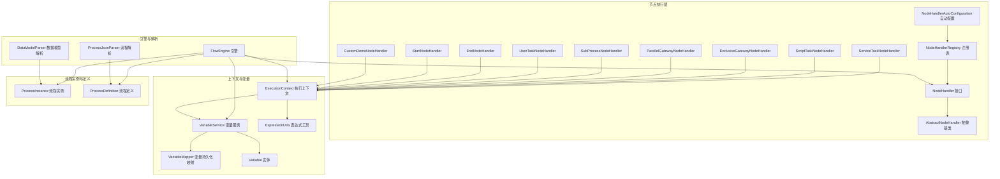
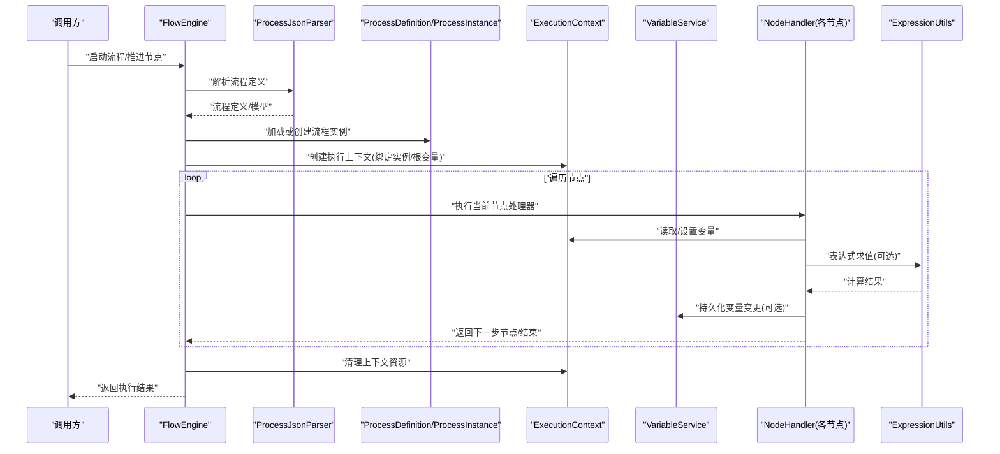
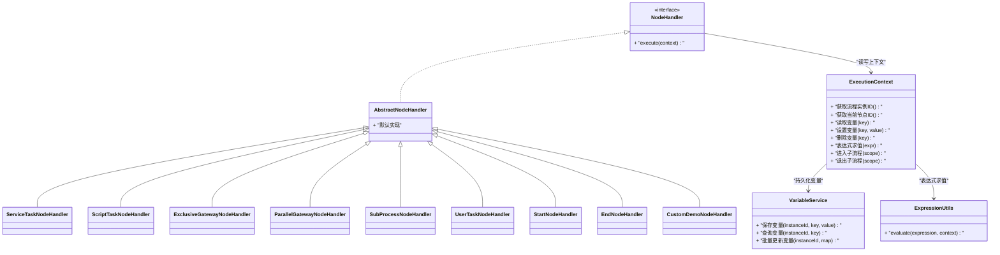
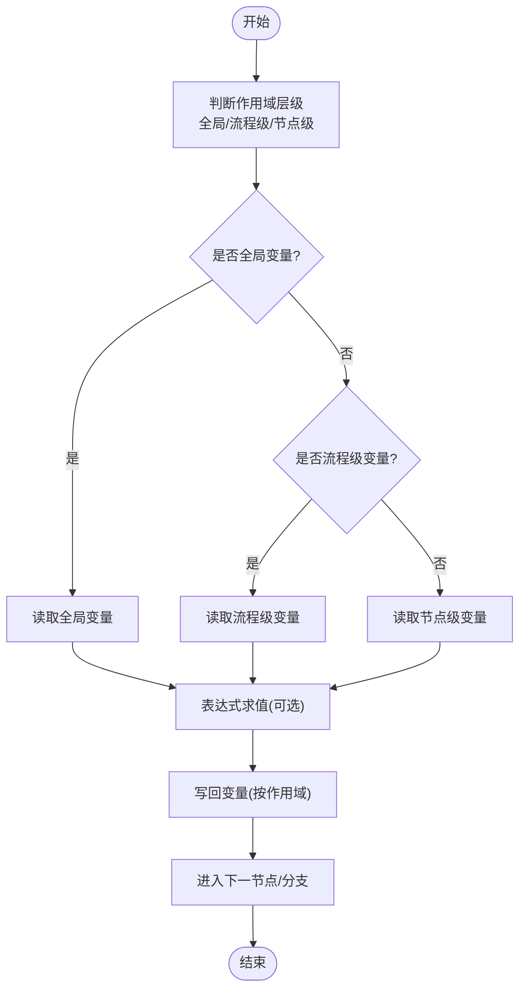
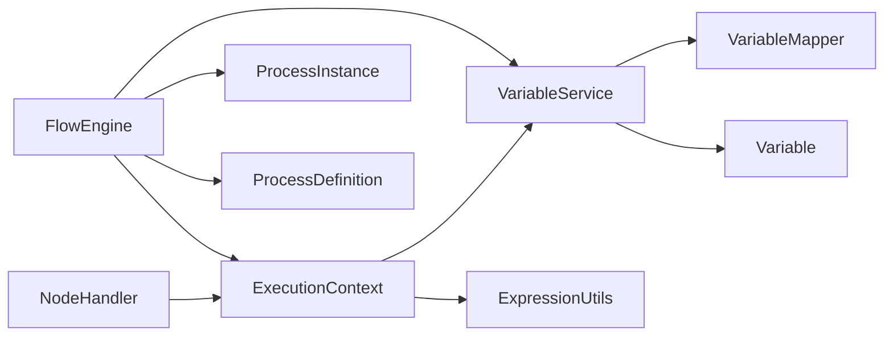

# 执行上下文管理

<cite>
**本文引用的文件**   
- [ExecutionContext.java](file://flow-engine/src/main/java/com/flow/engine/node/ExecutionContext.java)
- [NodeHandler.java](file://flow-engine/src/main/java/com/flow/engine/node/NodeHandler.java)
- [AbstractNodeHandler.java](file://flow-engine/src/main/java/com/flow/engine/node/AbstractNodeHandler.java)
- [ServiceTaskNodeHandler.java](file://flow-engine/src/main/java/com/flow/engine/node/impl/ServiceTaskNodeHandler.java)
- [ScriptTaskNodeHandler.java](file://flow-engine/src/main/java/com/flow/engine/node/impl/ScriptTaskNodeHandler.java)
- [Variable.java](file://flow-engine/src/main/java/com/flow/engine/entity/Variable.java)
- [VariableMapper.java](file://flow-engine/src/main/java/com/flow/engine/mapper/VariableMapper.java)
- [VariableService.java](file://flow-engine/src/main/java/com/flow/engine/service/VariableService.java)
- [ExpressionUtils.java](file://flow-engine/src/main/java/com/flow/engine/common/utils/ExpressionUtils.java)
- [FlowEngine.java](file://flow-engine/src/main/java/com/flow/engine/engine/FlowEngine.java)
- [ProcessInstanceService.java](file://flow-engine/src/main/java/com/flow/engine/service/ProcessInstanceService.java)
- [ProcessInstance.java](file://flow-engine/src/main/java/com/flow/engine/entity/ProcessInstance.java)
- [ProcessDefinition.java](file://flow-engine/src/main/java/com/flow/engine/entity/ProcessDefinition.java)
- [StartNodeHandler.java](file://flow-engine/src/main/java/com/flow/engine/node/impl/StartNodeHandler.java)
- [EndNodeHandler.java](file://flow-engine/src/main/java/com/flow/engine/node/impl/EndNodeHandler.java)
- [ExclusiveGatewayNodeHandler.java](file://flow-engine/src/main/java/com/flow/engine/node/impl/ExclusiveGatewayNodeHandler.java)
- [ParallelGatewayNodeHandler.java](file://flow-engine/src/main/java/com/flow/engine/node/impl/ParallelGatewayNodeHandler.java)
- [SubProcessNodeHandler.java](file://flow-engine/src/main/java/com/flow/engine/node/impl/SubProcessNodeHandler.java)
- [UserTaskNodeHandler.java](file://flow-engine/src/main/java/com/flow/engine/node/impl/UserTaskNodeHandler.java)
- [CustomDemoNodeHandler.java](file://flow-engine/src/main/java/com/flow/engine/node/impl/CustomDemoNodeHandler.java)
- [NodeHandlerRegistry.java](file://flow-engine/src/main/java/com/flow/engine/node/NodeHandlerRegistry.java)
- [NodeHandlerAutoConfiguration.java](file://flow-engine/src/main/java/com/flow/engine/node/NodeHandlerAutoConfiguration.java)
- [ProcessJsonParser.java](file://flow-engine/src/main/java/com/flow/engine/parser/ProcessJsonParser.java)
- [DataModelParser.java](file://flow-engine/src/main/java/com/flow/engine/parser/DataModelParser.java)
- [VariableTest.java](file://flow-engine/src/test/java/com/flow/engine/service/ProcessVariableTest.java)
- [ExecutionContextTest.java](file://flow-engine/src/test/java/com/flow/engine/node/ExecutionContextTest.java)
</cite>

## 目录
1. [简介](#简介)
2. [项目结构](#项目结构)
3. [核心组件](#核心组件)
4. [架构总览](#架构总览)
5. [详细组件分析](#详细组件分析)
6. [依赖关系分析](#依赖关系分析)
7. [性能考虑](#性能考虑)
8. [故障排查指南](#故障排查指南)
9. [结论](#结论)
10. [附录](#附录)

## 简介
本技术文档聚焦于“执行上下文管理”，围绕 ExecutionContext 类的设计与实现，系统阐述流程执行过程中的上下文信息管理与变量传递机制。文档覆盖以下主题：
- 变量的作用域层次（全局、流程级、节点级）及其使用场景
- 数据类型支持与表达式计算能力
- 上下文的创建、传递与销毁生命周期
- 并发环境下的线程安全保证
- 在节点处理器中使用上下文进行数据传递的最佳实践与示例路径

## 项目结构
与执行上下文相关的代码主要位于 flow-engine 模块的 node、service、entity、common/utils 等包中。下图给出与上下文管理相关的关键文件与职责概览。

图表来源
- [FlowEngine.java](file://flow-engine/src/main/java/com/flow/engine/engine/FlowEngine.java)
- [ExecutionContext.java](file://flow-engine/src/main/java/com/flow/engine/node/ExecutionContext.java)
- [NodeHandler.java](file://flow-engine/src/main/java/com/flow/engine/node/NodeHandler.java)
- [AbstractNodeHandler.java](file://flow-engine/src/main/java/com/flow/engine/node/AbstractNodeHandler.java)
- [VariableService.java](file://flow-engine/src/main/java/com/flow/engine/service/VariableService.java)
- [VariableMapper.java](file://flow-engine/src/main/java/com/flow/engine/mapper/VariableMapper.java)
- [Variable.java](file://flow-engine/src/main/java/com/flow/engine/entity/Variable.java)
- [ExpressionUtils.java](file://flow-engine/src/main/java/com/flow/engine/common/utils/ExpressionUtils.java)
- [ProcessJsonParser.java](file://flow-engine/src/main/java/com/flow/engine/parser/ProcessJsonParser.java)
- [DataModelParser.java](file://flow-engine/src/main/java/com/flow/engine/parser/DataModelParser.java)
- [ProcessInstance.java](file://flow-engine/src/main/java/com/flow/engine/entity/ProcessInstance.java)
- [ProcessDefinition.java](file://flow-engine/src/main/java/com/flow/engine/entity/ProcessDefinition.java)
- [ServiceTaskNodeHandler.java](file://flow-engine/src/main/java/com/flow/engine/node/impl/ServiceTaskNodeHandler.java)
- [ScriptTaskNodeHandler.java](file://flow-engine/src/main/java/com/flow/engine/node/impl/ScriptTaskNodeHandler.java)
- [ExclusiveGatewayNodeHandler.java](file://flow-engine/src/main/java/com/flow/engine/node/impl/ExclusiveGatewayNodeHandler.java)
- [ParallelGatewayNodeHandler.java](file://flow-engine/src/main/java/com/flow/engine/node/impl/ParallelGatewayNodeHandler.java)
- [SubProcessNodeHandler.java](file://flow-engine/src/main/java/com/flow/engine/node/impl/SubProcessNodeHandler.java)
- [UserTaskNodeHandler.java](file://flow-engine/src/main/java/com/flow/engine/node/impl/UserTaskNodeHandler.java)
- [StartNodeHandler.java](file://flow-engine/src/main/java/com/flow/engine/node/impl/StartNodeHandler.java)
- [EndNodeHandler.java](file://flow-engine/src/main/java/com/flow/engine/node/impl/EndNodeHandler.java)
- [CustomDemoNodeHandler.java](file://flow-engine/src/main/java/com/flow/engine/node/impl/CustomDemoNodeHandler.java)
- [NodeHandlerRegistry.java](file://flow-engine/src/main/java/com/flow/engine/node/NodeHandlerRegistry.java)
- [NodeHandlerAutoConfiguration.java](file://flow-engine/src/main/java/com/flow/engine/node/NodeHandlerAutoConfiguration.java)

章节来源
- [FlowEngine.java](file://flow-engine/src/main/java/com/flow/engine/engine/FlowEngine.java)
- [ExecutionContext.java](file://flow-engine/src/main/java/com/flow/engine/node/ExecutionContext.java)
- [VariableService.java](file://flow-engine/src/main/java/com/flow/engine/service/VariableService.java)
- [ExpressionUtils.java](file://flow-engine/src/main/java/com/flow/engine/common/utils/ExpressionUtils.java)

## 核心组件
- 执行上下文 ExecutionContext：封装流程运行期的可变状态，提供变量读写、表达式求值、当前节点信息与流程实例关联等能力。
- 变量服务 VariableService：负责变量的持久化、查询与更新，向上层暴露统一的变量操作 API。
- 表达式工具 ExpressionUtils：提供表达式解析与求值能力，支持对上下文中的变量进行动态计算。
- 节点处理器 NodeHandler 体系：各具体节点处理器通过 ExecutionContext 读取/写入变量，完成业务逻辑并影响后续流转。
- 流程引擎 FlowEngine：编排节点执行，负责上下文的生命周期管理（创建、传递、销毁）。

章节来源
- [ExecutionContext.java](file://flow-engine/src/main/java/com/flow/engine/node/ExecutionContext.java)
- [VariableService.java](file://flow-engine/src/main/java/com/flow/engine/service/VariableService.java)
- [ExpressionUtils.java](file://flow-engine/src/main/java/com/flow/engine/common/utils/ExpressionUtils.java)
- [NodeHandler.java](file://flow-engine/src/main/java/com/flow/engine/node/NodeHandler.java)
- [AbstractNodeHandler.java](file://flow-engine/src/main/java/com/flow/engine/node/AbstractNodeHandler.java)
- [FlowEngine.java](file://flow-engine/src/main/java/com/flow/engine/engine/FlowEngine.java)

## 架构总览
下图展示从流程启动到节点执行的端到端调用链，以及 ExecutionContext 在各阶段的参与方式。

图表来源
- [FlowEngine.java](file://flow-engine/src/main/java/com/flow/engine/engine/FlowEngine.java)
- [ProcessJsonParser.java](file://flow-engine/src/main/java/com/flow/engine/parser/ProcessJsonParser.java)
- [ProcessDefinition.java](file://flow-engine/src/main/java/com/flow/engine/entity/ProcessDefinition.java)
- [ProcessInstance.java](file://flow-engine/src/main/java/com/flow/engine/entity/ProcessInstance.java)
- [ExecutionContext.java](file://flow-engine/src/main/java/com/flow/engine/node/ExecutionContext.java)
- [VariableService.java](file://flow-engine/src/main/java/com/flow/engine/service/VariableService.java)
- [ExpressionUtils.java](file://flow-engine/src/main/java/com/flow/engine/common/utils/ExpressionUtils.java)
- [NodeHandler.java](file://flow-engine/src/main/java/com/flow/engine/node/NodeHandler.java)

## 详细组件分析

### ExecutionContext 设计与职责
- 上下文定位：作为流程运行期的“工作内存”，承载当前流程实例、节点元数据、变量空间与表达式求值器。
- 变量作用域层次：
  - 全局变量：跨流程实例共享（如字典、系统参数），通常由外部初始化，不随实例生命周期变化。
  - 流程级变量：绑定到单个流程实例，贯穿该实例的所有节点，用于传递业务主数据与中间结果。
  - 节点级变量：仅在当前节点执行期间有效，适合临时计算结果，避免污染上层作用域。
- 变量类型与表达式：
  - 支持基础类型、集合、对象等常见数据结构；表达式通过 ExpressionUtils 进行求值，可引用上下文变量。
- 生命周期：
  - 创建：在流程启动或进入新分支时由引擎创建，并注入流程实例与初始变量。
  - 传递：在节点间流转时，上下文被复用或克隆，确保变量可见性与隔离性。
  - 销毁：流程结束或异常终止后，释放资源并清理临时变量。

图表来源
- [ExecutionContext.java](file://flow-engine/src/main/java/com/flow/engine/node/ExecutionContext.java)
- [VariableService.java](file://flow-engine/src/main/java/com/flow/engine/service/VariableService.java)
- [ExpressionUtils.java](file://flow-engine/src/main/java/com/flow/engine/common/utils/ExpressionUtils.java)
- [NodeHandler.java](file://flow-engine/src/main/java/com/flow/engine/node/NodeHandler.java)
- [AbstractNodeHandler.java](file://flow-engine/src/main/java/com/flow/engine/node/AbstractNodeHandler.java)
- [ServiceTaskNodeHandler.java](file://flow-engine/src/main/java/com/flow/engine/node/impl/ServiceTaskNodeHandler.java)
- [ScriptTaskNodeHandler.java](file://flow-engine/src/main/java/com/flow/engine/node/impl/ScriptTaskNodeHandler.java)
- [ExclusiveGatewayNodeHandler.java](file://flow-engine/src/main/java/com/flow/engine/node/impl/ExclusiveGatewayNodeHandler.java)
- [ParallelGatewayNodeHandler.java](file://flow-engine/src/main/java/com/flow/engine/node/impl/ParallelGatewayNodeHandler.java)
- [SubProcessNodeHandler.java](file://flow-engine/src/main/java/com/flow/engine/node/impl/SubProcessNodeHandler.java)
- [UserTaskNodeHandler.java](file://flow-engine/src/main/java/com/flow/engine/node/impl/UserTaskNodeHandler.java)
- [StartNodeHandler.java](file://flow-engine/src/main/java/com/flow/engine/node/impl/StartNodeHandler.java)
- [EndNodeHandler.java](file://flow-engine/src/main/java/com/flow/engine/node/impl/EndNodeHandler.java)
- [CustomDemoNodeHandler.java](file://flow-engine/src/main/java/com/flow/engine/node/impl/CustomDemoNodeHandler.java)

章节来源
- [ExecutionContext.java](file://flow-engine/src/main/java/com/flow/engine/node/ExecutionContext.java)
- [VariableService.java](file://flow-engine/src/main/java/com/flow/engine/service/VariableService.java)
- [ExpressionUtils.java](file://flow-engine/src/main/java/com/flow/engine/common/utils/ExpressionUtils.java)
- [NodeHandler.java](file://flow-engine/src/main/java/com/flow/engine/node/NodeHandler.java)
- [AbstractNodeHandler.java](file://flow-engine/src/main/java/com/flow/engine/node/AbstractNodeHandler.java)

### 变量作用域与传递机制
- 作用域层次
  - 全局变量：系统级常量或字典，供所有流程实例访问。
  - 流程级变量：绑定到 ProcessInstance，贯穿整个流程生命周期。
  - 节点级变量：仅在节点执行范围内有效，常用于中间计算结果。
- 传递策略
  - 顺序节点：上下文直接复用，变量可见性按写入顺序传播。
  - 并行网关：每个分支拥有独立的上下文副本，合并时按策略聚合变量。
  - 子流程：进入子流程时创建新的上下文作用域，退出时可选择将局部变量提升为父流程变量。
- 表达式求值
  - 通过 ExpressionUtils 对表达式进行解析与求值，支持引用上下文变量与函数。

图表来源
- [ExecutionContext.java](file://flow-engine/src/main/java/com/flow/engine/node/ExecutionContext.java)
- [ExpressionUtils.java](file://flow-engine/src/main/java/com/flow/engine/common/utils/ExpressionUtils.java)
- [VariableService.java](file://flow-engine/src/main/java/com/flow/engine/service/VariableService.java)

章节来源
- [ExecutionContext.java](file://flow-engine/src/main/java/com/flow/engine/node/ExecutionContext.java)
- [VariableService.java](file://flow-engine/src/main/java/com/flow/engine/service/VariableService.java)
- [ExpressionUtils.java](file://flow-engine/src/main/java/com/flow/engine/common/utils/ExpressionUtils.java)

### 并发与线程安全
- 单实例上下文：每个流程实例对应一个 ExecutionContext，避免跨实例变量污染。
- 并行分支：并行网关为每个分支创建独立上下文副本，防止分支间相互干扰。
- 原子更新：变量更新通过 VariableService 提供的原子接口进行，减少竞态条件。
- 不可变快照：在关键决策点（如网关分支选择）可对上下文生成只读快照，保障一致性。

章节来源
- [ParallelGatewayNodeHandler.java](file://flow-engine/src/main/java/com/flow/engine/node/impl/ParallelGatewayNodeHandler.java)
- [VariableService.java](file://flow-engine/src/main/java/com/flow/engine/service/VariableService.java)
- [ExecutionContext.java](file://flow-engine/src/main/java/com/flow/engine/node/ExecutionContext.java)

### 在节点处理器中使用上下文的数据传递示例
以下为典型用法路径（不包含具体代码内容）：
- 在服务任务中读取输入变量并计算输出变量：[ServiceTaskNodeHandler.java](file://flow-engine/src/main/java/com/flow/engine/node/impl/ServiceTaskNodeHandler.java)
- 在脚本任务中通过表达式动态计算字段：[ScriptTaskNodeHandler.java](file://flow-engine/src/main/java/com/flow/engine/node/impl/ScriptTaskNodeHandler.java)
- 在排他网关中基于变量决定分支走向：[ExclusiveGatewayNodeHandler.java](file://flow-engine/src/main/java/com/flow/engine/node/impl/ExclusiveGatewayNodeHandler.java)
- 在并行网关中为每个分支维护独立上下文：[ParallelGatewayNodeHandler.java](file://flow-engine/src/main/java/com/flow/engine/node/impl/ParallelGatewayNodeHandler.java)
- 在子流程中创建子作用域并在退出时合并变量：[SubProcessNodeHandler.java](file://flow-engine/src/main/java/com/flow/engine/node/impl/SubProcessNodeHandler.java)
- 在用户任务中收集表单数据并写入流程变量：[UserTaskNodeHandler.java](file://flow-engine/src/main/java/com/flow/engine/node/impl/UserTaskNodeHandler.java)
- 自定义节点示例参考：[CustomDemoNodeHandler.java](file://flow-engine/src/main/java/com/flow/engine/node/impl/CustomDemoNodeHandler.java)

章节来源
- [ServiceTaskNodeHandler.java](file://flow-engine/src/main/java/com/flow/engine/node/impl/ServiceTaskNodeHandler.java)
- [ScriptTaskNodeHandler.java](file://flow-engine/src/main/java/com/flow/engine/node/impl/ScriptTaskNodeHandler.java)
- [ExclusiveGatewayNodeHandler.java](file://flow-engine/src/main/java/com/flow/engine/node/impl/ExclusiveGatewayNodeHandler.java)
- [ParallelGatewayNodeHandler.java](file://flow-engine/src/main/java/com/flow/engine/node/impl/ParallelGatewayNodeHandler.java)
- [SubProcessNodeHandler.java](file://flow-engine/src/main/java/com/flow/engine/node/impl/SubProcessNodeHandler.java)
- [UserTaskNodeHandler.java](file://flow-engine/src/main/java/com/flow/engine/node/impl/UserTaskNodeHandler.java)
- [CustomDemoNodeHandler.java](file://flow-engine/src/main/java/com/flow/engine/node/impl/CustomDemoNodeHandler.java)

## 依赖关系分析
- 组件耦合
  - ExecutionContext 依赖 VariableService 与 ExpressionUtils，形成“上下文-变量-表达式”的核心三角。
  - 节点处理器统一通过 NodeHandler 接口与 ExecutionContext 交互，降低与具体实现的耦合。
- 外部依赖
  - 变量持久化通过 VariableMapper 与 Variable 实体完成。
  - 流程定义与实例通过 ProcessDefinition 与 ProcessInstance 提供元数据与运行时状态。
- 潜在循环依赖
  - 当前设计通过接口与分层避免循环依赖；若新增功能需引入回调，应谨慎评估方向性。

图表来源
- [ExecutionContext.java](file://flow-engine/src/main/java/com/flow/engine/node/ExecutionContext.java)
- [VariableService.java](file://flow-engine/src/main/java/com/flow/engine/service/VariableService.java)
- [VariableMapper.java](file://flow-engine/src/main/java/com/flow/engine/mapper/VariableMapper.java)
- [Variable.java](file://flow-engine/src/main/java/com/flow/engine/entity/Variable.java)
- [ExpressionUtils.java](file://flow-engine/src/main/java/com/flow/engine/common/utils/ExpressionUtils.java)
- [NodeHandler.java](file://flow-engine/src/main/java/com/flow/engine/node/NodeHandler.java)
- [FlowEngine.java](file://flow-engine/src/main/java/com/flow/engine/engine/FlowEngine.java)
- [ProcessInstance.java](file://flow-engine/src/main/java/com/flow/engine/entity/ProcessInstance.java)
- [ProcessDefinition.java](file://flow-engine/src/main/java/com/flow/engine/entity/ProcessDefinition.java)

章节来源
- [ExecutionContext.java](file://flow-engine/src/main/java/com/flow/engine/node/ExecutionContext.java)
- [VariableService.java](file://flow-engine/src/main/java/com/flow/engine/service/VariableService.java)
- [VariableMapper.java](file://flow-engine/src/main/java/com/flow/engine/mapper/VariableMapper.java)
- [Variable.java](file://flow-engine/src/main/java/com/flow/engine/entity/Variable.java)
- [ExpressionUtils.java](file://flow-engine/src/main/java/com/flow/engine/common/utils/ExpressionUtils.java)
- [NodeHandler.java](file://flow-engine/src/main/java/com/flow/engine/node/NodeHandler.java)
- [FlowEngine.java](file://flow-engine/src/main/java/com/flow/engine/engine/FlowEngine.java)
- [ProcessInstance.java](file://flow-engine/src/main/java/com/flow/engine/entity/ProcessInstance.java)
- [ProcessDefinition.java](file://flow-engine/src/main/java/com/flow/engine/entity/ProcessDefinition.java)

## 性能考虑
- 变量访问优化
  - 优先使用批量更新接口减少数据库往返。
  - 热点变量采用本地缓存（注意作用域隔离与失效策略）。
- 表达式求值优化
  - 预编译常用表达式，避免重复解析。
  - 限制表达式复杂度，避免长耗时计算阻塞节点执行。
- 上下文拷贝成本
  - 并行分支上下文复制应尽量浅拷贝，必要时按需深拷贝。
- I/O 与事务
  - 将变量持久化纳入事务边界，减少部分提交带来的不一致风险。

[本节为通用指导，无需列出具体文件来源]

## 故障排查指南
- 常见问题
  - 变量未生效：检查变量作用域是否正确、是否在正确的节点写入。
  - 表达式报错：确认表达式语法与上下文变量名一致，必要时打印上下文快照。
  - 并发冲突：并行分支变量覆盖导致结果异常，建议使用唯一命名空间或原子更新。
- 调试建议
  - 在关键节点前后记录上下文快照（变量键值对）。
  - 使用单元测试验证变量传递链路，参考测试用例路径。

章节来源
- [ExecutionContextTest.java](file://flow-engine/src/test/java/com/flow/engine/node/ExecutionContextTest.java)
- [ProcessVariableTest.java](file://flow-engine/src/test/java/com/flow/engine/service/ProcessVariableTest.java)

## 结论
ExecutionContext 作为流程执行期的核心载体，提供了清晰的变量作用域划分、灵活的表达式求值与可靠的并发安全保障。通过规范的上下文创建、传递与销毁机制，结合 VariableService 与 ExpressionUtils 的能力，能够在复杂业务流程中实现稳定高效的数据流转。遵循本文最佳实践与性能建议，可进一步提升系统的可维护性与可扩展性。

[本节为总结性内容，无需列出具体文件来源]

## 附录
- 相关入口与装配
  - 节点处理器自动装配与注册：[NodeHandlerAutoConfiguration.java](file://flow-engine/src/main/java/com/flow/engine/node/NodeHandlerAutoConfiguration.java)、[NodeHandlerRegistry.java](file://flow-engine/src/main/java/com/flow/engine/node/NodeHandlerRegistry.java)
  - 流程定义与数据模型解析：[ProcessJsonParser.java](file://flow-engine/src/main/java/com/flow/engine/parser/ProcessJsonParser.java)、[DataModelParser.java](file://flow-engine/src/main/java/com/flow/engine/parser/DataModelParser.java)
- 测试参考
  - 上下文行为与变量传递测试：[ExecutionContextTest.java](file://flow-engine/src/test/java/com/flow/engine/node/ExecutionContextTest.java)、[ProcessVariableTest.java](file://flow-engine/src/test/java/com/flow/engine/service/ProcessVariableTest.java)

章节来源
- [NodeHandlerAutoConfiguration.java](file://flow-engine/src/main/java/com/flow/engine/node/NodeHandlerAutoConfiguration.java)
- [NodeHandlerRegistry.java](file://flow-engine/src/main/java/com/flow/engine/node/NodeHandlerRegistry.java)
- [ProcessJsonParser.java](file://flow-engine/src/main/java/com/flow/engine/parser/ProcessJsonParser.java)
- [DataModelParser.java](file://flow-engine/src/main/java/com/flow/engine/parser/DataModelParser.java)
- [ExecutionContextTest.java](file://flow-engine/src/test/java/com/flow/engine/node/ExecutionContextTest.java)
- [ProcessVariableTest.java](file://flow-engine/src/test/java/com/flow/engine/service/ProcessVariableTest.java)