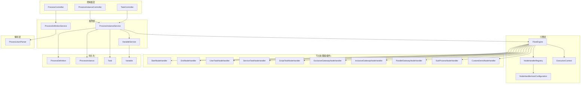
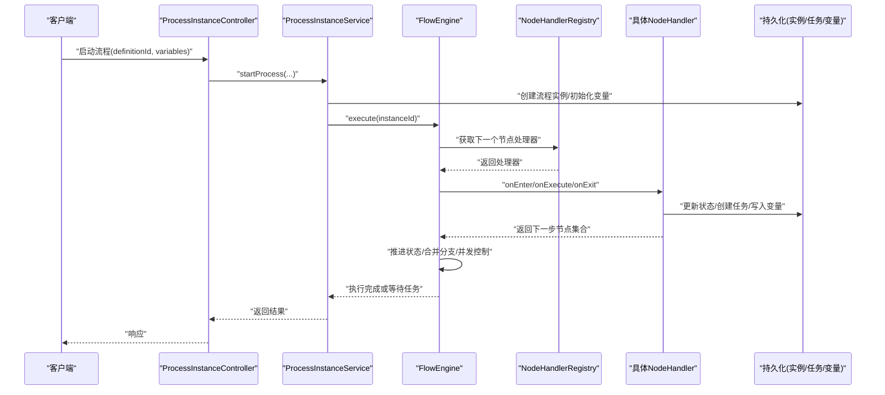
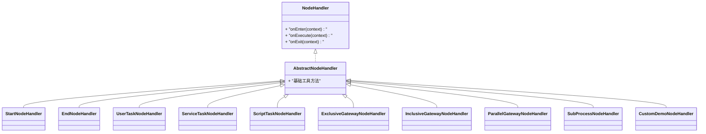
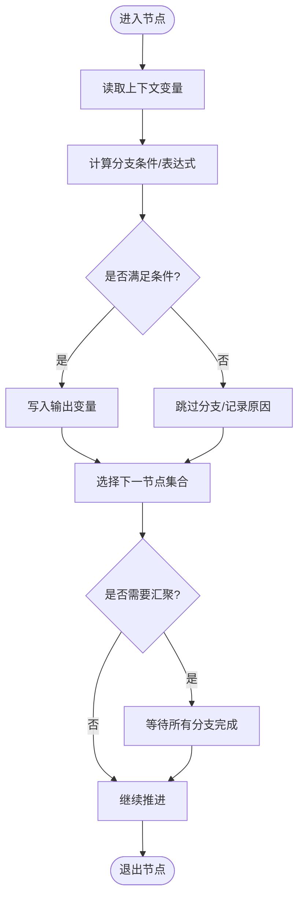
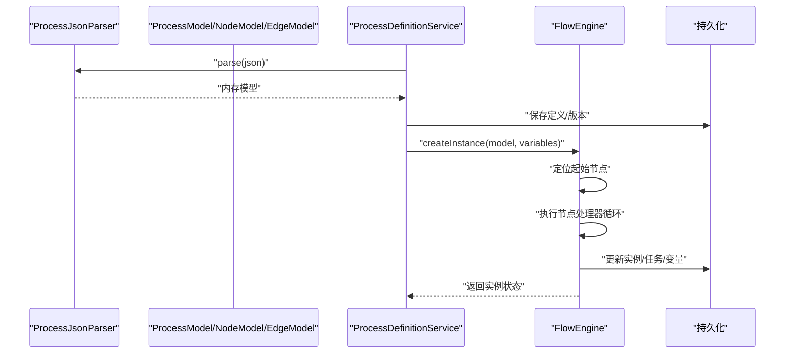
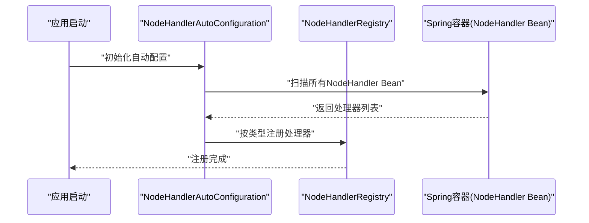
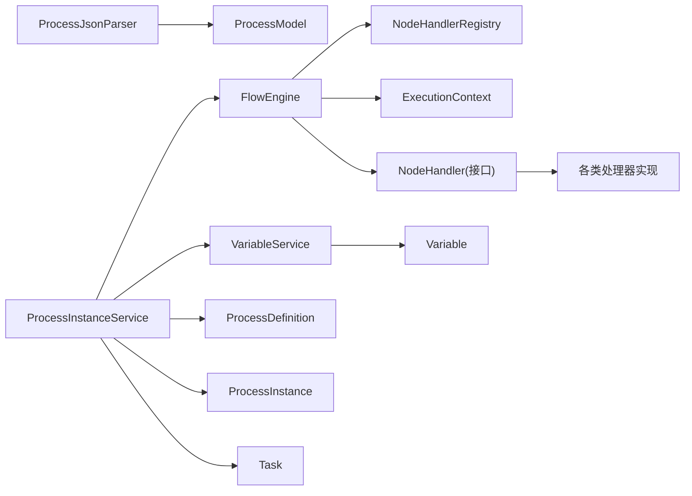

# 核心引擎设计

<cite>
**本文引用的文件**   
- [FlowEngine.java](file://flow-engine/src/main/java/com/flow/engine/engine/FlowEngine.java)
- [NodeExecutor.java](file://flow-engine/src/main/java/com/flow/engine/engine/NodeExecutor.java)
- [NodeHandler.java](file://flow-engine/src/main/java/com/flow/engine/node/NodeHandler.java)
- [AbstractNodeHandler.java](file://flow-engine/src/main/java/com/flow/engine/node/AbstractNodeHandler.java)
- [DummyNodeHandler.java](file://flow-engine/src/main/java/com/flow/engine/node/DummyNodeHandler.java)
- [StartNodeHandler.java](file://flow-engine/src/main/java/com/flow/engine/node/impl/StartNodeHandler.java)
- [EndNodeHandler.java](file://flow-engine/src/main/java/com/flow/engine/node/impl/EndNodeHandler.java)
- [UserTaskNodeHandler.java](file://flow-engine/src/main/java/com/flow/engine/node/impl/UserTaskNodeHandler.java)
- [ServiceTaskNodeHandler.java](file://flow-engine/src/main/java/com/flow/engine/node/impl/ServiceTaskNodeHandler.java)
- [ScriptTaskNodeHandler.java](file://flow-engine/src/main/java/com/flow/engine/node/impl/ScriptTaskNodeHandler.java)
- [ExclusiveGatewayNodeHandler.java](file://flow-engine/src/main/java/com/flow/engine/node/impl/ExclusiveGatewayNodeHandler.java)
- [InclusiveGatewayNodeHandler.java](file://flow-engine/src/main/java/com/flow/engine/node/impl/InclusiveGatewayNodeHandler.java)
- [ParallelGatewayNodeHandler.java](file://flow-engine/src/main/java/com/flow/engine/node/impl/ParallelGatewayNodeHandler.java)
- [SubProcessNodeHandler.java](file://flow-engine/src/main/java/com/flow/engine/node/impl/SubProcessNodeHandler.java)
- [CustomDemoNodeHandler.java](file://flow-engine/src/main/java/com/flow/engine/node/impl/CustomDemoNodeHandler.java)
- [ExecutionContext.java](file://flow-engine/src/main/java/com/flow/engine/node/ExecutionContext.java)
- [NodeHandlerRegistry.java](file://flow-engine/src/main/java/com/flow/engine/node/NodeHandlerRegistry.java)
- [NodeHandlerAutoConfiguration.java](file://flow-engine/src/main/java/com/flow/engine/node/NodeHandlerAutoConfiguration.java)
- [ProcessJsonParser.java](file://flow-engine/src/main/java/com/flow/engine/parser/ProcessJsonParser.java)
- [ProcessDefinitionService.java](file://flow-engine/src/main/java/com/flow/engine/service/ProcessDefinitionService.java)
- [ProcessInstanceService.java](file://flow-engine/src/main/java/com/flow/engine/service/ProcessInstanceService.java)
- [VariableService.java](file://flow-engine/src/main/java/com/flow/engine/service/VariableService.java)
- [ProcessDefinition.java](file://flow-engine/src/main/java/com/flow/engine/entity/ProcessDefinition.java)
- [ProcessInstance.java](file://flow-engine/src/main/java/com/flow/engine/entity/ProcessInstance.java)
- [Task.java](file://flow-engine/src/main/java/com/flow/engine/entity/Task.java)
- [Variable.java](file://flow-engine/src/main/java/com/flow/engine/entity/Variable.java)
- [NodeType.java](file://flow-engine/src/main/java/com/flow/engine/common/enums/NodeType.java)
- [ProcessStatus.java](file://flow-engine/src/main/java/com/flow/engine/common/enums/ProcessStatus.java)
- [TaskAction.java](file://flow-engine/src/main/java/com/flow/engine/common/enums/TaskAction.java)
- [TaskStatus.java](file://flow-engine/src/main/java/com/flow/engine/common/enums/TaskStatus.java)
- [EdgeModel.java](file://flow-engine/src/main/java/com/flow/engine/model/EdgeModel.java)
- [NodeModel.java](file://flow-engine/src/main/java/com/flow/engine/model/NodeModel.java)
- [ProcessModel.java](file://flow-engine/src/main/java/com/flow/engine/model/ProcessModel.java)
- [ExpressionUtils.java](file://flow-engine/src/main/java/com/flow/engine/common/utils/ExpressionUtils.java)
- [WebhookEventListener.java](file://flow-engine/src/main/java/com/flow/engine/listener/WebhookEventListener.java)
- [DataModelProcessListener.java](file://flow-engine/src/main/java/com/flow/engine/listener/DataModelProcessListener.java)
- [ProcessController.java](file://flow-engine/src/main/java/com/flow/engine/controller/ProcessController.java)
- [ProcessInstanceController.java](file://flow-engine/src/main/java/com/flow/engine/controller/ProcessInstanceController.java)
- [TaskController.java](file://flow-engine/src/main/java/com/flow/engine/controller/TaskController.java)
</cite>

## 目录
1. [简介](#简介)
2. [项目结构](#项目结构)
3. [核心组件](#核心组件)
4. [架构总览](#架构总览)
5. [详细组件分析](#详细组件分析)
6. [依赖关系分析](#依赖关系分析)
7. [性能考量](#性能考量)
8. [故障排查指南](#故障排查指南)
9. [结论](#结论)
10. [附录](#附录)

## 简介
本技术文档聚焦于工作流引擎的核心设计与实现，围绕流程状态机、节点执行器与上下文管理展开。重点说明 NodeHandler 接口的设计模式与插件化扩展机制，解释 ExecutionContext 的作用与变量传递方式，并描述流程定义解析与执行过程（从 JSON 到可执行实例）。同时给出处理器注册与自动发现机制的实现细节，并通过流程图与时序图展示关键执行路径。

## 项目结构
后端核心位于 flow-engine 模块，采用分层与按功能域组织的方式：
- 控制器层：对外暴露流程定义、实例与任务相关 API
- 服务层：编排业务逻辑，协调引擎、持久化与事件
- 引擎层：流程调度、节点执行、上下文与处理器注册
- 解析层：将 JSON 流程定义转换为内存模型
- 实体与枚举：领域对象与状态枚举
- 监听器：流程事件驱动的外部集成点



图表来源
- [ProcessController.java](file://flow-engine/src/main/java/com/flow/engine/controller/ProcessController.java)
- [ProcessInstanceController.java](file://flow-engine/src/main/java/com/flow/engine/controller/ProcessInstanceController.java)
- [TaskController.java](file://flow-engine/src/main/java/com/flow/engine/controller/TaskController.java)
- [ProcessDefinitionService.java](file://flow-engine/src/main/java/com/flow/engine/service/ProcessDefinitionService.java)
- [ProcessInstanceService.java](file://flow-engine/src/main/java/com/flow/engine/service/ProcessInstanceService.java)
- [FlowEngine.java](file://flow-engine/src/main/java/com/flow/engine/engine/FlowEngine.java)
- [NodeHandlerRegistry.java](file://flow-engine/src/main/java/com/flow/engine/node/NodeHandlerRegistry.java)
- [NodeHandlerAutoConfiguration.java](file://flow-engine/src/main/java/com/flow/engine/node/NodeHandlerAutoConfiguration.java)
- [ExecutionContext.java](file://flow-engine/src/main/java/com/flow/engine/node/ExecutionContext.java)
- [ProcessJsonParser.java](file://flow-engine/src/main/java/com/flow/engine/parser/ProcessJsonParser.java)
- [ProcessDefinition.java](file://flow-engine/src/main/java/com/flow/engine/entity/ProcessDefinition.java)
- [ProcessInstance.java](file://flow-engine/src/main/java/com/flow/engine/entity/ProcessInstance.java)
- [Task.java](file://flow-engine/src/main/java/com/flow/engine/entity/Task.java)
- [Variable.java](file://flow-engine/src/main/java/com/flow/engine/entity/Variable.java)

章节来源
- [ProcessController.java](file://flow-engine/src/main/java/com/flow/engine/controller/ProcessController.java)
- [ProcessInstanceController.java](file://flow-engine/src/main/java/com/flow/engine/controller/ProcessInstanceController.java)
- [TaskController.java](file://flow-engine/src/main/java/com/flow/engine/controller/TaskController.java)
- [ProcessDefinitionService.java](file://flow-engine/src/main/java/com/flow/engine/service/ProcessDefinitionService.java)
- [ProcessInstanceService.java](file://flow-engine/src/main/java/com/flow/engine/service/ProcessInstanceService.java)
- [FlowEngine.java](file://flow-engine/src/main/java/com/flow/engine/engine/FlowEngine.java)
- [NodeHandlerRegistry.java](file://flow-engine/src/main/java/com/flow/engine/node/NodeHandlerRegistry.java)
- [NodeHandlerAutoConfiguration.java](file://flow-engine/src/main/java/com/flow/engine/node/NodeHandlerAutoConfiguration.java)
- [ExecutionContext.java](file://flow-engine/src/main/java/com/flow/engine/node/ExecutionContext.java)
- [ProcessJsonParser.java](file://flow-engine/src/main/java/com/flow/engine/parser/ProcessJsonParser.java)
- [ProcessDefinition.java](file://flow-engine/src/main/java/com/flow/engine/entity/ProcessDefinition.java)
- [ProcessInstance.java](file://flow-engine/src/main/java/com/flow/engine/entity/ProcessInstance.java)
- [Task.java](file://flow-engine/src/main/java/com/flow/engine/entity/Task.java)
- [Variable.java](file://flow-engine/src/main/java/com/flow/engine/entity/Variable.java)

## 核心组件
- FlowEngine：流程引擎入口，负责加载流程定义、创建实例、推进节点执行、维护流程状态与上下文。
- NodeExecutor：节点执行抽象，统一节点生命周期回调与错误处理策略。
- NodeHandler 接口：插件化节点处理器契约，定义进入、执行、退出等钩子；各内置节点与自定义节点均实现该接口。
- AbstractNodeHandler：提供通用能力（如日志、异常包装、表达式求值辅助）的抽象基类。
- NodeHandlerRegistry：处理器注册中心，支持按节点类型查找处理器。
- NodeHandlerAutoConfiguration：自动发现并注册所有 NodeHandler Bean，实现零配置扩展。
- ExecutionContext：执行上下文，承载流程变量、当前节点信息、分支条件结果、并发控制信息等。
- ProcessJsonParser：JSON 流程定义解析器，输出内存模型（ProcessModel/NodeModel/EdgeModel）。
- 服务层（ProcessDefinitionService/ProcessInstanceService/VariableService）：编排解析、持久化与引擎调用。
- 实体与枚举：ProcessDefinition、ProcessInstance、Task、Variable 以及 NodeType、ProcessStatus、TaskAction、TaskStatus。

章节来源
- [FlowEngine.java](file://flow-engine/src/main/java/com/flow/engine/engine/FlowEngine.java)
- [NodeExecutor.java](file://flow-engine/src/main/java/com/flow/engine/engine/NodeExecutor.java)
- [NodeHandler.java](file://flow-engine/src/main/java/com/flow/engine/node/NodeHandler.java)
- [AbstractNodeHandler.java](file://flow-engine/src/main/java/com/flow/engine/node/AbstractNodeHandler.java)
- [NodeHandlerRegistry.java](file://flow-engine/src/main/java/com/flow/engine/node/NodeHandlerRegistry.java)
- [NodeHandlerAutoConfiguration.java](file://flow-engine/src/main/java/com/flow/engine/node/NodeHandlerAutoConfiguration.java)
- [ExecutionContext.java](file://flow-engine/src/main/java/com/flow/engine/node/ExecutionContext.java)
- [ProcessJsonParser.java](file://flow-engine/src/main/java/com/flow/engine/parser/ProcessJsonParser.java)
- [ProcessDefinitionService.java](file://flow-engine/src/main/java/com/flow/engine/service/ProcessDefinitionService.java)
- [ProcessInstanceService.java](file://flow-engine/src/main/java/com/flow/engine/service/ProcessInstanceService.java)
- [VariableService.java](file://flow-engine/src/main/java/com/flow/engine/service/VariableService.java)
- [ProcessDefinition.java](file://flow-engine/src/main/java/com/flow/engine/entity/ProcessDefinition.java)
- [ProcessInstance.java](file://flow-engine/src/main/java/com/flow/engine/entity/ProcessInstance.java)
- [Task.java](file://flow-engine/src/main/java/com/flow/engine/entity/Task.java)
- [Variable.java](file://flow-engine/src/main/java/com/flow/engine/entity/Variable.java)
- [NodeType.java](file://flow-engine/src/main/java/com/flow/engine/common/enums/NodeType.java)
- [ProcessStatus.java](file://flow-engine/src/main/java/com/flow/engine/common/enums/ProcessStatus.java)
- [TaskAction.java](file://flow-engine/src/main/java/com/flow/engine/common/enums/TaskAction.java)
- [TaskStatus.java](file://flow-engine/src/main/java/com/flow/engine/common/enums/TaskStatus.java)

## 架构总览
整体采用“控制器-服务-引擎-处理器”的分层架构，结合事件监听器进行外部系统集成。流程定义以 JSON 形式存储，由解析器转为内存模型后交由引擎执行；引擎通过处理器注册表动态分派至具体节点处理器，处理器在上下文中读写变量、创建任务或触发后续流转。



图表来源
- [ProcessInstanceController.java](file://flow-engine/src/main/java/com/flow/engine/controller/ProcessInstanceController.java)
- [ProcessInstanceService.java](file://flow-engine/src/main/java/com/flow/engine/service/ProcessInstanceService.java)
- [FlowEngine.java](file://flow-engine/src/main/java/com/flow/engine/engine/FlowEngine.java)
- [NodeHandlerRegistry.java](file://flow-engine/src/main/java/com/flow/engine/node/NodeHandlerRegistry.java)
- [StartNodeHandler.java](file://flow-engine/src/main/java/com/flow/engine/node/impl/StartNodeHandler.java)
- [UserTaskNodeHandler.java](file://flow-engine/src/main/java/com/flow/engine/node/impl/UserTaskNodeHandler.java)
- [ServiceTaskNodeHandler.java](file://flow-engine/src/main/java/com/flow/engine/node/impl/ServiceTaskNodeHandler.java)
- [ProcessInstance.java](file://flow-engine/src/main/java/com/flow/engine/entity/ProcessInstance.java)
- [Task.java](file://flow-engine/src/main/java/com/flow/engine/entity/Task.java)
- [Variable.java](file://flow-engine/src/main/java/com/flow/engine/entity/Variable.java)

## 详细组件分析

### 节点处理器接口与插件化架构
NodeHandler 定义了节点的生命周期钩子，包括进入、执行与退出等阶段，使不同节点类型具备统一的扩展点。AbstractNodeHandler 提供通用能力，减少重复代码。内置处理器覆盖开始、结束、用户任务、服务任务、脚本任务、排他/包容/并行网关与子流程等场景。自定义节点只需实现 NodeHandler 并通过 Spring 容器注册，即可被自动发现与使用。



图表来源
- [NodeHandler.java](file://flow-engine/src/main/java/com/flow/engine/node/NodeHandler.java)
- [AbstractNodeHandler.java](file://flow-engine/src/main/java/com/flow/engine/node/AbstractNodeHandler.java)
- [StartNodeHandler.java](file://flow-engine/src/main/java/com/flow/engine/node/impl/StartNodeHandler.java)
- [EndNodeHandler.java](file://flow-engine/src/main/java/com/flow/engine/node/impl/EndNodeHandler.java)
- [UserTaskNodeHandler.java](file://flow-engine/src/main/java/com/flow/engine/node/impl/UserTaskNodeHandler.java)
- [ServiceTaskNodeHandler.java](file://flow-engine/src/main/java/com/flow/engine/node/impl/ServiceTaskNodeHandler.java)
- [ScriptTaskNodeHandler.java](file://flow-engine/src/main/java/com/flow/engine/node/impl/ScriptTaskNodeHandler.java)
- [ExclusiveGatewayNodeHandler.java](file://flow-engine/src/main/java/com/flow/engine/node/impl/ExclusiveGatewayNodeHandler.java)
- [InclusiveGatewayNodeHandler.java](file://flow-engine/src/main/java/com/flow/engine/node/impl/InclusiveGatewayNodeHandler.java)
- [ParallelGatewayNodeHandler.java](file://flow-engine/src/main/java/com/flow/engine/node/impl/ParallelGatewayNodeHandler.java)
- [SubProcessNodeHandler.java](file://flow-engine/src/main/java/com/flow/engine/node/impl/SubProcessNodeHandler.java)
- [CustomDemoNodeHandler.java](file://flow-engine/src/main/java/com/flow/engine/node/impl/CustomDemoNodeHandler.java)

章节来源
- [NodeHandler.java](file://flow-engine/src/main/java/com/flow/engine/node/NodeHandler.java)
- [AbstractNodeHandler.java](file://flow-engine/src/main/java/com/flow/engine/node/AbstractNodeHandler.java)
- [StartNodeHandler.java](file://flow-engine/src/main/java/com/flow/engine/node/impl/StartNodeHandler.java)
- [EndNodeHandler.java](file://flow-engine/src/main/java/com/flow/engine/node/impl/EndNodeHandler.java)
- [UserTaskNodeHandler.java](file://flow-engine/src/main/java/com/flow/engine/node/impl/UserTaskNodeHandler.java)
- [ServiceTaskNodeHandler.java](file://flow-engine/src/main/java/com/flow/engine/node/impl/ServiceTaskNodeHandler.java)
- [ScriptTaskNodeHandler.java](file://flow-engine/src/main/java/com/flow/engine/node/impl/ScriptTaskNodeHandler.java)
- [ExclusiveGatewayNodeHandler.java](file://flow-engine/src/main/java/com/flow/engine/node/impl/ExclusiveGatewayNodeHandler.java)
- [InclusiveGatewayNodeHandler.java](file://flow-engine/src/main/java/com/flow/engine/node/impl/InclusiveGatewayNodeHandler.java)
- [ParallelGatewayNodeHandler.java](file://flow-engine/src/main/java/com/flow/engine/node/impl/ParallelGatewayNodeHandler.java)
- [SubProcessNodeHandler.java](file://flow-engine/src/main/java/com/flow/engine/node/impl/SubProcessNodeHandler.java)
- [CustomDemoNodeHandler.java](file://flow-engine/src/main/java/com/flow/engine/node/impl/CustomDemoNodeHandler.java)

### 执行上下文与变量传递机制
ExecutionContext 贯穿整个流程执行，保存以下关键信息：
- 流程实例标识与当前节点信息
- 流程变量（键值对），供表达式与处理器读取/写入
- 分支条件计算结果与汇聚状态（用于网关）
- 并发控制信息（并行分支计数、完成标记等）
- 运行时元数据（如当前操作人、时间戳等）

变量传递遵循“声明式输入、显式输出”的原则：
- 启动时通过请求参数注入初始变量
- 处理器在执行过程中读写变量，影响后续分支与任务
- 网关根据变量与表达式决定流向
- 监听器可基于上下文触发外部动作



图表来源
- [ExecutionContext.java](file://flow-engine/src/main/java/com/flow/engine/node/ExecutionContext.java)
- [ExpressionUtils.java](file://flow-engine/src/main/java/com/flow/engine/common/utils/ExpressionUtils.java)
- [ExclusiveGatewayNodeHandler.java](file://flow-engine/src/main/java/com/flow/engine/node/impl/ExclusiveGatewayNodeHandler.java)
- [InclusiveGatewayNodeHandler.java](file://flow-engine/src/main/java/com/flow/engine/node/impl/InclusiveGatewayNodeHandler.java)
- [ParallelGatewayNodeHandler.java](file://flow-engine/src/main/java/com/flow/engine/node/impl/ParallelGatewayNodeHandler.java)

章节来源
- [ExecutionContext.java](file://flow-engine/src/main/java/com/flow/engine/node/ExecutionContext.java)
- [ExpressionUtils.java](file://flow-engine/src/main/java/com/flow/engine/common/utils/ExpressionUtils.java)
- [ExclusiveGatewayNodeHandler.java](file://flow-engine/src/main/java/com/flow/engine/node/impl/ExclusiveGatewayNodeHandler.java)
- [InclusiveGatewayNodeHandler.java](file://flow-engine/src/main/java/com/flow/engine/node/impl/InclusiveGatewayNodeHandler.java)
- [ParallelGatewayNodeHandler.java](file://flow-engine/src/main/java/com/flow/engine/node/impl/ParallelGatewayNodeHandler.java)

### 流程定义解析与执行过程
JSON 流程定义包含节点与边的拓扑结构及属性。解析步骤如下：
- 读取 JSON 定义
- 校验节点类型与边连接合法性
- 构建内存模型（ProcessModel/NodeModel/EdgeModel）
- 缓存或持久化解析结果，供引擎快速加载

执行步骤：
- 创建流程实例并初始化变量
- 定位起始节点，进入引擎主循环
- 根据当前节点类型查询处理器并执行
- 处理器更新上下文与持久化状态
- 依据边与条件推进到下一节点集合
- 处理汇聚与并发，直至结束节点



图表来源
- [ProcessJsonParser.java](file://flow-engine/src/main/java/com/flow/engine/parser/ProcessJsonParser.java)
- [ProcessModel.java](file://flow-engine/src/main/java/com/flow/engine/model/ProcessModel.java)
- [NodeModel.java](file://flow-engine/src/main/java/com/flow/engine/model/NodeModel.java)
- [EdgeModel.java](file://flow-engine/src/main/java/com/flow/engine/model/EdgeModel.java)
- [ProcessDefinitionService.java](file://flow-engine/src/main/java/com/flow/engine/service/ProcessDefinitionService.java)
- [FlowEngine.java](file://flow-engine/src/main/java/com/flow/engine/engine/FlowEngine.java)
- [ProcessDefinition.java](file://flow-engine/src/main/java/com/flow/engine/entity/ProcessDefinition.java)
- [ProcessInstance.java](file://flow-engine/src/main/java/com/flow/engine/entity/ProcessInstance.java)

章节来源
- [ProcessJsonParser.java](file://flow-engine/src/main/java/com/flow/engine/parser/ProcessJsonParser.java)
- [ProcessModel.java](file://flow-engine/src/main/java/com/flow/engine/model/ProcessModel.java)
- [NodeModel.java](file://flow-engine/src/main/java/com/flow/engine/model/NodeModel.java)
- [EdgeModel.java](file://flow-engine/src/main/java/com/flow/engine/model/EdgeModel.java)
- [ProcessDefinitionService.java](file://flow-engine/src/main/java/com/flow/engine/service/ProcessDefinitionService.java)
- [FlowEngine.java](file://flow-engine/src/main/java/com/flow/engine/engine/FlowEngine.java)
- [ProcessDefinition.java](file://flow-engine/src/main/java/com/flow/engine/entity/ProcessDefinition.java)
- [ProcessInstance.java](file://flow-engine/src/main/java/com/flow/engine/entity/ProcessInstance.java)

### 节点处理器注册与自动发现
处理器注册中心集中管理节点类型到处理器的映射。自动配置会扫描 Spring 容器中所有 NodeHandler Bean，并按其标注的类型自动注册，无需手动装配。新增自定义节点仅需：
- 实现 NodeHandler 接口
- 在类上标注节点类型（例如通过注解或约定）
- 作为 Spring Bean 暴露，即可被自动发现与使用



图表来源
- [NodeHandlerAutoConfiguration.java](file://flow-engine/src/main/java/com/flow/engine/node/NodeHandlerAutoConfiguration.java)
- [NodeHandlerRegistry.java](file://flow-engine/src/main/java/com/flow/engine/node/NodeHandlerRegistry.java)

章节来源
- [NodeHandlerAutoConfiguration.java](file://flow-engine/src/main/java/com/flow/engine/node/NodeHandlerAutoConfiguration.java)
- [NodeHandlerRegistry.java](file://flow-engine/src/main/java/com/flow/engine/node/NodeHandlerRegistry.java)

### 关键执行路径时序图
以下时序图展示了“启动流程-执行用户任务-完成任务-推进到结束”的典型路径。

```mermaid
sequenceDiagram
participant Client as "客户端"
participant TaskCtrl as "TaskController"
participant InstSvc as "ProcessInstanceService"
participant Engine as "FlowEngine"
participant Reg as "NodeHandlerRegistry"
participant UTask as "UserTaskNodeHandler"
participant End as "EndNodeHandler"
participant Persis as "持久化"
Client->>InstSvc : "startProcess(definitionId, vars)"
InstSvc->>Engine : "execute(instanceId)"
Engine->>Reg : "获取Start处理器"
Engine->>UTask : "执行用户任务节点"
UTask->>Persis : "创建待办任务"
Engine-->>InstSvc : "返回等待任务"
Client->>TaskCtrl : "completeTask(taskId, result)"
TaskCtrl->>InstSvc : "complete(taskId, result)"
InstSvc->>Engine : "resume(instanceId)"
Engine->>Reg : "获取下一个处理器"
Engine->>End : "执行结束节点"
End->>Persis : "更新实例为完成"
Engine-->>InstSvc : "完成"
InstSvc-->>Client : "响应成功"
```

图表来源
- [TaskController.java](file://flow-engine/src/main/java/com/flow/engine/controller/TaskController.java)
- [ProcessInstanceService.java](file://flow-engine/src/main/java/com/flow/engine/service/ProcessInstanceService.java)
- [FlowEngine.java](file://flow-engine/src/main/java/com/flow/engine/engine/FlowEngine.java)
- [NodeHandlerRegistry.java](file://flow-engine/src/main/java/com/flow/engine/node/NodeHandlerRegistry.java)
- [UserTaskNodeHandler.java](file://flow-engine/src/main/java/com/flow/engine/node/impl/UserTaskNodeHandler.java)
- [EndNodeHandler.java](file://flow-engine/src/main/java/com/flow/engine/node/impl/EndNodeHandler.java)
- [ProcessInstance.java](file://flow-engine/src/main/java/com/flow/engine/entity/ProcessInstance.java)
- [Task.java](file://flow-engine/src/main/java/com/flow/engine/entity/Task.java)

## 依赖关系分析
- 低耦合高内聚：引擎仅依赖处理器接口与注册表，不感知具体实现；处理器之间相互独立。
- 自动装配降低配置成本：通过自动配置扫描与注册，新增处理器无需修改核心代码。
- 事件驱动扩展：监听器可在节点进入/完成、流程开始/结束时触发外部系统调用。
- 表达式与变量解耦：通过表达式工具与上下文变量，处理器无需硬编码分支逻辑。



图表来源
- [FlowEngine.java](file://flow-engine/src/main/java/com/flow/engine/engine/FlowEngine.java)
- [NodeHandlerRegistry.java](file://flow-engine/src/main/java/com/flow/engine/node/NodeHandlerRegistry.java)
- [ExecutionContext.java](file://flow-engine/src/main/java/com/flow/engine/node/ExecutionContext.java)
- [NodeHandler.java](file://flow-engine/src/main/java/com/flow/engine/node/NodeHandler.java)
- [ProcessJsonParser.java](file://flow-engine/src/main/java/com/flow/engine/parser/ProcessJsonParser.java)
- [ProcessModel.java](file://flow-engine/src/main/java/com/flow/engine/model/ProcessModel.java)
- [ProcessInstanceService.java](file://flow-engine/src/main/java/com/flow/engine/service/ProcessInstanceService.java)
- [VariableService.java](file://flow-engine/src/main/java/com/flow/engine/service/VariableService.java)
- [ProcessDefinition.java](file://flow-engine/src/main/java/com/flow/engine/entity/ProcessDefinition.java)
- [ProcessInstance.java](file://flow-engine/src/main/java/com/flow/engine/entity/ProcessInstance.java)
- [Task.java](file://flow-engine/src/main/java/com/flow/engine/entity/Task.java)
- [Variable.java](file://flow-engine/src/main/java/com/flow/engine/entity/Variable.java)

章节来源
- [FlowEngine.java](file://flow-engine/src/main/java/com/flow/engine/engine/FlowEngine.java)
- [NodeHandlerRegistry.java](file://flow-engine/src/main/java/com/flow/engine/node/NodeHandlerRegistry.java)
- [ExecutionContext.java](file://flow-engine/src/main/java/com/flow/engine/node/ExecutionContext.java)
- [NodeHandler.java](file://flow-engine/src/main/java/com/flow/engine/node/NodeHandler.java)
- [ProcessJsonParser.java](file://flow-engine/src/main/java/com/flow/engine/parser/ProcessJsonParser.java)
- [ProcessModel.java](file://flow-engine/src/main/java/com/flow/engine/model/ProcessModel.java)
- [ProcessInstanceService.java](file://flow-engine/src/main/java/com/flow/engine/service/ProcessInstanceService.java)
- [VariableService.java](file://flow-engine/src/main/java/com/flow/engine/service/VariableService.java)
- [ProcessDefinition.java](file://flow-engine/src/main/java/com/flow/engine/entity/ProcessDefinition.java)
- [ProcessInstance.java](file://flow-engine/src/main/java/com/flow/engine/entity/ProcessInstance.java)
- [Task.java](file://flow-engine/src/main/java/com/flow/engine/entity/Task.java)
- [Variable.java](file://flow-engine/src/main/java/com/flow/engine/entity/Variable.java)

## 性能考量
- 处理器查找：注册表应保证 O(1) 或近似 O(1) 的查找复杂度，避免每次执行都扫描 Bean。
- 上下文大小：避免在 ExecutionContext 中存放过大对象，必要时使用引用或懒加载。
- 表达式求值：复杂表达式可能带来开销，建议缓存编译后的表达式或预计算常量。
- 并发汇聚：并行网关需合理设置超时与重试策略，防止长尾阻塞。
- I/O 批量化：批量更新任务与变量可减少数据库往返次数。

[本节为通用指导，不直接分析具体文件]

## 故障排查指南
- 处理器未找到：检查 NodeHandler 是否正确实现接口且作为 Spring Bean 暴露；确认自动配置已启用。
- 变量缺失或类型不匹配：在处理器入口处打印上下文变量快照，确保表达式与变量命名一致。
- 分支死锁：核对网关条件与汇聚逻辑，确保所有分支最终能到达汇聚点或结束节点。
- 任务无法完成：检查任务状态与权限，确认任务 ID 与实例关联正确。
- 监听器失败：查看 Webhook 或数据模型监听器的日志，必要时增加重试与幂等保护。

章节来源
- [WebhookEventListener.java](file://flow-engine/src/main/java/com/flow/engine/listener/WebhookEventListener.java)
- [DataModelProcessListener.java](file://flow-engine/src/main/java/com/flow/engine/listener/DataModelProcessListener.java)
- [NodeHandlerRegistry.java](file://flow-engine/src/main/java/com/flow/engine/node/NodeHandlerRegistry.java)
- [NodeHandlerAutoConfiguration.java](file://flow-engine/src/main/java/com/flow/engine/node/NodeHandlerAutoConfiguration.java)
- [ExecutionContext.java](file://flow-engine/src/main/java/com/flow/engine/node/ExecutionContext.java)
- [Task.java](file://flow-engine/src/main/java/com/flow/engine/entity/Task.java)
- [ProcessInstance.java](file://flow-engine/src/main/java/com/flow/engine/entity/ProcessInstance.java)

## 结论
本引擎通过清晰的接口契约与自动装配机制实现了高度可扩展的节点处理器体系；ExecutionContext 提供了统一的运行时视图，支撑复杂的分支与并发控制；解析器与服务层协作将 JSON 定义转化为可执行实例。整体架构兼顾灵活性与可维护性，适合在多种业务场景中快速落地。

[本节为总结性内容，不直接分析具体文件]

## 附录
- 扩展自定义节点的最佳实践
  - 实现 NodeHandler 接口，并在 onExecute 中完成核心逻辑
  - 使用 ExecutionContext 读写变量，避免直接访问持久化层
  - 在 onExit 中清理资源与记录审计信息
  - 利用表达式工具简化分支条件
  - 编写单元测试验证边界条件与异常路径

[本节为概念性指导，不直接分析具体文件]