# 流程引擎核心原理

<cite>
**本文引用的文件**   
- [FlowEngine.java](file://flow-engine/src/main/java/com/flow/engine/engine/FlowEngine.java)
- [NodeExecutor.java](file://flow-engine/src/main/java/com/flow/engine/engine/NodeExecutor.java)
- [ProcessJsonParser.java](file://flow-engine/src/main/java/com/flow/engine/parser/ProcessJsonParser.java)
- [ProcessDefinitionService.java](file://flow-engine/src/main/java/com/flow/engine/service/ProcessDefinitionService.java)
- [ProcessInstanceService.java](file://flow-engine/src/main/java/com/flow/engine/service/ProcessInstanceService.java)
- [TaskService.java](file://flow-engine/src/main/java/com/flow/engine/service/TaskService.java)
- [VariableService.java](file://flow-engine/src/main/java/com/flow/engine/service/VariableService.java)
- [ProcessController.java](file://flow-engine/src/main/java/com/flow/engine/controller/ProcessController.java)
- [ProcessInstanceController.java](file://flow-engine/src/main/java/com/flow/engine/controller/ProcessInstanceController.java)
- [TaskController.java](file://flow-engine/src/main/java/com/flow/engine/controller/TaskController.java)
- [StartProcessRequest.java](file://flow-engine/src/main/java/com/flow/engine/dto/StartProcessRequest.java)
- [CompleteTaskRequest.java](file://flow-engine/src/main/java/com/flow/engine/dto/CompleteTaskRequest.java)
- [ProcessDefinitionResponse.java](file://flow-engine/src/main/java/com/flow/engine/dto/ProcessDefinitionResponse.java)
- [ProcessInstanceResponse.java](file://flow-engine/src/main/java/com/flow/engine/dto/ProcessInstanceResponse.java)
- [TaskResponse.java](file://flow-engine/src/main/java/com/flow/engine/dto/TaskResponse.java)
- [ProcessDefinition.java](file://flow-engine/src/main/java/com/flow/engine/entity/ProcessDefinition.java)
- [ProcessInstance.java](file://flow-engine/src/main/java/com/flow/engine/entity/ProcessInstance.java)
- [Task.java](file://flow-engine/src/main/java/com/flow/engine/entity/Task.java)
- [Variable.java](file://flow-engine/src/main/java/com/flow/engine/entity/Variable.java)
- [NodeType.java](file://flow-engine/src/main/java/com/flow/engine/common/enums/NodeType.java)
- [ProcessStatus.java](file://flow-engine/src/main/java/com/flow/engine/common/enums/ProcessStatus.java)
- [TaskStatus.java](file://flow-engine/src/main/java/com/flow/engine/common/enums/TaskStatus.java)
- [NodeHandler.java](file://flow-engine/src/main/java/com/flow/engine/node/NodeHandler.java)
- [AbstractNodeHandler.java](file://flow-engine/src/main/java/com/flow/engine/node/AbstractNodeHandler.java)
- [NodeHandlerRegistry.java](file://flow-engine/src/main/java/com/flow/engine/node/NodeHandlerRegistry.java)
- [UserTaskNodeHandler.java](file://flow-engine/src/main/java/com/flow/engine/node/impl/UserTaskNodeHandler.java)
- [EndNodeHandler.java](file://flow-engine/src/main/java/com/flow/engine/node/impl/EndNodeHandler.java)
- [ExclusiveGatewayNodeHandler.java](file://flow-engine/src/main/java/com/flow/engine/node/impl/ExclusiveGatewayNodeHandler.java)
- [ParallelGatewayNodeHandler.java](file://flow-engine/src/main/java/com/flow/engine/node/impl/ParallelGatewayNodeHandler.java)
- [InclusiveGatewayNodeHandler.java](file://flow-engine/src/main/java/com/flow/engine/node/impl/InclusiveGatewayNodeHandler.java)
- [ScriptTaskNodeHandler.java](file://flow-engine/src/main/java/com/flow/engine/node/impl/ScriptTaskNodeHandler.java)
- [ServiceTaskNodeHandler.java](file://flow-engine/src/main/java/com/flow/engine/node/impl/ServiceTaskNodeHandler.java)
- [SubProcessNodeHandler.java](file://flow-engine/src/main/java/com/flow/engine/node/impl/SubProcessNodeHandler.java)
- [StartNodeHandler.java](file://flow-engine/src/main/java/com/flow/engine/node/impl/StartNodeHandler.java)
- [NodeCompletedEvent.java](file://flow-engine/src/main/java/com/flow/engine/event/NodeCompletedEvent.java)
- [NodeEnteredEvent.java](file://flow-engine/src/main/java/com/flow/engine/event/NodeEnteredEvent.java)
- [ProcessCompletedEvent.java](file://flow-engine/src/main/java/com/flow/engine/event/ProcessCompletedEvent.java)
- [ProcessStartedEvent.java](file://flow-engine/src/main/java/com/flow/engine/event/ProcessStartedEvent.java)
- [ExpressionUtils.java](file://flow-engine/src/main/java/com/flow/engine/common/utils/ExpressionUtils.java)
- [JsonUtils.java](file://flow-engine/src/main/java/com/flow/engine/common/utils/JsonUtils.java)
- [FlowException.java](file://flow-engine/src/main/java/com/flow/engine/common/exception/FlowException.java)
- [GlobalExceptionHandler.java](file://flow-engine/src/main/java/com/flow/engine/common/GlobalExceptionHandler.java)
- [schema.sql](file://flow-engine/src/main/resources/db/schema.sql)
</cite>

## 目录
1. [简介](#简介)
2. [项目结构](#项目结构)
3. [核心组件](#核心组件)
4. [架构总览](#架构总览)
5. [详细组件分析](#详细组件分析)
6. [依赖关系分析](#依赖关系分析)
7. [性能考量](#性能考量)
8. [故障排查指南](#故障排查指南)
9. [结论](#结论)
10. [附录](#附录)

## 简介
本技术文档聚焦于流程引擎的核心原理，围绕工作流的整体架构、流程定义解析、流程实例创建与生命周期管理展开。重点阐述 FlowEngine 的职责与执行流程，解释从 JSON 格式的流程定义到可执行流程实例的转换过程；描述流程状态机的基本状态与转换规则；说明流程变量的作用域与传递机制；并通过流程图展示流程启动、节点流转与结束的关键路径。文末提供“如何启动一个流程实例”的代码示例路径，便于读者快速上手。

## 项目结构
本项目采用分层与模块化组织方式：
- 控制器层：对外暴露 REST API（流程定义、流程实例、任务等）
- 服务层：编排业务逻辑（流程定义、流程实例、任务、变量等）
- 引擎层：核心执行器与节点处理器注册表
- 解析器：将 JSON 流程定义解析为内存模型
- 实体与枚举：持久化模型与领域枚举
- 事件：流程与节点生命周期事件
- 工具与异常：表达式求值、JSON 工具、全局异常处理
- 数据库：初始化脚本

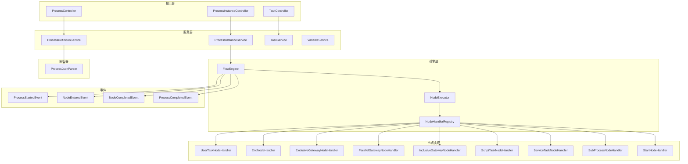

图表来源
- [ProcessController.java](file://flow-engine/src/main/java/com/flow/engine/controller/ProcessController.java)
- [ProcessInstanceController.java](file://flow-engine/src/main/java/com/flow/engine/controller/ProcessInstanceController.java)
- [TaskController.java](file://flow-engine/src/main/java/com/flow/engine/controller/TaskController.java)
- [ProcessDefinitionService.java](file://flow-engine/src/main/java/com/flow/engine/service/ProcessDefinitionService.java)
- [ProcessInstanceService.java](file://flow-engine/src/main/java/com/flow/engine/service/ProcessInstanceService.java)
- [TaskService.java](file://flow-engine/src/main/java/com/flow/engine/service/TaskService.java)
- [FlowEngine.java](file://flow-engine/src/main/java/com/flow/engine/engine/FlowEngine.java)
- [NodeExecutor.java](file://flow-engine/src/main/java/com/flow/engine/engine/NodeExecutor.java)
- [NodeHandlerRegistry.java](file://flow-engine/src/main/java/com/flow/engine/node/NodeHandlerRegistry.java)
- [ProcessJsonParser.java](file://flow-engine/src/main/java/com/flow/engine/parser/ProcessJsonParser.java)
- [UserTaskNodeHandler.java](file://flow-engine/src/main/java/com/flow/engine/node/impl/UserTaskNodeHandler.java)
- [EndNodeHandler.java](file://flow-engine/src/main/java/com/flow/engine/node/impl/EndNodeHandler.java)
- [ExclusiveGatewayNodeHandler.java](file://flow-engine/src/main/java/com/flow/engine/node/impl/ExclusiveGatewayNodeHandler.java)
- [ParallelGatewayNodeHandler.java](file://flow-engine/src/main/java/com/flow/engine/node/impl/ParallelGatewayNodeHandler.java)
- [InclusiveGatewayNodeHandler.java](file://flow-engine/src/main/java/com/flow/engine/node/impl/InclusiveGatewayNodeHandler.java)
- [ScriptTaskNodeHandler.java](file://flow-engine/src/main/java/com/flow/engine/node/impl/ScriptTaskNodeHandler.java)
- [ServiceTaskNodeHandler.java](file://flow-engine/src/main/java/com/flow/engine/node/impl/ServiceTaskNodeHandler.java)
- [SubProcessNodeHandler.java](file://flow-engine/src/main/java/com/flow/engine/node/impl/SubProcessNodeHandler.java)
- [StartNodeHandler.java](file://flow-engine/src/main/java/com/flow/engine/node/impl/StartNodeHandler.java)
- [ProcessStartedEvent.java](file://flow-engine/src/main/java/com/flow/engine/event/ProcessStartedEvent.java)
- [NodeEnteredEvent.java](file://flow-engine/src/main/java/com/flow/engine/event/NodeEnteredEvent.java)
- [NodeCompletedEvent.java](file://flow-engine/src/main/java/com/flow/engine/event/NodeCompletedEvent.java)
- [ProcessCompletedEvent.java](file://flow-engine/src/main/java/com/flow/engine/event/ProcessCompletedEvent.java)

章节来源
- [FlowEngine.java](file://flow-engine/src/main/java/com/flow/engine/engine/FlowEngine.java)
- [NodeExecutor.java](file://flow-engine/src/main/java/com/flow/engine/engine/NodeExecutor.java)
- [ProcessJsonParser.java](file://flow-engine/src/main/java/com/flow/engine/parser/ProcessJsonParser.java)
- [ProcessDefinitionService.java](file://flow-engine/src/main/java/com/flow/engine/service/ProcessDefinitionService.java)
- [ProcessInstanceService.java](file://flow-engine/src/main/java/com/flow/engine/service/ProcessInstanceService.java)
- [TaskService.java](file://flow-engine/src/main/java/com/flow/engine/service/TaskService.java)
- [VariableService.java](file://flow-engine/src/main/java/com/flow/engine/service/VariableService.java)
- [ProcessController.java](file://flow-engine/src/main/java/com/flow/engine/controller/ProcessController.java)
- [ProcessInstanceController.java](file://flow-engine/src/main/java/com/flow/engine/controller/ProcessInstanceController.java)
- [TaskController.java](file://flow-engine/src/main/java/com/flow/engine/controller/TaskController.java)

## 核心组件
- FlowEngine：流程引擎核心协调者，负责流程实例的生命周期推进、上下文维护、事件发布与状态机驱动。
- NodeExecutor：节点执行器，统一调度具体节点处理器，封装执行上下文与结果聚合。
- NodeHandlerRegistry：节点处理器注册中心，按节点类型分发到对应处理器。
- ProcessJsonParser：将 JSON 流程定义解析为内存模型，供引擎使用。
- 服务层（ProcessDefinitionService、ProcessInstanceService、TaskService、VariableService）：面向控制器的业务编排与数据访问。
- 节点处理器（UserTask、End、网关、脚本、服务、子流程、开始等）：实现不同节点类型的执行语义。
- 事件体系（ProcessStarted、NodeEntered、NodeCompleted、ProcessCompleted）：贯穿流程与节点生命周期的扩展点。
- 工具与异常（ExpressionUtils、JsonUtils、FlowException、GlobalExceptionHandler）：表达式求值、JSON 序列化、异常标准化。

章节来源
- [FlowEngine.java](file://flow-engine/src/main/java/com/flow/engine/engine/FlowEngine.java)
- [NodeExecutor.java](file://flow-engine/src/main/java/com/flow/engine/engine/NodeExecutor.java)
- [NodeHandlerRegistry.java](file://flow-engine/src/main/java/com/flow/engine/node/NodeHandlerRegistry.java)
- [ProcessJsonParser.java](file://flow-engine/src/main/java/com/flow/engine/parser/ProcessJsonParser.java)
- [ProcessDefinitionService.java](file://flow-engine/src/main/java/com/flow/engine/service/ProcessDefinitionService.java)
- [ProcessInstanceService.java](file://flow-engine/src/main/java/com/flow/engine/service/ProcessInstanceService.java)
- [TaskService.java](file://flow-engine/src/main/java/com/flow/engine/service/TaskService.java)
- [VariableService.java](file://flow-engine/src/main/java/com/flow/engine/service/VariableService.java)
- [UserTaskNodeHandler.java](file://flow-engine/src/main/java/com/flow/engine/node/impl/UserTaskNodeHandler.java)
- [EndNodeHandler.java](file://flow-engine/src/main/java/com/flow/engine/node/impl/EndNodeHandler.java)
- [ExclusiveGatewayNodeHandler.java](file://flow-engine/src/main/java/com/flow/engine/node/impl/ExclusiveGatewayNodeHandler.java)
- [ParallelGatewayNodeHandler.java](file://flow-engine/src/main/java/com/flow/engine/node/impl/ParallelGatewayNodeHandler.java)
- [InclusiveGatewayNodeHandler.java](file://flow-engine/src/main/java/com/flow/engine/node/impl/InclusiveGatewayNodeHandler.java)
- [ScriptTaskNodeHandler.java](file://flow-engine/src/main/java/com/flow/engine/node/impl/ScriptTaskNodeHandler.java)
- [ServiceTaskNodeHandler.java](file://flow-engine/src/main/java/com/flow/engine/node/impl/ServiceTaskNodeHandler.java)
- [SubProcessNodeHandler.java](file://flow-engine/src/main/java/com/flow/engine/node/impl/SubProcessNodeHandler.java)
- [StartNodeHandler.java](file://flow-engine/src/main/java/com/flow/engine/node/impl/StartNodeHandler.java)
- [ProcessStartedEvent.java](file://flow-engine/src/main/java/com/flow/engine/event/ProcessStartedEvent.java)
- [NodeEnteredEvent.java](file://flow-engine/src/main/java/com/flow/engine/event/NodeEnteredEvent.java)
- [NodeCompletedEvent.java](file://flow-engine/src/main/java/com/flow/engine/event/NodeCompletedEvent.java)
- [ProcessCompletedEvent.java](file://flow-engine/src/main/java/com/flow/engine/event/ProcessCompletedEvent.java)
- [ExpressionUtils.java](file://flow-engine/src/main/java/com/flow/engine/common/utils/ExpressionUtils.java)
- [JsonUtils.java](file://flow-engine/src/main/java/com/flow/engine/common/utils/JsonUtils.java)
- [FlowException.java](file://flow-engine/src/main/java/com/flow/engine/common/exception/FlowException.java)
- [GlobalExceptionHandler.java](file://flow-engine/src/main/java/com/flow/engine/common/GlobalExceptionHandler.java)

## 架构总览
整体架构遵循“控制器-服务-引擎-节点处理器”的分层模式，结合事件驱动与注册表模式，实现高内聚低耦合的可扩展流程执行能力。

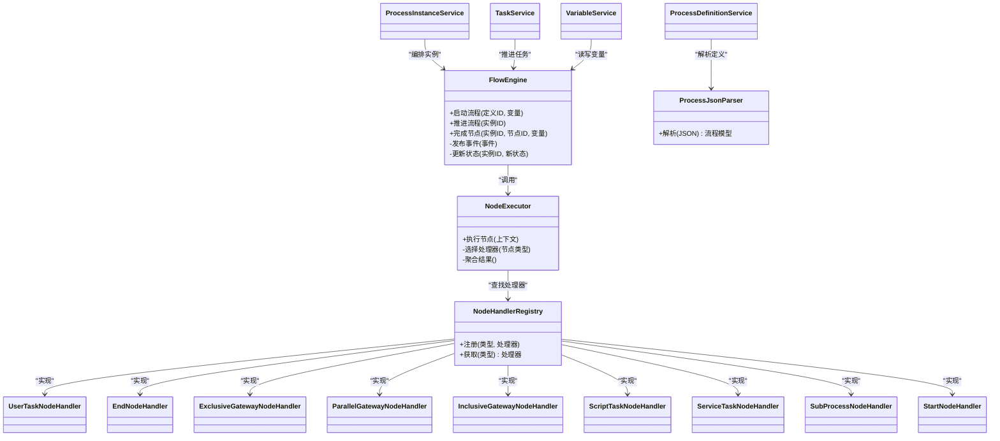

图表来源
- [FlowEngine.java](file://flow-engine/src/main/java/com/flow/engine/engine/FlowEngine.java)
- [NodeExecutor.java](file://flow-engine/src/main/java/com/flow/engine/engine/NodeExecutor.java)
- [NodeHandlerRegistry.java](file://flow-engine/src/main/java/com/flow/engine/node/NodeHandlerRegistry.java)
- [ProcessJsonParser.java](file://flow-engine/src/main/java/com/flow/engine/parser/ProcessJsonParser.java)
- [ProcessDefinitionService.java](file://flow-engine/src/main/java/com/flow/engine/service/ProcessDefinitionService.java)
- [ProcessInstanceService.java](file://flow-engine/src/main/java/com/flow/engine/service/ProcessInstanceService.java)
- [TaskService.java](file://flow-engine/src/main/java/com/flow/engine/service/TaskService.java)
- [VariableService.java](file://flow-engine/src/main/java/com/flow/engine/service/VariableService.java)
- [UserTaskNodeHandler.java](file://flow-engine/src/main/java/com/flow/engine/node/impl/UserTaskNodeHandler.java)
- [EndNodeHandler.java](file://flow-engine/src/main/java/com/flow/engine/node/impl/EndNodeHandler.java)
- [ExclusiveGatewayNodeHandler.java](file://flow-engine/src/main/java/com/flow/engine/node/impl/ExclusiveGatewayNodeHandler.java)
- [ParallelGatewayNodeHandler.java](file://flow-engine/src/main/java/com/flow/engine/node/impl/ParallelGatewayNodeHandler.java)
- [InclusiveGatewayNodeHandler.java](file://flow-engine/src/main/java/com/flow/engine/node/impl/InclusiveGatewayNodeHandler.java)
- [ScriptTaskNodeHandler.java](file://flow-engine/src/main/java/com/flow/engine/node/impl/ScriptTaskNodeHandler.java)
- [ServiceTaskNodeHandler.java](file://flow-engine/src/main/java/com/flow/engine/node/impl/ServiceTaskNodeHandler.java)
- [SubProcessNodeHandler.java](file://flow-engine/src/main/java/com/flow/engine/node/impl/SubProcessNodeHandler.java)
- [StartNodeHandler.java](file://flow-engine/src/main/java/com/flow/engine/node/impl/StartNodeHandler.java)

## 详细组件分析

### FlowEngine 职责与执行流程
- 职责
  - 流程实例生命周期管理：创建、推进、完成、终止
  - 上下文维护：当前节点、历史轨迹、变量作用域
  - 事件发布：流程与节点级别的事件广播
  - 状态机驱动：依据节点类型与条件表达式决定下一步
- 执行流程
  - 启动：根据流程定义 ID 加载定义，创建实例，进入起始节点
  - 推进：根据当前节点类型选择处理器执行，计算下一跳或汇聚
  - 完成：更新实例状态，持久化任务与变量，发布完成事件

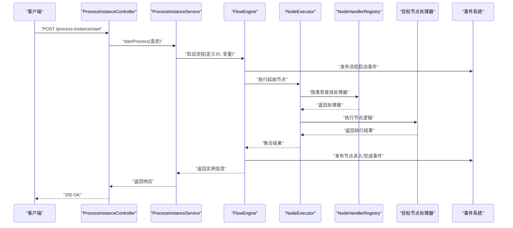

图表来源
- [ProcessInstanceController.java](file://flow-engine/src/main/java/com/flow/engine/controller/ProcessInstanceController.java)
- [ProcessInstanceService.java](file://flow-engine/src/main/java/com/flow/engine/service/ProcessInstanceService.java)
- [FlowEngine.java](file://flow-engine/src/main/java/com/flow/engine/engine/FlowEngine.java)
- [NodeExecutor.java](file://flow-engine/src/main/java/com/flow/engine/engine/NodeExecutor.java)
- [NodeHandlerRegistry.java](file://flow-engine/src/main/java/com/flow/engine/node/NodeHandlerRegistry.java)
- [UserTaskNodeHandler.java](file://flow-engine/src/main/java/com/flow/engine/node/impl/UserTaskNodeHandler.java)
- [EndNodeHandler.java](file://flow-engine/src/main/java/com/flow/engine/node/impl/EndNodeHandler.java)
- [ProcessStartedEvent.java](file://flow-engine/src/main/java/com/flow/engine/event/ProcessStartedEvent.java)
- [NodeEnteredEvent.java](file://flow-engine/src/main/java/com/flow/engine/event/NodeEnteredEvent.java)
- [NodeCompletedEvent.java](file://flow-engine/src/main/java/com/flow/engine/event/NodeCompletedEvent.java)

章节来源
- [FlowEngine.java](file://flow-engine/src/main/java/com/flow/engine/engine/FlowEngine.java)
- [NodeExecutor.java](file://flow-engine/src/main/java/com/flow/engine/engine/NodeExecutor.java)
- [NodeHandlerRegistry.java](file://flow-engine/src/main/java/com/flow/engine/node/NodeHandlerRegistry.java)
- [ProcessInstanceController.java](file://flow-engine/src/main/java/com/flow/engine/controller/ProcessInstanceController.java)
- [ProcessInstanceService.java](file://flow-engine/src/main/java/com/flow/engine/service/ProcessInstanceService.java)
- [ProcessStartedEvent.java](file://flow-engine/src/main/java/com/flow/engine/event/ProcessStartedEvent.java)
- [NodeEnteredEvent.java](file://flow-engine/src/main/java/com/flow/engine/event/NodeEnteredEvent.java)
- [NodeCompletedEvent.java](file://flow-engine/src/main/java/com/flow/engine/event/NodeCompletedEvent.java)

### 从 JSON 流程定义到可执行实例的转换
- 解析阶段
  - 通过 ProcessJsonParser 将 JSON 定义解析为内存模型（节点、边、属性）
  - 校验必要字段（节点类型、连接关系、条件表达式）
- 装载阶段
  - 服务层将解析后的模型缓存或持久化，供引擎运行时使用
- 运行阶段
  - FlowEngine 基于内存模型进行状态推进与节点调度

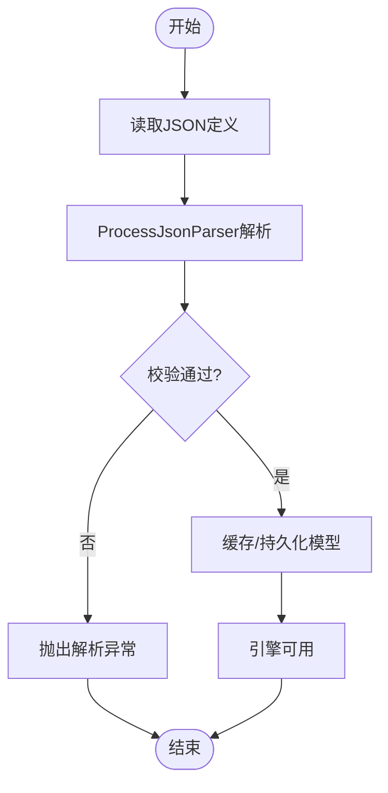

图表来源
- [ProcessJsonParser.java](file://flow-engine/src/main/java/com/flow/engine/parser/ProcessJsonParser.java)
- [ProcessDefinitionService.java](file://flow-engine/src/main/java/com/flow/engine/service/ProcessDefinitionService.java)

章节来源
- [ProcessJsonParser.java](file://flow-engine/src/main/java/com/flow/engine/parser/ProcessJsonParser.java)
- [ProcessDefinitionService.java](file://flow-engine/src/main/java/com/flow/engine/service/ProcessDefinitionService.java)

### 流程状态机：基本状态与转换规则
- 基本状态
  - 运行中：流程实例处于活跃状态，存在待办任务或自动节点在执行
  - 已完成：所有分支均到达结束节点，无未完成任务
  - 已终止：因异常或人工干预而提前结束
- 转换规则
  - 启动后进入运行中
  - 当所有并行/包容分支汇聚且无待办任务时，转为已完成
  - 发生不可恢复错误或主动中止时，转为已终止

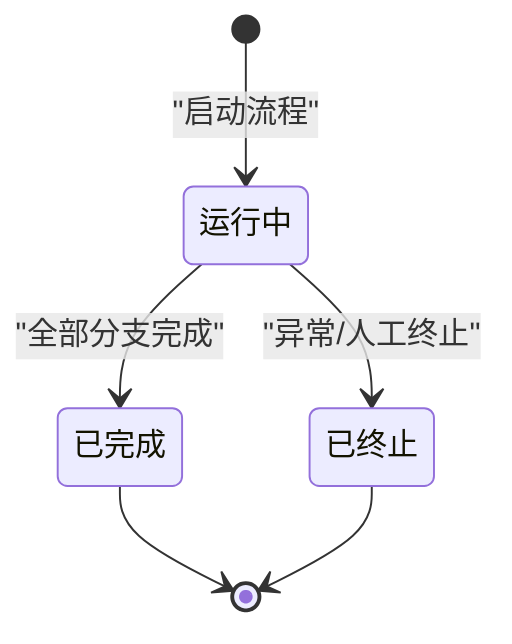

图表来源
- [ProcessStatus.java](file://flow-engine/src/main/java/com/flow/engine/common/enums/ProcessStatus.java)
- [FlowEngine.java](file://flow-engine/src/main/java/com/flow/engine/engine/FlowEngine.java)

章节来源
- [ProcessStatus.java](file://flow-engine/src/main/java/com/flow/engine/common/enums/ProcessStatus.java)
- [FlowEngine.java](file://flow-engine/src/main/java/com/flow/engine/engine/FlowEngine.java)

### 流程变量的作用域与传递机制
- 作用域
  - 流程级变量：跨所有节点共享，用于全局配置与上下文
  - 节点级变量：仅在当前节点执行期间有效，完成后清理或合并至流程级
- 传递机制
  - 启动时传入初始变量，注入到执行上下文
  - 节点处理器在前后钩子中读写变量，支持表达式求值
  - 变量变更持久化，保证事务一致性与可追溯性

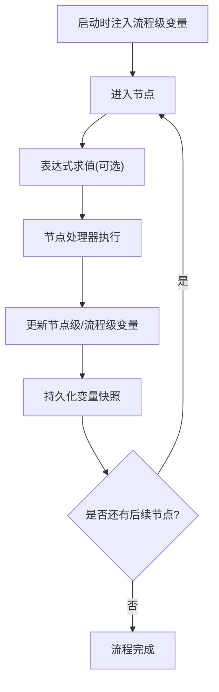

图表来源
- [VariableService.java](file://flow-engine/src/main/java/com/flow/engine/service/VariableService.java)
- [ExpressionUtils.java](file://flow-engine/src/main/java/com/flow/engine/common/utils/ExpressionUtils.java)
- [FlowEngine.java](file://flow-engine/src/main/java/com/flow/engine/engine/FlowEngine.java)

章节来源
- [VariableService.java](file://flow-engine/src/main/java/com/flow/engine/service/VariableService.java)
- [ExpressionUtils.java](file://flow-engine/src/main/java/com/flow/engine/common/utils/ExpressionUtils.java)
- [FlowEngine.java](file://flow-engine/src/main/java/com/flow/engine/engine/FlowEngine.java)

### 节点处理器设计与扩展
- 设计要点
  - 抽象基类提供通用能力（上下文访问、事件发布、异常包装）
  - 注册表按节点类型分发到具体处理器
  - 内置处理器覆盖常见场景（用户任务、网关、脚本、服务、子流程、开始、结束）
- 扩展方式
  - 新增处理器实现 NodeHandler 接口并注册
  - 在流程定义中使用自定义节点类型，引擎自动发现并执行

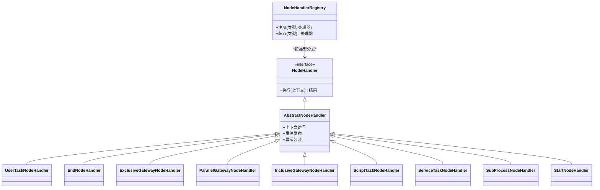

图表来源
- [NodeHandler.java](file://flow-engine/src/main/java/com/flow/engine/node/NodeHandler.java)
- [AbstractNodeHandler.java](file://flow-engine/src/main/java/com/flow/engine/node/AbstractNodeHandler.java)
- [NodeHandlerRegistry.java](file://flow-engine/src/main/java/com/flow/engine/node/NodeHandlerRegistry.java)
- [UserTaskNodeHandler.java](file://flow-engine/src/main/java/com/flow/engine/node/impl/UserTaskNodeHandler.java)
- [EndNodeHandler.java](file://flow-engine/src/main/java/com/flow/engine/node/impl/EndNodeHandler.java)
- [ExclusiveGatewayNodeHandler.java](file://flow-engine/src/main/java/com/flow/engine/node/impl/ExclusiveGatewayNodeHandler.java)
- [ParallelGatewayNodeHandler.java](file://flow-engine/src/main/java/com/flow/engine/node/impl/ParallelGatewayNodeHandler.java)
- [InclusiveGatewayNodeHandler.java](file://flow-engine/src/main/java/com/flow/engine/node/impl/InclusiveGatewayNodeHandler.java)
- [ScriptTaskNodeHandler.java](file://flow-engine/src/main/java/com/flow/engine/node/impl/ScriptTaskNodeHandler.java)
- [ServiceTaskNodeHandler.java](file://flow-engine/src/main/java/com/flow/engine/node/impl/ServiceTaskNodeHandler.java)
- [SubProcessNodeHandler.java](file://flow-engine/src/main/java/com/flow/engine/node/impl/SubProcessNodeHandler.java)
- [StartNodeHandler.java](file://flow-engine/src/main/java/com/flow/engine/node/impl/StartNodeHandler.java)

章节来源
- [NodeHandler.java](file://flow-engine/src/main/java/com/flow/engine/node/NodeHandler.java)
- [AbstractNodeHandler.java](file://flow-engine/src/main/java/com/flow/engine/node/AbstractNodeHandler.java)
- [NodeHandlerRegistry.java](file://flow-engine/src/main/java/com/flow/engine/node/NodeHandlerRegistry.java)
- [UserTaskNodeHandler.java](file://flow-engine/src/main/java/com/flow/engine/node/impl/UserTaskNodeHandler.java)
- [EndNodeHandler.java](file://flow-engine/src/main/java/com/flow/engine/node/impl/EndNodeHandler.java)
- [ExclusiveGatewayNodeHandler.java](file://flow-engine/src/main/java/com/flow/engine/node/impl/ExclusiveGatewayNodeHandler.java)
- [ParallelGatewayNodeHandler.java](file://flow-engine/src/main/java/com/flow/engine/node/impl/ParallelGatewayNodeHandler.java)
- [InclusiveGatewayNodeHandler.java](file://flow-engine/src/main/java/com/flow/engine/node/impl/InclusiveGatewayNodeHandler.java)
- [ScriptTaskNodeHandler.java](file://flow-engine/src/main/java/com/flow/engine/node/impl/ScriptTaskNodeHandler.java)
- [ServiceTaskNodeHandler.java](file://flow-engine/src/main/java/com/flow/engine/node/impl/ServiceTaskNodeHandler.java)
- [SubProcessNodeHandler.java](file://flow-engine/src/main/java/com/flow/engine/node/impl/SubProcessNodeHandler.java)
- [StartNodeHandler.java](file://flow-engine/src/main/java/com/flow/engine/node/impl/StartNodeHandler.java)

### 关键业务流程时序图

#### 流程启动
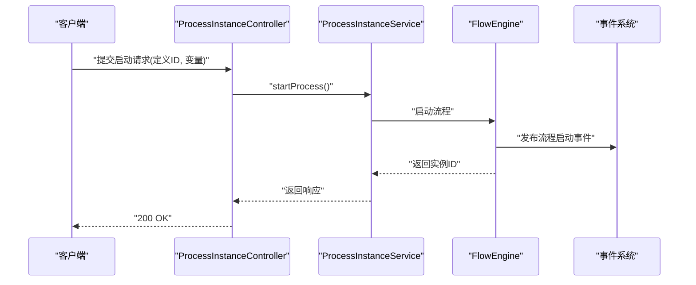

图表来源
- [ProcessInstanceController.java](file://flow-engine/src/main/java/com/flow/engine/controller/ProcessInstanceController.java)
- [ProcessInstanceService.java](file://flow-engine/src/main/java/com/flow/engine/service/ProcessInstanceService.java)
- [FlowEngine.java](file://flow-engine/src/main/java/com/flow/engine/engine/FlowEngine.java)
- [ProcessStartedEvent.java](file://flow-engine/src/main/java/com/flow/engine/event/ProcessStartedEvent.java)

#### 节点流转（以用户任务为例）
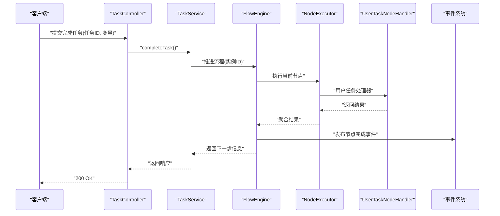

图表来源
- [TaskController.java](file://flow-engine/src/main/java/com/flow/engine/controller/TaskController.java)
- [TaskService.java](file://flow-engine/src/main/java/com/flow/engine/service/TaskService.java)
- [FlowEngine.java](file://flow-engine/src/main/java/com/flow/engine/engine/FlowEngine.java)
- [NodeExecutor.java](file://flow-engine/src/main/java/com/flow/engine/engine/NodeExecutor.java)
- [UserTaskNodeHandler.java](file://flow-engine/src/main/java/com/flow/engine/node/impl/UserTaskNodeHandler.java)
- [NodeCompletedEvent.java](file://flow-engine/src/main/java/com/flow/engine/event/NodeCompletedEvent.java)

#### 流程结束
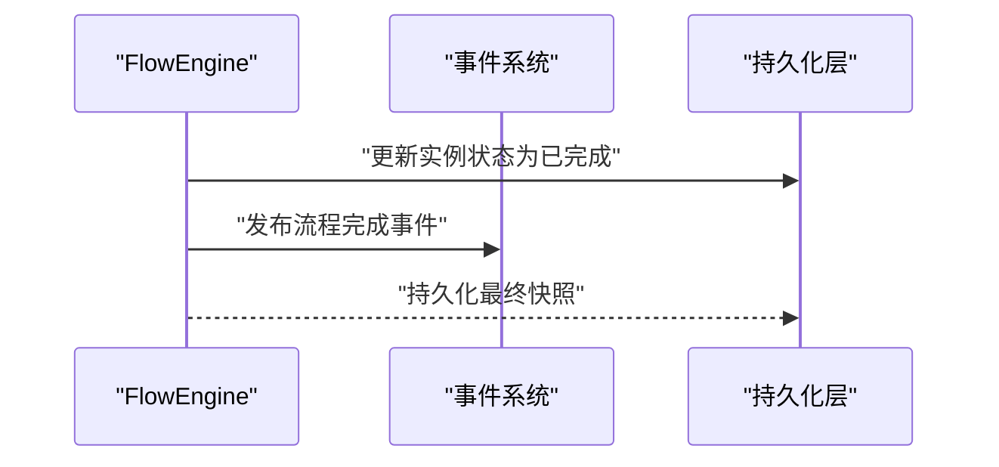

图表来源
- [FlowEngine.java](file://flow-engine/src/main/java/com/flow/engine/engine/FlowEngine.java)
- [ProcessCompletedEvent.java](file://flow-engine/src/main/java/com/flow/engine/event/ProcessCompletedEvent.java)

### 代码示例：如何启动一个流程实例
- 控制器入口
  - 参考路径：[ProcessInstanceController.java](file://flow-engine/src/main/java/com/flow/engine/controller/ProcessInstanceController.java)
- 请求体 DTO
  - 参考路径：[StartProcessRequest.java](file://flow-engine/src/main/java/com/flow/engine/dto/StartProcessRequest.java)
- 服务编排
  - 参考路径：[ProcessInstanceService.java](file://flow-engine/src/main/java/com/flow/engine/service/ProcessInstanceService.java)
- 引擎执行
  - 参考路径：[FlowEngine.java](file://flow-engine/src/main/java/com/flow/engine/engine/FlowEngine.java)
- 响应体 DTO
  - 参考路径：[ProcessInstanceResponse.java](file://flow-engine/src/main/java/com/flow/engine/dto/ProcessInstanceResponse.java)

章节来源
- [ProcessInstanceController.java](file://flow-engine/src/main/java/com/flow/engine/controller/ProcessInstanceController.java)
- [StartProcessRequest.java](file://flow-engine/src/main/java/com/flow/engine/dto/StartProcessRequest.java)
- [ProcessInstanceService.java](file://flow-engine/src/main/java/com/flow/engine/service/ProcessInstanceService.java)
- [FlowEngine.java](file://flow-engine/src/main/java/com/flow/engine/engine/FlowEngine.java)
- [ProcessInstanceResponse.java](file://flow-engine/src/main/java/com/flow/engine/dto/ProcessInstanceResponse.java)

## 依赖关系分析
- 组件耦合
  - 控制器依赖服务层，服务层依赖引擎与解析器
  - 引擎依赖节点执行器与注册表，注册表依赖各节点处理器
  - 事件系统与引擎松耦合，通过事件总线解耦
- 外部依赖
  - 表达式求值工具用于条件判断与变量计算
  - JSON 工具用于定义与上下文的序列化
  - 数据库持久化通过 MyBatis Plus（由资源配置文件与实体映射推断）

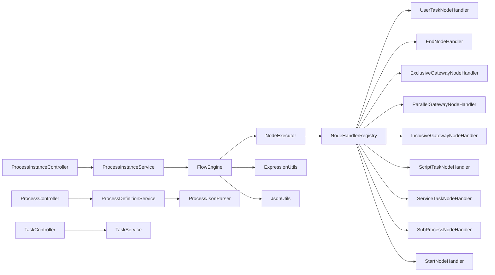

图表来源
- [ProcessController.java](file://flow-engine/src/main/java/com/flow/engine/controller/ProcessController.java)
- [ProcessInstanceController.java](file://flow-engine/src/main/java/com/flow/engine/controller/ProcessInstanceController.java)
- [TaskController.java](file://flow-engine/src/main/java/com/flow/engine/controller/TaskController.java)
- [ProcessDefinitionService.java](file://flow-engine/src/main/java/com/flow/engine/service/ProcessDefinitionService.java)
- [ProcessInstanceService.java](file://flow-engine/src/main/java/com/flow/engine/service/ProcessInstanceService.java)
- [TaskService.java](file://flow-engine/src/main/java/com/flow/engine/service/TaskService.java)
- [FlowEngine.java](file://flow-engine/src/main/java/com/flow/engine/engine/FlowEngine.java)
- [NodeExecutor.java](file://flow-engine/src/main/java/com/flow/engine/engine/NodeExecutor.java)
- [NodeHandlerRegistry.java](file://flow-engine/src/main/java/com/flow/engine/node/NodeHandlerRegistry.java)
- [UserTaskNodeHandler.java](file://flow-engine/src/main/java/com/flow/engine/node/impl/UserTaskNodeHandler.java)
- [EndNodeHandler.java](file://flow-engine/src/main/java/com/flow/engine/node/impl/EndNodeHandler.java)
- [ExclusiveGatewayNodeHandler.java](file://flow-engine/src/main/java/com/flow/engine/node/impl/ExclusiveGatewayNodeHandler.java)
- [ParallelGatewayNodeHandler.java](file://flow-engine/src/main/java/com/flow/engine/node/impl/ParallelGatewayNodeHandler.java)
- [InclusiveGatewayNodeHandler.java](file://flow-engine/src/main/java/com/flow/engine/node/impl/InclusiveGatewayNodeHandler.java)
- [ScriptTaskNodeHandler.java](file://flow-engine/src/main/java/com/flow/engine/node/impl/ScriptTaskNodeHandler.java)
- [ServiceTaskNodeHandler.java](file://flow-engine/src/main/java/com/flow/engine/node/impl/ServiceTaskNodeHandler.java)
- [SubProcessNodeHandler.java](file://flow-engine/src/main/java/com/flow/engine/node/impl/SubProcessNodeHandler.java)
- [StartNodeHandler.java](file://flow-engine/src/main/java/com/flow/engine/node/impl/StartNodeHandler.java)
- [ProcessJsonParser.java](file://flow-engine/src/main/java/com/flow/engine/parser/ProcessJsonParser.java)
- [ExpressionUtils.java](file://flow-engine/src/main/java/com/flow/engine/common/utils/ExpressionUtils.java)
- [JsonUtils.java](file://flow-engine/src/main/java/com/flow/engine/common/utils/JsonUtils.java)

章节来源
- [ProcessController.java](file://flow-engine/src/main/java/com/flow/engine/controller/ProcessController.java)
- [ProcessInstanceController.java](file://flow-engine/src/main/java/com/flow/engine/controller/ProcessInstanceController.java)
- [TaskController.java](file://flow-engine/src/main/java/com/flow/engine/controller/TaskController.java)
- [ProcessDefinitionService.java](file://flow-engine/src/main/java/com/flow/engine/service/ProcessDefinitionService.java)
- [ProcessInstanceService.java](file://flow-engine/src/main/java/com/flow/engine/service/ProcessInstanceService.java)
- [TaskService.java](file://flow-engine/src/main/java/com/flow/engine/service/TaskService.java)
- [FlowEngine.java](file://flow-engine/src/main/java/com/flow/engine/engine/FlowEngine.java)
- [NodeExecutor.java](file://flow-engine/src/main/java/com/flow/engine/engine/NodeExecutor.java)
- [NodeHandlerRegistry.java](file://flow-engine/src/main/java/com/flow/engine/node/NodeHandlerRegistry.java)
- [ProcessJsonParser.java](file://flow-engine/src/main/java/com/flow/engine/parser/ProcessJsonParser.java)
- [ExpressionUtils.java](file://flow-engine/src/main/java/com/flow/engine/common/utils/ExpressionUtils.java)
- [JsonUtils.java](file://flow-engine/src/main/java/com/flow/engine/common/utils/JsonUtils.java)

## 性能考量
- 解析优化：对流程定义进行一次性解析与缓存，避免重复 IO 与解析开销
- 执行路径：节点处理器尽量幂等，减少不必要的数据库写入
- 并发控制：并行网关与包容网关需确保汇聚正确性与一致性
- 变量存取：批量更新变量，减少持久化次数
- 事件异步：非关键事件可异步发布，降低主流程延迟

## 故障排查指南
- 常见问题
  - 流程定义解析失败：检查 JSON 结构与必填字段
  - 节点处理器缺失：确认注册表中是否存在对应类型处理器
  - 表达式求值错误：验证变量与作用域是否正确注入
  - 状态不一致：检查事务边界与事件顺序
- 定位方法
  - 查看全局异常处理输出
  - 启用调试日志，关注事件发布与节点执行链路
  - 核对数据库快照与变量版本

章节来源
- [FlowException.java](file://flow-engine/src/main/java/com/flow/engine/common/exception/FlowException.java)
- [GlobalExceptionHandler.java](file://flow-engine/src/main/java/com/flow/engine/common/GlobalExceptionHandler.java)
- [ExpressionUtils.java](file://flow-engine/src/main/java/com/flow/engine/common/utils/ExpressionUtils.java)
- [JsonUtils.java](file://flow-engine/src/main/java/com/flow/engine/common/utils/JsonUtils.java)

## 结论
本引擎通过清晰的层次划分、可扩展的节点处理器注册表与事件驱动机制，实现了从 JSON 定义到可执行实例的完整闭环。FlowEngine 作为核心协调者，配合 NodeExecutor 与各类处理器，支撑复杂流程的灵活编排与稳定执行。变量作用域与表达式求值为流程动态化提供了强大能力。建议在生产环境完善监控与审计，持续优化解析与执行路径的性能。

## 附录
- 数据模型概览（实体与关系）
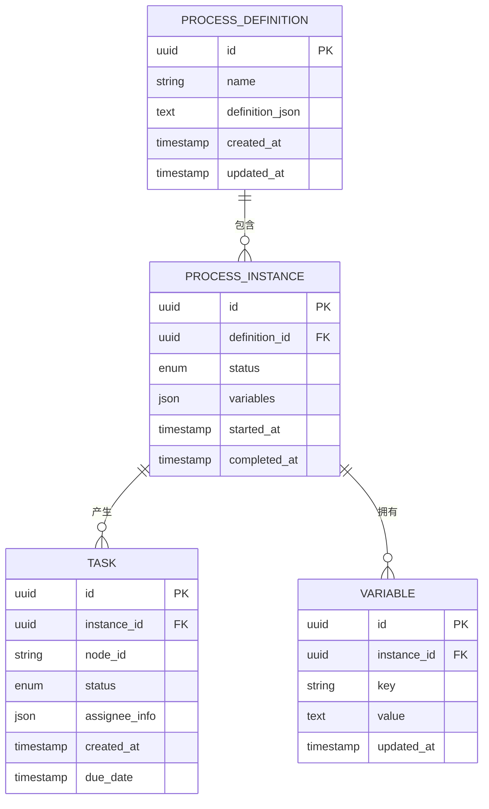

图表来源
- [ProcessDefinition.java](file://flow-engine/src/main/java/com/flow/engine/entity/ProcessDefinition.java)
- [ProcessInstance.java](file://flow-engine/src/main/java/com/flow/engine/entity/ProcessInstance.java)
- [Task.java](file://flow-engine/src/main/java/com/flow/engine/entity/Task.java)
- [Variable.java](file://flow-engine/src/main/java/com/flow/engine/entity/Variable.java)
- [schema.sql](file://flow-engine/src/main/resources/db/schema.sql)

章节来源
- [ProcessDefinition.java](file://flow-engine/src/main/java/com/flow/engine/entity/ProcessDefinition.java)
- [ProcessInstance.java](file://flow-engine/src/main/java/com/flow/engine/entity/ProcessInstance.java)
- [Task.java](file://flow-engine/src/main/java/com/flow/engine/entity/Task.java)
- [Variable.java](file://flow-engine/src/main/java/com/flow/engine/entity/Variable.java)
- [schema.sql](file://flow-engine/src/main/resources/db/schema.sql)