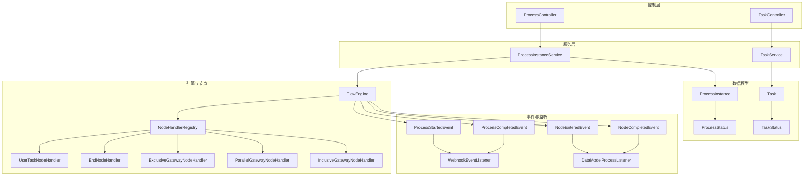
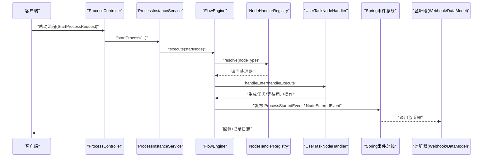
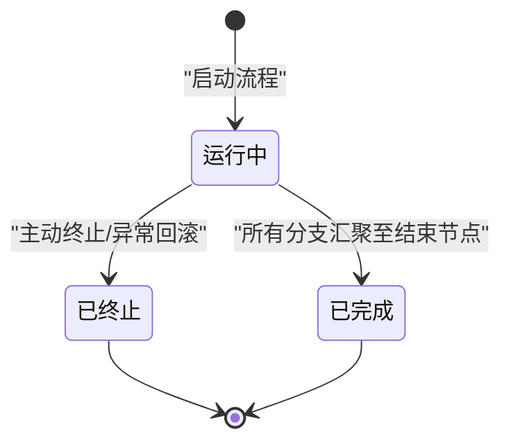
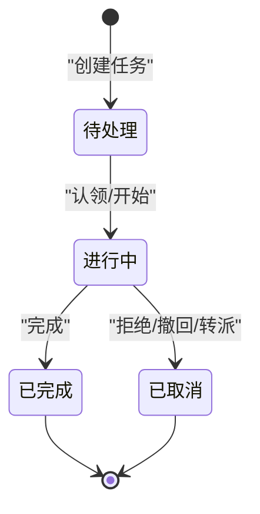
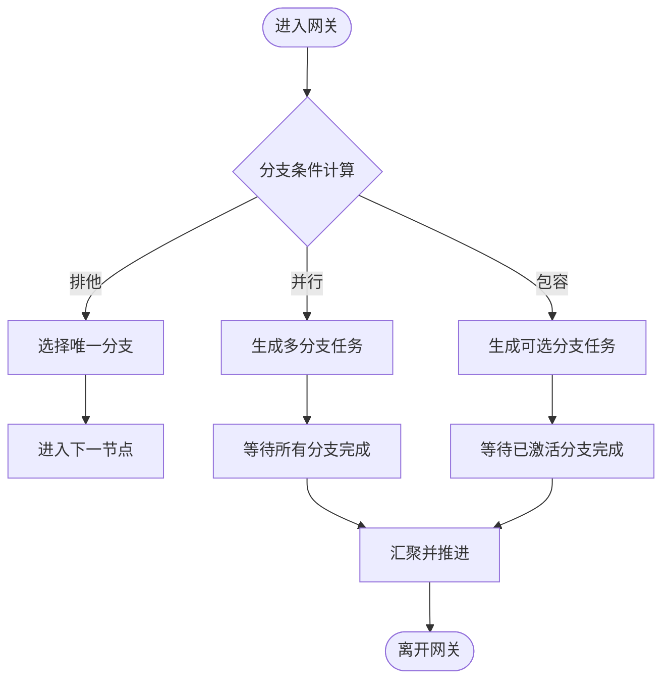
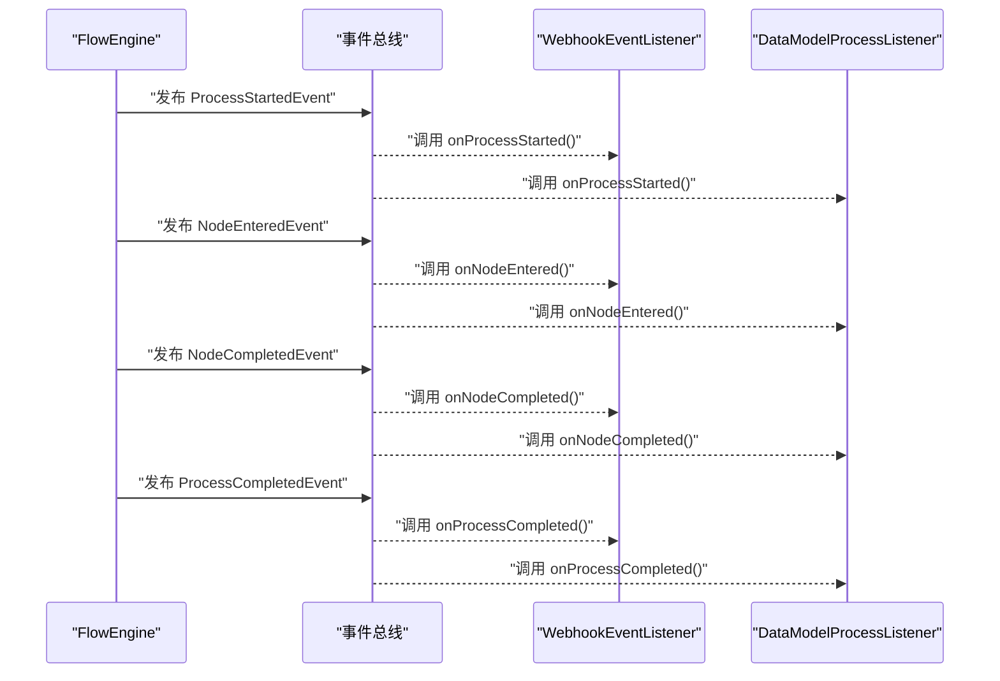
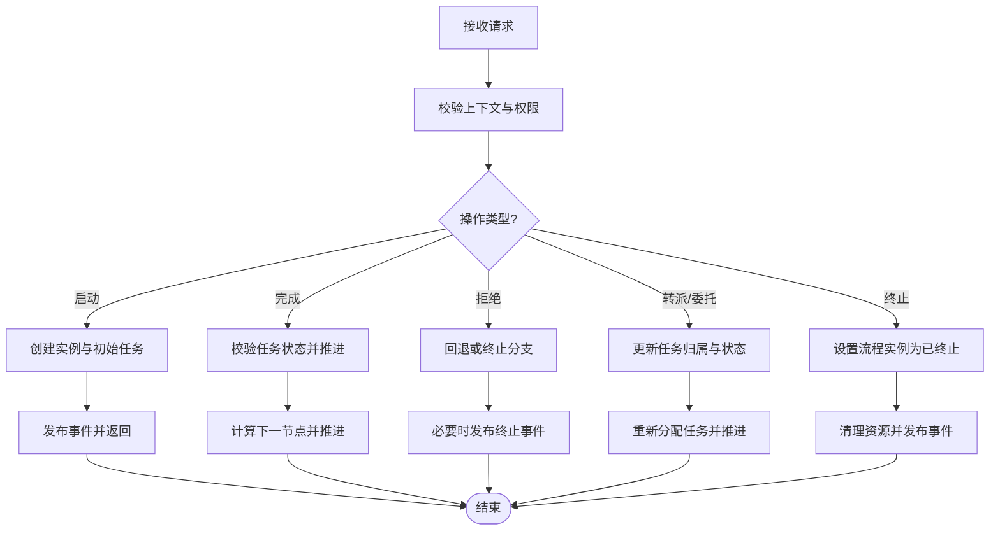
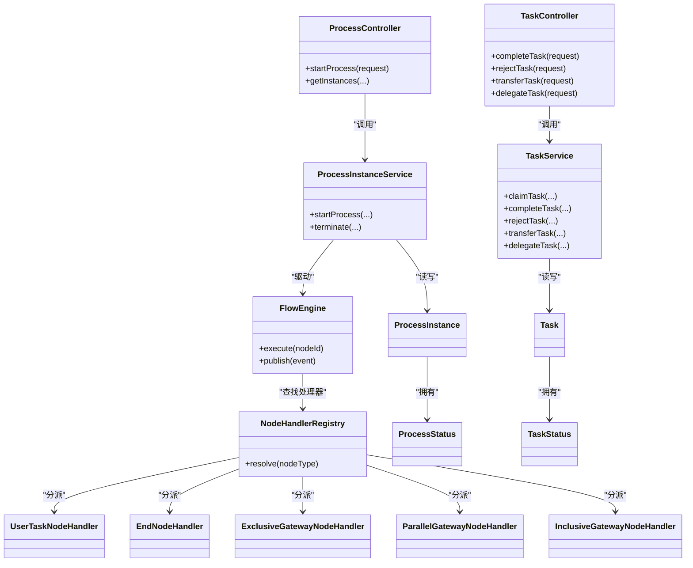

# 状态机设计

<cite>
**本文引用的文件**   
- [ProcessStatus.java](file://flow-engine/src/main/java/com/flow/engine/common/enums/ProcessStatus.java)
- [TaskStatus.java](file://flow-engine/src/main/java/com/flow/engine/common/enums/TaskStatus.java)
- [ProcessInstanceService.java](file://flow-engine/src/main/java/com/flow/engine/service/ProcessInstanceService.java)
- [TaskService.java](file://flow-engine/src/main/java/com/flow/engine/service/TaskService.java)
- [FlowEngine.java](file://flow-engine/src/main/java/com/flow/engine/engine/FlowEngine.java)
- [NodeHandlerRegistry.java](file://flow-engine/src/main/java/com/flow/engine/node/NodeHandlerRegistry.java)
- [UserTaskNodeHandler.java](file://flow-engine/src/main/java/com/flow/engine/node/impl/UserTaskNodeHandler.java)
- [EndNodeHandler.java](file://flow-engine/src/main/java/com/flow/engine/node/impl/EndNodeHandler.java)
- [ExclusiveGatewayNodeHandler.java](file://flow-engine/src/main/java/com/flow/engine/node/impl/ExclusiveGatewayNodeHandler.java)
- [ParallelGatewayNodeHandler.java](file://flow-engine/src/main/java/com/flow/engine/node/impl/ParallelGatewayNodeHandler.java)
- [InclusiveGatewayNodeHandler.java](file://flow-engine/src/main/java/com/flow/engine/node/impl/InclusiveGatewayNodeHandler.java)
- [ProcessStartedEvent.java](file://flow-engine/src/main/java/com/flow/engine/event/ProcessStartedEvent.java)
- [ProcessCompletedEvent.java](file://flow-engine/src/main/java/com/flow/engine/event/ProcessCompletedEvent.java)
- [NodeEnteredEvent.java](file://flow-engine/src/main/java/com/flow/engine/event/NodeEnteredEvent.java)
- [NodeCompletedEvent.java](file://flow-engine/src/main/java/com/flow/engine/event/NodeCompletedEvent.java)
- [WebhookEventListener.java](file://flow-engine/src/main/java/com/flow/engine/listener/WebhookEventListener.java)
- [DataModelProcessListener.java](file://flow-engine/src/main/java/com/flow/engine/listener/DataModelProcessListener.java)
- [ProcessDefinitionService.java](file://flow-engine/src/main/java/com/flow/engine/service/ProcessDefinitionService.java)
- [VariableService.java](file://flow-engine/src/main/java/com/flow/engine/service/VariableService.java)
- [ProcessInstance.java](file://flow-engine/src/main/java/com/flow/engine/entity/ProcessInstance.java)
- [Task.java](file://flow-engine/src/main/java/com/flow/engine/entity/Task.java)
- [ProcessController.java](file://flow-engine/src/main/java/com/flow/engine/controller/ProcessController.java)
- [TaskController.java](file://flow-engine/src/main/java/com/flow/engine/controller/TaskController.java)
- [StartProcessRequest.java](file://flow-engine/src/main/java/com/flow/engine/dto/StartProcessRequest.java)
- [CompleteTaskRequest.java](file://flow-engine/src/main/java/com/flow/engine/dto/CompleteTaskRequest.java)
- [RejectTaskRequest.java](file://flow-engine/src/main/java/com/flow/engine/dto/RejectTaskRequest.java)
- [ClaimTaskRequest.java](file://flow-engine/src/main/java/com/flow/engine/dto/ClaimTaskRequest.java)
- [DelegateTaskRequest.java](file://flow-engine/src/main/java/com/flow/engine/dto/DelegateTaskRequest.java)
- [TransferTaskRequest.java](file://flow-engine/src/main/java/com/flow/engine/dto/TransferTaskRequest.java)
- [StateMachineTest.java](file://flow-engine/src/test/java/com/flow/engine/engine/StateMachineTest.java)
</cite>

## 目录
1. [引言](#引言)
2. [项目结构](#项目结构)
3. [核心组件](#核心组件)
4. [架构总览](#架构总览)
5. [详细组件分析](#详细组件分析)
6. [依赖关系分析](#依赖关系分析)
7. [性能考虑](#性能考虑)
8. [故障排查指南](#故障排查指南)
9. [结论](#结论)
10. [附录](#附录)

## 引言
本技术文档围绕流程引擎的状态机设计，系统阐述流程实例与任务的状态管理机制、生命周期、转换规则与约束条件。重点覆盖 ProcessStatus 与 TaskStatus 枚举定义的所有状态及其转换路径；解释事件触发机制与监听器模式；提供可视化状态转换图；并讨论并发场景下的同步与一致性保证策略。文末给出典型业务场景示例，帮助读者将抽象状态机映射到实际业务流程中。

## 项目结构
本项目采用分层与模块化组织方式：
- 领域模型与枚举：ProcessInstance、Task 实体以及 ProcessStatus、TaskStatus 枚举集中定义状态空间。
- 服务层：ProcessInstanceService、TaskService 负责状态变更编排与持久化。
- 引擎与节点执行：FlowEngine 驱动流程推进，NodeHandlerRegistry 注册并调度各节点处理器（如用户任务、网关、结束节点等）。
- 事件与监听：基于 Spring 事件机制发布 ProcessStartedEvent、ProcessCompletedEvent、NodeEnteredEvent、NodeCompletedEvent，并由 WebhookEventListener、DataModelProcessListener 等监听处理。
- 控制器与请求体：ProcessController、TaskController 暴露启动、完成、拒绝、转派、委托等接口，DTO 封装输入参数。

图表来源
- [ProcessController.java](file://flow-engine/src/main/java/com/flow/engine/controller/ProcessController.java)
- [TaskController.java](file://flow-engine/src/main/java/com/flow/engine/controller/TaskController.java)
- [ProcessInstanceService.java](file://flow-engine/src/main/java/com/flow/engine/service/ProcessInstanceService.java)
- [TaskService.java](file://flow-engine/src/main/java/com/flow/engine/service/TaskService.java)
- [FlowEngine.java](file://flow-engine/src/main/java/com/flow/engine/engine/FlowEngine.java)
- [NodeHandlerRegistry.java](file://flow-engine/src/main/java/com/flow/engine/node/NodeHandlerRegistry.java)
- [UserTaskNodeHandler.java](file://flow-engine/src/main/java/com/flow/engine/node/impl/UserTaskNodeHandler.java)
- [EndNodeHandler.java](file://flow-engine/src/main/java/com/flow/engine/node/impl/EndNodeHandler.java)
- [ExclusiveGatewayNodeHandler.java](file://flow-engine/src/main/java/com/flow/engine/node/impl/ExclusiveGatewayNodeHandler.java)
- [ParallelGatewayNodeHandler.java](file://flow-engine/src/main/java/com/flow/engine/node/impl/ParallelGatewayNodeHandler.java)
- [InclusiveGatewayNodeHandler.java](file://flow-engine/src/main/java/com/flow/engine/node/impl/InclusiveGatewayNodeHandler.java)
- [ProcessStartedEvent.java](file://flow-engine/src/main/java/com/flow/engine/event/ProcessStartedEvent.java)
- [ProcessCompletedEvent.java](file://flow-engine/src/main/java/com/flow/engine/event/ProcessCompletedEvent.java)
- [NodeEnteredEvent.java](file://flow-engine/src/main/java/com/flow/engine/event/NodeEnteredEvent.java)
- [NodeCompletedEvent.java](file://flow-engine/src/main/java/com/flow/engine/event/NodeCompletedEvent.java)
- [WebhookEventListener.java](file://flow-engine/src/main/java/com/flow/engine/listener/WebhookEventListener.java)
- [DataModelProcessListener.java](file://flow-engine/src/main/java/com/flow/engine/listener/DataModelProcessListener.java)
- [ProcessInstance.java](file://flow-engine/src/main/java/com/flow/engine/entity/ProcessInstance.java)
- [Task.java](file://flow-engine/src/main/java/com/flow/engine/entity/Task.java)
- [ProcessStatus.java](file://flow-engine/src/main/java/com/flow/engine/common/enums/ProcessStatus.java)
- [TaskStatus.java](file://flow-engine/src/main/java/com/flow/engine/common/enums/TaskStatus.java)

章节来源
- [ProcessController.java](file://flow-engine/src/main/java/com/flow/engine/controller/ProcessController.java)
- [TaskController.java](file://flow-engine/src/main/java/com/flow/engine/controller/TaskController.java)
- [ProcessInstanceService.java](file://flow-engine/src/main/java/com/flow/engine/service/ProcessInstanceService.java)
- [TaskService.java](file://flow-engine/src/main/java/com/flow/engine/service/TaskService.java)
- [FlowEngine.java](file://flow-engine/src/main/java/com/flow/engine/engine/FlowEngine.java)
- [NodeHandlerRegistry.java](file://flow-engine/src/main/java/com/flow/engine/node/NodeHandlerRegistry.java)
- [UserTaskNodeHandler.java](file://flow-engine/src/main/java/com/flow/engine/node/impl/UserTaskNodeHandler.java)
- [EndNodeHandler.java](file://flow-engine/src/main/java/com/flow/engine/node/impl/EndNodeHandler.java)
- [ExclusiveGatewayNodeHandler.java](file://flow-engine/src/main/java/com/flow/engine/node/impl/ExclusiveGatewayNodeHandler.java)
- [ParallelGatewayNodeHandler.java](file://flow-engine/src/main/java/com/flow/engine/node/impl/ParallelGatewayNodeHandler.java)
- [InclusiveGatewayNodeHandler.java](file://flow-engine/src/main/java/com/flow/engine/node/impl/InclusiveGatewayNodeHandler.java)
- [ProcessStartedEvent.java](file://flow-engine/src/main/java/com/flow/engine/event/ProcessStartedEvent.java)
- [ProcessCompletedEvent.java](file://flow-engine/src/main/java/com/flow/engine/event/ProcessCompletedEvent.java)
- [NodeEnteredEvent.java](file://flow-engine/src/main/java/com/flow/engine/event/NodeEnteredEvent.java)
- [NodeCompletedEvent.java](file://flow-engine/src/main/java/com/flow/engine/event/NodeCompletedEvent.java)
- [WebhookEventListener.java](file://flow-engine/src/main/java/com/flow/engine/listener/WebhookEventListener.java)
- [DataModelProcessListener.java](file://flow-engine/src/main/java/com/flow/engine/listener/DataModelProcessListener.java)
- [ProcessInstance.java](file://flow-engine/src/main/java/com/flow/engine/entity/ProcessInstance.java)
- [Task.java](file://flow-engine/src/main/java/com/flow/engine/entity/Task.java)
- [ProcessStatus.java](file://flow-engine/src/main/java/com/flow/engine/common/enums/ProcessStatus.java)
- [TaskStatus.java](file://flow-engine/src/main/java/com/flow/engine/common/enums/TaskStatus.java)

## 核心组件
- 状态枚举
  - 流程实例状态 ProcessStatus：用于描述流程实例的宏观生命周期，包括运行中、已完成、已终止等关键态。
  - 任务状态 TaskStatus：用于描述单个任务的微观生命周期，包括待处理、进行中、已完成、已取消等关键态。
- 实体模型
  - ProcessInstance：承载流程实例ID、关联的定义ID、当前状态、变量快照等。
  - Task：承载任务ID、所属实例ID、节点标识、当前状态、办理人、创建时间等。
- 服务层
  - ProcessInstanceService：编排流程启动、推进、完成、终止等高层操作，协调 FlowEngine 与持久化。
  - TaskService：编排任务认领、完成、拒绝、转派、委托等操作，确保任务状态与流程推进一致。
- 引擎与节点
  - FlowEngine：根据当前节点类型与表达式计算结果，决定下一步节点集合，并触发相应事件。
  - NodeHandlerRegistry：按节点类型分发到具体处理器（用户任务、网关、结束节点等）。
  - 各类节点处理器：实现进入节点、执行逻辑、离开节点时的副作用（如生成子任务、合并分支、更新流程状态等）。
- 事件与监听
  - 事件：ProcessStartedEvent、ProcessCompletedEvent、NodeEnteredEvent、NodeCompletedEvent。
  - 监听器：WebhookEventListener（对外回调）、DataModelProcessListener（数据模型联动）等。

章节来源
- [ProcessStatus.java](file://flow-engine/src/main/java/com/flow/engine/common/enums/ProcessStatus.java)
- [TaskStatus.java](file://flow-engine/src/main/java/com/flow/engine/common/enums/TaskStatus.java)
- [ProcessInstance.java](file://flow-engine/src/main/java/com/flow/engine/entity/ProcessInstance.java)
- [Task.java](file://flow-engine/src/main/java/com/flow/engine/entity/Task.java)
- [ProcessInstanceService.java](file://flow-engine/src/main/java/com/flow/engine/service/ProcessInstanceService.java)
- [TaskService.java](file://flow-engine/src/main/java/com/flow/engine/service/TaskService.java)
- [FlowEngine.java](file://flow-engine/src/main/java/com/flow/engine/engine/FlowEngine.java)
- [NodeHandlerRegistry.java](file://flow-engine/src/main/java/com/flow/engine/node/NodeHandlerRegistry.java)
- [UserTaskNodeHandler.java](file://flow-engine/src/main/java/com/flow/engine/node/impl/UserTaskNodeHandler.java)
- [EndNodeHandler.java](file://flow-engine/src/main/java/com/flow/engine/node/impl/EndNodeHandler.java)
- [ExclusiveGatewayNodeHandler.java](file://flow-engine/src/main/java/com/flow/engine/node/impl/ExclusiveGatewayNodeHandler.java)
- [ParallelGatewayNodeHandler.java](file://flow-engine/src/main/java/com/flow/engine/node/impl/ParallelGatewayNodeHandler.java)
- [InclusiveGatewayNodeHandler.java](file://flow-engine/src/main/java/com/flow/engine/node/impl/InclusiveGatewayNodeHandler.java)
- [ProcessStartedEvent.java](file://flow-engine/src/main/java/com/flow/engine/event/ProcessStartedEvent.java)
- [ProcessCompletedEvent.java](file://flow-engine/src/main/java/com/flow/engine/event/ProcessCompletedEvent.java)
- [NodeEnteredEvent.java](file://flow-engine/src/main/java/com/flow/engine/event/NodeEnteredEvent.java)
- [NodeCompletedEvent.java](file://flow-engine/src/main/java/com/flow/engine/event/NodeCompletedEvent.java)
- [WebhookEventListener.java](file://flow-engine/src/main/java/com/flow/engine/listener/WebhookEventListener.java)
- [DataModelProcessListener.java](file://flow-engine/src/main/java/com/flow/engine/listener/DataModelProcessListener.java)

## 架构总览
状态机由“状态定义 + 转换规则 + 事件驱动”三部分构成：
- 状态定义：ProcessStatus、TaskStatus 明确所有合法状态。
- 转换规则：服务层与服务内方法对状态变更进行校验与编排，节点处理器在特定节点动作时触发状态推进。
- 事件驱动：引擎在服务层或节点处理器中发布事件，监听器异步响应，解耦外部集成与审计。

图表来源
- [ProcessController.java](file://flow-engine/src/main/java/com/flow/engine/controller/ProcessController.java)
- [ProcessInstanceService.java](file://flow-engine/src/main/java/com/flow/engine/service/ProcessInstanceService.java)
- [FlowEngine.java](file://flow-engine/src/main/java/com/flow/engine/engine/FlowEngine.java)
- [NodeHandlerRegistry.java](file://flow-engine/src/main/java/com/flow/engine/node/NodeHandlerRegistry.java)
- [UserTaskNodeHandler.java](file://flow-engine/src/main/java/com/flow/engine/node/impl/UserTaskNodeHandler.java)
- [ProcessStartedEvent.java](file://flow-engine/src/main/java/com/flow/engine/event/ProcessStartedEvent.java)
- [NodeEnteredEvent.java](file://flow-engine/src/main/java/com/flow/engine/event/NodeEnteredEvent.java)
- [WebhookEventListener.java](file://flow-engine/src/main/java/com/flow/engine/listener/WebhookEventListener.java)
- [DataModelProcessListener.java](file://flow-engine/src/main/java/com/flow/engine/listener/DataModelProcessListener.java)

## 详细组件分析

### 流程实例状态机（ProcessStatus）
- 状态集合
  - 运行中：表示流程实例正在执行，至少有一个活跃节点或任务。
  - 已完成：表示流程实例到达结束节点且所有分支收敛完毕。
  - 已终止：表示流程被主动终止（如管理员撤销、异常回滚等）。
- 转换规则与约束
  - 启动后进入“运行中”。
  - 当所有并行分支均到达结束节点时，转为“已完成”。
  - 在任意时刻可被强制终止为“已终止”，终止后不可再推进。
- 业务语义
  - “运行中”允许继续推进；“已完成”仅允许查询与归档；“已终止”禁止任何推进操作。

图表来源
- [ProcessStatus.java](file://flow-engine/src/main/java/com/flow/engine/common/enums/ProcessStatus.java)
- [ProcessInstanceService.java](file://flow-engine/src/main/java/com/flow/engine/service/ProcessInstanceService.java)
- [EndNodeHandler.java](file://flow-engine/src/main/java/com/flow/engine/node/impl/EndNodeHandler.java)
- [ParallelGatewayNodeHandler.java](file://flow-engine/src/main/java/com/flow/engine/node/impl/ParallelGatewayNodeHandler.java)
- [ProcessCompletedEvent.java](file://flow-engine/src/main/java/com/flow/engine/event/ProcessCompletedEvent.java)

章节来源
- [ProcessStatus.java](file://flow-engine/src/main/java/com/flow/engine/common/enums/ProcessStatus.java)
- [ProcessInstanceService.java](file://flow-engine/src/main/java/com/flow/engine/service/ProcessInstanceService.java)
- [EndNodeHandler.java](file://flow-engine/src/main/java/com/flow/engine/node/impl/EndNodeHandler.java)
- [ParallelGatewayNodeHandler.java](file://flow-engine/src/main/java/com/flow/engine/node/impl/ParallelGatewayNodeHandler.java)
- [ProcessCompletedEvent.java](file://flow-engine/src/main/java/com/flow/engine/event/ProcessCompletedEvent.java)

### 任务状态机（TaskStatus）
- 状态集合
  - 待处理：任务已创建，等待用户认领或自动分配。
  - 进行中：用户已认领或开始处理。
  - 已完成：用户完成任务并提交结果。
  - 已取消：任务被撤销（如转派、撤回、超时取消等）。
- 转换规则与约束
  - 从“待处理”可进入“进行中”（认领/开始）。
  - 从“进行中”可进入“已完成”（提交完成）或“已取消”（拒绝/撤回/转派导致原任务失效）。
  - “已完成”和“已取消”为终态，不再允许再次转换。
- 业务语义
  - 任务状态与节点推进紧密耦合：用户任务完成通常触发后续节点生成或汇聚。

图表来源
- [TaskStatus.java](file://flow-engine/src/main/java/com/flow/engine/common/enums/TaskStatus.java)
- [TaskService.java](file://flow-engine/src/main/java/com/flow/engine/service/TaskService.java)
- [UserTaskNodeHandler.java](file://flow-engine/src/main/java/com/flow/engine/node/impl/UserTaskNodeHandler.java)

章节来源
- [TaskStatus.java](file://flow-engine/src/main/java/com/flow/engine/common/enums/TaskStatus.java)
- [TaskService.java](file://flow-engine/src/main/java/com/flow/engine/service/TaskService.java)
- [UserTaskNodeHandler.java](file://flow-engine/src/main/java/com/flow/engine/node/impl/UserTaskNodeHandler.java)

### 网关与分支汇聚的状态影响
- 排他网关（ExclusiveGateway）
  - 依据表达式选择唯一分支，不改变任务状态集合数量，但影响后续节点生成顺序。
- 并行网关（ParallelGateway）
  - 同时生成多个分支任务，需全部完成才能汇聚，直接影响流程实例状态向“已完成”的推进。
- 包容网关（InclusiveGateway）
  - 可选择多条分支，汇聚时需满足“所有已激活分支完成”的条件。

图表来源
- [ExclusiveGatewayNodeHandler.java](file://flow-engine/src/main/java/com/flow/engine/node/impl/ExclusiveGatewayNodeHandler.java)
- [ParallelGatewayNodeHandler.java](file://flow-engine/src/main/java/com/flow/engine/node/impl/ParallelGatewayNodeHandler.java)
- [InclusiveGatewayNodeHandler.java](file://flow-engine/src/main/java/com/flow/engine/node/impl/InclusiveGatewayNodeHandler.java)
- [FlowEngine.java](file://flow-engine/src/main/java/com/flow/engine/engine/FlowEngine.java)

章节来源
- [ExclusiveGatewayNodeHandler.java](file://flow-engine/src/main/java/com/flow/engine/node/impl/ExclusiveGatewayNodeHandler.java)
- [ParallelGatewayNodeHandler.java](file://flow-engine/src/main/java/com/flow/engine/node/impl/ParallelGatewayNodeHandler.java)
- [InclusiveGatewayNodeHandler.java](file://flow-engine/src/main/java/com/flow/engine/node/impl/InclusiveGatewayNodeHandler.java)
- [FlowEngine.java](file://flow-engine/src/main/java/com/flow/engine/engine/FlowEngine.java)

### 事件触发与监听器模式
- 事件类型
  - 流程级：ProcessStartedEvent、ProcessCompletedEvent。
  - 节点级：NodeEnteredEvent、NodeCompletedEvent。
- 监听器
  - WebhookEventListener：对外发送回调通知。
  - DataModelProcessListener：与数据模型联动，例如在节点完成后更新相关数据。
- 触发时机
  - 流程启动时发布 ProcessStartedEvent。
  - 进入/完成节点时发布 NodeEnteredEvent/NodeCompletedEvent。
  - 流程结束时发布 ProcessCompletedEvent。

图表来源
- [FlowEngine.java](file://flow-engine/src/main/java/com/flow/engine/engine/FlowEngine.java)
- [ProcessStartedEvent.java](file://flow-engine/src/main/java/com/flow/engine/event/ProcessStartedEvent.java)
- [ProcessCompletedEvent.java](file://flow-engine/src/main/java/com/flow/engine/event/ProcessCompletedEvent.java)
- [NodeEnteredEvent.java](file://flow-engine/src/main/java/com/flow/engine/event/NodeEnteredEvent.java)
- [NodeCompletedEvent.java](file://flow-engine/src/main/java/com/flow/engine/event/NodeCompletedEvent.java)
- [WebhookEventListener.java](file://flow-engine/src/main/java/com/flow/engine/listener/WebhookEventListener.java)
- [DataModelProcessListener.java](file://flow-engine/src/main/java/com/flow/engine/listener/DataModelProcessListener.java)

章节来源
- [FlowEngine.java](file://flow-engine/src/main/java/com/flow/engine/engine/FlowEngine.java)
- [ProcessStartedEvent.java](file://flow-engine/src/main/java/com/flow/engine/event/ProcessStartedEvent.java)
- [ProcessCompletedEvent.java](file://flow-engine/src/main/java/com/flow/engine/event/ProcessCompletedEvent.java)
- [NodeEnteredEvent.java](file://flow-engine/src/main/java/com/flow/engine/event/NodeEnteredEvent.java)
- [NodeCompletedEvent.java](file://flow-engine/src/main/java/com/flow/engine/event/NodeCompletedEvent.java)
- [WebhookEventListener.java](file://flow-engine/src/main/java/com/flow/engine/listener/WebhookEventListener.java)
- [DataModelProcessListener.java](file://flow-engine/src/main/java/com/flow/engine/listener/DataModelProcessListener.java)

### 状态转换的业务逻辑与约束
- 启动流程
  - 入口：ProcessController.startProcess -> ProcessInstanceService.startProcess -> FlowEngine.execute(startNode)。
  - 约束：流程定义必须存在且有效；初始变量需满足必填约束。
- 完成任务
  - 入口：TaskController.completeTask -> TaskService.completeTask -> UserTaskNodeHandler.handleComplete -> FlowEngine.execute(nextNodes)。
  - 约束：任务必须属于当前实例且处于“进行中”；提交数据需通过校验。
- 拒绝/撤回
  - 入口：TaskController.rejectTask -> TaskService.rejectTask -> 可能回退到上一节点或终止。
  - 约束：仅允许在“进行中”的任务上执行；需具备权限。
- 转派/委托
  - 入口：TaskController.transferTask / delegateTask -> TaskService.transfer/delegate -> 更新任务归属与状态。
  - 约束：目标用户必须存在且具备权限；原任务状态需允许转移。
- 终止流程
  - 入口：ProcessInstanceService.terminate -> 设置流程实例状态为“已终止”。
  - 约束：需要管理员权限；终止后不可恢复。

图表来源
- [ProcessController.java](file://flow-engine/src/main/java/com/flow/engine/controller/ProcessController.java)
- [TaskController.java](file://flow-engine/src/main/java/com/flow/engine/controller/TaskController.java)
- [ProcessInstanceService.java](file://flow-engine/src/main/java/com/flow/engine/service/ProcessInstanceService.java)
- [TaskService.java](file://flow-engine/src/main/java/com/flow/engine/service/TaskService.java)
- [UserTaskNodeHandler.java](file://flow-engine/src/main/java/com/flow/engine/node/impl/UserTaskNodeHandler.java)
- [FlowEngine.java](file://flow-engine/src/main/java/com/flow/engine/engine/FlowEngine.java)

章节来源
- [ProcessController.java](file://flow-engine/src/main/java/com/flow/engine/controller/ProcessController.java)
- [TaskController.java](file://flow-engine/src/main/java/com/flow/engine/controller/TaskController.java)
- [ProcessInstanceService.java](file://flow-engine/src/main/java/com/flow/engine/service/ProcessInstanceService.java)
- [TaskService.java](file://flow-engine/src/main/java/com/flow/engine/service/TaskService.java)
- [UserTaskNodeHandler.java](file://flow-engine/src/main/java/com/flow/engine/node/impl/UserTaskNodeHandler.java)
- [FlowEngine.java](file://flow-engine/src/main/java/com/flow/engine/engine/FlowEngine.java)

### 并发场景下的状态同步与一致性保证
- 乐观锁与版本控制
  - 在实体更新时引入版本号字段，避免覆盖写；若版本不一致则重试或抛出冲突异常。
- 分布式锁
  - 针对同一任务或实例的关键段（如认领、完成）使用分布式锁，防止重复处理。
- 幂等性设计
  - 通过唯一请求ID或任务ID+操作类型作为幂等键，确保重复请求不会产生副作用。
- 事务边界
  - 状态变更与事件发布在同一事务内完成，失败则整体回滚，保证最终一致性。
- 补偿与重试
  - 监听器失败采用重试队列与死信队列，保障外部回调的最终可达。

[本节为通用指导，不涉及具体文件分析]

## 依赖关系分析
- 控制器依赖服务层，服务层依赖引擎与节点处理器，引擎依赖节点注册表与事件总线。
- 监听器通过事件总线与引擎解耦，便于扩展新的外部集成点。
- 实体与枚举是状态机的基础，服务层与节点处理器共同维护其一致性。

图表来源
- [ProcessController.java](file://flow-engine/src/main/java/com/flow/engine/controller/ProcessController.java)
- [TaskController.java](file://flow-engine/src/main/java/com/flow/engine/controller/TaskController.java)
- [ProcessInstanceService.java](file://flow-engine/src/main/java/com/flow/engine/service/ProcessInstanceService.java)
- [TaskService.java](file://flow-engine/src/main/java/com/flow/engine/service/TaskService.java)
- [FlowEngine.java](file://flow-engine/src/main/java/com/flow/engine/engine/FlowEngine.java)
- [NodeHandlerRegistry.java](file://flow-engine/src/main/java/com/flow/engine/node/NodeHandlerRegistry.java)
- [UserTaskNodeHandler.java](file://flow-engine/src/main/java/com/flow/engine/node/impl/UserTaskNodeHandler.java)
- [EndNodeHandler.java](file://flow-engine/src/main/java/com/flow/engine/node/impl/EndNodeHandler.java)
- [ExclusiveGatewayNodeHandler.java](file://flow-engine/src/main/java/com/flow/engine/node/impl/ExclusiveGatewayNodeHandler.java)
- [ParallelGatewayNodeHandler.java](file://flow-engine/src/main/java/com/flow/engine/node/impl/ParallelGatewayNodeHandler.java)
- [InclusiveGatewayNodeHandler.java](file://flow-engine/src/main/java/com/flow/engine/node/impl/InclusiveGatewayNodeHandler.java)
- [ProcessInstance.java](file://flow-engine/src/main/java/com/flow/engine/entity/ProcessInstance.java)
- [Task.java](file://flow-engine/src/main/java/com/flow/engine/entity/Task.java)
- [ProcessStatus.java](file://flow-engine/src/main/java/com/flow/engine/common/enums/ProcessStatus.java)
- [TaskStatus.java](file://flow-engine/src/main/java/com/flow/engine/common/enums/TaskStatus.java)

章节来源
- [ProcessController.java](file://flow-engine/src/main/java/com/flow/engine/controller/ProcessController.java)
- [TaskController.java](file://flow-engine/src/main/java/com/flow/engine/controller/TaskController.java)
- [ProcessInstanceService.java](file://flow-engine/src/main/java/com/flow/engine/service/ProcessInstanceService.java)
- [TaskService.java](file://flow-engine/src/main/java/com/flow/engine/service/TaskService.java)
- [FlowEngine.java](file://flow-engine/src/main/java/com/flow/engine/engine/FlowEngine.java)
- [NodeHandlerRegistry.java](file://flow-engine/src/main/java/com/flow/engine/node/NodeHandlerRegistry.java)
- [UserTaskNodeHandler.java](file://flow-engine/src/main/java/com/flow/engine/node/impl/UserTaskNodeHandler.java)
- [EndNodeHandler.java](file://flow-engine/src/main/java/com/flow/engine/node/impl/EndNodeHandler.java)
- [ExclusiveGatewayNodeHandler.java](file://flow-engine/src/main/java/com/flow/engine/node/impl/ExclusiveGatewayNodeHandler.java)
- [ParallelGatewayNodeHandler.java](file://flow-engine/src/main/java/com/flow/engine/node/impl/ParallelGatewayNodeHandler.java)
- [InclusiveGatewayNodeHandler.java](file://flow-engine/src/main/java/com/flow/engine/node/impl/InclusiveGatewayNodeHandler.java)
- [ProcessInstance.java](file://flow-engine/src/main/java/com/flow/engine/entity/ProcessInstance.java)
- [Task.java](file://flow-engine/src/main/java/com/flow/engine/entity/Task.java)
- [ProcessStatus.java](file://flow-engine/src/main/java/com/flow/engine/common/enums/ProcessStatus.java)
- [TaskStatus.java](file://flow-engine/src/main/java/com/flow/engine/common/enums/TaskStatus.java)

## 性能考虑
- 批量推进优化：并行网关汇聚时尽量批量更新任务与实例状态，减少数据库往返。
- 事件异步化：监听器处理耗时操作应异步执行，避免阻塞主流程。
- 缓存热点数据：流程定义、节点配置、变量快照可适度缓存，降低解析与查询开销。
- 索引与分页：任务列表与实例监控接口需合理索引与分页，避免全表扫描。

[本节为通用指导，不涉及具体文件分析]

## 故障排查指南
- 常见问题定位
  - 状态转换非法：检查当前状态是否允许该操作，确认权限与前置条件。
  - 网关分支未收敛：核对并行/包容网关的分支条件与完成标记。
  - 事件未触发：确认事件发布位置与监听器注册是否正确。
- 调试建议
  - 开启详细日志，关注事件发布与监听器执行链路。
  - 使用测试用例复现问题，参考 StateMachineTest 中的断言思路。
- 恢复策略
  - 对于中断的流程实例，评估是否可安全重试或人工干预恢复。
  - 对失败的监听器回调，查看重试队列与死信队列，必要时手动重放。

章节来源
- [StateMachineTest.java](file://flow-engine/src/test/java/com/flow/engine/engine/StateMachineTest.java)

## 结论
本状态机设计以清晰的状态枚举为基础，通过服务层编排与节点处理器实现细粒度的状态推进，并以事件驱动实现解耦与可扩展性。结合并发一致性策略与完善的监听器生态，既保证了流程执行的正确性与可靠性，又提供了良好的扩展能力与运维可观测性。

[本节为总结性内容，不涉及具体文件分析]

## 附录
- 典型业务场景示例
  - 请假审批：员工提交申请（启动流程），部门经理审批（用户任务），财务复核（并行分支），最后归档（结束节点）。
  - 采购订单：排他网关根据金额选择不同审批层级，并行网关同时进行风控与库存校验，全部通过后发货。
  - 售后工单：支持转派与委托，任务状态随流转实时更新，监听器同步通知客服系统与短信平台。

[本节为概念性说明，不涉及具体文件分析]