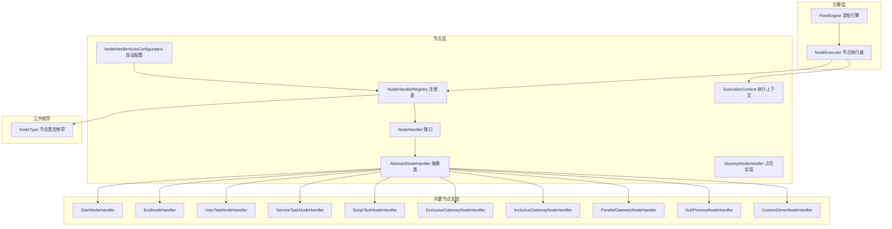
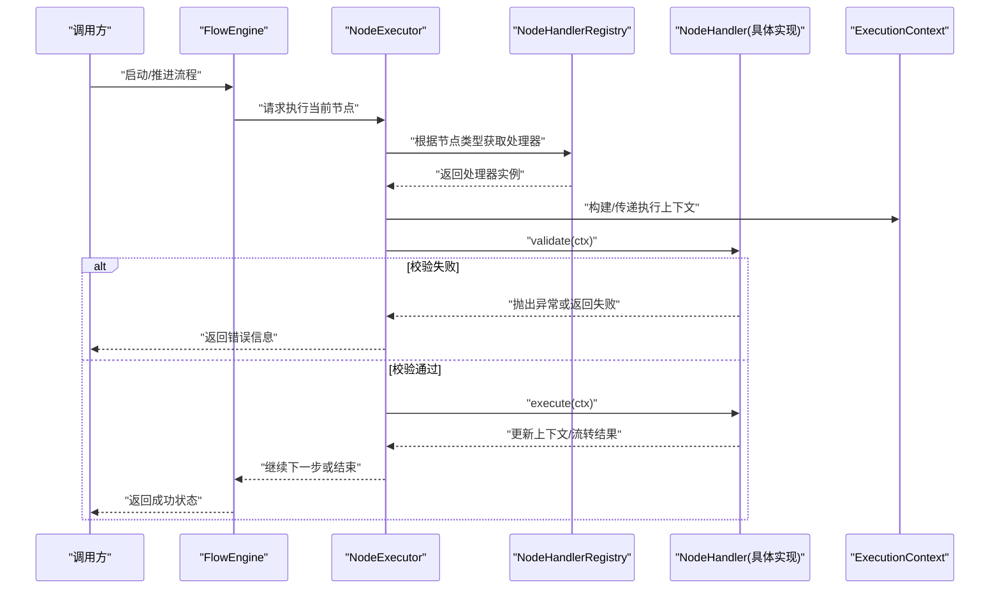
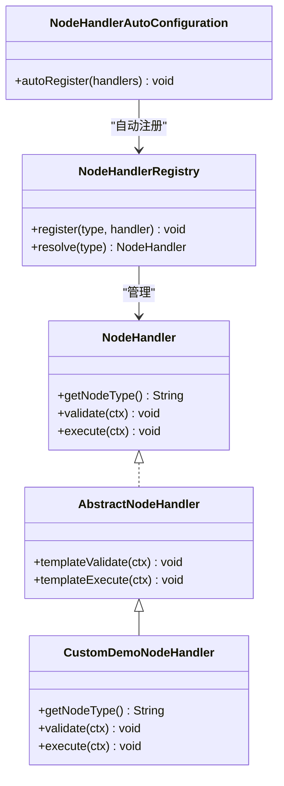
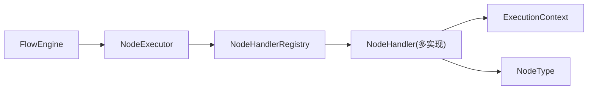

# NodeHandler接口设计

<cite>
**本文引用的文件**
- [NodeHandler.java](file://flow-engine/src/main/java/com/flow/engine/node/NodeHandler.java)
- [AbstractNodeHandler.java](file://flow-engine/src/main/java/com/flow/engine/node/AbstractNodeHandler.java)
- [DummyNodeHandler.java](file://flow-engine/src/main/java/com/flow/engine/node/DummyNodeHandler.java)
- [StartNodeHandler.java](file://flow-engine/src/main/java/com/flow/engine/node/impl/StartNodeHandler.java)
- [EndNodeHandler.java](file://flow-engine/src/main/java/com/flow/engine/node/impl/EndNodeHandler.java)
- [UserTaskNodeHandler.java](file://flow-engine/src/main/java/com/flow/engine/node/impl/UserTaskNodeHandler.java)
- [ServiceTaskNodeHandler.java](file://flow-engine/src/main/java/com/flow/engine/node/impl/ServiceTaskNodeHandler.java)
- [ScriptTaskNodeHandler.java](file://flow-engine/src/main/java/com/flow/engine/node/impl/ScriptTaskNodeHandler.java)
- [ExclusiveGatewayNodeHandler.java](file://flow-engine/src/main/java/com/flow/engine/node/impl/ExclusiveGatewayNodeHandler.java)
- [InclusiveGatewayNodeHandler.java](file://flow-engine/src/main/java/com/flow/engine/node/impl/InclusiveGatewayNodeHandler.java)
- [ParallelGatewayNodeHandler.java](file://flow-engine/src/main/java/com/flow/engine/node/impl/ParallelGatewayNodeHandler.java)
- [SubProcessNodeHandler.java](file://flow-engine/src/main/java/com/flow/engine/node/impl/SubProcessNodeHandler.java)
- [CustomDemoNodeHandler.java](file://flow-engine/src/main/java/com/flow/engine/node/impl/CustomDemoNodeHandler.java)
- [NodeHandlerRegistry.java](file://flow-engine/src/main/java/com/flow/engine/node/NodeHandlerRegistry.java)
- [NodeHandlerAutoConfiguration.java](file://flow-engine/src/main/java/com/flow/engine/node/NodeHandlerAutoConfiguration.java)
- [NodeType.java](file://flow-engine/src/main/java/com/flow/engine/common/enums/NodeType.java)
- [FlowEngine.java](file://flow-engine/src/main/java/com/flow/engine/engine/FlowEngine.java)
- [NodeExecutor.java](file://flow-engine/src/main/java/com/flow/engine/engine/NodeExecutor.java)
- [ExecutionContext.java](file://flow-engine/src/main/java/com/flow/engine/node/ExecutionContext.java)
- [BuiltinNodeTest.java](file://flow-engine/src/test/java/com/flow/engine/node/BuiltinNodeTest.java)
- [CustomNodeExtensionTest.java](file://flow-engine/src/test/java/com/flow/engine/node/CustomNodeExtensionTest.java)
- [NodeHandlerAutoRegisterTest.java](file://flow-engine/src/test/java/com/flow/engine/node/NodeHandlerAutoRegisterTest.java)
- [NodeHandlerRegistryTest.java](file://flow-engine/src/test/java/com/flow/engine/node/NodeHandlerRegistryTest.java)
</cite>

## 目录
1. [简介](#简介)
2. [项目结构](#项目结构)
3. [核心组件](#核心组件)
4. [架构总览](#架构总览)
5. [详细组件分析](#详细组件分析)
6. [依赖关系分析](#依赖关系分析)
7. [性能考虑](#性能考虑)
8. [故障排查指南](#故障排查指南)
9. [结论](#结论)
10. [附录](#附录)

## 简介
本文件围绕流程引擎中的节点处理器抽象与扩展机制，系统化阐述 NodeHandler 接口的设计模式、核心方法职责、参数规范、生命周期管理、错误处理策略以及插件化扩展方式。文档同时给出节点类型标识符的命名规范与注册机制说明，并提供实现一个基本节点处理器的最佳实践与常见陷阱，帮助开发者快速、正确地扩展自定义节点。

## 项目结构
NodeHandler 相关代码集中在 flow-engine 模块的 node 包及其 impl 子包中，配套提供自动装配与注册中心、执行上下文、内置节点实现及测试用例。

图表来源
- [NodeHandler.java](file://flow-engine/src/main/java/com/flow/engine/node/NodeHandler.java)
- [AbstractNodeHandler.java](file://flow-engine/src/main/java/com/flow/engine/node/AbstractNodeHandler.java)
- [DummyNodeHandler.java](file://flow-engine/src/main/java/com/flow/engine/node/DummyNodeHandler.java)
- [StartNodeHandler.java](file://flow-engine/src/main/java/com/flow/engine/node/impl/StartNodeHandler.java)
- [EndNodeHandler.java](file://flow-engine/src/main/java/com/flow/engine/node/impl/EndNodeHandler.java)
- [UserTaskNodeHandler.java](file://flow-engine/src/main/java/com/flow/engine/node/impl/UserTaskNodeHandler.java)
- [ServiceTaskNodeHandler.java](file://flow-engine/src/main/java/com/flow/engine/node/impl/ServiceTaskNodeHandler.java)
- [ScriptTaskNodeHandler.java](file://flow-engine/src/main/java/com/flow/engine/node/impl/ScriptTaskNodeHandler.java)
- [ExclusiveGatewayNodeHandler.java](file://flow-engine/src/main/java/com/flow/engine/node/impl/ExclusiveGatewayNodeHandler.java)
- [InclusiveGatewayNodeHandler.java](file://flow-engine/src/main/java/com/flow/engine/node/impl/InclusiveGatewayNodeHandler.java)
- [ParallelGatewayNodeHandler.java](file://flow-engine/src/main/java/com/flow/engine/node/impl/ParallelGatewayNodeHandler.java)
- [SubProcessNodeHandler.java](file://flow-engine/src/main/java/com/flow/engine/node/impl/SubProcessNodeHandler.java)
- [CustomDemoNodeHandler.java](file://flow-engine/src/main/java/com/flow/engine/node/impl/CustomDemoNodeHandler.java)
- [NodeHandlerRegistry.java](file://flow-engine/src/main/java/com/flow/engine/node/NodeHandlerRegistry.java)
- [NodeHandlerAutoConfiguration.java](file://flow-engine/src/main/java/com/flow/engine/node/NodeHandlerAutoConfiguration.java)
- [NodeType.java](file://flow-engine/src/main/java/com/flow/engine/common/enums/NodeType.java)
- [FlowEngine.java](file://flow-engine/src/main/java/com/flow/engine/engine/FlowEngine.java)
- [NodeExecutor.java](file://flow-engine/src/main/java/com/flow/engine/engine/NodeExecutor.java)
- [ExecutionContext.java](file://flow-engine/src/main/java/com/flow/engine/node/ExecutionContext.java)

章节来源
- [NodeHandler.java](file://flow-engine/src/main/java/com/flow/engine/node/NodeHandler.java)
- [AbstractNodeHandler.java](file://flow-engine/src/main/java/com/flow/engine/node/AbstractNodeHandler.java)
- [NodeHandlerRegistry.java](file://flow-engine/src/main/java/com/flow/engine/node/NodeHandlerRegistry.java)
- [NodeHandlerAutoConfiguration.java](file://flow-engine/src/main/java/com/flow/engine/node/NodeHandlerAutoConfiguration.java)
- [NodeType.java](file://flow-engine/src/main/java/com/flow/engine/common/enums/NodeType.java)
- [FlowEngine.java](file://flow-engine/src/main/java/com/flow/engine/engine/FlowEngine.java)
- [NodeExecutor.java](file://flow-engine/src/main/java/com/flow/engine/engine/NodeExecutor.java)
- [ExecutionContext.java](file://flow-engine/src/main/java/com/flow/engine/node/ExecutionContext.java)

## 核心组件
- NodeHandler 接口：定义节点处理契约，包含节点类型标识、校验、执行等核心能力。
- AbstractNodeHandler 抽象类：提供通用模板方法与默认行为，简化具体节点实现。
- DummyNodeHandler：占位实现，用于未识别节点类型的兜底处理。
- NodeHandlerRegistry：节点处理器注册中心，维护“节点类型 -> 处理器”映射。
- NodeHandlerAutoConfiguration：自动发现并注册所有 NodeHandler Bean。
- ExecutionContext：节点执行时的上下文载体，贯穿校验与执行阶段。
- FlowEngine / NodeExecutor：引擎侧调度入口，按节点类型分发到对应处理器。
- NodeType：节点类型常量或枚举，作为统一标识来源。

章节来源
- [NodeHandler.java](file://flow-engine/src/main/java/com/flow/engine/node/NodeHandler.java)
- [AbstractNodeHandler.java](file://flow-engine/src/main/java/com/flow/engine/node/AbstractNodeHandler.java)
- [DummyNodeHandler.java](file://flow-engine/src/main/java/com/flow/engine/node/DummyNodeHandler.java)
- [NodeHandlerRegistry.java](file://flow-engine/src/main/java/com/flow/engine/node/NodeHandlerRegistry.java)
- [NodeHandlerAutoConfiguration.java](file://flow-engine/src/main/java/com/flow/engine/node/NodeHandlerAutoConfiguration.java)
- [ExecutionContext.java](file://flow-engine/src/main/java/com/flow/engine/node/ExecutionContext.java)
- [FlowEngine.java](file://flow-engine/src/main/java/com/flow/engine/engine/FlowEngine.java)
- [NodeExecutor.java](file://flow-engine/src/main/java/com/flow/engine/engine/NodeExecutor.java)
- [NodeType.java](file://flow-engine/src/main/java/com/flow/engine/common/enums/NodeType.java)

## 架构总览
下图展示了从引擎到节点处理器的调用链路与关键交互点。

图表来源
- [FlowEngine.java](file://flow-engine/src/main/java/com/flow/engine/engine/FlowEngine.java)
- [NodeExecutor.java](file://flow-engine/src/main/java/com/flow/engine/engine/NodeExecutor.java)
- [NodeHandlerRegistry.java](file://flow-engine/src/main/java/com/flow/engine/node/NodeHandlerRegistry.java)
- [NodeHandler.java](file://flow-engine/src/main/java/com/flow/engine/node/NodeHandler.java)
- [ExecutionContext.java](file://flow-engine/src/main/java/com/flow/engine/node/ExecutionContext.java)

## 详细组件分析

### NodeHandler 接口设计
- 设计模式
  - 策略模式：不同节点类型由不同处理器实现同一接口，运行时动态选择。
  - 模板方法（配合抽象基类）：AbstractNodeHandler 封装通用流程，子类仅关注差异化逻辑。
  - 工厂/注册中心：NodeHandlerRegistry 集中管理处理器实例，支持自动装配。
- 核心方法职责与参数规范
  - getNodeType：返回该处理器支持的节点类型标识符，需与流程定义中的节点类型一致。
  - validate：在 execute 之前进行前置校验，如参数合法性、权限检查、条件表达式求值等；失败应抛出明确异常或返回可被上层捕获的错误信号。
  - execute：执行业务逻辑，读取/写入 ExecutionContext，决定后续分支或任务产出。
- 返回值与异常约定
  - 校验失败：建议抛出业务异常，携带错误码与消息，便于统一拦截与日志记录。
  - 执行失败：同样以异常形式上报，确保事务边界清晰、可回滚。
- 线程安全与并发
  - 处理器实例通常为单例，避免持有可变状态；若必须持有状态，应在 ExecutionContext 中隔离。

章节来源
- [NodeHandler.java](file://flow-engine/src/main/java/com/flow/engine/node/NodeHandler.java)
- [AbstractNodeHandler.java](file://flow-engine/src/main/java/com/flow/engine/node/AbstractNodeHandler.java)

### 抽象基类与占位实现
- AbstractNodeHandler
  - 提供通用模板方法，例如统一的校验-执行包装、日志埋点、异常转换等。
  - 子类可覆写特定钩子方法以实现差异化逻辑。
- DummyNodeHandler
  - 对未知或未注册的节点类型提供兜底行为，避免流程中断。

章节来源
- [AbstractNodeHandler.java](file://flow-engine/src/main/java/com/flow/engine/node/AbstractNodeHandler.java)
- [DummyNodeHandler.java](file://flow-engine/src/main/java/com/flow/engine/node/DummyNodeHandler.java)

### 内置节点处理器一览
- StartNodeHandler：流程起始节点，负责初始化上下文与变量。
- EndNodeHandler：流程结束节点，负责收尾与清理。
- UserTaskNodeHandler：人工任务节点，创建待办任务、等待用户操作。
- ServiceTaskNodeHandler：服务任务节点，调用外部服务或内部方法。
- ScriptTaskNodeHandler：脚本任务节点，执行脚本语言逻辑。
- ExclusiveGatewayNodeHandler：排他网关，基于条件选择唯一分支。
- InclusiveGatewayNodeHandler：包容网关，满足条件的多条分支并行。
- ParallelGatewayNodeHandler：并行网关，同步汇聚与分派。
- SubProcessNodeHandler：子流程节点，嵌套流程执行。
- CustomDemoNodeHandler：示例自定义节点，演示扩展方式。

章节来源
- [StartNodeHandler.java](file://flow-engine/src/main/java/com/flow/engine/node/impl/StartNodeHandler.java)
- [EndNodeHandler.java](file://flow-engine/src/main/java/com/flow/engine/node/impl/EndNodeHandler.java)
- [UserTaskNodeHandler.java](file://flow-engine/src/main/java/com/flow/engine/node/impl/UserTaskNodeHandler.java)
- [ServiceTaskNodeHandler.java](file://flow-engine/src/main/java/com/flow/engine/node/impl/ServiceTaskNodeHandler.java)
- [ScriptTaskNodeHandler.java](file://flow-engine/src/main/java/com/flow/engine/node/impl/ScriptTaskNodeHandler.java)
- [ExclusiveGatewayNodeHandler.java](file://flow-engine/src/main/java/com/flow/engine/node/impl/ExclusiveGatewayNodeHandler.java)
- [InclusiveGatewayNodeHandler.java](file://flow-engine/src/main/java/com/flow/engine/node/impl/InclusiveGatewayNodeHandler.java)
- [ParallelGatewayNodeHandler.java](file://flow-engine/src/main/java/com/flow/engine/node/impl/ParallelGatewayNodeHandler.java)
- [SubProcessNodeHandler.java](file://flow-engine/src/main/java/com/flow/engine/node/impl/SubProcessNodeHandler.java)
- [CustomDemoNodeHandler.java](file://flow-engine/src/main/java/com/flow/engine/node/impl/CustomDemoNodeHandler.java)

### 节点类型标识符与注册机制
- 命名规范
  - 使用小写字母、数字与下划线组成的短标识，语义清晰且稳定。
  - 与 NodeType 枚举或常量保持一致，避免硬编码字符串散落各处。
- 注册机制
  - 自动装配：NodeHandlerAutoConfiguration 扫描所有 NodeHandler Bean 并注入注册表。
  - 显式注册：NodeHandlerRegistry 提供 API 将“节点类型 -> 处理器”映射加入运行期容器。
  - 冲突处理：重复类型注册时应有覆盖或拒绝策略，保证唯一性。
- 查找与分发
  - NodeExecutor 在执行前通过注册表按节点类型解析处理器，再调用其 validate/execute。

章节来源
- [NodeType.java](file://flow-engine/src/main/java/com/flow/engine/common/enums/NodeType.java)
- [NodeHandlerRegistry.java](file://flow-engine/src/main/java/com/flow/engine/node/NodeHandlerRegistry.java)
- [NodeHandlerAutoConfiguration.java](file://flow-engine/src/main/java/com/flow/engine/node/NodeHandlerAutoConfiguration.java)
- [NodeExecutor.java](file://flow-engine/src/main/java/com/flow/engine/engine/NodeExecutor.java)

### 生命周期管理与错误处理
- 生命周期
  - 构造：Spring 容器创建处理器 Bean。
  - 初始化：自动配置阶段完成注册。
  - 执行：引擎进入节点时，先 validate，后 execute。
  - 销毁：应用关闭时释放资源（如有）。
- 错误处理
  - 校验失败：抛出带错误码的业务异常，由全局异常处理器统一响应。
  - 执行失败：记录上下文快照与堆栈，必要时触发补偿或重试。
  - 兜底：DummyNodeHandler 对未知类型提供最小化处理，防止流程崩溃。

章节来源
- [DummyNodeHandler.java](file://flow-engine/src/main/java/com/flow/engine/node/DummyNodeHandler.java)
- [NodeHandlerAutoConfiguration.java](file://flow-engine/src/main/java/com/flow/engine/node/NodeHandlerAutoConfiguration.java)
- [NodeExecutor.java](file://flow-engine/src/main/java/com/flow/engine/engine/NodeExecutor.java)

### 扩展机制与插件化设计
- 插件化要点
  - 新增节点类型只需实现 NodeHandler 并通过 Spring 暴露为 Bean，即可被自动注册。
  - 通过 ExecutionContext 共享数据，避免处理器间直接耦合。
  - 结合事件机制（如流程事件监听）实现横切关注点（审计、通知等）。
- 版本兼容
  - 保持 getNodeType 稳定，变更时采用新标识并兼容旧流程迁移。
  - 校验与执行逻辑演进遵循向后兼容原则。

章节来源
- [NodeHandler.java](file://flow-engine/src/main/java/com/flow/engine/node/NodeHandler.java)
- [ExecutionContext.java](file://flow-engine/src/main/java/com/flow/engine/node/ExecutionContext.java)
- [NodeHandlerAutoConfiguration.java](file://flow-engine/src/main/java/com/flow/engine/node/NodeHandlerAutoConfiguration.java)

### 实现最佳实践与常见陷阱
- 最佳实践
  - 单一职责：每个处理器只关心一种节点类型。
  - 无状态设计：不在处理器内保存可变状态，使用 ExecutionContext 传递数据。
  - 幂等性：execute 尽量幂等，便于重试与恢复。
  - 明确异常：区分参数错误、业务错误与系统错误，携带可读信息。
  - 单元测试：覆盖 validate 边界与 execute 正常/异常路径。
- 常见陷阱
  - 忘记实现 getNodeType 或返回不一致的类型标识。
  - 在处理器中持有长生命周期对象导致内存泄漏。
  - 忽略校验直接执行，导致下游错误难以定位。
  - 并发修改共享上下文引发竞态条件。

章节来源
- [AbstractNodeHandler.java](file://flow-engine/src/main/java/com/flow/engine/node/AbstractNodeHandler.java)
- [NodeHandlerRegistry.java](file://flow-engine/src/main/java/com/flow/engine/node/NodeHandlerRegistry.java)
- [ExecutionContext.java](file://flow-engine/src/main/java/com/flow/engine/node/ExecutionContext.java)

### 完整示例：实现一个基本节点处理器
以下为一个“示例自定义节点处理器”的实现参考路径，展示如何声明节点类型、实现校验与执行逻辑，并通过自动装配注册。

图表来源
- [NodeHandler.java](file://flow-engine/src/main/java/com/flow/engine/node/NodeHandler.java)
- [AbstractNodeHandler.java](file://flow-engine/src/main/java/com/flow/engine/node/AbstractNodeHandler.java)
- [CustomDemoNodeHandler.java](file://flow-engine/src/main/java/com/flow/engine/node/impl/CustomDemoNodeHandler.java)
- [NodeHandlerRegistry.java](file://flow-engine/src/main/java/com/flow/engine/node/NodeHandlerRegistry.java)
- [NodeHandlerAutoConfiguration.java](file://flow-engine/src/main/java/com/flow/engine/node/NodeHandlerAutoConfiguration.java)

章节来源
- [CustomDemoNodeHandler.java](file://flow-engine/src/main/java/com/flow/engine/node/impl/CustomDemoNodeHandler.java)
- [NodeHandlerAutoConfiguration.java](file://flow-engine/src/main/java/com/flow/engine/node/NodeHandlerAutoConfiguration.java)
- [NodeHandlerRegistry.java](file://flow-engine/src/main/java/com/flow/engine/node/NodeHandlerRegistry.java)

## 依赖关系分析
- 组件耦合
  - 处理器与注册表松耦合：通过接口与类型标识解耦。
  - 引擎与处理器间接耦合：引擎不感知具体处理器实现，仅依赖注册表。
- 外部依赖
  - Spring 容器：Bean 发现与自动装配。
  - 数据库/缓存：部分处理器可能读写持久化或缓存，需关注事务与一致性。
- 循环依赖
  - 应避免处理器之间互相依赖，如需协作，通过上下文或服务层中转。

图表来源
- [FlowEngine.java](file://flow-engine/src/main/java/com/flow/engine/engine/FlowEngine.java)
- [NodeExecutor.java](file://flow-engine/src/main/java/com/flow/engine/engine/NodeExecutor.java)
- [NodeHandlerRegistry.java](file://flow-engine/src/main/java/com/flow/engine/node/NodeHandlerRegistry.java)
- [NodeHandler.java](file://flow-engine/src/main/java/com/flow/engine/node/NodeHandler.java)
- [ExecutionContext.java](file://flow-engine/src/main/java/com/flow/engine/node/ExecutionContext.java)
- [NodeType.java](file://flow-engine/src/main/java/com/flow/engine/common/enums/NodeType.java)

章节来源
- [FlowEngine.java](file://flow-engine/src/main/java/com/flow/engine/engine/FlowEngine.java)
- [NodeExecutor.java](file://flow-engine/src/main/java/com/flow/engine/engine/NodeExecutor.java)
- [NodeHandlerRegistry.java](file://flow-engine/src/main/java/com/flow/engine/node/NodeHandlerRegistry.java)
- [NodeHandler.java](file://flow-engine/src/main/java/com/flow/engine/node/NodeHandler.java)
- [ExecutionContext.java](file://flow-engine/src/main/java/com/flow/engine/node/ExecutionContext.java)
- [NodeType.java](file://flow-engine/src/main/java/com/flow/engine/common/enums/NodeType.java)

## 性能考虑
- 处理器应为轻量级无状态对象，避免阻塞操作；I/O 与耗时计算异步化。
- 批量节点执行时，减少上下文序列化/反序列化开销。
- 合理设置超时与重试策略，避免长时间占用线程池。
- 对网关类处理器，优化条件表达式求值与分支选择算法。

[本节为通用指导，无需源码引用]

## 故障排查指南
- 常见问题
  - 节点类型未注册：检查是否实现 NodeHandler 并被自动装配扫描到。
  - 校验失败：查看 validate 抛出的异常信息与错误码。
  - 执行异常：检查 execute 中的外部依赖与上下文数据完整性。
- 定位手段
  - 启用调试日志，观察引擎分发与处理器调用链路。
  - 使用测试用例复现问题，逐步缩小范围。
- 参考测试
  - 内置节点测试、自定义节点扩展测试、自动注册与注册表测试。

章节来源
- [BuiltinNodeTest.java](file://flow-engine/src/test/java/com/flow/engine/node/BuiltinNodeTest.java)
- [CustomNodeExtensionTest.java](file://flow-engine/src/test/java/com/flow/engine/node/CustomNodeExtensionTest.java)
- [NodeHandlerAutoRegisterTest.java](file://flow-engine/src/test/java/com/flow/engine/node/NodeHandlerAutoRegisterTest.java)
- [NodeHandlerRegistryTest.java](file://flow-engine/src/test/java/com/flow/engine/node/NodeHandlerRegistryTest.java)

## 结论
NodeHandler 接口以清晰的契约与灵活的扩展机制，支撑了流程引擎的可插拔节点体系。通过统一的类型标识、注册中心与自动装配，开发者可以低成本地扩展新的节点类型。遵循无状态、幂等、强校验与明确异常的最佳实践，能够显著提升系统的稳定性与可维护性。

[本节为总结性内容，无需源码引用]

## 附录
- 术语
  - 节点类型：流程图中节点的唯一标识，用于路由到对应处理器。
  - 执行上下文：跨处理器共享的数据载体，承载流程变量、临时状态等。
  - 自动装配：框架自动发现并注册处理器 Bean 的机制。
- 参考路径
  - 接口定义：[NodeHandler.java](file://flow-engine/src/main/java/com/flow/engine/node/NodeHandler.java)
  - 抽象基类：[AbstractNodeHandler.java](file://flow-engine/src/main/java/com/flow/engine/node/AbstractNodeHandler.java)
  - 自动配置：[NodeHandlerAutoConfiguration.java](file://flow-engine/src/main/java/com/flow/engine/node/NodeHandlerAutoConfiguration.java)
  - 注册中心：[NodeHandlerRegistry.java](file://flow-engine/src/main/java/com/flow/engine/node/NodeHandlerRegistry.java)
  - 执行上下文：[ExecutionContext.java](file://flow-engine/src/main/java/com/flow/engine/node/ExecutionContext.java)
  - 引擎入口：[FlowEngine.java](file://flow-engine/src/main/java/com/flow/engine/engine/FlowEngine.java)、[NodeExecutor.java](file://flow-engine/src/main/java/com/flow/engine/engine/NodeExecutor.java)
  - 节点类型：[NodeType.java](file://flow-engine/src/main/java/com/flow/engine/common/enums/NodeType.java)