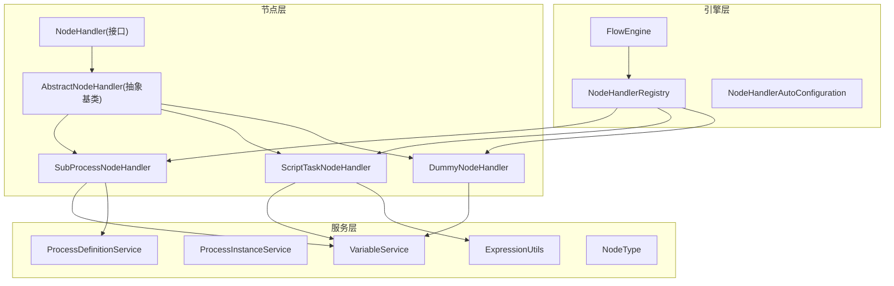
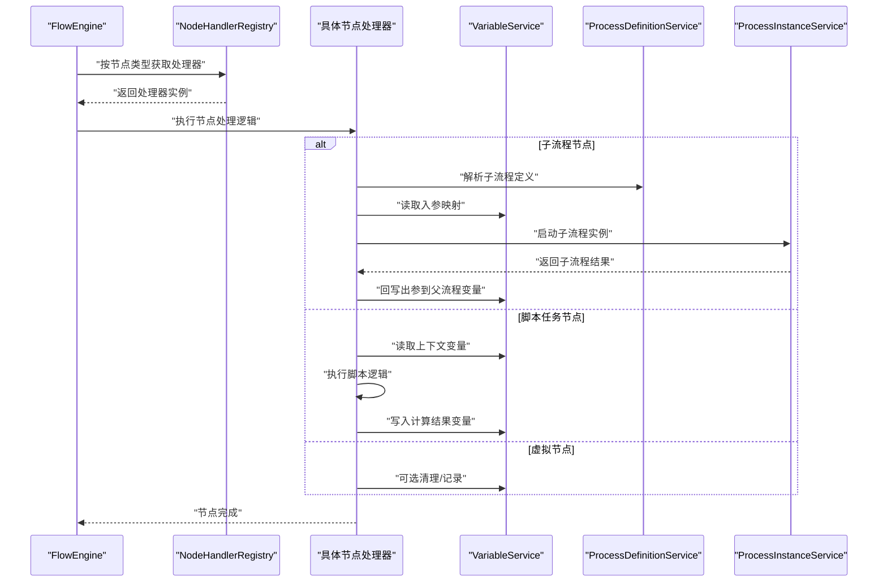
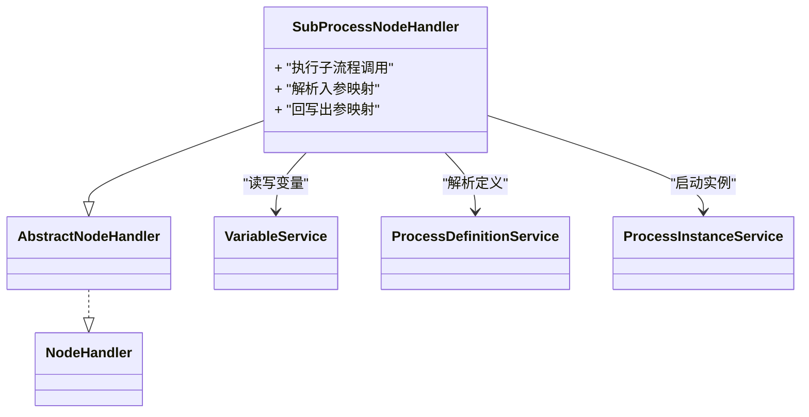
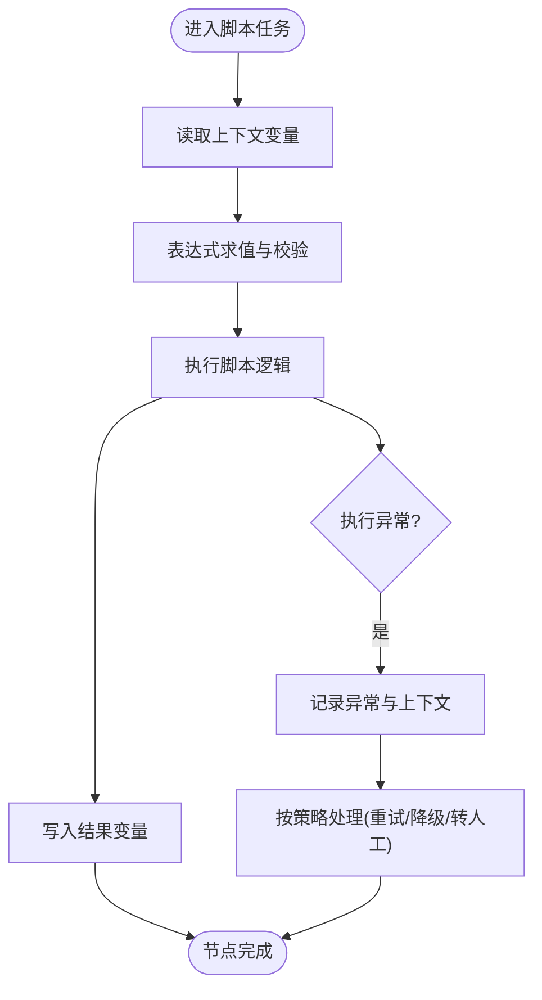
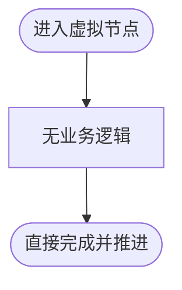
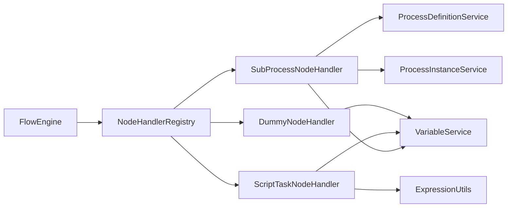

# 专用节点

<cite>
**本文引用的文件**   
- [SubProcessNodeHandler.java](file://flow-engine/src/main/java/com/flow/engine/node/impl/SubProcessNodeHandler.java)
- [ScriptTaskNodeHandler.java](file://flow-engine/src/main/java/com/flow/engine/node/impl/ScriptTaskNodeHandler.java)
- [DummyNodeHandler.java](file://flow-engine/src/main/java/com/flow/engine/node/DummyNodeHandler.java)
- [AbstractNodeHandler.java](file://flow-engine/src/main/java/com/flow/engine/node/AbstractNodeHandler.java)
- [NodeHandler.java](file://flow-engine/src/main/java/com/flow/engine/node/NodeHandler.java)
- [NodeHandlerRegistry.java](file://flow-engine/src/main/java/com/flow/engine/node/NodeHandlerRegistry.java)
- [NodeHandlerAutoConfiguration.java](file://flow-engine/src/main/java/com/flow/engine/node/NodeHandlerAutoConfiguration.java)
- [FlowEngine.java](file://flow-engine/src/main/java/com/flow/engine/engine/FlowEngine.java)
- [VariableService.java](file://flow-engine/src/main/java/com/flow/engine/service/VariableService.java)
- [ProcessInstanceService.java](file://flow-engine/src/main/java/com/flow/engine/service/ProcessInstanceService.java)
- [ProcessDefinitionService.java](file://flow-engine/src/main/java/com/flow/engine/service/ProcessDefinitionService.java)
- [ExpressionUtils.java](file://flow-engine/src/main/java/com/flow/engine/common/utils/ExpressionUtils.java)
- [NodeType.java](file://flow-engine/src/main/java/com/flow/engine/common/enums/NodeType.java)
</cite>

## 目录
1. [简介](#简介)
2. [项目结构](#项目结构)
3. [核心组件](#核心组件)
4. [架构总览](#架构总览)
5. [详细组件分析](#详细组件分析)
6. [依赖分析](#依赖分析)
7. [性能考虑](#性能考虑)
8. [故障排查指南](#故障排查指南)
9. [结论](#结论)
10. [附录](#附录)

## 简介
本章节聚焦于流程引擎中的三类“专用节点”：子流程节点(SubProcess)、脚本任务节点(ScriptTask)与虚拟节点(Dummy)。文档将系统阐述其功能特性、使用场景、参数传递与结果返回机制、动态执行与安全控制、调试方法，以及在复杂流程设计中的最佳实践。读者无需深入源码即可理解如何正确配置与扩展这些节点以支撑实际业务。

## 项目结构
专用节点的实现位于 flow-engine 模块的 node 包中，遵循统一的处理器接口与抽象基类，并通过自动装配注册到节点调度中心。关键路径如下：
- 节点处理器实现：SubProcessNodeHandler、ScriptTaskNodeHandler、DummyNodeHandler
- 统一接口与抽象：NodeHandler、AbstractNodeHandler
- 注册与自动装配：NodeHandlerRegistry、NodeHandlerAutoConfiguration
- 引擎调度入口：FlowEngine
- 变量与流程服务：VariableService、ProcessInstanceService、ProcessDefinitionService
- 表达式工具与类型枚举：ExpressionUtils、NodeType

图表来源
- [SubProcessNodeHandler.java](file://flow-engine/src/main/java/com/flow/engine/node/impl/SubProcessNodeHandler.java)
- [ScriptTaskNodeHandler.java](file://flow-engine/src/main/java/com/flow/engine/node/impl/ScriptTaskNodeHandler.java)
- [DummyNodeHandler.java](file://flow-engine/src/main/java/com/flow/engine/node/DummyNodeHandler.java)
- [AbstractNodeHandler.java](file://flow-engine/src/main/java/com/flow/engine/node/AbstractNodeHandler.java)
- [NodeHandler.java](file://flow-engine/src/main/java/com/flow/engine/node/NodeHandler.java)
- [NodeHandlerRegistry.java](file://flow-engine/src/main/java/com/flow/engine/node/NodeHandlerRegistry.java)
- [NodeHandlerAutoConfiguration.java](file://flow-engine/src/main/java/com/flow/engine/node/NodeHandlerAutoConfiguration.java)
- [FlowEngine.java](file://flow-engine/src/main/java/com/flow/engine/engine/FlowEngine.java)
- [VariableService.java](file://flow-engine/src/main/java/com/flow/engine/service/VariableService.java)
- [ProcessInstanceService.java](file://flow-engine/src/main/java/com/flow/engine/service/ProcessInstanceService.java)
- [ProcessDefinitionService.java](file://flow-engine/src/main/java/com/flow/engine/service/ProcessDefinitionService.java)
- [ExpressionUtils.java](file://flow-engine/src/main/java/com/flow/engine/common/utils/ExpressionUtils.java)
- [NodeType.java](file://flow-engine/src/main/java/com/flow/engine/common/enums/NodeType.java)

章节来源
- [SubProcessNodeHandler.java](file://flow-engine/src/main/java/com/flow/engine/node/impl/SubProcessNodeHandler.java)
- [ScriptTaskNodeHandler.java](file://flow-engine/src/main/java/com/flow/engine/node/impl/ScriptTaskNodeHandler.java)
- [DummyNodeHandler.java](file://flow-engine/src/main/java/com/flow/engine/node/DummyNodeHandler.java)
- [AbstractNodeHandler.java](file://flow-engine/src/main/java/com/flow/engine/node/AbstractNodeHandler.java)
- [NodeHandler.java](file://flow-engine/src/main/java/com/flow/engine/node/NodeHandler.java)
- [NodeHandlerRegistry.java](file://flow-engine/src/main/java/com/flow/engine/node/NodeHandlerRegistry.java)
- [NodeHandlerAutoConfiguration.java](file://flow-engine/src/main/java/com/flow/engine/node/NodeHandlerAutoConfiguration.java)
- [FlowEngine.java](file://flow-engine/src/main/java/com/flow/engine/engine/FlowEngine.java)
- [VariableService.java](file://flow-engine/src/main/java/com/flow/engine/service/VariableService.java)
- [ProcessInstanceService.java](file://flow-engine/src/main/java/com/flow/engine/service/ProcessInstanceService.java)
- [ProcessDefinitionService.java](file://flow-engine/src/main/java/com/flow/engine/service/ProcessDefinitionService.java)
- [ExpressionUtils.java](file://flow-engine/src/main/java/com/flow/engine/common/utils/ExpressionUtils.java)
- [NodeType.java](file://flow-engine/src/main/java/com/flow/engine/common/enums/NodeType.java)

## 核心组件
- 子流程节点(SubProcess)
  - 能力：在父流程中调用另一个已定义流程作为子流程，支持入参映射与出参回写，便于复用通用业务能力（如审批、校验、数据准备）。
  - 关键点：子流程实例的生命周期与父流程关联；入参通过变量映射注入；出参通过变量写入父流程上下文。
- 脚本任务节点(ScriptTask)
  - 能力：在流程运行时动态执行脚本逻辑，适合轻量计算、数据转换或外部系统对接的快速集成。
  - 关键点：脚本内容可配置；执行环境需具备安全沙箱与权限控制；提供调试日志与断点辅助定位问题。
- 虚拟节点(Dummy)
  - 能力：不执行业务逻辑的占位节点，用于流程建模时的分支占位、条件路由占位或测试桩。
  - 关键点：通常直接完成并推进流程，便于在设计期与运行期保持一致的结构语义。

章节来源
- [SubProcessNodeHandler.java](file://flow-engine/src/main/java/com/flow/engine/node/impl/SubProcessNodeHandler.java)
- [ScriptTaskNodeHandler.java](file://flow-engine/src/main/java/com/flow/engine/node/impl/ScriptTaskNodeHandler.java)
- [DummyNodeHandler.java](file://flow-engine/src/main/java/com/flow/engine/node/DummyNodeHandler.java)

## 架构总览
专用节点通过统一的 NodeHandler 接口接入引擎调度，由 NodeHandlerRegistry 管理注册与分发，FlowEngine 在执行过程中根据当前节点类型选择对应处理器。变量读写通过 VariableService 完成，子流程的调用依赖 ProcessDefinitionService 解析目标流程定义，必要时结合 ProcessInstanceService 创建子流程实例。

图表来源
- [FlowEngine.java](file://flow-engine/src/main/java/com/flow/engine/engine/FlowEngine.java)
- [NodeHandlerRegistry.java](file://flow-engine/src/main/java/com/flow/engine/node/NodeHandlerRegistry.java)
- [SubProcessNodeHandler.java](file://flow-engine/src/main/java/com/flow/engine/node/impl/SubProcessNodeHandler.java)
- [ScriptTaskNodeHandler.java](file://flow-engine/src/main/java/com/flow/engine/node/impl/ScriptTaskNodeHandler.java)
- [DummyNodeHandler.java](file://flow-engine/src/main/java/com/flow/engine/node/DummyNodeHandler.java)
- [VariableService.java](file://flow-engine/src/main/java/com/flow/engine/service/VariableService.java)
- [ProcessDefinitionService.java](file://flow-engine/src/main/java/com/flow/engine/service/ProcessDefinitionService.java)
- [ProcessInstanceService.java](file://flow-engine/src/main/java/com/flow/engine/service/ProcessInstanceService.java)

## 详细组件分析

### 子流程节点(SubProcess)
- 功能特性
  - 嵌套调用：父流程节点触发后，引擎解析目标子流程定义并创建子流程实例，子流程独立运行并在完成后向父流程返回结果。
  - 参数传递：通过入参映射将父流程变量注入到子流程上下文；支持表达式求值与类型转换。
  - 结果返回：子流程完成后，将指定变量回写到父流程上下文，供后续节点消费。
- 使用场景
  - 通用能力复用：如“合同校验”、“发票审核”等跨流程复用的业务块。
  - 复杂流程拆分：将大流程拆分为多个子流程，提升可维护性与可读性。
- 配置要点
  - 目标子流程标识：明确要调用的子流程定义。
  - 入参映射表：键为子流程变量名，值为父流程变量或表达式。
  - 出参映射表：键为父流程变量名，值为子流程输出变量。
- 错误处理
  - 子流程异常应向上抛出，父流程可根据策略进行重试、降级或转人工。
  - 建议在子流程内部对关键步骤增加补偿与幂等保护。

图表来源
- [SubProcessNodeHandler.java](file://flow-engine/src/main/java/com/flow/engine/node/impl/SubProcessNodeHandler.java)
- [AbstractNodeHandler.java](file://flow-engine/src/main/java/com/flow/engine/node/AbstractNodeHandler.java)
- [NodeHandler.java](file://flow-engine/src/main/java/com/flow/engine/node/NodeHandler.java)
- [VariableService.java](file://flow-engine/src/main/java/com/flow/engine/service/VariableService.java)
- [ProcessDefinitionService.java](file://flow-engine/src/main/java/com/flow/engine/service/ProcessDefinitionService.java)
- [ProcessInstanceService.java](file://flow-engine/src/main/java/com/flow/engine/service/ProcessInstanceService.java)

章节来源
- [SubProcessNodeHandler.java](file://flow-engine/src/main/java/com/flow/engine/node/impl/SubProcessNodeHandler.java)
- [VariableService.java](file://flow-engine/src/main/java/com/flow/engine/service/VariableService.java)
- [ProcessDefinitionService.java](file://flow-engine/src/main/java/com/flow/engine/service/ProcessDefinitionService.java)
- [ProcessInstanceService.java](file://flow-engine/src/main/java/com/flow/engine/service/ProcessInstanceService.java)

### 脚本任务节点(ScriptTask)
- 功能特性
  - 动态执行：在流程运行时加载并执行配置的脚本，适合快速实现数据转换、规则判断或轻量外部调用。
  - 安全控制：建议启用脚本沙箱、限制系统资源访问、白名单函数与超时控制，防止恶意或低效脚本影响系统稳定性。
  - 调试方法：提供执行日志、变量快照与异常堆栈；支持断点与逐步执行（若脚本引擎支持）。
- 使用场景
  - 临时逻辑：在正式服务未就绪时，用脚本快速验证流程。
  - 轻量计算：对输入数据进行格式化、聚合或简单规则判定。
- 配置要点
  - 脚本语言与版本：确保与引擎支持的脚本引擎一致。
  - 执行上下文：仅暴露必要变量与方法，避免泄露敏感信息。
  - 超时与重试：设置合理的超时阈值与失败重试策略。
- 错误处理
  - 捕获脚本语法错误与运行时异常，记录完整上下文以便排查。
  - 对于不可恢复错误，应终止节点并通知上游进行人工干预。

图表来源
- [ScriptTaskNodeHandler.java](file://flow-engine/src/main/java/com/flow/engine/node/impl/ScriptTaskNodeHandler.java)
- [ExpressionUtils.java](file://flow-engine/src/main/java/com/flow/engine/common/utils/ExpressionUtils.java)
- [VariableService.java](file://flow-engine/src/main/java/com/flow/engine/service/VariableService.java)

章节来源
- [ScriptTaskNodeHandler.java](file://flow-engine/src/main/java/com/flow/engine/node/impl/ScriptTaskNodeHandler.java)
- [ExpressionUtils.java](file://flow-engine/src/main/java/com/flow/engine/common/utils/ExpressionUtils.java)
- [VariableService.java](file://flow-engine/src/main/java/com/flow/engine/service/VariableService.java)

### 虚拟节点(Dummy)
- 功能特性
  - 占位与建模：用于流程设计期的占位、分支占位或测试桩，保持流程结构的完整性。
  - 无业务逻辑：通常直接完成节点，不改变变量状态，便于快速推进流程。
- 使用场景
  - 条件分支占位：当某分支暂时不需要逻辑时，用 Dummy 占位，后续再替换为真实节点。
  - 测试与演示：在演示环境中用 Dummy 替代耗时或外部依赖节点，加速流程流转。
- 配置要点
  - 一般无需额外配置，仅需在流程定义中标识节点类型为 Dummy。
  - 可在审计或监控中记录 Dummy 节点的进入与完成事件，便于追踪。

图表来源
- [DummyNodeHandler.java](file://flow-engine/src/main/java/com/flow/engine/node/DummyNodeHandler.java)

章节来源
- [DummyNodeHandler.java](file://flow-engine/src/main/java/com/flow/engine/node/DummyNodeHandler.java)

## 依赖分析
- 组件耦合
  - 所有专用节点均继承自 AbstractNodeHandler 并实现 NodeHandler 接口，保证统一的执行契约。
  - 节点处理器通过 NodeHandlerRegistry 注册并由 FlowEngine 调度，降低耦合度，提高可扩展性。
- 外部依赖
  - 变量读写依赖 VariableService；子流程调用依赖 ProcessDefinitionService 与 ProcessInstanceService；脚本任务依赖 ExpressionUtils 进行表达式求值。
- 潜在循环依赖
  - 节点处理器与服务层之间为单向依赖，未发现循环引用；但需注意在自定义扩展中避免引入新的循环依赖。

图表来源
- [FlowEngine.java](file://flow-engine/src/main/java/com/flow/engine/engine/FlowEngine.java)
- [NodeHandlerRegistry.java](file://flow-engine/src/main/java/com/flow/engine/node/NodeHandlerRegistry.java)
- [SubProcessNodeHandler.java](file://flow-engine/src/main/java/com/flow/engine/node/impl/SubProcessNodeHandler.java)
- [ScriptTaskNodeHandler.java](file://flow-engine/src/main/java/com/flow/engine/node/impl/ScriptTaskNodeHandler.java)
- [DummyNodeHandler.java](file://flow-engine/src/main/java/com/flow/engine/node/DummyNodeHandler.java)
- [VariableService.java](file://flow-engine/src/main/java/com/flow/engine/service/VariableService.java)
- [ProcessDefinitionService.java](file://flow-engine/src/main/java/com/flow/engine/service/ProcessDefinitionService.java)
- [ProcessInstanceService.java](file://flow-engine/src/main/java/com/flow/engine/service/ProcessInstanceService.java)
- [ExpressionUtils.java](file://flow-engine/src/main/java/com/flow/engine/common/utils/ExpressionUtils.java)

章节来源
- [NodeHandler.java](file://flow-engine/src/main/java/com/flow/engine/node/NodeHandler.java)
- [AbstractNodeHandler.java](file://flow-engine/src/main/java/com/flow/engine/node/AbstractNodeHandler.java)
- [NodeHandlerRegistry.java](file://flow-engine/src/main/java/com/flow/engine/node/NodeHandlerRegistry.java)
- [NodeHandlerAutoConfiguration.java](file://flow-engine/src/main/java/com/flow/engine/node/NodeHandlerAutoConfiguration.java)
- [FlowEngine.java](file://flow-engine/src/main/java/com/flow/engine/engine/FlowEngine.java)

## 性能考虑
- 子流程调用
  - 避免过深的嵌套层级，合理拆分流程以提升可维护性与执行效率。
  - 对频繁调用的子流程进行缓存优化（如定义解析缓存），减少重复开销。
- 脚本任务
  - 控制脚本复杂度与执行时间，避免长时间阻塞流程线程。
  - 对表达式求值进行缓存与预编译，减少重复计算。
- 虚拟节点
  - 由于无业务逻辑，性能开销极低，主要关注审计与监控带来的额外 IO。

[本节为通用指导，不涉及具体文件分析]

## 故障排查指南
- 常见问题
  - 子流程参数映射错误：检查入参映射键名与类型是否与子流程定义一致。
  - 脚本语法或运行时异常：查看执行日志与异常堆栈，确认上下文变量是否齐全。
  - 虚拟节点未推进：确认节点类型配置是否正确，是否存在前置条件未满足。
- 调试方法
  - 开启详细日志，记录变量快照与执行轨迹。
  - 针对脚本任务，采用分步执行与最小化脚本复现问题。
  - 对子流程调用，先单独运行子流程验证其正确性，再回归父流程。

章节来源
- [ScriptTaskNodeHandler.java](file://flow-engine/src/main/java/com/flow/engine/node/impl/ScriptTaskNodeHandler.java)
- [SubProcessNodeHandler.java](file://flow-engine/src/main/java/com/flow/engine/node/impl/SubProcessNodeHandler.java)
- [DummyNodeHandler.java](file://flow-engine/src/main/java/com/flow/engine/node/DummyNodeHandler.java)

## 结论
专用节点为流程引擎提供了强大的扩展能力：子流程实现能力复用与流程拆分，脚本任务提供灵活快速的逻辑实现，虚拟节点保障流程建模的完整性与可演进性。通过规范的参数映射、严格的安全控制与完善的调试手段，可以在保证稳定性的同时提升开发效率与系统可维护性。

[本节为总结性内容，不涉及具体文件分析]

## 附录
- 最佳实践
  - 子流程：将高内聚的业务能力封装为子流程，明确入参与出参契约，避免隐式依赖。
  - 脚本任务：优先使用表达式与现有服务，仅在必要时编写脚本；严格控制执行环境与权限。
  - 虚拟节点：在设计与测试阶段广泛使用，逐步替换为真实节点，保持流程演进的平滑过渡。
- 相关类型参考
  - NodeType 枚举定义了节点类型常量，便于在流程定义与代码中进行类型匹配与分发。

章节来源
- [NodeType.java](file://flow-engine/src/main/java/com/flow/engine/common/enums/NodeType.java)