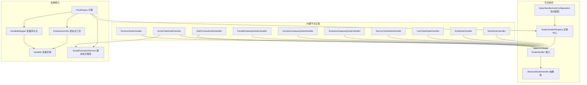
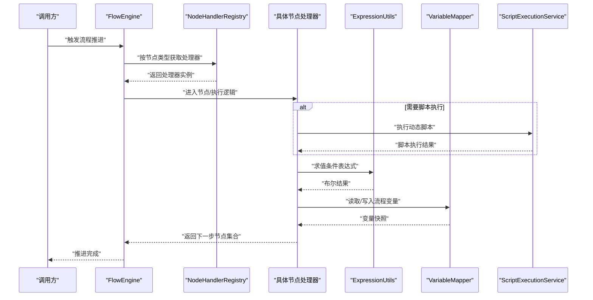
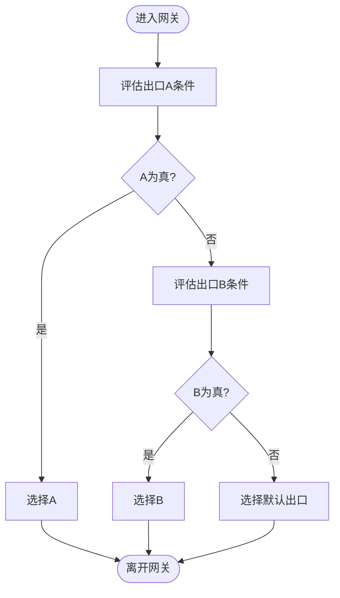
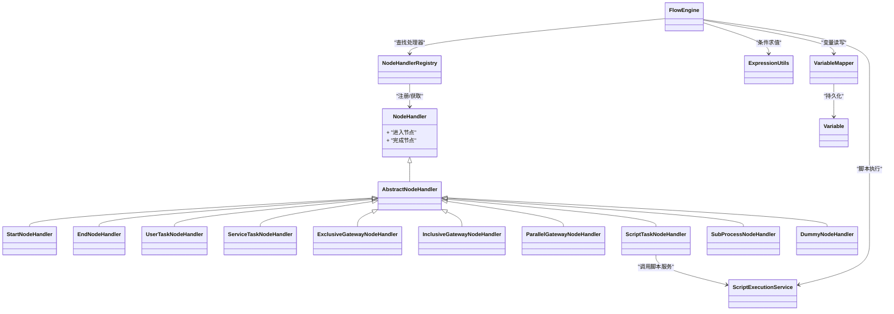

# 内置节点类型

<cite>
**本文引用的文件**   
- [NodeType.java](file://flow-engine/src/main/java/com/flow/engine/common/enums/NodeType.java)
- [NodeHandler.java](file://flow-engine/src/main/java/com/flow/engine/node/NodeHandler.java)
- [AbstractNodeHandler.java](file://flow-engine/src/main/java/com/flow/engine/node/AbstractNodeHandler.java)
- [NodeHandlerRegistry.java](file://flow-engine/src/main/java/com/flow/engine/node/NodeHandlerRegistry.java)
- [NodeHandlerAutoConfiguration.java](file://flow-engine/src/main/java/com/flow/engine/node/NodeHandlerAutoConfiguration.java)
- [StartNodeHandler.java](file://flow-engine/src/main/java/com/flow/engine/node/impl/StartNodeHandler.java)
- [EndNodeHandler.java](file://flow-engine/src/main/java/com/flow/engine/node/impl/EndNodeHandler.java)
- [UserTaskNodeHandler.java](file://flow-engine/src/main/java/com/flow/engine/node/impl/UserTaskNodeHandler.java)
- [ServiceTaskNodeHandler.java](file://flow-engine/src/main/java/com/flow/engine/node/impl/ServiceTaskNodeHandler.java)
- [ExclusiveGatewayNodeHandler.java](file://flow-engine/src/main/java/com/flow/engine/node/impl/ExclusiveGatewayNodeHandler.java)
- [InclusiveGatewayNodeHandler.java](file://flow-engine/src/main/java/com/flow/engine/node/impl/InclusiveGatewayNodeHandler.java)
- [ParallelGatewayNodeHandler.java](file://flow-engine/src/main/java/com/flow/engine/node/impl/ParallelGatewayNodeHandler.java)
- [ScriptTaskNodeHandler.java](file://flow-engine/src/main/java/com/flow/engine/node/impl/ScriptTaskNodeHandler.java)
- [SubProcessNodeHandler.java](file://flow-engine/src/main/java/com/flow/engine/node/impl/SubProcessNodeHandler.java)
- [DummyNodeHandler.java](file://flow-engine/src/main/java/com/flow/engine/node/DummyNodeHandler.java)
- [FlowEngine.java](file://flow-engine/src/main/java/com/flow/engine/engine/FlowEngine.java)
- [ExpressionUtils.java](file://flow-engine/src/main/java/com/flow/engine/common/utils/ExpressionUtils.java)
- [VariableMapper.java](file://flow-engine/src/main/java/com/flow/engine/mapper/VariableMapper.java)
- [Variable.java](file://flow-engine/src/main/java/com/flow/engine/entity/Variable.java)
- [BuiltinNodeTest.java](file://flow-engine/src/test/java/com/flow/engine/node/BuiltinNodeTest.java)
- [ScriptExecutionService.java](file://flow-engine/src/main/java/com/flow/engine/service/ScriptExecutionService.java)
</cite>

## 更新摘要
**变更内容**   
- 新增脚本执行服务章节，详细介绍ScriptExecutionService的功能特性
- 更新脚本任务节点配置说明，集成动态脚本处理能力
- 增强运行时脚本评估和灵活业务逻辑实现方式
- 补充脚本执行安全机制和最佳实践

## 目录
1. [简介](#简介)
2. [项目结构](#项目结构)
3. [核心组件](#核心组件)
4. [架构总览](#架构总览)
5. [详细组件分析](#详细组件分析)
6. [依赖关系分析](#依赖关系分析)
7. [性能考虑](#性能考虑)
8. [故障排查指南](#故障排查指南)
9. [结论](#结论)
10. [附录](#附录)

## 简介
本章节面向流程引擎的"内置节点类型"，系统性说明系统提供的各类节点及其职责、配置参数、执行逻辑与使用场景，并解释节点间的协作关系与数据流转。重点覆盖：
- 用户任务节点(UserTask)
- 服务任务节点(ServiceTask)
- 开始节点(Start)
- 结束节点(End)
- 排他网关(ExclusiveGateway)
- 包容网关(InclusiveGateway)
- 并行网关(ParallelGateway)
- 脚本任务(ScriptTask)
- 子流程(SubProcess)
- 虚拟占位节点(Dummy)

同时给出条件判断与分支选择策略的实现方式、最佳实践与常见问题定位方法。

**新增** 本次更新重点介绍了ScriptExecutionService脚本执行服务，支持在流程节点中进行动态脚本处理和运行时脚本评估，无需重新部署代码即可实现灵活的业务逻辑。

## 项目结构
与内置节点相关的核心代码集中在 flow-engine 模块中：
- 节点类型枚举定义在 common.enums.NodeType
- 节点处理器接口与抽象基类位于 node 包
- 各内置节点的具体实现位于 node.impl 包
- 表达式解析工具在 common.utils.ExpressionUtils
- 变量持久化实体与映射在 entity.Variable 与 mapper.VariableMapper
- 引擎调度入口在 engine.FlowEngine
- **新增** 脚本执行服务在 service.ScriptExecutionService

图表来源
- [NodeHandler.java](file://flow-engine/src/main/java/com/flow/engine/node/NodeHandler.java)
- [AbstractNodeHandler.java](file://flow-engine/src/main/java/com/flow/engine/node/AbstractNodeHandler.java)
- [NodeHandlerRegistry.java](file://flow-engine/src/main/java/com/flow/engine/node/NodeHandlerRegistry.java)
- [NodeHandlerAutoConfiguration.java](file://flow-engine/src/main/java/com/flow/engine/node/NodeHandlerAutoConfiguration.java)
- [StartNodeHandler.java](file://flow-engine/src/main/java/com/flow/engine/node/impl/StartNodeHandler.java)
- [EndNodeHandler.java](file://flow-engine/src/main/java/com/flow/engine/node/impl/EndNodeHandler.java)
- [UserTaskNodeHandler.java](file://flow-engine/src/main/java/com/flow/engine/node/impl/UserTaskNodeHandler.java)
- [ServiceTaskNodeHandler.java](file://flow-engine/src/main/java/com/flow/engine/node/impl/ServiceTaskNodeHandler.java)
- [ExclusiveGatewayNodeHandler.java](file://flow-engine/src/main/java/com/flow/engine/node/impl/ExclusiveGatewayNodeHandler.java)
- [InclusiveGatewayNodeHandler.java](file://flow-engine/src/main/java/com/flow/engine/node/impl/InclusiveGatewayNodeHandler.java)
- [ParallelGatewayNodeHandler.java](file://flow-engine/src/main/java/com/flow/engine/node/impl/ParallelGatewayNodeHandler.java)
- [ScriptTaskNodeHandler.java](file://flow-engine/src/main/java/com/flow/engine/node/impl/ScriptTaskNodeHandler.java)
- [SubProcessNodeHandler.java](file://flow-engine/src/main/java/com/flow/engine/node/impl/SubProcessNodeHandler.java)
- [DummyNodeHandler.java](file://flow-engine/src/main/java/com/flow/engine/node/DummyNodeHandler.java)
- [FlowEngine.java](file://flow-engine/src/main/java/com/flow/engine/engine/FlowEngine.java)
- [ExpressionUtils.java](file://flow-engine/src/main/java/com/flow/engine/common/utils/ExpressionUtils.java)
- [VariableMapper.java](file://flow-engine/src/main/java/com/flow/engine/mapper/VariableMapper.java)
- [Variable.java](file://flow-engine/src/main/java/com/flow/engine/entity/Variable.java)
- [ScriptExecutionService.java](file://flow-engine/src/main/java/com/flow/engine/service/ScriptExecutionService.java)

章节来源
- [NodeType.java](file://flow-engine/src/main/java/com/flow/engine/common/enums/NodeType.java)
- [NodeHandler.java](file://flow-engine/src/main/java/com/flow/engine/node/NodeHandler.java)
- [AbstractNodeHandler.java](file://flow-engine/src/main/java/com/flow/engine/node/AbstractNodeHandler.java)
- [NodeHandlerRegistry.java](file://flow-engine/src/main/java/com/flow/engine/node/NodeHandlerRegistry.java)
- [NodeHandlerAutoConfiguration.java](file://flow-engine/src/main/java/com/flow/engine/node/NodeHandlerAutoConfiguration.java)
- [FlowEngine.java](file://flow-engine/src/main/java/com/flow/engine/engine/FlowEngine.java)
- [ExpressionUtils.java](file://flow-engine/src/main/java/com/flow/engine/common/utils/ExpressionUtils.java)
- [VariableMapper.java](file://flow-engine/src/main/java/com/flow/engine/mapper/VariableMapper.java)
- [Variable.java](file://flow-engine/src/main/java/com/flow/engine/entity/Variable.java)
- [ScriptExecutionService.java](file://flow-engine/src/main/java/com/flow/engine/service/ScriptExecutionService.java)

## 核心组件
本节聚焦节点体系的抽象与扩展点，帮助理解如何新增或定制节点类型。

- 节点处理器接口 NodeHandler
  - 定义统一的节点执行契约，包含进入节点、完成节点等生命周期回调。
  - 所有内置与自定义节点均需实现该接口。

- 抽象基类 AbstractNodeHandler
  - 提供通用能力（如上下文访问、日志、异常封装等），减少重复代码。
  - 建议继承该类实现具体节点逻辑。

- 节点注册与自动装配
  - NodeHandlerRegistry 负责按节点类型注册处理器实例。
  - NodeHandlerAutoConfiguration 通过 Spring 自动发现并注册实现了 NodeHandler 的 Bean。

- 引擎调度 FlowEngine
  - 根据当前活动节点类型，从注册中心获取对应处理器并执行。
  - 协调变量读写、事件发布、事务边界等。

- 表达式与变量
  - ExpressionUtils 提供表达式求值能力，用于条件判断与动态路由。
  - Variable/VariableMapper 负责流程变量的持久化与读取。

- **新增** 脚本执行服务 ScriptExecutionService
  - 提供动态脚本执行能力，支持多种脚本语言。
  - 实现运行时脚本评估，无需重新部署即可修改业务逻辑。
  - 提供脚本缓存和安全沙箱机制。

章节来源
- [NodeHandler.java](file://flow-engine/src/main/java/com/flow/engine/node/NodeHandler.java)
- [AbstractNodeHandler.java](file://flow-engine/src/main/java/com/flow/engine/node/AbstractNodeHandler.java)
- [NodeHandlerRegistry.java](file://flow-engine/src/main/java/com/flow/engine/node/NodeHandlerRegistry.java)
- [NodeHandlerAutoConfiguration.java](file://flow-engine/src/main/java/com/flow/engine/node/NodeHandlerAutoConfiguration.java)
- [FlowEngine.java](file://flow-engine/src/main/java/com/flow/engine/engine/FlowEngine.java)
- [ExpressionUtils.java](file://flow-engine/src/main/java/com/flow/engine/common/utils/ExpressionUtils.java)
- [VariableMapper.java](file://flow-engine/src/main/java/com/flow/engine/mapper/VariableMapper.java)
- [Variable.java](file://flow-engine/src/main/java/com/flow/engine/entity/Variable.java)
- [ScriptExecutionService.java](file://flow-engine/src/main/java/com/flow/engine/service/ScriptExecutionService.java)

## 架构总览
下图展示了引擎在执行过程中如何与节点处理器协作，以及表达式与变量的参与位置。

图表来源
- [FlowEngine.java](file://flow-engine/src/main/java/com/flow/engine/engine/FlowEngine.java)
- [NodeHandlerRegistry.java](file://flow-engine/src/main/java/com/flow/engine/node/NodeHandlerRegistry.java)
- [ExpressionUtils.java](file://flow-engine/src/main/java/com/flow/engine/common/utils/ExpressionUtils.java)
- [VariableMapper.java](file://flow-engine/src/main/java/com/flow/engine/mapper/VariableMapper.java)
- [ScriptExecutionService.java](file://flow-engine/src/main/java/com/flow/engine/service/ScriptExecutionService.java)

## 详细组件分析

### 开始节点(Start)
- 职责
  - 作为流程起点，初始化必要变量，创建首个用户任务或服务任务。
- 关键配置项
  - 初始变量赋值键值对
  - 首个后继节点标识
  - 可选：表单ID、业务上下文绑定
- 执行逻辑
  - 校验必填变量
  - 写入初始变量
  - 生成首个任务或直接推进到下一个节点
- 使用场景
  - 表单提交后启动流程
  - 外部系统回调触发流程
- 最佳实践
  - 将不可变的基础信息放入流程变量
  - 避免在 Start 节点执行业务计算，保持轻量

章节来源
- [StartNodeHandler.java](file://flow-engine/src/main/java/com/flow/engine/node/impl/StartNodeHandler.java)
- [VariableMapper.java](file://flow-engine/src/main/java/com/flow/engine/mapper/VariableMapper.java)
- [ExpressionUtils.java](file://flow-engine/src/main/java/com/flow/engine/common/utils/ExpressionUtils.java)

### 结束节点(End)
- 职责
  - 作为流程终点，清理资源、记录结果、触发后续动作。
- 关键配置项
  - 结束原因/备注
  - 最终变量汇总
  - 可选：Webhook/消息通知开关
- 执行逻辑
  - 校验流程完整性
  - 持久化最终状态
  - 发布流程完成事件
- 使用场景
  - 审批通过后归档
  - 自动化任务完成后收尾
- 最佳实践
  - 确保幂等性，避免重复结束
  - 将审计字段集中落库

章节来源
- [EndNodeHandler.java](file://flow-engine/src/main/java/com/flow/engine/node/impl/EndNodeHandler.java)
- [VariableMapper.java](file://flow-engine/src/main/java/com/flow/engine/mapper/VariableMapper.java)

### 用户任务节点(UserTask)
- 职责
  - 代表需要人工处理的任务，支持认领、委派、转办、加签等。
- 关键配置项
  - 任务名称、描述
  - 办理人/角色/部门/表达式
  - 表单ID、权限控制
  - 超时时间、提醒策略
  - 多实例模式（会签/或签）
- 执行逻辑
  - 解析办理人策略（固定、表达式、动态查询）
  - 创建待办任务并落库
  - 支持任务操作（完成、退回、委派、转办）
- 使用场景
  - 审批、审核、确认等人工环节
- 最佳实践
  - 使用表达式动态决定办理人，提升灵活性
  - 为复杂表单设置最小可见字段，降低误操作风险
  - 合理设置超时与提醒，避免任务积压

章节来源
- [UserTaskNodeHandler.java](file://flow-engine/src/main/java/com/flow/engine/node/impl/UserTaskNodeHandler.java)
- [ExpressionUtils.java](file://flow-engine/src/main/java/com/flow/engine/common/utils/ExpressionUtils.java)
- [VariableMapper.java](file://flow-engine/src/main/java/com/flow/engine/mapper/VariableMapper.java)

### 服务任务节点(ServiceTask)
- 职责
  - 执行后端服务逻辑，如调用API、更新数据库、发送消息等。
- 关键配置项
  - 服务Bean标识或URL
  - 入参/出参映射
  - 重试次数、超时时间
  - 失败回退策略
- 执行逻辑
  - 解析入参表达式
  - 调用目标服务
  - 将结果写回流程变量
  - 异常捕获与重试
- 使用场景
  - 数据同步、第三方集成、批量处理
- 最佳实践
  - 对外部调用增加熔断与降级
  - 使用幂等设计，避免重复执行造成副作用
  - 将关键中间结果写入变量，便于追踪

章节来源
- [ServiceTaskNodeHandler.java](file://flow-engine/src/main/java/com/flow/engine/node/impl/ServiceTaskNodeHandler.java)
- [ExpressionUtils.java](file://flow-engine/src/main/java/com/flow/engine/common/utils/ExpressionUtils.java)
- [VariableMapper.java](file://flow-engine/src/main/java/com/flow/engine/mapper/VariableMapper.java)

### 排他网关(ExclusiveGateway)
- 职责
  - 基于条件的单分支选择，仅匹配第一个为真的出口。
- 关键配置项
  - 各出口的优先级与条件表达式
- 执行逻辑
  - 依次求值出口条件
  - 选择第一个为真的出口继续
  - 若无匹配则走默认出口或报错
- 使用场景
  - 审批结果分流（同意/拒绝）
  - 金额区间分支
- 最佳实践
  - 条件互斥且完备，避免死锁
  - 将复杂条件抽取为表达式函数，提高可读性

章节来源
- [ExclusiveGatewayNodeHandler.java](file://flow-engine/src/main/java/com/flow/engine/node/impl/ExclusiveGatewayNodeHandler.java)
- [ExpressionUtils.java](file://flow-engine/src/main/java/com/flow/engine/common/utils/ExpressionUtils.java)

### 包容网关(InclusiveGateway)
- 职责
  - 基于条件的多分支选择，可同时激活多个为真的出口。
- 关键配置项
  - 各出口的条件表达式
- 执行逻辑
  - 并行求值所有出口条件
  - 激活所有为真的出口
  - 后续汇聚时等待所有激活分支完成
- 使用场景
  - 多部门并行评审
  - 条件触发的多条后续处理链路
- 最佳实践
  - 注意汇聚点的等待语义，避免遗漏分支
  - 条件尽量独立，避免强耦合

章节来源
- [InclusiveGatewayNodeHandler.java](file://flow-engine/src/main/java/com/flow/engine/node/impl/InclusiveGatewayNodeHandler.java)
- [ExpressionUtils.java](file://flow-engine/src/main/java/com/flow/engine/common/utils/ExpressionUtils.java)

### 并行网关(ParallelGateway)
- 职责
  - 无条件分叉与汇聚，严格并行执行。
- 关键配置项
  - 无（纯结构型）
- 执行逻辑
  - 分叉：同时激活所有出口
  - 汇聚：等待所有入口到达后再继续
- 使用场景
  - 多路并发处理（如数据校验+附件上传）
  - 高吞吐批处理
- 最佳实践
  - 确保每条路径都能正常结束，避免死锁
  - 对耗时路径做异步化与监控

章节来源
- [ParallelGatewayNodeHandler.java](file://flow-engine/src/main/java/com/flow/engine/node/impl/ParallelGatewayNodeHandler.java)

### 脚本任务(ScriptTask)
- 职责
  - 在流程内执行脚本逻辑（如Groovy/JS）。
- 关键配置项
  - 脚本语言、脚本内容
  - 输入变量映射、输出变量名
  - **新增** 脚本执行策略（同步/异步）、超时控制
- 执行逻辑
  - 加载脚本引擎
  - 注入流程变量
  - 调用ScriptExecutionService执行脚本
  - 收集脚本执行结果并更新流程变量
- 使用场景
  - 快速原型验证
  - 简单数据转换
  - **新增** 动态业务规则计算
  - **新增** 运行时逻辑调整
- 最佳实践
  - 谨慎在生产环境启用脚本执行
  - 对脚本进行白名单与沙箱限制
  - **新增** 利用脚本缓存提升性能
  - **新增** 实现脚本版本管理

**更新** 脚本任务现已集成ScriptExecutionService，支持更强大的动态脚本处理能力。

章节来源
- [ScriptTaskNodeHandler.java](file://flow-engine/src/main/java/com/flow/engine/node/impl/ScriptTaskNodeHandler.java)
- [ExpressionUtils.java](file://flow-engine/src/main/java/com/flow/engine/common/utils/ExpressionUtils.java)
- [ScriptExecutionService.java](file://flow-engine/src/main/java/com/flow/engine/service/ScriptExecutionService.java)

### 子流程(SubProcess)
- 职责
  - 嵌套调用另一个流程定义，形成可复用流程片段。
- 关键配置项
  - 子流程定义ID
  - 入参/出参映射
  - 是否串行/并行执行
- 执行逻辑
  - 解析子流程定义
  - 传递入参并启动子流程
  - 等待子流程完成并合并出参
- 使用场景
  - 将复杂流程拆分为多个子流程
  - 跨业务域的流程复用
- 最佳实践
  - 明确父子流程的变量边界
  - 为子流程提供错误码与重试策略

章节来源
- [SubProcessNodeHandler.java](file://flow-engine/src/main/java/com/flow/engine/node/impl/SubProcessNodeHandler.java)
- [VariableMapper.java](file://flow-engine/src/main/java/com/flow/engine/mapper/VariableMapper.java)

### 虚拟占位节点(Dummy)
- 职责
  - 不产生实际业务行为，常用于调试、占位或测试。
- 关键配置项
  - 通常为空或仅含元数据
- 执行逻辑
  - 直接推进到下一个节点
- 使用场景
  - 流程骨架搭建
  - 单元测试用例
- 最佳实践
  - 在正式流程中移除占位节点，避免混淆

章节来源
- [DummyNodeHandler.java](file://flow-engine/src/main/java/com/flow/engine/node/DummyNodeHandler.java)

### 脚本执行服务(ScriptExecutionService)
- 职责
  - 提供统一的脚本执行框架，支持多种脚本语言的动态执行。
  - 实现脚本缓存机制，提升执行性能。
  - 提供安全沙箱环境，防止恶意脚本执行。
- 关键功能
  - 多脚本语言支持（Groovy、JavaScript等）
  - 脚本编译缓存与热重载
  - 执行超时控制与资源限制
  - 脚本版本管理与回滚
  - 执行日志与审计追踪
- 执行逻辑
  - 接收脚本内容和执行上下文
  - 检查脚本缓存，未命中则编译脚本
  - 在安全沙箱中执行脚本
  - 捕获异常并返回标准化结果
  - 更新脚本执行统计信息
- 使用场景
  - 动态业务规则计算
  - 实时数据转换和处理
  - 运行时逻辑调整无需重新部署
  - 快速原型开发和测试
- 最佳实践
  - 合理使用脚本缓存，避免频繁重编译
  - 设置合理的执行超时和资源限制
  - 对敏感操作进行权限控制
  - 记录详细的执行日志便于问题排查

**新增** ScriptExecutionService是本次更新的核心功能，为流程节点提供了强大的动态脚本处理能力。

章节来源
- [ScriptExecutionService.java](file://flow-engine/src/main/java/com/flow/engine/service/ScriptExecutionService.java)

### 节点选择策略与条件判断
- 选择策略
  - 排他网关：首个匹配优先
  - 包容网关：全部匹配并行
  - 并行网关：无条件全部分支
- 条件表达式
  - 使用表达式工具对流程变量进行求值
  - 支持比较、逻辑运算、函数调用
  - **新增** 支持脚本表达式进行复杂逻辑判断
- 推荐做法
  - 将条件表达式集中管理，便于维护
  - 为复杂条件编写单元测试
  - **新增** 利用脚本执行服务实现动态条件逻辑

图表来源
- [ExclusiveGatewayNodeHandler.java](file://flow-engine/src/main/java/com/flow/engine/node/impl/ExclusiveGatewayNodeHandler.java)
- [ExpressionUtils.java](file://flow-engine/src/main/java/com/flow/engine/common/utils/ExpressionUtils.java)
- [ScriptExecutionService.java](file://flow-engine/src/main/java/com/flow/engine/service/ScriptExecutionService.java)

章节来源
- [ExclusiveGatewayNodeHandler.java](file://flow-engine/src/main/java/com/flow/engine/node/impl/ExclusiveGatewayNodeHandler.java)
- [InclusiveGatewayNodeHandler.java](file://flow-engine/src/main/java/com/flow/engine/node/impl/InclusiveGatewayNodeHandler.java)
- [ParallelGatewayNodeHandler.java](file://flow-engine/src/main/java/com/flow/engine/node/impl/ParallelGatewayNodeHandler.java)
- [ExpressionUtils.java](file://flow-engine/src/main/java/com/flow/engine/common/utils/ExpressionUtils.java)
- [ScriptExecutionService.java](file://flow-engine/src/main/java/com/flow/engine/service/ScriptExecutionService.java)

## 依赖关系分析
节点处理器之间通过引擎与注册中心解耦，低耦合高内聚；表达式与变量为横向能力，被多数节点复用。

图表来源
- [NodeHandler.java](file://flow-engine/src/main/java/com/flow/engine/node/NodeHandler.java)
- [AbstractNodeHandler.java](file://flow-engine/src/main/java/com/flow/engine/node/AbstractNodeHandler.java)
- [StartNodeHandler.java](file://flow-engine/src/main/java/com/flow/engine/node/impl/StartNodeHandler.java)
- [EndNodeHandler.java](file://flow-engine/src/main/java/com/flow/engine/node/impl/EndNodeHandler.java)
- [UserTaskNodeHandler.java](file://flow-engine/src/main/java/com/flow/engine/node/impl/UserTaskNodeHandler.java)
- [ServiceTaskNodeHandler.java](file://flow-engine/src/main/java/com/flow/engine/node/impl/ServiceTaskNodeHandler.java)
- [ExclusiveGatewayNodeHandler.java](file://flow-engine/src/main/java/com/flow/engine/node/impl/ExclusiveGatewayNodeHandler.java)
- [InclusiveGatewayNodeHandler.java](file://flow-engine/src/main/java/com/flow/engine/node/impl/InclusiveGatewayNodeHandler.java)
- [ParallelGatewayNodeHandler.java](file://flow-engine/src/main/java/com/flow/engine/node/impl/ParallelGatewayNodeHandler.java)
- [ScriptTaskNodeHandler.java](file://flow-engine/src/main/java/com/flow/engine/node/impl/ScriptTaskNodeHandler.java)
- [SubProcessNodeHandler.java](file://flow-engine/src/main/java/com/flow/engine/node/impl/SubProcessNodeHandler.java)
- [DummyNodeHandler.java](file://flow-engine/src/main/java/com/flow/engine/node/DummyNodeHandler.java)
- [NodeHandlerRegistry.java](file://flow-engine/src/main/java/com/flow/engine/node/NodeHandlerRegistry.java)
- [FlowEngine.java](file://flow-engine/src/main/java/com/flow/engine/engine/FlowEngine.java)
- [ExpressionUtils.java](file://flow-engine/src/main/java/com/flow/engine/common/utils/ExpressionUtils.java)
- [VariableMapper.java](file://flow-engine/src/main/java/com/flow/engine/mapper/VariableMapper.java)
- [Variable.java](file://flow-engine/src/main/java/com/flow/engine/entity/Variable.java)
- [ScriptExecutionService.java](file://flow-engine/src/main/java/com/flow/engine/service/ScriptExecutionService.java)

章节来源
- [NodeType.java](file://flow-engine/src/main/java/com/flow/engine/common/enums/NodeType.java)
- [NodeHandlerRegistry.java](file://flow-engine/src/main/java/com/flow/engine/node/NodeHandlerRegistry.java)
- [NodeHandlerAutoConfiguration.java](file://flow-engine/src/main/java/com/flow/engine/node/NodeHandlerAutoConfiguration.java)
- [ScriptExecutionService.java](file://flow-engine/src/main/java/com/flow/engine/service/ScriptExecutionService.java)

## 性能考虑
- 条件表达式优化
  - 将频繁使用的表达式缓存或提取为函数，减少重复求值
- 并行与包容网关
  - 合理拆分任务粒度，避免长尾分支导致汇聚阻塞
- 服务任务
  - 使用连接池、超时与重试策略，防止下游抖动影响整体吞吐
- 变量读写
  - 批量写入变量，减少I/O次数
- **新增** 脚本执行优化
  - 利用ScriptExecutionService的脚本缓存机制，避免重复编译
  - 设置合理的脚本执行超时，防止长时间运行的脚本阻塞流程
  - 对热点脚本进行预编译和预热
- 监控与告警
  - 对关键节点埋点，观察耗时与失败率
  - **新增** 监控脚本执行性能和异常率

[本节为通用指导，无需特定文件引用]

## 故障排查指南
- 常见现象
  - 流程卡在网关：检查出口条件是否完备、是否存在死循环
  - 用户任务无人认领：核对办理人策略与权限
  - 服务任务失败：查看重试策略与外部依赖健康度
  - **新增** 脚本执行失败：检查脚本语法、依赖库和执行权限
- 定位步骤
  - 查看节点执行日志与变量快照
  - 复现最小流程，逐步缩小范围
  - 使用单元测试覆盖关键分支
  - **新增** 查看脚本执行日志和错误堆栈
- 参考用例
  - 内置节点端到端测试用例可用于对照预期行为

章节来源
- [BuiltinNodeTest.java](file://flow-engine/src/test/java/com/flow/engine/node/BuiltinNodeTest.java)
- [ScriptExecutionService.java](file://flow-engine/src/main/java/com/flow/engine/service/ScriptExecutionService.java)

## 结论
内置节点类型覆盖了流程编排的核心能力：起始与终止、人工与自动任务、条件与并发控制、脚本与子流程复用。通过统一的处理器接口与注册机制，系统具备良好的可扩展性与可维护性。**新增的ScriptExecutionService进一步增强了系统的灵活性，支持运行时动态脚本执行，无需重新部署即可实现业务逻辑的快速迭代。**建议在建模阶段明确变量边界与条件策略，结合监控与测试保障运行稳定性。

[本节为总结性内容，无需特定文件引用]

## 附录
- 配置示例清单（以路径代替具体代码）
  - 开始节点初始变量配置：[StartNodeHandler.java](file://flow-engine/src/main/java/com/flow/engine/node/impl/StartNodeHandler.java)
  - 用户任务办理人与表单配置：[UserTaskNodeHandler.java](file://flow-engine/src/main/java/com/flow/engine/node/impl/UserTaskNodeHandler.java)
  - 服务任务服务映射与重试配置：[ServiceTaskNodeHandler.java](file://flow-engine/src/main/java/com/flow/engine/node/impl/ServiceTaskNodeHandler.java)
  - 排他网关出口条件配置：[ExclusiveGatewayNodeHandler.java](file://flow-engine/src/main/java/com/flow/engine/node/impl/ExclusiveGatewayNodeHandler.java)
  - 包容网关多出口条件配置：[InclusiveGatewayNodeHandler.java](file://flow-engine/src/main/java/com/flow/engine/node/impl/InclusiveGatewayNodeHandler.java)
  - 并行网关分叉汇聚配置：[ParallelGatewayNodeHandler.java](file://flow-engine/src/main/java/com/flow/engine/node/impl/ParallelGatewayNodeHandler.java)
  - 脚本任务语言与脚本内容配置：[ScriptTaskNodeHandler.java](file://flow-engine/src/main/java/com/flow/engine/node/impl/ScriptTaskNodeHandler.java)
  - 子流程定义ID与入出参映射配置：[SubProcessNodeHandler.java](file://flow-engine/src/main/java/com/flow/engine/node/impl/SubProcessNodeHandler.java)
  - **新增** 脚本执行服务配置：[ScriptExecutionService.java](file://flow-engine/src/main/java/com/flow/engine/service/ScriptExecutionService.java)
- 最佳实践速查
  - 条件表达式应互斥且完备
  - 服务任务需幂等与可重试
  - 用户任务需明确办理人策略与权限
  - 并行与包容网关需关注汇聚语义
  - 变量读写尽量批量与幂等
  - **新增** 脚本执行需设置超时和资源限制
  - **新增** 利用脚本缓存提升执行性能
  - **新增** 对敏感脚本操作进行权限控制

[本节为补充信息，无需特定文件引用]