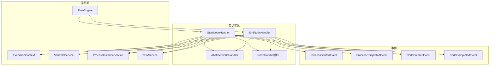
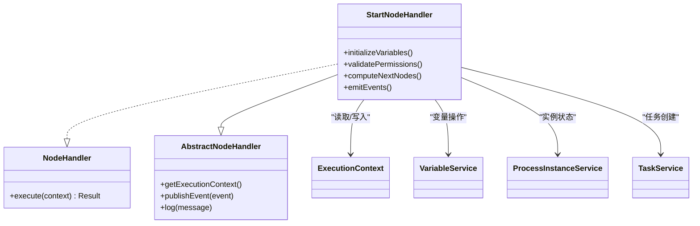
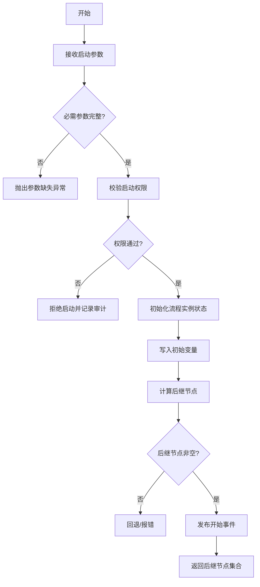
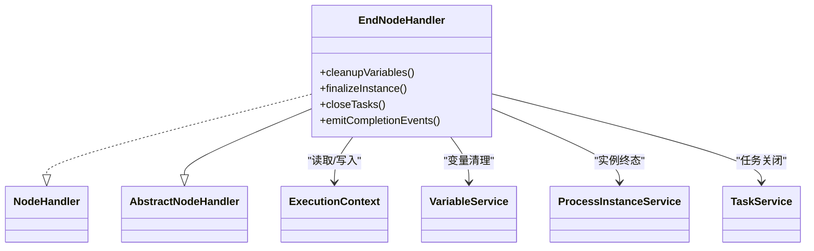
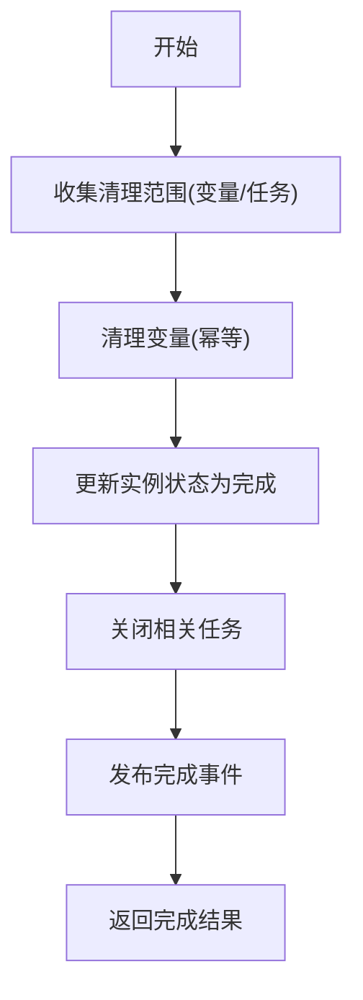
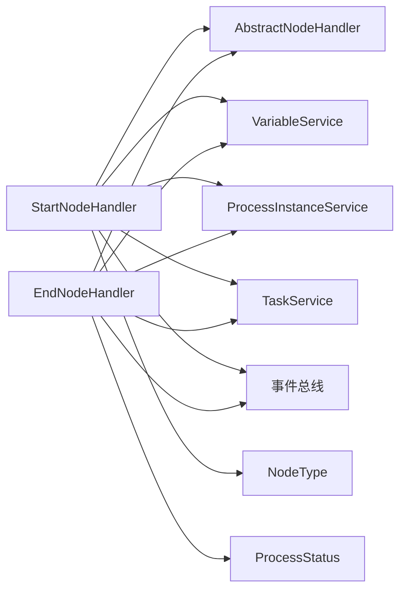

# 开始结束节点

<cite>
**本文引用的文件**   
- [StartNodeHandler.java](file://flow-engine/src/main/java/com/flow/engine/node/impl/StartNodeHandler.java)
- [EndNodeHandler.java](file://flow-engine/src/main/java/com/flow/engine/node/impl/EndNodeHandler.java)
- [AbstractNodeHandler.java](file://flow-engine/src/main/java/com/flow/engine/node/AbstractNodeHandler.java)
- [NodeHandler.java](file://flow-engine/src/main/java/com/flow/engine/node/NodeHandler.java)
- [ExecutionContext.java](file://flow-engine/src/main/java/com/flow/engine/node/ExecutionContext.java)
- [FlowEngine.java](file://flow-engine/src/main/java/com/flow/engine/engine/FlowEngine.java)
- [ProcessInstanceService.java](file://flow-engine/src/main/java/com/flow/engine/service/ProcessInstanceService.java)
- [VariableService.java](file://flow-engine/src/main/java/com/flow/engine/service/VariableService.java)
- [ProcessDefinitionService.java](file://flow-engine/src/main/java/com/flow/engine/service/ProcessDefinitionService.java)
- [TaskService.java](file://flow-engine/src/main/java/com/flow/engine/service/TaskService.java)
- [ProcessStartedEvent.java](file://flow-engine/src/main/java/com/flow/engine/event/ProcessStartedEvent.java)
- [ProcessCompletedEvent.java](file://flow-engine/src/main/java/com/flow/engine/event/ProcessCompletedEvent.java)
- [NodeEnteredEvent.java](file://flow-engine/src/main/java/com/flow/engine/event/NodeEnteredEvent.java)
- [NodeCompletedEvent.java](file://flow-engine/src/main/java/com/flow/engine/event/NodeCompletedEvent.java)
- [NodeType.java](file://flow-engine/src/main/java/com/flow/engine/common/enums/NodeType.java)
- [ProcessStatus.java](file://flow-engine/src/main/java/com/flow/engine/common/enums/ProcessStatus.java)
- [ProcessDefinition.java](file://flow-engine/src/main/java/com/flow/engine/entity/ProcessDefinition.java)
- [ProcessInstance.java](file://flow-engine/src/main/java/com/flow/engine/entity/ProcessInstance.java)
- [Variable.java](file://flow-engine/src/main/java/com/flow/engine/entity/Variable.java)
</cite>

## 目录
1. [简介](#简介)
2. [项目结构](#项目结构)
3. [核心组件](#核心组件)
4. [架构总览](#架构总览)
5. [详细组件分析](#详细组件分析)
6. [依赖关系分析](#依赖关系分析)
7. [性能考虑](#性能考虑)
8. [故障排查指南](#故障排查指南)
9. [结论](#结论)
10. [附录](#附录)

## 简介
本章节聚焦于流程引擎中的“开始节点”和“结束节点”，围绕 StartNodeHandler 与 EndNodeHandler 的功能特性、配置方式、执行时序、数据流转与事件机制进行系统化说明。文档旨在帮助开发者快速理解并正确使用这两个基础节点，覆盖多入口/多出口场景下的最佳实践与常见问题定位方法。

## 项目结构
开始与结束节点属于流程引擎的内置节点实现，位于 node.impl 包下；其职责由统一的 NodeHandler 接口定义，并通过 AbstractNodeHandler 提供通用能力（如上下文访问、变量读写、事件发布等）。引擎在启动时自动注册这些处理器，运行时由 FlowEngine 调度执行。



图表来源
- [StartNodeHandler.java](file://flow-engine/src/main/java/com/flow/engine/node/impl/StartNodeHandler.java)
- [EndNodeHandler.java](file://flow-engine/src/main/java/com/flow/engine/node/impl/EndNodeHandler.java)
- [AbstractNodeHandler.java](file://flow-engine/src/main/java/com/flow/engine/node/AbstractNodeHandler.java)
- [NodeHandler.java](file://flow-engine/src/main/java/com/flow/engine/node/NodeHandler.java)
- [FlowEngine.java](file://flow-engine/src/main/java/com/flow/engine/engine/FlowEngine.java)
- [ExecutionContext.java](file://flow-engine/src/main/java/com/flow/engine/node/ExecutionContext.java)
- [VariableService.java](file://flow-engine/src/main/java/com/flow/engine/service/VariableService.java)
- [ProcessInstanceService.java](file://flow-engine/src/main/java/com/flow/engine/service/ProcessInstanceService.java)
- [TaskService.java](file://flow-engine/src/main/java/com/flow/engine/service/TaskService.java)
- [ProcessStartedEvent.java](file://flow-engine/src/main/java/com/flow/engine/event/ProcessStartedEvent.java)
- [ProcessCompletedEvent.java](file://flow-engine/src/main/java/com/flow/engine/event/ProcessCompletedEvent.java)
- [NodeEnteredEvent.java](file://flow-engine/src/main/java/com/flow/engine/event/NodeEnteredEvent.java)
- [NodeCompletedEvent.java](file://flow-engine/src/main/java/com/flow/engine/event/NodeCompletedEvent.java)

章节来源
- [StartNodeHandler.java](file://flow-engine/src/main/java/com/flow/engine/node/impl/StartNodeHandler.java)
- [EndNodeHandler.java](file://flow-engine/src/main/java/com/flow/engine/node/impl/EndNodeHandler.java)
- [AbstractNodeHandler.java](file://flow-engine/src/main/java/com/flow/engine/node/AbstractNodeHandler.java)
- [NodeHandler.java](file://flow-engine/src/main/java/com/flow/engine/node/NodeHandler.java)
- [FlowEngine.java](file://flow-engine/src/main/java/com/flow/engine/engine/FlowEngine.java)
- [ExecutionContext.java](file://flow-engine/src/main/java/com/flow/engine/node/ExecutionContext.java)
- [VariableService.java](file://flow-engine/src/main/java/com/flow/engine/service/VariableService.java)
- [ProcessInstanceService.java](file://flow-engine/src/main/java/com/flow/engine/service/ProcessInstanceService.java)
- [TaskService.java](file://flow-engine/src/main/java/com/flow/engine/service/TaskService.java)
- [ProcessStartedEvent.java](file://flow-engine/src/main/java/com/flow/engine/event/ProcessStartedEvent.java)
- [ProcessCompletedEvent.java](file://flow-engine/src/main/java/com/flow/engine/event/ProcessCompletedEvent.java)
- [NodeEnteredEvent.java](file://flow-engine/src/main/java/com/flow/engine/event/NodeEnteredEvent.java)
- [NodeCompletedEvent.java](file://flow-engine/src/main/java/com/flow/engine/event/NodeCompletedEvent.java)

## 核心组件
- StartNodeHandler：负责流程实例的初始化与进入第一个业务节点前的准备工作，包括变量注入、权限校验、状态设置、事件触发等。
- EndNodeHandler：负责流程收尾工作，包括清理临时变量、更新流程实例状态、持久化最终结果、触发完成事件等。
- AbstractNodeHandler：为所有节点提供统一的能力，如获取 ExecutionContext、读写变量、发布事件、记录日志等。
- NodeHandler：节点处理器的统一接口，定义了节点执行的契约。
- FlowEngine：引擎主控制器，负责解析流程模型、选择下一个节点、调用对应 NodeHandler 执行。
- ExecutionContext：节点执行上下文，承载当前流程实例、节点信息、变量空间、历史轨迹等。
- VariableService / ProcessInstanceService / TaskService：分别负责变量、流程实例、任务的生命周期管理。
- 事件体系：ProcessStartedEvent、ProcessCompletedEvent、NodeEnteredEvent、NodeCompletedEvent 贯穿流程生命周期。

章节来源
- [StartNodeHandler.java](file://flow-engine/src/main/java/com/flow/engine/node/impl/StartNodeHandler.java)
- [EndNodeHandler.java](file://flow-engine/src/main/java/com/flow/engine/node/impl/EndNodeHandler.java)
- [AbstractNodeHandler.java](file://flow-engine/src/main/java/com/flow/engine/node/AbstractNodeHandler.java)
- [NodeHandler.java](file://flow-engine/src/main/java/com/flow/engine/node/NodeHandler.java)
- [FlowEngine.java](file://flow-engine/src/main/java/com/flow/engine/engine/FlowEngine.java)
- [ExecutionContext.java](file://flow-engine/src/main/java/com/flow/engine/node/ExecutionContext.java)
- [VariableService.java](file://flow-engine/src/main/java/com/flow/engine/service/VariableService.java)
- [ProcessInstanceService.java](file://flow-engine/src/main/java/com/flow/engine/service/ProcessInstanceService.java)
- [TaskService.java](file://flow-engine/src/main/java/com/flow/engine/service/TaskService.java)
- [ProcessStartedEvent.java](file://flow-engine/src/main/java/com/flow/engine/event/ProcessStartedEvent.java)
- [ProcessCompletedEvent.java](file://flow-engine/src/main/java/com/flow/engine/event/ProcessCompletedEvent.java)
- [NodeEnteredEvent.java](file://flow-engine/src/main/java/com/flow/engine/event/NodeEnteredEvent.java)
- [NodeCompletedEvent.java](file://flow-engine/src/main/java/com/flow/engine/event/NodeCompletedEvent.java)

## 架构总览
下图展示了从“发起流程”到“结束流程”的关键路径，以及开始/结束节点在其中的作用。

```mermaid
sequenceDiagram
participant Client as "调用方"
participant Engine as "FlowEngine"
participant Start as "StartNodeHandler"
participant Next as "下一节点处理器"
participant End as "EndNodeHandler"
participant V as "VariableService"
participant PI as "ProcessInstanceService"
participant T as "TaskService"
participant EVT as "事件总线"
Client->>Engine : "启动流程(传入变量/参数)"
Engine->>Start : "执行开始节点"
Start->>V : "写入初始变量"
Start->>PI : "初始化流程实例状态"
Start->>EVT : "发布 ProcessStartedEvent"
Start-->>Engine : "返回可继续执行的节点集合"
Engine->>Next : "调度下一节点(用户任务/服务任务等)"
Next-->>Engine : "完成并返回结果"
Engine->>End : "执行结束节点"
End->>V : "清理/归档变量"
End->>PI : "更新流程实例为完成状态"
End->>T : "关闭相关任务"
End->>EVT : "发布 ProcessCompletedEvent"
Engine-->>Client : "返回流程完成结果"
```

图表来源
- [FlowEngine.java](file://flow-engine/src/main/java/com/flow/engine/engine/FlowEngine.java)
- [StartNodeHandler.java](file://flow-engine/src/main/java/com/flow/engine/node/impl/StartNodeHandler.java)
- [EndNodeHandler.java](file://flow-engine/src/main/java/com/flow/engine/node/impl/EndNodeHandler.java)
- [VariableService.java](file://flow-engine/src/main/java/com/flow/engine/service/VariableService.java)
- [ProcessInstanceService.java](file://flow-engine/src/main/java/com/flow/engine/service/ProcessInstanceService.java)
- [TaskService.java](file://flow-engine/src/main/java/com/flow/engine/service/TaskService.java)
- [ProcessStartedEvent.java](file://flow-engine/src/main/java/com/flow/engine/event/ProcessStartedEvent.java)
- [ProcessCompletedEvent.java](file://flow-engine/src/main/java/com/flow/engine/event/ProcessCompletedEvent.java)

## 详细组件分析

### 开始节点（StartNodeHandler）
- 功能要点
  - 初始化流程实例：创建或加载流程实例，设置初始状态为“运行中”。
  - 变量注入：根据请求参数或默认值，将初始变量写入变量服务，供后续节点使用。
  - 权限验证：校验发起人是否具备启动该流程定义的权限，必要时结合角色/部门/数据权限策略。
  - 事件触发：发布 ProcessStartedEvent 与 NodeEnteredEvent/NodeCompletedEvent，便于审计与扩展。
  - 后继节点计算：依据流程定义与表达式，确定首个（或多个）后继节点，交由引擎调度。
- 关键交互
  - 通过 ExecutionContext 获取当前流程实例与节点信息。
  - 通过 VariableService 读写变量。
  - 通过 ProcessInstanceService 更新流程实例状态。
  - 通过 TaskService 在需要时创建首个待办任务（例如直接指向用户任务）。
- 典型错误与边界
  - 缺少必要启动参数：应抛出明确异常并回滚已变更状态。
  - 无权限启动：拒绝执行并记录审计日志。
  - 后继节点为空：需回退到默认分支或报错提示。



图表来源
- [StartNodeHandler.java](file://flow-engine/src/main/java/com/flow/engine/node/impl/StartNodeHandler.java)
- [AbstractNodeHandler.java](file://flow-engine/src/main/java/com/flow/engine/node/AbstractNodeHandler.java)
- [NodeHandler.java](file://flow-engine/src/main/java/com/flow/engine/node/NodeHandler.java)
- [ExecutionContext.java](file://flow-engine/src/main/java/com/flow/engine/node/ExecutionContext.java)
- [VariableService.java](file://flow-engine/src/main/java/com/flow/engine/service/VariableService.java)
- [ProcessInstanceService.java](file://flow-engine/src/main/java/com/flow/engine/service/ProcessInstanceService.java)
- [TaskService.java](file://flow-engine/src/main/java/com/flow/engine/service/TaskService.java)

章节来源
- [StartNodeHandler.java](file://flow-engine/src/main/java/com/flow/engine/node/impl/StartNodeHandler.java)
- [AbstractNodeHandler.java](file://flow-engine/src/main/java/com/flow/engine/node/AbstractNodeHandler.java)
- [NodeHandler.java](file://flow-engine/src/main/java/com/flow/engine/node/NodeHandler.java)
- [ExecutionContext.java](file://flow-engine/src/main/java/com/flow/engine/node/ExecutionContext.java)
- [VariableService.java](file://flow-engine/src/main/java/com/flow/engine/service/VariableService.java)
- [ProcessInstanceService.java](file://flow-engine/src/main/java/com/flow/engine/service/ProcessInstanceService.java)
- [TaskService.java](file://flow-engine/src/main/java/com/flow/engine/service/TaskService.java)
- [ProcessStartedEvent.java](file://flow-engine/src/main/java/com/flow/engine/event/ProcessStartedEvent.java)
- [NodeEnteredEvent.java](file://flow-engine/src/main/java/com/flow/engine/event/NodeEnteredEvent.java)
- [NodeCompletedEvent.java](file://flow-engine/src/main/java/com/flow/engine/event/NodeCompletedEvent.java)

#### 开始节点初始化流程图


图表来源
- [StartNodeHandler.java](file://flow-engine/src/main/java/com/flow/engine/node/impl/StartNodeHandler.java)
- [VariableService.java](file://flow-engine/src/main/java/com/flow/engine/service/VariableService.java)
- [ProcessInstanceService.java](file://flow-engine/src/main/java/com/flow/engine/service/ProcessInstanceService.java)
- [ProcessStartedEvent.java](file://flow-engine/src/main/java/com/flow/engine/event/ProcessStartedEvent.java)

### 结束节点（EndNodeHandler）
- 功能要点
  - 清理工作：归档或清理不再需要的变量，释放资源。
  - 状态更新：将流程实例状态设置为“已完成”，并持久化最终结果。
  - 任务收尾：关闭或归档与该流程相关的任务。
  - 事件触发：发布 ProcessCompletedEvent 与相应节点事件，通知监听器与外部系统。
- 关键交互
  - 通过 ExecutionContext 获取当前流程实例与节点信息。
  - 通过 VariableService 进行变量清理/归档。
  - 通过 ProcessInstanceService 更新流程实例状态。
  - 通过 TaskService 关闭相关任务。
- 典型错误与边界
  - 清理失败：应保证幂等性，避免重复清理导致不一致。
  - 状态冲突：若实例已处于终态，应跳过或记录告警。



图表来源
- [EndNodeHandler.java](file://flow-engine/src/main/java/com/flow/engine/node/impl/EndNodeHandler.java)
- [AbstractNodeHandler.java](file://flow-engine/src/main/java/com/flow/engine/node/AbstractNodeHandler.java)
- [NodeHandler.java](file://flow-engine/src/main/java/com/flow/engine/node/NodeHandler.java)
- [ExecutionContext.java](file://flow-engine/src/main/java/com/flow/engine/node/ExecutionContext.java)
- [VariableService.java](file://flow-engine/src/main/java/com/flow/engine/service/VariableService.java)
- [ProcessInstanceService.java](file://flow-engine/src/main/java/com/flow/engine/service/ProcessInstanceService.java)
- [TaskService.java](file://flow-engine/src/main/java/com/flow/engine/service/TaskService.java)

章节来源
- [EndNodeHandler.java](file://flow-engine/src/main/java/com/flow/engine/node/impl/EndNodeHandler.java)
- [AbstractNodeHandler.java](file://flow-engine/src/main/java/com/flow/engine/node/AbstractNodeHandler.java)
- [NodeHandler.java](file://flow-engine/src/main/java/com/flow/engine/node/NodeHandler.java)
- [ExecutionContext.java](file://flow-engine/src/main/java/com/flow/engine/node/ExecutionContext.java)
- [VariableService.java](file://flow-engine/src/main/java/com/flow/engine/service/VariableService.java)
- [ProcessInstanceService.java](file://flow-engine/src/main/java/com/flow/engine/service/ProcessInstanceService.java)
- [TaskService.java](file://flow-engine/src/main/java/com/flow/engine/service/TaskService.java)
- [ProcessCompletedEvent.java](file://flow-engine/src/main/java/com/flow/engine/event/ProcessCompletedEvent.java)
- [NodeEnteredEvent.java](file://flow-engine/src/main/java/com/flow/engine/event/NodeEnteredEvent.java)
- [NodeCompletedEvent.java](file://flow-engine/src/main/java/com/flow/engine/event/NodeCompletedEvent.java)

#### 结束节点清理流程图


图表来源
- [EndNodeHandler.java](file://flow-engine/src/main/java/com/flow/engine/node/impl/EndNodeHandler.java)
- [VariableService.java](file://flow-engine/src/main/java/com/flow/engine/service/VariableService.java)
- [ProcessInstanceService.java](file://flow-engine/src/main/java/com/flow/engine/service/ProcessInstanceService.java)
- [TaskService.java](file://flow-engine/src/main/java/com/flow/engine/service/TaskService.java)
- [ProcessCompletedEvent.java](file://flow-engine/src/main/java/com/flow/engine/event/ProcessCompletedEvent.java)

## 依赖关系分析
- 耦合与内聚
  - StartNodeHandler 与 EndNodeHandler 均依赖 AbstractNodeHandler 提供的通用能力，保持高内聚、低耦合。
  - 对 VariableService、ProcessInstanceService、TaskService 的依赖清晰且单一职责明确。
- 外部依赖
  - 事件总线用于解耦流程生命周期通知。
  - 枚举 NodeType 与 ProcessStatus 用于类型与状态标识。
- 循环依赖检查
  - 节点处理器与服务层之间为单向依赖，未发现循环引用。



图表来源
- [StartNodeHandler.java](file://flow-engine/src/main/java/com/flow/engine/node/impl/StartNodeHandler.java)
- [EndNodeHandler.java](file://flow-engine/src/main/java/com/flow/engine/node/impl/EndNodeHandler.java)
- [AbstractNodeHandler.java](file://flow-engine/src/main/java/com/flow/engine/node/AbstractNodeHandler.java)
- [VariableService.java](file://flow-engine/src/main/java/com/flow/engine/service/VariableService.java)
- [ProcessInstanceService.java](file://flow-engine/src/main/java/com/flow/engine/service/ProcessInstanceService.java)
- [TaskService.java](file://flow-engine/src/main/java/com/flow/engine/service/TaskService.java)
- [NodeType.java](file://flow-engine/src/main/java/com/flow/engine/common/enums/NodeType.java)
- [ProcessStatus.java](file://flow-engine/src/main/java/com/flow/engine/common/enums/ProcessStatus.java)

章节来源
- [StartNodeHandler.java](file://flow-engine/src/main/java/com/flow/engine/node/impl/StartNodeHandler.java)
- [EndNodeHandler.java](file://flow-engine/src/main/java/com/flow/engine/node/impl/EndNodeHandler.java)
- [AbstractNodeHandler.java](file://flow-engine/src/main/java/com/flow/engine/node/AbstractNodeHandler.java)
- [VariableService.java](file://flow-engine/src/main/java/com/flow/engine/service/VariableService.java)
- [ProcessInstanceService.java](file://flow-engine/src/main/java/com/flow/engine/service/ProcessInstanceService.java)
- [TaskService.java](file://flow-engine/src/main/java/com/flow/engine/service/TaskService.java)
- [NodeType.java](file://flow-engine/src/main/java/com/flow/engine/common/enums/NodeType.java)
- [ProcessStatus.java](file://flow-engine/src/main/java/com/flow/engine/common/enums/ProcessStatus.java)

## 性能考虑
- 变量读写批量操作：在开始/结束节点尽量合并变量写入/清理，减少多次 IO。
- 事件异步化：事件发布建议采用异步模式，避免阻塞主流程。
- 幂等设计：清理与状态更新需幂等，防止重试造成重复副作用。
- 事务边界：确保变量、实例状态、任务操作的原子性，失败时整体回滚。

[本节为通用指导，不直接分析具体文件]

## 故障排查指南
- 启动失败
  - 检查必需参数是否齐全，确认权限校验逻辑是否放行。
  - 查看 ProcessStartedEvent 是否成功发布，确认监听器未抛异常。
- 无法进入后继节点
  - 核对后继节点计算逻辑与表达式，确认条件分支正确。
  - 检查是否存在多个后继节点导致的并发问题。
- 结束阶段异常
  - 确认清理逻辑幂等，避免重复清理导致数据不一致。
  - 检查 ProcessCompletedEvent 监听器是否抛出异常。
- 常见日志关键字
  - “开始节点执行”、“结束节点执行”、“变量写入/清理”、“实例状态更新”、“事件发布”。

章节来源
- [StartNodeHandler.java](file://flow-engine/src/main/java/com/flow/engine/node/impl/StartNodeHandler.java)
- [EndNodeHandler.java](file://flow-engine/src/main/java/com/flow/engine/node/impl/EndNodeHandler.java)
- [ProcessStartedEvent.java](file://flow-engine/src/main/java/com/flow/engine/event/ProcessStartedEvent.java)
- [ProcessCompletedEvent.java](file://flow-engine/src/main/java/com/flow/engine/event/ProcessCompletedEvent.java)

## 结论
StartNodeHandler 与 EndNodeHandler 作为流程生命周期的两端，承担初始化与收尾的核心职责。通过清晰的职责划分、完善的变量与状态管理、以及事件驱动的扩展点，它们为复杂业务流程提供了稳定可靠的支撑。遵循本文的配置示例与最佳实践，可有效提升流程的可维护性与可扩展性。

[本节为总结，不直接分析具体文件]

## 附录

### 配置与使用示例（概念性）
- 开始节点配置要点
  - 指定流程定义 ID 与版本。
  - 声明必需启动参数及默认值。
  - 配置权限策略（角色/部门/数据权限）。
  - 定义初始变量映射规则。
- 结束节点配置要点
  - 指定需要清理的变量范围。
  - 定义完成后动作（如归档、通知）。
  - 配置状态转换与审计字段。
- 多入口/多出口处理
  - 多入口：不同入口可携带不同初始变量与权限上下文，开始节点据此分流。
  - 多出口：结束节点前汇聚各分支结果，统一清理与状态更新。
- 数据流转规则
  - 变量命名规范与作用域：全局变量 vs 节点局部变量。
  - 变量生命周期：开始节点写入，中间节点读写，结束节点归档/清理。
  - 表达式与函数：在条件判断与变量计算中使用统一表达式引擎。

[本节为概念性内容，不直接分析具体文件]