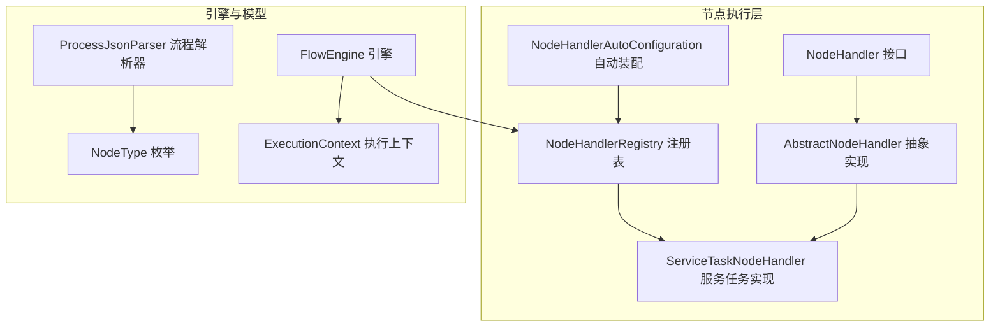
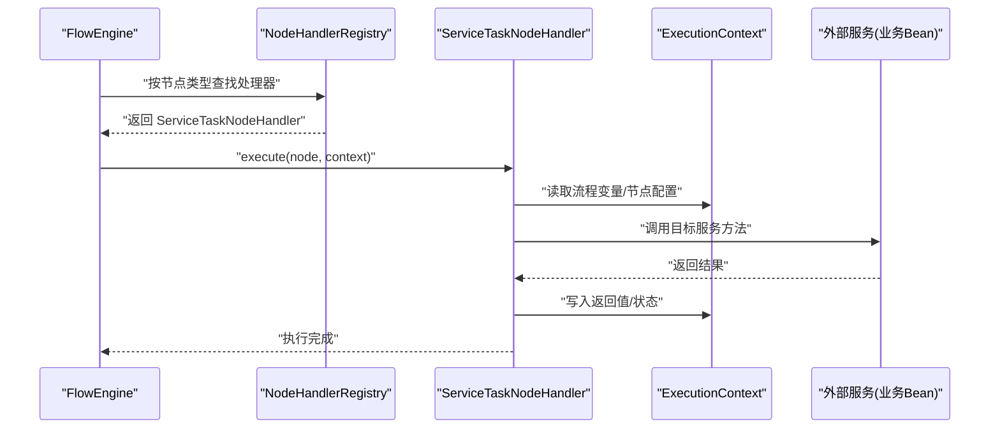
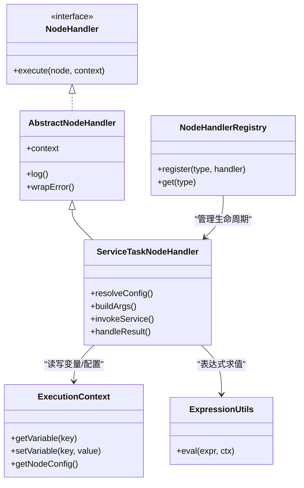
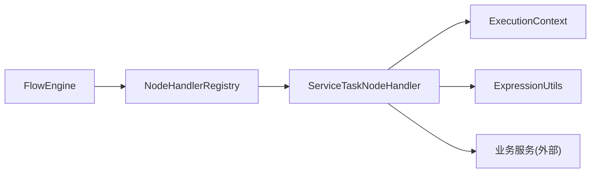

# 服务任务节点

<cite>
**本文引用的文件**   
- [ServiceTaskNodeHandler.java](file://flow-engine/src/main/java/com/flow/engine/node/impl/ServiceTaskNodeHandler.java)
- [AbstractNodeHandler.java](file://flow-engine/src/main/java/com/flow/engine/node/AbstractNodeHandler.java)
- [NodeHandler.java](file://flow-engine/src/main/java/com/flow/engine/node/NodeHandler.java)
- [NodeHandlerRegistry.java](file://flow-engine/src/main/java/com/flow/engine/node/NodeHandlerRegistry.java)
- [NodeHandlerAutoConfiguration.java](file://flow-engine/src/main/java/com/flow/engine/node/NodeHandlerAutoConfiguration.java)
- [ExecutionContext.java](file://flow-engine/src/main/java/com/flow/engine/node/ExecutionContext.java)
- [FlowEngine.java](file://flow-engine/src/main/java/com/flow/engine/engine/FlowEngine.java)
- [NodeType.java](file://flow-engine/src/main/java/com/flow/engine/common/enums/NodeType.java)
- [ProcessJsonParser.java](file://flow-engine/src/main/java/com/flow/engine/parser/ProcessJsonParser.java)
- [ExpressionUtils.java](file://flow-engine/src/main/java/com/flow/engine/common/utils/ExpressionUtils.java)
- [GlobalExceptionHandler.java](file://flow-engine/src/main/java/com/flow/engine/common/GlobalExceptionHandler.java)
- [BusinessException.java](file://flow-engine/src/main/java/com/flow/engine/common/BusinessException.java)
- [ErrorCode.java](file://flow-engine/src/main/java/com/flow/engine/common/ErrorCode.java)
</cite>

## 目录
1. [简介](#简介)
2. [项目结构](#项目结构)
3. [核心组件](#核心组件)
4. [架构总览](#架构总览)
5. [详细组件分析](#详细组件分析)
6. [依赖分析](#依赖分析)
7. [性能考虑](#性能考虑)
8. [故障排查指南](#故障排查指南)
9. [结论](#结论)
10. [附录](#附录)

## 简介
本章节面向“服务任务节点”的使用与扩展，聚焦 ServiceTaskNodeHandler 的实现机制与使用方式。内容涵盖：
- 服务调用方式、参数传递与返回值处理
- 节点配置项（服务类型、方法名、参数映射等）
- 常见场景示例（HTTP 接口、数据库操作、消息队列发送）
- 异常处理与重试策略的配置建议

## 项目结构
服务任务节点位于流程引擎的节点执行层，遵循统一的 NodeHandler 抽象与注册机制，由引擎在运行时解析并调度。

图表来源
- [NodeHandler.java](file://flow-engine/src/main/java/com/flow/engine/node/NodeHandler.java)
- [AbstractNodeHandler.java](file://flow-engine/src/main/java/com/flow/engine/node/AbstractNodeHandler.java)
- [ServiceTaskNodeHandler.java](file://flow-engine/src/main/java/com/flow/engine/node/impl/ServiceTaskNodeHandler.java)
- [NodeHandlerRegistry.java](file://flow-engine/src/main/java/com/flow/engine/node/NodeHandlerRegistry.java)
- [NodeHandlerAutoConfiguration.java](file://flow-engine/src/main/java/com/flow/engine/node/NodeHandlerAutoConfiguration.java)
- [FlowEngine.java](file://flow-engine/src/main/java/com/flow/engine/engine/FlowEngine.java)
- [NodeType.java](file://flow-engine/src/main/java/com/flow/engine/common/enums/NodeType.java)
- [ProcessJsonParser.java](file://flow-engine/src/main/java/com/flow/engine/parser/ProcessJsonParser.java)
- [ExecutionContext.java](file://flow-engine/src/main/java/com/flow/engine/node/ExecutionContext.java)

章节来源
- [ServiceTaskNodeHandler.java](file://flow-engine/src/main/java/com/flow/engine/node/impl/ServiceTaskNodeHandler.java)
- [AbstractNodeHandler.java](file://flow-engine/src/main/java/com/flow/engine/node/AbstractNodeHandler.java)
- [NodeHandler.java](file://flow-engine/src/main/java/com/flow/engine/node/NodeHandler.java)
- [NodeHandlerRegistry.java](file://flow-engine/src/main/java/com/flow/engine/node/NodeHandlerRegistry.java)
- [NodeHandlerAutoConfiguration.java](file://flow-engine/src/main/java/com/flow/engine/node/NodeHandlerAutoConfiguration.java)
- [FlowEngine.java](file://flow-engine/src/main/java/com/flow/engine/engine/FlowEngine.java)
- [NodeType.java](file://flow-engine/src/main/java/com/flow/engine/common/enums/NodeType.java)
- [ProcessJsonParser.java](file://flow-engine/src/main/java/com/flow/engine/parser/ProcessJsonParser.java)
- [ExecutionContext.java](file://flow-engine/src/main/java/com/flow/engine/node/ExecutionContext.java)

## 核心组件
- NodeHandler 接口：定义节点统一执行契约，供引擎按节点类型分发。
- AbstractNodeHandler：提供通用能力（如上下文访问、日志、错误封装等），减少重复代码。
- ServiceTaskNodeHandler：服务任务的具体实现，负责根据节点配置进行服务调用、参数绑定与结果回写。
- NodeHandlerRegistry：维护节点类型到实现的映射，支持自动发现与注册。
- NodeHandlerAutoConfiguration：基于 Spring 自动装配将自定义节点处理器注册到注册表。
- FlowEngine：流程编排与调度入口，依据节点类型选择对应处理器执行。
- ExecutionContext：承载流程变量、当前节点信息、执行状态等运行期数据。
- NodeType：节点类型枚举，用于区分不同节点语义（含服务任务）。
- ProcessJsonParser：解析流程定义 JSON，提取节点配置（包括服务任务的配置项）。
- ExpressionUtils：表达式工具，用于解析和计算节点配置中的动态表达式。

章节来源
- [NodeHandler.java](file://flow-engine/src/main/java/com/flow/engine/node/NodeHandler.java)
- [AbstractNodeHandler.java](file://flow-engine/src/main/java/com/flow/engine/node/AbstractNodeHandler.java)
- [ServiceTaskNodeHandler.java](file://flow-engine/src/main/java/com/flow/engine/node/impl/ServiceTaskNodeHandler.java)
- [NodeHandlerRegistry.java](file://flow-engine/src/main/java/com/flow/engine/node/NodeHandlerRegistry.java)
- [NodeHandlerAutoConfiguration.java](file://flow-engine/src/main/java/com/flow/engine/node/NodeHandlerAutoConfiguration.java)
- [FlowEngine.java](file://flow-engine/src/main/java/com/flow/engine/engine/FlowEngine.java)
- [ExecutionContext.java](file://flow-engine/src/main/java/com/flow/engine/node/ExecutionContext.java)
- [NodeType.java](file://flow-engine/src/main/java/com/flow/engine/common/enums/NodeType.java)
- [ProcessJsonParser.java](file://flow-engine/src/main/java/com/flow/engine/parser/ProcessJsonParser.java)
- [ExpressionUtils.java](file://flow-engine/src/main/java/com/flow/engine/common/utils/ExpressionUtils.java)

## 架构总览
服务任务节点的执行路径从引擎进入，经注册表定位到具体处理器，再结合上下文与配置完成服务调用与结果落盘。

图表来源
- [FlowEngine.java](file://flow-engine/src/main/java/com/flow/engine/engine/FlowEngine.java)
- [NodeHandlerRegistry.java](file://flow-engine/src/main/java/com/flow/engine/node/NodeHandlerRegistry.java)
- [ServiceTaskNodeHandler.java](file://flow-engine/src/main/java/com/flow/engine/node/impl/ServiceTaskNodeHandler.java)
- [ExecutionContext.java](file://flow-engine/src/main/java/com/flow/engine/node/ExecutionContext.java)

## 详细组件分析

### ServiceTaskNodeHandler 实现机制
- 职责边界
  - 解析节点配置（服务类型、方法名、参数映射、超时、重试等）
  - 基于上下文变量与表达式计算最终入参
  - 调用目标服务方法并捕获异常
  - 将返回值或错误信息写回上下文，驱动后续流转
- 关键交互
  - 通过 NodeHandlerRegistry 获取自身实例
  - 借助 ExecutionContext 读写流程变量
  - 使用 ExpressionUtils 对配置中的表达式求值
- 设计要点
  - 与业务解耦：仅负责“调用与桥接”，不内嵌具体业务逻辑
  - 可插拔：新增服务类型只需扩展配置与适配逻辑
  - 可观测：统一异常与日志输出，便于追踪

章节来源
- [ServiceTaskNodeHandler.java](file://flow-engine/src/main/java/com/flow/engine/node/impl/ServiceTaskNodeHandler.java)
- [NodeHandlerRegistry.java](file://flow-engine/src/main/java/com/flow/engine/node/NodeHandlerRegistry.java)
- [ExecutionContext.java](file://flow-engine/src/main/java/com/flow/engine/node/ExecutionContext.java)
- [ExpressionUtils.java](file://flow-engine/src/main/java/com/flow/engine/common/utils/ExpressionUtils.java)

#### 类关系图

图表来源
- [NodeHandler.java](file://flow-engine/src/main/java/com/flow/engine/node/NodeHandler.java)
- [AbstractNodeHandler.java](file://flow-engine/src/main/java/com/flow/engine/node/AbstractNodeHandler.java)
- [ServiceTaskNodeHandler.java](file://flow-engine/src/main/java/com/flow/engine/node/impl/ServiceTaskNodeHandler.java)
- [NodeHandlerRegistry.java](file://flow-engine/src/main/java/com/flow/engine/node/NodeHandlerRegistry.java)
- [ExecutionContext.java](file://flow-engine/src/main/java/com/flow/engine/node/ExecutionContext.java)
- [ExpressionUtils.java](file://flow-engine/src/main/java/com/flow/engine/common/utils/ExpressionUtils.java)

### 节点配置选项说明
- 服务类型：标识要调用的服务类别（例如 HTTP、DB、MQ 等），用于路由到不同的适配器或策略
- 方法名：目标服务的接口方法名称
- 参数映射：将流程变量或静态值映射到方法形参，支持表达式
- 返回值处理：指定返回值写入的上下文变量键名
- 超时与重试：请求超时时间、最大重试次数、退避策略等
- 错误分支：当调用失败时，是否允许进入特定分支以继续流程

章节来源
- [ServiceTaskNodeHandler.java](file://flow-engine/src/main/java/com/flow/engine/node/impl/ServiceTaskNodeHandler.java)
- [ProcessJsonParser.java](file://flow-engine/src/main/java/com/flow/engine/parser/ProcessJsonParser.java)
- [ExpressionUtils.java](file://flow-engine/src/main/java/com/flow/engine/common/utils/ExpressionUtils.java)

### 常见调用场景示例
- HTTP 接口调用
  - 配置要点：服务类型为 HTTP，填写 URL、方法、头、体模板；参数映射使用表达式引用流程变量
  - 返回值处理：将响应体或状态码写入上下文变量，供后续条件网关判断
- 数据库操作
  - 配置要点：服务类型为 DB，指定 SQL 或 ORM 方法名；参数映射为查询条件或写入字段
  - 返回值处理：将影响行数或实体对象写入上下文
- 消息队列发送
  - 配置要点：服务类型为 MQ，指定 Topic/Queue、消息体模板；参数映射为消息字段
  - 返回值处理：通常记录发送结果或消息 ID，用于补偿与追踪

章节来源
- [ServiceTaskNodeHandler.java](file://flow-engine/src/main/java/com/flow/engine/node/impl/ServiceTaskNodeHandler.java)
- [ProcessJsonParser.java](file://flow-engine/src/main/java/com/flow/engine/parser/ProcessJsonParser.java)

### 参数传递与返回值处理
- 参数传递
  - 静态值：直接配置常量
  - 动态值：使用表达式引用上下文变量或函数
  - 复合对象：支持嵌套结构与集合映射
- 返回值处理
  - 成功：将返回值按配置写入上下文变量
  - 失败：抛出业务异常或包装异常，交由全局异常处理器统一处理

章节来源
- [ServiceTaskNodeHandler.java](file://flow-engine/src/main/java/com/flow/engine/node/impl/ServiceTaskNodeHandler.java)
- [ExecutionContext.java](file://flow-engine/src/main/java/com/flow/engine/node/ExecutionContext.java)
- [ExpressionUtils.java](file://flow-engine/src/main/java/com/flow/engine/common/utils/ExpressionUtils.java)

### 异常处理机制
- 统一异常
  - 业务异常：携带错误码与消息，便于前端展示与审计
  - 全局异常处理器：拦截未捕获异常，转换为标准响应
- 节点级处理
  - 捕获服务调用异常，记录日志并可选择进入错误分支
  - 将错误信息写入上下文，供后续节点消费

章节来源
- [GlobalExceptionHandler.java](file://flow-engine/src/main/java/com/flow/engine/common/GlobalExceptionHandler.java)
- [BusinessException.java](file://flow-engine/src/main/java/com/flow/engine/common/BusinessException.java)
- [ErrorCode.java](file://flow-engine/src/main/java/com/flow/engine/common/ErrorCode.java)
- [ServiceTaskNodeHandler.java](file://flow-engine/src/main/java/com/flow/engine/node/impl/ServiceTaskNodeHandler.java)

### 重试策略与配置
- 触发条件：网络抖动、临时性资源不可用等
- 策略要素：最大重试次数、退避算法（固定/指数）、重试间隔上限
- 幂等要求：确保重试不会导致副作用重复发生
- 监控与告警：记录重试次数与耗时，便于问题定位

章节来源
- [ServiceTaskNodeHandler.java](file://flow-engine/src/main/java/com/flow/engine/node/impl/ServiceTaskNodeHandler.java)

## 依赖分析
- 内部依赖
  - ServiceTaskNodeHandler 依赖 ExecutionContext 与 ExpressionUtils 完成参数解析与结果落盘
  - 通过 NodeHandlerRegistry 与自动装配完成注册与发现
  - 引擎 FlowEngine 按 NodeType 分派到具体处理器
- 外部依赖
  - 业务 Bean（HTTP 客户端、DAO、MQ 生产者等）由上层注入，保持松耦合

图表来源
- [FlowEngine.java](file://flow-engine/src/main/java/com/flow/engine/engine/FlowEngine.java)
- [NodeHandlerRegistry.java](file://flow-engine/src/main/java/com/flow/engine/node/NodeHandlerRegistry.java)
- [ServiceTaskNodeHandler.java](file://flow-engine/src/main/java/com/flow/engine/node/impl/ServiceTaskNodeHandler.java)
- [ExecutionContext.java](file://flow-engine/src/main/java/com/flow/engine/node/ExecutionContext.java)
- [ExpressionUtils.java](file://flow-engine/src/main/java/com/flow/engine/common/utils/ExpressionUtils.java)

章节来源
- [FlowEngine.java](file://flow-engine/src/main/java/com/flow/engine/engine/FlowEngine.java)
- [NodeHandlerRegistry.java](file://flow-engine/src/main/java/com/flow/engine/node/NodeHandlerRegistry.java)
- [ServiceTaskNodeHandler.java](file://flow-engine/src/main/java/com/flow/engine/node/impl/ServiceTaskNodeHandler.java)
- [ExecutionContext.java](file://flow-engine/src/main/java/com/flow/engine/node/ExecutionContext.java)
- [ExpressionUtils.java](file://flow-engine/src/main/java/com/flow/engine/common/utils/ExpressionUtils.java)

## 性能考虑
- 避免阻塞：长耗时服务调用建议使用异步或限流降级
- 连接池与复用：HTTP/DB/MQ 客户端应合理配置连接池与超时
- 表达式开销：复杂表达式应在入口处缓存结果，避免重复计算
- 批量与分页：大批量数据处理需分批提交，降低内存峰值

[本节为通用指导，不涉及具体文件]

## 故障排查指南
- 常见问题
  - 参数映射为空或类型不匹配：检查表达式与上下文变量是否存在
  - 服务调用超时：调整超时配置与后端容量
  - 重试风暴：确认幂等性与退避策略
- 定位手段
  - 查看全局异常处理器的统一错误响应
  - 检查业务异常的错误码与消息
  - 结合上下文变量快照与服务调用日志

章节来源
- [GlobalExceptionHandler.java](file://flow-engine/src/main/java/com/flow/engine/common/GlobalExceptionHandler.java)
- [BusinessException.java](file://flow-engine/src/main/java/com/flow/engine/common/BusinessException.java)
- [ErrorCode.java](file://flow-engine/src/main/java/com/flow/engine/common/ErrorCode.java)
- [ServiceTaskNodeHandler.java](file://flow-engine/src/main/java/com/flow/engine/node/impl/ServiceTaskNodeHandler.java)

## 结论
ServiceTaskNodeHandler 作为流程引擎中“服务任务”的核心实现，提供了统一的服务调用入口与灵活的配置能力。通过清晰的职责划分、可扩展的参数映射与完善的异常处理，能够覆盖 HTTP、DB、MQ 等常见集成场景，并在生产环境中具备良好的可观测性与稳定性。

[本节为总结，不涉及具体文件]

## 附录
- 最佳实践
  - 为每个服务任务节点明确输入输出契约，并在文档中固化
  - 对易失败的外部调用启用重试与熔断，保证流程韧性
  - 使用表达式时注意空值与默认值处理，避免运行时异常
  - 为关键节点增加埋点与指标上报，便于监控与告警

[本节为补充建议，不涉及具体文件]