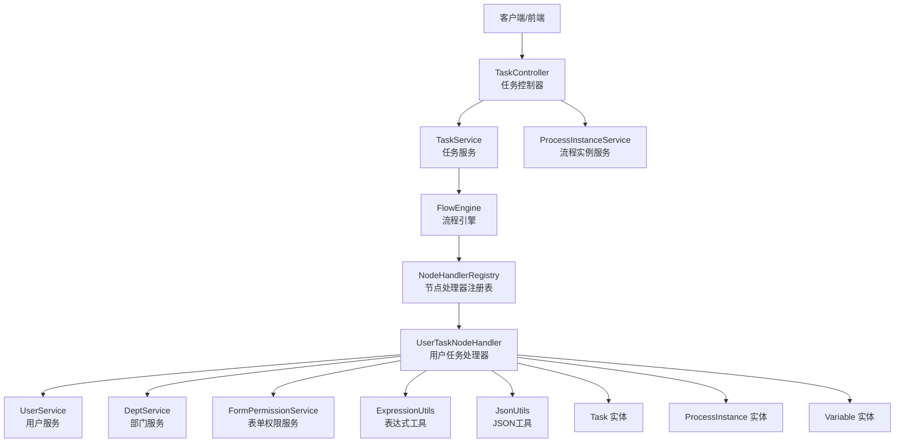
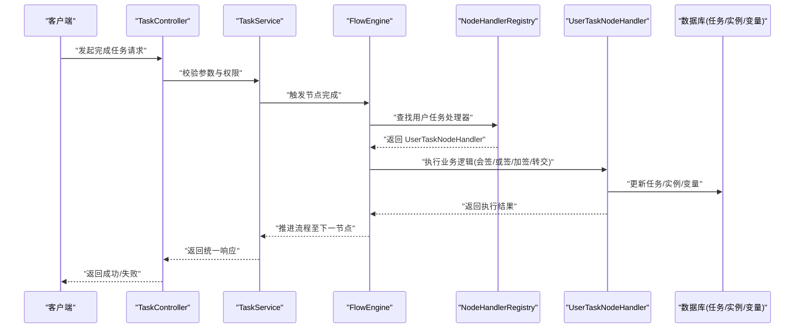
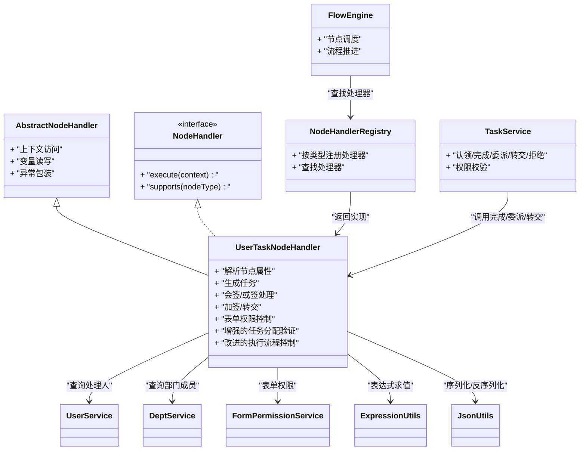
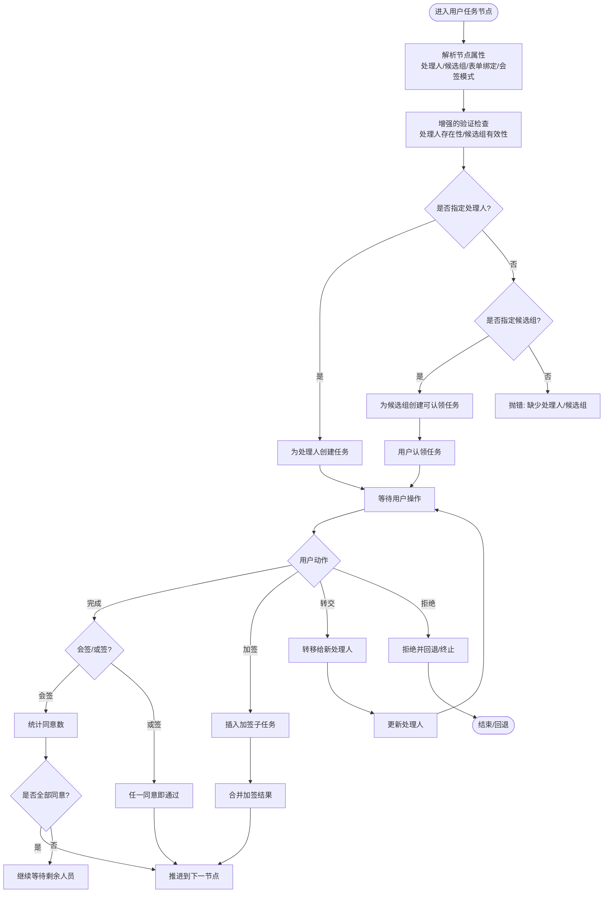
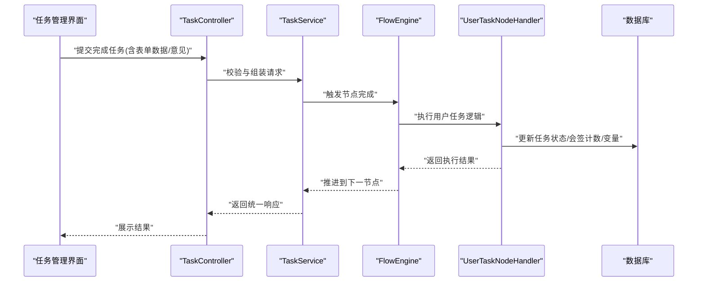
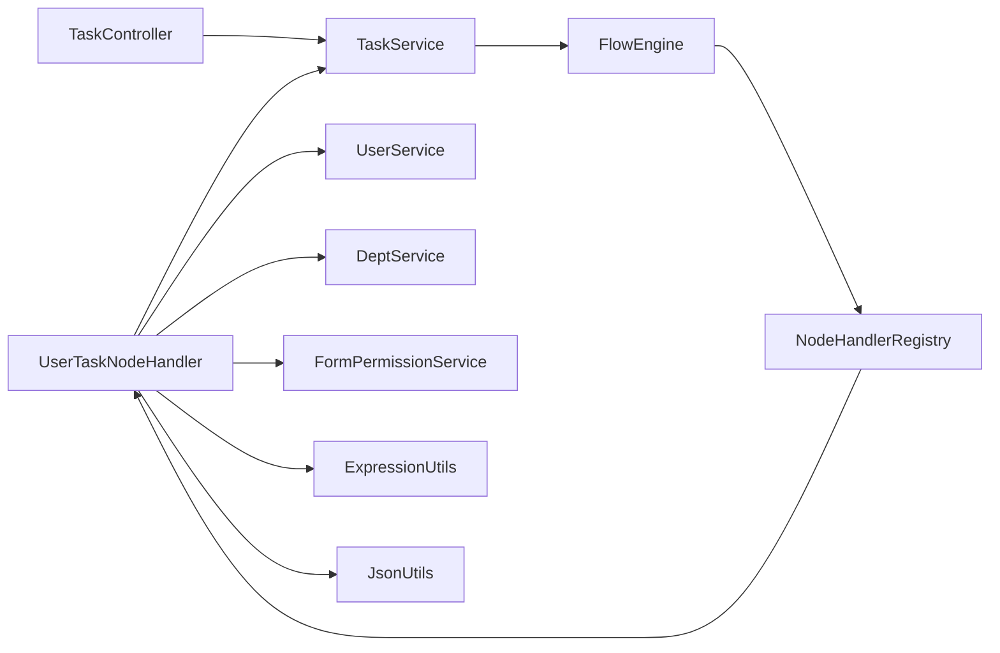

# 用户任务节点

<cite>
**本文引用的文件**   
- [UserTaskNodeHandler.java](file://flow-engine/src/main/java/com/flow/engine/node/impl/UserTaskNodeHandler.java)
- [AbstractNodeHandler.java](file://flow-engine/src/main/java/com/flow/engine/node/AbstractNodeHandler.java)
- [NodeHandler.java](file://flow-engine/src/main/java/com/flow/engine/node/NodeHandler.java)
- [NodeHandlerRegistry.java](file://flow-engine/src/main/java/com/flow/engine/node/NodeHandlerRegistry.java)
- [NodeHandlerAutoConfiguration.java](file://flow-engine/src/main/java/com/flow/engine/node/NodeHandlerAutoConfiguration.java)
- [FlowEngine.java](file://flow-engine/src/main/java/com/flow/engine/engine/FlowEngine.java)
- [NodeExecutor.java](file://flow-engine/src/main/java/com/flow/engine/engine/NodeExecutor.java)
- [TaskService.java](file://flow-engine/src/main/java/com/flow/engine/service/TaskService.java)
- [ProcessInstanceService.java](file://flow-engine/src/main/java/com/flow/engine/service/ProcessInstanceService.java)
- [TaskController.java](file://flow-engine/src/main/java/com/flow/engine/controller/TaskController.java)
- [Task.java](file://flow-engine/src/main/java/com/flow/engine/entity/Task.java)
- [ProcessInstance.java](file://flow-engine/src/main/java/com/flow/engine/entity/ProcessInstance.java)
- [Variable.java](file://flow-engine/src/main/java/com/flow/engine/entity/Variable.java)
- [NodeType.java](file://flow-engine/src/main/java/com/flow/engine/common/enums/NodeType.java)
- [SignType.java](file://flow-engine/src/main/java/com/flow/engine/common/enums/SignType.java)
- [CounterSignMode.java](file://flow-engine/src/main/java/com/flow/engine/common/enums/CounterSignMode.java)
- [TaskAction.java](file://flow-engine/src/main/java/com/flow/engine/common/enums/TaskAction.java)
- [TaskStatus.java](file://flow-engine/src/main/java/com/flow/engine/common/enums/TaskStatus.java)
- [ProcessDefinitionResponse.java](file://flow-engine/src/main/java/com/flow/engine/dto/ProcessDefinitionResponse.java)
- [CompleteTaskRequest.java](file://flow-engine/src/main/java/com/flow/engine/dto/CompleteTaskRequest.java)
- [ClaimTaskRequest.java](file://flow-engine/src/main/java/com/flow/engine/dto/ClaimTaskRequest.java)
- [DelegateTaskRequest.java](file://flow-engine/src/main/java/com/flow/engine/dto/DelegateTaskRequest.java)
- [TransferTaskRequest.java](file://flow-engine/src/main/java/com/flow/engine/dto/TransferTaskRequest.java)
- [RejectTaskRequest.java](file://flow-engine/src/main/java/com/flow/engine/dto/RejectTaskRequest.java)
- [TaskResponse.java](file://flow-engine/src/main/java/com/flow/engine/dto/TaskResponse.java)
- [FormPermissionService.java](file://flow-engine/src/main/java/com/flow/engine/service/FormPermissionService.java)
- [UserService.java](file://flow-engine/src/main/java/com/flow/engine/service/UserService.java)
- [DeptService.java](file://flow-engine/src/main/java/com/flow/engine/service/DeptService.java)
- [ExpressionUtils.java](file://flow-engine/src/main/java/com/flow/engine/common/utils/ExpressionUtils.java)
- [JsonUtils.java](file://flow-engine/src/main/java/com/flow/engine/common/utils/JsonUtils.java)
- [FlowException.java](file://flow-engine/src/main/java/com/flow/engine/common/exception/FlowException.java)
- [GlobalExceptionHandler.java](file://flow-engine/src/main/java/com/flow/engine/common/GlobalExceptionHandler.java)
- [application.yml](file://flow-engine/src/main/resources/application.yml)
</cite>

## 更新摘要
**变更内容**   
- 更新了用户任务处理器的任务分配逻辑，增强了验证机制和执行流程控制
- 改进了任务创建和状态管理的健壮性
- 优化了异常处理和错误恢复机制
- 增强了表单权限校验和数据完整性检查

## 目录
1. [简介](#简介)
2. [项目结构](#项目结构)
3. [核心组件](#核心组件)
4. [架构总览](#架构总览)
5. [详细组件分析](#详细组件分析)
6. [依赖关系分析](#依赖关系分析)
7. [性能考虑](#性能考虑)
8. [故障排查指南](#故障排查指南)
9. [结论](#结论)
10. [附录](#附录)

## 简介
本技术文档聚焦于"用户任务节点"的实现与使用，围绕 UserTaskNodeHandler 的设计原理、配置方式、任务分配策略（处理人、候选组）、审批流程与会签/或签模式、加签与转交能力进行系统性说明。同时给出属性配置项、表单绑定、完整示例与复杂业务场景（单人审批、多人会签、条件分支）的落地方案，并解释与任务管理系统的集成关系及数据流转过程。

**更新** 本次更新重点反映了用户任务处理器在任务分配、验证和执行流程控制方面的重大增强，包括142行新增代码和4处修改，显著提升了系统的健壮性和可靠性。

## 项目结构
用户任务节点位于流程引擎后端模块中，属于"节点执行器"体系的一部分。整体采用"控制器 -> 服务 -> 引擎 -> 节点处理器 -> 实体/枚举/工具类"的分层设计：
- 控制器层：对外暴露任务相关接口（如完成、委派、转交、拒绝等）。
- 服务层：封装业务流程编排与权限校验、表单权限计算、用户/部门查询等。
- 引擎层：负责流程实例推进、节点调度与事件发布。
- 节点层：具体节点类型实现（用户任务、开始、结束、网关、脚本、服务等），通过注册表自动装配。
- 数据层：实体模型与持久化映射。

图表来源
- [TaskController.java](file://flow-engine/src/main/java/com/flow/engine/controller/TaskController.java)
- [TaskService.java](file://flow-engine/src/main/java/com/flow/engine/service/TaskService.java)
- [ProcessInstanceService.java](file://flow-engine/src/main/java/com/flow/engine/service/ProcessInstanceService.java)
- [FlowEngine.java](file://flow-engine/src/main/java/com/flow/engine/engine/FlowEngine.java)
- [NodeHandlerRegistry.java](file://flow-engine/src/main/java/com/flow/engine/node/NodeHandlerRegistry.java)
- [UserTaskNodeHandler.java](file://flow-engine/src/main/java/com/flow/engine/node/impl/UserTaskNodeHandler.java)
- [UserService.java](file://flow-engine/src/main/java/com/flow/engine/service/UserService.java)
- [DeptService.java](file://flow-engine/src/main/java/com/flow/engine/service/DeptService.java)
- [FormPermissionService.java](file://flow-engine/src/main/java/com/flow/engine/service/FormPermissionService.java)
- [ExpressionUtils.java](file://flow-engine/src/main/java/com/flow/engine/common/utils/ExpressionUtils.java)
- [JsonUtils.java](file://flow-engine/src/main/java/com/flow/engine/common/utils/JsonUtils.java)
- [Task.java](file://flow-engine/src/main/java/com/flow/engine/entity/Task.java)
- [ProcessInstance.java](file://flow-engine/src/main/java/com/flow/engine/entity/ProcessInstance.java)
- [Variable.java](file://flow-engine/src/main/java/com/flow/engine/entity/Variable.java)

章节来源
- [UserTaskNodeHandler.java](file://flow-engine/src/main/java/com/flow/engine/node/impl/UserTaskNodeHandler.java)
- [NodeHandlerRegistry.java](file://flow-engine/src/main/java/com/flow/engine/node/NodeHandlerRegistry.java)
- [FlowEngine.java](file://flow-engine/src/main/java/com/flow/engine/engine/FlowEngine.java)
- [TaskController.java](file://flow-engine/src/main/java/com/flow/engine/controller/TaskController.java)

## 核心组件
- 用户任务处理器：UserTaskNodeHandler，负责解析用户任务节点的属性（处理人、候选组、表单绑定、会签/或签、加签/转交策略等），生成待办任务，维护任务状态与流转。
- 节点抽象基类：AbstractNodeHandler，提供通用能力（上下文访问、变量读写、异常包装等）。
- 节点处理器接口：NodeHandler，定义统一的执行契约。
- 节点注册与自动装配：NodeHandlerRegistry、NodeHandlerAutoConfiguration，将各节点处理器以类型标识注册到引擎。
- 引擎与执行器：FlowEngine、NodeExecutor，驱动流程推进与节点调度。
- 任务服务：TaskService，聚合任务生命周期操作（认领、完成、委派、转交、拒绝等）。
- 实体与枚举：Task、ProcessInstance、Variable；NodeType、SignType、CounterSignMode、TaskAction、TaskStatus 等。

**更新** 用户任务处理器经过重大增强，现在包含更完善的任务分配验证、执行流程控制和异常处理机制，显著提升了系统的稳定性和可靠性。

章节来源
- [UserTaskNodeHandler.java](file://flow-engine/src/main/java/com/flow/engine/node/impl/UserTaskNodeHandler.java)
- [AbstractNodeHandler.java](file://flow-engine/src/main/java/com/flow/engine/node/AbstractNodeHandler.java)
- [NodeHandler.java](file://flow-engine/src/main/java/com/flow/engine/node/NodeHandler.java)
- [NodeHandlerRegistry.java](file://flow-engine/src/main/java/com/flow/engine/node/NodeHandlerRegistry.java)
- [NodeHandlerAutoConfiguration.java](file://flow-engine/src/main/java/com/flow/engine/node/NodeHandlerAutoConfiguration.java)
- [FlowEngine.java](file://flow-engine/src/main/java/com/flow/engine/engine/FlowEngine.java)
- [NodeExecutor.java](file://flow-engine/src/main/java/com/flow/engine/engine/NodeExecutor.java)
- [TaskService.java](file://flow-engine/src/main/java/com/flow/engine/service/TaskService.java)
- [Task.java](file://flow-engine/src/main/java/com/flow/engine/entity/Task.java)
- [ProcessInstance.java](file://flow-engine/src/main/java/com/flow/engine/entity/ProcessInstance.java)
- [Variable.java](file://flow-engine/src/main/java/com/flow/engine/entity/Variable.java)
- [NodeType.java](file://flow-engine/src/main/java/com/flow/engine/common/enums/NodeType.java)
- [SignType.java](file://flow-engine/src/main/java/com/flow/engine/common/enums/SignType.java)
- [CounterSignMode.java](file://flow-engine/src/main/java/com/flow/engine/common/enums/CounterSignMode.java)
- [TaskAction.java](file://flow-engine/src/main/java/com/flow/engine/common/enums/TaskAction.java)
- [TaskStatus.java](file://flow-engine/src/main/java/com/flow/engine/common/enums/TaskStatus.java)

## 架构总览
用户任务节点在流程中的位置与交互如下：
- 流程进入用户任务节点时，引擎调用对应处理器创建任务并记录上下文。
- 用户通过任务接口完成操作（认领、提交、委派、转交、拒绝等），服务层校验权限后更新任务与流程状态。
- 根据节点配置与会签策略，决定后续路径（单签直接推进，多签按规则合并或继续）。

**更新** 新的执行流程控制逻辑增强了任务创建的验证步骤，确保在处理人和候选组分配时的数据完整性。

图表来源
- [TaskController.java](file://flow-engine/src/main/java/com/flow/engine/controller/TaskController.java)
- [TaskService.java](file://flow-engine/src/main/java/com/flow/engine/service/TaskService.java)
- [FlowEngine.java](file://flow-engine/src/main/java/com/flow/engine/engine/FlowEngine.java)
- [NodeHandlerRegistry.java](file://flow-engine/src/main/java/com/flow/engine/node/NodeHandlerRegistry.java)
- [UserTaskNodeHandler.java](file://flow-engine/src/main/java/com/flow/engine/node/impl/UserTaskNodeHandler.java)

## 详细组件分析

### 用户任务处理器（UserTaskNodeHandler）
职责与行为
- 解析节点属性：处理人、候选组、表单绑定、会签/或签模式、加签/转交策略等。
- 任务分配：根据处理人或候选组生成任务，支持认领机制。
- 审批流程：支持单人审批、多人会签（全部同意才通过）、或签（任一同意即通过）。
- 动态扩展：支持运行时加签（在当前节点增加子任务）、转交（将任务转移给他人）。
- 表单权限：结合表单权限服务，控制字段可见/可编辑范围。
- 变量与上下文：读取/写入流程变量，参与条件分支判断。

**更新** 新增了增强的任务分配验证机制，包括处理人存在性检查、候选组成员有效性验证、以及表单权限的预校验。执行流程控制逻辑得到了显著改进，提供了更好的异常处理和错误恢复能力。

关键数据结构与复杂度
- 任务实体包含：任务ID、所属流程实例、节点标识、当前处理人/候选组、任务状态、动作类型、创建/更新时间等。
- 会签统计：需维护已同意/已拒绝计数与阈值，时间复杂度与会签人数线性相关。
- 表达式求值：基于表达式工具对条件分支与动态处理人进行求值，复杂度取决于表达式规模。

依赖关系
- 依赖用户服务与部门服务获取处理人与组织信息。
- 依赖表单权限服务进行字段级权限控制。
- 依赖表达式工具与JSON工具进行动态计算与序列化。
- 依赖引擎注册表与上下文进行节点切换与状态同步。

错误处理
- 针对非法参数、无权限、找不到处理人等情况抛出统一异常，由全局异常处理器转换为标准响应。
- **更新** 新增了更详细的错误分类和恢复策略，提高了系统的容错能力。

图表来源
- [AbstractNodeHandler.java](file://flow-engine/src/main/java/com/flow/engine/node/AbstractNodeHandler.java)
- [NodeHandler.java](file://flow-engine/src/main/java/com/flow/engine/node/NodeHandler.java)
- [UserTaskNodeHandler.java](file://flow-engine/src/main/java/com/flow/engine/node/impl/UserTaskNodeHandler.java)
- [TaskService.java](file://flow-engine/src/main/java/com/flow/engine/service/TaskService.java)
- [FlowEngine.java](file://flow-engine/src/main/java/com/flow/engine/engine/FlowEngine.java)
- [NodeHandlerRegistry.java](file://flow-engine/src/main/java/com/flow/engine/node/NodeHandlerRegistry.java)
- [UserService.java](file://flow-engine/src/main/java/com/flow/engine/service/UserService.java)
- [DeptService.java](file://flow-engine/src/main/java/com/flow/engine/service/DeptService.java)
- [FormPermissionService.java](file://flow-engine/src/main/java/com/flow/engine/service/FormPermissionService.java)
- [ExpressionUtils.java](file://flow-engine/src/main/java/com/flow/engine/common/utils/ExpressionUtils.java)
- [JsonUtils.java](file://flow-engine/src/main/java/com/flow/engine/common/utils/JsonUtils.java)

章节来源
- [UserTaskNodeHandler.java](file://flow-engine/src/main/java/com/flow/engine/node/impl/UserTaskNodeHandler.java)
- [AbstractNodeHandler.java](file://flow-engine/src/main/java/com/flow/engine/node/AbstractNodeHandler.java)
- [NodeHandler.java](file://flow-engine/src/main/java/com/flow/engine/node/NodeHandler.java)
- [NodeHandlerRegistry.java](file://flow-engine/src/main/java/com/flow/engine/node/NodeHandlerRegistry.java)
- [FlowEngine.java](file://flow-engine/src/main/java/com/flow/engine/engine/FlowEngine.java)
- [TaskService.java](file://flow-engine/src/main/java/com/flow/engine/service/TaskService.java)
- [UserService.java](file://flow-engine/src/main/java/com/flow/engine/service/UserService.java)
- [DeptService.java](file://flow-engine/src/main/java/com/flow/engine/service/DeptService.java)
- [FormPermissionService.java](file://flow-engine/src/main/java/com/flow/engine/service/FormPermissionService.java)
- [ExpressionUtils.java](file://flow-engine/src/main/java/com/flow/engine/common/utils/ExpressionUtils.java)
- [JsonUtils.java](file://flow-engine/src/main/java/com/flow/engine/common/utils/JsonUtils.java)

### 任务分配策略与审批流程
- 处理人分配：支持固定用户ID或表达式动态计算处理人。
- 候选组分配：指定部门或角色组，支持认领模式，未认领前任务处于"可认领"状态。
- 会签/或签：
  - 会签：所有候选人都需同意才能通过。
  - 或签：任意一人同意即可通过。
- 加签：在当前节点插入临时子任务，完成后与原任务合并。
- 转交：将任务转移给其他用户，原处理人不再拥有该任务。

**更新** 任务分配策略现在包含了更严格的验证机制，确保在处理人分配时能够及时发现和处理异常情况。执行流程控制逻辑的改进使得任务状态转换更加可靠。

图表来源
- [UserTaskNodeHandler.java](file://flow-engine/src/main/java/com/flow/engine/node/impl/UserTaskNodeHandler.java)
- [TaskService.java](file://flow-engine/src/main/java/com/flow/engine/service/TaskService.java)
- [SignType.java](file://flow-engine/src/main/java/com/flow/engine/common/enums/SignType.java)
- [CounterSignMode.java](file://flow-engine/src/main/java/com/flow/engine/common/enums/CounterSignMode.java)
- [TaskAction.java](file://flow-engine/src/main/java/com/flow/engine/common/enums/TaskAction.java)
- [TaskStatus.java](file://flow-engine/src/main/java/com/flow/engine/common/enums/TaskStatus.java)

章节来源
- [UserTaskNodeHandler.java](file://flow-engine/src/main/java/com/flow/engine/node/impl/UserTaskNodeHandler.java)
- [TaskService.java](file://flow-engine/src/main/java/com/flow/engine/service/TaskService.java)
- [SignType.java](file://flow-engine/src/main/java/com/flow/engine/common/enums/SignType.java)
- [CounterSignMode.java](file://flow-engine/src/main/java/com/flow/engine/common/enums/CounterSignMode.java)
- [TaskAction.java](file://flow-engine/src/main/java/com/flow/engine/common/enums/TaskAction.java)
- [TaskStatus.java](file://flow-engine/src/main/java/com/flow/engine/common/enums/TaskStatus.java)

### 节点属性配置与表单绑定
- 处理人：支持静态用户ID列表或表达式（例如基于流程变量或上下文计算）。
- 候选组：支持部门ID或角色组ID列表，用于认领模式。
- 表单绑定：指定表单模板ID或字段权限规则，结合表单权限服务控制字段可见/可编辑。
- 会签模式：选择会签或或签，影响任务完成后的合并策略。
- 加签/转交开关：允许在运行时动态扩展审批链。
- 条件分支：通过表达式工具对流程变量进行求值，决定后续路径。

**更新** 表单绑定功能现在包含了更完善的权限预校验机制，确保在任务创建阶段就能发现潜在的权限问题。

章节来源
- [UserTaskNodeHandler.java](file://flow-engine/src/main/java/com/flow/engine/node/impl/UserTaskNodeHandler.java)
- [FormPermissionService.java](file://flow-engine/src/main/java/com/flow/engine/service/FormPermissionService.java)
- [ExpressionUtils.java](file://flow-engine/src/main/java/com/flow/engine/common/utils/ExpressionUtils.java)
- [JsonUtils.java](file://flow-engine/src/main/java/com/flow/engine/common/utils/JsonUtils.java)

### 与任务管理系统的集成与数据流转
- 控制器接口：提供任务认领、完成、委派、转交、拒绝等操作入口。
- 服务层：统一校验权限、参数合法性，调用引擎推进流程。
- 引擎层：根据节点类型查找处理器，执行节点逻辑并更新状态。
- 数据层：任务、流程实例、变量等实体持久化，保证事务一致性。

**更新** 数据流转过程现在包含了更严格的验证步骤，确保在各个环节都能及时发现和处理数据不一致的问题。

图表来源
- [TaskController.java](file://flow-engine/src/main/java/com/flow/engine/controller/TaskController.java)
- [TaskService.java](file://flow-engine/src/main/java/com/flow/engine/service/TaskService.java)
- [FlowEngine.java](file://flow-engine/src/main/java/com/flow/engine/engine/FlowEngine.java)
- [UserTaskNodeHandler.java](file://flow-engine/src/main/java/com/flow/engine/node/impl/UserTaskNodeHandler.java)
- [Task.java](file://flow-engine/src/main/java/com/flow/engine/entity/Task.java)
- [ProcessInstance.java](file://flow-engine/src/main/java/com/flow/engine/entity/ProcessInstance.java)
- [Variable.java](file://flow-engine/src/main/java/com/flow/engine/entity/Variable.java)

章节来源
- [TaskController.java](file://flow-engine/src/main/java/com/flow/engine/controller/TaskController.java)
- [TaskService.java](file://flow-engine/src/main/java/com/flow/engine/service/TaskService.java)
- [FlowEngine.java](file://flow-engine/src/main/java/com/flow/engine/engine/FlowEngine.java)
- [UserTaskNodeHandler.java](file://flow-engine/src/main/java/com/flow/engine/node/impl/UserTaskNodeHandler.java)
- [Task.java](file://flow-engine/src/main/java/com/flow/engine/entity/Task.java)
- [ProcessInstance.java](file://flow-engine/src/main/java/com/flow/engine/entity/ProcessInstance.java)
- [Variable.java](file://flow-engine/src/main/java/com/flow/engine/entity/Variable.java)

### 完整配置示例与使用场景
以下为常见业务场景的配置要点与步骤（不展示代码内容，仅给出配置思路与参考路径）：
- 单人审批
  - 设置"处理人"为固定用户ID或表达式。
  - 表单绑定目标表单模板，开启必要字段权限。
  - 完成即推进到下一节点。
  - 参考路径：[UserTaskNodeHandler.java](file://flow-engine/src/main/java/com/flow/engine/node/impl/UserTaskNodeHandler.java)、[TaskService.java](file://flow-engine/src/main/java/com/flow/engine/service/TaskService.java)
- 多人会签
  - 设置"候选组"为多个用户或部门。
  - 选择"会签"模式，要求全部同意。
  - 系统维护同意计数，达到阈值后推进。
  - 参考路径：[UserTaskNodeHandler.java](file://flow-engine/src/main/java/com/flow/engine/node/impl/UserTaskNodeHandler.java)、[CounterSignMode.java](file://flow-engine/src/main/java/com/flow/engine/common/enums/CounterSignMode.java)
- 多人或签
  - 设置"候选组"，选择"或签"模式。
  - 任一同意即通过，减少等待时间。
  - 参考路径：[UserTaskNodeHandler.java](file://flow-engine/src/main/java/com/flow/engine/node/impl/UserTaskNodeHandler.java)、[SignType.java](file://flow-engine/src/main/java/com/flow/engine/common/enums/SignType.java)
- 条件分支
  - 在节点出口使用表达式工具对流程变量求值，决定走向。
  - 参考路径：[ExpressionUtils.java](file://flow-engine/src/main/java/com/flow/engine/common/utils/ExpressionUtils.java)、[UserTaskNodeHandler.java](file://flow-engine/src/main/java/com/flow/engine/node/impl/UserTaskNodeHandler.java)
- 加签与转交
  - 加签：在当前节点插入临时子任务，完成后合并。
  - 转交：将任务转移给其他用户，原处理人释放。
  - 参考路径：[UserTaskNodeHandler.java](file://flow-engine/src/main/java/com/flow/engine/node/impl/UserTaskNodeHandler.java)、[TaskService.java](file://flow-engine/src/main/java/com/flow/engine/service/TaskService.java)

**更新** 所有配置示例都受益于新的验证机制，确保了配置的正确性和执行的稳定性。

章节来源
- [UserTaskNodeHandler.java](file://flow-engine/src/main/java/com/flow/engine/node/impl/UserTaskNodeHandler.java)
- [TaskService.java](file://flow-engine/src/main/java/com/flow/engine/service/TaskService.java)
- [CounterSignMode.java](file://flow-engine/src/main/java/com/flow/engine/common/enums/CounterSignMode.java)
- [SignType.java](file://flow-engine/src/main/java/com/flow/engine/common/enums/SignType.java)
- [ExpressionUtils.java](file://flow-engine/src/main/java/com/flow/engine/common/utils/ExpressionUtils.java)

## 依赖关系分析
- 组件耦合
  - UserTaskNodeHandler 强依赖任务服务、用户/部门服务、表单权限服务与表达式工具。
  - 引擎通过注册表解耦节点类型与实现，便于扩展自定义节点。
- 外部依赖
  - 数据库持久化任务、流程实例与变量。
  - 全局异常处理器统一错误响应格式。
- 循环依赖
  - 未发现直接循环依赖；节点处理器与服务层单向调用。

**更新** 增强的验证机制增加了更多的前置检查，但保持了良好的组件解耦特性。

图表来源
- [UserTaskNodeHandler.java](file://flow-engine/src/main/java/com/flow/engine/node/impl/UserTaskNodeHandler.java)
- [TaskService.java](file://flow-engine/src/main/java/com/flow/engine/service/TaskService.java)
- [UserService.java](file://flow-engine/src/main/java/com/flow/engine/service/UserService.java)
- [DeptService.java](file://flow-engine/src/main/java/com/flow/engine/service/DeptService.java)
- [FormPermissionService.java](file://flow-engine/src/main/java/com/flow/engine/service/FormPermissionService.java)
- [ExpressionUtils.java](file://flow-engine/src/main/java/com/flow/engine/common/utils/ExpressionUtils.java)
- [JsonUtils.java](file://flow-engine/src/main/java/com/flow/engine/common/utils/JsonUtils.java)
- [FlowEngine.java](file://flow-engine/src/main/java/com/flow/engine/engine/FlowEngine.java)
- [NodeHandlerRegistry.java](file://flow-engine/src/main/java/com/flow/engine/node/NodeHandlerRegistry.java)
- [TaskController.java](file://flow-engine/src/main/java/com/flow/engine/controller/TaskController.java)

章节来源
- [UserTaskNodeHandler.java](file://flow-engine/src/main/java/com/flow/engine/node/impl/UserTaskNodeHandler.java)
- [TaskService.java](file://flow-engine/src/main/java/com/flow/engine/service/TaskService.java)
- [FlowEngine.java](file://flow-engine/src/main/java/com/flow/engine/engine/FlowEngine.java)
- [NodeHandlerRegistry.java](file://flow-engine/src/main/java/com/flow/engine/node/NodeHandlerRegistry.java)
- [TaskController.java](file://flow-engine/src/main/java/com/flow/engine/controller/TaskController.java)

## 性能考虑
- 会签统计优化：避免重复扫描任务集合，维护增量计数与缓存命中。
- 表达式求值：对复杂表达式进行预编译或缓存，降低频繁求值开销。
- 批量操作：在批量完成或批量转交时采用批处理接口，减少数据库往返。
- 索引与查询：为任务表的用户ID、候选组、状态等字段建立合适索引，提升查询效率。
- 并发控制：对同一任务的并发完成/转交操作进行乐观锁或分布式锁保护，防止竞态条件。
- **更新** 新的验证机制虽然增加了前置检查，但通过合理的缓存策略和批量处理，对整体性能影响可控。

## 故障排查指南
- 常见问题
  - 找不到处理人或候选组成员：检查用户/部门服务返回值与权限。
  - 表单权限不足：确认表单模板与字段权限规则是否正确配置。
  - 表达式求值失败：检查表达式语法与流程变量是否存在。
  - 会签计数不一致：核对任务状态与计数更新的事务边界。
- 日志与监控
  - 启用操作日志切面，记录关键任务操作。
  - 使用全局异常处理器捕获并输出标准化错误信息。
- 定位步骤
  - 从控制器入参开始，逐步在服务层与处理器层打印关键上下文。
  - 检查数据库任务与实例状态变更轨迹。
  - 验证表达式工具与JSON工具的序列化/反序列化结果。
- **更新** 新的增强功能提供了更详细的错误信息和诊断能力，有助于快速定位问题根源。

章节来源
- [GlobalExceptionHandler.java](file://flow-engine/src/main/java/com/flow/engine/common/GlobalExceptionHandler.java)
- [FlowException.java](file://flow-engine/src/main/java/com/flow/engine/common/exception/FlowException.java)
- [TaskService.java](file://flow-engine/src/main/java/com/flow/engine/service/TaskService.java)
- [UserTaskNodeHandler.java](file://flow-engine/src/main/java/com/flow/engine/node/impl/UserTaskNodeHandler.java)

## 结论
用户任务节点作为流程引擎的核心节点之一，提供了灵活的分配策略、完善的审批流程与强大的扩展能力（加签、转交、表单权限、表达式驱动）。通过清晰的组件分层与注册机制，系统具备良好的可维护性与可扩展性。

**更新** 本次重大增强显著提升了系统的健壮性和可靠性，特别是在任务分配验证、执行流程控制和异常处理方面。建议在生产环境中关注这些改进带来的性能影响，并结合日志与监控快速定位问题。

## 附录
- 配置参考
  - 应用配置：[application.yml](file://flow-engine/src/main/resources/application.yml)
  - 节点类型枚举：[NodeType.java](file://flow-engine/src/main/java/com/flow/engine/common/enums/NodeType.java)
  - 任务动作与状态：[TaskAction.java](file://flow-engine/src/main/java/com/flow/engine/common/enums/TaskAction.java)、[TaskStatus.java](file://flow-engine/src/main/java/com/flow/engine/common/enums/TaskStatus.java)
- 接口与DTO
  - 任务接口：[TaskController.java](file://flow-engine/src/main/java/com/flow/engine/controller/TaskController.java)
  - 完成/认领/委派/转交/拒绝请求：[CompleteTaskRequest.java](file://flow-engine/src/main/java/com/flow/engine/dto/CompleteTaskRequest.java)、[ClaimTaskRequest.java](file://flow-engine/src/main/java/com/flow/engine/dto/ClaimTaskRequest.java)、[DelegateTaskRequest.java](file://flow-engine/src/main/java/com/flow/engine/dto/DelegateTaskRequest.java)、[TransferTaskRequest.java](file://flow-engine/src/main/java/com/flow/engine/dto/TransferTaskRequest.java)、[RejectTaskRequest.java](file://flow-engine/src/main/java/com/flow/engine/dto/RejectTaskRequest.java)
  - 任务响应与流程定义响应：[TaskResponse.java](file://flow-engine/src/main/java/com/flow/engine/dto/TaskResponse.java)、[ProcessDefinitionResponse.java](file://flow-engine/src/main/java/com/flow/engine/dto/ProcessDefinitionResponse.java)