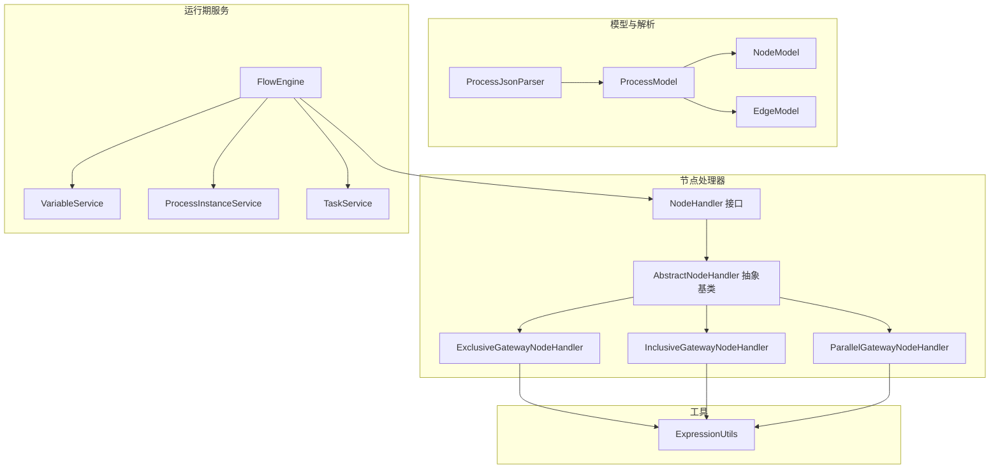
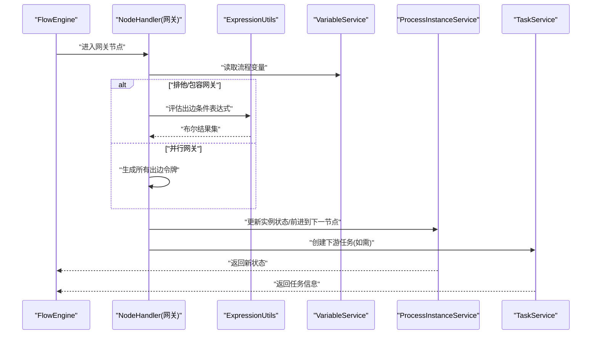
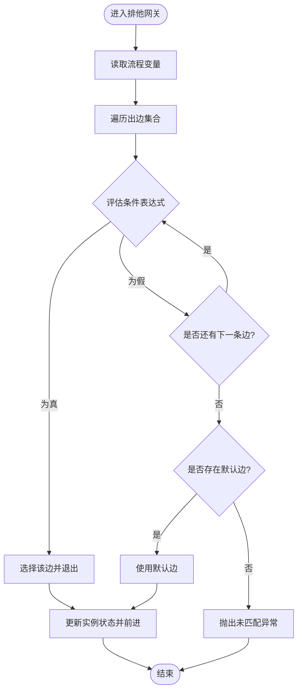
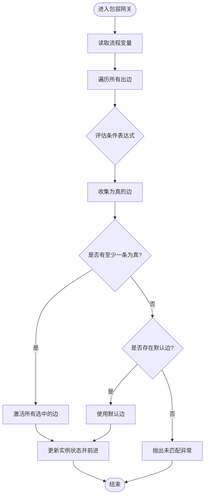
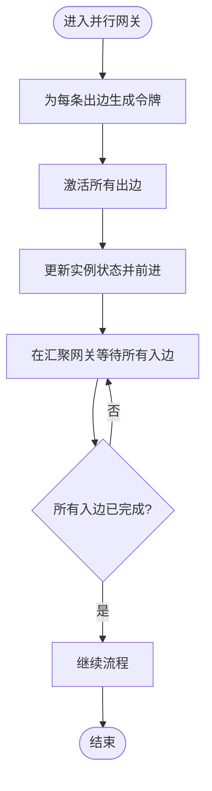
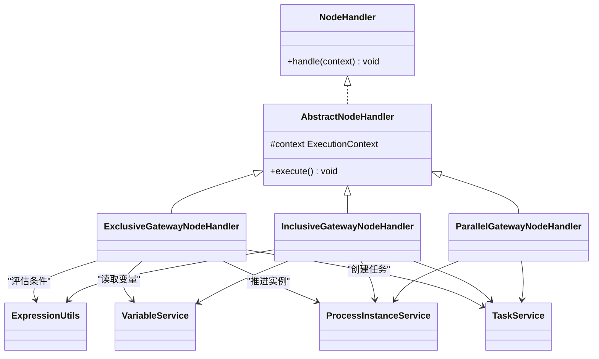

# 网关节点

<cite>
**本文引用的文件**   
- [ExclusiveGatewayNodeHandler.java](file://flow-engine/src/main/java/com/flow/engine/node/impl/ExclusiveGatewayNodeHandler.java)
- [InclusiveGatewayNodeHandler.java](file://flow-engine/src/main/java/com/flow/engine/node/impl/InclusiveGatewayNodeHandler.java)
- [ParallelGatewayNodeHandler.java](file://flow-engine/src/main/java/com/flow/engine/node/impl/ParallelGatewayNodeHandler.java)
- [AbstractNodeHandler.java](file://flow-engine/src/main/java/com/flow/engine/node/AbstractNodeHandler.java)
- [NodeHandler.java](file://flow-engine/src/main/java/com/flow/engine/node/NodeHandler.java)
- [NodeHandlerRegistry.java](file://flow-engine/src/main/java/com/flow/engine/node/NodeHandlerRegistry.java)
- [NodeHandlerAutoConfiguration.java](file://flow-engine/src/main/java/com/flow/engine/node/NodeHandlerAutoConfiguration.java)
- [FlowEngine.java](file://flow-engine/src/main/java/com/flow/engine/engine/FlowEngine.java)
- [ExpressionUtils.java](file://flow-engine/src/main/java/com/flow/engine/common/utils/ExpressionUtils.java)
- [ProcessJsonParser.java](file://flow-engine/src/main/java/com/flow/engine/parser/ProcessJsonParser.java)
- [EdgeModel.java](file://flow-engine/src/main/java/com/flow/engine/model/EdgeModel.java)
- [NodeModel.java](file://flow-engine/src/main/java/com/flow/engine/model/NodeModel.java)
- [ProcessModel.java](file://flow-engine/src/main/java/com/flow/engine/model/ProcessModel.java)
- [VariableService.java](file://flow-engine/src/main/java/com/flow/engine/service/VariableService.java)
- [ProcessInstanceService.java](file://flow-engine/src/main/java/com/flow/engine/service/ProcessInstanceService.java)
- [TaskService.java](file://flow-engine/src/main/java/com/flow/engine/service/TaskService.java)
- [NodeType.java](file://flow-engine/src/main/java/com/flow/engine/common/enums/NodeType.java)
</cite>

## 目录
1. [简介](#简介)
2. [项目结构](#项目结构)
3. [核心组件](#核心组件)
4. [架构总览](#架构总览)
5. [详细组件分析](#详细组件分析)
6. [依赖关系分析](#依赖关系分析)
7. [性能考虑](#性能考虑)
8. [故障排查指南](#故障排查指南)
9. [结论](#结论)
10. [附录](#附录)

## 简介
本技术文档聚焦于流程引擎中的三类网关节点：排他网关、包容网关与并行网关。内容涵盖其实现原理、配置方式、条件判断逻辑、分支选择策略、并发处理机制，以及表达式引擎的使用方法与性能优化建议。同时提供复杂业务流程示例（条件路由、多路径执行、同步等待等）的落地方案说明，帮助读者快速掌握在项目中正确设计与使用网关的能力。

## 项目结构
本项目采用分层与模块化组织方式，网关节点的实现位于 flow-engine 模块的 node.impl 包下，并通过统一的 NodeHandler 接口进行抽象；流程模型解析与运行时执行分别由 parser 与 engine 层负责；变量与实例状态由 service 层管理；表达式计算通过 common.utils.ExpressionUtils 暴露。

图表来源
- [NodeHandler.java](file://flow-engine/src/main/java/com/flow/engine/node/NodeHandler.java)
- [AbstractNodeHandler.java](file://flow-engine/src/main/java/com/flow/engine/node/AbstractNodeHandler.java)
- [ExclusiveGatewayNodeHandler.java](file://flow-engine/src/main/java/com/flow/engine/node/impl/ExclusiveGatewayNodeHandler.java)
- [InclusiveGatewayNodeHandler.java](file://flow-engine/src/main/java/com/flow/engine/node/impl/InclusiveGatewayNodeHandler.java)
- [ParallelGatewayNodeHandler.java](file://flow-engine/src/main/java/com/flow/engine/node/impl/ParallelGatewayNodeHandler.java)
- [ProcessJsonParser.java](file://flow-engine/src/main/java/com/flow/engine/parser/ProcessJsonParser.java)
- [ProcessModel.java](file://flow-engine/src/main/java/com/flow/engine/model/ProcessModel.java)
- [NodeModel.java](file://flow-engine/src/main/java/com/flow/engine/model/NodeModel.java)
- [EdgeModel.java](file://flow-engine/src/main/java/com/flow/engine/model/EdgeModel.java)
- [FlowEngine.java](file://flow-engine/src/main/java/com/flow/engine/engine/FlowEngine.java)
- [VariableService.java](file://flow-engine/src/main/java/com/flow/engine/service/VariableService.java)
- [ProcessInstanceService.java](file://flow-engine/src/main/java/com/flow/engine/service/ProcessInstanceService.java)
- [TaskService.java](file://flow-engine/src/main/java/com/flow/engine/service/TaskService.java)
- [ExpressionUtils.java](file://flow-engine/src/main/java/com/flow/engine/common/utils/ExpressionUtils.java)

章节来源
- [NodeType.java](file://flow-engine/src/main/java/com/flow/engine/common/enums/NodeType.java)
- [NodeHandler.java](file://flow-engine/src/main/java/com/flow/engine/node/NodeHandler.java)
- [AbstractNodeHandler.java](file://flow-engine/src/main/java/com/flow/engine/node/AbstractNodeHandler.java)
- [ExclusiveGatewayNodeHandler.java](file://flow-engine/src/main/java/com/flow/engine/node/impl/ExclusiveGatewayNodeHandler.java)
- [InclusiveGatewayNodeHandler.java](file://flow-engine/src/main/java/com/flow/engine/node/impl/InclusiveGatewayNodeHandler.java)
- [ParallelGatewayNodeHandler.java](file://flow-engine/src/main/java/com/flow/engine/node/impl/ParallelGatewayNodeHandler.java)
- [ProcessJsonParser.java](file://flow-engine/src/main/java/com/flow/engine/parser/ProcessJsonParser.java)
- [ProcessModel.java](file://flow-engine/src/main/java/com/flow/engine/model/ProcessModel.java)
- [NodeModel.java](file://flow-engine/src/main/java/com/flow/engine/model/NodeModel.java)
- [EdgeModel.java](file://flow-engine/src/main/java/com/flow/engine/model/EdgeModel.java)
- [FlowEngine.java](file://flow-engine/src/main/java/com/flow/engine/engine/FlowEngine.java)
- [VariableService.java](file://flow-engine/src/main/java/com/flow/engine/service/VariableService.java)
- [ProcessInstanceService.java](file://flow-engine/src/main/java/com/flow/engine/service/ProcessInstanceService.java)
- [TaskService.java](file://flow-engine/src/main/java/com/flow/engine/service/TaskService.java)
- [ExpressionUtils.java](file://flow-engine/src/main/java/com/flow/engine/common/utils/ExpressionUtils.java)

## 核心组件
- 网关处理器接口与抽象基类
  - NodeHandler 定义了统一的处理契约，所有节点（含网关）均遵循该接口。
  - AbstractNodeHandler 提供通用能力（如上下文访问、日志、异常封装等），网关实现继承该基类以复用公共逻辑。
- 三种网关处理器
  - 排他网关处理器：基于条件表达式选择唯一一条出边。
  - 包容网关处理器：基于条件表达式选择多条满足条件的出边。
  - 并行网关处理器：不考虑条件，直接分叉为所有出边，并在汇聚时等待全部入边完成。
- 表达式引擎
  - ExpressionUtils 提供表达式求值能力，供网关在运行时对条件进行判定。
- 流程模型与解析
  - ProcessJsonParser 将流程定义 JSON 解析为内存模型（ProcessModel/NodeModel/EdgeModel），用于运行时导航与决策。
- 运行期服务
  - FlowEngine 驱动流程推进，协调各节点处理器与服务。
  - VariableService 维护流程变量，供表达式与任务流转使用。
  - ProcessInstanceService 与 TaskService 负责实例状态与任务生命周期管理。

章节来源
- [NodeHandler.java](file://flow-engine/src/main/java/com/flow/engine/node/NodeHandler.java)
- [AbstractNodeHandler.java](file://flow-engine/src/main/java/com/flow/engine/node/AbstractNodeHandler.java)
- [ExclusiveGatewayNodeHandler.java](file://flow-engine/src/main/java/com/flow/engine/node/impl/ExclusiveGatewayNodeHandler.java)
- [InclusiveGatewayNodeHandler.java](file://flow-engine/src/main/java/com/flow/engine/node/impl/InclusiveGatewayNodeHandler.java)
- [ParallelGatewayNodeHandler.java](file://flow-engine/src/main/java/com/flow/engine/node/impl/ParallelGatewayNodeHandler.java)
- [ExpressionUtils.java](file://flow-engine/src/main/java/com/flow/engine/common/utils/ExpressionUtils.java)
- [ProcessJsonParser.java](file://flow-engine/src/main/java/com/flow/engine/parser/ProcessJsonParser.java)
- [ProcessModel.java](file://flow-engine/src/main/java/com/flow/engine/model/ProcessModel.java)
- [NodeModel.java](file://flow-engine/src/main/java/com/flow/engine/model/NodeModel.java)
- [EdgeModel.java](file://flow-engine/src/main/java/com/flow/engine/model/EdgeModel.java)
- [FlowEngine.java](file://flow-engine/src/main/java/com/flow/engine/engine/FlowEngine.java)
- [VariableService.java](file://flow-engine/src/main/java/com/flow/engine/service/VariableService.java)
- [ProcessInstanceService.java](file://flow-engine/src/main/java/com/flow/engine/service/ProcessInstanceService.java)
- [TaskService.java](file://flow-engine/src/main/java/com/flow/engine/service/TaskService.java)

## 架构总览
下图展示了网关在整体流程引擎中的位置与交互关系：FlowEngine 根据当前节点类型调度对应 NodeHandler；网关处理器读取 EdgeModel 的条件或并行语义，结合 ExpressionUtils 与 VariableService 进行分支选择或分叉/汇聚；最终通过 ProcessInstanceService 与 TaskService 更新实例与任务状态。

图表来源
- [FlowEngine.java](file://flow-engine/src/main/java/com/flow/engine/engine/FlowEngine.java)
- [ExclusiveGatewayNodeHandler.java](file://flow-engine/src/main/java/com/flow/engine/node/impl/ExclusiveGatewayNodeHandler.java)
- [InclusiveGatewayNodeHandler.java](file://flow-engine/src/main/java/com/flow/engine/node/impl/InclusiveGatewayNodeHandler.java)
- [ParallelGatewayNodeHandler.java](file://flow-engine/src/main/java/com/flow/engine/node/impl/ParallelGatewayNodeHandler.java)
- [ExpressionUtils.java](file://flow-engine/src/main/java/com/flow/engine/common/utils/ExpressionUtils.java)
- [VariableService.java](file://flow-engine/src/main/java/com/flow/engine/service/VariableService.java)
- [ProcessInstanceService.java](file://flow-engine/src/main/java/com/flow/engine/service/ProcessInstanceService.java)
- [TaskService.java](file://flow-engine/src/main/java/com/flow/engine/service/TaskService.java)

## 详细组件分析

### 排他网关（ExclusiveGateway）
- 设计目标
  - 从多条出边中选择且仅选择一条满足条件的边继续执行。
- 条件判断逻辑
  - 遍历当前节点的出边集合，依次评估每条边的条件表达式。
  - 一旦某条边的条件为真，即选中该边并终止后续评估。
  - 若没有边满足条件，则抛出异常或回退至默认边（取决于配置）。
- 分支选择策略
  - 顺序优先：按定义的顺序评估，首个为真的边胜出。
  - 默认边兜底：当无匹配条件时，可配置默认边以保证流程不中断。
- 关键实现要点
  - 通过 ExpressionUtils 对条件表达式求值。
  - 借助 VariableService 获取流程变量参与表达式计算。
  - 通过 ProcessInstanceService 推进实例状态，必要时创建下游任务。
- 流程图

图表来源
- [ExclusiveGatewayNodeHandler.java](file://flow-engine/src/main/java/com/flow/engine/node/impl/ExclusiveGatewayNodeHandler.java)
- [ExpressionUtils.java](file://flow-engine/src/main/java/com/flow/engine/common/utils/ExpressionUtils.java)
- [VariableService.java](file://flow-engine/src/main/java/com/flow/engine/service/VariableService.java)
- [ProcessInstanceService.java](file://flow-engine/src/main/java/com/flow/engine/service/ProcessInstanceService.java)

章节来源
- [ExclusiveGatewayNodeHandler.java](file://flow-engine/src/main/java/com/flow/engine/node/impl/ExclusiveGatewayNodeHandler.java)
- [ExpressionUtils.java](file://flow-engine/src/main/java/com/flow/engine/common/utils/ExpressionUtils.java)
- [VariableService.java](file://flow-engine/src/main/java/com/flow/engine/service/VariableService.java)
- [ProcessInstanceService.java](file://flow-engine/src/main/java/com/flow/engine/service/ProcessInstanceService.java)

### 包容网关（InclusiveGateway）
- 设计目标
  - 允许同时激活多条满足条件的出边，实现“多选一或多”的路径并行。
- 条件判断逻辑
  - 对所有出边逐一评估条件表达式，收集所有为真的边作为激活集合。
  - 若无任何边为真，可按默认边策略处理或报错。
- 分支选择策略
  - 全量评估：不短路，确保所有符合条件的边都被选中。
  - 合并语义：在对应的汇聚网关处等待所有已激活路径完成后再继续。
- 并发与同步
  - 激活的多条路径通常以并行方式推进，但需保证在汇聚点同步。
  - 汇聚逻辑参考并行网关的计数/令牌机制。
- 流程图

图表来源
- [InclusiveGatewayNodeHandler.java](file://flow-engine/src/main/java/com/flow/engine/node/impl/InclusiveGatewayNodeHandler.java)
- [ExpressionUtils.java](file://flow-engine/src/main/java/com/flow/engine/common/utils/ExpressionUtils.java)
- [VariableService.java](file://flow-engine/src/main/java/com/flow/engine/service/VariableService.java)
- [ProcessInstanceService.java](file://flow-engine/src/main/java/com/flow/engine/service/ProcessInstanceService.java)

章节来源
- [InclusiveGatewayNodeHandler.java](file://flow-engine/src/main/java/com/flow/engine/node/impl/InclusiveGatewayNodeHandler.java)
- [ExpressionUtils.java](file://flow-engine/src/main/java/com/flow/engine/common/utils/ExpressionUtils.java)
- [VariableService.java](file://flow-engine/src/main/java/com/flow/engine/service/VariableService.java)
- [ProcessInstanceService.java](file://flow-engine/src/main/java/com/flow/engine/service/ProcessInstanceService.java)

### 并行网关（ParallelGateway）
- 设计目标
  - 无条件分叉：进入并行网关后，立即激活所有出边；在汇聚网关处等待所有入边完成再继续。
- 并发处理机制
  - 分叉：为每个出边生成一个“令牌”，表示该路径需要独立推进。
  - 汇聚：维护计数器或令牌集合，只有当所有入边都到达时才释放令牌继续。
- 同步等待
  - 汇聚前，未完成的路径会阻塞后续推进，避免数据不一致。
- 流程图

图表来源
- [ParallelGatewayNodeHandler.java](file://flow-engine/src/main/java/com/flow/engine/node/impl/ParallelGatewayNodeHandler.java)
- [ProcessInstanceService.java](file://flow-engine/src/main/java/com/flow/engine/service/ProcessInstanceService.java)

章节来源
- [ParallelGatewayNodeHandler.java](file://flow-engine/src/main/java/com/flow/engine/node/impl/ParallelGatewayNodeHandler.java)
- [ProcessInstanceService.java](file://flow-engine/src/main/java/com/flow/engine/service/ProcessInstanceService.java)

### 表达式引擎使用方法与优化
- 使用方法
  - 在网关出边上配置条件表达式，表达式中可引用流程变量。
  - 运行时由 ExpressionUtils 对表达式求值，返回值通常为布尔型。
  - 变量通过 VariableService 读写，建议在进入网关前确保所需变量已就绪。
- 性能优化建议
  - 缓存热点变量：对频繁读写的变量建立本地缓存，减少重复计算与 IO。
  - 简化表达式：避免在表达式中进行复杂运算或远程调用，尽量前置计算。
  - 批量评估：对于包容网关的全量评估，可考虑并行化表达式求值以提升吞吐。
  - 失败重试与超时保护：对表达式求值设置超时与重试策略，防止长尾请求拖慢流程。
  - 监控与埋点：记录表达式耗时与失败率，便于定位瓶颈。

章节来源
- [ExpressionUtils.java](file://flow-engine/src/main/java/com/flow/engine/common/utils/ExpressionUtils.java)
- [VariableService.java](file://flow-engine/src/main/java/com/flow/engine/service/VariableService.java)

### 复杂业务流程示例
- 条件路由（审批金额分级）
  - 场景：根据金额区间路由到不同审批人。
  - 实现：在排他网关的各出边上配置金额区间表达式；金额变量在进入网关前由上游节点写入。
  - 关键点：确保区间互斥且覆盖完整；配置默认边以防漏判。
- 多路径执行（合规检查+风控校验）
  - 场景：同时触发合规与风控两条校验路径，任一失败则拒绝。
  - 实现：使用包容网关，两个出边条件均为真；在汇聚网关等待两者完成，再根据结果决定下一步。
  - 关键点：汇聚后的聚合逻辑需明确（如任一失败即拒绝）。
- 同步等待（并行任务汇总）
  - 场景：并行发起多个外部系统调用，待全部完成后汇总结果。
  - 实现：并行网关分叉；汇聚网关等待所有入边完成；汇总节点整合结果。
  - 关键点：汇聚前的状态一致性；异常路径的回滚或补偿策略。

[本节为概念性说明，不涉及具体代码文件]

## 依赖关系分析
- 组件耦合与内聚
  - 网关处理器高度内聚于各自分支/汇聚语义，对外仅依赖 NodeHandler 接口与通用工具。
  - 通过 ExpressionUtils 与 VariableService 解耦表达式与变量来源，提升可测试性与可替换性。
- 直接与间接依赖
  - 网关处理器直接依赖 ExpressionUtils、VariableService、ProcessInstanceService、TaskService。
  - 间接依赖模型解析器与模型对象，用于获取出边集合与条件定义。
- 潜在循环依赖
  - 当前结构未见明显循环依赖；若扩展自定义网关，应遵循单向依赖原则。
- 外部集成点
  - 表达式引擎可扩展为支持更多语言或函数库。
  - 任务与实例服务可与消息队列、工作流编排器等外部系统集成。

图表来源
- [NodeHandler.java](file://flow-engine/src/main/java/com/flow/engine/node/NodeHandler.java)
- [AbstractNodeHandler.java](file://flow-engine/src/main/java/com/flow/engine/node/AbstractNodeHandler.java)
- [ExclusiveGatewayNodeHandler.java](file://flow-engine/src/main/java/com/flow/engine/node/impl/ExclusiveGatewayNodeHandler.java)
- [InclusiveGatewayNodeHandler.java](file://flow-engine/src/main/java/com/flow/engine/node/impl/InclusiveGatewayNodeHandler.java)
- [ParallelGatewayNodeHandler.java](file://flow-engine/src/main/java/com/flow/engine/node/impl/ParallelGatewayNodeHandler.java)
- [ExpressionUtils.java](file://flow-engine/src/main/java/com/flow/engine/common/utils/ExpressionUtils.java)
- [VariableService.java](file://flow-engine/src/main/java/com/flow/engine/service/VariableService.java)
- [ProcessInstanceService.java](file://flow-engine/src/main/java/com/flow/engine/service/ProcessInstanceService.java)
- [TaskService.java](file://flow-engine/src/main/java/com/flow/engine/service/TaskService.java)

章节来源
- [NodeHandler.java](file://flow-engine/src/main/java/com/flow/engine/node/NodeHandler.java)
- [AbstractNodeHandler.java](file://flow-engine/src/main/java/com/flow/engine/node/AbstractNodeHandler.java)
- [ExclusiveGatewayNodeHandler.java](file://flow-engine/src/main/java/com/flow/engine/node/impl/ExclusiveGatewayNodeHandler.java)
- [InclusiveGatewayNodeHandler.java](file://flow-engine/src/main/java/com/flow/engine/node/impl/InclusiveGatewayNodeHandler.java)
- [ParallelGatewayNodeHandler.java](file://flow-engine/src/main/java/com/flow/engine/node/impl/ParallelGatewayNodeHandler.java)
- [ExpressionUtils.java](file://flow-engine/src/main/java/com/flow/engine/common/utils/ExpressionUtils.java)
- [VariableService.java](file://flow-engine/src/main/java/com/flow/engine/service/VariableService.java)
- [ProcessInstanceService.java](file://flow-engine/src/main/java/com/flow/engine/service/ProcessInstanceService.java)
- [TaskService.java](file://flow-engine/src/main/java/com/flow/engine/service/TaskService.java)

## 性能考虑
- 表达式求值优化
  - 预编译与缓存：对常用表达式进行预编译与结果缓存，降低重复开销。
  - 短路评估：排他网关在首个匹配后即停止后续评估，避免不必要的计算。
- 并发控制
  - 并行网关的分叉/汇聚应避免锁竞争，采用无锁计数或令牌桶模型。
  - 对汇聚等待设置超时与告警，防止死锁或长时间阻塞。
- 资源隔离
  - 对高负载网关路径进行线程池隔离，避免相互影响。
- 观测与调优
  - 采集网关进入/离开时间、分支选择耗时、汇聚等待时长等指标，持续优化。

[本节为通用指导，不涉及具体代码文件]

## 故障排查指南
- 常见问题
  - 条件未匹配：检查表达式语法与变量名是否正确；确认进入网关前变量是否已赋值。
  - 包容网关无激活路径：确认是否存在默认边或业务逻辑导致所有条件为假。
  - 并行汇聚卡住：检查是否存在未完成的入边路径；排查下游任务是否被挂起或异常。
- 诊断步骤
  - 查看流程实例状态与任务列表，确认当前所在节点与历史轨迹。
  - 打印表达式求值中间结果与变量快照，定位表达式问题。
  - 检查汇聚计数是否与分叉数量一致，排除重复或遗漏的令牌。
- 恢复策略
  - 对异常路径进行补偿或人工干预；必要时重置实例状态并重新推进。

章节来源
- [ExclusiveGatewayNodeHandler.java](file://flow-engine/src/main/java/com/flow/engine/node/impl/ExclusiveGatewayNodeHandler.java)
- [InclusiveGatewayNodeHandler.java](file://flow-engine/src/main/java/com/flow/engine/node/impl/InclusiveGatewayNodeHandler.java)
- [ParallelGatewayNodeHandler.java](file://flow-engine/src/main/java/com/flow/engine/node/impl/ParallelGatewayNodeHandler.java)
- [ProcessInstanceService.java](file://flow-engine/src/main/java/com/flow/engine/service/ProcessInstanceService.java)
- [TaskService.java](file://flow-engine/src/main/java/com/flow/engine/service/TaskService.java)

## 结论
排他、包容与并行网关构成了流程引擎的核心控制流能力。通过清晰的分支选择策略与并发同步机制，配合灵活的表达式引擎，能够支撑复杂的业务路由与协作场景。在实际工程中，应重视表达式性能、变量准备、汇聚同步与可观测性，以确保流程稳定高效地运行。

[本节为总结性内容，不涉及具体代码文件]

## 附录
- 配置要点
  - 在流程定义 JSON 中为网关节点配置出边及条件表达式；排他网关建议配置默认边。
  - 变量命名规范与版本管理，避免表达式因变量变更而失效。
- 最佳实践
  - 将复杂条件前置计算并写入变量，保持表达式简洁。
  - 对包容与并行网关的汇聚点进行充分测试，确保所有路径都能正常收敛。
  - 引入监控与告警，及时发现并处理异常路径。

[本节为补充说明，不涉及具体代码文件]